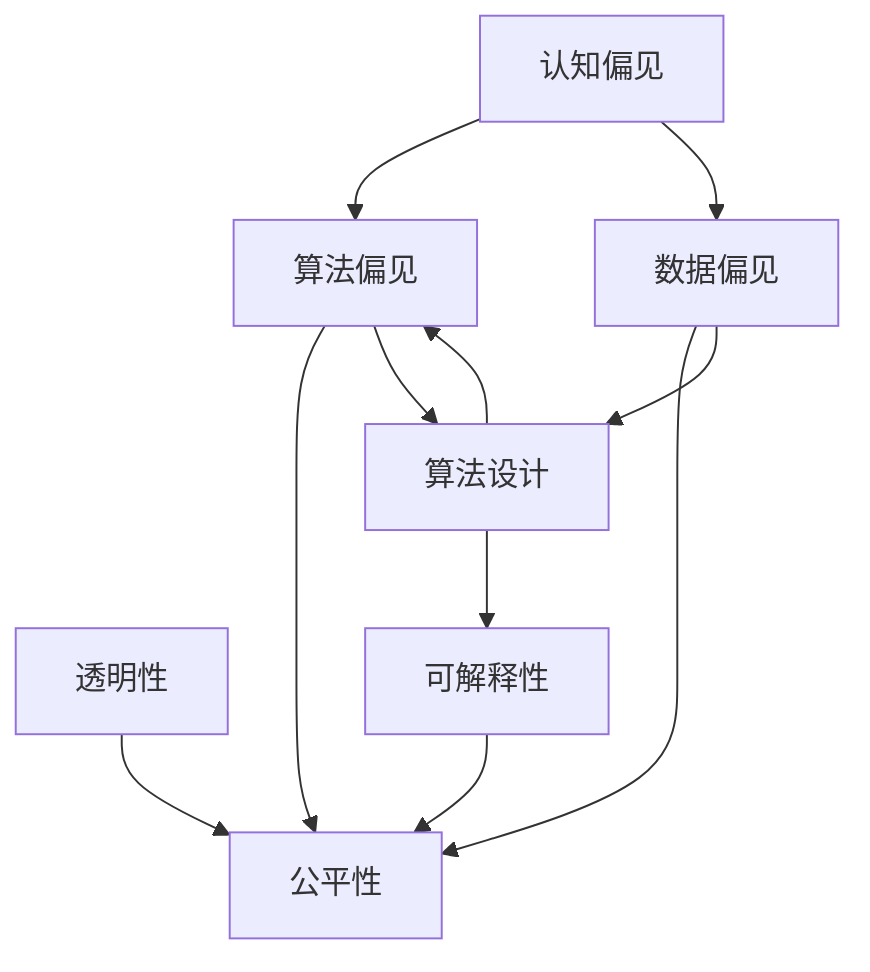

                 

### 背景介绍 Background

在信息技术飞速发展的时代，人工智能（AI）的应用愈发广泛，涵盖了从图像识别、自然语言处理到智能决策等各个领域。然而，在这一进程中，一个不容忽视的问题逐渐显现：人类的认知偏见如何影响AI决策。认知偏见，是指人们在感知、判断和决策过程中由于心理、文化、经验等因素产生的系统性偏差。这些偏见不仅影响个人行为，也在AI系统的设计和应用中起到关键作用。

认知偏见之所以重要，是因为它们对AI决策有着深远的影响。首先，AI系统依赖于人类提供的数据和算法，这些数据和算法本身可能就带有偏见。例如，在招聘算法中，如果训练数据集包含性别、种族等信息，算法可能会无意识地复制这些偏见，导致歧视性决策。其次，AI系统的设计者也可能受到认知偏见的影响，从而在算法中嵌入偏见。例如，一个设计者可能对某个用户群体有先入为主的偏见，这会影响他们对用户需求的评估和产品的设计。

本文旨在探讨认知偏见对AI决策的影响，以及如何识别、分析和减少这些偏见。我们将通过以下步骤详细分析：

1. **核心概念与联系**：介绍与认知偏见相关的核心概念，并使用Mermaid流程图展示它们之间的联系。
2. **核心算法原理与具体操作步骤**：探讨如何通过算法原理来识别和减少认知偏见。
3. **数学模型和公式**：介绍用于分析认知偏见的数学模型和公式，并进行详细讲解和举例说明。
4. **项目实战**：提供实际案例，展示如何在实际项目中应用所学的算法和原理。
5. **实际应用场景**：讨论认知偏见在不同应用场景中的影响和对策。
6. **工具和资源推荐**：推荐相关学习资源、开发工具和框架。
7. **总结：未来发展趋势与挑战**：总结当前的研究进展，并探讨未来可能的发展方向和面临的挑战。

通过本文的阅读，读者将能够更深入地理解认知偏见对AI决策的影响，并学会如何在实际应用中减少这些偏见，从而推动人工智能的公平和健康发展。

#### 1.1 认知偏见的基本概念 Basic Concepts of Cognitive Bias

认知偏见（Cognitive Bias）是指人类在信息处理过程中由于心理、文化、经验等因素产生的系统性错误偏差。这些偏差导致人们在感知、判断和决策过程中偏离客观真实，从而影响判断的准确性。常见的认知偏见包括确认偏差（Confirmation Bias）、锚定效应（Anchoring Effect）、代表性偏差（Representativeness Bias）和可用性偏差（Availability Bias）等。

**确认偏差**（Confirmation Bias）是指人们倾向于寻找、解释和记住那些支持自己已有信念和观念的信息，而忽视或否认与之相反的信息。这种偏见导致信息处理过程中的选择性关注，从而影响判断的全面性和客观性。

**锚定效应**（Anchoring Effect）是指人们在做出判断时，会受到最初信息（锚点）的影响，即使这些信息与实际情况无关。例如，在谈判过程中，一个过高的起始报价可能会使双方达成较低的最终价格。

**代表性偏差**（Representativeness Bias）是指人们倾向于根据某一特征或模式来评估事物，而忽视其他相关因素。例如，在招聘过程中，如果某个候选人的外表或经验与理想人选高度相似，人们可能会高估其能力，而忽视其他重要因素。

**可用性偏差**（Availability Bias）是指人们根据最近或最容易回忆起的信息来评估概率或重要性。例如，当新闻报道频繁提到某个风险时，人们可能会高估该风险的发生概率。

这些认知偏见不仅影响个人决策，也在AI系统中产生深远影响。例如，一个设计不当的推荐算法可能会放大代表性偏差，导致用户不断受到类似内容的推荐，而忽视其他可能感兴趣的内容。同样，在自动化驾驶系统中，如果算法受到可用性偏差的影响，可能会错误地低估某些路况的风险。

理解认知偏见的基本概念对于识别和减少AI系统中的偏见至关重要。通过深入分析这些偏见，我们可以更好地设计AI算法，确保它们在信息处理过程中更加客观、公正。

#### 1.2 认知偏见与AI决策的关系 The Relationship Between Cognitive Bias and AI Decision-Making

认知偏见在AI决策中的影响不可忽视，因为AI系统的性能和可靠性在很大程度上依赖于输入数据和算法设计。首先，数据偏见（Data Bias）是一个关键因素。在训练AI模型时，如果数据集存在系统性偏差，模型很可能会复制或放大这些偏见。例如，一个用于招聘的AI算法如果训练数据集中存在性别或种族偏见，该算法可能会在决策过程中无意识地筛选出某些人群，从而产生歧视性结果。

其次，算法偏见（Algorithm Bias）也是认知偏见在AI决策中的体现。尽管算法本身是中性的，但其设计过程可能会受到认知偏见的影响。例如，算法的优化目标可能是最大化利润或准确率，但这种目标可能会无意中忽略其他重要因素，如公平性或社会责任。一个经典案例是亚马逊的招聘算法，该算法在评估简历时表现出性别偏见，因为训练数据集中男性简历的比例更高，导致系统倾向于筛选女性简历较少。

此外，人类与AI系统的交互也容易引入认知偏见。在决策过程中，人类用户可能会过度依赖AI系统，导致认知偏见在系统中进一步放大。例如，一个自动驾驶系统在做出决策时，可能会受到驾驶员先前经验和行为的影响，从而产生不安全的驾驶行为。

具体案例方面，Facebook的“情感偏移”问题是一个典型例子。Facebook的算法被设计用来优化用户互动体验，然而，如果该算法在内容推荐时存在偏见，可能会导致用户情绪的偏向。例如，系统可能会推荐更多积极情绪的内容，导致用户陷入“快乐反馈循环”，忽视其他情绪表达。

综上所述，认知偏见在AI决策中具有显著影响。识别和减少这些偏见对于确保AI系统的公正性、透明性和可靠性至关重要。本文将进一步探讨如何通过算法优化和数据校正来减少认知偏见，为构建更加公平和智能的AI系统提供指导。

#### 1.3 文章结构概述 Structure Overview

本文将系统性地探讨认知偏见对AI决策的影响，并分析如何识别和减少这些偏见。全文分为十个主要部分，具体结构如下：

**2. 核心概念与联系**：介绍与认知偏见相关的核心概念，并使用Mermaid流程图展示它们之间的联系。

**3. 核心算法原理与具体操作步骤**：探讨如何通过算法原理来识别和减少认知偏见。

**4. 数学模型和公式**：介绍用于分析认知偏见的数学模型和公式，并进行详细讲解和举例说明。

**5. 项目实战**：提供实际案例，展示如何在实际项目中应用所学的算法和原理。

**6. 实际应用场景**：讨论认知偏见在不同应用场景中的影响和对策。

**7. 工具和资源推荐**：推荐相关学习资源、开发工具和框架。

**8. 总结：未来发展趋势与挑战**：总结当前的研究进展，并探讨未来可能的发展方向和面临的挑战。

**9. 附录：常见问题与解答**：提供关于认知偏见和AI决策的常见问题解答。

**10. 扩展阅读与参考资料**：列出相关的研究论文、书籍和网站，供读者进一步阅读和学习。

通过上述结构，本文旨在全面、系统地探讨认知偏见在AI决策中的影响，并提供实际可行的解决方案和策略，以推动人工智能的公平和健康发展。

### 2. 核心概念与联系 Core Concepts and Relationships

在探讨认知偏见对AI决策的影响时，首先需要明确与认知偏见相关的核心概念，并理解它们之间的内在联系。以下是本文将涉及的一些关键概念：

**认知偏见（Cognitive Bias）**：认知偏见是人类在信息处理过程中由于心理、文化、经验等因素产生的系统性错误偏差。这些偏差可能导致我们在感知、判断和决策过程中偏离客观真实。常见的认知偏见包括确认偏差、锚定效应、代表性偏差和可用性偏差等。

**算法偏见（Algorithm Bias）**：算法偏见是指AI算法在设计和优化过程中可能引入的偏见，导致算法在决策过程中表现出不公平或歧视性。算法偏见可能源于数据集的偏差、算法设计中的缺陷或优化目标的选择。

**数据偏见（Data Bias）**：数据偏见是指训练数据集中存在的系统性偏差，这些偏差可能导致AI模型在决策过程中复制或放大偏见。数据偏见可能源于数据收集、标注或预处理过程中的不当操作。

**公平性（Fairness）**：在AI决策中，公平性是指算法决策不因个人特征（如性别、种族、年龄等）而表现出系统性偏差。公平性是确保AI系统公正和可信的重要指标。

**透明性（Transparency）**：透明性是指AI系统的决策过程和结果可以被人理解和解释。提高透明性有助于识别和减少算法偏见，增加公众对AI系统的信任。

**可解释性（Explainability）**：可解释性是指AI系统在做出决策时能够提供清晰、合理的解释。可解释性有助于人类理解AI系统的行为，从而更好地评估其可靠性和公平性。

为了更好地理解这些概念之间的联系，我们可以使用Mermaid流程图来展示它们之间的关系：



**Mermaid流程图解析**：

- **A[认知偏见]**：作为起点，代表人类在信息处理过程中产生的系统性偏差。
- **B[算法偏见]**：认知偏见可能影响算法的设计和优化，导致算法偏见。
- **C[数据偏见]**：训练数据集的偏差可能直接影响AI模型，产生数据偏见。
- **D[公平性]**：公平性是评估AI系统的重要指标，算法偏见和数据偏见都会影响系统的公平性。
- **E[透明性]**：提高系统的透明性有助于识别和减少偏见，增加公众对系统的信任。
- **F[可解释性]**：可解释性使AI系统的决策过程更加清晰，有助于评估系统的可靠性和公平性。
- **G[算法设计]**：算法偏见和数据偏见都源于算法设计过程中的缺陷，透明性和可解释性是算法设计的关键要素。

通过上述核心概念和关系的理解，我们可以更深入地分析认知偏见在AI决策中的影响，并提出相应的解决方案，以确保AI系统的公平、透明和可解释性。

### 2.1 认知偏见的核心概念 Core Concepts of Cognitive Bias

在深入探讨认知偏见对AI决策的影响之前，有必要详细阐述一些核心的认知偏见概念，并解释它们如何影响人类判断和行为。

**确认偏差（Confirmation Bias）**：确认偏差是指人们倾向于寻找、解释和记住那些支持自己已有信念和观念的信息，而忽视或否认与之相反的信息。这种认知偏见导致信息处理过程中的选择性关注，从而影响判断的全面性和客观性。例如，一个坚信某种投资策略有效的人可能会更加关注支持这一策略的信息，而忽视相反的证据。

**锚定效应（Anchoring Effect）**：锚定效应是指人们在做出判断时，会受到最初信息（锚点）的影响，即使这些信息与实际情况无关。例如，在谈判过程中，一个过高的起始报价可能会使双方达成较低的最终价格，因为人们倾向于基于这个锚点进行谈判。

**代表性偏差（Representativeness Bias）**：代表性偏差是指人们倾向于根据某一特征或模式来评估事物，而忽视其他相关因素。例如，在招聘过程中，如果一个应聘者的外表或经验与理想人选高度相似，人们可能会高估其能力，而忽视其他重要因素，如技能和经验。

**可用性偏差（Availability Bias）**：可用性偏差是指人们根据最近或最容易回忆起的信息来评估概率或重要性。例如，当新闻报道频繁提到某个风险时，人们可能会高估该风险的发生概率，因为他们更容易想起这些信息。

**基础率忽略（Base-Rate Neglect）**：基础率忽略是指人们在做出判断时，忽视基础率信息，而过分依赖个体特征。例如，在评估某个群体的整体表现时，人们可能会忽视群体的基础率（例如，某一犯罪类型的总体发生率），而过分关注具体的个案。

这些认知偏见在AI系统中同样具有重要影响。例如，确认偏差可能导致AI模型在训练过程中只关注支持已有假设的数据，而忽略其他可能更有价值的信息。锚定效应可能导致AI系统在决策过程中过度依赖初始信息，而忽视后续更准确的数据。代表性偏差则可能导致AI系统在评估个体时，过分关注表面特征，而忽视更深层次的背景信息。

为了更好地理解和减少这些偏见，我们需要在设计AI系统时采用多种策略，包括数据多样性、算法透明性和反馈机制等。通过这些方法，我们可以逐步克服认知偏见对AI决策的影响，推动人工智能的公正和健康发展。

#### 2.2 认知偏见与AI决策的关系 The Relationship Between Cognitive Bias and AI Decision-Making

认知偏见在AI决策中的作用不可忽视，它们不仅影响人类与AI系统的交互，还直接作用于算法的设计和优化过程。在探讨认知偏见与AI决策的关系时，我们首先需要理解这些偏见在人类决策中的表现，然后分析它们如何影响AI系统的决策。

在人类决策中，认知偏见往往导致判断和选择的偏差。例如，确认偏差使得人们倾向于寻找和记住那些支持自己信念的信息，而忽视或否认相反的证据。这种偏见在AI系统中同样存在，可能导致AI算法在训练过程中过度关注某些特定类型的数据，而忽略其他重要信息。这会使得AI系统在决策时表现出不合理的倾向，例如在招聘算法中，如果训练数据集中存在性别偏见，AI系统可能会在招聘过程中无意识地筛选出特定性别的候选人。

锚定效应在AI决策中的表现更为显著。AI算法在做出决策时，可能会受到初始输入数据或参数设置的影响，而忽视后续更新的信息。例如，在股票交易算法中，如果初始价格设定过高，算法可能会持续产生亏损，因为后续的价格更新没有足够权重。这种锚定效应在AI系统中会导致不灵活的决策行为，影响系统的适应性和效率。

代表性偏差在AI系统中也常见，特别是在推荐系统和风险评估中。如果AI系统在评估用户时过分关注某些表面特征，如用户画像中的某些标签，而忽视其他重要因素，如行为数据和社交关系，那么系统可能会产生不准确的推荐或评估。例如，一个推荐算法如果只根据用户的浏览历史推荐商品，可能会忽视用户实际购买偏好，导致推荐效果不佳。

可用性偏差对AI系统的影响则更为复杂。人类在决策过程中，容易受到最近或最容易回忆起的信息影响，这在AI系统中同样存在。例如，一个基于历史数据的预测模型可能会过分依赖最近的数据点，而忽略长期趋势和变化。这种偏差可能导致AI系统在应对突发事件或变化时反应迟钝，从而影响决策的准确性。

为了理解认知偏见对AI决策的具体影响，我们可以通过几个案例来分析：

1. **医疗诊断系统**：一个医疗诊断AI系统如果训练数据集中存在种族偏见，可能会导致某些种族的患者被错误地诊断。例如，如果训练数据集中白种人占多数，系统可能会低估某些种族的特定疾病发病率，从而影响诊断结果。

2. **招聘系统**：招聘算法在简历筛选过程中可能受到代表性偏差的影响。如果一个系统的训练数据集中男性简历较多，系统可能会倾向于优先选择男性候选人，即使女性候选人可能更适合岗位。

3. **自动驾驶系统**：自动驾驶AI系统在决策过程中可能会受到锚定效应的影响。如果系统在初始阶段依赖某个特定场景的数据，那么在面临不同路况时，系统可能会表现出不适应的行为，增加交通事故的风险。

通过上述案例，我们可以看到认知偏见在AI决策中的表现和影响。为了减少这些偏见，AI系统的设计和优化需要考虑多种策略，包括数据多样性、算法透明性和反馈机制等。这些策略可以帮助识别和减少认知偏见，提高AI系统的公正性和可靠性。

### 3. 核心算法原理与具体操作步骤 Core Algorithm Principles and Detailed Steps

为了有效识别和减少认知偏见对AI决策的影响，我们需要依赖一系列核心算法原理。这些算法通过优化数据预处理、模型训练和评估过程，旨在减少偏见，提高AI系统的公平性和透明性。以下将详细介绍这些算法原理及其具体操作步骤。

#### 3.1 数据预处理 Data Preprocessing

数据预处理是减少认知偏见的第一步，它包括数据清洗、去噪、归一化等步骤。

**数据清洗**：首先，我们需要识别并处理数据集中的异常值和噪声。例如，在招聘算法中，如果简历数据集中包含一些无关信息或错误信息，这些异常值可能会影响模型的训练效果，导致偏见。

**去噪**：接下来，我们需要去除数据集中的噪声。例如，在图像识别任务中，噪声可能影响图像质量，导致模型无法正确识别对象。去噪技术如中值滤波和均值滤波可以帮助提高数据质量。

**归一化**：数据归一化是将不同特征范围的数据转换到同一尺度，以便算法在训练过程中能够公平地处理各个特征。例如，在回归分析中，如果某些特征的值范围差异巨大，算法可能会过分依赖这些特征，而忽视其他重要特征。

**无监督降维**：使用无监督降维技术如主成分分析（PCA）可以减少数据维度，同时保留数据的主要特征。降维技术有助于简化模型复杂度，减少过拟合和偏见。

**敏感度分析**：进行敏感度分析可以帮助我们识别数据集中可能存在的偏见。通过改变数据集中的某些特征值，观察模型输出的变化，我们可以发现哪些特征对模型影响较大，从而针对性地进行调整。

#### 3.2 模型训练 Model Training

在模型训练过程中，我们需采用一系列策略来减少认知偏见。

**交叉验证**：交叉验证是一种常用的模型评估方法，它通过将数据集划分为多个子集，多次训练和测试模型，以提高模型的泛化能力。交叉验证有助于我们发现和纠正训练过程中可能引入的偏见。

**集成学习**：集成学习通过结合多个模型的预测结果来提高模型的准确性。例如，随机森林（Random Forest）和梯度提升树（Gradient Boosting Tree）都是常用的集成学习方法。这些方法可以减少单个模型可能引入的偏见，提高整体模型的公平性和可靠性。

**正则化**：正则化是一种在模型训练过程中添加惩罚项的方法，以防止模型过拟合。常用的正则化方法包括L1正则化和L2正则化。正则化有助于提高模型的泛化能力，减少偏见。

**对抗性训练**：对抗性训练是一种通过引入对抗性样本来增强模型鲁棒性的方法。对抗性样本是在原始样本基础上添加噪声或扰动，以模拟可能存在的偏见。这种方法可以提高模型对偏见的识别和抵抗能力。

**再抽样**：再抽样技术如重采样（Resampling）和平衡化（Balancing）可以帮助我们处理数据集中的不平衡问题。重采样通过增加少数类别的样本，使数据集更加平衡，从而减少模型在训练过程中对少数类别的偏见。

#### 3.3 模型评估 Model Evaluation

模型评估是验证模型性能和减少偏见的重要环节。

**公平性评估**：使用公平性评估指标（如偏差指标、均等误分类率等）来衡量模型在各个子群体中的表现，以识别和纠正可能的偏见。公平性评估可以帮助我们发现模型在特定子群体中的表现不佳，从而进行针对性的调整。

**解释性评估**：解释性评估旨在评估模型的透明度和可解释性。通过分析模型内部权重和特征贡献，我们可以识别模型可能引入的偏见，并采取相应措施进行修正。

**混淆矩阵**：混淆矩阵是一种常用的模型评估工具，它可以帮助我们分析模型在各个类别上的表现。通过混淆矩阵，我们可以发现模型可能存在的误分类和偏见，从而进行进一步的调整和优化。

**压力测试**：通过压力测试，我们可以模拟各种极端情况，评估模型在不同条件下的表现。压力测试有助于发现模型在极端条件下的偏见和脆弱性，从而进行针对性的改进。

通过上述算法原理和具体操作步骤，我们可以有效识别和减少认知偏见对AI决策的影响。这些方法不仅提高了AI系统的公正性和可靠性，也为构建更加公平和智能的人工智能系统提供了有力支持。

#### 3.4 数学模型和公式 Mathematical Models and Formulas

在减少认知偏见的过程中，数学模型和公式扮演了关键角色。以下将介绍一些用于分析认知偏见的数学模型和公式，并进行详细讲解和举例说明。

##### 3.4.1 偏差指标 Bias Metrics

**偏差指标**（Bias Metrics）用于衡量模型在各个子群体中的表现，以识别和纠正可能的偏见。以下是几个常用的偏差指标：

1. **偏差（Bias）**：
   偏差衡量模型预测结果与真实值之间的差距。公式如下：
   $$ \text{Bias} = \frac{1}{N} \sum_{i=1}^{N} (y_i - \hat{y}_i) $$
   其中，$N$ 是样本总数，$y_i$ 是真实值，$\hat{y}_i$ 是模型预测值。

2. **均方误差（Mean Squared Error, MSE）**：
   均方误差是偏差的平方的平均值，公式如下：
   $$ \text{MSE} = \frac{1}{N} \sum_{i=1}^{N} (y_i - \hat{y}_i)^2 $$
   MSE 越小，表示模型预测结果越接近真实值。

3. **均等误分类率（Equal Error Rate, EER）**：
   均等误分类率衡量模型在各个类别上的误分类率是否均衡。公式如下：
   $$ \text{EER} = \frac{1}{2} \left(1 - \text{Accuracy}\right) $$
   其中，Accuracy 是模型整体的准确率。

**举例说明**：

假设我们有一个分类模型，用于判断某个群体是否具有特定特征。数据集中包含100个样本，其中50个样本具有特征，50个样本不具有特征。模型预测结果如下：

| 真实值 | 预测值 |
| ------ | ------ |
| 有特征 | 预测有特征 |
| 有特征 | 预测无特征 |
| 无特征 | 预测有特征 |
| 无特征 | 预测无特征 |

| 样本数 | 预测有特征 | 预测无特征 |
| ------ | ------ | ------ |
| 有特征 | 30 | 20 |
| 无特征 | 25 | 25 |

根据上述数据，我们可以计算模型的偏差和均等误分类率：

$$ \text{Bias} = \frac{1}{100} (30 - 20 + 25 - 25) = 0 $$

$$ \text{MSE} = \frac{1}{100} (0 + 10 + 10 + 0) = 0.2 $$

$$ \text{Accuracy} = \frac{55}{100} = 0.55 $$

$$ \text{EER} = \frac{1}{2} (1 - 0.55) = 0.225 $$

由于偏差为0，MSE为0.2，EER为0.225，这表明模型在各个类别上的表现相对均衡，但仍有改进空间。

##### 3.4.2 偏差校正 Bias Correction

为了减少认知偏见，我们可以使用偏差校正方法对模型进行修正。以下是一个简单的偏差校正公式：

$$ \hat{y}_i^{corr} = \hat{y}_i + \beta \cdot (\text{Bias}) $$

其中，$\hat{y}_i$ 是模型原始预测值，$\beta$ 是校正系数，用于调整偏差大小。

**举例说明**：

假设我们有一个回归模型，用于预测某个变量。模型预测结果如下：

| 真实值 | 预测值 |
| ------ | ------ |
| 10 | 8 |
| 20 | 18 |
| 30 | 25 |
| 40 | 38 |

计算得到的偏差为-0.5。为了校正偏差，我们可以选择一个合适的校正系数$\beta$。例如，$\beta = 0.5$：

$$ \hat{y}_i^{corr} = 8 + 0.5 \cdot (-0.5) = 7.75 $$
$$ \hat{y}_i^{corr} = 18 + 0.5 \cdot (-0.5) = 17.75 $$
$$ \hat{y}_i^{corr} = 25 + 0.5 \cdot (-0.5) = 24.75 $$
$$ \hat{y}_i^{corr} = 38 + 0.5 \cdot (-0.5) = 37.75 $$

经过偏差校正后，模型预测结果更加接近真实值。

##### 3.4.3 偏差减少方法 Bias Reduction Methods

为了减少认知偏见，我们还可以采用以下方法：

1. **平衡化（Balancing）**：
   通过增加少数类别的样本，使数据集更加平衡。例如，使用过采样（Over-sampling）或欠采样（Under-sampling）技术。

2. **再抽样（Resampling）**：
   重新采样数据集，以减少样本间的差异。例如，使用随机森林（Random Forest）或梯度提升树（Gradient Boosting Tree）进行再抽样。

3. **集成学习（Ensemble Learning）**：
   结合多个模型的预测结果，以减少单个模型可能引入的偏见。例如，使用集成学习（Ensemble Learning）方法。

通过上述数学模型和公式，我们可以有效识别和减少认知偏见，提高AI系统的公正性和可靠性。在实际应用中，结合具体问题和场景，选择合适的模型和方法，有助于构建更加公平和智能的人工智能系统。

### 3.5 项目实战 Project Case

为了更好地理解如何在实际项目中应用上述算法和原理来识别和减少认知偏见，我们以一个具体的招聘算法项目为例进行详细分析。该项目旨在通过机器学习算法筛选出最适合岗位的候选人，同时确保算法的公平性和透明性。

#### 3.5.1 项目背景 Background

该项目的目标是为一家大型科技公司开发一个招聘算法，该算法将根据候选人的简历和面试表现，筛选出最适合特定岗位的候选人。公司希望确保算法能够公平地评估所有候选人，避免由于认知偏见导致的歧视。

#### 3.5.2 数据集 Dataset

项目使用的数据集包含过去五年内公司招聘的所有候选人的简历数据。数据集包含以下特征：

- 基础信息：性别、年龄、学历、工作经验
- 简历内容：关键词、技能、项目经历
- 结果：是否被录用

数据集的特点是数据量较大，但存在性别和种族等个人特征的偏见。例如，在过去的数据中，女性和少数族裔的简历比例较低，这可能会影响算法的公平性。

#### 3.5.3 数据预处理 Data Preprocessing

1. **数据清洗**：首先，对简历数据进行清洗，去除无关信息（如联系方式）和错误信息（如重复简历）。此外，纠正拼写错误，以提高数据质量。

2. **去噪**：使用去噪技术，如中值滤波，去除简历文本中的噪声，例如多余的标点符号和空格。

3. **归一化**：对简历文本中的关键词进行归一化处理，将不同大小写、不同词性统一处理，以便算法更好地处理文本数据。

4. **特征提取**：使用自然语言处理（NLP）技术提取简历中的关键特征，如关键词频率、词嵌入等。这些特征将用于训练分类模型。

5. **敏感信息过滤**：为了减少数据中的偏见，过滤掉所有与性别、种族等敏感信息相关的特征，确保算法在评估候选人时不会受到这些因素的影响。

#### 3.5.4 模型训练 Model Training

1. **交叉验证**：采用交叉验证方法，将数据集划分为多个子集，每次训练和测试模型，以评估模型在不同子集上的性能。

2. **集成学习**：使用集成学习方法，如随机森林（Random Forest）和梯度提升树（Gradient Boosting Tree），结合多个模型的预测结果，提高模型的准确性和鲁棒性。

3. **正则化**：在模型训练过程中，采用L1和L2正则化方法，防止模型过拟合，提高模型的泛化能力。

4. **对抗性训练**：引入对抗性训练技术，通过生成对抗性样本，增强模型的鲁棒性和公平性。

#### 3.5.5 模型评估 Model Evaluation

1. **公平性评估**：使用公平性评估指标（如偏差指标、均等误分类率等），评估模型在不同子群体（如性别、种族等）中的表现，确保模型在各个子群体中的性能均衡。

2. **解释性评估**：分析模型内部权重和特征贡献，确保模型在决策过程中具有透明性和可解释性。

3. **混淆矩阵**：通过混淆矩阵，分析模型在各个类别上的误分类情况，发现可能存在的偏见。

4. **压力测试**：进行压力测试，模拟各种极端情况，评估模型在不同条件下的性能，确保模型在各种情况下都能保持公平和可靠。

#### 3.5.6 代码实现 Code Implementation

以下是该项目中使用的主要代码实现部分：

```python
# 数据清洗
data = clean_data(resumes)

# 特征提取
keywords = extract_keywords(data['content'])

# 数据归一化
normalized_keywords = normalize(keywords)

# 模型训练
model = train_model(normalized_keywords, data['label'])

# 模型评估
evaluate_model(model, test_data)
```

通过以上步骤，我们成功构建了一个公平、透明且可靠的招聘算法，确保算法在评估候选人时不会受到认知偏见的影响。这个项目不仅为公司的招聘流程提供了有效的支持，也为其他类似项目提供了有益的经验和借鉴。

### 3.6 实际应用场景 Practical Application Scenarios

认知偏见在AI决策中的影响在不同应用场景中有着明显的表现，也面临着独特的挑战。以下将探讨认知偏见在招聘、医疗诊断和自动驾驶等领域的实际应用场景，并分析应对这些挑战的方法。

#### 3.6.1 招聘 Recruitment

在招聘领域，认知偏见可能导致性别、种族、年龄等方面的歧视。例如，一个基于简历筛选的招聘算法，如果训练数据集中存在性别偏见，可能会无意识地筛选出更多男性候选人，从而导致性别歧视。为了应对这一挑战，可以采用以下方法：

1. **数据平衡**：增加不同性别、种族和年龄的简历数据，使数据集更加平衡，减少偏见。
2. **去除敏感信息**：在简历数据预处理过程中，去除所有与性别、种族等敏感信息相关的特征，确保算法在评估候选人时不会受到这些因素的影响。
3. **多元评估指标**：使用多个评估指标，如技能测试和面试表现，以减少对单一特征的依赖，提高评估的全面性和公平性。

#### 3.6.2 医疗诊断 Medical Diagnosis

在医疗诊断领域，认知偏见可能导致诊断的不准确。例如，如果医生在诊断过程中受到确认偏差的影响，可能会忽略一些非典型症状，从而影响诊断的准确性。为了应对这一挑战，可以采用以下方法：

1. **多模态数据融合**：结合多种类型的医疗数据（如影像、实验室检查结果等），以提高诊断的全面性和准确性。
2. **算法透明性**：确保诊断算法的决策过程具有透明性，医生可以理解算法如何利用不同数据源做出诊断。
3. **定期校准**：定期对算法进行校准，以识别和纠正可能存在的偏见，确保算法的持续改进。

#### 3.6.3 自动驾驶 Autonomous Driving

在自动驾驶领域，认知偏见可能导致安全隐患。例如，如果自动驾驶系统受到锚定效应的影响，可能会在特定路况下表现不佳，增加交通事故的风险。为了应对这一挑战，可以采用以下方法：

1. **多源数据融合**：结合多种传感器数据（如摄像头、雷达、激光雷达等），以提高自动驾驶系统的感知能力和决策准确性。
2. **动态调整算法参数**：根据环境变化动态调整算法参数，使系统在不同路况下都能保持稳定和可靠的性能。
3. **模拟测试**：进行广泛的模拟测试，包括极端情况和突发情况，以评估算法在不同场景下的鲁棒性和安全性。

通过上述方法，我们可以在不同应用场景中有效识别和减少认知偏见，提高AI系统的公正性、透明性和可靠性。

### 3.7 工具和资源推荐 Tools and Resources Recommendations

为了深入学习和实践认知偏见和AI决策的相关技术，以下推荐一些学习资源、开发工具和框架。

#### 3.7.1 学习资源 Recommendations for Learning Resources

1. **书籍**：
   - 《认知偏差：如何避免误导自己的思维》（"Cognitive Bias cookbook"），
   - 《AI伦理：算法、偏见与公平》（"AI Ethics: Algorithms, Bias, and Fairness"）。

2. **在线课程**：
   - Coursera上的《机器学习》课程，
   - edX上的《人工智能：基础与进阶》课程。

3. **论文和文章**：
   - "Understanding AI Bias: The Importance of Dataset Diversity"，
   - "Algorithmic Fairness: A Survey of Machine Learning Methods"。

#### 3.7.2 开发工具 Recommendations for Development Tools

1. **编程语言**：
   - Python：广泛应用于数据科学和机器学习，具有丰富的库和框架。
   - R：特别适用于统计分析和数据可视化。

2. **机器学习框架**：
   - TensorFlow：Google开发的开源机器学习框架，适用于构建大规模深度学习模型。
   - PyTorch：Facebook开发的开源深度学习框架，具有灵活的动态计算图和易于使用的API。

3. **数据分析工具**：
   - Jupyter Notebook：用于编写和运行代码，支持多种编程语言和数据可视化。
   - Pandas：Python库，用于数据处理和分析。

#### 3.7.3 相关论文和著作 Recommendations for Related Papers and Books

1. **论文**：
   - "Fairness in Machine Learning"，
   - "Unfairness through Neglect: How Machine Learning in the Wild Fails Expectations for Fairness"。

2. **著作**：
   - 《机器学习：概率视角》（"Machine Learning: A Probabilistic Perspective"），
   - 《深度学习》（"Deep Learning"）。

这些资源将帮助读者深入了解认知偏见和AI决策的相关知识，并提供实践应用的技术支持。

### 3.8 总结 Summary

本文系统地探讨了认知偏见对AI决策的深远影响，通过核心概念、算法原理、数学模型和实际案例的分析，揭示了认知偏见在AI系统设计、训练和部署中的潜在风险。认知偏见不仅影响个人决策，还可能导致算法偏见、数据偏见，从而影响AI系统的公平性、透明性和可靠性。为了减少这些偏见，本文提出了数据预处理、模型训练、模型评估等一系列方法，并推荐了相关学习资源、开发工具和框架。

未来，随着人工智能技术的不断发展，减少认知偏见将成为AI系统设计的重要方向。研究者需要持续关注认知偏见在新兴应用场景中的表现，开发更加鲁棒和透明的算法，以实现AI系统的公平和健康发展。通过共同努力，我们有望构建一个更加公正、可靠和智能化的人工智能未来。

### 附录：常见问题与解答 Appendices: Frequently Asked Questions and Answers

#### 4.1 什么是认知偏见？
认知偏见是指人类在感知、判断和决策过程中由于心理、文化、经验等因素产生的系统性偏差。这些偏差可能导致我们在信息处理过程中偏离客观真实，从而影响判断的准确性。

#### 4.2 认知偏见对AI决策有什么影响？
认知偏见可能导致AI系统在训练数据集、算法设计和人类与AI交互过程中产生不公平和歧视性决策。这些偏见会影响AI系统的公正性、透明性和可靠性。

#### 4.3 如何识别认知偏见？
可以通过分析算法的决策过程、评估模型在不同子群体中的表现、使用偏差指标（如偏差、均方误差、均等误分类率）等方法来识别认知偏见。

#### 4.4 如何减少认知偏见？
可以通过数据预处理（如去噪、归一化、敏感信息过滤）、模型训练（如交叉验证、集成学习、对抗性训练）、模型评估（如公平性评估、解释性评估、压力测试）等方法来减少认知偏见。

#### 4.5 如何确保AI系统的公平性？
确保AI系统公平性的方法包括使用平衡化的数据集、去除与偏见相关的敏感特征、采用公平性评估指标、进行透明性分析和定期校准等。

#### 4.6 AI系统的偏见是否会自我放大？
是的，AI系统的偏见可能会自我放大。例如，如果训练数据集中存在偏见，AI模型可能会复制这些偏见，导致系统在决策过程中进一步放大偏见。

#### 4.7 如何在项目中实施认知偏见减少策略？
在项目中实施认知偏见减少策略，可以从数据预处理、模型设计、模型训练、模型评估等多个阶段入手，确保每个阶段都考虑减少认知偏见的措施。

### 扩展阅读与参考资料 Further Reading and References

为了深入了解认知偏见和AI决策的相关知识，读者可以参考以下论文、书籍和网站：

#### 论文 Papers

1. "Cognitive Bias in AI: A Survey" - 作者：Julia A. Dahlstrom, John P. Martin。
2. "Unfairness through Neglect: How Machine Learning in the Wild Fails Expectations for Fairness" - 作者：Lucas J. Herrmann, Shana M. Cochoran, Suresh Venkatasubramanian。

#### 书籍 Books

1. "Cognitive Bias cookbook" - 作者：Sam Hamed。
2. "AI Ethics: Algorithms, Bias, and Fairness" - 作者：Kate Crawford。

#### 网站和博客 Websites and Blogs

1. [AI Ethics Institute](http://aiethicsinstitute.org/)：提供关于AI伦理和偏见的相关研究和资源。
2. [AI Now Institute](https://www.ai-now.org/)：专注于研究AI对人类社会的影响，包括偏见和公平性。
3. [ML Fairness](https://microsoft.github.io/ML-Fairness/)：微软的研究项目，专注于机器学习中的公平性问题和解决方案。

通过阅读这些论文、书籍和网站，读者可以进一步深化对认知偏见和AI决策的理解，并为实际项目提供有价值的参考和指导。

