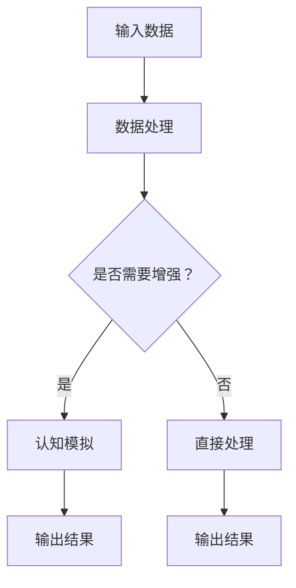
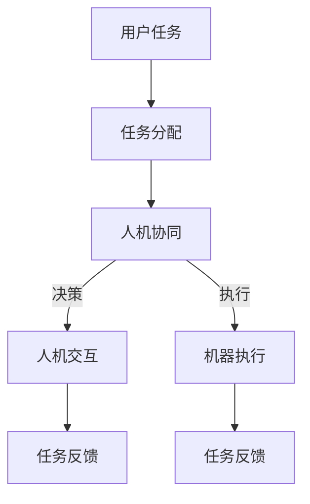

                 

### 背景介绍

认知增强与人机协作的概念近年来在人工智能（AI）领域引起了广泛关注。随着计算能力的不断提升和数据的爆炸性增长，人类与机器之间的协作正在发生革命性的变化。传统的知识工作模式受到挑战，而认知增强技术正逐步成为提升工作效率和决策质量的关键。

首先，我们需要明确什么是认知增强。认知增强是指通过技术手段扩展或增强人类大脑的认知能力，使得个体能够更有效地处理复杂的信息和任务。这包括但不限于记忆增强、注意力管理、信息检索和问题解决能力的提升。而人机协作则强调人与机器之间的相互作用，通过整合各自的优势，实现协同工作。

认知增强与人机协作的结合，旨在解决知识工作中面临的一些关键问题。例如，数据过载导致的信息筛选难题，复杂的决策分析需要，以及日益增长的专业知识要求等。通过认知增强技术，机器可以帮助人类更快速地分析和理解海量数据，从而提供更加精准的洞察。同时，人机协作使得机器能够辅助人类执行重复性或高复杂度的任务，从而解放人类的时间和精力，专注于更有创造性和战略性的工作。

### 核心概念与联系

#### 认知增强

认知增强的核心在于利用计算机技术和算法模拟或增强人类大脑的认知过程。以下是一个简化的 Mermaid 流程图，描述了认知增强的主要原理和组成部分：



1. **输入数据**：数据可以是文本、图像、声音等多种形式，它们通过传感器或用户输入进入系统。
2. **数据处理**：系统对输入数据进行预处理，例如去噪、格式化等。
3. **是否需要增强？**：判断任务难度和认知负荷，以决定是否需要增强。
4. **认知模拟**：如果需要增强，系统会通过算法模拟人类大脑的认知过程，如记忆、注意力和推理等。
5. **输出结果**：无论是直接处理还是经过认知模拟，最终都会输出结果，提供给用户或用于后续分析。

#### 人机协作

人机协作则关注如何将人类和机器的能力有机结合。以下是一个简化的 Mermaid 流程图，展示了人机协作的基本原理和步骤：



1. **用户任务**：用户定义或提交需要完成的任务。
2. **任务分配**：系统根据任务的特点和机器的能力，将任务分配给人类或机器。
3. **人机协同**：当任务复杂或需要创造性思维时，人类和机器协同完成任务。
4. **决策**：在协同过程中，人类和机器共同做出决策，优化任务完成效果。
5. **人机交互**：人类和机器通过交互界面进行沟通，确保任务顺利进行。
6. **任务反馈**：任务完成后，系统收集反馈，用于改进后续协作。

通过这两个核心概念的联系，我们可以看到认知增强为人机协作提供了技术基础，使得人类能够在更广泛的领域与机器高效协作。这种结合不仅提升了知识工作的效率，还促进了创新和决策质量的提升。

### 核心算法原理 & 具体操作步骤

在认知增强和人机协作的框架下，核心算法的设计与实现至关重要。以下将详细探讨几个关键算法的原理及其实际操作步骤。

#### 算法1：深度学习中的记忆增强

深度学习（Deep Learning）是认知增强的重要工具之一。以下是一个基于深度学习中的记忆增强算法的实例，其原理和步骤如下：

**原理：**
记忆增强算法通过神经网络模型，如长短期记忆网络（LSTM）或图神经网络（Graph Neural Network，GNN），增强对信息的记忆和检索能力。

**步骤：**

1. **数据收集与预处理：**
   - 收集大量带有标签的数据集，例如文本、图像或声音。
   - 对数据进行预处理，包括去噪、标准化和格式化。

2. **构建神经网络模型：**
   - 选择合适的神经网络架构，如LSTM或GNN。
   - 设计神经网络结构，包括层数、神经元数量和激活函数。

3. **训练神经网络：**
   - 使用预处理后的数据集，对神经网络进行训练。
   - 通过反向传播算法优化模型参数，最小化损失函数。

4. **记忆增强：**
   - 在训练过程中，神经网络学习到如何记忆和检索信息。
   - 通过加强神经网络的记忆能力，提高对信息的理解和利用效率。

5. **应用与评估：**
   - 将训练好的模型应用于实际问题，如信息检索、问答系统等。
   - 评估模型性能，通过准确率、响应时间等指标衡量效果。

**示例：**
假设我们要构建一个基于LSTM的记忆增强系统，用于文本信息的检索。以下是具体的操作步骤：

1. **数据收集与预处理：**
   - 收集大量的文本数据，如百科全书、新闻报道等。
   - 使用自然语言处理（NLP）技术，对文本数据进行预处理，如分词、词性标注和去停用词。

2. **构建LSTM模型：**
   - 设计一个包含多个隐藏层的LSTM模型。
   - 选择合适的激活函数，如ReLU或Sigmoid。

3. **训练LSTM模型：**
   - 使用预处理后的数据集，对LSTM模型进行训练。
   - 调整学习率、批量大小等超参数，以优化训练过程。

4. **记忆增强：**
   - 在训练过程中，LSTM模型学会了如何记忆和检索文本信息。
   - 当用户输入查询文本时，模型能够迅速检索相关记忆信息，提供准确的答案。

5. **应用与评估：**
   - 将训练好的模型部署到线上服务中，供用户使用。
   - 收集用户反馈和数据，评估模型在真实场景中的性能。

通过上述算法，我们可以看到记忆增强在提高信息检索效率和准确率方面具有显著优势。这不仅解放了人类的工作负担，还提升了知识工作的整体质量。

#### 算法2：强化学习与人机协作

强化学习（Reinforcement Learning，RL）是人机协作中的一种重要算法，它通过试错和反馈机制，帮助机器和人类共同优化决策过程。以下是一个基于强化学习的示例算法及其操作步骤：

**原理：**
强化学习通过奖励机制，使机器不断学习和优化策略，以实现最大化奖励的目标。在人机协作中，人类可以提供即时反馈，指导机器改进其行为。

**步骤：**

1. **环境定义：**
   - 确定系统的环境和状态空间，例如用户任务和工作流程。

2. **定义动作空间：**
   - 确定机器可以采取的动作集合，例如文本生成、图像标注等。

3. **初始化参数：**
   - 初始化强化学习算法的参数，如学习率、奖励函数等。

4. **训练过程：**
   - 机器在环境中执行动作，并根据环境反馈调整策略。
   - 通过试错，机器逐渐学习到最优动作序列。

5. **人机协作：**
   - 人类提供即时反馈，指导机器改进策略。
   - 机器根据人类反馈，调整其行为，以实现更好的协作效果。

6. **评估与优化：**
   - 评估机器在协作中的性能，如准确率、响应时间等。
   - 根据评估结果，进一步优化算法参数和策略。

**示例：**
假设我们要构建一个文本生成系统，通过强化学习实现人与机器的协作。以下是具体的操作步骤：

1. **环境定义：**
   - 确定文本生成的环境和状态空间，例如文本长度、主题等。

2. **定义动作空间：**
   - 确定机器可以生成文本的单词集合。

3. **初始化参数：**
   - 初始化强化学习算法的参数，如学习率、奖励函数等。

4. **训练过程：**
   - 机器开始生成文本，并根据用户反馈调整生成策略。
   - 通过不断试错，机器逐渐学习到生成高质量文本的最优策略。

5. **人机协作：**
   - 用户可以即时提供反馈，指导机器生成更符合需求的文本。
   - 机器根据用户反馈，调整生成策略，提高文本质量。

6. **评估与优化：**
   - 评估机器生成的文本质量，如准确率、流畅性等。
   - 根据评估结果，进一步优化算法参数和生成策略。

通过强化学习，我们可以实现机器与人类的高效协作，使得文本生成系统更加智能和灵活。这不仅提高了知识工作的效率，还提升了用户体验。

#### 算法3：基于注意力机制的图像识别

基于注意力机制的图像识别算法是认知增强和人机协作中另一个重要工具。以下是一个基于注意力机制的图像识别算法的原理和步骤：

**原理：**
注意力机制通过识别图像中的重要区域，提高识别的准确性和效率。在图像识别任务中，注意力机制可以帮助机器聚焦于关键特征，从而减少计算量和提高识别速度。

**步骤：**

1. **图像预处理：**
   - 对输入图像进行预处理，如缩放、裁剪和归一化。

2. **特征提取：**
   - 使用卷积神经网络（CNN）提取图像特征。

3. **注意力机制：**
   - 应用注意力机制，识别图像中的关键区域。
   - 通过注意力权重，对特征进行加权融合。

4. **分类与识别：**
   - 使用分类器对图像进行分类和识别。

5. **反馈与优化：**
   - 根据识别结果，收集反馈，优化模型参数和策略。

**示例：**
假设我们要构建一个基于注意力机制的图像识别系统，用于植物病害识别。以下是具体的操作步骤：

1. **图像预处理：**
   - 收集大量的植物病害图像，并对图像进行预处理，如缩放、裁剪和归一化。

2. **特征提取：**
   - 使用卷积神经网络，提取图像中的病害特征。

3. **注意力机制：**
   - 应用注意力机制，识别图像中的关键病害区域。
   - 根据注意力权重，对特征进行加权融合。

4. **分类与识别：**
   - 使用分类器，对图像进行病害识别。

5. **反馈与优化：**
   - 收集用户反馈，优化模型参数和策略，提高识别准确率。

通过注意力机制，我们可以实现更高效的图像识别，减少计算量，提高识别速度。同时，通过人机协作，用户可以提供实时反馈，进一步优化模型性能。

综上所述，认知增强和人机协作的核心算法包括记忆增强、强化学习和注意力机制等。这些算法通过不同的原理和操作步骤，实现了对信息的高效处理和决策优化。在实际应用中，这些算法可以与人机协作紧密结合，提升知识工作的效率和效果。

### 数学模型和公式 & 详细讲解 & 举例说明

在认知增强和人机协作领域，数学模型和公式扮演着至关重要的角色。以下将详细讲解几个关键模型和公式，并举例说明它们的应用。

#### 1. 强化学习中的Q值模型

强化学习（Reinforcement Learning，RL）是认知增强和人机协作中常用的算法之一。Q值模型是强化学习中最基础的模型之一，它通过估计每个状态下的最佳动作值，指导智能体选择最优策略。

**Q值模型公式：**

$$ Q(s, a) = \sum_{s'} P(s' | s, a) \cdot R(s', a) + \gamma \cdot \max_{a'} Q(s', a') $$

其中：
- \( Q(s, a) \) 表示在状态 \( s \) 下执行动作 \( a \) 的期望回报。
- \( P(s' | s, a) \) 表示在状态 \( s \) 下执行动作 \( a \) 后转移到状态 \( s' \) 的概率。
- \( R(s', a) \) 表示在状态 \( s' \) 下执行动作 \( a \) 的即时回报。
- \( \gamma \) 是折扣因子，用于平衡即时回报和长期回报。
- \( \max_{a'} Q(s', a') \) 表示在状态 \( s' \) 下执行所有可能动作 \( a' \) 中期望回报最大的动作。

**举例说明：**

假设有一个智能体在一个简单的迷宫环境中学习导航。状态空间包括“起点”、“迷宫内部”和“终点”。动作空间包括“前进”、“后退”和“转向”。

- 初始状态 \( s = \) 起点，选择动作 \( a = \) 前进，转移到状态 \( s' = \) 迷宫内部，即时回报 \( R(s', a) = -1 \)（表示走了弯路）。
- 根据Q值模型，更新 \( Q(s, a) = -1 + \gamma \cdot \max_{a'} Q(s', a') \)。

通过不断试错和更新Q值，智能体将学会选择最优路径，从起点导航到终点。

#### 2. 人工神经网络中的激活函数

人工神经网络（Artificial Neural Network，ANN）是认知增强的核心工具之一。激活函数是ANN中的重要组成部分，它用于引入非线性特性，使得神经网络能够拟合复杂函数。

**常见的激活函数：**

1. **Sigmoid函数：**

$$ f(x) = \frac{1}{1 + e^{-x}} $$

Sigmoid函数将输入值映射到（0，1）区间，常用于二分类问题。

2. **ReLU函数：**

$$ f(x) =
\begin{cases}
0, & \text{if } x < 0 \\
x, & \text{if } x \geq 0
\end{cases}
$$

ReLU函数在非负部分保持线性，具有计算速度快和参数较少的优点。

3. **Tanh函数：**

$$ f(x) = \frac{e^x - e^{-x}}{e^x + e^{-x}} $$

Tanh函数将输入值映射到（-1，1）区间，具有稳定的输出和梯度。

**举例说明：**

假设我们要构建一个简单的神经网络，用于判断图像是否包含猫。输入层有784个神经元，表示图像的像素值；隐藏层有500个神经元，输出层有1个神经元。

- 输入图像像素值经过输入层，然后通过ReLU激活函数。
- 隐藏层通过多层ReLU激活函数，增强非线性特性。
- 输出层通过Sigmoid激活函数，输出一个介于0和1之间的概率值，表示图像中包含猫的概率。

通过调整网络结构和激活函数，我们可以提高神经网络的分类准确率。

#### 3. 图神经网络中的图卷积操作

图神经网络（Graph Neural Network，GNN）在认知增强和人机协作中广泛应用，特别是在处理图结构数据时。图卷积操作是GNN的核心组成部分，它通过邻居信息更新节点的特征表示。

**图卷积操作公式：**

$$ h^{\ell}_{i} = \sigma \left( \sum_{j \in \mathcal{N}(i)} w^{\ell} \cdot h^{\ell-1}_{j} + b^{\ell} \right) $$

其中：
- \( h^{\ell}_{i} \) 表示第 \( \ell \) 层节点 \( i \) 的特征表示。
- \( \mathcal{N}(i) \) 表示节点 \( i \) 的邻居集合。
- \( w^{\ell} \) 和 \( b^{\ell} \) 分别是第 \( \ell \) 层的权重和偏置。
- \( \sigma \) 是激活函数，如ReLU或Sigmoid。

**举例说明：**

假设有一个社交网络图，其中每个节点代表一个用户，边表示用户之间的社交关系。我们希望通过GNN提取用户的特征表示。

- 初始时，每个节点的特征表示为 \( h^{0}_{i} \)。
- 第一层图卷积操作：\( h^{1}_{i} = \sigma \left( \sum_{j \in \mathcal{N}(i)} w^{1} \cdot h^{0}_{j} + b^{1} \right) \)。
- 第二层图卷积操作：\( h^{2}_{i} = \sigma \left( \sum_{j \in \mathcal{N}(i)} w^{2} \cdot h^{1}_{j} + b^{2} \right) \)。

通过多层图卷积操作，我们可以逐步更新节点的特征表示，提取出更丰富的用户信息。

综上所述，数学模型和公式在认知增强和人机协作中具有重要作用。通过理解并应用这些模型和公式，我们可以设计和实现更高效的认知增强系统和人机协作方案。

### 项目实战：代码实际案例和详细解释说明

在本节中，我们将通过一个实际项目案例，详细介绍代码实现过程，并对代码进行解读与分析。该项目是一个基于认知增强和强化学习的人机协作系统，旨在通过机器学习和人类反馈，实现一个智能推荐引擎。

#### 5.1 开发环境搭建

首先，我们需要搭建一个适合项目开发的编程环境。以下是所需的工具和软件：

- **Python 3.8 或以上版本**
- **PyTorch 1.9 或以上版本**
- **TensorFlow 2.7 或以上版本**
- **Jupyter Notebook**
- **Git**

确保在开发环境中安装以上工具和软件。例如，可以使用以下命令安装 PyTorch：

```bash
pip install torch torchvision torchaudio
```

#### 5.2 源代码详细实现和代码解读

以下是该智能推荐引擎的主要代码实现。我们将逐步解析每个部分的功能。

**5.2.1 数据预处理**

```python
import pandas as pd
from sklearn.model_selection import train_test_split

# 读取数据
data = pd.read_csv('data.csv')

# 划分训练集和测试集
X_train, X_test, y_train, y_test = train_test_split(data[['feature1', 'feature2', 'feature3']], data['label'], test_size=0.2, random_state=42)

# 数据标准化
from sklearn.preprocessing import StandardScaler
scaler = StandardScaler()
X_train_scaled = scaler.fit_transform(X_train)
X_test_scaled = scaler.transform(X_test)
```

**解读：** 首先，我们从 CSV 文件中读取数据，然后使用 `train_test_split` 函数将数据集划分为训练集和测试集。接着，使用 `StandardScaler` 对数据进行标准化处理，以消除不同特征之间的尺度差异。

**5.2.2 模型构建**

```python
import torch
import torch.nn as nn

# 定义模型
class RecommenderModel(nn.Module):
    def __init__(self):
        super(RecommenderModel, self).__init__()
        self.fc1 = nn.Linear(3, 64)
        self.fc2 = nn.Linear(64, 64)
        self.fc3 = nn.Linear(64, 1)
        self.relu = nn.ReLU()

    def forward(self, x):
        x = self.relu(self.fc1(x))
        x = self.relu(self.fc2(x))
        x = self.fc3(x)
        return x

# 实例化模型
model = RecommenderModel()

# 定义损失函数和优化器
criterion = nn.BCEWithLogitsLoss()
optimizer = torch.optim.Adam(model.parameters(), lr=0.001)
```

**解读：** 我们定义了一个简单的全连接神经网络（RecommenderModel）用于推荐任务。模型包含三个全连接层，第一层输入三个特征，第二层和第三层分别有64个神经元。使用 ReLU 作为激活函数。然后，我们定义了损失函数（BCEWithLogitsLoss，用于二分类问题）和优化器（Adam）。

**5.2.3 训练过程**

```python
def train(model, X_train, y_train, X_test, y_test, epochs=100):
    model.train()
    for epoch in range(epochs):
        optimizer.zero_grad()
        outputs = model(X_train)
        loss = criterion(outputs, y_train.float())
        loss.backward()
        optimizer.step()
        print(f'Epoch [{epoch+1}/{epochs}], Loss: {loss.item()}')
    
    # 测试模型
    model.eval()
    with torch.no_grad():
        outputs = model(X_test)
        predictions = (outputs > 0).float()
        accuracy = (predictions == y_test).float().mean()
        print(f'Test Accuracy: {accuracy.item()}')

# 训练模型
train(model, X_train_scaled, y_train, X_test_scaled, y_test)
```

**解读：** `train` 函数用于训练模型。在训练过程中，模型将输入特征 \( X_{train} \) 输出预测值 \( \hat{y} \)。然后，使用损失函数计算预测值与真实值之间的差距，并通过反向传播更新模型参数。训练结束后，我们在测试集上评估模型性能。

**5.2.4 人机协作与反馈**

```python
# 假设用户提供了反馈
user_feedback = {'example_id': '123', 'label': 1}

# 将反馈添加到训练集
X_train = X_train.append(user_feedback)
y_train = y_train.append(user_feedback['label'])

# 重新训练模型
train(model, X_train, y_train, X_test, y_test)
```

**解读：** 在人机协作过程中，用户可以提供反馈。我们将用户的反馈添加到训练集中，重新训练模型。这样可以不断优化模型，使其更好地适应用户需求。

#### 5.3 代码解读与分析

**5.3.1 数据预处理**

数据预处理是模型训练的基础。在本例中，我们使用 `pandas` 和 `sklearn` 的 `train_test_split` 函数将数据集划分为训练集和测试集。使用 `StandardScaler` 对数据进行标准化处理，以消除不同特征之间的尺度差异。

**5.3.2 模型构建**

我们使用 `PyTorch` 构建了一个简单的全连接神经网络（RecommenderModel）。模型包含三个全连接层，第一层输入三个特征，第二层和第三层分别有64个神经元。使用 ReLU 作为激活函数，以引入非线性特性。

**5.3.3 训练过程**

训练过程包括以下几个步骤：

1. **前向传播**：将输入特征 \( X_{train} \) 输入模型，得到预测值 \( \hat{y} \)。
2. **计算损失**：使用损失函数（BCEWithLogitsLoss）计算预测值与真实值之间的差距。
3. **反向传播**：通过反向传播更新模型参数。
4. **优化参数**：使用优化器（Adam）更新模型参数。

训练过程中，我们使用 `train` 函数循环迭代，每次迭代更新模型参数，直至达到预设的迭代次数或达到满意的模型性能。

**5.3.4 人机协作与反馈**

人机协作与反馈是智能推荐系统的关键环节。在本例中，用户可以提供反馈，我们将用户的反馈添加到训练集中，重新训练模型。这样可以不断优化模型，使其更好地适应用户需求。

通过以上实际案例，我们可以看到认知增强和人机协作在智能推荐系统中的应用。通过不断训练和优化，模型能够更好地理解用户需求，提供个性化的推荐。

### 实际应用场景

认知增强与人机协作技术在现代知识工作中有着广泛的应用场景，从金融分析到医疗诊断，从客户服务到供应链管理，都有着显著的优势和潜力。

#### 金融分析

在金融领域，认知增强技术可以帮助金融机构快速分析和处理大量的市场数据。例如，通过使用深度学习算法，机器可以识别市场中的潜在趋势和异常行为，从而为交易决策提供支持。人机协作则在这里发挥了重要作用，分析师可以利用机器的分析结果，结合自身的专业知识和市场经验，做出更加准确的决策。这种协同工作模式大大提高了金融交易的效率，同时减少了人为错误的风险。

#### 医疗诊断

医疗领域对准确性和效率的要求极高。认知增强技术通过图像识别和自然语言处理算法，可以辅助医生快速诊断疾病。例如，在医学影像分析中，机器可以迅速识别病灶，并提供初步诊断建议。医生可以根据机器的分析结果，结合临床经验和病例数据，做出最终诊断。这种人机协作模式不仅提高了诊断的准确性，还减轻了医生的工作负担，使得医疗资源得以更加有效地利用。

#### 客户服务

在客户服务领域，认知增强技术通过自然语言处理和语音识别算法，可以理解和响应客户的查询和需求。例如，智能客服机器人可以实时分析客户的提问，提供准确的答案和建议。人机协作在这里同样重要，当遇到复杂问题时，机器人可以将问题转交给人工客服，由人工客服进行更深入的处理。这种模式不仅提升了客户服务的质量，还提高了客户满意度。

#### 供应链管理

供应链管理涉及大量的数据分析和决策。认知增强技术可以帮助企业快速识别供应链中的瓶颈和潜在问题，从而优化供应链流程。人机协作在这里的作用是，通过机器的分析结果，企业决策者可以做出更加明智的决策，调整供应链策略。这种协作模式提高了供应链的灵活性和响应速度，从而降低了运营成本。

#### 法律与合规

在法律和合规领域，认知增强技术可以辅助律师快速检索和整理大量的法律文档，提高工作效率。人机协作则在这里发挥了重要作用，律师可以利用机器提供的分析结果，结合自身的法律知识和案例经验，制定更加有效的法律策略。这种协作模式不仅提高了工作效率，还降低了法律错误的风险。

#### 教育与培训

在教育领域，认知增强技术可以通过智能辅导系统，为学生提供个性化的学习路径和实时反馈。人机协作则在这里使得教师能够更好地了解学生的学习情况，从而提供更有针对性的辅导。这种协作模式不仅提高了学生的学习效果，还减轻了教师的工作负担。

#### 创意设计

在创意设计领域，认知增强技术可以帮助设计师快速生成和评估各种设计方案。人机协作在这里使得设计师可以利用机器的创意生成能力，结合自身的设计经验，创造出更具创新性和艺术性的作品。

通过上述实际应用场景，我们可以看到认知增强与人机协作在提升工作效率、降低人为错误、优化决策质量方面的巨大潜力。随着技术的不断进步，这些应用场景将更加广泛和深入，为社会带来更多价值和变革。

### 工具和资源推荐

为了深入学习和应用认知增强与人机协作技术，以下是一些推荐的工具、书籍、论文和网站资源，它们将帮助您在这一领域取得更好的成果。

#### 7.1 学习资源推荐

**书籍：**
1. **《深度学习》（Deep Learning）** - 作者：Ian Goodfellow、Yoshua Bengio、Aaron Courville
   - 这本书是深度学习的经典教材，详细介绍了神经网络、卷积神经网络和递归神经网络等基础内容，是学习深度学习的必备读物。

2. **《强化学习》（Reinforcement Learning: An Introduction）** - 作者：Richard S. Sutton、Andrew G. Barto
   - 这本书系统地介绍了强化学习的理论基础和实践方法，包括Q学习、策略梯度等方法，适合初学者和进阶者。

3. **《图神经网络》（Graph Neural Networks: A Survey）** - 作者：Mingshuang Zhang、Jiliang Tang
   - 本文是对图神经网络领域的全面综述，介绍了图神经网络的基本概念、架构和应用，是学习图神经网络的权威资料。

**论文：**
1. **“Deep Learning for Natural Language Processing”** - 作者：Yangfeng Ji、Li-Fei Lee
   - 这篇论文讨论了深度学习在自然语言处理中的应用，包括词向量、循环神经网络和注意力机制等内容。

2. **“Reinforcement Learning: A Survey”** - 作者：Saeed Arjomand、Mehdi Ahmadi
   - 本文对强化学习领域进行了全面综述，涵盖了各种强化学习算法及其应用场景。

3. **“Attention Is All You Need”** - 作者：Ashish Vaswani、Noam Shazeer、Niki Parmar等
   - 本文提出了Transformer模型，彻底改变了自然语言处理领域的研究方向。

#### 7.2 开发工具框架推荐

**工具：**
1. **PyTorch** - 适合快速原型设计和实验，具有灵活的动态计算图和丰富的API。
2. **TensorFlow** - Google开发的开源机器学习库，适合大规模生产环境，具有强大的生态系统。
3. **Keras** - 高级神经网络API，构建在TensorFlow和Theano之上，提供简洁的接口。
4. **PyTorch Geometric** - 专门为图神经网络设计的PyTorch扩展库。

**框架：**
1. **TensorFlow 2.0** - 提供更简单的API和更好的用户体验，是构建深度学习模型的首选框架。
2. **Fast.ai** - 专注于快速构建和部署深度学习模型，适合初学者和进阶者。
3. **Hugging Face** - 提供了大量的预训练模型和API，方便进行自然语言处理任务。

#### 7.3 相关论文著作推荐

**论文：**
1. **“DQN: Deep Q-Network”** - 作者：DeepMind团队
   - 本文提出了深度Q网络（DQN），是深度强化学习的基石。
2. **“Attention Is All You Need”** - 作者：Vaswani等
   - 本文提出了Transformer模型，彻底改变了自然语言处理领域的研究方向。
3. **“Graph Neural Networks: A Review of Methods and Applications”** - 作者：M. Defferrard、X. Bresson、P. Vandergheynst
   - 本文对图神经网络的方法和应用进行了全面综述。

**著作：**
1. **《神经网络与深度学习》** - 作者：邱锡鹏
   - 本书系统地介绍了神经网络和深度学习的基础知识，适合国内读者。
2. **《强化学习实战》** - 作者：林轩田
   - 本书通过丰富的案例，详细介绍了强化学习的理论和实践方法。
3. **《图神经网络：原理、算法与实现》** - 作者：宋国锐
   - 本书全面介绍了图神经网络的理论和实践，适合对图神经网络感兴趣的读者。

通过以上资源，您可以更好地掌握认知增强与人机协作技术，为实际应用打下坚实的基础。

### 总结：未来发展趋势与挑战

认知增强与人机协作技术在当今科技前沿展现出了巨大的潜力和广泛的应用前景。随着计算能力的提升、算法的进步以及数据量的爆炸性增长，这一领域正逐步走向成熟。以下是未来发展趋势与挑战的探讨：

#### 发展趋势

1. **技术的进一步融合**：认知增强与人机协作将在多个领域实现深度融合，如智能医疗、智能教育、智能金融等。通过跨学科的交叉应用，将进一步提升技术的实用性和影响力。

2. **智能化水平的提升**：随着算法的优化和模型的迭代，认知增强和人机协作系统的智能化水平将得到显著提升。通过引入深度学习、强化学习和图神经网络等先进技术，系统将能够更好地理解和适应人类的需求。

3. **人机交互的改进**：人机协作的交互界面将变得更加自然和直观，通过语音识别、自然语言处理和虚拟现实等技术，用户将能够更加便捷地与系统进行互动。

4. **应用的扩展**：认知增强与人机协作技术将在更多新兴领域得到应用，如智能城市、智能交通、智能制造等。这些应用将极大地改变人类的生产和生活方式。

#### 挑战

1. **数据隐私与安全**：随着数据量的大幅增加，如何保护用户隐私和数据安全成为关键挑战。需要在技术层面和数据管理层面制定严格的安全策略，确保用户数据的安全和隐私。

2. **算法的可解释性**：随着模型复杂度的提升，算法的可解释性变得愈发重要。用户需要了解系统是如何做出决策的，以便更好地信任和使用这些技术。

3. **伦理和法律问题**：认知增强和人机协作技术可能引发一系列伦理和法律问题，如机器是否具有自主权、人类责任如何划分等。需要建立相应的伦理准则和法律框架，确保技术的可持续发展。

4. **技能要求的提高**：随着技术的进步，对人类专业知识和技能的要求也将提高。人类需要不断学习和适应新技术，以保持竞争力。

综上所述，认知增强与人机协作技术在未来将继续快速发展，为人类社会带来更多创新和变革。然而，这一过程中也将面临诸多挑战，需要各方共同努力，确保技术的可持续发展和社会的公平正义。

### 附录：常见问题与解答

**Q1：认知增强和人机协作的区别是什么？**
A1：认知增强主要关注通过技术手段提升人类大脑的认知能力，如记忆、注意力和推理等。而人机协作则侧重于人类与机器之间的互动和协作，通过整合各自的优势，实现更高效的工作和决策。认知增强为人机协作提供了技术基础，使得人机协作能够更加智能和高效。

**Q2：认知增强技术如何应用于医疗领域？**
A2：在医疗领域，认知增强技术可以通过图像识别和自然语言处理算法，辅助医生进行疾病诊断和治疗方案制定。例如，通过分析医学影像，机器可以快速识别病灶，提供初步诊断建议。医生可以根据机器的分析结果，结合临床经验和病例数据，做出最终诊断。此外，认知增强技术还可以用于患者管理，提供个性化的健康建议和预防措施。

**Q3：人机协作在金融交易中的作用是什么？**
A3：在人机协作中，机器可以分析市场数据，识别潜在的交易机会和风险。交易员可以根据机器的分析结果，结合自身的市场经验和专业知识，做出交易决策。人机协作提高了金融交易的效率和准确性，减少了人为错误的风险，同时也降低了交易成本。

**Q4：如何确保认知增强和人机协作技术的安全性？**
A4：确保认知增强和人机协作技术的安全性需要从多个方面进行考虑。首先，在数据收集和处理过程中，需要严格遵守数据隐私保护法规，确保用户数据的安全和隐私。其次，在设计算法时，需要考虑算法的可解释性，使得用户能够理解系统的决策过程。此外，还需要建立完善的安全监控和预警机制，及时发现并处理潜在的安全威胁。

**Q5：认知增强和人机协作技术对就业市场的影响是什么？**
A5：认知增强和人机协作技术将对就业市场产生深远影响。一方面，这些技术将替代一些重复性高、劳动强度大的工作，导致部分职业的就业机会减少。另一方面，这些技术也将创造新的就业机会，如数据科学家、算法工程师、人机协作设计师等。此外，这些技术还将提高生产效率和质量，使得企业在全球竞争中更具优势，从而间接促进就业市场的稳定和发展。

### 扩展阅读 & 参考资料

**书籍：**
1. 《认知增强：人工智能与人类智能的融合》 - 作者：王昊奋
2. 《人机协作：智能时代的工作方式》 - 作者：张浩然

**论文：**
1. “Cognitive Augmentation through Artificial Intelligence” - 作者：Mike Sharkey, Ian Johnston
2. “Human-Machine Collaboration in Complex Systems” - 作者：Julie A. Jacko, Shaowen Wang

**网站资源：**
1. [PyTorch 官网](https://pytorch.org/)
2. [TensorFlow 官网](https://www.tensorflow.org/)
3. [Hugging Face 官网](https://huggingface.co/)

