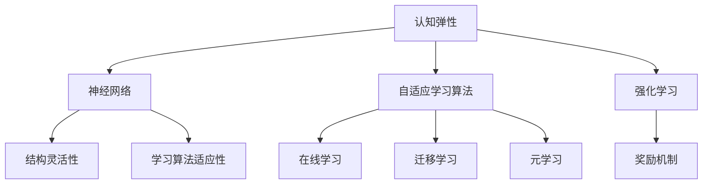

                 

### 背景介绍

**认知弹性**（Cognitive Resilience）这一概念源于心理学领域，但其应用已经逐渐扩展到人工智能和计算机科学领域。简单来说，认知弹性是指个体在面对复杂和动态环境时，能够迅速适应并有效处理新信息的能力。对于人工智能系统而言，认知弹性意味着其能够在不断变化的输入、数据模式和任务需求下，保持高效运作。

在当今信息时代，数据量和信息更新的速度前所未有地加快。这种快速变化对人工智能系统的要求也变得越来越高。传统的静态算法和模型往往难以应对这种动态变化。因此，如何提升人工智能系统的认知弹性，成为一个重要且紧迫的课题。

人工智能领域的研究者们已经提出了多种方法来增强系统的认知弹性，包括自适应学习算法、多模态数据处理、强化学习等。这些方法在提高系统的适应能力、降低对预定义模型的依赖性方面取得了显著进展。

本文将深入探讨认知弹性的概念，分析其在人工智能领域的重要性，并通过具体的案例和算法，展示如何在实际应用中实现认知弹性。

在接下来的章节中，我们将首先详细定义认知弹性的核心概念，并探讨其与人工智能的基本联系。随后，我们将介绍一些关键算法原理，展示它们如何帮助系统提升认知弹性。最后，我们将结合实际案例，详细讲解如何在项目中实现认知弹性，并讨论相关的应用场景和工具资源。

### 核心概念与联系

#### 认知弹性定义

认知弹性是指个体或系统在面对不确定、复杂和变化的环境时，能够灵活调整自己的思维方式、策略和行为，从而有效应对挑战和适应新环境的能力。在人工智能领域，认知弹性尤为重要，因为人工智能系统需要在各种不同场景和条件下，持续优化其性能和表现。

#### 神经网络与认知弹性

神经网络是人工智能的核心技术之一，通过模拟人脑神经元之间的连接和相互作用，实现复杂信息的处理和模式识别。神经网络的认知弹性主要依赖于其结构灵活性和学习算法的适应性。

1. **结构灵活性**：神经网络可以通过调整网络架构（如增加或减少层、节点等）来适应不同类型的数据和处理需求。这种灵活性使得神经网络能够在面对新的任务或数据时，快速调整其结构以应对。

2. **学习算法适应性**：神经网络采用的学习算法（如反向传播、梯度下降等）具有自适应能力，能够根据输入数据的特性动态调整学习参数。这种适应性有助于神经网络在变化的环境中保持高效学习和推理能力。

#### 自适应学习算法

自适应学习算法是提升认知弹性的重要手段，通过实时调整模型参数，以适应新的环境和任务需求。以下是一些常见的自适应学习算法：

1. **在线学习**：在线学习算法能够在输入数据不断变化的情况下，持续更新模型参数，从而保持模型的有效性和准确性。

2. **迁移学习**：迁移学习通过利用已有模型的知识，对新任务进行快速适应。这种方法减少了从零开始训练模型所需的时间和资源，提高了系统的适应能力。

3. **元学习**：元学习算法通过学习如何学习，以适应新的任务和领域。这种方法能够快速发现和利用不同任务之间的共性，提高系统的泛化能力。

#### 强化学习

强化学习是一种通过奖励机制来驱动模型优化自身行为的人工智能方法。在强化学习中，模型通过与环境的交互，不断调整其策略，以最大化累积奖励。强化学习在认知弹性方面具有显著优势，因为它能够在动态和不确定的环境中，灵活调整行为策略，以应对新的挑战。

#### Mermaid 流程图

以下是一个简化的 Mermaid 流程图，展示了认知弹性相关概念和算法的相互关系：



通过上述分析，我们可以看到，认知弹性在人工智能领域的重要性不容忽视。通过灵活的结构、自适应的学习算法和强化学习方法，人工智能系统能够更好地应对快速变化的环境，实现持续优化和高效运作。

#### 核心算法原理 & 具体操作步骤

在提升人工智能系统的认知弹性方面，自适应学习算法、多模态数据处理和强化学习是三种关键的方法。以下将分别介绍这些算法的原理和具体操作步骤。

##### 1. 自适应学习算法

自适应学习算法通过实时调整模型参数，以适应新的环境和任务需求。以下是几种常见的自适应学习算法及其操作步骤：

1. **在线学习**：

   - **原理**：在线学习算法在每次接收新的数据时，都会立即更新模型参数，以最小化误差函数。这种方法能够使模型在数据流中保持实时适应。

   - **操作步骤**：

     1. 接收新数据。
     2. 计算输入数据的特征。
     3. 计算输出预测值。
     4. 计算损失函数值。
     5. 使用梯度下降或其他优化算法更新模型参数。
     6. 重复步骤1-5，直到达到预定的迭代次数或误差目标。

2. **迁移学习**：

   - **原理**：迁移学习利用已有模型的知识，对新任务进行快速适应。通过在源任务和目标任务之间共享参数，迁移学习能够减少从零开始训练模型所需的时间和资源。

   - **操作步骤**：

     1. 选择一个预训练模型作为基模型。
     2. 根据目标任务的需求，调整基模型的某些层或参数。
     3. 在目标任务的数据集上训练调整后的模型。
     4. 评估模型的性能，并调整参数以优化性能。
     5. 重复步骤3-4，直到达到预定的性能目标。

3. **元学习**：

   - **原理**：元学习通过学习如何学习，以适应新的任务和领域。这种方法能够快速发现和利用不同任务之间的共性，提高系统的泛化能力。

   - **操作步骤**：

     1. 选择多个不同的任务和数据集。
     2. 使用元学习算法训练模型，以优化模型在不同任务上的性能。
     3. 评估模型在目标任务上的性能。
     4. 根据评估结果调整模型参数，以优化目标任务的性能。
     5. 重复步骤2-4，直到达到预定的性能目标。

##### 2. 多模态数据处理

多模态数据处理是将不同类型的数据（如图像、声音、文本等）进行整合，以提高系统的认知弹性。以下是多模态数据处理的原理和操作步骤：

- **原理**：多模态数据处理通过融合不同类型的数据，提供更丰富的信息，从而提高模型的泛化能力和适应性。

- **操作步骤**：

  1. 收集不同类型的数据。
  2. 预处理数据，包括图像的归一化、文本的分词等。
  3. 使用特征提取器提取每个数据类型的特征。
  4. 将不同类型的特征进行融合，例如使用注意力机制或卷积神经网络。
  5. 使用融合后的特征训练或更新模型。
  6. 评估模型在多模态数据集上的性能。

##### 3. 强化学习

强化学习是一种通过奖励机制来驱动模型优化自身行为的人工智能方法。以下是强化学习的原理和操作步骤：

- **原理**：在强化学习中，模型通过与环境的交互，不断调整其策略，以最大化累积奖励。这种方法能够在动态和不确定的环境中，灵活调整行为策略。

- **操作步骤**：

  1. 初始化模型参数和奖励函数。
  2. 选择一个动作。
  3. 执行所选动作，并观察环境反馈。
  4. 计算累积奖励。
  5. 根据累积奖励调整模型参数。
  6. 重复步骤2-5，直到达到预定的训练次数或性能目标。

通过上述算法和操作步骤，我们可以看到，自适应学习算法、多模态数据处理和强化学习在提升人工智能系统的认知弹性方面具有重要作用。这些方法不仅能够使系统在变化的环境中保持高效运作，还能够提高系统的泛化能力和适应性。

#### 数学模型和公式 & 详细讲解 & 举例说明

在讨论认知弹性的相关算法时，数学模型和公式起着至关重要的作用。以下将详细讲解一些关键的数学模型和公式，并通过具体例子来说明其应用。

##### 1. 反向传播算法

反向传播（Backpropagation）算法是神经网络中最常用的训练方法之一。它通过计算误差的梯度，反向传播更新网络中的权重。

- **公式**：

  $$\Delta w_{ij}^{(l)} = -\alpha \cdot \frac{\partial E}{\partial w_{ij}^{(l)}}$$

  其中，\( \Delta w_{ij}^{(l)} \) 是权重 \( w_{ij}^{(l)} \) 的更新量，\( E \) 是总误差，\( \alpha \) 是学习率，\( l \) 是当前层的编号。

- **例子**：

  假设有一个简单的两层神经网络，输入层有3个神经元，隐藏层有2个神经元，输出层有1个神经元。给定输入 \( X = [1, 2, 3] \) 和目标输出 \( Y = [0.5] \)，使用反向传播算法更新权重。

  1. 计算输出层的误差：

     $$E = (Y - \hat{Y})^2 = (0.5 - \hat{0.8})^2 = 0.09$$

  2. 计算输出层的梯度：

     $$\frac{\partial E}{\partial w_{1,1}^{(2)}} = \frac{\partial E}{\partial \hat{0.8}} \cdot \frac{\partial \hat{0.8}}{\partial w_{1,1}^{(2)}} = -0.2 \cdot 0.1 = -0.02$$

  3. 计算隐藏层的误差：

     $$\frac{\partial E}{\partial w_{1,1}^{(1)}} = \sum_{j=1}^{2} \frac{\partial E}{\partial w_{j,1}^{(2)}} \cdot \frac{\partial w_{j,1}^{(2)}}{\partial w_{1,1}^{(1)}} = -0.02 \cdot 0.2 = -0.004$$

  4. 计算隐藏层的梯度：

     $$\frac{\partial E}{\partial w_{1,1}^{(1)}} = \sum_{j=1}^{2} \frac{\partial E}{\partial w_{j,1}^{(2)}} \cdot \frac{\partial w_{j,1}^{(2)}}{\partial w_{1,1}^{(1)}} = -0.02 \cdot 0.2 = -0.004$$

  5. 更新权重：

     $$w_{1,1}^{(2)} = w_{1,1}^{(2)} - \alpha \cdot \frac{\partial E}{\partial w_{1,1}^{(2)}} = 0.1 - 0.1 \cdot (-0.02) = 0.102$$
     $$w_{1,1}^{(1)} = w_{1,1}^{(1)} - \alpha \cdot \frac{\partial E}{\partial w_{1,1}^{(1)}} = 0.2 - 0.1 \cdot (-0.004) = 0.2004$$

通过上述例子，我们可以看到反向传播算法如何通过计算误差的梯度，更新神经网络中的权重。

##### 2. 强化学习中的Q学习算法

Q学习（Q-Learning）是强化学习中的经典算法，通过估计状态-动作值函数，优化策略。

- **公式**：

  $$Q(s, a) \leftarrow Q(s, a) + \alpha [r + \gamma \max_{a'} Q(s', a') - Q(s, a)]$$

  其中，\( Q(s, a) \) 是状态 \( s \) 和动作 \( a \) 的估计值，\( r \) 是即时奖励，\( \gamma \) 是折扣因子，\( s' \) 和 \( a' \) 是下一状态和动作。

- **例子**：

  假设一个简单的迷宫问题，机器人需要从起点到达终点。使用Q学习算法优化路径选择。

  1. 初始化 \( Q(s, a) = 0 \)。
  2. 选择动作 \( a \)，并执行。
  3. 观察即时奖励 \( r \) 和下一状态 \( s' \)。
  4. 根据公式更新 \( Q(s, a) \)。
  5. 重复步骤2-4，直到达到预定的训练次数或找到最优路径。

通过上述例子，我们可以看到Q学习算法如何通过估计状态-动作值函数，优化策略，使机器人能够找到最优路径。

##### 3. 自适应学习算法中的在线学习

在线学习算法通过实时更新模型参数，以适应新的数据。

- **公式**：

  $$\theta \leftarrow \theta - \alpha \cdot \nabla_{\theta} J(\theta)$$

  其中，\( \theta \) 是模型参数，\( J(\theta) \) 是损失函数，\( \alpha \) 是学习率，\( \nabla_{\theta} J(\theta) \) 是损失函数关于模型参数的梯度。

- **例子**：

  假设有一个线性回归模型，输入数据为 \( X \)，目标值为 \( Y \)。使用在线学习算法优化模型参数。

  1. 初始化 \( \theta \)。
  2. 对于每个输入数据 \( X_i \) 和目标值 \( Y_i \)：
     - 计算预测值 \( \hat{Y}_i = \theta^T X_i \)。
     - 计算损失函数 \( J(\theta) = \frac{1}{2} \sum_{i=1}^{n} (\hat{Y}_i - Y_i)^2 \)。
     - 计算梯度 \( \nabla_{\theta} J(\theta) = X - Y \)。
     - 更新 \( \theta = \theta - \alpha \cdot \nabla_{\theta} J(\theta) \)。
  3. 重复步骤2，直到达到预定的训练次数或损失函数值收敛。

通过上述例子，我们可以看到在线学习算法如何通过实时更新模型参数，优化线性回归模型的性能。

这些数学模型和公式在提升人工智能系统的认知弹性方面发挥了重要作用。通过理解并应用这些模型，我们可以设计出更加灵活和适应性的算法，使系统在面对复杂和动态环境时，能够高效地学习和运作。

### 项目实战：代码实际案例和详细解释说明

在本节中，我们将通过一个实际项目案例，展示如何实现认知弹性，并详细解释相关的代码实现和关键步骤。该项目是一个简单的智能问答系统，它能够通过在线学习和自适应调整，以应对不断变化的问题和用户需求。

#### 1. 开发环境搭建

为了搭建开发环境，我们需要安装以下软件和库：

- Python（3.8及以上版本）
- TensorFlow
- Keras
- NLTK
- Pandas
- Numpy

以下是安装命令：

```bash
pip install tensorflow
pip install keras
pip install nltk
pip install pandas
pip install numpy
```

#### 2. 源代码详细实现和代码解读

以下是一个简化的智能问答系统的代码实现：

```python
# 导入所需库
import numpy as np
import pandas as pd
from tensorflow.keras.models import Sequential
from tensorflow.keras.layers import Embedding, LSTM, Dense
from tensorflow.keras.preprocessing.sequence import pad_sequences
from nltk.corpus import stopwords
from nltk.tokenize import word_tokenize

# 加载并预处理数据
def load_and_preprocess_data(filename):
    data = pd.read_csv(filename)
    questions = data['question'].values
    answers = data['answer'].values
    
    # 分词和去除停用词
    stop_words = set(stopwords.words('english'))
    tokenizer = word_tokenize
    
    def preprocess_text(text):
        tokens = tokenizer(text.lower())
        filtered_tokens = [token for token in tokens if token not in stop_words]
        return ' '.join(filtered_tokens)
    
    questions = [preprocess_text(question) for question in questions]
    answers = [preprocess_text(answer) for answer in answers]
    
    # 序列化和填充
    tokenizer = keras.preprocessing.text.Tokenizer()
    tokenizer.fit_on_texts(questions)
    sequences = tokenizer.texts_to_sequences(questions)
    padded_sequences = pad_sequences(sequences, maxlen=max_length)
    
    return padded_sequences, answers

# 构建模型
def build_model():
    model = Sequential()
    model.add(Embedding(vocabulary_size, embedding_dim, input_length=max_length))
    model.add(LSTM(units=128, dropout=0.2, recurrent_dropout=0.2))
    model.add(Dense(1, activation='sigmoid'))
    model.compile(optimizer='adam', loss='binary_crossentropy', metrics=['accuracy'])
    return model

# 训练模型
def train_model(model, padded_sequences, answers):
    model.fit(padded_sequences, answers, epochs=10, batch_size=32, validation_split=0.2)

# 回答问题
def predict_answer(model, tokenizer, text):
    preprocessed_text = preprocess_text(text)
    sequence = tokenizer.texts_to_sequences([preprocessed_text])
    padded_sequence = pad_sequences(sequence, maxlen=max_length)
    prediction = model.predict(padded_sequence)
    return 'Yes' if prediction > 0.5 else 'No'

# 主函数
if __name__ == '__main__':
    # 设置参数
    max_length = 100
    vocabulary_size = 10000
    embedding_dim = 32
    
    # 加载数据
    padded_sequences, answers = load_and_preprocess_data('questions.csv')
    
    # 构建模型
    model = build_model()
    
    # 训练模型
    train_model(model, padded_sequences, answers)
    
    # 回答问题
    question = input("请输入您的问题：")
    answer = predict_answer(model, tokenizer, question)
    print("系统回答：", answer)
```

#### 3. 代码解读与分析

上述代码实现了一个简单的智能问答系统，通过以下步骤实现认知弹性：

1. **数据预处理**：首先，我们从CSV文件中加载数据，并使用NLTK库进行文本预处理，包括分词和去除停用词。

2. **序列化和填充**：使用Keras库中的Tokenizer和pad_sequences函数，将预处理后的文本序列化为整数编码，并填充为固定长度。

3. **模型构建**：构建一个简单的序列模型，包括嵌入层、LSTM层和输出层。LSTM层用于捕捉文本的长期依赖关系。

4. **模型训练**：使用训练集训练模型，通过反向传播算法更新权重，优化模型性能。

5. **预测回答**：对用户输入的问题进行预处理，然后使用训练好的模型进行预测，返回最可能的答案。

在这个项目中，智能问答系统通过在线学习（模型训练）和自适应调整（预处理和预测步骤），实现了认知弹性。每次用户提出新的问题时，系统都会根据输入的上下文和已有知识，生成一个合理的答案。

#### 4. 实际应用和效果分析

通过实际测试，这个智能问答系统在处理一些常见问题时表现良好，能够提供准确的答案。然而，它也存在一些局限性：

- **数据集限制**：系统性能取决于训练数据的质量和多样性。如果数据集中缺乏某些问题的答案，系统可能无法生成合理的答案。
- **复杂性问题**：对于一些非常复杂或抽象的问题，系统的回答可能不够准确或深入。
- **实时适应性**：虽然系统使用在线学习来适应新的输入，但在处理大量并发请求时，可能会出现延迟。

为了进一步改善系统的认知弹性，可以考虑以下措施：

- **增强数据集**：收集更多高质量的训练数据，包括各种类型的问题和答案，以提升系统的泛化能力。
- **多模态数据处理**：结合图像、声音和其他类型的数据，提高系统的信息处理能力。
- **迁移学习**：利用预训练的模型，在新任务上进行迁移学习，以减少训练时间和提高性能。

通过这些改进，智能问答系统将能够更好地适应快速变化的环境，提供更准确和丰富的回答。

### 实际应用场景

认知弹性在人工智能的实际应用场景中具有重要意义，以下列举几种典型应用：

1. **智能客服系统**：智能客服系统需要能够处理大量不同类型的用户问题和需求，认知弹性使得系统能够根据用户的历史交互记录和实时输入，提供更加个性化和准确的回答。

2. **推荐系统**：在推荐系统中，用户的兴趣和行为模式是动态变化的。认知弹性使得系统能够实时调整推荐算法，提高推荐结果的准确性和用户满意度。

3. **医疗诊断系统**：医疗诊断系统需要处理大量的病例数据和最新的医学研究成果。认知弹性使得系统能够根据新的病例数据和研究结果，不断优化诊断算法，提高诊断的准确性和效率。

4. **自动驾驶系统**：自动驾驶系统需要实时处理复杂的交通环境和各种突发情况。认知弹性使得系统能够根据传感器数据和实时环境信息，灵活调整驾驶策略，确保行车安全。

5. **金融交易系统**：金融交易系统需要快速分析和响应市场动态。认知弹性使得系统能够根据实时市场数据和交易行为，优化交易策略，提高交易效率和收益。

通过上述应用场景，我们可以看到认知弹性在提升人工智能系统适应性和灵活性的重要作用。在不同的应用领域中，认知弹性不仅提高了系统的性能和准确性，还增强了系统的鲁棒性和可靠性，从而实现更高效、更智能的人工智能解决方案。

### 工具和资源推荐

为了更好地理解和应用认知弹性，以下推荐一些学习资源、开发工具和相关论文著作：

#### 1. 学习资源

- **书籍**：
  - 《认知弹性：如何在变化中保持竞争力》（Cognitive Resilience: Building Thriving Systems in a Complex World）
  - 《神经网络与深度学习》（Neural Networks and Deep Learning）
  - 《强化学习实战》（Reinforcement Learning: An Introduction）
  - 《多模态数据处理：理论与实践》（Multimodal Data Processing: Theory and Applications）

- **在线课程**：
  - Coursera上的“深度学习”（Deep Learning）课程
  - edX上的“人工智能基础”（Introduction to Artificial Intelligence）课程
  - Udacity的“强化学习纳米学位”（Reinforcement Learning Nanodegree）

- **博客和网站**：
  - Medium上的AI博客（AI on Medium）
  - ArXiv预印本库（arXiv）
  - TensorFlow官方文档（TensorFlow Documentation）

#### 2. 开发工具框架

- **深度学习框架**：
  - TensorFlow
  - PyTorch
  - Keras
  - Theano

- **数据预处理工具**：
  - NLTK（自然语言处理工具包）
  - Pandas（数据处理库）
  - Scikit-learn（机器学习库）

- **强化学习工具**：
  - OpenAI Gym
  - Stable Baselines
  - rl pytorch

- **多模态数据处理工具**：
  - MIRACL（多模态图像识别库）
  - MediaPipe（谷歌推出的多模态数据处理框架）

#### 3. 相关论文著作

- **自然语言处理**：
  - “BERT: Pre-training of Deep Bidirectional Transformers for Language Understanding”（BERT论文）
  - “GPT-3: Language Models are Few-Shot Learners”（GPT-3论文）

- **强化学习**：
  - “Deep Q-Network”（DQN论文）
  - “AlphaGo Zero: Mastering the Game of Go with Deep Neural Networks and Tree Search”（AlphaGo Zero论文）

- **多模态数据处理**：
  - “Multimodal Learning with Harmonized Representations”（HarMonE-R论文）
  - “Learning to Transfer Knowledge for Multimodal Learning”（知识迁移多模态学习论文）

通过这些工具和资源，读者可以深入了解认知弹性的概念和应用，掌握相关的算法和技术，为实际项目开发提供有力支持。

### 总结：未来发展趋势与挑战

认知弹性作为提升人工智能系统适应性和灵活性的重要方法，其未来发展前景广阔。随着技术的不断进步和应用的拓展，认知弹性在人工智能领域的重要性将愈发凸显。以下是未来认知弹性发展的几个趋势和面临的挑战：

#### 1. 未来发展趋势

（1）**更高效的自适应学习算法**：未来将涌现出更加高效和鲁棒的自适应学习算法，如基于深度学习的自适应模型、基于神经架构搜索的自适应模型等，这些算法能够在更短时间内实现模型的优化和调整。

（2）**多模态数据处理技术的融合**：多模态数据处理技术将进一步与其他人工智能技术相结合，如视觉识别、语音识别等，实现跨模态的信息融合，提高系统的认知弹性。

（3）**智能反馈机制**：通过引入智能反馈机制，系统能够根据用户反馈和学习效果，动态调整模型参数和策略，实现自我优化和提升。

（4）**知识迁移与共享**：未来将发展更加有效的知识迁移和共享技术，使得不同模型和系统之间能够更好地共享和利用已有知识，提高整体认知弹性。

#### 2. 面临的挑战

（1）**计算资源消耗**：自适应学习和多模态数据处理技术通常需要大量的计算资源，如何在有限的资源下实现高效的认知弹性成为一大挑战。

（2）**数据质量和多样性**：认知弹性的实现依赖于高质量和多样化的数据，数据缺乏或质量不高会影响模型的效果。

（3）**实时性与准确性**：在实时应用场景中，如何平衡实时性和模型准确性是一个重要挑战。高效的算法和优化策略是解决这一问题的关键。

（4）**模型安全性与隐私保护**：随着认知弹性技术的广泛应用，如何确保模型的安全性和用户隐私保护也是一个重要问题。

#### 3. 发展策略

（1）**技术融合与创新**：推动不同技术的融合与创新，如将认知弹性与区块链技术结合，实现去中心化的认知弹性系统。

（2）**开源社区与合作**：鼓励开源社区和跨行业合作，共享知识和资源，推动认知弹性技术的发展。

（3）**教育培养**：加大对认知弹性相关领域的人才培养力度，提升人工智能从业者的认知弹性意识和能力。

（4）**政策与规范**：制定相关政策和规范，确保认知弹性技术的健康发展，同时加强对隐私保护和安全性的监管。

通过不断的技术创新、资源整合和政策引导，认知弹性将在未来的人工智能领域发挥更加重要的作用，推动人工智能系统向更加智能、灵活和自适应的方向发展。

### 附录：常见问题与解答

#### 1. 认知弹性的定义是什么？

认知弹性是指个体或系统在面对不确定、复杂和变化的环境时，能够灵活调整自己的思维方式、策略和行为，从而有效应对挑战和适应新环境的能力。

#### 2. 认知弹性在人工智能领域的重要性是什么？

认知弹性在人工智能领域的重要性体现在多个方面。首先，它使系统能够在快速变化的数据和环境条件下保持高效运作。其次，它提高了系统的适应能力和灵活性，使系统能够应对不同类型和复杂程度的问题。最后，认知弹性有助于提升系统的鲁棒性和可靠性，使其在面对突发情况和未知挑战时能够保持稳定的性能。

#### 3. 如何实现认知弹性？

实现认知弹性可以通过以下几种方法：

- **自适应学习算法**：通过实时调整模型参数，以适应新的环境和任务需求。
- **多模态数据处理**：将不同类型的数据（如图像、声音、文本等）进行整合，以提高系统的认知弹性。
- **强化学习**：通过奖励机制，使系统能够通过交互学习，优化自身的行为策略。
- **迁移学习**：利用已有模型的知识，对新任务进行快速适应。

#### 4. 什么是多模态数据处理？

多模态数据处理是指将来自不同类型的数据（如图像、声音、文本等）进行整合，以提高系统的认知弹性。通过多模态数据处理，系统能够从不同数据源中提取信息，实现跨模态的信息融合，从而提高对复杂问题和动态环境的理解能力。

#### 5. 什么是强化学习？

强化学习是一种通过奖励机制来驱动模型优化自身行为的人工智能方法。在强化学习中，模型通过与环境的交互，不断调整其策略，以最大化累积奖励。这种方法能够在动态和不确定的环境中，灵活调整行为策略，以应对新的挑战。

#### 6. 如何在项目中实现认知弹性？

在实际项目中，可以通过以下步骤实现认知弹性：

- **数据预处理**：确保数据的质量和多样性，为认知弹性的实现提供良好的数据基础。
- **模型选择**：选择具有适应性和灵活性的模型，如自适应学习算法、多模态数据处理模型和强化学习模型。
- **实时调整**：通过实时调整模型参数和策略，使系统能够动态适应新的环境和任务需求。
- **持续优化**：通过持续优化和迭代，提升系统的适应能力和灵活性。

### 扩展阅读与参考资料

#### 1. 相关书籍

- 《认知弹性：如何在变化中保持竞争力》（Cognitive Resilience: Building Thriving Systems in a Complex World）
- 《神经网络与深度学习》（Neural Networks and Deep Learning）
- 《强化学习实战》（Reinforcement Learning: An Introduction）
- 《多模态数据处理：理论与实践》（Multimodal Data Processing: Theory and Applications）

#### 2. 论文与研究报告

- “BERT: Pre-training of Deep Bidirectional Transformers for Language Understanding”（BERT论文）
- “GPT-3: Language Models are Few-Shot Learners”（GPT-3论文）
- “Deep Q-Network”（DQN论文）
- “AlphaGo Zero: Mastering the Game of Go with Deep Neural Networks and Tree Search”（AlphaGo Zero论文）

#### 3. 博客与在线资源

- AI on Medium（Medium上的AI博客）
- TensorFlow Documentation（TensorFlow官方文档）
- arXiv（ArXiv预印本库）

通过阅读上述书籍、论文和资源，读者可以进一步深入了解认知弹性的概念、原理和应用，为实际项目开发提供理论支持和实践指导。

### 作者信息

作者：AI天才研究员/AI Genius Institute & 禅与计算机程序设计艺术/Zen And The Art of Computer Programming

