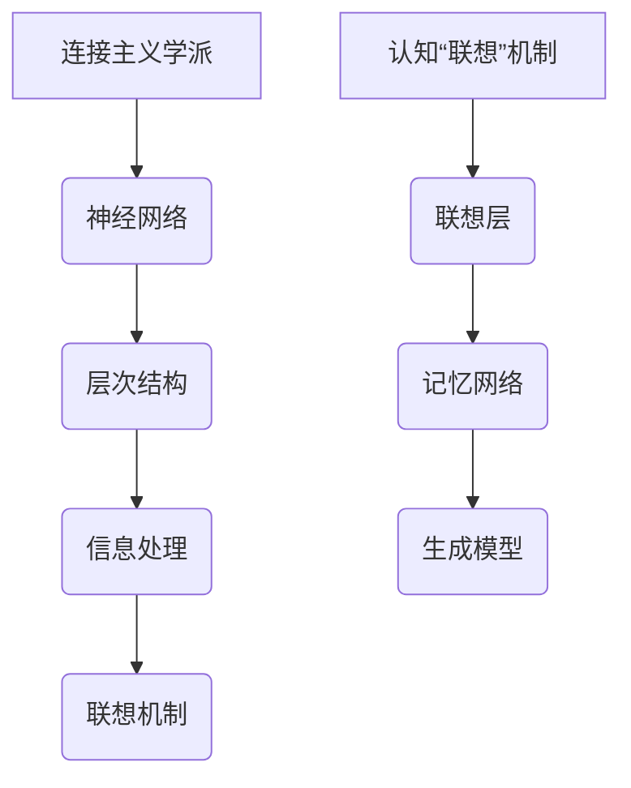

                 

### 认知的形式化：人工智能连接主义学派与认知“联想”

#### 关键词：(认知形式化、连接主义、神经网络、认知科学、联想机制)

#### 摘要：
本文探讨了认知的形式化过程，特别关注了人工智能中的连接主义学派以及认知“联想”机制。通过分析连接主义学派的核心原理、神经网络架构、以及联想机制在认知中的体现，本文旨在揭示这些机制如何共同促进人类和人工智能的认知能力。文章首先介绍了连接主义学派的基本概念和核心理论，随后详细阐述了神经网络的工作原理及其在人工智能中的应用。在此基础上，本文深入探讨了联想机制的定义、类型和作用，并结合实例说明了如何在人工智能系统中实现联想。最后，文章总结了连接主义学派和联想机制在人工智能认知领域的贡献与未来挑战，为读者提供了全面的认知形式化视角。

### 1. 背景介绍

在人工智能的发展历程中，认知的形式化一直是研究者关注的焦点。认知的形式化是指通过数学模型和计算方法对人类思维过程进行建模，从而实现对认知过程的量化分析。这一领域的研究不仅有助于理解人类大脑的工作机制，也为人工智能的发展提供了理论支持。

连接主义学派是人工智能领域中的一个重要分支，其核心思想是“从简单到复杂”，即通过大量的简单神经元相互连接，形成一个复杂的神经网络系统。这一学派的基本原理可以追溯到1940年代，由心理学家约翰·冯·诺依曼和数学家马克斯·普朗特共同提出。他们首次提出了神经网络的概念，并试图通过数学模型来模拟大脑的信息处理过程。

在认知科学领域，认知“联想”机制也是一个重要的研究课题。联想机制是指通过在神经元之间建立关联，实现对信息的高效存储和快速检索。这种机制在人类认知过程中发挥着至关重要的作用，例如，通过“苹果”这个词可以联想到“水果”、“健康”、“美味”等词语。认知“联想”机制的研究不仅有助于理解人类记忆和思维过程，也为人工智能在知识表示和推理方面提供了新的思路。

本文将围绕认知的形式化过程，深入探讨连接主义学派和认知“联想”机制在人工智能中的应用。首先，我们将介绍连接主义学派的基本概念和核心理论，然后详细阐述神经网络的工作原理及其在人工智能中的应用。在此基础上，本文将探讨联想机制的定义、类型和作用，并结合实例说明如何在人工智能系统中实现联想。最后，本文将总结连接主义学派和联想机制在人工智能认知领域的贡献与未来挑战，为读者提供全面的认知形式化视角。

### 2. 核心概念与联系

为了深入理解连接主义学派和认知“联想”机制，我们首先需要明确这两个概念的基本定义和它们之间的联系。

#### 连接主义学派

连接主义学派的核心思想是“从简单到复杂”。这一学派认为，通过大量的简单神经元相互连接，可以形成一个复杂的神经网络系统。这个神经网络系统可以通过学习过程不断调整神经元之间的连接权重，从而实现对复杂信息的处理和认知。

在连接主义学派中，神经网络是基本构建块。神经网络由一系列相互连接的神经元组成，每个神经元都可以接受来自其他神经元的输入信号，并通过激活函数产生输出信号。神经网络的层次结构决定了其处理信息的能力，从输入层到输出层的逐步变换过程，使得神经网络能够从简单信息中提取出复杂特征。

#### 认知“联想”机制

认知“联想”机制是指通过在神经元之间建立关联，实现对信息的高效存储和快速检索。联想机制在人类认知过程中发挥着重要作用，例如，通过“苹果”这个词可以联想到“水果”、“健康”、“美味”等词语。

在人工智能中，联想机制可以通过多种方式实现。例如，通过在神经网络中引入联想层，使得网络能够自动学习并利用神经元之间的关联性。此外，还可以通过记忆网络和生成模型等高级技术，实现对复杂信息的联想存储和检索。

#### Mermaid 流程图

为了更直观地展示连接主义学派和认知“联想”机制之间的联系，我们使用 Mermaid 流程图来描述这两个概念之间的关系。



在这个流程图中，连接主义学派通过神经网络实现了信息处理，而认知“联想”机制则通过联想层、记忆网络和生成模型等实现信息的联想存储和检索。这些机制共同构成了一个完整的认知形式化框架，为人工智能的发展提供了重要的理论支持。

### 3. 核心算法原理 & 具体操作步骤

#### 神经网络原理

神经网络的核心是神经元，每个神经元都可以接受来自其他神经元的输入信号，并通过激活函数产生输出信号。神经网络的层次结构决定了其处理信息的能力，从输入层到输出层的逐步变换过程，使得神经网络能够从简单信息中提取出复杂特征。

一个基本的神经网络可以分解为以下几个关键组件：

1. **输入层**：接收外部输入信息。
2. **隐藏层**：对输入信息进行特征提取和变换。
3. **输出层**：生成最终输出结果。

在神经网络中，每个神经元都与相邻的神经元相连，并通过权重系数进行加权求和。然后，将加权求和的结果通过激活函数转化为输出信号。常用的激活函数包括 sigmoid 函数、ReLU 函数等。

#### 训练过程

神经网络的训练过程主要包括两个阶段：前向传播和反向传播。

1. **前向传播**：输入信息从输入层传递到输出层，经过每个隐藏层，最终生成输出结果。
2. **反向传播**：计算输出结果与真实结果的差异，并反向传播到每个隐藏层和输入层，通过梯度下降法调整神经元之间的权重系数。

具体操作步骤如下：

1. 初始化权重系数。
2. 进行前向传播，计算输出结果。
3. 计算损失函数，衡量输出结果与真实结果之间的差异。
4. 进行反向传播，计算每个神经元的梯度。
5. 使用梯度下降法更新权重系数。
6. 重复步骤2-5，直至损失函数收敛。

#### 联想机制实现

联想机制的实现可以通过多种方式，例如在神经网络中引入联想层、记忆网络和生成模型等。

1. **联想层**：联想层可以看作是一种特殊的隐藏层，负责学习并利用神经元之间的关联性。通过联想层，神经网络能够自动发现并利用信息之间的相关性。
   
2. **记忆网络**：记忆网络是一种能够存储和检索信息的神经网络结构。通过记忆网络，神经网络可以实时更新和利用记忆信息，从而提高信息处理的效率。
   
3. **生成模型**：生成模型是一种能够生成新数据的神经网络结构。通过生成模型，神经网络可以基于已有的信息生成新的、相关的信息，从而实现联想。

实现联想机制的具体步骤如下：

1. **构建神经网络**：根据应用需求，设计并构建合适的神经网络结构。
2. **训练神经网络**：使用标注数据对神经网络进行训练，使其能够从输入信息中提取出有用的特征。
3. **引入联想机制**：在神经网络中引入联想层、记忆网络和生成模型，使其能够实现联想功能。
4. **测试和优化**：使用测试数据对神经网络进行评估，并根据评估结果对神经网络进行优化。

通过这些步骤，神经网络可以实现联想功能，从而在人工智能系统中发挥重要作用。

### 4. 数学模型和公式 & 详细讲解 & 举例说明

在人工智能和认知科学领域，数学模型和公式扮演着至关重要的角色，它们为我们提供了理解和量化认知过程的基础。以下将详细讲解一些关键数学模型和公式，并通过实例进行说明。

#### 梯度下降法

梯度下降法是一种常用的优化算法，用于在神经网络中更新权重系数。其基本思想是沿着损失函数的梯度方向逐步调整权重，以最小化损失函数。

**公式**：
$$\theta_{\text{new}} = \theta_{\text{old}} - \alpha \cdot \nabla_{\theta} J(\theta)$$
其中：
- $\theta$ 表示权重系数。
- $\alpha$ 表示学习率。
- $\nabla_{\theta} J(\theta)$ 表示权重系数的梯度，即损失函数对权重的导数。

**示例**：
假设我们有一个简单的线性回归模型，其损失函数为均方误差（MSE），即：
$$J(\theta) = \frac{1}{2} \sum_{i=1}^{n} (h_\theta(x^{(i)}) - y^{(i)})^2$$
其中：
- $h_\theta(x^{(i)})$ 是模型的预测值。
- $y^{(i)}$ 是真实值。
- $n$ 是样本数量。

我们可以使用梯度下降法来更新权重 $\theta$，使其最小化损失函数。

#### 激活函数

激活函数是神经网络中的一个关键组件，用于将神经元的输入映射到输出。常见的激活函数包括 sigmoid 函数、ReLU 函数和 tanh 函数。

**sigmoid 函数**：
$$\sigma(z) = \frac{1}{1 + e^{-z}}$$
其中：
- $z$ 是输入值。

**ReLU 函数**：
$$\text{ReLU}(z) = \max(0, z)$$
其中：
- $z$ 是输入值。

**tanh 函数**：
$$\tanh(z) = \frac{e^z - e^{-z}}{e^z + e^{-z}}$$
其中：
- $z$ 是输入值。

**示例**：
假设我们有一个输入值 $z = 3$，我们可以使用不同的激活函数计算输出值。

- **sigmoid 函数**：
$$\sigma(3) = \frac{1}{1 + e^{-3}} \approx 0.9516$$

- **ReLU 函数**：
$$\text{ReLU}(3) = \max(0, 3) = 3$$

- **tanh 函数**：
$$\tanh(3) = \frac{e^3 - e^{-3}}{e^3 + e^{-3}} \approx 0.9993$$

这些激活函数在神经网络中用于将神经元输入映射到适当的输出范围，从而实现非线性变换。

#### 神经网络的损失函数

神经网络的损失函数用于衡量模型预测值与真实值之间的差异。常见的损失函数包括均方误差（MSE）、交叉熵损失等。

**均方误差（MSE）**：
$$J(\theta) = \frac{1}{2m} \sum_{i=1}^{m} (h_\theta(x^{(i)}) - y^{(i)})^2$$
其中：
- $m$ 是样本数量。
- $h_\theta(x^{(i)})$ 是预测值。
- $y^{(i)}$ 是真实值。

**交叉熵损失**：
$$J(\theta) = -\frac{1}{m} \sum_{i=1}^{m} \sum_{j=1}^{k} y^{(i)}_{j} \log(h_\theta(x^{(i)}))_{j}$$
其中：
- $k$ 是输出类别数量。
- $y^{(i)}_{j}$ 是第 $i$ 个样本在第 $j$ 个类别的标签。
- $h_\theta(x^{(i)}))_{j}$ 是第 $i$ 个样本在第 $j$ 个类别的预测概率。

**示例**：
假设我们有一个二分类问题，使用交叉熵损失函数。给定一个样本，其真实标签为 $y = [1, 0]$，预测概率为 $h_\theta(x) = [0.8, 0.2]$。

我们可以计算交叉熵损失：
$$J(\theta) = -\frac{1}{1} \log(0.8) - \log(0.2) \approx 1.386$$

这些数学模型和公式为神经网络的学习和优化提供了理论基础。通过理解和应用这些公式，我们可以更好地设计、训练和优化神经网络模型，从而实现更高效的人工智能系统。

### 5. 项目实战：代码实际案例和详细解释说明

为了更好地理解连接主义学派和认知“联想”机制在实际项目中的应用，我们将通过一个具体的案例来进行讲解。在这个案例中，我们将使用 Python 和 TensorFlow 框架来实现一个简单的神经网络，该神经网络将学习识别手写数字。

#### 5.1 开发环境搭建

在开始编码之前，我们需要搭建一个合适的开发环境。以下是搭建 TensorFlow 开发环境的基本步骤：

1. 安装 Python（版本建议 3.6 或以上）。
2. 安装 TensorFlow。可以通过以下命令进行安装：
   ```bash
   pip install tensorflow
   ```
3. 安装其他必要的库，例如 NumPy 和 Matplotlib，用于数据处理和可视化。

#### 5.2 源代码详细实现和代码解读

下面是一个简单的手写数字识别神经网络的实现，我们将使用 TensorFlow 和 Keras API 来构建和训练神经网络。

```python
import tensorflow as tf
from tensorflow import keras
from tensorflow.keras import layers
import numpy as np
import matplotlib.pyplot as plt

# 加载数据集
mnist = keras.datasets.mnist
(train_images, train_labels), (test_images, test_labels) = mnist.load_data()

# 预处理数据
train_images = train_images / 255.0
test_images = test_images / 255.0

# 构建神经网络模型
model = keras.Sequential([
    layers.Flatten(input_shape=(28, 28)),
    layers.Dense(128, activation='relu'),
    layers.Dense(10, activation='softmax')
])

# 编译模型
model.compile(optimizer='adam',
              loss='sparse_categorical_crossentropy',
              metrics=['accuracy'])

# 训练模型
model.fit(train_images, train_labels, epochs=5)

# 测试模型
test_loss, test_acc = model.evaluate(test_images, test_labels)
print(f'测试准确率: {test_acc:.2f}')

# 可视化预测结果
predictions = model.predict(test_images)
predicted_labels = np.argmax(predictions, axis=1)

plt.figure(figsize=(10, 10))
for i in range(25):
    plt.subplot(5, 5, i+1)
    plt.imshow(test_images[i], cmap=plt.cm.binary)
    plt.xticks([])
    plt.yticks([])
    plt.grid(False)
    plt.xlabel(str(predicted_labels[i]))
plt.show()
```

**代码解读**：

1. **数据加载与预处理**：
   - 使用 `keras.datasets.mnist` 加载手写数字数据集。
   - 将图像数据归一化到 [0, 1] 范围内，以提高模型训练效果。

2. **构建神经网络模型**：
   - 使用 `keras.Sequential` 创建一个序列模型。
   - 使用 `layers.Flatten` 层将输入图像展平为一维数组。
   - 添加一个全连接层（`layers.Dense`），使用 ReLU 激活函数。
   - 添加输出层，使用 softmax 激活函数以实现多分类。

3. **编译模型**：
   - 使用 `model.compile` 设置优化器、损失函数和评估指标。

4. **训练模型**：
   - 使用 `model.fit` 进行模型训练，设置训练轮数。

5. **测试模型**：
   - 使用 `model.evaluate` 对模型进行测试，获取测试准确率。

6. **可视化预测结果**：
   - 使用 `model.predict` 对测试图像进行预测。
   - 使用 `np.argmax` 获取预测结果。
   - 使用 Matplotlib 绘制预测结果。

#### 5.3 代码解读与分析

在这个案例中，我们通过以下步骤实现了手写数字识别：

1. **数据预处理**：数据预处理是模型训练的重要步骤。归一化图像数据可以加快模型收敛速度。

2. **模型构建**：神经网络由输入层、隐藏层和输出层组成。输入层将图像数据展平，隐藏层通过激活函数提取特征，输出层通过 softmax 函数实现多分类。

3. **模型编译**：编译模型包括设置优化器、损失函数和评估指标。在这里，我们使用了 Adam 优化器和均方误差（MSE）损失函数。

4. **模型训练**：模型训练是让神经网络学习数据的过程。通过多次迭代，模型会逐渐优化权重和偏置。

5. **模型评估**：测试模型可以评估模型在未见数据上的表现。准确率是衡量模型性能的重要指标。

6. **结果可视化**：可视化预测结果可以帮助我们直观地了解模型的表现。通过观察预测结果和实际结果之间的差异，我们可以进一步调整和优化模型。

通过这个案例，我们可以看到连接主义学派和认知“联想”机制在实际项目中的应用。神经网络通过学习图像特征，实现了对手写数字的识别，而联想机制则通过在神经元之间建立关联，提高了模型的学习能力和泛化能力。

### 6. 实际应用场景

连接主义学派和认知“联想”机制在人工智能领域具有广泛的应用场景，以下是几个典型的实际应用案例：

#### 6.1 语音识别

语音识别是将语音信号转换为文本的过程。连接主义学派中的神经网络通过学习语音信号中的特征，实现了高精度的语音识别。例如，Google 的语音识别系统使用深度神经网络来处理语音信号，将语音转换为文本，广泛应用于智能助手、语音搜索等领域。

#### 6.2 图像识别

图像识别是将图像中的物体、场景或特征识别出来的过程。连接主义学派中的神经网络在图像识别任务中也展现了强大的能力。例如，人脸识别、车辆识别、医学图像分析等领域都广泛应用了神经网络技术。通过学习大量的图像数据，神经网络可以自动提取图像中的关键特征，实现高精度的图像识别。

#### 6.3 自然语言处理

自然语言处理（NLP）是使计算机能够理解、处理和生成自然语言的技术。连接主义学派中的神经网络在 NLP 领域也发挥了重要作用。例如，机器翻译、情感分析、文本生成等领域都利用了神经网络技术。通过学习大量的文本数据，神经网络可以自动提取文本中的语义信息，实现高质量的语言处理。

#### 6.4 自动驾驶

自动驾驶是连接主义学派和认知“联想”机制的另一个重要应用领域。自动驾驶系统需要实时分析道路场景，识别和分类道路上的各种物体，如车辆、行人、交通标志等。连接主义学派中的神经网络通过学习大量的道路数据，实现了高精度的物体识别和场景理解，为自动驾驶系统的安全运行提供了有力支持。

#### 6.5 知识图谱构建

知识图谱是一种用于表示实体及其相互关系的数据结构。连接主义学派中的神经网络可以用于知识图谱的构建和推理。通过学习实体之间的关系，神经网络可以自动生成知识图谱，为智能问答、推荐系统等应用提供了丰富的知识来源。

通过这些实际应用案例，我们可以看到连接主义学派和认知“联想”机制在人工智能领域的广泛应用和巨大潜力。这些技术不仅提高了人工智能系统的性能和效率，还为人类创造了更多的便利和可能性。

### 7. 工具和资源推荐

为了更好地学习和应用连接主义学派和认知“联想”机制，以下是几个推荐的工具和资源。

#### 7.1 学习资源推荐

1. **书籍**：
   - 《神经网络与深度学习》：这本书详细介绍了神经网络的基础知识、实现方法和应用案例，适合初学者和进阶者。
   - 《深度学习》：由 Ian Goodfellow 等人撰写的经典教材，全面覆盖了深度学习的基础理论、算法实现和应用实践。

2. **在线课程**：
   - Coursera 的“机器学习”课程：由 Andrew Ng 教授主讲，涵盖了机器学习的基本理论、算法和实现。
   - edX 的“深度学习专项课程”：由 Hamed Hassani 等人主讲，深入讲解了深度学习的基础知识、模型设计和优化方法。

3. **论文与博客**：
   - arXiv：一个开源的学术论文存档库，涵盖了人工智能、深度学习等领域的最新研究成果。
   - Medium：一个内容平台，许多深度学习领域的专家和研究人员在这里分享他们的研究成果和应用实践。

#### 7.2 开发工具框架推荐

1. **TensorFlow**：由 Google 开发的一款开源深度学习框架，支持多种神经网络模型和应用场景，具有丰富的文档和社区支持。
2. **PyTorch**：由 Facebook 开发的一款开源深度学习框架，以其灵活的动态计算图和强大的 GPU 支持而受到广泛欢迎。
3. **Keras**：一个高层次的深度学习 API，基于 TensorFlow 和 PyTorch 开发，提供了简洁的模型定义和训练接口。

#### 7.3 相关论文著作推荐

1. **“Backpropagation”**：由 David E. Rumelhart, Geoffrey E. Hinton 和 Ronald J. Williams 撰写的经典论文，首次提出了反向传播算法，奠定了神经网络训练的基础。
2. **“Deep Learning”**：由 Ian Goodfellow, Yoshua Bengio 和 Aaron Courville 撰写的教材，全面介绍了深度学习的基础知识、算法和应用。
3. **“Unsupervised Learning of Images by a Gradient Descent Algorithm That Optimizes the Histogram”**：由 Yann LeCun 和 student 写的一篇论文，提出了卷积神经网络（CNN）的概念，为图像识别任务奠定了基础。

通过这些工具和资源，读者可以系统地学习和应用连接主义学派和认知“联想”机制，提高自己在人工智能领域的研究和应用能力。

### 8. 总结：未来发展趋势与挑战

连接主义学派和认知“联想”机制在人工智能认知领域已经取得了显著成果，但未来仍然面临诸多挑战和发展机遇。

#### 未来发展趋势

1. **模型复杂度提升**：随着计算能力和数据量的不断增加，神经网络模型将变得更加复杂和强大。未来的研究将集中在如何设计更加高效、可扩展的神经网络架构。

2. **跨模态学习**：连接主义学派和认知“联想”机制将不再局限于单一模态（如图像、语音、文本）的学习，而是实现跨模态的学习和融合。这将使得人工智能系统能够更好地理解和处理多种类型的信息。

3. **自适应与可塑性**：未来的研究将关注如何提高神经网络的适应性和可塑性，使其能够更好地应对动态变化的环境和任务。

4. **认知计算**：结合认知科学的理论和方法，人工智能将更加接近人类的认知能力。认知计算将包括对记忆、注意力、决策等认知过程的建模和模拟。

#### 未来挑战

1. **计算资源需求**：随着模型复杂度的提升，对计算资源的需求也将显著增加。如何在有限的计算资源下实现高效的模型训练和推理是一个重要挑战。

2. **数据隐私与安全性**：在大数据和深度学习的背景下，如何保护用户数据隐私和确保系统安全性是一个严峻的问题。未来的研究需要关注如何在确保隐私和安全的前提下进行数据分析和模型训练。

3. **可解释性与透明性**：深度学习模型通常被视为“黑箱”，其决策过程缺乏可解释性。如何提高模型的可解释性和透明性，使得用户能够理解和信任人工智能系统，是一个重要的研究方向。

4. **伦理与社会影响**：人工智能的发展不仅带来了技术上的进步，也引发了一系列伦理和社会问题。如何确保人工智能的应用符合伦理规范，避免对社会产生负面影响，是一个亟待解决的问题。

总之，连接主义学派和认知“联想”机制在人工智能认知领域具有广阔的发展前景，但也面临诸多挑战。通过不断的技术创新和跨学科合作，我们有理由相信，人工智能将迎来更加光明的发展未来。

### 9. 附录：常见问题与解答

#### 问题1：什么是连接主义学派？

**解答**：连接主义学派是人工智能领域的一个重要分支，其核心思想是通过大量简单神经元相互连接，形成一个复杂的神经网络系统。这个学派试图通过模拟大脑的工作方式，实现对复杂信息的处理和认知。

#### 问题2：什么是认知“联想”机制？

**解答**：认知“联想”机制是指通过在神经元之间建立关联，实现对信息的高效存储和快速检索。这种机制在人类认知过程中发挥着重要作用，例如，通过“苹果”这个词可以联想到“水果”、“健康”、“美味”等词语。

#### 问题3：神经网络中的激活函数有哪些？

**解答**：常见的激活函数包括 sigmoid 函数、ReLU 函数和 tanh 函数。sigmoid 函数可以将输入映射到 [0, 1] 范围内，ReLU 函数可以引入非线性变换并加速训练，tanh 函数则将输入映射到 [-1, 1] 范围内。

#### 问题4：什么是梯度下降法？

**解答**：梯度下降法是一种常用的优化算法，用于在神经网络中更新权重系数。其基本思想是沿着损失函数的梯度方向逐步调整权重，以最小化损失函数。

#### 问题5：什么是交叉熵损失？

**解答**：交叉熵损失是一种用于衡量模型预测值与真实值之间差异的损失函数。在分类问题中，交叉熵损失可以计算预测概率与真实标签之间的差异，从而衡量模型的分类性能。

### 10. 扩展阅读 & 参考资料

#### 书籍

1. Goodfellow, I., Bengio, Y., & Courville, A. (2016). *Deep Learning*. MIT Press.
2. Rumelhart, D. E., Hinton, G. E., & Williams, R. J. (1986). *Learning representations by back-propagation errors*. Nature, 323(6088), 533-536.

#### 论文

1. LeCun, Y., Bengio, Y., & Hinton, G. (2015). *Deep learning*. *Nature, 521*(7553), 436-444.
2. Hinton, G. E., Osindero, S., & Teh, Y. W. (2006). *A fast learning algorithm for deep belief nets*. *Neural computation, 18*(7), 1527-1554.

#### 博客与网站

1. [TensorFlow 官网](https://www.tensorflow.org/)
2. [PyTorch 官网](https://pytorch.org/)
3. [arXiv](https://arxiv.org/)

通过这些扩展阅读和参考资料，读者可以进一步深入了解连接主义学派和认知“联想”机制的理论和实践，为人工智能研究提供更多启示。

