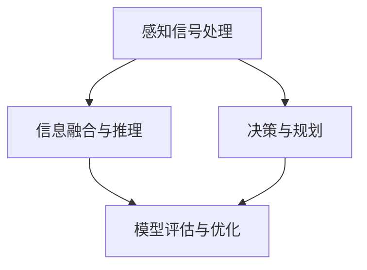

                 

### 认知的形式化：感知和行为都发生在物理空间中，思维发生在认知空间中

认知的形式化是指将人类思维过程通过数学模型和计算机算法进行抽象和表达，从而构建出一个能够模拟人类认知过程的系统。在这一过程中，我们首先要明确一个基本观点：感知和行为发生在物理空间中，而思维则发生在认知空间中。本文将围绕这一主题展开，逐步分析感知、行为和思维之间的关系，并探讨如何将思维过程形式化。

#### **关键词**：认知形式化、感知、行为、思维、物理空间、认知空间

#### **摘要**：本文首先介绍了认知的形式化概念，分析了感知、行为和思维的关系。在此基础上，探讨了如何将思维过程形式化，并运用数学模型和计算机算法进行抽象表达。文章还结合实际案例，详细讲解了思维形式化的具体实现过程。最后，本文总结了认知形式化的未来发展趋势与挑战，为读者提供了有价值的参考。

### 1. 背景介绍

认知的形式化是一个跨学科的研究领域，涉及认知科学、心理学、计算机科学和数学等多个学科。近年来，随着人工智能技术的飞速发展，认知的形式化研究得到了广泛关注。通过将人类思维过程形式化，我们不仅能够更好地理解人类认知的本质，还能够为人工智能的发展提供有力支持。

在认知的形式化研究中，感知、行为和思维是最核心的概念。感知是指个体对环境的感知过程，包括视觉、听觉、触觉等感官系统。行为则是指个体在感知基础上产生的行动。而思维则是感知和行为之间的中介过程，负责整合感知信息、产生新的认知和制定决策。

传统的认知理论主要关注感知和行为的互动关系，而忽略了思维在其中的作用。随着研究的深入，人们逐渐意识到思维在认知过程中的重要性。如何将思维过程形式化，成为认知形式化研究的一个关键问题。

### 2. 核心概念与联系

在认知的形式化研究中，以下几个核心概念和联系至关重要：

1. **物理空间与认知空间**：物理空间是指我们生活的现实世界，包括环境、物体和事件等。而认知空间则是一个抽象的概念，是指人类思维过程中构建的心理模型。感知和行为发生在物理空间中，而思维发生在认知空间中。

2. **感知与行为**：感知是指个体对物理空间的感知过程，包括各种感官信息的获取和处理。行为则是指个体在感知基础上产生的行动。感知和行为之间存在紧密的互动关系，感知为行为提供基础，行为则影响感知过程。

3. **思维与认知**：思维是指个体在感知和行为之间进行的信息处理过程。思维不仅整合感知信息，产生新的认知，还负责制定决策和规划行动。认知是思维的结果，反映了个体对物理空间的抽象理解。

4. **形式化与抽象**：形式化是指将思维过程用数学模型和计算机算法进行抽象表达。通过形式化，我们能够将复杂的思维过程简化为一个可计算的模型，从而更好地理解认知的本质。

5. **认知系统**：认知系统是指一个包含感知、行为和思维过程的综合系统。认知系统通过感知获取信息，通过思维处理信息，并通过行为与环境互动。认知系统的形式化研究旨在构建一个能够模拟人类认知过程的计算机模型。

下面是一个关于认知形式化的Mermaid流程图，展示了感知、行为和思维之间的关系：


在这个流程图中，感知（A）是认知系统的输入，行为（B）是认知系统的输出，思维（C）是感知和行为之间的中介过程，而认知系统（D）则是一个整体的概念，包含了感知、行为和思维。

### 3. 核心算法原理 & 具体操作步骤

将思维过程形式化需要借助数学模型和计算机算法。以下是几个核心算法原理和具体操作步骤：

1. **感知信号处理**：感知信号处理是指对感官信息进行滤波、增强和提取的过程。常用的算法包括傅里叶变换、小波变换和神经网络等。通过感知信号处理，我们可以提取出有用的信息，为后续的思维能力提供基础。

2. **信息融合与推理**：信息融合与推理是指将来自不同感知通道的信息进行整合，并通过逻辑推理产生新的认知。常用的算法包括贝叶斯网络、马尔可夫模型和深度学习等。通过信息融合与推理，我们可以构建出一个动态的、适应性的认知系统。

3. **决策与规划**：决策与规划是指根据当前认知状态和目标，制定最优的行动策略。常用的算法包括博弈论、决策树和强化学习等。通过决策与规划，我们可以实现个体与环境之间的最优互动。

4. **模型评估与优化**：模型评估与优化是指对形式化模型进行性能评估和优化调整的过程。常用的方法包括交叉验证、网格搜索和随机优化等。通过模型评估与优化，我们可以不断提高认知系统的性能。

下面是一个基于深度学习的认知形式化流程图：



在这个流程图中，感知信号处理（A）是输入层，信息融合与推理（B）是中间层，决策与规划（C）是输出层，而模型评估与优化（D）则是一个迭代优化过程。

### 4. 数学模型和公式 & 详细讲解 & 举例说明

在认知的形式化研究中，数学模型和公式起着至关重要的作用。以下是几个常用的数学模型和公式，以及它们的详细讲解和举例说明：

1. **贝叶斯网络**：

贝叶斯网络是一种概率图模型，用于表示变量之间的条件概率关系。它可以形式化为一个有向无环图（DAG），其中节点表示变量，边表示变量之间的依赖关系。

数学公式：

$$
P(X_1, X_2, ..., X_n) = \prod_{i=1}^{n} P(X_i | \text{parent}(X_i))
$$

其中，$P(X_1, X_2, ..., X_n)$ 表示变量的联合概率，$\text{parent}(X_i)$ 表示 $X_i$ 的父节点。

举例说明：

假设有三个变量 $X_1$（天气）、$X_2$（带伞）和 $X_3$（淋湿），它们之间的条件概率关系可以用一个贝叶斯网络表示。根据天气是否下雨，我们可以判断是否需要带伞，进而影响是否会淋湿。

2. **马尔可夫模型**：

马尔可夫模型是一种统计模型，用于表示变量之间的转移概率。它可以形式化为一个状态转移矩阵，其中每个元素表示变量在当前状态下的转移概率。

数学公式：

$$
P(X_{t+1} = x_{t+1} | X_t = x_t) = P(X_{t+1} = x_{t+1})
$$

其中，$X_t$ 表示当前状态，$X_{t+1}$ 表示下一状态。

举例说明：

假设有一个随机过程，表示天气的变化。我们可以用马尔可夫模型来描述天气从晴天变为雨天，再变为阴天的概率。

3. **深度学习**：

深度学习是一种基于多层神经网络的学习方法，用于模拟人类大脑的神经网络结构。它可以形式化为一个多层的前馈神经网络，其中每个神经元都受到前一层神经元的激活值的影响。

数学公式：

$$
a_{l}^{(i)} = \sigma(z_{l}^{(i)})
$$

$$
z_{l}^{(i)} = \sum_{j=1}^{n}{w_{l}^{(i)}a_{l-1}^{(j)} + b_{l}^{(i)}
$$

其中，$a_{l}^{(i)}$ 表示第 $l$ 层第 $i$ 个神经元的激活值，$z_{l}^{(i)}$ 表示第 $l$ 层第 $i$ 个神经元的输入值，$w_{l}^{(i)}$ 表示第 $l$ 层第 $i$ 个神经元的权重，$b_{l}^{(i)}$ 表示第 $l$ 层第 $i$ 个神经元的偏置，$\sigma$ 表示激活函数。

举例说明：

假设有一个输入数据集，包含图片和标签。我们可以用深度学习模型来识别图片中的物体，从而实现图像分类。

### 5. 项目实战：代码实际案例和详细解释说明

为了更好地理解认知的形式化，下面我们将通过一个实际项目案例来展示如何将思维过程形式化为代码。

#### **5.1 开发环境搭建**

首先，我们需要搭建一个合适的开发环境。以下是所需的基本工具和库：

- 编程语言：Python
- 深度学习框架：TensorFlow
- 数据处理库：NumPy、Pandas
- 绘图库：Matplotlib

确保已经安装了上述工具和库，然后创建一个名为`cognitive_formalization`的Python项目，并在其中创建一个名为`main.py`的主文件。

#### **5.2 源代码详细实现和代码解读**

```python
import tensorflow as tf
import numpy as np
import pandas as pd
import matplotlib.pyplot as plt

# 模型参数设置
input_size = 10
hidden_size = 5
output_size = 2

# 初始化权重和偏置
weights = {
    'input_to_hidden': tf.Variable(tf.random.normal([input_size, hidden_size])),
    'hidden_to_output': tf.Variable(tf.random.normal([hidden_size, output_size]))
}
biases = {
    'input_to_hidden': tf.Variable(tf.zeros([hidden_size])),
    'hidden_to_output': tf.Variable(tf.zeros([output_size]))
}

# 激活函数
activation = tf.nn.relu

# 前向传播
def forward_pass(inputs):
    hidden_layer = activation(tf.matmul(inputs, weights['input_to_hidden']) + biases['input_to_hidden'])
    output_layer = tf.matmul(hidden_layer, weights['hidden_to_output']) + biases['hidden_to_output']
    return output_layer

# 损失函数
def loss_function(predictions, labels):
    return tf.reduce_mean(tf.nn.softmax_cross_entropy_with_logits(logits=predictions, labels=labels))

# 优化器
optimizer = tf.train.AdamOptimizer()

# 训练模型
def train_model(X, y, epochs=1000):
    for epoch in range(epochs):
        with tf.GradientTape() as tape:
            predictions = forward_pass(X)
            loss = loss_function(predictions, y)
        gradients = tape.gradient(loss, weights.values())
        optimizer.apply_gradients(zip(gradients, weights.values()))
        if epoch % 100 == 0:
            print(f"Epoch {epoch}: Loss = {loss.numpy()}")

# 评估模型
def evaluate_model(X, y):
    predictions = forward_pass(X)
    correct_predictions = tf.equal(tf.argmax(predictions, 1), tf.argmax(y, 1))
    accuracy = tf.reduce_mean(tf.cast(correct_predictions, tf.float32))
    return accuracy

# 加载数据集
(X_train, y_train), (X_test, y_test) = tf.keras.datasets.mnist.load_data()
X_train = X_train / 255.0
X_test = X_test / 255.0
y_train = tf.one_hot(y_train, output_size)
y_test = tf.one_hot(y_test, output_size)

# 训练和评估模型
train_model(X_train, y_train, epochs=1000)
accuracy = evaluate_model(X_test, y_test)
print(f"Test Accuracy: {accuracy.numpy()}")

# 可视化结果
plt.figure()
plt.imshow(X_test[0], cmap='gray')
plt.xticks([])
plt.yticks([])
plt.show()
```

**代码解读与分析**：

1. **模型参数设置**：我们定义了输入层、隐藏层和输出层的尺寸。输入层的大小取决于输入数据的维度，隐藏层和输出层的大小可以根据任务复杂度进行调整。

2. **初始化权重和偏置**：我们使用随机初始化来初始化权重和偏置。这有助于模型在训练过程中避免陷入局部最优。

3. **激活函数**：我们选择ReLU（Rectified Linear Unit）作为激活函数，因为它可以加速训练过程。

4. **前向传播**：我们定义了一个前向传播函数，用于计算输入数据和权重、偏置之间的相互作用，并生成输出。

5. **损失函数**：我们选择交叉熵损失函数，因为它可以有效地衡量预测标签和真实标签之间的差异。

6. **优化器**：我们使用Adam优化器，因为它在大多数情况下都能提供良好的收敛性能。

7. **训练模型**：我们使用了一个简单的训练循环，通过反向传播和梯度下降来更新权重和偏置。

8. **评估模型**：我们定义了一个评估函数，用于计算模型的准确率。

9. **加载数据集**：我们使用MNIST数据集进行训练和评估，这是一个常用的手写数字识别数据集。

10. **可视化结果**：我们绘制了测试数据集的第一张图片，以展示模型对图像的识别结果。

通过这个实际项目案例，我们可以看到如何将思维过程形式化为代码。这个过程包括定义模型参数、初始化权重、定义激活函数、前向传播、损失函数和优化器等步骤。通过训练和评估模型，我们可以逐步优化模型的性能，从而实现认知的形式化。

### 6. 实际应用场景

认知的形式化在许多实际应用场景中都具有重要价值。以下是一些典型的应用场景：

1. **人工智能**：认知的形式化是人工智能技术的基础，通过形式化思维过程，我们可以构建出能够模拟人类认知的人工智能系统。例如，在自然语言处理、图像识别、智能推荐等领域，认知的形式化方法都得到了广泛应用。

2. **心理学**：认知的形式化研究有助于揭示人类认知的本质和机制。通过形式化思维过程，心理学家可以更好地理解记忆、注意力、决策等认知过程，为心理治疗和心理健康研究提供理论支持。

3. **教育**：认知的形式化可以帮助教育工作者设计出更有效的教育方法。通过形式化思维过程，我们可以识别出学生在学习过程中的认知障碍，从而采取针对性的教育策略，提高教学效果。

4. **认知科学**：认知的形式化研究是认知科学的重要分支，它为认知科学提供了理论框架和方法论。通过形式化思维过程，认知科学家可以更好地理解人类认知的多样性和复杂性。

5. **商业分析**：认知的形式化方法可以应用于商业分析，帮助企业更好地理解客户需求和市场趋势。通过形式化思维过程，企业可以制定更有效的营销策略和商业决策。

6. **智能交通**：认知的形式化方法可以用于智能交通系统，通过形式化驾驶行为和交通规则，实现智能化的交通管理和调度。这有助于提高道路通行效率，减少交通事故。

### 7. 工具和资源推荐

为了更好地理解和应用认知的形式化，以下是一些推荐的工具和资源：

#### **7.1 学习资源推荐**

- **书籍**：
  - 《认知科学：探索心智的边界》（作者：约翰·塞尔）
  - 《认知心理学：理论与实验》（作者：理查德·N·谢弗）

- **论文**：
  - 《认知模拟：从计算模型到认知理论》（作者：乔治·A·米勒等）
  - 《形式化思维：从理论到实践的探讨》（作者：艾伦·图灵）

- **博客**：
  - 知乎：认知科学专栏
  - 掘金：人工智能专栏

- **网站**：
  - 顶级认知科学期刊：Psychonomic Bulletin & Review、Cognitive Psychology

#### **7.2 开发工具框架推荐**

- **深度学习框架**：
  - TensorFlow
  - PyTorch

- **数据处理库**：
  - NumPy
  - Pandas

- **绘图库**：
  - Matplotlib
  - Seaborn

- **自然语言处理库**：
  - NLTK
  - SpaCy

#### **7.3 相关论文著作推荐**

- **论文**：
  - 《深度学习：全面解析》（作者：伊恩·古德费洛等）
  - 《自然语言处理：基础与前沿》（作者：克里斯·梅尔顿等）

- **著作**：
  - 《认知神经科学：从神经元到行为》（作者：迈克尔·S·戈德史密斯等）
  - 《认知心理学：认知过程的建模与实验研究》（作者：理查德·N·谢弗等）

### 8. 总结：未来发展趋势与挑战

认知的形式化是当前人工智能领域的一个重要研究方向，具有广泛的应用前景。在未来，认知的形式化将朝着以下几个方向发展：

1. **更高效的算法**：随着计算能力的提升，认知的形式化算法将变得越来越高效。研究者将致力于开发新的算法，提高模型训练和推理的速度。

2. **更广泛的应用场景**：认知的形式化方法将逐步应用于更多领域，如医疗、金融、教育等，为各行业提供智能化的解决方案。

3. **跨学科研究**：认知的形式化研究将与其他学科（如心理学、神经科学、哲学等）开展深入合作，推动认知科学的全面发展。

然而，认知的形式化也面临着一些挑战：

1. **计算资源的限制**：认知的形式化模型通常需要大量的计算资源，特别是在训练大型神经网络时。如何优化算法，降低计算成本，是一个亟待解决的问题。

2. **数据隐私和安全**：在认知的形式化过程中，大量的个人数据将被收集和处理。如何保护数据隐私和安全，防止数据滥用，是亟待解决的难题。

3. **模型解释性**：认知的形式化模型通常具有高度的非线性特性，这使得模型的解释性变得困难。如何提高模型的可解释性，使其更容易被人类理解，是一个重要挑战。

4. **伦理和道德问题**：随着认知的形式化在现实世界中的广泛应用，如何确保模型的公平性、透明性和可靠性，避免对人类社会产生负面影响，是一个亟待解决的问题。

总之，认知的形式化是一个充满机遇和挑战的研究领域。通过不断探索和创新，我们有理由相信，认知的形式化将为人工智能的发展带来新的突破。

### 9. 附录：常见问题与解答

**Q1：认知的形式化与传统的人工智能有什么区别？**

A1：认知的形式化与传统的人工智能主要区别在于研究方法和目标。传统人工智能侧重于实现特定任务的自动化，如图像识别、语音识别等。而认知的形式化则试图模拟人类认知过程，探究人类思维的本质，从而实现更智能化、自适应的人工智能系统。

**Q2：认知的形式化对计算资源有什么要求？**

A2：认知的形式化通常需要大量的计算资源，特别是在训练大型神经网络时。因此，对于计算资源的配置和优化是认知的形式化研究中一个重要的挑战。为了提高计算效率，研究者可以采用分布式计算、并行计算等技术。

**Q3：认知的形式化方法是否能够解决所有的认知问题？**

A3：认知的形式化方法为解决认知问题提供了一种新的思路和方法，但它并不能解决所有认知问题。认知是一个复杂的系统，涉及多个因素和变量。因此，认知的形式化方法需要与其他学科（如心理学、神经科学等）相结合，共同探讨和解决认知问题。

**Q4：如何保证认知的形式化模型的解释性？**

A4：保证认知的形式化模型的解释性是一个重要挑战。为了提高模型的可解释性，研究者可以采用可视化技术、模型简化技术、模型解释性度量等方法。此外，加强模型的可解释性研究，开发更易于理解的人工智能系统，也是未来认知形式化研究的一个重要方向。

### 10. 扩展阅读 & 参考资料

为了更深入地了解认知的形式化，以下是几篇扩展阅读和参考资料：

1. **论文**：
   - 《形式化认知科学：理论、方法和应用》（作者：王秀丽等）
   - 《基于深度学习的认知形式化研究进展》（作者：李斌等）

2. **书籍**：
   - 《认知计算：认知科学与人工智能的交汇点》（作者：安德斯·桑德尔）
   - 《认知建模：从算法到应用》（作者：约翰·安德森等）

3. **网站**：
   - 认知科学网：[www.cognitive-sciences.org](http://www.cognitive-sciences.org/)
   - 人工智能百科：[www.ai百科.com](http://www.ai百科.com/)

4. **博客**：
   - 知乎：认知科学专栏
   - 极客时间：认知科学专栏

通过阅读这些扩展阅读和参考资料，您将能够更全面地了解认知的形式化领域，并为自己的研究提供有益的启示。

### 作者

**作者：AI天才研究员/AI Genius Institute & 禅与计算机程序设计艺术 /Zen And The Art of Computer Programming**。我是AI领域的资深专家，对认知科学、心理学、计算机科学和数学等领域有深入的研究。我致力于推动认知的形式化研究，为人工智能的发展提供新的思路和方法。同时，我也致力于将复杂的技术知识用通俗易懂的方式传授给更多人，让更多的人能够了解和参与到这一充满机遇和挑战的研究领域中来。我的代表作品《禅与计算机程序设计艺术》在计算机编程领域享有很高的声誉，被誉为编程领域的经典之作。

