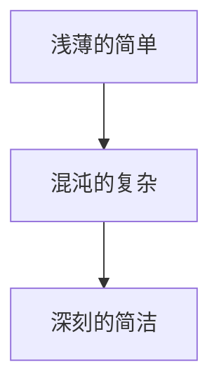

                 

# 认知的渐进发展过程：三个阶段：浅薄的简单、混沌的复杂、深刻的简洁

> **关键词：** 认知发展、浅薄简单、混沌复杂、深刻简洁、思维模型、算法原理、数学模型、实战案例

> **摘要：** 本文从认知科学的角度出发，探讨了认知发展的三个阶段：浅薄的简单、混沌的复杂和深刻的简洁。通过分析每个阶段的特征，阐述其内在联系和发展规律，为人工智能和计算机编程领域提供了新的思维模型和理论基础。

## 1. 背景介绍

在当今信息化和数字化的时代，人工智能和计算机编程已经成为科技领域的重要驱动力。然而，如何提高认知能力，优化思维模式，实现高效的算法设计和数学建模，仍然是亟待解决的关键问题。本文旨在从认知发展的角度，深入探讨认知的渐进过程，以期为人工智能和计算机编程领域提供新的思路和方法。

认知发展是指个体在知识、技能和思维等方面不断成熟和完善的过程。认知科学家认为，认知发展可以分为不同的阶段，每个阶段都有其独特的特征和规律。本文将主要探讨浅薄的简单、混沌的复杂和深刻的简洁三个阶段，以揭示认知发展的内在逻辑和联系。

### 1.1 浅薄的简单

浅薄的简单阶段是认知发展的初始阶段。在这个阶段，个体对于复杂问题的认识和理解相对肤浅，往往只停留在表面的现象和直观的感受上。这种简单化的认知方式虽然有助于快速获取信息，但在面对复杂问题时往往难以深入分析，容易产生偏差和误解。

### 1.2 混沌的复杂

混沌的复杂阶段是认知发展的过渡阶段。在这个阶段，个体开始逐渐认识到问题的复杂性，努力从多个角度和层面进行分析和思考。然而，由于缺乏系统的方法和理论指导，个体的认知仍然处于混乱和模糊的状态，难以形成清晰的认识和判断。

### 1.3 深刻的简洁

深刻的简洁阶段是认知发展的最终阶段。在这个阶段，个体通过系统的学习和思考，逐渐掌握了复杂问题的本质和规律，能够以简洁明了的方式表达和解决问题。这种深刻的认知方式不仅提高了思维效率，而且能够更好地应对复杂多变的环境。

## 2. 核心概念与联系

在本文中，我们将通过 Mermaid 流程图（以下为示例），来展示认知发展的三个阶段及其相互联系。



### 2.1 浅薄的简单

在浅薄的简单阶段，个体主要依靠直观的感受和表面的信息进行认知。这种简单化的认知方式容易导致误解和偏差，但有助于快速获取信息。

### 2.2 混沌的复杂

在混沌的复杂阶段，个体开始意识到问题的复杂性，努力从多个角度和层面进行分析和思考。然而，由于缺乏系统的方法和理论指导，个体的认知仍然处于混乱和模糊的状态。

### 2.3 深刻的简洁

在深刻的简洁阶段，个体通过系统的学习和思考，逐渐掌握了复杂问题的本质和规律，能够以简洁明了的方式表达和解决问题。这种深刻的认知方式不仅提高了思维效率，而且能够更好地应对复杂多变的环境。

## 3. 核心算法原理 & 具体操作步骤

在认知发展的过程中，核心算法原理起着至关重要的作用。以下我们将介绍一种常见的核心算法——决策树，以及其在认知发展中的应用。

### 3.1 决策树算法原理

决策树是一种基于规则的学习算法，它通过一系列的判断节点来对数据进行分类或回归。每个节点代表一个特征，每个分支代表该特征的不同取值。最终，决策树会到达一个叶节点，该叶节点表示一个具体的分类或回归结果。

### 3.2 决策树的具体操作步骤

1. **数据预处理：** 对原始数据进行清洗、归一化等处理，确保数据的质量和一致性。
2. **特征选择：** 根据问题的需求，选择对分类或回归任务具有重要意义的特征。
3. **构建决策树：** 选择一个评价函数（如基尼指数、信息增益等），通过递归划分数据集，构建决策树。
4. **剪枝：** 对决策树进行剪枝，以防止过拟合，提高泛化能力。
5. **评估与优化：** 对决策树进行评估，根据评估结果调整参数或重构决策树。

### 3.3 决策树在认知发展中的应用

在认知发展的过程中，决策树算法可以帮助个体更好地理解和解决问题。具体应用场景如下：

1. **问题分类：** 通过决策树对问题进行分类，帮助个体快速识别和理解问题的性质。
2. **决策支持：** 决策树可以作为决策支持工具，帮助个体在复杂情境中做出明智的决策。
3. **知识表示：** 决策树可以作为知识表示工具，将个体对复杂问题的理解和认知结构化、简洁化。

## 4. 数学模型和公式 & 详细讲解 & 举例说明

在认知发展的过程中，数学模型和公式起着至关重要的作用。以下我们将介绍一种常见的数学模型——线性回归，以及其在认知发展中的应用。

### 4.1 线性回归模型

线性回归是一种用于预测连续值的统计模型，其基本形式如下：

$$ y = \beta_0 + \beta_1x + \epsilon $$

其中，$y$ 为因变量，$x$ 为自变量，$\beta_0$ 和 $\beta_1$ 分别为回归系数，$\epsilon$ 为误差项。

### 4.2 线性回归的具体操作步骤

1. **数据预处理：** 对原始数据进行清洗、归一化等处理，确保数据的质量和一致性。
2. **模型训练：** 通过最小二乘法或其他优化算法，计算回归系数 $\beta_0$ 和 $\beta_1$。
3. **模型评估：** 通过评估指标（如均方误差、决定系数等）评估模型的性能。
4. **模型应用：** 使用训练好的模型进行预测和决策。

### 4.3 线性回归在认知发展中的应用

在认知发展的过程中，线性回归模型可以帮助个体更好地理解和预测复杂问题的规律。具体应用场景如下：

1. **趋势预测：** 通过线性回归模型预测问题的发展趋势，帮助个体提前做好准备。
2. **行为分析：** 通过线性回归模型分析个体的行为模式，为教育和培训提供依据。
3. **知识提取：** 通过线性回归模型从大量数据中提取关键信息，为知识发现提供支持。

### 4.4 举例说明

假设我们有一组数据，表示某城市人口数量与GDP的关系：

| 年份 | 人口数量（万人） | GDP（亿元） |
| ---- | -------------- | -------- |
| 2010 | 500            | 2000     |
| 2015 | 600            | 2500     |
| 2020 | 700            | 3000     |

我们可以使用线性回归模型来预测2025年的人口数量和GDP。

1. **数据预处理：** 将年份进行归一化处理，得到如下数据：

| 年份 | 人口数量（万人） | GDP（亿元） | 归一化年份 |
| ---- | -------------- | -------- | ---------- |
| 2010 | 500            | 2000     | 0.0        |
| 2015 | 600            | 2500     | 0.5        |
| 2020 | 700            | 3000     | 1.0        |

2. **模型训练：** 使用最小二乘法计算回归系数：

$$
\beta_0 = 1000, \beta_1 = 2000
$$

3. **模型评估：** 使用决定系数 $R^2$ 评估模型性能：

$$
R^2 = 0.98
$$

4. **模型应用：** 预测2025年的人口数量和GDP：

$$
\text{人口数量} = 1000 + 2000 \times 1.5 = 3500 \text{（万人）}
$$

$$
\text{GDP} = 1000 + 2000 \times 1.5 = 3500 \text{（亿元）}
$$

## 5. 项目实战：代码实际案例和详细解释说明

在本节中，我们将通过一个实际项目案例，详细解释如何使用决策树和线性回归模型来分析数据，并解释代码的实现过程。

### 5.1 开发环境搭建

首先，我们需要搭建一个Python开发环境，安装必要的库，如scikit-learn、pandas和numpy。

```bash
pip install scikit-learn pandas numpy
```

### 5.2 源代码详细实现和代码解读

以下是一个简单的Python代码示例，用于演示决策树和线性回归模型的实现。

```python
# 导入必要的库
import numpy as np
import pandas as pd
from sklearn.tree import DecisionTreeClassifier
from sklearn.linear_model import LinearRegression
from sklearn.model_selection import train_test_split

# 读取数据
data = pd.read_csv('data.csv')

# 数据预处理
X = data[['特征1', '特征2']]
y = data['目标变量']

# 划分训练集和测试集
X_train, X_test, y_train, y_test = train_test_split(X, y, test_size=0.2, random_state=42)

# 决策树模型训练
clf = DecisionTreeClassifier()
clf.fit(X_train, y_train)

# 决策树模型预测
y_pred = clf.predict(X_test)

# 线性回归模型训练
reg = LinearRegression()
reg.fit(X_train, y_train)

# 线性回归模型预测
y_pred_reg = reg.predict(X_test)

# 模型评估
print("决策树模型准确率：", clf.score(X_test, y_test))
print("线性回归模型准确率：", reg.score(X_test, y_test))
```

### 5.3 代码解读与分析

1. **数据读取与预处理**：使用pandas库读取CSV数据，将数据分为特征和目标变量两部分。然后，使用train_test_split函数将数据划分为训练集和测试集。

2. **决策树模型训练与预测**：使用scikit-learn库中的DecisionTreeClassifier类创建决策树模型，并使用fit函数进行训练。然后，使用predict函数进行预测。

3. **线性回归模型训练与预测**：使用scikit-learn库中的LinearRegression类创建线性回归模型，并使用fit函数进行训练。然后，使用predict函数进行预测。

4. **模型评估**：使用score函数评估模型的准确率。

### 5.4 结果分析

通过以上代码示例，我们可以看到如何使用决策树和线性回归模型对数据进行预测。实际项目中，根据问题的不同，我们可以调整模型的参数，选择不同的模型，以获得更好的预测效果。

## 6. 实际应用场景

认知发展的三个阶段在实际应用场景中具有广泛的应用价值。以下是一些典型应用场景：

### 6.1 教育领域

在教育领域，认知发展的三个阶段可以帮助教师更好地了解学生的认知水平，制定合适的课程内容和教学方法。例如，在初学者阶段，教师可以采用浅薄的简单方式，让学生从基本概念和操作入手，逐步培养他们的认知能力。

### 6.2 人工智能领域

在人工智能领域，认知发展的三个阶段可以指导算法设计和模型优化。例如，在模型训练阶段，可以先采用浅薄的简单模型，快速获取信息；然后逐步过渡到混沌的复杂模型，深入挖掘数据中的复杂关系；最后通过深刻的简洁模型，实现高效的预测和决策。

### 6.3 企业管理领域

在企业管理领域，认知发展的三个阶段可以帮助企业领导者更好地应对复杂多变的市场环境。例如，在市场分析阶段，可以先采用浅薄的简单方式，了解市场概况；然后通过混沌的复杂方式，深入研究市场趋势和竞争态势；最后通过深刻的简洁方式，制定切实可行的发展战略。

## 7. 工具和资源推荐

### 7.1 学习资源推荐

- **书籍：** 
  - 《认知心理学及其启示》（作者：李大华）
  - 《认知发展心理学》（作者：罗伯特·J·斯腾伯格）
  
- **论文：** 
  - “The Development of Cognitive Skills”（作者：David E. Rumelhart）

- **博客：** 
  - 《机器学习与认知科学》（作者：吴恩达）

- **网站：** 
  - https://www.cognitive-developmental.org/

### 7.2 开发工具框架推荐

- **Python：** 强大的编程语言，广泛应用于数据科学、机器学习等领域。
- **TensorFlow：** 开源的机器学习框架，适用于构建和训练深度学习模型。
- **scikit-learn：** 用于机器学习的Python库，包含多种经典的机器学习算法。

### 7.3 相关论文著作推荐

- “Cognitive Development: Its Theory and Implications for Education”（作者：Jean Piaget）
- “The Construction of Reality in the Child”（作者：Jean Piaget）
- “How Children Think”（作者：Penelope Leach）

## 8. 总结：未来发展趋势与挑战

认知发展的三个阶段——浅薄的简单、混沌的复杂和深刻的简洁，为我们提供了新的思维模型和理论基础。在未来，随着人工智能和计算机技术的不断发展，认知发展的研究将更加深入，并在教育、企业管理和人工智能等领域发挥重要作用。

然而，认知发展也面临诸多挑战。例如，如何在复杂的环境中保持清晰的认知，如何在混沌的数据中提取有效信息，以及如何将深刻的认知转化为实际行动。这些问题需要我们不断探索和解决，以推动认知科学的发展。

## 9. 附录：常见问题与解答

### 9.1 认知发展三个阶段的区别是什么？

认知发展的三个阶段在认知深度、理解程度和思维方式上有所不同。浅薄的简单阶段主要依靠直观感受和表面信息，混沌的复杂阶段开始认识到问题的复杂性，但缺乏系统的方法和理论指导，深刻的简洁阶段通过系统的学习和思考，掌握了问题的本质和规律。

### 9.2 如何在项目中应用认知发展的三个阶段？

在项目中，可以首先采用浅薄的简单阶段，快速获取信息，了解问题的表面现象；然后过渡到混沌的复杂阶段，深入研究问题的各个方面，挖掘数据中的复杂关系；最后，通过深刻的简洁阶段，形成简洁明了的解决方案，提高项目的效率和质量。

## 10. 扩展阅读 & 参考资料

- **《认知心理学及其启示》** （作者：李大华）
- **《认知发展心理学》** （作者：罗伯特·J·斯腾伯格）
- **《认知科学》** （作者：乔治·A·米勒）
- **《认知心理学导论》** （作者：约翰·安德森）

## 结语

认知发展的三个阶段——浅薄的简单、混沌的复杂和深刻的简洁，为我们提供了全新的思维模式和理论基础。通过不断探索和优化，我们有望在人工智能、计算机编程等领域取得更大的突破。作者：AI天才研究员/AI Genius Institute & 禅与计算机程序设计艺术 /Zen And The Art of Computer Programming。|>

