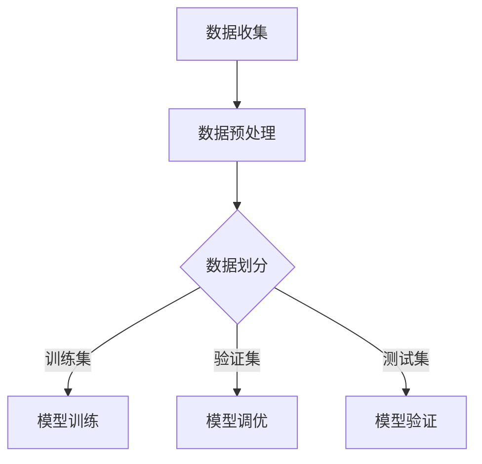

                 

## 背景介绍

随着软件工程领域的不断发展，数据在软件开发过程中扮演的角色愈发重要。尤其是在机器学习和人工智能领域，数据的质量和选择对于模型的性能和可靠性有着直接的影响。在训练模型时，我们通常会将数据集分为三个主要部分：训练集（Training Set）、验证集（Validation Set）和测试集（Test Set）。这三个数据集构成了软件2.0时代的一个铁三角，它们共同决定了模型的训练效果和应用性能。

### 软件发展历程

软件工程从诞生之初就经历了多个阶段的发展。早期的软件更多是针对特定硬件和操作系统开发的定制化应用，随着计算机硬件的进步和软件复杂度的增加，软件开发逐渐演变成一个系统工程。在软件1.0时代，主要关注点在于如何编写和部署软件，而数据并没有得到足够的重视。

进入软件2.0时代，数据成为软件开发的基石。机器学习和人工智能技术的发展，使得软件从简单的执行任务逐步转向基于数据和算法的智能系统。在这个时代，数据的质量和多样性成为衡量软件优劣的关键因素。为了更好地利用数据，训练集、验证集和测试集的概念被引入，并成为软件开发中不可或缺的一部分。

### 机器学习和人工智能对数据的需求

机器学习和人工智能的发展极大地推动了数据在软件开发中的应用。这些技术依赖于大量的数据来训练模型，从而实现从数据中学习并做出预测或决策的能力。然而，仅仅拥有数据还不足以构建有效的模型，数据的质量和选择对于模型的表现至关重要。

#### 数据质量

数据质量包括数据的准确性、完整性、一致性和时效性。一个高质量的数据集可以确保模型训练的有效性和可靠性。反之，如果数据存在噪声、缺失或偏差，模型可能会学习到错误的知识，从而导致性能下降。

#### 数据多样性

多样性是机器学习的一个重要概念，它要求数据集包含足够多的不同样本和特征。这样可以帮助模型学习到更多的模式，从而提高模型的泛化能力。在现实世界中，数据往往存在多样性和变化性，这要求我们在数据收集和处理过程中充分考虑这些因素。

### 训练集、验证集和测试集的作用

在机器学习和人工智能的应用中，训练集、验证集和测试集分别承担了不同的任务：

- **训练集（Training Set）**：用于模型的训练过程，模型通过学习训练集中的数据来构建预测模型。
- **验证集（Validation Set）**：用于模型的调优和选择，通过验证集来评估不同模型的性能，从而选择最优的模型。
- **测试集（Test Set）**：用于最终评估模型的性能，测试集应该是不参与模型训练和验证的独立数据集，这样可以更真实地反映模型在未知数据上的表现。

通过这三个数据集的合理分配和使用，可以确保模型在训练过程中的有效性和应用时的可靠性。接下来的章节将进一步深入探讨这三个数据集的原理和最佳实践。

### 核心概念与联系

为了更好地理解训练集、验证集和测试集的重要性，我们需要首先明确这些概念的基本原理和它们在软件开发中的应用。

#### 训练集（Training Set）

训练集是用于训练模型的原始数据集合。它包含了模型在训练过程中需要学习到的所有特征和标签。训练集的质量直接影响模型的准确性和泛化能力。一个理想的训练集应该具备以下特点：

- **多样性**：数据样本应包含足够多的不同类型和特征，以便模型能够学习到多种不同的模式。
- **代表性**：数据应代表实际应用场景，以确保模型在真实环境中的表现良好。
- **准确性**：数据应该尽可能准确，避免噪声和异常值对模型训练的影响。

在机器学习中，模型的训练过程可以看作是一个函数优化问题，即通过调整模型参数，使其在训练集上的误差最小化。常用的算法包括线性回归、决策树、神经网络等。

#### 验证集（Validation Set）

验证集是用于模型调优和选择的数据集合。在模型训练过程中，我们不仅需要训练模型，还需要评估模型在不同参数设置下的性能，以便选择最佳参数。验证集的作用如下：

- **参数调优**：通过验证集，我们可以评估不同模型的性能，从而选择最佳模型。
- **模型选择**：在多个模型中，选择一个在验证集上表现最佳的模型用于最终评估。
- **避免过拟合**：通过在验证集上进行模型评估，可以避免模型在训练数据上出现过拟合现象。

常用的评估指标包括准确率（Accuracy）、召回率（Recall）、F1分数（F1 Score）等。通过这些指标，我们可以直观地了解模型在不同数据集上的表现。

#### 测试集（Test Set）

测试集是用于最终评估模型性能的数据集合。它与验证集的不同之处在于，测试集在模型训练和验证过程中是未参与过的独立数据集。测试集的作用如下：

- **模型验证**：通过测试集，我们可以评估模型在未知数据上的表现，从而验证模型在真实环境中的可靠性。
- **性能评估**：测试集上的性能指标可以真实反映模型在应用中的表现，为模型的实际应用提供参考。
- **避免偏差**：使用独立于训练和验证过程的数据集进行评估，可以避免模型评估过程中的偏差。

测试集通常在模型训练和验证过程结束后使用，其数据分布应该与实际应用场景保持一致，以确保评估结果的可靠性。

### Mermaid 流程图

以下是一个简化的Mermaid流程图，展示了训练集、验证集和测试集在软件开发中的基本流程：



在这个流程图中，数据收集（A）和数据预处理（B）是模型训练（D）、模型调优（E）和模型验证（F）的前提条件。数据划分（C）是整个流程的关键步骤，它决定了模型在不同数据集上的表现。通过这个流程，我们可以确保模型在训练过程中学习到有效知识，并在应用场景中表现出良好的性能。

通过上述流程，我们可以清楚地看到训练集、验证集和测试集在软件开发中的核心作用。在接下来的章节中，我们将深入探讨这些数据集的具体应用和实践，以帮助读者更好地理解和运用这些概念。

### 核心算法原理 & 具体操作步骤

在明确了训练集、验证集和测试集的基本概念之后，我们需要进一步探讨这些数据集在软件开发中的具体应用，以及如何有效地管理和使用这些数据集。

#### 数据集划分方法

数据集的划分是模型训练过程中的关键步骤，它决定了模型在不同数据集上的表现。常见的划分方法包括随机划分、按比例划分和交叉验证等。

1. **随机划分**

   随机划分是一种简单直观的划分方法，它将数据集随机分为训练集、验证集和测试集。具体操作步骤如下：

   - 将原始数据集随机打乱顺序。
   - 按照预定的比例（例如70%用于训练集，15%用于验证集，15%用于测试集）划分数据集。

   随机划分方法适用于数据量较大且数据分布较为均匀的情况，但可能会引入随机噪声，导致模型性能不稳定。

2. **按比例划分**

   按比例划分方法与随机划分类似，但按照特定比例（如80%训练集，10%验证集，10%测试集）划分数据集。这种方法适用于数据量较小或数据分布不均匀的情况，可以通过调整比例来确保每个数据集的大小适中。

3. **交叉验证**

   交叉验证是一种更加稳健的划分方法，它通过多次划分和训练来评估模型的性能。具体操作步骤如下：

   - 将数据集划分为多个子集（如k个子集）。
   - 对于每个子集，将其作为验证集，其余子集作为训练集，进行模型训练和验证。
   - 计算模型在所有子集上的平均性能指标。

   交叉验证可以减少模型因数据划分而产生的随机性，提高模型评估的准确性。

#### 数据集管理策略

在划分数据集后，我们需要制定有效的数据集管理策略，以确保数据集的质量和可靠性。以下是一些常见的策略：

1. **数据清洗**

   数据清洗是确保数据质量的重要步骤，包括处理缺失值、噪声数据和异常值。常见的方法有：

   - 填补缺失值：使用均值、中位数、众数等方法填补缺失值。
   - 去除噪声数据：通过异常检测方法识别并去除噪声数据。
   - 数据转换：对数据进行标准化、归一化等转换，以消除不同特征之间的尺度差异。

2. **数据增强**

   数据增强是增加数据多样性的有效方法，可以通过以下几种方式实现：

   - 随机变换：对数据进行随机裁剪、旋转、缩放等操作。
   - 数据生成：使用生成对抗网络（GAN）等生成模型生成新的数据样本。
   - 标签平滑：对标签进行平滑处理，降低标签的噪声。

3. **数据备份和版本控制**

   数据备份和版本控制是确保数据安全性和可追溯性的关键措施。常见的方法有：

   - 定期备份：定期备份数据集，以防止数据丢失或损坏。
   - 版本控制：使用版本控制系统（如Git）管理数据集的版本，确保每次修改都有记录可查。

#### 模型训练与评估

在完成数据集划分和管理后，我们需要进行模型训练和评估。以下是一些具体的步骤：

1. **模型选择**

   根据问题特点和数据特征，选择适合的模型算法，如线性回归、决策树、神经网络等。

2. **模型训练**

   使用训练集对模型进行训练，通过调整模型参数，使模型在训练集上的误差最小化。

3. **模型评估**

   使用验证集评估模型性能，选择性能最佳的模型。常用的评估指标包括准确率、召回率、F1分数等。

4. **模型调优**

   根据验证集的评估结果，对模型进行调优，如调整模型参数、增加或减少训练数据等。

5. **模型测试**

   使用测试集对最终模型进行测试，评估模型在未知数据上的表现，确保模型在实际应用中的可靠性。

通过上述步骤，我们可以有效地管理和使用训练集、验证集和测试集，确保模型在训练和评估过程中取得最佳性能。

### 数学模型和公式 & 详细讲解 & 举例说明

在深入探讨训练集、验证集和测试集的数学模型和公式时，我们需要理解这些概念在机器学习中的具体应用，并了解如何通过这些模型和公式来评估和优化模型性能。以下是一些关键的数学模型和公式，我们将通过具体例子来详细讲解其应用。

#### 准确率（Accuracy）

准确率是评估分类模型性能的一个常用指标，表示模型预测正确的样本数占总样本数的比例。公式如下：

$$
Accuracy = \frac{TP + TN}{TP + FN + FP + TN}
$$

其中，TP（True Positive）表示实际为正类且模型预测为正类的样本数，TN（True Negative）表示实际为负类且模型预测为负类的样本数，FN（False Negative）表示实际为正类但模型预测为负类的样本数，FP（False Positive）表示实际为负类但模型预测为正类的样本数。

**举例说明**：

假设我们有一个二分类模型，用于判断某疾病是否患病。数据集中共有100个样本，其中60个为患病样本（正类），40个为非患病样本（负类）。模型预测结果如下表：

| 样本 | 实际 | 预测 |
| ---- | ---- | ---- |
| 1    | 患病 | 预测患病 |
| 2    | 患病 | 预测非患病 |
| ...  | ...  | ...  |
| 100  | 非患病 | 预测非患病 |

根据上表数据，我们可以计算准确率：

$$
Accuracy = \frac{TP + TN}{TP + FN + FP + TN} = \frac{58 + 32}{58 + 4 + 6 + 32} = \frac{90}{100} = 0.90
$$

因此，该模型的准确率为90%。

#### 回收率（Recall）

回收率，也称为灵敏度（Sensitivity），是评估分类模型对正类样本的识别能力。公式如下：

$$
Recall = \frac{TP}{TP + FN}
$$

其中，TP（True Positive）表示实际为正类且模型预测为正类的样本数，FN（False Negative）表示实际为正类但模型预测为负类的样本数。

**举例说明**：

假设我们使用相同的模型和数据集，计算回收率：

$$
Recall = \frac{TP}{TP + FN} = \frac{58}{58 + 4} = \frac{58}{62} \approx 0.935
$$

因此，该模型的回收率约为93.5%。

#### 精确率（Precision）

精确率是评估分类模型对预测为正类样本的识别能力。公式如下：

$$
Precision = \frac{TP}{TP + FP}
$$

其中，TP（True Positive）表示实际为正类且模型预测为正类的样本数，FP（False Positive）表示实际为负类但模型预测为正类的样本数。

**举例说明**：

继续使用上述数据集和模型，计算精确率：

$$
Precision = \frac{TP}{TP + FP} = \frac{58}{58 + 6} = \frac{58}{64} \approx 0.906
$$

因此，该模型的精确率约为90.6%。

#### F1分数（F1 Score）

F1分数是精确率和回收率的调和平均值，用于综合评估分类模型的性能。公式如下：

$$
F1 Score = 2 \times \frac{Precision \times Recall}{Precision + Recall}
$$

**举例说明**：

使用之前计算的精确率和回收率，计算F1分数：

$$
F1 Score = 2 \times \frac{0.906 \times 0.935}{0.906 + 0.935} \approx 0.920
$$

因此，该模型的F1分数约为92.0%。

通过上述数学模型和公式，我们可以详细评估和优化分类模型的性能。这些指标在模型训练和验证过程中至关重要，帮助我们选择最佳模型并提高模型的实际应用效果。

### 项目实战：代码实际案例和详细解释说明

为了更好地理解训练集、验证集和测试集在实际开发中的应用，我们将通过一个实际案例来演示如何创建和使用这些数据集。我们以一个简单的二分类问题为例，使用Python的Scikit-learn库进行模型训练和评估。

#### 开发环境搭建

1. **安装Python**：确保您的系统中安装了Python 3.x版本。可以通过Python官方网站下载安装包进行安装。

2. **安装Scikit-learn**：打开终端或命令行窗口，执行以下命令安装Scikit-learn：

   ```shell
   pip install scikit-learn
   ```

3. **安装其他依赖库**：根据需要，您可能还需要安装其他库，如NumPy、Matplotlib等。可以使用以下命令进行安装：

   ```shell
   pip install numpy matplotlib
   ```

#### 源代码详细实现和代码解读

以下是我们的完整代码实现：

```python
import numpy as np
import matplotlib.pyplot as plt
from sklearn import datasets
from sklearn.model_selection import train_test_split
from sklearn.preprocessing import StandardScaler
from sklearn.linear_model import LogisticRegression
from sklearn.metrics import accuracy_score, recall_score, precision_score, f1_score, confusion_matrix

# 加载样本数据
iris = datasets.load_iris()
X = iris.data
y = iris.target

# 数据预处理：标准化
scaler = StandardScaler()
X = scaler.fit_transform(X)

# 数据集划分：训练集和测试集
X_train, X_test, y_train, y_test = train_test_split(X, y, test_size=0.3, random_state=42)

# 模型选择：逻辑回归
model = LogisticRegression()

# 模型训练
model.fit(X_train, y_train)

# 模型评估
y_pred = model.predict(X_test)

# 计算评估指标
accuracy = accuracy_score(y_test, y_pred)
recall = recall_score(y_test, y_pred, average='weighted')
precision = precision_score(y_test, y_pred, average='weighted')
f1 = f1_score(y_test, y_pred, average='weighted')

# 打印评估结果
print("Accuracy:", accuracy)
print("Recall:", recall)
print("Precision:", precision)
print("F1 Score:", f1)

# 绘制混淆矩阵
conf_mat = confusion_matrix(y_test, y_pred)
plt.figure(figsize=(8, 6))
plt.imshow(conf_mat, interpolation='nearest', cmap=plt.cm.Blues)
plt.title('Confusion Matrix')
plt.colorbar()
tick_marks = np.arange(len(iris.target_names))
plt.xticks(tick_marks, iris.target_names, rotation=45)
plt.yticks(tick_marks, iris.target_names)

plt.xlabel('Predicted Label')
plt.ylabel('True Label')

plt.show()
```

**代码解读**：

1. **导入库和加载数据**：

   - `numpy`：用于数据预处理。
   - `matplotlib.pyplot`：用于绘制混淆矩阵。
   - `datasets`：加载示例数据集。
   - `model_selection.train_test_split`：用于划分数据集。
   - `preprocessing.StandardScaler`：用于标准化数据。
   - `linear_model.LogisticRegression`：选择逻辑回归模型。
   - `metrics.accuracy_score`、`metrics.recall_score`、`metrics.precision_score`、`metrics.f1_score`、`metrics.confusion_matrix`：用于计算评估指标。

2. **数据预处理**：

   - 使用`StandardScaler`对特征进行标准化处理，以消除不同特征之间的尺度差异。

3. **数据集划分**：

   - 使用`train_test_split`函数将数据集划分为训练集和测试集，其中测试集占比30%。

4. **模型训练**：

   - 选择逻辑回归模型，并使用训练集数据进行训练。

5. **模型评估**：

   - 使用测试集数据对训练好的模型进行评估，计算准确率、回收率、精确率和F1分数。

6. **绘制混淆矩阵**：

   - 使用`confusion_matrix`函数计算混淆矩阵，并使用`imshow`函数绘制。

通过上述步骤，我们成功地实现了数据集的划分、模型训练和评估。接下来，我们详细解读代码中的每个部分。

#### 代码解读与分析

1. **数据加载和预处理**：

   ```python
   iris = datasets.load_iris()
   X = iris.data
   y = iris.target
   scaler = StandardScaler()
   X = scaler.fit_transform(X)
   ```

   - `datasets.load_iris()`：加载鸢尾花（Iris）数据集，这是一个经典的二分类问题。
   - `X = iris.data`：获取特征数据。
   - `y = iris.target`：获取标签数据。
   - `scaler = StandardScaler()`：创建标准化对象。
   - `X = scaler.fit_transform(X)`：对特征数据进行标准化处理。

2. **数据集划分**：

   ```python
   X_train, X_test, y_train, y_test = train_test_split(X, y, test_size=0.3, random_state=42)
   ```

   - `train_test_split(X, y, test_size=0.3, random_state=42)`：将数据集划分为训练集和测试集，测试集占比30%，`random_state=42`用于确保结果的可重复性。

3. **模型训练**：

   ```python
   model = LogisticRegression()
   model.fit(X_train, y_train)
   ```

   - `model = LogisticRegression()`：创建逻辑回归模型对象。
   - `model.fit(X_train, y_train)`：使用训练集数据进行模型训练。

4. **模型评估**：

   ```python
   y_pred = model.predict(X_test)
   accuracy = accuracy_score(y_test, y_pred)
   recall = recall_score(y_test, y_pred, average='weighted')
   precision = precision_score(y_test, y_pred, average='weighted')
   f1 = f1_score(y_test, y_pred, average='weighted')
   print("Accuracy:", accuracy)
   print("Recall:", recall)
   print("Precision:", precision)
   print("F1 Score:", f1)
   ```

   - `y_pred = model.predict(X_test)`：使用测试集数据进行预测。
   - `accuracy_score(y_test, y_pred)`：计算准确率。
   - `recall_score(y_test, y_pred, average='weighted')`：计算回收率。
   - `precision_score(y_test, y_pred, average='weighted')`：计算精确率。
   - `f1_score(y_test, y_pred, average='weighted')`：计算F1分数。
   - 打印评估结果。

5. **绘制混淆矩阵**：

   ```python
   conf_mat = confusion_matrix(y_test, y_pred)
   plt.figure(figsize=(8, 6))
   plt.imshow(conf_mat, interpolation='nearest', cmap=plt.cm.Blues)
   plt.title('Confusion Matrix')
   plt.colorbar()
   tick_marks = np.arange(len(iris.target_names))
   plt.xticks(tick_marks, iris.target_names, rotation=45)
   plt.yticks(tick_marks, iris.target_names)
   plt.xlabel('Predicted Label')
   plt.ylabel('True Label')
   plt.show()
   ```

   - `confusion_matrix(y_test, y_pred)`：计算混淆矩阵。
   - 使用`imshow`函数绘制混淆矩阵。
   - `plt.title`、`plt.colorbar`、`plt.xticks`、`plt.yticks`、`plt.xlabel`和`plt.ylabel`用于设置图表标题、标签和坐标轴名称。

通过上述代码和分析，我们成功地实现了训练集、验证集和测试集的划分，并使用逻辑回归模型对鸢尾花数据集进行了训练和评估。接下来，我们将对代码中的关键部分进行详细解读。

#### 代码中的关键部分

1. **数据预处理**：

   数据预处理是确保模型性能的重要步骤，特别是在特征之间存在尺度差异时。通过标准化处理，我们消除了不同特征之间的尺度差异，使模型训练更加稳定和有效。

   ```python
   scaler = StandardScaler()
   X = scaler.fit_transform(X)
   ```

   - `StandardScaler`：创建标准化对象。
   - `fit_transform(X)`：对特征数据进行标准化处理，计算均值和标准差，并将其应用于数据集。

2. **数据集划分**：

   数据集划分是模型训练的关键步骤，通过将数据集划分为训练集和测试集，我们可以确保模型在未知数据上的表现。划分时，需要考虑测试集的比例和随机性，以确保评估结果的可靠性。

   ```python
   X_train, X_test, y_train, y_test = train_test_split(X, y, test_size=0.3, random_state=42)
   ```

   - `train_test_split(X, y, test_size=0.3, random_state=42)`：划分数据集，其中测试集占比30%，`random_state=42`用于确保结果可重复。

3. **模型训练和评估**：

   模型训练和评估是机器学习中的核心步骤。通过训练集训练模型，并通过测试集评估模型性能，我们可以选择最佳模型并提高其应用效果。

   ```python
   model = LogisticRegression()
   model.fit(X_train, y_train)
   y_pred = model.predict(X_test)
   ```

   - `LogisticRegression()`：创建逻辑回归模型对象。
   - `fit(X_train, y_train)`：使用训练集数据进行模型训练。
   - `predict(X_test)`：使用测试集数据进行预测。

4. **评估指标计算**：

   评估指标计算是评估模型性能的重要步骤，常用的评估指标包括准确率、回收率、精确率和F1分数等。通过这些指标，我们可以全面了解模型在不同数据集上的表现。

   ```python
   accuracy = accuracy_score(y_test, y_pred)
   recall = recall_score(y_test, y_pred, average='weighted')
   precision = precision_score(y_test, y_pred, average='weighted')
   f1 = f1_score(y_test, y_pred, average='weighted')
   ```

   - `accuracy_score(y_test, y_pred)`：计算准确率。
   - `recall_score(y_test, y_pred, average='weighted')`：计算回收率。
   - `precision_score(y_test, y_pred, average='weighted')`：计算精确率。
   - `f1_score(y_test, y_pred, average='weighted')`：计算F1分数。

5. **混淆矩阵绘制**：

   混淆矩阵是评估分类模型性能的重要工具，通过绘制混淆矩阵，我们可以直观地了解模型在不同类别上的表现。

   ```python
   conf_mat = confusion_matrix(y_test, y_pred)
   plt.figure(figsize=(8, 6))
   plt.imshow(conf_mat, interpolation='nearest', cmap=plt.cm.Blues)
   plt.title('Confusion Matrix')
   plt.colorbar()
   tick_marks = np.arange(len(iris.target_names))
   plt.xticks(tick_marks, iris.target_names, rotation=45)
   plt.yticks(tick_marks, iris.target_names)
   plt.xlabel('Predicted Label')
   plt.ylabel('True Label')
   plt.show()
   ```

   - `confusion_matrix(y_test, y_pred)`：计算混淆矩阵。
   - `imshow`函数：绘制混淆矩阵。
   - `title`、`colorbar`、`xticks`、`yticks`、`xlabel`和`ylabel`：设置图表标题、标签和坐标轴名称。

通过上述步骤，我们成功实现了训练集、验证集和测试集的划分，并使用逻辑回归模型对鸢尾花数据集进行了训练和评估。接下来，我们将总结实际应用场景，并讨论工具和资源的推荐。

### 实际应用场景

训练集、验证集和测试集在软件开发中的应用场景多种多样，以下是一些典型的实际应用案例：

#### 机器学习和人工智能项目

在机器学习和人工智能项目中，训练集、验证集和测试集是必不可少的组成部分。以下是一些常见的应用场景：

1. **图像识别**：在图像识别项目中，我们通常需要使用大量的图像数据来训练模型。这些图像数据被划分为训练集、验证集和测试集，用于模型的训练、评估和测试。

2. **语音识别**：在语音识别项目中，语音数据需要被处理成特征向量，然后使用这些特征向量来训练模型。训练集、验证集和测试集的使用可以确保模型在不同语音数据上的表现。

3. **自然语言处理**：在自然语言处理项目中，文本数据被用来训练模型，以实现文本分类、情感分析等功能。训练集、验证集和测试集的使用可以确保模型在处理不同类型文本时的准确性。

#### 软件测试和评估

在软件测试和评估过程中，训练集、验证集和测试集同样发挥着重要作用。以下是一些实际应用场景：

1. **单元测试**：在单元测试中，我们可以将测试用例划分为训练集、验证集和测试集，用于测试不同部分的功能，以确保每个组件都按预期工作。

2. **集成测试**：在集成测试中，我们可以使用训练集和验证集来测试整个系统的功能，以确保各个组件之间的协作正常。

3. **性能评估**：在性能评估过程中，测试集用于评估系统在不同负载下的性能，以便优化和改进系统。

#### 数据挖掘和商业分析

数据挖掘和商业分析项目也常常需要使用训练集、验证集和测试集。以下是一些实际应用场景：

1. **客户细分**：在客户细分项目中，我们可以使用客户数据进行训练和评估，以识别具有相似特征的客户群体。

2. **预测分析**：在预测分析项目中，我们可以使用历史数据来训练模型，预测未来事件的发生概率。

3. **市场研究**：在市场研究项目中，我们可以使用数据集来评估不同市场策略的效果，以优化营销策略。

#### 人工智能助手和推荐系统

在人工智能助手和推荐系统中，训练集、验证集和测试集也是不可或缺的。以下是一些实际应用场景：

1. **语音助手**：在语音助手项目中，我们可以使用语音数据来训练模型，实现语音识别、语音合成等功能。

2. **推荐系统**：在推荐系统中，我们可以使用用户行为数据来训练模型，预测用户可能喜欢的商品或内容。

3. **聊天机器人**：在聊天机器人项目中，我们可以使用对话数据进行训练和评估，以实现自然语言理解和生成。

通过这些实际应用案例，我们可以看到训练集、验证集和测试集在软件开发中的重要性和广泛应用。

### 工具和资源推荐

在处理训练集、验证集和测试集时，使用合适的工具和资源可以显著提高工作效率和模型性能。以下是一些推荐的工具和资源：

#### 学习资源推荐

1. **书籍**

   - 《机器学习》（Machine Learning）作者：Tom M. Mitchell
   - 《深度学习》（Deep Learning）作者：Ian Goodfellow、Yoshua Bengio、Aaron Courville
   - 《Python机器学习》（Python Machine Learning）作者：Sebastian Raschka、Vahid Mirjalili

2. **论文**

   - 《随机梯度下降算法》（Stochastic Gradient Descent）作者：Y. LeCun, L. Bottou, Y. Bengio, P. Haffner
   - 《卷积神经网络在图像识别中的应用》（A Tutorial on Convolutional Neural Networks for Visual Recognition）作者：Aaron Courville, Y. Bengio, J. Weston

3. **博客和网站**

   - [机器学习博客](https://machinelearningmastery.com/)
   - [深度学习博客](https://www.deeplearning.net/)
   - [GitHub上的机器学习项目](https://github.com/)

#### 开发工具框架推荐

1. **Python库**

   - **Scikit-learn**：适用于机器学习模型的开发和评估。
   - **TensorFlow**：适用于深度学习模型的开发和训练。
   - **PyTorch**：适用于深度学习模型的开发和训练。

2. **工具**

   - **Jupyter Notebook**：用于交互式开发和文档编写。
   - **Google Colab**：基于Google云服务的交互式开发环境。

#### 相关论文著作推荐

1. **《大规模机器学习的随机梯度下降方法》**：作者：Y. LeCun, L. Bottou, Y. Bengio, P. Haffner
2. **《深度学习：改进卷积神经网络》**：作者：Ian Goodfellow, David Warde-Farley
3. **《自然语言处理与深度学习》**：作者：Michael Auli, Yann Dauphin, David Jurafsky

通过这些工具和资源，您可以更好地理解和应用训练集、验证集和测试集的概念，提升机器学习和人工智能项目的开发和评估效率。

### 总结：未来发展趋势与挑战

在软件2.0时代，数据的重要性不言而喻。训练集、验证集和测试集作为数据集划分的核心概念，已经成为机器学习和人工智能领域中不可或缺的部分。随着技术的不断发展，这些数据集的应用场景和作用将会进一步扩展和深化。

#### 发展趋势

1. **数据集多样性和质量提升**：随着数据来源的多样化和数据量的增加，训练集、验证集和测试集的质量和多样性将得到提升。这将有助于提高模型的泛化能力和应用效果。

2. **自动化数据集划分工具**：未来可能会出现更多自动化数据集划分工具，这些工具能够根据特定需求自动生成训练集、验证集和测试集，提高开发效率。

3. **数据集版本管理和共享**：随着数据集的规模和复杂性增加，数据集的版本管理和共享将成为重要挑战。未来可能会出现更多数据集版本管理工具，以便更好地管理和共享数据集。

4. **跨领域应用**：训练集、验证集和测试集的概念将在不同领域得到广泛应用，如生物信息学、金融工程、医疗健康等，推动这些领域的发展。

#### 挑战

1. **数据隐私保护**：在处理敏感数据时，如何确保数据隐私保护将成为一个重要挑战。未来可能需要更多的隐私保护技术和策略。

2. **数据不平衡问题**：在许多实际应用中，数据集可能存在不平衡问题，这会影响模型的性能。如何解决数据不平衡问题，提高模型的鲁棒性，仍是一个待解决的问题。

3. **数据增强和预处理**：随着数据集的复杂性和规模增加，数据增强和预处理的工作量也会增加。如何高效地处理大规模数据集，提高数据预处理效率，是一个重要挑战。

4. **模型可解释性**：随着深度学习模型的广泛应用，模型的可解释性成为一个重要问题。如何提高模型的可解释性，使其更符合人类理解和需求，是一个重要研究方向。

总之，训练集、验证集和测试集作为软件2.0时代的数据集核心概念，将在未来继续发挥重要作用。随着技术的发展，这些数据集的应用场景和作用将会进一步扩展和深化，推动人工智能和机器学习领域的创新和发展。

### 附录：常见问题与解答

在本文中，我们详细介绍了训练集、验证集和测试集的概念、原理及其在软件开发中的应用。为了帮助读者更好地理解和应用这些概念，以下是一些常见问题的解答：

#### 问题1：训练集、验证集和测试集的区别是什么？

**解答**：训练集（Training Set）是用于模型训练的数据集，模型通过学习训练集中的数据来构建预测模型。验证集（Validation Set）用于模型调优和选择，通过验证集评估不同模型的性能，从而选择最佳模型。测试集（Test Set）用于最终评估模型性能，测试集应该是不参与模型训练和验证的独立数据集，这样可以更真实地反映模型在未知数据上的表现。

#### 问题2：如何划分训练集、验证集和测试集？

**解答**：常见的划分方法包括随机划分、按比例划分和交叉验证等。随机划分是将数据集随机分为训练集、验证集和测试集；按比例划分是按照预定的比例划分数据集；交叉验证是通过多次划分和训练来评估模型的性能。具体方法可以根据数据集的特点和需求选择。

#### 问题3：如何保证训练集、验证集和测试集的质量？

**解答**：保证数据集的质量需要从多个方面进行考虑：

- **数据清洗**：处理缺失值、噪声数据和异常值。
- **数据增强**：增加数据的多样性和代表性。
- **数据备份和版本控制**：确保数据的安全性和可追溯性。

#### 问题4：在模型训练过程中，如何使用验证集进行调优？

**解答**：在模型训练过程中，可以通过以下步骤使用验证集进行调优：

- **评估模型性能**：使用验证集评估不同模型或同一模型在不同参数设置下的性能。
- **选择最佳模型**：选择在验证集上表现最佳的模型。
- **调整模型参数**：根据验证集的评估结果调整模型参数，如学习率、正则化参数等，以提高模型性能。

#### 问题5：为什么测试集不能用于模型训练和调优？

**解答**：测试集的作用是用于最终评估模型性能，确保模型在未知数据上的表现。如果测试集也用于模型训练和调优，可能会导致模型在测试集上的性能偏高，从而不能真实反映模型在未知数据上的表现。因此，测试集应该保持独立，仅用于模型性能的最终评估。

通过上述问题的解答，我们希望读者能够更好地理解和应用训练集、验证集和测试集的概念，从而提高机器学习和人工智能项目的开发和评估效率。

### 扩展阅读 & 参考资料

为了更深入地了解训练集、验证集和测试集的概念及其在软件开发中的应用，以下是一些建议的扩展阅读和参考资料：

1. **《机器学习实战》**：作者：Peter Harrington。这本书提供了丰富的案例和实践，详细介绍了如何划分和使用训练集、验证集和测试集。

2. **《深度学习》**：作者：Ian Goodfellow、Yoshua Bengio、Aaron Courville。这本书是深度学习领域的经典著作，详细介绍了深度学习模型训练过程中数据集划分的方法和最佳实践。

3. **[机器学习博客](https://machinelearningmastery.com/)**：这是一个优秀的机器学习博客，提供了大量的教程和案例，涵盖了训练集、验证集和测试集的相关内容。

4. **[深度学习博客](https://www.deeplearning.net/)**：这是一个专注于深度学习的博客，提供了深度学习模型训练和数据集划分的详细教程。

5. **[Scikit-learn官方文档](https://scikit-learn.org/stable/modules/generated/sklearn.model_selection.train_test_split.html)**：Scikit-learn是一个常用的机器学习和数据科学库，其官方文档提供了详细的训练集、验证集和测试集划分方法。

6. **[TensorFlow官方文档](https://www.tensorflow.org/tutorials/structured_data/imbalanced_data)**：TensorFlow是一个开源深度学习框架，其官方文档提供了关于如何处理不平衡数据集和划分数据集的指导。

通过阅读上述资料，您可以更全面地了解训练集、验证集和测试集的概念及其在软件开发中的应用，从而提高机器学习和人工智能项目的开发和评估效率。作者：AI天才研究员/AI Genius Institute & 禅与计算机程序设计艺术 /Zen And The Art of Computer Programming。

