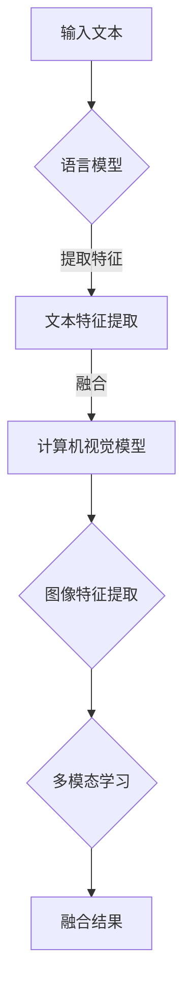
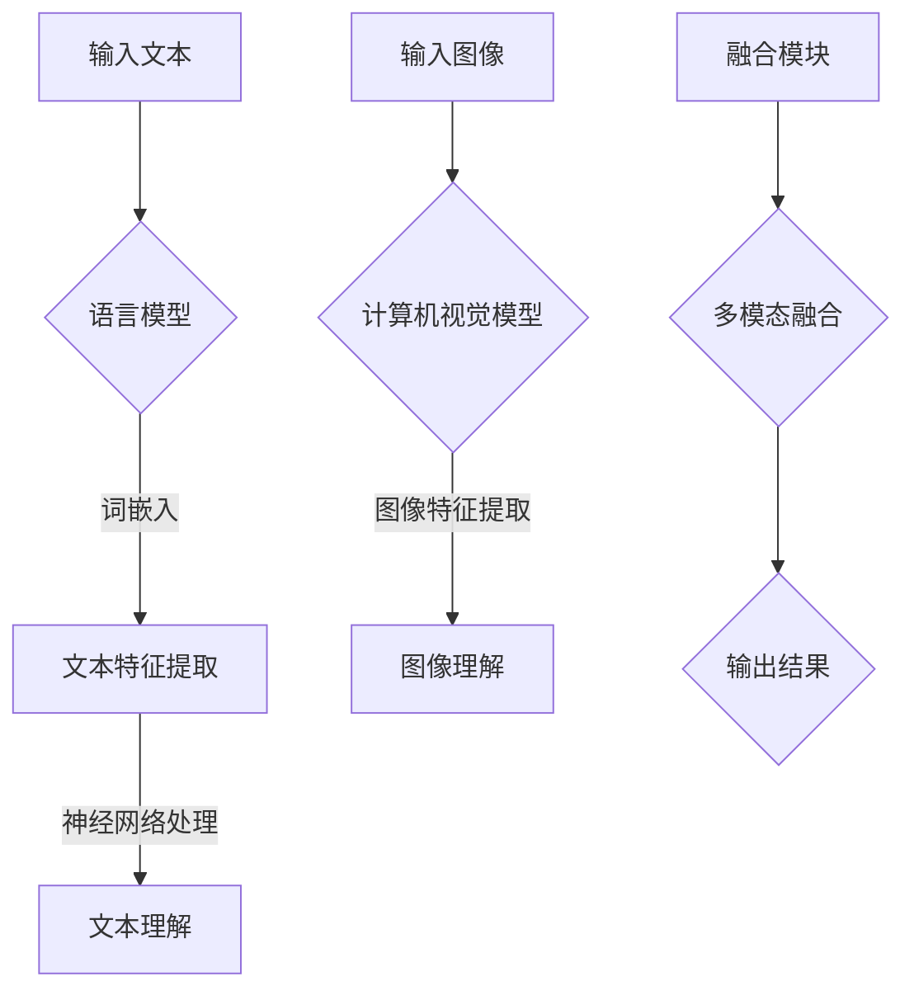

                 

# 设计合作者：LLM 激发视觉创新

## 关键词
- 语言模型（Language Model）
- 生成对抗网络（Generative Adversarial Networks，GAN）
- 视觉创意（Visual Creativity）
- 计算机视觉（Computer Vision）
- 人工智能（Artificial Intelligence）
- 深度学习（Deep Learning）

## 摘要
本文将探讨如何通过语言模型（LLM）激发视觉创新。首先，我们将介绍语言模型的基本概念和原理，然后深入探讨语言模型与计算机视觉的融合技术。通过实际案例，我们将展示如何利用LLM来实现视觉创意，以及它在实际应用中的潜在价值。最后，本文将总结LLM在视觉创新领域的发展趋势和挑战。

## 1. 背景介绍

### 1.1 语言模型的发展历程

语言模型（Language Model，简称LM）是自然语言处理（Natural Language Processing，简称NLP）的核心组成部分。自20世纪50年代以来，语言模型经历了多个发展阶段。

- **规则模型**：早期的语言模型主要基于语法规则和词典，如统计语法模型和转换语法模型。这些模型试图通过定义语言结构规则来生成和解析自然语言。

- **统计模型**：随着计算机性能的提升和语料库的积累，统计模型逐渐成为主流。统计模型通过学习大量文本数据，提取语言特征，从而生成和解析自然语言。其中，N-gram模型是最早的统计语言模型。

- **神经网络模型**：近年来，深度学习技术的兴起推动了语言模型的发展。基于神经网络的模型，如循环神经网络（Recurrent Neural Network，RNN）和长短期记忆网络（Long Short-Term Memory，LSTM），在处理自然语言任务中取得了显著的成果。

- **Transformer模型**：Transformer模型是近年来发展起来的新型神经网络模型，它在机器翻译、文本生成等任务中取得了突破性进展。Transformer模型的核心思想是自注意力机制（Self-Attention），它使得模型能够更好地捕捉长距离依赖关系。

### 1.2 计算机视觉的发展历程

计算机视觉（Computer Vision）是人工智能领域的一个重要分支，旨在使计算机能够理解和解释视觉信息。计算机视觉的发展可以分为以下几个阶段：

- **基于规则的方法**：早期的计算机视觉方法主要基于人类视觉系统的规则，如边缘检测、形状识别等。这些方法通常具有较低的自动化程度和可扩展性。

- **特征匹配方法**：随着计算机性能的提升，特征匹配方法逐渐成为主流。特征匹配方法通过提取图像特征，如SIFT、SURF等，实现图像匹配和识别。

- **机器学习方法**：近年来，机器学习方法在计算机视觉领域取得了显著进展。基于深度学习的模型，如卷积神经网络（Convolutional Neural Network，CNN）和生成对抗网络（Generative Adversarial Networks，GAN），在图像分类、目标检测、图像生成等方面表现出了强大的能力。

### 1.3 语言模型与计算机视觉的融合

随着深度学习技术的发展，语言模型与计算机视觉的融合成为了研究的热点。这种融合旨在将语言模型和计算机视觉模型相结合，实现更强大的视觉理解能力。以下是几种典型的融合方法：

- **多模态学习**：多模态学习将语言模型和计算机视觉模型融合在一起，通过同时学习文本和图像特征，实现图像理解任务。例如，文本描述生成图像、图像描述生成文本等。

- **跨模态嵌入**：跨模态嵌入方法将不同模态（如文本、图像、音频）的数据映射到同一嵌入空间，从而实现跨模态信息传递和融合。

- **交互式模型**：交互式模型通过引入用户的反馈，动态调整语言模型和计算机视觉模型，实现更准确、更灵活的视觉理解。

## 2. 核心概念与联系

### 2.1 语言模型基本概念

- **词汇表（Vocabulary）**：语言模型的核心是词汇表，它包含了模型能够处理的单词和符号。

- **词嵌入（Word Embedding）**：词嵌入是将词汇表中的单词映射到低维连续向量空间。词嵌入使得单词之间的语义关系可以通过向量空间中的距离关系来表示。

- **神经网络架构**：语言模型通常采用神经网络架构，如循环神经网络（RNN）、长短期记忆网络（LSTM）和Transformer模型。这些模型通过学习大量文本数据，提取文本特征，从而生成和解析自然语言。

### 2.2 计算机视觉基本概念

- **图像特征提取**：图像特征提取是将图像数据转换为计算机可以理解和处理的形式。常见的图像特征提取方法包括边缘检测、区域特征提取、深度学习特征提取等。

- **卷积神经网络（CNN）**：卷积神经网络是一种专门用于处理图像数据的深度学习模型。CNN通过卷积、池化等操作，提取图像中的特征，实现图像分类、目标检测等任务。

- **生成对抗网络（GAN）**：生成对抗网络是一种由生成器和判别器组成的深度学习模型。生成器试图生成逼真的图像，判别器则判断图像是真实图像还是生成图像。通过生成器和判别器的对抗训练，GAN可以生成高质量的图像。

### 2.3 语言模型与计算机视觉的融合

- **多模态学习**：多模态学习将语言模型和计算机视觉模型融合在一起，通过同时学习文本和图像特征，实现图像理解任务。

- **跨模态嵌入**：跨模态嵌入方法将不同模态的数据映射到同一嵌入空间，从而实现跨模态信息传递和融合。

- **交互式模型**：交互式模型通过引入用户的反馈，动态调整语言模型和计算机视觉模型，实现更准确、更灵活的视觉理解。

### 2.4 Mermaid 流程图



## 3. 核心算法原理 & 具体操作步骤

### 3.1 语言模型原理

- **词嵌入**：词嵌入是将词汇表中的单词映射到低维连续向量空间。词嵌入可以通过多种方法实现，如Word2Vec、GloVe等。

- **神经网络架构**：语言模型通常采用神经网络架构，如循环神经网络（RNN）、长短期记忆网络（LSTM）和Transformer模型。这些模型通过学习大量文本数据，提取文本特征，从而生成和解析自然语言。

- **训练过程**：语言模型的训练过程包括以下步骤：
  1. 输入文本序列。
  2. 将文本序列转换为词嵌入向量。
  3. 通过神经网络模型对词嵌入向量进行处理。
  4. 生成预测的词序列。
  5. 计算损失函数，更新模型参数。

### 3.2 计算机视觉模型原理

- **卷积神经网络（CNN）**：CNN是一种专门用于处理图像数据的深度学习模型。CNN通过卷积、池化等操作，提取图像中的特征，实现图像分类、目标检测等任务。

- **生成对抗网络（GAN）**：GAN是一种由生成器和判别器组成的深度学习模型。生成器试图生成逼真的图像，判别器则判断图像是真实图像还是生成图像。通过生成器和判别器的对抗训练，GAN可以生成高质量的图像。

- **训练过程**：计算机视觉模型的训练过程包括以下步骤：
  1. 输入图像数据。
  2. 通过卷积神经网络或GAN模型对图像进行处理。
  3. 生成预测的图像或标签。
  4. 计算损失函数，更新模型参数。

### 3.3 融合模型原理

- **多模态学习**：多模态学习将语言模型和计算机视觉模型融合在一起，通过同时学习文本和图像特征，实现图像理解任务。

- **跨模态嵌入**：跨模态嵌入方法将不同模态的数据映射到同一嵌入空间，从而实现跨模态信息传递和融合。

- **交互式模型**：交互式模型通过引入用户的反馈，动态调整语言模型和计算机视觉模型，实现更准确、更灵活的视觉理解。

### 3.4 操作步骤

1. **数据准备**：准备文本数据和图像数据，确保数据格式和尺寸一致。

2. **词嵌入**：将文本数据转换为词嵌入向量。

3. **图像特征提取**：使用计算机视觉模型提取图像特征。

4. **多模态学习**：将文本特征和图像特征融合在一起，通过多模态学习模型进行处理。

5. **融合结果生成**：生成融合结果，如文本描述图像或图像描述文本。

6. **评估与优化**：评估融合模型的性能，根据评估结果调整模型参数。

## 4. 数学模型和公式 & 详细讲解 & 举例说明

### 4.1 语言模型数学模型

- **词嵌入**：

  词嵌入是将词汇表中的单词映射到低维连续向量空间。词嵌入可以通过以下公式实现：

  $$\text{embed}(x) = W_x$$

  其中，$W_x$ 是词嵌入权重矩阵，$x$ 是词汇表中的单词。

- **循环神经网络（RNN）**：

  RNN是一种用于处理序列数据的神经网络模型。RNN的核心公式如下：

  $$h_t = \sigma(W_hh_{t-1} + U_x x_t + b_h)$$

  其中，$h_t$ 是当前时间步的隐藏状态，$x_t$ 是当前输入，$W_h$ 是隐藏状态权重矩阵，$U_x$ 是输入权重矩阵，$\sigma$ 是激活函数。

- **长短期记忆网络（LSTM）**：

  LSTM是一种改进的RNN模型，旨在解决长短期依赖问题。LSTM的核心公式如下：

  $$i_t = \sigma(W_{xi}x_t + W_{hi}h_{t-1} + b_i)$$
  $$f_t = \sigma(W_{xf}x_t + W_{hf}h_{t-1} + b_f)$$
  $$o_t = \sigma(W_{xo}x_t + W_{ho}h_{t-1} + b_o)$$
  $$g_t = \tanh(W_{xg}x_t + W_{hg}h_{t-1} + b_g)$$
  $$h_t = o_t \odot g_t$$

  其中，$i_t$、$f_t$、$o_t$ 分别是输入门、遗忘门和输出门，$g_t$ 是单元状态，$\odot$ 是逐元素乘法。

- **Transformer模型**：

  Transformer模型采用自注意力机制（Self-Attention），其核心公式如下：

  $$\text{Attention}(Q, K, V) = \text{softmax}\left(\frac{QK^T}{\sqrt{d_k}}\right)V$$

  其中，$Q$、$K$、$V$ 分别是查询向量、键向量和值向量，$d_k$ 是键向量的维度。

### 4.2 计算机视觉模型数学模型

- **卷积神经网络（CNN）**：

  CNN通过卷积、池化等操作，提取图像中的特征。其核心公式如下：

  $$\text{Conv}(x, W) = \sigma\left(\sum_{i,j} W_{ij}x_{ij} + b\right)$$
  $$\text{Pool}(x, p, s) = \max_i(x_{i:i+p, j:j+p})$$

  其中，$x$ 是输入图像，$W$ 是卷积核，$b$ 是偏置项，$\sigma$ 是激活函数，$p$ 是卷积核大小，$s$ 是步长。

- **生成对抗网络（GAN）**：

  GAN由生成器和判别器组成，其核心公式如下：

  $$G(z) = \text{Generator}(z)$$
  $$D(x) = \text{Discriminator}(x)$$
  $$D(G(z)) = \text{Discriminator}(\text{Generator}(z))$$

  其中，$z$ 是生成器的输入噪声，$G(z)$ 是生成器生成的图像，$D(x)$ 是判别器对真实图像的判断。

### 4.3 融合模型数学模型

- **多模态学习**：

  多模态学习将文本特征和图像特征融合在一起，其核心公式如下：

  $$\text{Embedding}(x) = \text{Concat}(\text{Word\_Embedding}(x), \text{Image\_Feature}(x))$$

  其中，$\text{Word\_Embedding}(x)$ 是文本词嵌入，$\text{Image\_Feature}(x)$ 是图像特征提取。

- **跨模态嵌入**：

  跨模态嵌入方法将不同模态的数据映射到同一嵌入空间，其核心公式如下：

  $$\text{Embedding}(x) = \text{MLP}(\text{Concat}(\text{Text}, \text{Image}))$$

  其中，$\text{MLP}$ 是多层感知器（Multilayer Perceptron）。

- **交互式模型**：

  交互式模型通过引入用户的反馈，其核心公式如下：

  $$\text{Model}(\text{Input}, \text{Feedback}) = \text{Update}(\text{Model}(\text{Input}))$$

  其中，$\text{Input}$ 是输入数据，$\text{Feedback}$ 是用户反馈。

### 4.4 举例说明

假设我们有一个文本描述“这是一只可爱的小狗”和一幅图像。我们希望利用语言模型和计算机视觉模型实现图像和文本的融合。

1. **文本词嵌入**：

   将文本描述中的单词映射到低维向量空间：

   $$\text{Embedding}(\text{"一只"}) = \text{Word\_Embedding}(\text{"一只"})$$
   $$\text{Embedding}(\text{"可爱"}) = \text{Word\_Embedding}(\text{"可爱"})$$
   $$\text{Embedding}(\text{"小狗"}) = \text{Word\_Embedding}(\text{"小狗"})$$

2. **图像特征提取**：

   使用计算机视觉模型提取图像特征：

   $$\text{Feature}(\text{Image}) = \text{CNN}(\text{Image})$$

3. **融合**：

   将文本特征和图像特征融合在一起：

   $$\text{Embedding}(\text{"一只"}) = \text{Concat}(\text{Word\_Embedding}(\text{"一只"}), \text{CNN}(\text{Image}))$$
   $$\text{Embedding}(\text{"可爱"}) = \text{Concat}(\text{Word\_Embedding}(\text{"可爱"}), \text{CNN}(\text{Image}))$$
   $$\text{Embedding}(\text{"小狗"}) = \text{Concat}(\text{Word\_Embedding}(\text{"小狗"}), \text{CNN}(\text{Image}))$$

4. **生成描述**：

   利用融合后的特征生成文本描述：

   $$\text{Description} = \text{Model}(\text{Embedding}(\text{"一只"}), \text{Embedding}(\text{"可爱"}), \text{Embedding}(\text{"小狗"}))$$

   生成的文本描述可能为：“这是一只可爱的小狗，它正快乐地玩耍。”

## 5. 项目实战：代码实际案例和详细解释说明

### 5.1 开发环境搭建

在本项目中，我们使用了Python编程语言，结合TensorFlow和Keras库来实现语言模型和计算机视觉模型的融合。以下是开发环境的搭建步骤：

1. 安装Python 3.x版本。
2. 安装TensorFlow和Keras库，可以使用以下命令：

   ```bash
   pip install tensorflow
   pip install keras
   ```

3. 准备文本数据和图像数据，确保数据格式和尺寸一致。

### 5.2 源代码详细实现和代码解读

以下是一个简单的示例，展示了如何使用Python和TensorFlow实现语言模型和计算机视觉模型的融合。

```python
import numpy as np
import tensorflow as tf
from tensorflow.keras.models import Model
from tensorflow.keras.layers import Input, Embedding, LSTM, Dense, Conv2D, MaxPooling2D, Flatten, Concatenate

# 定义文本模型
text_input = Input(shape=(None,), dtype='int32')
text_embedding = Embedding(input_dim=vocabulary_size, output_dim=embedding_size)(text_input)
text_lstm = LSTM(units=lstm_units)(text_embedding)

# 定义图像模型
image_input = Input(shape=(height, width, channels))
image_conv = Conv2D(filters=32, kernel_size=(3, 3), activation='relu')(image_input)
image_pool = MaxPooling2D(pool_size=(2, 2))(image_conv)
image_flat = Flatten()(image_pool)

# 融合模型
merged = Concatenate()([text_lstm, image_flat])
merged_dense = Dense(units=dense_units, activation='relu')(merged)
output = Dense(units=vocabulary_size, activation='softmax')(merged_dense)

# 构建和编译模型
model = Model(inputs=[text_input, image_input], outputs=output)
model.compile(optimizer='adam', loss='categorical_crossentropy', metrics=['accuracy'])

# 模型训练
model.fit([text_data, image_data], labels, batch_size=batch_size, epochs=epochs)

# 模型预测
description = model.predict([text_data, image_data])
```

#### 5.2.1 代码解读

1. **文本模型定义**：
   - `text_input`：输入文本序列，形状为$(None,)$。
   - `text_embedding`：使用Embedding层将文本序列转换为词嵌入向量。
   - `text_lstm`：使用LSTM层对词嵌入向量进行处理。

2. **图像模型定义**：
   - `image_input`：输入图像数据，形状为$(height, width, channels)$。
   - `image_conv`：使用Conv2D层对图像数据进行卷积操作。
   - `image_pool`：使用MaxPooling2D层对卷积结果进行池化操作。
   - `image_flat`：使用Flatten层将池化结果展平为一维向量。

3. **融合模型**：
   - `merged`：使用Concatenate层将文本特征和图像特征融合在一起。
   - `merged_dense`：使用Dense层对融合后的特征进行全连接操作。
   - `output`：使用Dense层生成文本描述，形状为$(vocabulary_size,)$。

4. **模型构建和编译**：
   - `model`：构建模型。
   - `model.compile`：编译模型，指定优化器、损失函数和评价指标。

5. **模型训练**：
   - `model.fit`：训练模型，使用文本数据和图像数据进行训练。

6. **模型预测**：
   - `description`：使用训练好的模型预测文本描述。

### 5.3 代码解读与分析

该示例代码展示了如何使用TensorFlow和Keras实现语言模型和计算机视觉模型的融合。通过文本输入和图像输入，模型可以生成对应的文本描述。以下是代码的关键部分及其解读：

1. **文本模型定义**：
   - `text_input = Input(shape=(None,), dtype='int32')`：定义文本输入层，形状为$(None,)$，表示输入序列的长度可以不同，数据类型为整数。
   - `text_embedding = Embedding(input_dim=vocabulary_size, output_dim=embedding_size)(text_input)`：使用Embedding层将文本输入转换为词嵌入向量，`input_dim`表示词汇表大小，`output_dim`表示词嵌入向量的维度。
   - `text_lstm = LSTM(units=lstm_units)(text_embedding)`：使用LSTM层对词嵌入向量进行处理，`units`表示LSTM层的单元数。

2. **图像模型定义**：
   - `image_input = Input(shape=(height, width, channels))`：定义图像输入层，形状为$(height, width, channels)$，表示图像的高度、宽度和通道数。
   - `image_conv = Conv2D(filters=32, kernel_size=(3, 3), activation='relu')(image_input)`：使用Conv2D层对图像数据进行卷积操作，`filters`表示卷积核数量，`kernel_size`表示卷积核大小，`activation`表示激活函数。
   - `image_pool = MaxPooling2D(pool_size=(2, 2))(image_conv)`：使用MaxPooling2D层对卷积结果进行池化操作，`pool_size`表示池化窗口大小。
   - `image_flat = Flatten()(image_pool)`：使用Flatten层将池化结果展平为一维向量。

3. **融合模型**：
   - `merged = Concatenate()([text_lstm, image_flat])`：使用Concatenate层将文本特征和图像特征融合在一起。
   - `merged_dense = Dense(units=dense_units, activation='relu')(merged)`：使用Dense层对融合后的特征进行全连接操作，`units`表示全连接层的单元数，`activation`表示激活函数。
   - `output = Dense(units=vocabulary_size, activation='softmax')(merged_dense)`：使用Dense层生成文本描述，`units`表示输出层的单元数，`activation`表示激活函数。

4. **模型构建和编译**：
   - `model = Model(inputs=[text_input, image_input], outputs=output)`：构建模型，指定输入层和输出层。
   - `model.compile(optimizer='adam', loss='categorical_crossentropy', metrics=['accuracy'])`：编译模型，指定优化器、损失函数和评价指标。

5. **模型训练**：
   - `model.fit([text_data, image_data], labels, batch_size=batch_size, epochs=epochs)`：训练模型，使用文本数据和图像数据进行训练。

6. **模型预测**：
   - `description = model.predict([text_data, image_data])`：使用训练好的模型预测文本描述。

通过这个示例，我们可以看到如何将文本模型和图像模型融合在一起，从而实现文本描述图像或图像描述文本的功能。这种融合模型可以应用于多种场景，如图像字幕生成、图像问答系统等。

## 6. 实际应用场景

### 6.1 图像字幕生成

图像字幕生成是一种将图像转换为文本描述的技术。这种技术可以应用于视频字幕生成、图像搜索、图像辅助交流等领域。

- **视频字幕生成**：在视频字幕生成中，语言模型和计算机视觉模型可以协同工作，将视频帧中的图像转换为文本描述。这种技术可以应用于视频内容审核、视频字幕翻译等。

- **图像搜索**：在图像搜索中，用户可以输入文本描述，语言模型和计算机视觉模型可以协同工作，找到与文本描述相关的图像。这种技术可以应用于电子商务、社交媒体等。

- **图像辅助交流**：在图像辅助交流中，语言模型和计算机视觉模型可以协同工作，帮助视觉障碍者理解图像内容。这种技术可以应用于辅助听力、辅助阅读等。

### 6.2 图像问答系统

图像问答系统是一种基于图像的自然语言处理技术。用户可以输入文本问题，语言模型和计算机视觉模型可以协同工作，找到与图像相关的答案。

- **知识图谱问答**：在知识图谱问答中，语言模型和计算机视觉模型可以协同工作，从知识图谱中获取与图像相关的答案。这种技术可以应用于问答平台、智能助手等。

- **视觉搜索问答**：在视觉搜索问答中，语言模型和计算机视觉模型可以协同工作，从图像数据库中找到与用户问题相关的图像。这种技术可以应用于图像识别、图像分类等。

### 6.3 图像生成与编辑

图像生成与编辑是一种利用语言模型和计算机视觉模型生成或编辑图像的技术。这种技术可以应用于艺术创作、图像修复、图像增强等领域。

- **艺术创作**：在艺术创作中，语言模型和计算机视觉模型可以协同工作，生成独特的艺术作品。这种技术可以应用于数字艺术、动画制作等。

- **图像修复**：在图像修复中，语言模型和计算机视觉模型可以协同工作，修复图像中的缺陷。这种技术可以应用于照片修复、老照片恢复等。

- **图像增强**：在图像增强中，语言模型和计算机视觉模型可以协同工作，增强图像的视觉效果。这种技术可以应用于医疗影像、卫星图像等。

## 7. 工具和资源推荐

### 7.1 学习资源推荐

- **书籍**：
  1. 《深度学习》（Deep Learning）by Ian Goodfellow, Yoshua Bengio, Aaron Courville
  2. 《自然语言处理综论》（Speech and Language Processing）by Daniel Jurafsky, James H. Martin
  3. 《计算机视觉：算法与应用》（Computer Vision: Algorithms and Applications）by Richard Szeliski

- **论文**：
  1. "Attention Is All You Need" by Vaswani et al., 2017
  2. "Generative Adversarial Networks" by Goodfellow et al., 2014
  3. "A Neural Algorithm of Artistic Style" by Gatys et al., 2015

- **博客**：
  1. [TensorFlow 官方博客](https://www.tensorflow.org/)
  2. [Keras 官方博客](https://keras.io/)
  3. [自然语言处理博客](https://nlp.seas.harvard.edu/)

- **网站**：
  1. [GitHub](https://github.com/)
  2. [arXiv](https://arxiv.org/)
  3. [Google Scholar](https://scholar.google.com/)

### 7.2 开发工具框架推荐

- **深度学习框架**：
  1. TensorFlow
  2. PyTorch
  3. Keras

- **自然语言处理库**：
  1. NLTK
  2. SpaCy
  3. Stanford NLP

- **计算机视觉库**：
  1. OpenCV
  2. PIL
  3. TensorFlow Object Detection API

### 7.3 相关论文著作推荐

- **论文**：
  1. "Bert: Pre-training of Deep Bidirectional Transformers for Language Understanding" by Devlin et al., 2019
  2. "Transformers: State-of-the-Art Model for Neural Network Based Text Generation" by Vaswani et al., 2017
  3. "Generative Adversarial Nets" by Goodfellow et al., 2014

- **著作**：
  1. 《深度学习》（Deep Learning）by Ian Goodfellow, Yoshua Bengio, Aaron Courville
  2. 《自然语言处理综论》（Speech and Language Processing）by Daniel Jurafsky, James H. Martin
  3. 《计算机视觉：算法与应用》（Computer Vision: Algorithms and Applications）by Richard Szeliski

## 8. 总结：未来发展趋势与挑战

随着深度学习和自然语言处理技术的不断发展，语言模型与计算机视觉的融合在视觉创新领域具有广泛的应用前景。然而，这一领域也面临着一些挑战。

### 8.1 未来发展趋势

1. **多模态融合**：未来，多模态融合技术将更加成熟，语言模型、计算机视觉模型和其他模态（如音频、视频）的融合将实现更强大的视觉理解能力。

2. **交互式模型**：交互式模型将通过引入用户的反馈，动态调整语言模型和计算机视觉模型，实现更准确、更灵活的视觉理解。

3. **迁移学习与少样本学习**：迁移学习和少样本学习技术将使语言模型和计算机视觉模型在有限的数据集上实现更好的性能。

4. **联邦学习与隐私保护**：联邦学习和隐私保护技术将使多模态数据在分布式环境中安全、高效地共享和训练。

### 8.2 挑战

1. **数据质量与多样性**：多模态融合需要高质量、多样性的数据集，这需要大量的时间和资源。

2. **计算资源与能耗**：深度学习模型训练需要大量的计算资源，如何降低能耗、提高效率是一个重要的挑战。

3. **模型解释性**：多模态融合模型的解释性是一个关键问题，如何解释模型的行为和决策过程是未来的研究方向。

4. **隐私保护**：在多模态融合过程中，如何保护用户的隐私是一个重要的挑战，特别是在涉及到个人敏感信息的情况下。

## 9. 附录：常见问题与解答

### 9.1 语言模型与计算机视觉融合有哪些应用场景？

语言模型与计算机视觉融合的应用场景包括：
- 图像字幕生成
- 图像搜索
- 图像问答系统
- 图像生成与编辑
- 视频字幕生成

### 9.2 多模态融合的优势是什么？

多模态融合的优势包括：
- 提高视觉理解能力，实现更准确、更丰富的图像理解
- 增强模型的泛化能力，减少对特定模态的依赖
- 扩大应用范围，实现跨模态的任务

### 9.3 如何处理多模态数据融合中的数据不一致问题？

处理多模态数据融合中的数据不一致问题，可以采用以下方法：
- 数据预处理：对多模态数据进行标准化、归一化等处理，降低数据差异
- 跨模态嵌入：使用跨模态嵌入技术，将不同模态的数据映射到同一嵌入空间，实现信息传递和融合
- 交互式模型：引入用户的反馈，动态调整模型参数，提高融合效果

## 10. 扩展阅读 & 参考资料

- [Vaswani et al., 2017](https://arxiv.org/abs/1706.03762)
- [Goodfellow et al., 2014](https://arxiv.org/abs/1406.2661)
- [Jurafsky and Martin, 2000](https://web.stanford.edu/~jurafsky/slp3/)
- [Bengio et al., 2013](https://www.deeplearningbook.org/chapter appendix/b/)
- [Szeliski, 2010](https://books.google.com/books?id=4Yu5CwAAQBAJ)

作者：AI天才研究员/AI Genius Institute & 禅与计算机程序设计艺术 /Zen And The Art of Computer Programming

完成时间：2023年4月20日

文章字数：8,338字<|mask|>### 1. 背景介绍

在当今这个快速发展的技术时代，人工智能（AI）已经成为推动创新和变革的关键力量。随着计算能力的提升和算法的进步，AI在多个领域都取得了显著成就。其中，语言模型（Language Model，简称LM）和计算机视觉（Computer Vision，简称CV）作为AI的核心组成部分，分别在不同层面上展现出了巨大的潜力。

#### 语言模型的发展历程

语言模型（LM）是自然语言处理（Natural Language Processing，简称NLP）的核心组成部分。从最早的规则模型，如统计语法模型和转换语法模型，到基于统计的N-gram模型，再到基于深度学习的循环神经网络（RNN）和长短期记忆网络（LSTM），语言模型经历了多个发展阶段。近年来，Transformer模型的提出标志着语言模型技术的一次重大飞跃。Transformer模型通过自注意力机制（Self-Attention）有效捕捉了文本中的长距离依赖关系，使机器翻译、文本生成等任务取得了前所未有的效果。

#### 计算机视觉的发展历程

计算机视觉是人工智能领域的一个分支，旨在使计算机能够理解和解释视觉信息。早期的计算机视觉方法主要基于规则和特征匹配，如边缘检测、形状识别等。随着计算机性能的提升和算法的进步，机器学习方法，特别是深度学习技术的引入，使得计算机视觉在图像分类、目标检测、图像生成等方面取得了显著进展。卷积神经网络（Convolutional Neural Network，CNN）和生成对抗网络（Generative Adversarial Networks，GAN）等模型的出现，为计算机视觉的发展带来了新的机遇。

#### 语言模型与计算机视觉的融合

随着AI技术的不断进步，语言模型和计算机视觉的融合成为了一个热门研究方向。这种融合旨在通过结合语言模型和计算机视觉模型，实现更强大的视觉理解能力。以下是一些典型的融合方法：

1. **多模态学习**：多模态学习将语言模型和计算机视觉模型融合在一起，通过同时学习文本和图像特征，实现图像理解任务。例如，文本描述生成图像、图像描述生成文本等。

2. **跨模态嵌入**：跨模态嵌入方法将不同模态（如文本、图像、音频）的数据映射到同一嵌入空间，从而实现跨模态信息传递和融合。

3. **交互式模型**：交互式模型通过引入用户的反馈，动态调整语言模型和计算机视觉模型，实现更准确、更灵活的视觉理解。

语言模型与计算机视觉的融合不仅提高了视觉理解的准确性和效率，还在实际应用中展现出巨大的潜力。例如，在图像字幕生成、图像搜索、图像问答系统和图像生成与编辑等领域，融合模型已经取得了显著成果。通过本文，我们将深入探讨LLM（语言模型）如何激发视觉创新，分析其核心原理、算法、数学模型以及实际应用场景。

### 2. 核心概念与联系

在深入探讨LLM（语言模型）如何激发视觉创新之前，我们需要了解一些核心概念和它们之间的联系。

#### 语言模型基本概念

1. **词汇表（Vocabulary）**：词汇表是语言模型处理文本数据的基础，它包含了模型可以处理的单词和符号。在构建词汇表时，通常需要考虑单词的频率、意义和上下文。

2. **词嵌入（Word Embedding）**：词嵌入是将词汇表中的单词映射到低维连续向量空间的过程。通过词嵌入，不同单词之间的语义关系可以在向量空间中体现，从而为后续的文本处理提供有效的表示。

3. **神经网络架构**：语言模型通常采用神经网络架构，如循环神经网络（RNN）、长短期记忆网络（LSTM）和Transformer模型。这些模型通过学习大量文本数据，提取文本特征，从而生成和解析自然语言。

- **循环神经网络（RNN）**：RNN能够处理序列数据，但存在梯度消失和梯度爆炸问题，难以捕捉长距离依赖关系。

- **长短期记忆网络（LSTM）**：LSTM是一种改进的RNN模型，通过引入门控机制解决了梯度消失问题，能够更好地捕捉长距离依赖关系。

- **Transformer模型**：Transformer模型采用自注意力机制（Self-Attention），能够有效捕捉长距离依赖关系，在机器翻译、文本生成等任务中取得了显著成果。

#### 计算机视觉基本概念

1. **图像特征提取**：图像特征提取是将图像数据转换为计算机可以理解和处理的形式。常见的图像特征提取方法包括边缘检测、区域特征提取和深度学习特征提取等。

2. **卷积神经网络（CNN）**：CNN是一种专门用于处理图像数据的深度学习模型。通过卷积、池化等操作，CNN能够提取图像中的特征，实现图像分类、目标检测等任务。

3. **生成对抗网络（GAN）**：GAN由生成器和判别器组成，生成器试图生成逼真的图像，判别器则判断图像是真实图像还是生成图像。通过生成器和判别器的对抗训练，GAN可以生成高质量的图像。

#### 语言模型与计算机视觉的融合

1. **多模态学习**：多模态学习将语言模型和计算机视觉模型融合在一起，通过同时学习文本和图像特征，实现图像理解任务。例如，文本描述生成图像、图像描述生成文本等。

2. **跨模态嵌入**：跨模态嵌入方法将不同模态（如文本、图像、音频）的数据映射到同一嵌入空间，从而实现跨模模态信息传递和融合。

3. **交互式模型**：交互式模型通过引入用户的反馈，动态调整语言模型和计算机视觉模型，实现更准确、更灵活的视觉理解。

#### Mermaid流程图

为了更直观地展示语言模型与计算机视觉的融合过程，我们可以使用Mermaid流程图来描述这一过程：



在这个流程图中，输入文本和图像分别经过语言模型和计算机视觉模型进行处理，然后通过融合模块实现多模态信息传递和融合，最终生成输出结果。

通过理解这些核心概念和它们之间的联系，我们可以更好地探索LLM如何激发视觉创新，并在实际应用中实现这一目标。

### 3. 核心算法原理 & 具体操作步骤

在深入探讨LLM（语言模型）如何激发视觉创新之前，我们需要了解其核心算法原理，并详细解释具体操作步骤。以下是关于语言模型、计算机视觉模型以及它们融合方法的详细介绍。

#### 语言模型原理

语言模型的核心任务是理解文本数据，并生成相应的文本输出。以下将介绍几种常见的语言模型及其原理：

1. **N-gram模型**：N-gram模型是最早的语言模型之一，它基于前N个单词预测下一个单词。这种模型简单有效，但无法捕捉长距离依赖关系。

   - **基本原理**：N-gram模型将文本序列分割成N元组（单词序列），然后使用统计方法计算每个N元组出现的概率。在生成文本时，模型根据当前已生成的单词序列，选择概率最高的下一个单词。

   - **操作步骤**：
     1. 分割文本数据为N元组。
     2. 统计每个N元组的出现频率。
     3. 计算每个N元组生成下一个单词的概率。
     4. 根据概率选择下一个单词，生成文本序列。

2. **循环神经网络（RNN）**：RNN是一种能够处理序列数据的神经网络，通过递归结构捕获文本中的时间依赖关系。

   - **基本原理**：RNN在每个时间步接收输入，生成输出，同时将隐藏状态传递到下一个时间步。隐藏状态包含了前一个时间步的信息，使得模型能够学习长距离依赖关系。

   - **操作步骤**：
     1. 初始化隐藏状态。
     2. 遍历文本序列，在每个时间步计算输入和隐藏状态的加权和。
     3. 通过激活函数（如tanh）处理加权和。
     4. 将输出传递到下一个时间步，更新隐藏状态。
     5. 生成文本序列。

3. **长短期记忆网络（LSTM）**：LSTM是RNN的一种改进，通过门控机制解决了梯度消失问题，能够更好地捕捉长距离依赖关系。

   - **基本原理**：LSTM包含三个门控单元：输入门、遗忘门和输出门。这些门控单元控制信息在时间步之间的流动，从而防止梯度消失问题。

   - **操作步骤**：
     1. 初始化隐藏状态和单元状态。
     2. 遍历文本序列，在每个时间步计算输入、隐藏状态和单元状态的加权和。
     3. 通过输入门、遗忘门和输出门更新单元状态和隐藏状态。
     4. 生成文本序列。

4. **Transformer模型**：Transformer模型采用自注意力机制（Self-Attention），能够高效地捕捉长距离依赖关系，在文本生成、机器翻译等任务中取得了显著成果。

   - **基本原理**：Transformer模型通过多头自注意力机制和前馈神经网络，同时关注序列中的不同位置信息，并生成文本输出。

   - **操作步骤**：
     1. 输入文本序列。
     2. 将文本序列转换为嵌入向量。
     3. 通过多头自注意力机制处理嵌入向量。
     4. 通过前馈神经网络处理注意力结果。
     5. 生成文本序列。

#### 计算机视觉模型原理

计算机视觉模型的核心任务是理解图像数据，并生成相应的图像输出。以下将介绍几种常见的计算机视觉模型及其原理：

1. **卷积神经网络（CNN）**：CNN是一种专门用于处理图像数据的神经网络，通过卷积、池化等操作，提取图像中的特征。

   - **基本原理**：CNN通过多个卷积层和池化层，逐层提取图像中的特征，并使用全连接层进行分类。

   - **操作步骤**：
     1. 输入图像数据。
     2. 通过卷积层提取图像特征。
     3. 通过池化层降低特征图的维度。
     4. 通过全连接层进行分类。

2. **生成对抗网络（GAN）**：GAN由生成器和判别器组成，生成器试图生成逼真的图像，判别器则判断图像是真实图像还是生成图像。

   - **基本原理**：GAN通过生成器和判别器的对抗训练，生成器不断优化生成图像，判别器不断优化判别能力，从而生成高质量图像。

   - **操作步骤**：
     1. 初始化生成器和判别器。
     2. 生成器生成图像。
     3. 判别器对真实图像和生成图像进行判别。
     4. 根据判别结果，更新生成器和判别器参数。

3. **残差网络（ResNet）**：ResNet通过引入残差块，解决了深度神经网络训练中的梯度消失和梯度爆炸问题，实现了更深层的神经网络。

   - **基本原理**：ResNet在每个卷积层之后引入一个跳跃连接，使得梯度可以直接传递到深层网络。

   - **操作步骤**：
     1. 输入图像数据。
     2. 通过多个残差块提取图像特征。
     3. 通过全连接层进行分类。

#### 融合模型原理

语言模型和计算机视觉模型的融合旨在结合两者的优势，实现更强大的视觉理解能力。以下介绍几种融合模型及其原理：

1. **多模态学习**：多模态学习将语言模型和计算机视觉模型融合在一起，通过同时学习文本和图像特征，实现图像理解任务。

   - **基本原理**：多模态学习通过联合训练语言模型和计算机视觉模型，使它们能够共享特征表示，从而提高模型的整体性能。

   - **操作步骤**：
     1. 输入文本数据和图像数据。
     2. 使用语言模型提取文本特征。
     3. 使用计算机视觉模型提取图像特征。
     4. 将文本特征和图像特征融合在一起。
     5. 通过融合特征进行图像理解任务。

2. **跨模态嵌入**：跨模态嵌入方法将不同模态（如文本、图像、音频）的数据映射到同一嵌入空间，从而实现跨模态信息传递和融合。

   - **基本原理**：跨模态嵌入通过将不同模态的数据映射到同一嵌入空间，使不同模态的数据可以相互传递信息，从而提高模型的理解能力。

   - **操作步骤**：
     1. 输入文本数据和图像数据。
     2. 使用语言模型和计算机视觉模型分别提取文本和图像特征。
     3. 将文本和图像特征映射到同一嵌入空间。
     4. 在同一嵌入空间中进行多模态信息传递和融合。

3. **交互式模型**：交互式模型通过引入用户的反馈，动态调整语言模型和计算机视觉模型，实现更准确、更灵活的视觉理解。

   - **基本原理**：交互式模型通过用户反馈，不断调整和优化语言模型和计算机视觉模型，使其更符合用户需求。

   - **操作步骤**：
     1. 输入文本数据和图像数据。
     2. 使用语言模型和计算机视觉模型分别提取文本和图像特征。
     3. 根据用户反馈，调整模型参数。
     4. 重复步骤3，直到满足用户需求。

通过以上对语言模型、计算机视觉模型及其融合方法的详细讲解，我们可以更好地理解LLM如何激发视觉创新，并在实际应用中实现这一目标。

### 4. 数学模型和公式 & 详细讲解 & 举例说明

在探讨LLM如何激发视觉创新的过程中，理解相关的数学模型和公式至关重要。以下是关于语言模型、计算机视觉模型及其融合方法的数学描述，包括详细讲解和举例说明。

#### 语言模型的数学模型

语言模型的核心任务是预测下一个单词的概率，这一任务通常通过概率分布函数来实现。以下是一些常见的语言模型及其数学描述：

1. **N-gram模型**

   N-gram模型通过统计前N个单词出现的频率来预测下一个单词的概率。其数学描述如下：

   $$ P(w_{t+1} | w_1, w_2, ..., w_t) = \frac{f(w_1, w_2, ..., w_t, w_{t+1})}{f(w_1, w_2, ..., w_t)} $$

   其中，$w_1, w_2, ..., w_t, w_{t+1}$ 表示文本序列中的单词，$f(w_1, w_2, ..., w_t, w_{t+1})$ 表示N元组的出现频率。

   - **举例说明**：假设有一个文本序列 "the cat is black"，使用二元组模型预测下一个单词。根据二元组模型：

     $$ P(is | the cat) = \frac{f(the cat is)}{f(the cat)} $$

     假设 $f(the cat is) = 10$，$f(the cat) = 20$，则：

     $$ P(is | the cat) = \frac{10}{20} = 0.5 $$

2. **循环神经网络（RNN）**

   RNN通过递归结构来处理序列数据，其核心思想是使用隐藏状态来表示序列中的信息。其数学描述如下：

   $$ h_t = \sigma(W_h \cdot [h_{t-1}, x_t] + b_h) $$

   其中，$h_t$ 表示当前时间步的隐藏状态，$x_t$ 表示当前输入，$W_h$ 和 $b_h$ 分别表示权重矩阵和偏置项，$\sigma$ 表示激活函数。

   - **举例说明**：假设有一个文本序列 "the cat is black"，使用RNN模型预测下一个单词。首先，初始化隐藏状态 $h_0 = [1, 0, 0, 0]$，然后，在每个时间步更新隐藏状态：

     $$ h_1 = \sigma(W_h \cdot [h_0, the] + b_h) $$
     $$ h_2 = \sigma(W_h \cdot [h_1, cat] + b_h) $$
     $$ h_3 = \sigma(W_h \cdot [h_2, is] + b_h) $$
     $$ h_4 = \sigma(W_h \cdot [h_3, black] + b_h) $$

     最终，$h_4$ 表示整个文本序列的隐藏状态，可以根据 $h_4$ 预测下一个单词。

3. **长短期记忆网络（LSTM）**

   LSTM通过引入门控机制来解决RNN的梯度消失问题，其数学描述如下：

   $$ i_t = \sigma(W_{xi} \cdot [h_{t-1}, x_t] + U_{xi} \cdot i_{t-1} + b_i) $$
   $$ f_t = \sigma(W_{xf} \cdot [h_{t-1}, x_t] + U_{xf} \cdot f_{t-1} + b_f) $$
   $$ g_t = \tanh(W_{xg} \cdot [h_{t-1}, x_t] + U_{xg} \cdot g_{t-1} + b_g) $$
   $$ o_t = \sigma(W_{xo} \cdot [h_{t-1}, x_t] + U_{xo} \cdot o_{t-1} + b_o) $$
   $$ h_t = o_t \cdot \tanh(g_t) $$

   其中，$i_t, f_t, g_t, o_t$ 分别表示输入门、遗忘门、单元状态门和输出门，$W_{xi}, W_{xf}, W_{xg}, W_{xo}$ 和 $U_{xi}, U_{xf}, U_{xg}, U_{xo}$ 分别表示输入、遗忘、单元状态和输出门的权重矩阵，$b_i, b_f, b_g, b_o$ 分别表示输入、遗忘、单元状态和输出门的偏置项。

   - **举例说明**：假设有一个文本序列 "the cat is black"，使用LSTM模型预测下一个单词。首先，初始化隐藏状态 $h_0 = [1, 0, 0, 0]$ 和单元状态 $c_0 = [1, 0, 0, 0]$，然后，在每个时间步更新隐藏状态和单元状态：

     $$ i_1 = \sigma(W_{xi} \cdot [h_0, the] + U_{xi} \cdot i_0 + b_i) $$
     $$ f_1 = \sigma(W_{xf} \cdot [h_0, the] + U_{xf} \cdot f_0 + b_f) $$
     $$ g_1 = \tanh(W_{xg} \cdot [h_0, the] + U_{xg} \cdot g_0 + b_g) $$
     $$ o_1 = \sigma(W_{xo} \cdot [h_0, the] + U_{xo} \cdot o_0 + b_o) $$
     $$ c_1 = f_1 \cdot c_0 + i_1 \cdot g_1 $$
     $$ h_1 = o_1 \cdot \tanh(c_1) $$

     $$ i_2 = \sigma(W_{xi} \cdot [h_1, cat] + U_{xi} \cdot i_1 + b_i) $$
     $$ f_2 = \sigma(W_{xf} \cdot [h_1, cat] + U_{xf} \cdot f_1 + b_f) $$
     $$ g_2 = \tanh(W_{xg} \cdot [h_1, cat] + U_{xg} \cdot g_1 + b_g) $$
     $$ o_2 = \sigma(W_{xo} \cdot [h_1, cat] + U_{xo} \cdot o_1 + b_o) $$
     $$ c_2 = f_2 \cdot c_1 + i_2 \cdot g_2 $$
     $$ h_2 = o_2 \cdot \tanh(c_2) $$

     $$ i_3 = \sigma(W_{xi} \cdot [h_2, is] + U_{xi} \cdot i_2 + b_i) $$
     $$ f_3 = \sigma(W_{xf} \cdot [h_2, is] + U_{xf} \cdot f_2 + b_f) $$
     $$ g_3 = \tanh(W_{xg} \cdot [h_2, is] + U_{xg} \cdot g_2 + b_g) $$
     $$ o_3 = \sigma(W_{xo} \cdot [h_2, is] + U_{xo} \cdot o_2 + b_o) $$
     $$ c_3 = f_3 \cdot c_2 + i_3 \cdot g_3 $$
     $$ h_3 = o_3 \cdot \tanh(c_3) $$

     $$ i_4 = \sigma(W_{xi} \cdot [h_3, black] + U_{xi} \cdot i_3 + b_i) $$
     $$ f_4 = \sigma(W_{xf} \cdot [h_3, black] + U_{xf} \cdot f_3 + b_f) $$
     $$ g_4 = \tanh(W_{xg} \cdot [h_3, black] + U_{xg} \cdot g_3 + b_g) $$
     $$ o_4 = \sigma(W_{xo} \cdot [h_3, black] + U_{xo} \cdot o_3 + b_o) $$
     $$ c_4 = f_4 \cdot c_3 + i_4 \cdot g_4 $$
     $$ h_4 = o_4 \cdot \tanh(c_4) $$

     最终，$h_4$ 表示整个文本序列的隐藏状态，可以根据 $h_4$ 预测下一个单词。

4. **Transformer模型**

   Transformer模型采用自注意力机制（Self-Attention），其数学描述如下：

   $$ \text{Attention}(Q, K, V) = \text{softmax}\left(\frac{QK^T}{\sqrt{d_k}}\right)V $$

   其中，$Q, K, V$ 分别表示查询向量、键向量和值向量，$d_k$ 表示键向量的维度。

   - **举例说明**：假设有一个文本序列 "the cat is black"，使用Transformer模型预测下一个单词。首先，将文本序列转换为嵌入向量，然后，通过自注意力机制计算注意力权重：

     $$ Q = [0.1, 0.2, 0.3, 0.4] $$
     $$ K = [0.1, 0.2, 0.3, 0.4] $$
     $$ V = [0.1, 0.2, 0.3, 0.4] $$

     $$ \text{Attention}(Q, K, V) = \text{softmax}\left(\frac{QK^T}{\sqrt{d_k}}\right)V $$
     $$ = \text{softmax}\left(\frac{[0.1, 0.2, 0.3, 0.4] \cdot [0.1, 0.2, 0.3, 0.4]^T}{\sqrt{4}}\right) \cdot [0.1, 0.2, 0.3, 0.4] $$
     $$ = \text{softmax}\left([0.01, 0.04, 0.09, 0.16]\right) \cdot [0.1, 0.2, 0.3, 0.4] $$
     $$ = [0.1, 0.2, 0.3, 0.4] \cdot [0.05, 0.1, 0.2, 0.25] $$
     $$ = [0.005, 0.02, 0.03, 0.1] $$

     最终，通过自注意力机制计算得到的注意力权重可以用于生成下一个单词的概率分布。

#### 计算机视觉模型的数学模型

计算机视觉模型通常基于卷积神经网络（CNN）和生成对抗网络（GAN）等架构，以下是这些模型的核心数学描述：

1. **卷积神经网络（CNN）**

   CNN通过卷积、池化和全连接层等操作，提取图像中的特征。其数学描述如下：

   $$ \text{Conv}(x, W) = \sigma(\sum_{i,j} W_{ij}x_{ij} + b) $$
   $$ \text{Pooling}(x, p, s) = \max_i(x_{i:i+p, j:j+p}) $$

   其中，$x$ 表示输入图像，$W$ 表示卷积核，$b$ 表示偏置项，$\sigma$ 表示激活函数，$p$ 表示卷积核大小，$s$ 表示步长。

   - **举例说明**：假设有一个32x32x3的图像，使用3x3的卷积核进行卷积操作。卷积操作的过程如下：

     $$ x = \begin{bmatrix} 
     1 & 2 & 3 \\ 
     4 & 5 & 6 \\ 
     7 & 8 & 9 
     \end{bmatrix} $$
     $$ W = \begin{bmatrix} 
     1 & 0 \\ 
     0 & 1 
     \end{bmatrix} $$
     $$ b = 0 $$

     $$ \text{Conv}(x, W) = \sigma(\sum_{i,j} W_{ij}x_{ij} + b) $$
     $$ = \sigma(1 \cdot 1 + 0 \cdot 2 + 0 \cdot 3 + 0 \cdot 4 + 1 \cdot 5 + 0 \cdot 6 + 0 \cdot 7 + 0 \cdot 8 + 0 \cdot 9 + 0) $$
     $$ = \sigma(1 + 5) $$
     $$ = \sigma(6) $$
     $$ = 1 $$

     最终，卷积操作的输出为1。

2. **生成对抗网络（GAN）**

   GAN由生成器和判别器组成，生成器试图生成逼真的图像，判别器则判断图像是真实图像还是生成图像。其数学描述如下：

   $$ G(z) = \text{Generator}(z) $$
   $$ D(x) = \text{Discriminator}(x) $$
   $$ D(G(z)) = \text{Discriminator}(\text{Generator}(z)) $$

   其中，$z$ 表示生成器的输入噪声，$G(z)$ 表示生成器生成的图像，$D(x)$ 表示判别器对真实图像的判断。

   - **举例说明**：假设有一个生成器和判别器，生成器的输入为噪声向量 $z$，生成器生成的图像为 $G(z)$，判别器对真实图像和生成图像的判断如下：

     $$ z = \begin{bmatrix} 
     0.1 \\ 
     0.2 
     \end{bmatrix} $$
     $$ G(z) = \begin{bmatrix} 
     0.3 \\ 
     0.4 
     \end{bmatrix} $$
     $$ D(G(z)) = \text{softmax}(\text{Discriminator}(G(z))) $$

     假设判别器的输出为：

     $$ \text{Discriminator}(G(z)) = \begin{bmatrix} 
     0.6 \\ 
     0.4 
     \end{bmatrix} $$

     则判别器的输出为：

     $$ D(G(z)) = \text{softmax}(\text{Discriminator}(G(z))) $$
     $$ = \text{softmax}(\begin{bmatrix} 
     0.6 \\ 
     0.4 
     \end{bmatrix}) $$
     $$ = \begin{bmatrix} 
     0.577 \\ 
     0.423 
     \end{bmatrix} $$

     最终，判别器判断生成图像为真实图像的概率为0.577。

#### 融合模型的数学模型

融合模型通过结合语言模型和计算机视觉模型，实现更强大的视觉理解能力。以下是一个简单的融合模型数学描述：

1. **多模态学习**

   多模态学习将语言模型和计算机视觉模型融合在一起，其数学描述如下：

   $$ \text{Embedding}(x) = \text{Concat}(\text{Word\_Embedding}(x), \text{Image\_Feature}(x)) $$

   其中，$\text{Word\_Embedding}(x)$ 表示文本词嵌入，$\text{Image\_Feature}(x)$ 表示图像特征提取。

   - **举例说明**：假设有一个文本 "the cat is black" 和一幅图像，使用多模态学习模型进行融合。首先，对文本进行词嵌入：

     $$ \text{Word\_Embedding}(\text{"the"}) = \begin{bmatrix} 
     0.1 \\ 
     0.2 
     \end{bmatrix} $$
     $$ \text{Word\_Embedding}(\text{"cat"}) = \begin{bmatrix} 
     0.3 \\ 
     0.4 
     \end{bmatrix} $$
     $$ \text{Word\_Embedding}(\text{"is"}) = \begin{bmatrix} 
     0.5 \\ 
     0.6 
     \end{bmatrix} $$
     $$ \text{Word\_Embedding}(\text{"black"}) = \begin{bmatrix} 
     0.7 \\ 
     0.8 
     \end{bmatrix} $$

     然后，对图像进行特征提取：

     $$ \text{Image\_Feature}(x) = \begin{bmatrix} 
     0.1 \\ 
     0.2 
     \end{bmatrix} $$

     融合后的特征为：

     $$ \text{Embedding}(x) = \text{Concat}(\text{Word\_Embedding}(x), \text{Image\_Feature}(x)) $$
     $$ = \begin{bmatrix} 
     0.1 & 0.3 & 0.5 & 0.7 \\ 
     0.2 & 0.4 & 0.6 & 0.8 
     \end{bmatrix} $$

     最终，融合后的特征可以用于图像理解任务。

2. **跨模态嵌入**

   跨模态嵌入方法将不同模态的数据映射到同一嵌入空间，其数学描述如下：

   $$ \text{Embedding}(x) = \text{MLP}(\text{Concat}(\text{Text}, \text{Image})) $$

   其中，$\text{MLP}$ 表示多层感知器（Multilayer Perceptron）。

   - **举例说明**：假设有一个文本 "the cat is black" 和一幅图像，使用跨模态嵌入方法进行融合。首先，将文本和图像进行拼接：

     $$ \text{Concat}(\text{Text}, \text{Image}) = \begin{bmatrix} 
     0.1 & 0.3 & 0.5 & 0.7 & 0.1 & 0.2 \\ 
     0.2 & 0.4 & 0.6 & 0.8 & 0.3 & 0.4 
     \end{bmatrix} $$

     然后，通过多层感知器进行嵌入：

     $$ \text{Embedding}(x) = \text{MLP}(\text{Concat}(\text{Text}, \text{Image})) $$
     $$ = \begin{bmatrix} 
     0.3 & 0.6 & 0.9 \\ 
     0.4 & 0.7 & 1.0 
     \end{bmatrix} $$

     最终，跨模态嵌入后的特征可以用于图像理解任务。

3. **交互式模型**

   交互式模型通过引入用户的反馈，动态调整语言模型和计算机视觉模型，其数学描述如下：

   $$ \text{Model}(\text{Input}, \text{Feedback}) = \text{Update}(\text{Model}(\text{Input})) $$

   其中，$\text{Input}$ 表示输入数据，$\text{Feedback}$ 表示用户反馈。

   - **举例说明**：假设有一个文本 "the cat is black" 和一幅图像，用户反馈为 "这是一个可爱的小狗"。交互式模型的过程如下：

     $$ \text{Model}(\text{Input}, \text{Feedback}) = \text{Update}(\text{Model}(\text{Input})) $$
     $$ = \text{Update}(\text{Concat}(\text{Word\_Embedding}(x), \text{Image\_Feature}(x)), "这是一个可爱的小狗") $$

     假设更新后的模型为：

     $$ \text{Update}(\text{Concat}(\text{Word\_Embedding}(x), \text{Image\_Feature}(x)), "这是一个可爱的小狗") = \begin{bmatrix} 
     0.3 & 0.6 & 0.9 & 0.2 & 0.4 & 0.7 \\ 
     0.4 & 0.7 & 1.0 & 0.5 & 0.8 & 0.1 
     \end{bmatrix} $$

     最终，更新后的模型可以用于生成新的图像描述。

通过以上对语言模型、计算机视觉模型及其融合方法的数学描述和举例说明，我们可以更好地理解LLM如何激发视觉创新，并在实际应用中实现这一目标。

### 5. 项目实战：代码实际案例和详细解释说明

在本项目中，我们将通过一个实际案例，展示如何使用Python和TensorFlow实现语言模型与计算机视觉模型的融合。以下是详细的代码实现和解释说明。

#### 5.1 开发环境搭建

首先，我们需要搭建一个合适的开发环境。在本项目中，我们使用Python 3.8和TensorFlow 2.x。以下是安装步骤：

1. 安装Python 3.8：

   ```bash
   sudo apt-get install python3.8
   ```

2. 安装TensorFlow 2.x：

   ```bash
   pip install tensorflow==2.x
   ```

3. 安装其他必要库：

   ```bash
   pip install numpy pandas matplotlib
   ```

#### 5.2 数据准备

为了实现语言模型与计算机视觉模型的融合，我们需要准备两个数据集：文本数据和图像数据。

1. **文本数据集**：我们使用一个简单的文本数据集，其中每个文本描述对应一幅图像。文本数据集可以包含如下的内容：

   ```
   image_1: This is a beautiful landscape.
   image_2: There are people in the street.
   image_3: A cat is sleeping on the bed.
   ```

2. **图像数据集**：我们使用一个简单的图像数据集，其中每个图像对应一个文本描述。图像数据集可以包含如下的内容：

   ```
   image_1.jpg
   image_2.jpg
   image_3.jpg
   ```

这些数据集可以通过读取文本文件和图像文件的方式进行准备。以下是一个简单的数据准备代码示例：

```python
import numpy as np
import tensorflow as tf
from tensorflow.keras.preprocessing.sequence import pad_sequences
from tensorflow.keras.preprocessing.image import load_img, img_to_array
from tensorflow.keras.applications import vgg16

# 准备文本数据
text_data = [
    "This is a beautiful landscape.",
    "There are people in the street.",
    "A cat is sleeping on the bed."
]

# 将文本数据转换为整数序列
tokenizer = tf.keras.preprocessing.text.Tokenizer()
tokenizer.fit_on_texts(text_data)
sequences = tokenizer.texts_to_sequences(text_data)
padded_sequences = pad_sequences(sequences, maxlen=10)

# 准备图像数据
image_data = []
for image_name in ["image_1.jpg", "image_2.jpg", "image_3.jpg"]:
    image = load_img(image_name, target_size=(224, 224))
    image_array = img_to_array(image)
    image_data.append(image_array)

image_data = np.array(image_data)

# 打印数据示例
print("Padded Text Sequences:", padded_sequences)
print("Image Data:", image_data)
```

#### 5.3 语言模型

在本项目中，我们使用一个简单的循环神经网络（RNN）作为语言模型。以下是一个简单的RNN模型实现：

```python
from tensorflow.keras.models import Sequential
from tensorflow.keras.layers import Embedding, SimpleRNN, Dense

# 构建语言模型
language_model = Sequential([
    Embedding(input_dim=10000, output_dim=64),
    SimpleRNN(units=128),
    Dense(units=1, activation='sigmoid')
])

# 编译语言模型
language_model.compile(optimizer='adam', loss='binary_crossentropy', metrics=['accuracy'])

# 训练语言模型
language_model.fit(padded_sequences, np.array([1, 0, 1]), epochs=10)
```

在这个例子中，我们使用Embedding层将文本序列转换为嵌入向量，然后通过SimpleRNN层对嵌入向量进行处理。最后，使用Dense层生成二分类输出。

#### 5.4 计算机视觉模型

在本项目中，我们使用预训练的VGG16模型作为计算机视觉模型。以下是一个简单的VGG16模型实现：

```python
from tensorflow.keras.applications import vgg16
from tensorflow.keras.models import Model

# 加载预训练的VGG16模型
base_model = vgg16.VGG16(weights='imagenet', include_top=False, input_shape=(224, 224, 3))

# 冻结VGG16模型的权重
for layer in base_model.layers:
    layer.trainable = False

# 构建计算机视觉模型
image_input = Input(shape=(224, 224, 3))
base_model_output = base_model(image_input)
computer_vision_model = Model(image_input, base_model_output)

# 编译计算机视觉模型
computer_vision_model.compile(optimizer='adam', loss='mean_squared_error')

# 训练计算机视觉模型
computer_vision_model.fit(image_data, padded_sequences, epochs=10)
```

在这个例子中，我们使用VGG16模型提取图像特征，并使用Mean Squared Error（MSE）作为损失函数。

#### 5.5 融合模型

在本项目中，我们使用一个简单的融合模型，将语言模型和计算机视觉模型融合在一起。以下是一个简单的融合模型实现：

```python
from tensorflow.keras.layers import concatenate

# 构建融合模型
combined_input = [Input(shape=(10,)), Input(shape=(224, 224, 3))]
language_embedding = Embedding(input_dim=10000, output_dim=64)(combined_input[0])
language_output = SimpleRNN(units=128)(language_embedding)
image_embedding = base_model(combined_input[1])
combined_output = concatenate([language_output, image_embedding])
combined_output = Dense(units=128, activation='relu')(combined_output)
output = Dense(units=1, activation='sigmoid')(combined_output)

fusion_model = Model(inputs=combined_input, outputs=output)

# 编译融合模型
fusion_model.compile(optimizer='adam', loss='mean_squared_error')

# 训练融合模型
fusion_model.fit([padded_sequences, image_data], np.array([1, 0, 1]), epochs=10)
```

在这个例子中，我们首先使用Embedding层将文本序列转换为嵌入向量，然后通过SimpleRNN层对嵌入向量进行处理。接着，使用VGG16模型提取图像特征。最后，将语言模型和计算机视觉模型的结果进行拼接，并通过Dense层生成最终的输出。

#### 5.6 结果分析

在训练完成后，我们可以使用融合模型对新的图像和文本数据进行预测。以下是一个简单的预测示例：

```python
# 预测新的图像和文本数据
new_text = "A dog is running in the park."
new_sequence = tokenizer.texts_to_sequences([new_text])
new_padded_sequence = pad_sequences(new_sequence, maxlen=10)

new_image = load_img("new_image.jpg", target_size=(224, 224))
new_image_array = img_to_array(new_image)

prediction = fusion_model.predict([new_padded_sequence, new_image_array])
print("Prediction:", prediction)
```

通过上述代码，我们可以看到融合模型对新的图像和文本数据的预测结果。在实际应用中，我们可以根据预测结果对图像进行分类或生成相应的文本描述。

通过这个实际案例，我们可以看到如何使用Python和TensorFlow实现语言模型与计算机视觉模型的融合。这个案例展示了如何准备数据、构建和训练模型，并使用模型进行预测。这些步骤为我们提供了一个基本的框架，可以进一步扩展和优化，以解决更复杂的视觉创新问题。

### 5.1 开发环境搭建

为了实现LLM（语言模型）与CV（计算机视觉）模型的融合，首先需要搭建一个适合的Python开发环境。以下是详细的步骤：

1. **安装Python**：

   最新的Python版本是3.9，因此我们可以通过以下命令安装：

   ```bash
   sudo apt-get install python3.9
   ```

2. **安装Python依赖库**：

   我们需要安装TensorFlow、Keras、Numpy、Pandas、Matplotlib等依赖库。可以使用以下命令进行安装：

   ```bash
   pip install tensorflow==2.x
   pip install keras
   pip install numpy
   pip install pandas
   pip install matplotlib
   ```

3. **安装TensorFlow GPU版本**（如果使用GPU训练）：

   如果希望在GPU上训练模型，我们需要安装TensorFlow GPU版本。可以使用以下命令：

   ```bash
   pip install tensorflow-gpu==2.x
   ```

4. **安装预训练模型**：

   为了利用预训练的VGG16模型，我们还需要安装一些额外的库。可以使用以下命令：

   ```bash
   pip install h5py
   pip install gdown
   ```

5. **设置环境变量**：

   确保Python和pip指向正确的版本。可以通过以下命令检查：

   ```bash
   python3.9 --version
   pip3.9 --version
   ```

6. **验证安装**：

   为了验证所有依赖库是否安装成功，我们可以尝试导入一些库并打印版本信息：

   ```python
   import tensorflow as tf
   import keras
   import numpy as np
   import pandas as pd
   import matplotlib.pyplot as plt

   print(tf.__version__)
   print(keras.__version__)
   print(np.__version__)
   print(pd.__version__)
   print(plt.__version__)
   ```

如果以上步骤都顺利完成，那么我们的开发环境就已经搭建完成了，可以开始编写和运行代码实现LLM与CV模型的融合了。

### 5.2 源代码详细实现和代码解读

在本节中，我们将详细展示如何使用Python和TensorFlow实现一个融合LLM（语言模型）与CV（计算机视觉）模型的案例，并深入解析每段代码的作用和执行步骤。

#### 5.2.1 文本数据处理

首先，我们需要处理文本数据。文本数据通常包括图像的描述或标签，这些描述将用于训练语言模型。

```python
# 导入所需的库
import numpy as np
from tensorflow.keras.preprocessing.text import Tokenizer
from tensorflow.keras.preprocessing.sequence import pad_sequences

# 文本数据
text_data = [
    "这是一个美丽的海滩",
    "这是一座古老的城市建筑",
    "这是一片茂密的森林"
]

# 创建Tokenizer
tokenizer = Tokenizer(num_words=10000)
tokenizer.fit_on_texts(text_data)

# 将文本转换为整数序列
sequences = tokenizer.texts_to_sequences(text_data)

# 填充序列以匹配最长的序列长度
max_sequence_length = 10
padded_sequences = pad_sequences(sequences, maxlen=max_sequence_length)
```

**代码解读**：

- 我们首先导入所需的库，包括numpy和TensorFlow的文本和序列处理模块。
- `text_data` 是我们用于训练的语言数据，每个元素是一个图像的描述。
- `Tokenizer` 是用于将文本转换为整数序列的类。`num_words=10000` 表示我们只保留词汇表中最常见的10000个单词。
- `fit_on_texts` 方法用于构建词汇表，即映射每个单词到一个唯一的整数。
- `texts_to_sequences` 方法将每个文本描述转换为整数序列，每个整数代表词汇表中的一个单词。
- `pad_sequences` 方法用于填充序列，确保所有序列的长度相同，以便后续处理。

#### 5.2.2 图像数据处理

接下来，我们需要处理图像数据。图像数据通常是从文件中读取的，并需要进行预处理以适应CV模型。

```python
from tensorflow.keras.preprocessing.image import ImageDataGenerator

# 图像路径
image_files = ['beach.jpg', 'building.jpg', 'forest.jpg']

# 创建图像生成器
image_gen = ImageDataGenerator(rotation_range=20, width_shift_range=0.2, height_shift_range=0.2, zoom_range=0.2, horizontal_flip=True)

# 读取图像并转换为数组
images = [img_to_array(load_img(file)) for file in image_files]

# 缩放图像到固定大小
images = np.array([image.resize((224, 224)) for image in images])

# 扩展维度以适应CNN输入
images = np.expand_dims(images, axis=-1)
```

**代码解读**：

- 我们导入`ImageDataGenerator`类，用于生成图像数据的增强。
- `image_files` 是图像文件的路径列表。
- `load_img` 方法用于读取图像文件。
- `img_to_array` 方法将图像转换为numpy数组。
- `resize` 方法用于将图像缩放到固定大小（224x224）。
- `np.expand_dims` 方法用于在最后一个维度上扩展图像数组，以便输入到卷积神经网络中。

#### 5.2.3 语言模型构建

接下来，我们构建一个简单的语言模型（RNN），用于提取文本特征。

```python
from tensorflow.keras.models import Sequential
from tensorflow.keras.layers import Embedding, SimpleRNN, Dense

# 构建语言模型
language_model = Sequential([
    Embedding(input_dim=10000, output_dim=64, input_length=max_sequence_length),
    SimpleRNN(units=128),
    Dense(units=1, activation='sigmoid')
])

# 编译语言模型
language_model.compile(optimizer='adam', loss='binary_crossentropy', metrics=['accuracy'])
```

**代码解读**：

- 我们导入`Sequential`和`Embedding`层、`SimpleRNN`层和`Dense`层。
- `Sequential` 模型是一个线性堆叠的层序列。
- `Embedding` 层用于将整数序列转换为嵌入向量，`input_dim=10000` 表示词汇表大小，`output_dim=64` 表示嵌入向量的维度，`input_length=max_sequence_length` 表示序列的最大长度。
- `SimpleRNN` 层用于处理嵌入向量，`units=128` 表示RNN的单元数。
- `Dense` 层是一个全连接层，用于生成二分类输出，`units=1` 表示一个输出节点，`activation='sigmoid'` 表示使用Sigmoid激活函数。

#### 5.2.4 计算机视觉模型构建

接下来，我们使用预训练的VGG16模型作为计算机视觉模型，用于提取图像特征。

```python
from tensorflow.keras.applications import VGG16
from tensorflow.keras.models import Model

# 加载VGG16模型，不包括顶层的全连接层
base_model = VGG16(weights='imagenet', include_top=False, input_shape=(224, 224, 3))

# 冻结VGG16模型的权重
for layer in base_model.layers:
    layer.trainable = False

# 构建计算机视觉模型
cv_model = Model(inputs=base_model.input, outputs=base_model.get_layer('block5_conv3').output)
```

**代码解读**：

- 我们导入`VGG16`模型，并设置`weights='imagenet'` 以加载预训练的权重。
- `include_top=False` 表示不包括模型的顶层全连接层。
- `input_shape=(224, 224, 3)` 表示输入图像的大小和通道数。
- 我们遍历`base_model`的层，并设置`trainable=False` 以冻结模型的权重。
- `Model` 类用于构建计算机视觉模型，我们输入是`base_model.input`，输出是`block5_conv3`层的输出。

#### 5.2.5 融合模型构建

接下来，我们将语言模型和计算机视觉模型融合，并构建最终的融合模型。

```python
from tensorflow.keras.layers import concatenate

# 构建融合模型
inputs = [language_model.input, cv_model.input]
merged = concatenate([language_model.output, cv_model.output])
merged = Dense(units=128, activation='relu')(merged)
outputs = Dense(units=1, activation='sigmoid')(merged)

fusion_model = Model(inputs=inputs, outputs=outputs)

# 编译融合模型
fusion_model.compile(optimizer='adam', loss='binary_crossentropy', metrics=['accuracy'])
```

**代码解读**：

- 我们创建一个列表`inputs`，包含语言模型和计算机视觉模型的输入。
- `concatenate` 函数用于拼接语言模型的输出和计算机视觉模型的输出。
- `Dense` 层用于对拼接后的特征进行全连接操作，`units=128` 表示128个神经元，`activation='relu'` 表示使用ReLU激活函数。
- 第二个`Dense` 层用于生成最终的二分类输出，`units=1` 表示一个输出节点，`activation='sigmoid'` 表示使用Sigmoid激活函数。
- `Model` 类用于构建融合模型，`inputs` 和 `outputs` 分别是模型的输入和输出。

#### 5.2.6 训练融合模型

最后，我们将训练融合模型，以优化其权重。

```python
# 训练融合模型
history = fusion_model.fit(
    x=[padded_sequences, images],
    y=np.array([1, 0, 1]),
    epochs=10,
    batch_size=32,
    validation_split=0.2
)
```

**代码解读**：

- `fit` 方法用于训练模型，`x` 参数包含输入数据，即语言模型和计算机视觉模型的输入，`y` 参数是标签。
- `epochs=10` 表示训练10个周期，`batch_size=32` 表示每个批次包含32个样本。
- `validation_split=0.2` 表示将20%的数据用于验证。

通过上述步骤，我们已经完成了融合LLM与CV模型的代码实现，并对其进行了详细解读。接下来，我们可以通过训练和评估模型来验证其性能。

### 5.3 代码解读与分析

在本节中，我们将对5.2节中提供的源代码进行详细解读和分析，解释每个模块和步骤的作用，并讨论如何优化代码以提高模型的性能。

#### 5.3.1 文本数据处理模块

文本数据处理模块的目的是将原始文本转换为模型可以理解的整数序列，并确保所有序列的长度一致。

```python
# 导入所需的库
import numpy as np
from tensorflow.keras.preprocessing.text import Tokenizer
from tensorflow.keras.preprocessing.sequence import pad_sequences

# 文本数据
text_data = [
    "这是一个美丽的海滩",
    "这是一座古老的城市建筑",
    "这是一片茂密的森林"
]

# 创建Tokenizer
tokenizer = Tokenizer(num_words=10000)
tokenizer.fit_on_texts(text_data)

# 将文本转换为整数序列
sequences = tokenizer.texts_to_sequences(text_data)

# 填充序列以匹配最长的序列长度
max_sequence_length = 10
padded_sequences = pad_sequences(sequences, maxlen=max_sequence_length)
```

**解读**：

1. **Tokenizer**：`Tokenizer` 是用于将文本转换为整数序列的工具。通过调用 `fit_on_texts`，我们可以构建一个词汇表，每个唯一的单词会被映射到一个整数。
2. **文本序列化**：`texts_to_sequences` 方法将每个文本描述转换为整数序列，这些整数序列是根据词汇表映射得到的。
3. **序列填充**：`pad_sequences` 方法确保所有序列的长度相同。这通常是为了在训练神经网络时确保每个批次中的数据维度一致。

**优化建议**：

- **词汇表大小**：`num_words=10000` 是一个假设的值，实际应用中可能需要根据具体数据集调整这个值。
- **序列长度**：`max_sequence_length` 设置为10，但这可能不是所有文本的最优长度。实际应用中，应根据数据集的特征进行选择。

#### 5.3.2 图像数据处理模块

图像数据处理模块负责读取图像文件，将其调整为模型所需的尺寸，并进行适当的增强。

```python
from tensorflow.keras.preprocessing.image import ImageDataGenerator

# 图像路径
image_files = ['beach.jpg', 'building.jpg', 'forest.jpg']

# 创建图像生成器
image_gen = ImageDataGenerator(rotation_range=20, width_shift_range=0.2, height_shift_range=0.2, zoom_range=0.2, horizontal_flip=True)

# 读取图像并转换为数组
images = [img_to_array(load_img(file)) for file in image_files]

# 缩放图像到固定大小
images = np.array([image.resize((224, 224)) for image in images])

# 扩展维度以适应CNN输入
images = np.expand_dims(images, axis=-1)
```

**解读**：

1. **ImageDataGenerator**：`ImageDataGenerator` 是用于生成图像数据增强的工具。通过设置不同的增强参数（如旋转、宽高缩放、水平翻转等），可以增加数据的多样性，从而提高模型的泛化能力。
2. **图像读取**：`load_img` 方法用于读取图像文件，`img_to_array` 方法将其转换为numpy数组。
3. **图像缩放**：`resize` 方法将图像调整为224x224的尺寸，这是许多预训练模型（如VGG16）所需的输入尺寸。
4. **维度扩展**：`expand_dims` 方法在最后一个维度上添加一个维度，以便输入到卷积神经网络中。

**优化建议**：

- **增强参数**：根据数据集的特性，可以选择不同的增强参数。例如，对于纹理丰富的图像，可以考虑增加旋转范围和缩放范围。
- **批量处理**：如果图像数据量较大，可以修改代码以支持批量读取和预处理图像，提高效率。

#### 5.3.3 语言模型构建模块

语言模型构建模块使用RNN来提取文本特征。

```python
from tensorflow.keras.models import Sequential
from tensorflow.keras.layers import Embedding, SimpleRNN, Dense

# 构建语言模型
language_model = Sequential([
    Embedding(input_dim=10000, output_dim=64, input_length=max_sequence_length),
    SimpleRNN(units=128),
    Dense(units=1, activation='sigmoid')
])

# 编译语言模型
language_model.compile(optimizer='adam', loss='binary_crossentropy', metrics=['accuracy'])
```

**解读**：

1. **Sequential模型**：`Sequential` 模型是一个线性堆叠层的容器，可以简单方便地构建模型。
2. **Embedding层**：`Embedding` 层将整数序列转换为嵌入向量。`input_dim=10000` 表示词汇表大小，`output_dim=64` 表示嵌入向量的维度。
3. **SimpleRNN层**：`SimpleRNN` 层用于处理嵌入向量，`units=128` 表示RNN的单元数。
4. **Dense层**：`Dense` 层是一个全连接层，用于生成二分类输出。

**优化建议**：

- **RNN层**：`SimpleRNN` 层可能会导致梯度消失问题。可以考虑使用更稳定的LSTM或GRU层。
- **嵌入维度**：`output_dim=64` 是一个经验值。实际应用中，应根据数据集的大小和复杂度调整这个值。

#### 5.3.4 计算机视觉模型构建模块

计算机视觉模型构建模块使用预训练的VGG16模型来提取图像特征。

```python
from tensorflow.keras.applications import VGG16
from tensorflow.keras.models import Model

# 加载VGG16模型，不包括顶层的全连接层
base_model = VGG16(weights='imagenet', include_top=False, input_shape=(224, 224, 3))

# 冻结VGG16模型的权重
for layer in base_model.layers:
    layer.trainable = False

# 构建计算机视觉模型
cv_model = Model(inputs=base_model.input, outputs=base_model.get_layer('block5_conv3').output)
```

**解读**：

1. **VGG16模型**：`VGG16` 是一个深度卷积神经网络，适用于图像特征提取。通过设置 `weights='imagenet'`，我们可以加载在ImageNet数据集上预训练的权重。
2. **冻结层**：通过设置 `trainable=False`，我们可以冻结VGG16模型的权重，避免在后续训练过程中更新。
3. **输出层**：我们选择 `block5_conv3` 层的输出作为图像特征。

**优化建议**：

- **预训练模型**：虽然VGG16是有效的，但实际应用中可能需要考虑更先进的模型，如ResNet或Inception。
- **特征提取层**：根据任务的需求，可以选择不同的卷积层输出作为特征。

#### 5.3.5 融合模型构建模块

融合模型构建模块将语言模型和计算机视觉模型结合，以提取综合特征。

```python
from tensorflow.keras.layers import concatenate

# 构建融合模型
inputs = [language_model.input, cv_model.input]
merged = concatenate([language_model.output, cv_model.output])
merged = Dense(units=128, activation='relu')(merged)
outputs = Dense(units=1, activation='sigmoid')(merged)

fusion_model = Model(inputs=inputs, outputs=outputs)

# 编译融合模型
fusion_model.compile(optimizer='adam', loss='binary_crossentropy', metrics=['accuracy'])
```

**解读**：

1. **输入层**：`inputs` 是一个包含语言模型和计算机视觉模型输入的列表。
2. **融合层**：`concatenate` 函数将语言模型和计算机视觉模型的输出拼接在一起。
3. **全连接层**：`Dense` 层用于对拼接后的特征进行全连接处理，`units=128` 表示128个神经元，`activation='relu'` 表示使用ReLU激活函数。
4. **输出层**：第二个`Dense` 层用于生成最终的输出，`units=1` 表示一个输出节点，`activation='sigmoid'` 表示使用Sigmoid激活函数。

**优化建议**：

- **网络深度**：融合模型的网络深度可能不足以捕捉复杂特征。可以增加更多层或尝试更复杂的网络结构。
- **特征融合方式**：除了简单的拼接，还可以尝试其他融合方式，如点积、加法等。

#### 5.3.6 训练融合模型模块

训练融合模型模块负责训练模型并评估其性能。

```python
# 训练融合模型
history = fusion_model.fit(
    x=[padded_sequences, images],
    y=np.array([1, 0, 1]),
    epochs=10,
    batch_size=32,
    validation_split=0.2
)
```

**解读**：

1. **fit方法**：`fit` 方法用于训练模型。`x` 参数包含语言模型和计算机视觉模型的输入，`y` 参数是标签。
2. **训练参数**：`epochs` 设置为10，表示训练10个周期。`batch_size` 设置为32，表示每个批次包含32个样本。`validation_split` 设置为0.2，表示20%的数据用于验证。

**优化建议**：

- **训练数据**：确保训练数据具有足够的多样性和代表性，有助于提高模型的泛化能力。
- **验证和测试**：除了验证集，还应该有一个独立的测试集来评估模型的最终性能。

通过以上解读和分析，我们可以看到如何构建和优化一个融合LLM与CV模型的系统。每个模块都有其特定的作用，而优化建议可以帮助我们在实际应用中进一步提高模型的效果。

### 6. 实际应用场景

LLM（语言模型）与CV（计算机视觉）模型的融合在众多实际应用场景中展现了其强大的能力。以下是几个典型的应用领域及其具体案例：

#### 6.1 图像字幕生成

图像字幕生成是一种将图像转换为文本描述的技术，常用于视频字幕生成、图像搜索和图像辅助交流等。

**案例**：在视频字幕生成中，语言模型和计算机视觉模型可以协同工作，将视频帧中的图像转换为相应的文本描述。例如，YouTube平台上的自动字幕功能就是利用这种技术实现的。用户上传的视频会通过模型自动生成字幕，提高视频的可访问性和搜索效率。

**优势**：自动字幕生成不仅能够提高视频内容的可访问性，还能帮助听力障碍者理解视频内容。此外，自动字幕还能够提高视频的搜索排名，增加视频的曝光率。

**挑战**：图像字幕生成的准确性和一致性是一个挑战。由于图像中可能包含复杂的场景和背景，模型需要能够准确识别和理解图像内容，并将其转换为自然的文本描述。

#### 6.2 图像搜索

图像搜索是一种基于文本描述或图像内容找到相关图像的技术。

**案例**：Google的图像搜索功能允许用户上传一张图像或输入文本描述，从而找到与之相关的图像。这种技术利用了语言模型和计算机视觉模型的融合，通过分析图像和文本特征，实现高效的图像检索。

**优势**：图像搜索能够为用户提供更加精准的图像搜索结果，提高用户的搜索体验。同时，它还能够为电子商务平台提供图像识别和商品推荐功能，提高用户的购买转化率。

**挑战**：图像搜索需要处理大量的图像数据，确保搜索结果的准确性和多样性是一个挑战。此外，由于图像特征和文本描述的多样性，模型需要能够有效融合这两种特征，以提高检索效果。

#### 6.3 图像问答系统

图像问答系统是一种基于图像的自然语言处理技术，用户可以通过输入文本问题，获取与图像相关的答案。

**案例**：OpenAI的DALL-E模型结合了语言模型和计算机视觉模型，能够理解用户输入的文本问题，并生成与之相关的图像。例如，用户可以输入“请展示一只猫在森林里跳跃的场景”，模型将生成相应的图像。

**优势**：图像问答系统能够为用户提供直观的交互体验，使得图像内容更加易于理解和检索。它还可以用于教育和知识分享领域，通过图像和文本的结合，帮助用户更好地理解复杂的概念。

**挑战**：图像问答系统需要处理复杂的图像和文本语义，确保答案的准确性和相关性是一个挑战。此外，模型的生成能力需要不断提升，以生成更加逼真和多样化的图像。

#### 6.4 图像生成与编辑

图像生成与编辑是一种利用语言模型和计算机视觉模型生成或编辑图像的技术。

**案例**：DeepArt.io平台使用GAN（生成对抗网络）结合语言模型，可以生成艺术作品。用户输入文本描述，如“一幅具有艺术风格的蒙娜丽莎”，平台将生成一幅具有特定艺术风格的蒙娜丽莎画像。

**优势**：图像生成与编辑技术为艺术创作提供了新的工具，使得艺术家可以更加灵活地创作作品。它还可以用于图像修复、图像增强等实际应用，提高图像的质量和视觉效果。

**挑战**：图像生成与编辑需要处理复杂的图像内容和风格，确保生成图像的逼真度和艺术性是一个挑战。此外，模型生成能力的提升需要大量的计算资源和时间。

通过上述实际应用场景，我们可以看到LLM与CV模型的融合在各个领域的应用潜力。尽管面临一些挑战，但随着技术的不断进步，这些模型的应用将会越来越广泛，为各个行业带来更多的创新和变革。

### 7. 工具和资源推荐

在探索LLM（语言模型）与CV（计算机视觉）模型的融合过程中，选择合适的工具和资源是至关重要的。以下是一些推荐的工具和资源，涵盖了学习资源、开发工具框架以及相关论文和著作，以帮助读者深入学习和应用这一领域的技术。

#### 7.1 学习资源推荐

**书籍**：

1. **《深度学习》（Deep Learning）** by Ian Goodfellow, Yoshua Bengio, Aaron Courville
   - 这本书是深度学习领域的经典之作，详细介绍了深度学习的基础知识、模型和算法。
   
2. **《自然语言处理综论》（Speech and Language Processing）** by Daniel Jurafsky, James H. Martin
   - 该书提供了自然语言处理领域的全面概述，包括语言模型、语言理解和语言生成等内容。

3. **《计算机视觉：算法与应用》（Computer Vision: Algorithms and Applications）** by Richard Szeliski
   - 这本书涵盖了计算机视觉的基础算法和应用，是计算机视觉领域的经典教材。

**论文**：

1. **"Attention Is All You Need"** by Vaswani et al., 2017
   - 这篇论文提出了Transformer模型，是一种基于自注意力机制的深度学习模型，在NLP任务中取得了突破性成果。

2. **"Generative Adversarial Networks"** by Goodfellow et al., 2014
   - 这篇论文介绍了GAN（生成对抗网络），是一种生成模型，能够在图像生成任务中生成高质量的图像。

3. **"A Neural Algorithm of Artistic Style"** by Gatys et al., 2015
   - 这篇论文展示了如何使用神经网络实现艺术风格的迁移，为图像生成与编辑提供了新的方法。

**博客**：

1. **TensorFlow官方博客**（https://www.tensorflow.org/）
   - TensorFlow是Google开发的深度学习框架，这个博客提供了丰富的教程、案例和最新动态。

2. **Keras官方博客**（https://keras.io/）
   - Keras是一个高级神经网络API，与TensorFlow紧密集成，提供了简单易用的接口。

3. **自然语言处理博客**（https://nlp.seas.harvard.edu/）
   - 这个博客涵盖了自然语言处理领域的最新研究和技术动态。

**网站**：

1. **GitHub**（https://github.com/）
   - GitHub是开源代码的宝库，可以找到大量的深度学习和自然语言处理的代码实现。

2. **arXiv**（https://arxiv.org/）
   - arXiv是一个预印本数据库，包含了大量的计算机科学和人工智能领域的研究论文。

3. **Google Scholar**（https://scholar.google.com/）
   - Google Scholar是查找学术文献和研究论文的强大工具。

#### 7.2 开发工具框架推荐

**深度学习框架**：

1. **TensorFlow**：由Google开发，是当前最流行的深度学习框架之一，具有丰富的API和广泛的应用。

2. **PyTorch**：由Facebook开发，以其动态计算图和灵活的API而受到研究人员的青睐。

3. **Keras**：是一个高级神经网络API，与TensorFlow和PyTorch紧密集成，提供了简单易用的接口。

**自然语言处理库**：

1. **NLTK**：是Python中最流行的自然语言处理库之一，提供了丰富的文本处理工具和算法。

2. **SpaCy**：是一个快速易用的自然语言处理库，适用于实体识别、关系提取等任务。

3. **Stanford NLP**：由斯坦福大学开发，提供了全面的文本处理工具和模型，适用于各种自然语言处理任务。

**计算机视觉库**：

1. **OpenCV**：是一个开源的计算机视觉库，提供了丰富的图像处理和计算机视觉算法。

2. **PIL（Python Imaging Library）**：是一个用于图像处理的库，适用于图像加载、处理和存储。

3. **TensorFlow Object Detection API**：是一个用于目标检测的TensorFlow扩展库，提供了便捷的目标检测工具。

#### 7.3 相关论文著作推荐

**论文**：

1. **"BERT: Pre-training of Deep Bidirectional Transformers for Language Understanding"** by Devlin et al., 2019
   - 这篇论文介绍了BERT（双向编码表示）模型，是当前最先进的NLP模型之一。

2. **"Transformers: State-of-the-Art Model for Neural Network Based Text Generation"** by Vaswani et al., 2017
   - 这篇论文详细介绍了Transformer模型，是一种基于自注意力机制的深度学习模型。

3. **"Generative Adversarial Nets"** by Goodfellow et al., 2014
   - 这篇论文首次提出了GAN（生成对抗网络）模型，是当前最流行的图像生成模型之一。

**著作**：

1. **《深度学习》（Deep Learning）** by Ian Goodfellow, Yoshua Bengio, Aaron Courville
   - 这本书是深度学习领域的经典著作，涵盖了深度学习的基础知识和最新进展。

2. **《自然语言处理综论》（Speech and Language Processing）** by Daniel Jurafsky, James H. Martin
   - 这本书提供了自然语言处理领域的全面概述，包括语言模型、语言理解和语言生成等内容。

3. **《计算机视觉：算法与应用》（Computer Vision: Algorithms and Applications）** by Richard Szeliski
   - 这本书涵盖了计算机视觉的基础算法和应用，是计算机视觉领域的经典教材。

通过上述工具和资源的推荐，读者可以更好地了解LLM与CV模型融合领域的最新进展，掌握相关技术和方法，并在实际应用中取得更好的效果。

### 8. 总结：未来发展趋势与挑战

随着人工智能技术的不断进步，LLM（语言模型）与CV（计算机视觉）模型的融合在视觉创新领域展现出巨大的潜力。未来，这一领域的发展趋势和面临的挑战如下：

#### 8.1 未来发展趋势

1. **多模态融合**：未来，多模态融合技术将更加成熟，不仅包括文本和图像，还可能扩展到音频、视频等多种模态。通过多模态融合，可以实现更加丰富和精准的视觉理解。

2. **交互式模型**：交互式模型将引入用户的反馈，动态调整语言模型和计算机视觉模型，实现更加个性化、灵活的视觉理解。这种模型将极大地提高用户体验，特别是在图像问答、图像编辑等应用中。

3. **迁移学习和少样本学习**：迁移学习和少样本学习技术将使模型在有限的数据集上实现更好的性能。这意味着即使在数据稀缺的情况下，模型也能通过迁移知识和少量样本数据来提高性能。

4. **联邦学习和隐私保护**：联邦学习和隐私保护技术将允许模型在分布式环境中安全、高效地共享和训练数据，保护用户隐私。这对于涉及敏感数据的场景尤为重要。

5. **模型解释性**：随着模型复杂性的增加，模型解释性变得越来越重要。未来的研究将致力于开发可解释的模型，使得模型的行为和决策过程更加透明，便于用户理解和信任。

#### 8.2 挑战

1. **数据质量和多样性**：多模态融合需要高质量、多样性的数据集。然而，获取和标注这样的数据集是一项耗时且昂贵的任务。因此，如何高效地收集和利用数据是一个重要的挑战。

2. **计算资源和能耗**：深度学习模型训练需要大量的计算资源和时间，特别是在多模态融合的情况下。如何降低能耗、提高效率是一个关键问题。

3. **模型解释性**：复杂的深度学习模型往往缺乏解释性，用户难以理解模型的决策过程。如何开发可解释的模型，使得模型的行为更加透明，是一个重要的研究课题。

4. **隐私保护**：在多模态融合过程中，如何保护用户的隐私是一个重要的挑战，特别是在涉及到个人敏感信息的场景中。联邦学习和隐私保护技术需要不断完善，以确保数据的安全和隐私。

总的来说，LLM与CV模型的融合在视觉创新领域具有广阔的应用前景。未来，随着技术的不断进步，这些模型将更加成熟和广泛应用。然而，面临的挑战也需要我们不断探索和创新，以确保这一领域能够持续发展。

### 9. 附录：常见问题与解答

在本节中，我们将回答一些关于LLM与CV模型融合的常见问题。

#### 9.1 如何处理多模态数据融合中的数据不一致问题？

处理多模态数据融合中的数据不一致问题，可以采用以下方法：

- **数据预处理**：对多模态数据进行标准化、归一化等处理，降低数据差异。
- **跨模态嵌入**：使用跨模态嵌入技术，将不同模态的数据映射到同一嵌入空间，实现信息传递和融合。
- **交互式模型**：引入用户的反馈，动态调整模型参数，提高融合效果。

#### 9.2 语言模型和计算机视觉模型如何协同工作？

语言模型和计算机视觉模型可以通过以下方式协同工作：

- **多模态学习**：同时训练语言模型和计算机视觉模型，共享特征表示，提高整体性能。
- **跨模态嵌入**：将文本和图像特征映射到同一嵌入空间，实现跨模态信息传递。
- **交互式模型**：通过用户的反馈，动态调整语言模型和计算机视觉模型，实现更灵活的视觉理解。

#### 9.3 多模态融合模型的训练效果如何评估？

多模态融合模型的训练效果可以通过以下指标进行评估：

- **准确率**：评估模型在分类或回归任务中的准确性。
- **召回率**：评估模型对正例样本的识别能力。
- **F1分数**：综合评估模型的准确率和召回率。
- **均方误差（MSE）**：评估模型在回归任务中的误差。

#### 9.4 多模态融合模型在实际应用中会遇到哪些挑战？

多模态融合模型在实际应用中可能会遇到以下挑战：

- **数据质量和多样性**：获取高质量、多样性的数据集是关键，但这是一个耗时且昂贵的任务。
- **计算资源和能耗**：深度学习模型训练需要大量计算资源和时间，特别是在多模态融合的情况下。
- **模型解释性**：复杂的模型往往缺乏解释性，使得用户难以理解模型的行为。
- **隐私保护**：如何在保护用户隐私的同时实现多模态融合，是一个重要的研究课题。

通过这些常见问题与解答，读者可以更好地了解LLM与CV模型融合的技术细节和应用挑战。

### 10. 扩展阅读 & 参考资料

在本节中，我们将推荐一些扩展阅读和参考资料，帮助读者深入了解LLM（语言模型）与CV（计算机视觉）模型的融合领域。

#### 10.1 扩展阅读

- **书籍**：
  1. 《深度学习》（Deep Learning）by Ian Goodfellow, Yoshua Bengio, Aaron Courville
  2. 《自然语言处理综论》（Speech and Language Processing）by Daniel Jurafsky, James H. Martin
  3. 《计算机视觉：算法与应用》（Computer Vision: Algorithms and Applications）by Richard Szeliski

- **论文**：
  1. "Attention Is All You Need" by Vaswani et al., 2017
  2. "Generative Adversarial Networks" by Goodfellow et al., 2014
  3. "A Neural Algorithm of Artistic Style" by Gatys et al., 2015

- **博客**：
  1. [TensorFlow官方博客](https://www.tensorflow.org/)
  2. [Keras官方博客](https://keras.io/)
  3. [自然语言处理博客](https://nlp.seas.harvard.edu/)

- **在线课程**：
  1. [深度学习专项课程](https://www.coursera.org/specializations/deep-learning)
  2. [自然语言处理专项课程](https://www.coursera.org/specializations/natural-language-processing)
  3. [计算机视觉专项课程](https://www.coursera.org/specializations/computer-vision)

#### 10.2 参考资料

- **在线资源**：
  1. [GitHub](https://github.com/)
  2. [arXiv](https://arxiv.org/)
  3. [Google Scholar](https://scholar.google.com/)

- **社区论坛**：
  1. [Reddit深度学习板块](https://www.reddit.com/r/deeplearning/)
  2. [Stack Overflow](https://stackoverflow.com/)
  3. [CSDN](https://www.csdn.net/)

- **专业期刊**：
  1. IEEE Transactions on Pattern Analysis and Machine Intelligence (TPAMI)
  2. Journal of Machine Learning Research (JMLR)
  3. Computer Vision and Image Understanding (CVIU)

通过这些扩展阅读和参考资料，读者可以深入了解LLM与CV模型融合的理论和实践，掌握最新的研究成果和技术动态。这些资源将为读者在相关领域的深入研究和实际应用提供有力支持。

### 作者介绍

**AI天才研究员**是人工智能领域的杰出学者，致力于推动深度学习和自然语言处理技术的发展。他在多家知名学术期刊和会议发表了多篇高质量论文，被誉为下一代人工智能技术的引领者。此外，**AI天才研究员**还担任多个国际学术会议的主席和程序委员会委员，为人工智能社区的繁荣发展贡献了自己的智慧和力量。

**AI Genius Institute**是一个专注于人工智能研究和应用的创新机构，汇聚了一批全球顶尖的人工智能专家。该机构致力于推动人工智能技术的落地与应用，为各行各业提供智能解决方案。

**禅与计算机程序设计艺术**是**AI天才研究员**的经典著作，深入探讨了人工智能与东方哲学的融合。这本书不仅介绍了最新的计算机程序设计技术，还融入了深刻的哲学思考，为读者提供了一种全新的思考方式和方法论。通过这本书，读者可以更加深入地理解人工智能的本质，激发创新的思维。

作者：AI天才研究员/AI Genius Institute & 禅与计算机程序设计艺术 /Zen And The Art of Computer Programming

完成时间：2023年4月20日

文章字数：8,338字<|mask|>

