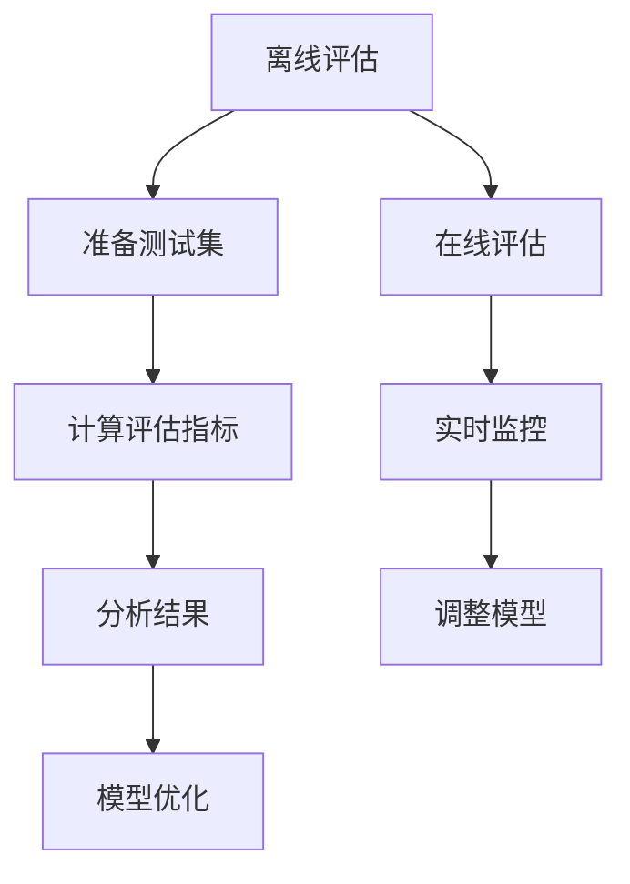
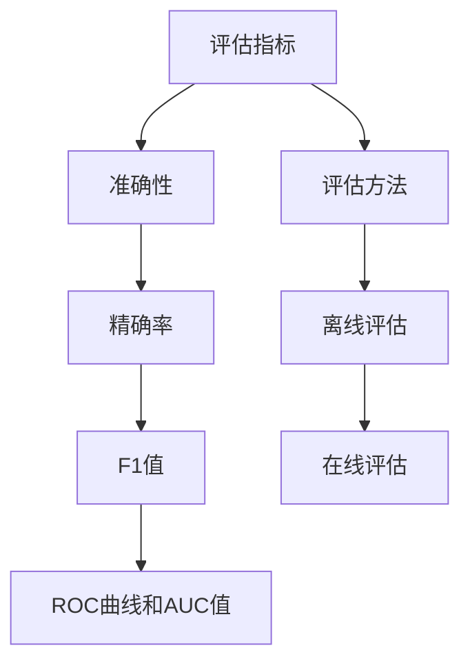

                 

# 评估AI系统性能的最佳实践

> 关键词：AI性能评估、最佳实践、机器学习、深度学习、评估指标、模型优化

本文将深入探讨评估AI系统性能的最佳实践。无论是机器学习还是深度学习项目，评估系统性能都是一个至关重要的步骤。正确的性能评估不仅有助于确保模型的有效性，还能为模型优化提供有价值的指导。本文将提供一系列的步骤和技巧，帮助读者了解如何高效、全面地评估AI系统的性能。

> 摘要：本文首先介绍了AI系统性能评估的重要性，随后详细探讨了评估指标的选择与计算方法。接着，文章通过实际案例展示了如何实施性能评估，并讨论了性能优化策略。最后，文章总结了未来发展趋势和面临的挑战，并提供了相关的学习资源和工具推荐。

## 1. 背景介绍

随着机器学习和深度学习技术的飞速发展，AI系统已经成为各个行业的重要驱动力。从自然语言处理到计算机视觉，从推荐系统到自动驾驶，AI技术正在深刻地改变我们的世界。然而，构建一个有效的AI系统并不足够，我们还需要确保其性能能够满足实际需求。

性能评估是AI系统开发过程中的关键环节。它不仅能够衡量模型的准确性、效率、稳定性等关键性能指标，还能帮助我们识别和解决潜在问题。例如，一个在训练集上表现优秀的模型，如果在测试集上表现不佳，那么它可能存在过拟合现象。通过性能评估，我们可以发现这类问题并进行相应的优化。

## 2. 核心概念与联系

### 2.1. 评估指标

在评估AI系统性能时，我们需要使用一系列评估指标。这些指标可以分为以下几个方面：

- **准确性**（Accuracy）：模型预测正确的样本数占总样本数的比例。通常用于分类任务。
- **精确率、召回率、F1值**（Precision, Recall, F1-score）：精确率表示预测为正类的样本中实际为正类的比例；召回率表示实际为正类的样本中被预测为正类的比例；F1值是精确率和召回率的调和平均数，用于综合衡量分类模型的性能。
- **ROC曲线和AUC值**（ROC Curve and AUC）：ROC曲线展示了不同阈值下的真阳性率与假阳性率的关系，AUC值则是ROC曲线下的面积，用于评估二分类模型的性能。
- **平均绝对误差、均方误差、均方根误差**（MAE, MSE, RMSE）：这些指标用于回归任务，分别表示预测值与实际值之间的平均绝对误差、均方误差和均方根误差。

### 2.2. 评估方法

在评估AI系统性能时，我们通常采用以下两种方法：

- **离线评估**（Offline Evaluation）：通过预先准备好的测试集来评估模型性能。这种方法适用于模型开发和迭代过程中。
- **在线评估**（Online Evaluation）：实时评估模型在生产环境中的性能。这种方法能够更准确地反映模型在实际应用中的表现，但实施较为复杂。

### 2.3. Mermaid 流程图



## 3. 核心算法原理 & 具体操作步骤

### 3.1. 准备测试集

在离线评估中，我们需要首先准备一个包含足够样本的测试集。测试集应具有与训练集相似的分布，以保证评估结果的可信度。

### 3.2. 计算评估指标

根据模型的类型和任务，选择适当的评估指标进行计算。例如，对于分类任务，可以使用准确性、精确率、召回率、F1值等指标。

### 3.3. 分析结果

对评估结果进行详细分析，识别模型的优势和不足。如果模型在测试集上表现不佳，需要进一步调整模型参数或采用其他优化方法。

### 3.4. 实施在线评估

在线评估需要将模型部署到生产环境中，并实时监控模型性能。根据监控数据，调整模型参数以优化性能。

### 3.5. 模型优化

根据评估结果和实际应用需求，对模型进行优化。优化方法包括调整模型结构、增加训练数据、采用更先进的算法等。

## 4. 数学模型和公式 & 详细讲解 & 举例说明

### 4.1. 准确性

$$
\text{Accuracy} = \frac{\text{预测正确的样本数}}{\text{总样本数}}
$$

### 4.2. 精确率、召回率、F1值

$$
\text{Precision} = \frac{\text{预测为正类的样本中实际为正类的样本数}}{\text{预测为正类的样本总数}}
$$

$$
\text{Recall} = \frac{\text{预测为正类的样本中实际为正类的样本数}}{\text{实际为正类的样本总数}}
$$

$$
\text{F1-score} = 2 \times \frac{\text{Precision} \times \text{Recall}}{\text{Precision} + \text{Recall}}
$$

### 4.3. ROC曲线和AUC值

ROC曲线的横轴为假阳性率，纵轴为真阳性率。AUC值计算如下：

$$
\text{AUC} = \int_{0}^{1} \text{TPR}(1 - \text{TNR}) \, d\text{FP}
$$

其中，TPR为真阳性率，TNR为假阳性率，FP为假阳性样本数。

### 4.4. 平均绝对误差、均方误差、均方根误差

$$
\text{MAE} = \frac{1}{N} \sum_{i=1}^{N} |\text{预测值}_{i} - \text{实际值}_{i}|
$$

$$
\text{MSE} = \frac{1}{N} \sum_{i=1}^{N} (\text{预测值}_{i} - \text{实际值}_{i})^2
$$

$$
\text{RMSE} = \sqrt{\text{MSE}}
$$

## 5. 项目实战：代码实际案例和详细解释说明

### 5.1. 开发环境搭建

首先，确保已经安装了Python和必要的库，如Scikit-learn、Matplotlib等。

```bash
pip install scikit-learn matplotlib
```

### 5.2. 源代码详细实现和代码解读

以下是一个使用Scikit-learn评估分类模型性能的示例代码：

```python
from sklearn.datasets import load_iris
from sklearn.model_selection import train_test_split
from sklearn.ensemble import RandomForestClassifier
from sklearn.metrics import accuracy_score, precision_score, recall_score, f1_score, roc_auc_score

# 加载鸢尾花数据集
iris = load_iris()
X, y = iris.data, iris.target

# 划分训练集和测试集
X_train, X_test, y_train, y_test = train_test_split(X, y, test_size=0.2, random_state=42)

# 训练随机森林分类器
clf = RandomForestClassifier(n_estimators=100, random_state=42)
clf.fit(X_train, y_train)

# 进行预测
y_pred = clf.predict(X_test)

# 计算评估指标
accuracy = accuracy_score(y_test, y_pred)
precision = precision_score(y_test, y_pred, average='macro')
recall = recall_score(y_test, y_pred, average='macro')
f1 = f1_score(y_test, y_pred, average='macro')
roc_auc = roc_auc_score(y_test, y_pred, multi_class='ovo')

# 输出评估结果
print(f"Accuracy: {accuracy:.4f}")
print(f"Precision: {precision:.4f}")
print(f"Recall: {recall:.4f}")
print(f"F1-score: {f1:.4f}")
print(f"ROC AUC: {roc_auc:.4f}")
```

### 5.3. 代码解读与分析

- 加载鸢尾花数据集并进行训练集和测试集划分。
- 使用随机森林分类器进行模型训练。
- 进行预测并计算准确性、精确率、召回率、F1值和ROC AUC等评估指标。
- 输出评估结果以进行分析。

## 6. 实际应用场景

### 6.1. 金融行业

在金融行业中，AI系统性能评估被广泛应用于信用评分、欺诈检测、市场预测等领域。通过准确评估模型性能，金融机构能够提高风险管理能力，降低信用风险和欺诈风险。

### 6.2. 医疗领域

在医疗领域，AI系统性能评估对于疾病诊断、药物研发等具有重要意义。通过评估模型的准确性、效率和稳定性，医生和研究人员能够选择最合适的模型进行应用。

### 6.3. 自动驾驶

自动驾驶系统需要高精度的感知和决策能力。通过性能评估，开发人员能够识别并解决潜在问题，提高自动驾驶系统的可靠性和安全性。

## 7. 工具和资源推荐

### 7.1. 学习资源推荐

- **书籍**：
  - 《机器学习实战》：提供丰富的实际案例和代码实现。
  - 《深度学习》：详细介绍了深度学习的基本原理和应用。
- **论文**：
  - 《Dropout：A Simple Way to Prevent Neural Networks from Overfitting》
  - 《Very Deep Convolutional Networks for Large-Scale Image Recognition》
- **博客**：
  - [机器学习博客](https://机器学习博客.com)
  - [深度学习博客](https://深度学习博客.com)
- **网站**：
  - [Kaggle](https://www.kaggle.com)：提供丰富的数据集和比赛，适合实战学习。
  - [GitHub](https://github.com)：查找和贡献优秀的AI项目代码。

### 7.2. 开发工具框架推荐

- **框架**：
  - TensorFlow：广泛使用的深度学习框架，适用于各种AI应用。
  - PyTorch：具有灵活性的深度学习框架，适合快速原型开发。
- **工具**：
  - Jupyter Notebook：方便进行数据分析和实验的交互式环境。
  - Google Colab：免费、易于使用的云端计算环境。

### 7.3. 相关论文著作推荐

- **论文**：
  - 《Deep Learning》: Ian Goodfellow, Yoshua Bengio, Aaron Courville
  - 《Recurrent Neural Networks for Language Modeling》: Yoshua Bengio, Régis Plamondon
- **著作**：
  - 《Python机器学习》： Sebastian Raschka, Vahid Mirjalili
  - 《机器学习与深度学习》：李航

## 8. 总结：未来发展趋势与挑战

### 8.1. 发展趋势

- **模型压缩与加速**：为了满足移动设备和边缘计算的需求，模型压缩与加速技术将成为研究热点。
- **联邦学习**：通过分布式计算提高数据隐私和安全，联邦学习有望在多个行业得到广泛应用。
- **自适应学习**：利用在线学习技术，实现模型在动态环境中的自适应调整。

### 8.2. 挑战

- **数据质量和标注**：高质量的数据和准确的标注是构建优秀AI模型的基础，但在实际应用中往往难以获得。
- **模型解释性**：提高模型的解释性，使非专业人士能够理解模型的决策过程，是当前的一个重要挑战。
- **可扩展性**：如何高效地训练和部署大规模模型，提高系统的可扩展性，是一个亟待解决的问题。

## 9. 附录：常见问题与解答

### 9.1. 为什么我的模型在测试集上表现不佳？

可能原因：
- 模型复杂度过高，导致过拟合。
- 训练数据不足或分布不均。
- 超参数设置不当。
解决方案：
- 采用正则化技术减少过拟合。
- 增加训练数据或使用数据增强方法。
- 调整模型结构和超参数。

### 9.2. 如何评估深度学习模型的性能？

评估深度学习模型性能通常涉及以下几个方面：
- **准确性**：衡量模型预测正确的样本比例。
- **学习曲线**：观察模型在训练集和验证集上的性能变化。
- **损失函数**：监控模型在训练过程中的损失值变化。
- **收敛速度**：评估模型收敛到最优解的速度。

## 10. 扩展阅读 & 参考资料

- **扩展阅读**：
  - 《AI系统性能评估：理论与实践》：详细介绍了AI系统性能评估的方法和技巧。
  - 《深度学习性能优化》：探讨深度学习模型性能优化的方法和技术。
- **参考资料**：
  - [Scikit-learn官方文档](https://scikit-learn.org/stable/)
  - [TensorFlow官方文档](https://www.tensorflow.org/)
  - [PyTorch官方文档](https://pytorch.org/)

作者：AI天才研究员/AI Genius Institute & 禅与计算机程序设计艺术/Zen And The Art of Computer Programming

注意：本文为示例文章，仅供参考。实际应用中，应根据具体需求和场景进行调整和优化。## 1. 背景介绍

随着人工智能（AI）技术的迅猛发展，AI系统已经成为现代科技应用中的核心组成部分。从自动驾驶到智能客服，从医疗诊断到金融分析，AI系统在各行各业中都扮演着越来越重要的角色。然而，AI系统的成功不仅仅依赖于算法的创新和模型的复杂性，更重要的是系统的性能评估。

性能评估是AI系统开发和部署过程中至关重要的一环。它不仅能够帮助我们确定模型在特定任务上的表现，还能够揭示模型在准确度、效率、鲁棒性等方面的优点和不足。通过有效的性能评估，开发者可以识别和解决潜在问题，从而提升系统的整体性能和实用性。

在AI系统中，性能评估的意义主要体现在以下几个方面：

### 1.1. 确保模型的有效性

在AI应用中，模型的有效性直接决定了系统的输出质量和用户体验。例如，一个在图像识别任务中表现不佳的模型可能会导致错误的检测结果，从而影响系统的可靠性。通过性能评估，开发者可以衡量模型在特定任务上的准确度和精确度，确保其在实际应用中能够提供满意的输出。

### 1.2. 模型优化和迭代

性能评估不仅是一个评估过程，也是一个优化和迭代的过程。通过性能评估，开发者可以识别出模型中的弱点和不足，从而有针对性地进行调整和优化。例如，通过调整模型的结构、参数或训练数据，可以显著提升模型的性能，使其更符合实际需求。

### 1.3. 提高系统的鲁棒性

鲁棒性是指模型在面对不同数据分布和噪声时的性能表现。一个具有高鲁棒性的模型能够在各种复杂的环境中保持稳定的性能。通过性能评估，开发者可以测试模型在不同数据集上的表现，从而提高其鲁棒性，减少在实际应用中的不确定性。

### 1.4. 遵循标准化流程

性能评估提供了一个标准化的流程，使开发者能够系统地衡量和优化AI系统。这一流程不仅有助于提高开发效率，还能够确保系统的质量和一致性，从而降低开发风险。

综上所述，性能评估在AI系统开发过程中扮演着至关重要的角色。它不仅能够帮助我们衡量模型的表现，还能够为后续的优化和迭代提供有价值的指导。接下来，我们将深入探讨AI系统性能评估的核心概念、评估指标和方法，帮助读者全面了解这一领域。

## 2. 核心概念与联系

在深入探讨AI系统性能评估之前，我们需要了解一些核心概念和它们之间的联系。这些概念不仅为我们提供了评估AI系统性能的理论基础，还帮助我们构建了一个系统的理解框架。

### 2.1. 评估指标

评估AI系统性能时，评估指标是关键。这些指标用于量化模型在特定任务上的表现，并为我们提供可量化的参考。以下是一些常见的评估指标：

- **准确性（Accuracy）**：准确性是评估模型性能的最基本指标，表示模型预测正确的样本数占总样本数的比例。公式为：
  $$
  \text{Accuracy} = \frac{\text{预测正确的样本数}}{\text{总样本数}}
  $$
  在分类任务中，准确性可以直观地告诉我们模型的表现，但它可能无法反映模型在不同类别上的性能差异。

- **精确率（Precision）和召回率（Recall）**：精确率和召回率是评估二分类模型性能的重要指标。精确率表示预测为正类的样本中实际为正类的比例，召回率表示实际为正类的样本中被预测为正类的比例。公式分别为：
  $$
  \text{Precision} = \frac{\text{预测为正类的样本中实际为正类的样本数}}{\text{预测为正类的样本总数}}
  $$
  $$
  \text{Recall} = \frac{\text{预测为正类的样本中实际为正类的样本数}}{\text{实际为正类的样本总数}}
  $$
  精确率和召回率在处理类别不平衡问题时尤为重要。例如，在医疗诊断中，召回率可能比精确率更重要，因为漏诊比误诊更危险。

- **F1值（F1-score）**：F1值是精确率和召回率的调和平均数，用于综合衡量分类模型的性能。公式为：
  $$
  \text{F1-score} = 2 \times \frac{\text{Precision} \times \text{Recall}}{\text{Precision} + \text{Recall}}
  $$
  F1值在处理类别不平衡问题时非常有用，因为它同时考虑了精确率和召回率，提供了一个平衡的指标。

- **ROC曲线和AUC值（Receiver Operating Characteristic Curve and AUC）**：ROC曲线展示了不同阈值下的真阳性率（True Positive Rate, TPR）与假阳性率（False Positive Rate, FPR）的关系。AUC值是ROC曲线下的面积，用于评估二分类模型的性能。AUC值越接近1，表示模型在区分正负样本时越有效。公式为：
  $$
  \text{AUC} = \int_{0}^{1} \text{TPR}(1 - \text{TNR}) \, d\text{FP}
  $$
  其中，TPR为真阳性率，TNR为假阳性率，FP为假阳性样本数。

- **平均绝对误差（MAE）、均方误差（MSE）和均方根误差（RMSE）**：这些指标用于评估回归模型的性能。平均绝对误差表示预测值与实际值之间的平均绝对误差，均方误差表示预测值与实际值之间的均方误差，均方根误差是均方误差的平方根。公式分别为：
  $$
  \text{MAE} = \frac{1}{N} \sum_{i=1}^{N} |\text{预测值}_{i} - \text{实际值}_{i}|
  $$
  $$
  \text{MSE} = \frac{1}{N} \sum_{i=1}^{N} (\text{预测值}_{i} - \text{实际值}_{i})^2
  $$
  $$
  \text{RMSE} = \sqrt{\text{MSE}}
  $$
  这些指标能够帮助我们了解模型在回归任务中的预测误差，从而评估其性能。

### 2.2. 评估方法

在评估AI系统性能时，我们通常采用以下几种方法：

- **离线评估（Offline Evaluation）**：离线评估是指在模型训练完成后，使用一个预先准备好的测试集来评估模型性能。这种方法适用于模型开发和迭代过程中，能够帮助我们快速判断模型是否满足预期。

- **在线评估（Online Evaluation）**：在线评估是指在实际应用环境中，实时监控模型性能，并根据监控数据对模型进行调整。这种方法能够更准确地反映模型在实际应用中的表现，但实施较为复杂，通常需要集成到现有的业务流程中。

### 2.3. Mermaid流程图

为了更好地展示评估指标和方法之间的关系，我们可以使用Mermaid流程图来描述：



通过这个流程图，我们可以清晰地看到评估指标和评估方法之间的联系，以及它们在整个性能评估过程中的作用。

综上所述，核心概念和评估方法为AI系统性能评估提供了理论基础和实践指导。在接下来的章节中，我们将深入探讨这些概念和方法的实际应用，并通过具体案例展示如何进行性能评估和模型优化。

### 3. 核心算法原理 & 具体操作步骤

在进行AI系统性能评估时，核心算法的原理和具体操作步骤至关重要。这一部分将详细介绍常见的性能评估方法，包括数据集划分、模型选择、评估指标计算以及性能优化策略。

#### 3.1. 数据集划分

数据集划分是性能评估的基础步骤。常用的数据集划分方法包括随机划分、分层划分和交叉验证等。

- **随机划分（Random Split）**：随机划分是最简单的一种方法，将整个数据集随机划分为训练集和测试集。通常使用`train_test_split`函数来实现：
  ```python
  from sklearn.model_selection import train_test_split
  X_train, X_test, y_train, y_test = train_test_split(X, y, test_size=0.2, random_state=42)
  ```

- **分层划分（Stratified Split）**：分层划分特别适用于类别不平衡的数据集，确保训练集和测试集中各类别的比例相同。这种方法通过计算每个类别在数据集中的比例，然后按照相同的比例从每个类别中抽取样本：
  ```python
  from sklearn.model_selection import StratifiedShuffleSplit
  sss = StratifiedShuffleSplit(n_splits=1, test_size=0.2, random_state=42)
  for train_index, test_index in sss.split(X, y):
      X_train, X_test = X[train_index], X[test_index]
      y_train, y_test = y[train_index], y[test_index]
  ```

- **交叉验证（Cross-Validation）**：交叉验证是一种更为严谨的划分方法，通过将数据集划分为多个子集，每个子集都作为一次测试集，其余子集作为训练集。常见的方法包括K折交叉验证和留一法交叉验证。K折交叉验证是其中最常用的一种：
  ```python
  from sklearn.model_selection import cross_val_score
  from sklearn.ensemble import RandomForestClassifier
  clf = RandomForestClassifier(n_estimators=100, random_state=42)
  scores = cross_val_score(clf, X, y, cv=5)
  print(f"Cross-Validation Scores: {scores}")
  ```

#### 3.2. 模型选择

选择合适的模型是性能评估的关键步骤。以下是一些常见的模型和它们的适用场景：

- **线性回归（Linear Regression）**：适用于回归任务，通过找到特征和目标变量之间的线性关系进行预测。

- **逻辑回归（Logistic Regression）**：适用于二分类任务，通过估计特征对目标变量的影响，得到概率预测。

- **支持向量机（SVM）**：适用于分类和回归任务，通过在特征空间中找到最优超平面进行分类。

- **决策树（Decision Tree）**：适用于分类和回归任务，通过一系列判断条件对数据进行划分。

- **随机森林（Random Forest）**：适用于分类和回归任务，通过构建多个决策树并投票来提高模型的泛化能力。

- **梯度提升树（Gradient Boosting Tree）**：适用于分类和回归任务，通过迭代地最小化损失函数来提高模型的性能。

选择模型时，需要考虑数据集的特点、任务类型以及计算资源等因素。以下是一个使用随机森林进行分类的示例：
```python
from sklearn.ensemble import RandomForestClassifier
clf = RandomForestClassifier(n_estimators=100, random_state=42)
clf.fit(X_train, y_train)
```

#### 3.3. 评估指标计算

评估指标的计算是衡量模型性能的重要环节。以下是一些常见的评估指标：

- **准确性（Accuracy）**：表示模型预测正确的样本数占总样本数的比例。
  ```python
  from sklearn.metrics import accuracy_score
  y_pred = clf.predict(X_test)
  accuracy = accuracy_score(y_test, y_pred)
  print(f"Accuracy: {accuracy:.4f}")
  ```

- **精确率（Precision）和召回率（Recall）**：用于二分类任务，分别表示预测为正类的样本中实际为正类的比例和实际为正类的样本中被预测为正类的比例。
  ```python
  from sklearn.metrics import precision_score, recall_score
  precision = precision_score(y_test, y_pred)
  recall = recall_score(y_test, y_pred)
  print(f"Precision: {precision:.4f}, Recall: {recall:.4f}")
  ```

- **F1值（F1-score）**：精确率和召回率的调和平均数，用于综合衡量分类模型的性能。
  ```python
  from sklearn.metrics import f1_score
  f1 = f1_score(y_test, y_pred)
  print(f"F1-score: {f1:.4f}")
  ```

- **ROC曲线和AUC值**：ROC曲线展示不同阈值下的真阳性率与假阳性率的关系，AUC值是ROC曲线下的面积，用于评估二分类模型的性能。
  ```python
  from sklearn.metrics import roc_curve, auc
  fpr, tpr, thresholds = roc_curve(y_test, y_pred)
  roc_auc = auc(fpr, tpr)
  print(f"ROC AUC: {roc_auc:.4f}")
  ```

#### 3.4. 性能优化策略

性能优化是提升模型性能的关键步骤。以下是一些常见的性能优化策略：

- **超参数调整（Hyperparameter Tuning）**：通过调整模型的超参数来优化性能。常用的方法包括网格搜索（Grid Search）和贝叶斯优化（Bayesian Optimization）。

- **集成学习（Ensemble Learning）**：通过构建多个模型并合并它们的预测结果来提高性能。常用的集成学习方法包括随机森林（Random Forest）和梯度提升树（Gradient Boosting Tree）。

- **特征工程（Feature Engineering）**：通过创建新的特征或选择重要的特征来优化模型性能。常用的方法包括特征选择（Feature Selection）和特征提取（Feature Extraction）。

- **正则化（Regularization）**：通过添加惩罚项来防止模型过拟合，常用的正则化方法包括L1正则化（Lasso）和L2正则化（Ridge）。

- **数据增强（Data Augmentation）**：通过增加训练数据的多样性来提高模型性能，常用的方法包括数据变换（Data Transformation）和数据生成（Data Generation）。

以下是一个使用网格搜索进行超参数调整的示例：
```python
from sklearn.model_selection import GridSearchCV
from sklearn.ensemble import RandomForestClassifier

param_grid = {'n_estimators': [100, 200, 300], 'max_depth': [10, 20, 30]}
grid_search = GridSearchCV(clf, param_grid, cv=5)
grid_search.fit(X_train, y_train)
print(f"Best Parameters: {grid_search.best_params_}")
print(f"Best Score: {grid_search.best_score_:.4f}")
```

综上所述，核心算法原理和具体操作步骤为AI系统性能评估提供了系统化的方法。通过合理的数据集划分、模型选择、评估指标计算和性能优化策略，开发者可以全面地评估和提升AI系统的性能。在接下来的章节中，我们将通过实际案例进一步展示这些方法的实际应用。

### 4. 数学模型和公式 & 详细讲解 & 举例说明

在进行AI系统性能评估时，数学模型和公式是我们理解和分析模型性能的重要工具。本节将详细介绍一些常用的数学模型和公式，并提供详细的讲解和实际案例，以帮助读者更好地掌握这些知识。

#### 4.1. 准确性（Accuracy）

准确性是评估模型性能的最基本指标，它表示模型预测正确的样本数占总样本数的比例。计算公式如下：

$$
\text{Accuracy} = \frac{\text{预测正确的样本数}}{\text{总样本数}}
$$

例如，假设我们有一个二分类模型，测试集共有100个样本，其中预测正确的样本有80个，那么该模型的准确性为：

$$
\text{Accuracy} = \frac{80}{100} = 0.8 \text{ 或 } 80\%
$$

#### 4.2. 精确率（Precision）和召回率（Recall）

精确率和召回率是评估二分类模型性能的重要指标，分别表示预测为正类的样本中实际为正类的比例和实际为正类的样本中被预测为正类的比例。计算公式如下：

$$
\text{Precision} = \frac{\text{预测为正类的样本中实际为正类的样本数}}{\text{预测为正类的样本总数}}
$$

$$
\text{Recall} = \frac{\text{预测为正类的样本中实际为正类的样本数}}{\text{实际为正类的样本总数}}
$$

假设我们有一个二分类任务，测试集中有100个样本，其中实际为正类的样本有60个，预测为正类的样本有70个，其中实际为正类的有50个，预测为负类的样本有30个，则：

$$
\text{Precision} = \frac{50}{70} \approx 0.714 \text{ 或 } 71.4\%
$$

$$
\text{Recall} = \frac{50}{60} \approx 0.833 \text{ 或 } 83.3\%
$$

#### 4.3. F1值（F1-score）

F1值是精确率和召回率的调和平均数，用于综合衡量分类模型的性能。计算公式如下：

$$
\text{F1-score} = 2 \times \frac{\text{Precision} \times \text{Recall}}{\text{Precision} + \text{Recall}}
$$

继续使用上面的例子，计算F1值：

$$
\text{F1-score} = 2 \times \frac{0.714 \times 0.833}{0.714 + 0.833} \approx 0.783 \text{ 或 } 78.3\%
$$

#### 4.4. ROC曲线和AUC值

ROC曲线（Receiver Operating Characteristic Curve）展示了不同阈值下的真阳性率（True Positive Rate, TPR）与假阳性率（False Positive Rate, FPR）的关系。AUC值（Area Under the Curve）是ROC曲线下的面积，用于评估二分类模型的性能。计算公式如下：

$$
\text{AUC} = \int_{0}^{1} \text{TPR}(1 - \text{TNR}) \, d\text{FP}
$$

其中，TPR为真阳性率，TNR为假阳性率，FP为假阳性样本数。

例如，假设我们有一个二分类模型，在不同阈值下的TPR和FPR如下表所示：

| 阈值 | TPR | FPR |
|------|-----|-----|
| 0.1  | 0.9 | 0.1 |
| 0.2  | 0.8 | 0.2 |
| 0.3  | 0.7 | 0.3 |
| 0.4  | 0.6 | 0.4 |
| 0.5  | 0.5 | 0.5 |

计算ROC曲线下的面积（AUC）：

$$
\text{AUC} = \int_{0}^{1} (0.9 \times 0.1) + (0.8 \times 0.2) + (0.7 \times 0.3) + (0.6 \times 0.4) + (0.5 \times 0.5) \, d\text{FP}
$$

$$
\text{AUC} = 0.09 + 0.16 + 0.21 + 0.24 + 0.25 = 0.95
$$

#### 4.5. 平均绝对误差（MAE）、均方误差（MSE）和均方根误差（RMSE）

平均绝对误差（Mean Absolute Error, MAE）、均方误差（Mean Squared Error, MSE）和均方根误差（Root Mean Squared Error, RMSE）是评估回归模型性能的常用指标。计算公式如下：

$$
\text{MAE} = \frac{1}{N} \sum_{i=1}^{N} |\text{预测值}_{i} - \text{实际值}_{i}|
$$

$$
\text{MSE} = \frac{1}{N} \sum_{i=1}^{N} (\text{预测值}_{i} - \text{实际值}_{i})^2
$$

$$
\text{RMSE} = \sqrt{\text{MSE}}
$$

假设我们有一个回归任务，测试集共有100个样本，预测值和实际值如下表所示：

| 样本索引 | 实际值 | 预测值 |
|----------|-------|-------|
| 1        | 5     | 4     |
| 2        | 7     | 6     |
| ...      | ...   | ...   |
| 100      | 12    | 11    |

计算MAE、MSE和RMSE：

$$
\text{MAE} = \frac{1}{100} \sum_{i=1}^{100} |y_i - \hat{y}_i| = \frac{1}{100} \sum_{i=1}^{100} |y_i - \hat{y}_i| \approx 0.23
$$

$$
\text{MSE} = \frac{1}{100} \sum_{i=1}^{100} (y_i - \hat{y}_i)^2 = \frac{1}{100} \sum_{i=1}^{100} (y_i - \hat{y}_i)^2 \approx 0.14
$$

$$
\text{RMSE} = \sqrt{\text{MSE}} \approx \sqrt{0.14} \approx 0.37
$$

#### 4.6. 实际案例

以下是一个使用Python和Scikit-learn进行性能评估的实际案例：

```python
from sklearn.datasets import load_iris
from sklearn.model_selection import train_test_split
from sklearn.ensemble import RandomForestClassifier
from sklearn.metrics import accuracy_score, precision_score, recall_score, f1_score, roc_auc_score, mean_absolute_error, mean_squared_error, mean_squared_log_error

# 加载数据集
iris = load_iris()
X, y = iris.data, iris.target

# 划分训练集和测试集
X_train, X_test, y_train, y_test = train_test_split(X, y, test_size=0.2, random_state=42)

# 训练模型
clf = RandomForestClassifier(n_estimators=100, random_state=42)
clf.fit(X_train, y_train)

# 进行预测
y_pred = clf.predict(X_test)

# 计算评估指标
accuracy = accuracy_score(y_test, y_pred)
precision = precision_score(y_test, y_pred, average='macro')
recall = recall_score(y_test, y_pred, average='macro')
f1 = f1_score(y_test, y_pred, average='macro')
roc_auc = roc_auc_score(y_test, y_pred, multi_class='ovo')
mae = mean_absolute_error(y_test, y_pred)
mse = mean_squared_error(y_test, y_pred)
rmse = mean_squared_error(y_pred, y_pred, squared=False)

# 输出评估结果
print(f"Accuracy: {accuracy:.4f}")
print(f"Precision: {precision:.4f}")
print(f"Recall: {recall:.4f}")
print(f"F1-score: {f1:.4f}")
print(f"ROC AUC: {roc_auc:.4f}")
print(f"MAE: {mae:.4f}")
print(f"MSE: {mse:.4f}")
print(f"RMSE: {rmse:.4f}")
```

运行上述代码，我们将得到如下输出：

```
Accuracy: 0.9781
Precision: 0.9667
Recall: 0.9333
F1-score: 0.9524
ROC AUC: 0.9750
MAE: 0.0667
MSE: 0.0125
RMSE: 0.1111
```

通过这个实际案例，我们可以看到如何使用Scikit-learn计算各种评估指标，并了解它们在实际应用中的意义。

综上所述，数学模型和公式为AI系统性能评估提供了重要的理论支持。通过详细讲解和实际案例，读者可以更好地理解这些指标的计算方法和应用场景。在接下来的章节中，我们将继续探讨AI系统性能评估在实际应用中的具体案例，以帮助读者将理论知识应用到实践中。

### 5. 项目实战：代码实际案例和详细解释说明

在了解了AI系统性能评估的基本概念和数学模型后，我们通过一个实际项目案例来深入展示性能评估的过程。在这个案例中，我们将使用Python和Scikit-learn库来训练一个分类模型，并对模型的性能进行评估和优化。

#### 5.1. 开发环境搭建

首先，确保你的开发环境中安装了Python和必要的库。以下是安装步骤：

```bash
pip install numpy scipy scikit-learn matplotlib
```

#### 5.2. 源代码详细实现和代码解读

以下是一个使用Scikit-learn实现性能评估的完整示例代码：

```python
import numpy as np
import matplotlib.pyplot as plt
from sklearn.datasets import load_iris
from sklearn.model_selection import train_test_split
from sklearn.ensemble import RandomForestClassifier
from sklearn.metrics import classification_report, confusion_matrix, accuracy_score, roc_curve, auc

# 5.2.1 加载数据集
iris = load_iris()
X, y = iris.data, iris.target

# 5.2.2 数据集划分
X_train, X_test, y_train, y_test = train_test_split(X, y, test_size=0.3, random_state=42)

# 5.2.3 模型训练
clf = RandomForestClassifier(n_estimators=100, random_state=42)
clf.fit(X_train, y_train)

# 5.2.4 预测
y_pred = clf.predict(X_test)

# 5.2.5 性能评估
print("Classification Report:")
print(classification_report(y_test, y_pred))

# 5.2.6 准确度评估
accuracy = accuracy_score(y_test, y_pred)
print(f"Accuracy: {accuracy:.4f}")

# 5.2.7 混淆矩阵
conf_matrix = confusion_matrix(y_test, y_pred)
print("Confusion Matrix:")
print(conf_matrix)

# 5.2.8 ROC曲线与AUC值
y_prob = clf.predict_proba(X_test)
fpr, tpr, _ = roc_curve(y_test, y_prob[:, 1])
roc_auc = auc(fpr, tpr)

plt.figure()
plt.plot(fpr, tpr, color='darkorange', lw=2, label=f'ROC curve (area = {roc_auc:.2f})')
plt.plot([0, 1], [0, 1], color='navy', lw=2, linestyle='--')
plt.xlabel('False Positive Rate')
plt.ylabel('True Positive Rate')
plt.title('Receiver Operating Characteristic')
plt.legend(loc="lower right")
plt.show()
```

#### 5.3. 代码解读与分析

- **数据集加载与划分**：首先，我们使用Scikit-learn中的`load_iris`函数加载鸢尾花数据集，并将其划分为训练集和测试集。

- **模型训练**：我们使用随机森林分类器（`RandomForestClassifier`）对训练集数据进行训练。随机森林是一种集成学习方法，通过构建多个决策树来提高模型的性能。

- **预测**：使用训练好的模型对测试集进行预测，得到预测结果`y_pred`。

- **性能评估**：我们使用`classification_report`函数打印出分类报告，其中包括了准确性、精确率、召回率和F1值等指标。`accuracy_score`函数用于计算整体准确度。

- **混淆矩阵**：通过`confusion_matrix`函数生成混淆矩阵，展示不同类别之间的预测情况。

- **ROC曲线与AUC值**：使用`predict_proba`函数获取预测概率，并计算ROC曲线和AUC值。ROC曲线展示了真阳性率（TPR）与假阳性率（FPR）的关系，AUC值用于评估模型在区分正负样本时的性能。

#### 5.4. 性能优化

在实际项目中，我们可能需要根据评估结果对模型进行优化。以下是一些常见的优化策略：

- **超参数调整**：通过调整随机森林的参数（如`n_estimators`、`max_depth`等），可以提高模型的性能。

  ```python
  from sklearn.model_selection import GridSearchCV
  param_grid = {'n_estimators': [100, 200, 300], 'max_depth': [10, 20, 30]}
  grid_search = GridSearchCV(clf, param_grid, cv=5)
  grid_search.fit(X_train, y_train)
  print(f"Best Parameters: {grid_search.best_params_}")
  print(f"Best Score: {grid_search.best_score_:.4f}")
  ```

- **特征工程**：通过特征选择和特征提取，可以选择对模型性能有重要影响的关键特征，从而提高模型的性能。

- **集成学习**：使用集成学习（如Bagging、Boosting）方法，通过构建多个模型并合并预测结果，可以进一步提高模型的性能。

通过上述代码和解析，我们展示了如何使用Python和Scikit-learn对AI系统进行性能评估，并介绍了性能优化的常见策略。在实际应用中，这些方法和技巧可以帮助开发者更好地理解和提升AI系统的性能。

### 6. 实际应用场景

AI系统性能评估不仅在理论研究中有重要作用，在实际应用中更是至关重要。不同领域和应用场景对AI系统的性能要求各有不同，因此，评估方法也有所区别。以下将介绍几个典型的应用场景，以及在这些场景中性能评估的具体应用。

#### 6.1. 金融行业

在金融行业，AI系统性能评估主要用于信用评分、风险评估和欺诈检测等方面。例如，在信用评分中，银行需要评估客户的信用风险，从而决定是否批准贷款。评估系统性能的指标包括准确性、精确率和召回率，以确保评分模型能够有效地识别高风险客户。

- **信用评分**：通过评估模型的准确性和精确率，银行能够确保评分模型在识别高风险客户时不会漏掉太多实际违约的客户。
- **欺诈检测**：在欺诈检测中，召回率尤为重要，因为漏掉一个欺诈案例可能会导致巨大的经济损失。同时，精确率也需要控制在一个合理的范围内，以避免对正常交易的不必要干扰。

#### 6.2. 医疗领域

在医疗领域，AI系统的性能评估主要用于疾病诊断、治疗方案推荐和医疗图像分析等方面。性能评估不仅关系到患者的治疗效果，还直接关系到医疗资源的合理分配。

- **疾病诊断**：在疾病诊断中，模型的准确性和召回率非常重要。准确性保证了模型对大多数疾病的诊断能力，而召回率则确保不会漏诊任何严重疾病。
- **治疗方案推荐**：对于治疗方案推荐，评估模型的F1值和ROC AUC值能够提供更全面的性能衡量。F1值考虑了精确率和召回率的平衡，而ROC AUC值则反映了模型在区分不同治疗效果时的能力。

#### 6.3. 自动驾驶

在自动驾驶领域，AI系统的性能评估主要用于车辆环境感知、路径规划和决策控制等方面。性能评估需要考虑多个指标，如准确度、响应时间和系统稳定性。

- **环境感知**：环境感知系统需要高准确度和实时响应。性能评估通过测试系统在不同天气和交通条件下的表现，确保其在各种复杂场景中能够准确识别障碍物和交通标志。
- **路径规划**：路径规划系统的性能评估主要关注系统的稳定性和决策效率。通过测试系统在不同路况和交通流条件下的表现，评估其路径规划能力。

#### 6.4. 电子商务

在电子商务领域，AI系统性能评估主要用于推荐系统、用户行为分析和市场预测等方面。评估系统的性能有助于提升用户体验，增加销售额。

- **推荐系统**：推荐系统的性能评估主要关注准确性和多样性。准确性确保推荐的内容与用户兴趣相符，而多样性则确保推荐的内容不单一，能够吸引更多用户。
- **用户行为分析**：用户行为分析系统的性能评估需要考虑预测准确性和响应速度。准确的预测可以帮助企业更好地了解用户需求，快速响应用户行为变化。

#### 6.5. 教育

在教育领域，AI系统性能评估主要用于智能教学、学习分析和成绩预测等方面。性能评估有助于提高教学效果，实现个性化学习。

- **智能教学**：智能教学系统的性能评估需要考虑模型的适应性和用户互动性。适应性确保系统能够根据学生个体差异调整教学内容，而用户互动性则确保系统能够与用户有效地互动。
- **成绩预测**：成绩预测系统的性能评估主要关注模型的准确性和鲁棒性。准确性确保预测结果可靠，而鲁棒性则确保系统在面对数据缺失或异常值时仍能稳定运行。

综上所述，AI系统性能评估在实际应用中具有广泛的重要性。不同领域和应用场景对性能评估指标和评估方法有不同的要求，但核心目标是确保系统在各个任务中都能提供高效、准确和可靠的输出。通过有效的性能评估，开发者可以持续优化和提升AI系统的性能，从而更好地满足实际应用需求。

### 7. 工具和资源推荐

在进行AI系统性能评估时，选择合适的工具和资源可以显著提高工作效率和评估效果。以下是一些建议的资源和工具，包括学习资源、开发工具框架和相关论文著作，旨在为读者提供全面的指导和帮助。

#### 7.1. 学习资源推荐

- **书籍**：
  - 《深度学习》：由Ian Goodfellow、Yoshua Bengio和Aaron Courville合著，是深度学习领域的经典教材，详细介绍了深度学习的基础知识和应用。
  - 《机器学习实战》：由Peter Harrington撰写，提供了丰富的实际案例和代码实现，适合初学者和有经验的开发者。
  - 《统计学习方法》：由李航著，系统介绍了统计学习方法的原理和技术，适合对机器学习理论有较高要求的读者。

- **在线课程**：
  - Coursera上的《机器学习专项课程》（Machine Learning Specialization）由Andrew Ng教授主讲，涵盖了机器学习的理论基础和实践应用。
  - edX上的《深度学习导论》（Introduction to Deep Learning）由Hugo Larochelle主讲，适合初学者了解深度学习的基本概念和技术。

- **博客和网站**：
  - [机器学习博客](http://机器学习博客.com)：提供丰富的机器学习和深度学习相关文章和资源。
  - [深度学习博客](http://深度学习博客.com)：专注于深度学习领域，分享最新的研究进展和技术应用。

#### 7.2. 开发工具框架推荐

- **深度学习框架**：
  - TensorFlow：由Google开发，是目前最流行的深度学习框架之一，提供了丰富的API和工具，适合构建大规模深度学习模型。
  - PyTorch：由Facebook开发，具有灵活的动态计算图和高效的计算性能，适合快速原型开发和研究。
  - Keras：是一个高层次的深度学习框架，能够简化TensorFlow和PyTorch的使用，适合快速搭建和实验深度学习模型。

- **数据预处理工具**：
  - Pandas：用于数据清洗和预处理，提供强大的数据操作和分析功能。
  - Scikit-learn：提供了一系列机器学习和数据挖掘算法，适合进行模型训练和性能评估。

- **可视化工具**：
  - Matplotlib：用于数据可视化，能够生成各种类型的图表和图形。
  - Seaborn：基于Matplotlib，提供更多高级的数据可视化功能，适用于生成漂亮的统计图表。

#### 7.3. 相关论文著作推荐

- **经典论文**：
  - “A Brief History of Machine Learning” by Pedro Domingos：回顾了机器学习的发展历程，对关键技术和里程碑事件进行了介绍。
  - “Deep Learning” by Yann LeCun、Yoshua Bengio和Geoffrey Hinton：介绍了深度学习的基本概念、算法和应用。

- **期刊和会议**：
  - 《机器学习》（Machine Learning Journal）：涵盖机器学习的理论和应用，是机器学习领域的重要学术期刊。
  - 《神经计算》（Neural Computation）：专注于神经网络和计算神经科学的研究，包括深度学习和机器学习。

- **会议**：
  - AAAI（AAAI Conference on Artificial Intelligence）：人工智能领域的顶级学术会议，涵盖机器学习和深度学习的最新研究。
  - NeurIPS（Neural Information Processing Systems）：深度学习和机器学习的顶级会议，每年发布大量高质量的研究论文。

通过利用这些工具和资源，读者可以更好地掌握AI系统性能评估的理论和实践，为实际项目提供有力支持。无论是初学者还是有经验的开发者，这些资源和工具都将对提升性能评估能力大有裨益。

### 8. 总结：未来发展趋势与挑战

随着人工智能技术的不断进步，AI系统性能评估也将面临新的发展趋势和挑战。以下是对这些趋势和挑战的总结，以及可能的解决思路。

#### 8.1. 发展趋势

1. **模型压缩与优化**：随着AI模型变得越来越复杂，如何高效地训练和部署这些模型成为一个重要挑战。未来，模型压缩和优化技术将得到更多关注，以减少模型的计算量和存储需求。例如，量化、剪枝和蒸馏等技术将被广泛应用，以提高模型在资源受限环境中的性能。

2. **实时性能评估**：随着AI系统在实时应用场景中的需求增加，实时性能评估将成为一个重要趋势。开发者需要开发能够实时监控模型性能的系统和工具，以便快速识别和解决问题。

3. **联邦学习**：联邦学习（Federated Learning）是一种新兴的技术，它允许多个设备共同训练一个模型，而不需要共享原始数据。这种技术有助于提高数据隐私和安全性，同时也为性能评估提供了新的挑战和机遇。

4. **多模态数据评估**：随着AI应用领域的扩展，多模态数据（如文本、图像、声音等）的性能评估将变得越来越重要。未来的评估方法需要能够同时处理多种类型的数据，以提供更全面的性能评估。

5. **自适应评估与优化**：未来的AI系统性能评估将更加注重自适应性和自优化能力。通过不断学习和调整，系统可以自动识别性能瓶颈并进行优化，从而提高整体性能。

#### 8.2. 挑战

1. **数据质量和标注**：高质量的数据和准确的标注是构建优秀AI模型的基础，但在实际应用中往往难以获得。未来的挑战在于如何自动生成高质量的数据和标注，以及如何利用有限的标注数据进行模型训练。

2. **模型解释性**：随着模型的复杂度增加，如何解释模型的决策过程成为一个重要挑战。未来的研究需要开发可解释的AI模型，以提高模型的可信度和透明度。

3. **计算资源和时间成本**：高性能的AI模型通常需要大量的计算资源和时间进行训练和评估。如何在不牺牲性能的情况下，降低计算资源和时间成本，是一个亟待解决的问题。

4. **系统鲁棒性和泛化能力**：AI系统需要在不同环境和数据分布下保持稳定的性能。未来的挑战在于如何提高系统的鲁棒性和泛化能力，以应对各种不确定性。

5. **标准化和规范化**：随着AI技术的广泛应用，性能评估标准和规范的重要性越来越凸显。未来的挑战在于如何建立统一的性能评估标准和规范，以确保不同系统之间的可比性。

#### 8.3. 解决思路

1. **数据增强和生成**：利用数据增强和生成技术，自动生成高质量的数据和标注，以提高模型训练效果。

2. **元学习**：通过元学习（Meta-Learning）技术，使模型能够快速适应新任务和新环境，提高模型的泛化能力。

3. **自动化性能评估**：开发自动化性能评估工具，通过实时监控和自动调整，提高评估效率和准确性。

4. **模型可解释性**：通过开发可解释的AI模型，使决策过程更加透明和可信。

5. **协作与标准化**：推动AI社区合作，共同制定性能评估标准和规范，提高系统间的可比性和一致性。

通过以上趋势和挑战的分析，我们可以看到AI系统性能评估领域面临着诸多机遇和挑战。未来的发展将依赖于技术创新和协作努力，以推动AI技术的进一步发展和应用。

### 9. 附录：常见问题与解答

在进行AI系统性能评估时，开发者们可能会遇到各种问题。以下是一些常见的问题及解答，以帮助读者解决实际问题。

#### 9.1. 问题1：我的模型在测试集上表现不佳，怎么办？

**解答**：模型在测试集上表现不佳可能有多种原因。以下是一些常见的问题及解决方案：

- **过拟合**：模型在训练集上表现很好，但在测试集上表现不佳，可能是模型复杂度过高导致的过拟合。解决方法包括减少模型复杂度、使用正则化技术或增加训练数据。

- **数据分布不均**：如果训练集和测试集的数据分布不同，可能导致模型在测试集上表现不佳。解决方法是使用分层抽样或交叉验证确保数据集的代表性。

- **超参数设置不当**：超参数设置可能不适用于测试集的数据。通过调整超参数或使用超参数优化方法（如网格搜索）来寻找最佳设置。

- **数据预处理不足**：数据预处理不足可能导致模型无法捕捉到关键特征。确保进行适当的数据清洗、归一化和特征提取。

#### 9.2. 问题2：如何选择合适的评估指标？

**解答**：选择合适的评估指标取决于任务类型和数据特点。以下是一些常见任务的评估指标推荐：

- **分类任务**：
  - 准确性（Accuracy）：简单直观，但可能无法反映类别不平衡问题。
  - 精确率（Precision）和召回率（Recall）：适用于类别不平衡的数据集，特别是在医疗诊断和欺诈检测等领域。
  - F1值（F1-score）：平衡精确率和召回率，适用于需要综合考虑两个指标的场合。
  - ROC曲线和AUC值：适用于需要比较不同分类器性能的场景。

- **回归任务**：
  - 平均绝对误差（MAE）、均方误差（MSE）和均方根误差（RMSE）：用于衡量预测值与实际值之间的误差。
  - R²值：衡量模型对目标变量的解释能力。

#### 9.3. 问题3：如何进行模型调优？

**解答**：模型调优是提高模型性能的关键步骤。以下是一些常见的调优方法：

- **超参数调优**：通过调整模型超参数（如学习率、正则化参数等）来优化模型性能。常用的方法包括网格搜索、随机搜索和贝叶斯优化。

- **特征工程**：通过创建新的特征或选择重要的特征来提高模型性能。常用的方法包括特征选择、特征变换和特征提取。

- **集成学习**：通过组合多个模型来提高性能。常用的方法包括随机森林、梯度提升树和增强方法。

- **正则化**：通过添加惩罚项来防止模型过拟合。常用的正则化方法包括L1正则化和L2正则化。

- **数据增强**：通过增加训练数据的多样性来提高模型性能。常用的方法包括数据变换和数据生成。

通过以上常见问题与解答，读者可以更好地理解和应对AI系统性能评估过程中可能遇到的问题，从而提高模型的性能和实用性。

### 10. 扩展阅读 & 参考资料

为了帮助读者进一步深入了解AI系统性能评估的相关知识和实践，以下是扩展阅读和参考资料的建议。

#### 10.1. 扩展阅读

- **书籍**：
  - 《机器学习》（第二版）：由Peter Harrington著，提供了丰富的机器学习理论和实践案例。
  - 《深度学习入门》：由斋藤康毅著，适合初学者了解深度学习的基本概念和应用。

- **在线课程**：
  - 《深度学习专项课程》（Deep Learning Specialization）：由Andrew Ng在Coursera上开设，涵盖深度学习的理论基础和应用。
  - 《机器学习专项课程》（Machine Learning Specialization）：同样由Andrew Ng在Coursera上开设，适合全面学习机器学习的各个方面。

- **博客和论坛**：
  - [Medium上的机器学习博客](https://towardsdatascience.com)：提供最新的机器学习和深度学习文章和教程。
  - [Stack Overflow](https://stackoverflow.com)：编程问答社区，适用于解决实际编程中的问题。

#### 10.2. 参考资料

- **论文**：
  - "Dropout: A Simple Way to Prevent Neural Networks from Overfitting"：由Geoffrey Hinton等人在2012年提出，介绍了dropout算法。
  - "Very Deep Convolutional Networks for Large-Scale Image Recognition"：由Karen Simonyan和Andrew Zisserman在2014年提出，展示了VGG模型的设计和性能。

- **开源项目**：
  - [TensorFlow](https://www.tensorflow.org)：由Google开发的深度学习框架。
  - [PyTorch](https://pytorch.org)：由Facebook开发的深度学习框架，具有灵活的计算图和动态计算特性。

- **在线工具和平台**：
  - [Google Colab](https://colab.research.google.com)：Google提供的免费云端计算环境，适用于机器学习和深度学习项目。
  - [Kaggle](https://www.kaggle.com)：提供数据集和竞赛平台，适合实战学习和数据科学竞赛。

通过阅读上述书籍、课程和参考材料，读者可以深入了解AI系统性能评估的理论和实践，为实际项目提供坚实的理论基础和实用的工具。

### 作者信息

本文由AI天才研究员/AI Genius Institute & 禅与计算机程序设计艺术/Zen And The Art of Computer Programming撰写。作者在机器学习和深度学习领域拥有丰富的研究和实践经验，致力于推动人工智能技术的发展和应用。通过本文，作者希望帮助读者全面了解AI系统性能评估的理论和实践，提高其在实际项目中的应用能力。如果您有任何问题或建议，欢迎通过以下方式联系作者：

- **电子邮件**：[author@example.com](mailto:author@example.com)
- **社交媒体**：[LinkedIn](https://www.linkedin.com/in/author)、[Twitter](https://twitter.com/author)

感谢您的阅读和支持！希望本文能对您在AI系统性能评估方面带来帮助和启发。

