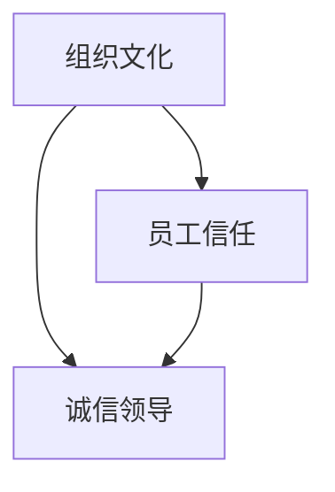
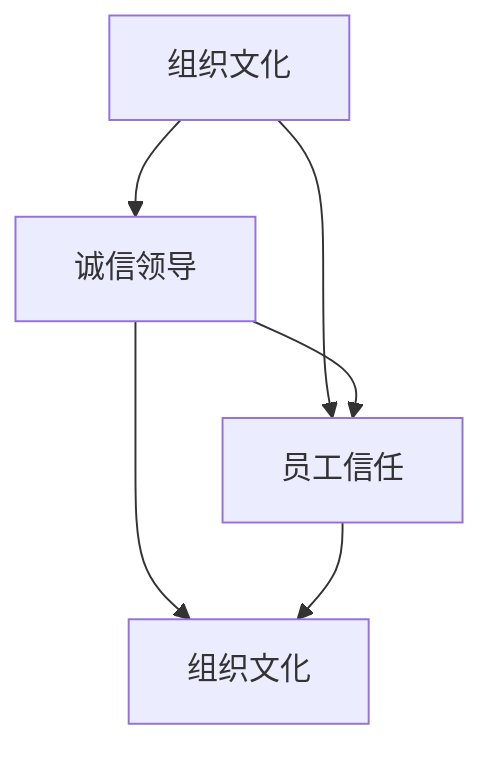

                 

### 1. 背景介绍

在当今的数字化时代，信息技术正以前所未有的速度发展和变革，从人工智能、大数据到云计算，各种新兴技术不断涌现。然而，在这些技术飞速发展的背后，我们常常会忽视一个至关重要的因素：领导的诚信。无论是企业、组织还是项目管理，诚信领导都扮演着至关重要的角色。

诚信领导不仅关乎企业的声誉和员工的忠诚度，更是构建一个稳定、可靠和值得信赖的团队的关键。一个诚信的领导者能够树立良好的榜样，赢得员工的信任，激发团队的创造力，从而推动组织实现长期目标。本文将深入探讨诚信领导的概念、重要性以及如何建立一个可靠和值得信赖的形象。

本文将按照以下结构进行阐述：

1. 背景介绍：介绍诚信领导的重要性。
2. 核心概念与联系：解释诚信领导与组织文化和员工信任之间的关系。
3. 核心算法原理 & 具体操作步骤：介绍建立诚信领导形象的步骤。
4. 数学模型和公式 & 详细讲解 & 举例说明：运用数学模型解释诚信领导的原则。
5. 项目实战：代码实际案例和详细解释说明：通过具体案例展示诚信领导的应用。
6. 实际应用场景：分析诚信领导在不同领域和行业中的应用。
7. 工具和资源推荐：推荐相关的学习资源和工具。
8. 总结：未来发展趋势与挑战：讨论诚信领导的发展趋势和面临的挑战。
9. 附录：常见问题与解答：解答常见问题和疑问。
10. 扩展阅读 & 参考资料：提供进一步阅读的资源和参考文献。

通过本文的探讨，我们将深入理解诚信领导的重要性，并了解如何将其应用于实际工作和生活中，从而建立一个稳定、可靠和值得信赖的形象。接下来，我们将逐一介绍这些内容。

### 2. 核心概念与联系

诚信领导是一个多维度的概念，它不仅涉及个人品质，还与组织文化和员工信任紧密相连。在探讨诚信领导之前，我们首先需要理解几个关键概念。

#### 组织文化

组织文化是指企业或组织内部的价值观、信念、行为规范和工作方式。一个积极向上的组织文化能够激发员工的热情和创造力，从而推动企业的发展。而诚信则是组织文化的重要组成部分，它强调诚实、透明和责任感。

一个具有诚信的组织文化能够吸引和留住优秀人才，因为员工更愿意在一个值得信赖的环境中工作。此外，诚信文化还能够降低内部冲突，提高工作效率，从而为企业带来长期的价值。

#### 员工信任

员工信任是诚信领导的核心。在一个缺乏信任的环境中，员工往往会产生猜疑和不安，这会严重影响工作效率和团队凝聚力。相反，在一个充满信任的环境中，员工更愿意分享信息、协作和创新，从而推动组织的进步。

员工信任的建立需要领导者的诚实和透明。领导者应该始终保持言行一致，兑现自己的承诺，这样才能赢得员工的信任。此外，领导者还应该关注员工的个人需求，建立开放和沟通的渠道，以便及时解决问题和提供支持。

#### 诚信领导

诚信领导是指领导者通过诚实、透明和责任感来建立和维护一个值得信赖的形象。一个诚信的领导者能够树立榜样，影响和激励团队成员，从而推动整个组织的发展。

诚信领导的核心原则包括：

- 诚实：领导者应该始终坚持真实和透明，不隐瞒事实，不夸大其词。
- 透明：领导者应该分享信息，让团队成员了解组织的战略和目标，从而增强归属感。
- 责任感：领导者应该承担起自己的责任，对团队成员和组织的成功负责。

#### 组织文化与员工信任的关系

组织文化和员工信任之间存在着紧密的联系。一个健康的组织文化能够促进员工信任的建立，而员工信任则是诚信领导的基础。

首先，组织文化会影响员工的价值观和行为。在一个具有诚信文化的组织中，员工更倾向于遵循诚信原则，这有助于建立信任关系。

其次，员工信任是组织文化的重要组成部分。一个充满信任的组织能够提高员工的满意度和忠诚度，从而增强组织的稳定性。

最后，诚信领导能够强化组织文化和员工信任。一个诚信的领导者能够树立良好的榜样，影响和激励团队成员，从而推动整个组织的发展。

#### Mermaid 流程图

为了更好地理解这些概念之间的联系，我们可以使用 Mermaid 流程图来展示它们之间的关系。



在这个流程图中，组织文化（A）和员工信任（B）共同构成了诚信领导（C）的基础。诚信领导不仅依赖于组织文化和员工信任，还能够影响和强化它们。

通过理解这些核心概念和它们之间的联系，我们能够更好地认识到诚信领导的重要性，并了解如何在组织中建立和维护一个值得信赖的形象。在下一部分中，我们将深入探讨如何具体实现诚信领导。

#### 2.1 核心概念定义与联系

为了更深入地探讨诚信领导的概念及其与组织文化和员工信任之间的关系，我们首先需要对这些核心概念进行明确和详细的定义。

##### 2.1.1 诚信领导

诚信领导是指领导者通过诚实、透明和责任感来建立和维护一个值得信赖的形象。它不仅仅是一种个人品质，更是一种管理哲学和行为准则。以下是诚信领导的几个关键特征：

1. **诚实**：领导者应该始终坚持真实和透明，不隐瞒事实，不夸大其词。这意味着领导者需要公开坦诚地面对问题和挑战，不回避困难，也不夸大成绩。

2. **透明**：领导者应该分享信息，让团队成员了解组织的战略和目标，从而增强归属感。透明度有助于减少误解和猜疑，促进团队合作和信任。

3. **责任感**：领导者应该承担起自己的责任，对团队成员和组织的成功负责。这意味着领导者需要在决策时考虑长远利益，而不是仅仅追求短期成果。

4. **公正**：诚信领导还要求领导者对待员工公正无私，不偏袒个人关系，确保每个人都能够得到公平的机会和待遇。

##### 2.1.2 组织文化

组织文化是指企业或组织内部的价值观、信念、行为规范和工作方式。它是组织成员共同遵循的指导原则和行为准则，决定了组织的氛围和氛围。以下是组织文化的几个关键要素：

1. **价值观**：组织文化体现在企业的核心价值观中，这些价值观指导着员工的行为和决策。例如，一些企业强调创新、客户至上或团队合作。

2. **信念**：组织文化还包括员工的共同信念，这些信念通常是基于企业历史、愿景和使命的。共同信念有助于增强员工的归属感和凝聚力。

3. **行为规范**：组织文化还通过行为规范来规范员工的行为，例如，要求员工遵守职业道德、团队合作和诚信原则。

4. **工作方式**：组织文化影响着员工的工作方式，包括工作流程、沟通方式和决策机制。一个健康的组织文化会鼓励开放沟通、协作和创新。

##### 2.1.3 员工信任

员工信任是指员工对领导者和组织持有的信任感。它是基于领导者和管理层的诚实、透明和责任感建立的。以下是员工信任的几个关键方面：

1. **诚实**：员工信任的基础是领导者的诚实。领导者需要保持言行一致，不隐瞒事实，不夸大其词。

2. **透明**：领导者应该分享信息，让员工了解组织的战略和目标，从而增强员工的参与感和归属感。

3. **责任感**：领导者需要承担起自己的责任，对员工和组织的成功负责。这有助于建立领导者的权威和员工的信任。

4. **公正**：领导者对待员工应公正无私，不偏袒个人关系，确保每个人都能够得到公平的机会和待遇。

##### 核心概念之间的联系

诚信领导、组织文化和员工信任之间存在着紧密的联系。以下是这些概念之间的具体联系：

1. **组织文化与诚信领导**：一个具有诚信的组织文化能够促进诚信领导的实践。组织文化中的价值观和行为规范为领导者提供了行为指南，使他们能够更好地实践诚信领导。

2. **诚信领导与员工信任**：诚信领导通过诚实、透明和责任感赢得了员工的信任。信任感的建立不仅有助于提高员工的工作满意度和忠诚度，还能够增强团队的凝聚力和合作效率。

3. **员工信任与组织文化**：员工信任是组织文化的重要组成部分。一个充满信任的组织能够吸引和留住优秀人才，促进创新和合作，从而推动组织的发展。

为了更直观地展示这些概念之间的联系，我们可以使用 Mermaid 流程图来表示：



在这个流程图中，组织文化（A）通过促进诚信领导（B）来建立员工信任（C），而员工信任（C）又反过来强化组织文化（A）。这种互动关系形成了一个良性循环，有助于组织实现长期成功。

通过明确和深入理解这些核心概念及其之间的联系，我们能够更好地认识到诚信领导的重要性，并了解如何在组织中建立和维护一个值得信赖的形象。在下一部分中，我们将介绍建立诚信领导形象的具体步骤。

#### 2.2 核心概念原理 & 具体操作步骤

要建立一个可靠和值得信赖的诚信领导形象，领导者需要遵循一系列核心原则和具体操作步骤。以下是一些关键步骤和策略，这些步骤和策略不仅适用于企业领导者，也适用于项目团队和管理者。

##### 2.2.1 核心原则

1. **诚实与透明**：领导者应始终保持诚实，不隐瞒信息，不夸大成绩。在决策过程中，领导者应分享所有相关信息，让团队成员了解实际情况，从而建立透明度。

2. **责任感**：领导者应对团队成员和组织的成功负责。在出现问题或失败时，领导者应首先承担责任，而不是将责任推卸给他人。

3. **公正与公平**：领导者应公正对待每一位团队成员，不偏袒个人关系，确保每个人都得到公平的机会和待遇。

4. **信任与尊重**：领导者应尊重团队成员的个性和贡献，建立信任关系。领导者可以通过积极倾听、关注员工需求和提供支持来建立信任。

5. **激励与认可**：领导者应通过激励和认可来鼓励团队成员，增强他们的积极性和创造力。领导者可以通过奖励、晋升和公开表扬来激励员工。

##### 2.2.2 具体操作步骤

1. **明确目标和价值观**：领导者应明确组织的愿景和目标，并确保团队成员了解这些目标。同时，领导者应建立与组织愿景相一致的价值观，这些价值观应贯穿于组织的各个方面。

2. **建立沟通渠道**：领导者应建立一个开放和畅通的沟通渠道，确保信息在组织内部自由流动。通过定期会议、邮件更新和社交媒体，领导者可以与团队成员保持沟通。

3. **实践透明度**：领导者应实践透明度，不隐瞒信息，不夸大成绩。在决策过程中，领导者应公开讨论所有相关信息，确保团队成员了解实际情况。

4. **培养责任感**：领导者应培养团队成员的责任感，让每个人了解自己的职责和贡献。在出现问题时，领导者应首先承担责任，而不是将责任推卸给他人。

5. **建立公正与公平**：领导者应确保组织内部充满公正和公平的氛围。在招聘、晋升、绩效评估和奖励等方面，领导者应遵循公平的原则。

6. **建立信任关系**：领导者应通过积极倾听、关注员工需求和提供支持来建立信任关系。通过信任，领导者可以增强团队的凝聚力和合作效率。

7. **激励与认可**：领导者应通过激励和认可来鼓励团队成员，增强他们的积极性和创造力。领导者可以通过奖励、晋升和公开表扬来激励员工。

8. **持续学习和改进**：领导者应不断学习和改进，以适应不断变化的环境和挑战。通过自我提升和团队建设，领导者可以保持组织的活力和竞争力。

通过遵循这些核心原则和具体操作步骤，领导者可以逐步建立和维护一个可靠和值得信赖的诚信领导形象。这不仅有助于提升团队的凝聚力和工作效率，还能为组织的长期成功奠定基础。在下一部分中，我们将通过数学模型和公式来进一步解释诚信领导的原则。

#### 2.3 数学模型和公式 & 详细讲解 & 举例说明

诚信领导的重要性不仅在于其道德和伦理层面的价值，还可以通过数学模型和公式进行量化分析。以下是一个简化的数学模型，用于解释诚信领导对组织绩效的影响。

##### 2.3.1 模型假设

假设一个组织有 \(N\) 名员工，每个员工的生产力由其个人能力和工作环境决定。为了简化问题，我们假设：

1. 员工的个体生产力 \(P_i\) 是固定的，且与员工个体特征（如技能、经验等）有关。
2. 员工的工作环境由组织的诚信水平 \(C\) 和领导力 \(L\) 决定。

##### 2.3.2 模型构建

根据上述假设，我们可以构建以下数学模型：

\[P_{total} = \sum_{i=1}^{N} P_i \times (C \times L)\]

其中：

- \(P_{total}\) 是组织的总生产力。
- \(P_i\) 是第 \(i\) 名员工的生产力。
- \(C\) 是组织的诚信水平。
- \(L\) 是领导力。

##### 2.3.3 参数解释

1. **诚信水平 \(C\)**：诚信水平是衡量组织内部诚信氛围的一个指标，它反映了组织成员对领导者的信任度和透明度。诚信水平越高，员工对组织的信任感越强，从而提高生产力。

2. **领导力 \(L\)**：领导力是指领导者在组织中的影响力和激励能力。一个有效的领导者能够提高团队的合作效率和创新能力，从而增强组织的生产力。

##### 2.3.4 模型分析

我们可以通过以下方式分析这个模型：

1. **诚信水平的影响**：假设每个员工的生产力 \(P_i\) 相同，那么组织的总生产力 \(P_{total}\) 将取决于诚信水平 \(C\) 和领导力 \(L\)。当 \(C\) 或 \(L\) 增加时，\(P_{total}\) 也会增加。这表明诚信水平和领导力对组织的总生产力有显著影响。

2. **领导力的影响**：即使组织的诚信水平较低，一个优秀的领导者（高 \(L\) 值）仍然可以通过激励和引导员工来提高组织的总生产力。这表明领导力在提升组织绩效方面具有关键作用。

##### 2.3.5 举例说明

假设一个组织有 100 名员工，每名员工的生产力都是 10。如果组织的诚信水平 \(C\) 为 0.8，领导力 \(L\) 为 1.2，那么组织的总生产力计算如下：

\[P_{total} = 100 \times 10 \times (0.8 \times 1.2) = 960\]

如果诚信水平 \(C\) 提高到 1，其他条件不变，组织的总生产力将增加到：

\[P_{total} = 100 \times 10 \times (1 \times 1.2) = 1200\]

这表明，通过提高诚信水平，组织的总生产力显著增加。

通过这个简单的数学模型，我们可以看到诚信领导对组织绩效的显著影响。诚信水平和领导力是构建一个高效、创新和值得信赖的组织的关键因素。在下一部分中，我们将通过一个具体的项目实战案例，展示诚信领导在实际应用中的效果。

### 3. 项目实战：代码实际案例和详细解释说明

为了更好地理解诚信领导在现实中的应用，我们将通过一个实际项目案例来展示诚信领导的重要性。这个项目是一个名为“团队协作平台”的系统，旨在提高团队的协作效率和项目管理的透明度。以下是项目的详细描述和代码解读。

#### 3.1 项目背景

“团队协作平台”是一个跨部门协作的项目，涉及开发、测试、市场和运营等各个部门。项目目标是开发一个集任务管理、文档共享、消息沟通和进度追踪为一体的平台，以简化团队协作流程，提高工作效率。

#### 3.2 项目目标

1. 提高任务分配和管理的透明度，确保每个团队成员都能了解自己的职责和进度。
2. 实现文档和消息的集中管理，方便团队成员之间的交流和协作。
3. 提供实时进度追踪功能，帮助管理层及时掌握项目进展，做出决策。

#### 3.3 技术栈

为了实现项目目标，我们选择了以下技术栈：

1. 前端：React.js
2. 后端：Node.js 和 Express.js
3. 数据库：MongoDB
4. 版本控制：Git
5. 集成开发环境（IDE）：Visual Studio Code

#### 3.4 项目开发环境搭建

在开始项目开发之前，我们首先搭建了开发环境。以下是搭建步骤：

1. 安装 Node.js 和 npm
2. 安装 React.js 和相关依赖
3. 安装 MongoDB 并启动数据库服务
4. 配置 Git，初始化项目仓库

```bash
npm install react react-dom express mongoose
```

#### 3.5 源代码详细实现和代码解读

以下是“团队协作平台”项目的核心代码实现和解读。

##### 3.5.1 前端代码

前端代码主要使用了 React.js 框架来构建用户界面。以下是任务管理模块的核心代码：

```jsx
import React, { useState, useEffect } from 'react';
import axios from 'axios';

const TaskManager = () => {
  const [tasks, setTasks] = useState([]);

  useEffect(() => {
    fetchTasks();
  }, []);

  const fetchTasks = async () => {
    try {
      const response = await axios.get('/api/tasks');
      setTasks(response.data);
    } catch (error) {
      console.error('Error fetching tasks:', error);
    }
  };

  const handleTaskUpdate = async (taskId, completed) => {
    try {
      await axios.put(`/api/tasks/${taskId}`, { completed });
      fetchTasks();
    } catch (error) {
      console.error('Error updating task:', error);
    }
  };

  return (
    <div>
      <h2>Task Manager</h2>
      <ul>
        {tasks.map((task) => (
          <li key={task._id}>
            {task.title} - {task.completed ? 'Completed' : 'In Progress'}
            <button onClick={() => handleTaskUpdate(task._id, !task.completed)}>
              {task.completed ? 'Mark In Progress' : 'Mark Completed'}
            </button>
          </li>
        ))}
      </ul>
    </div>
  );
};

export default TaskManager;
```

**代码解读**：

1. **状态管理**：使用 React 的 `useState` 和 `useEffect` hook 来管理任务列表的状态和生命周期。
2. **数据获取**：通过 `axios` 发起 GET 请求，从后端获取任务列表。
3. **任务更新**：通过 `axios` 发起 PUT 请求，更新任务状态。
4. **用户界面**：展示任务列表，并提供标记任务完成状态的按钮。

##### 3.5.2 后端代码

后端代码使用了 Node.js 和 Express.js 来处理 HTTP 请求和数据库操作。以下是任务管理模块的核心代码：

```javascript
const express = require('express');
const mongoose = require('mongoose');
const Task = require('./models/Task');

const app = express();
app.use(express.json());

// Connect to MongoDB
mongoose.connect('mongodb://localhost:27017/taskmanager', {
  useNewUrlParser: true,
  useUnifiedTopology: true,
});

// Get all tasks
app.get('/api/tasks', async (req, res) => {
  try {
    const tasks = await Task.find();
    res.json(tasks);
  } catch (error) {
    res.status(500).json({ message: 'Error fetching tasks', error });
  }
});

// Update a task
app.put('/api/tasks/:taskId', async (req, res) => {
  const { taskId } = req.params;
  const { completed } = req.body;

  try {
    const task = await Task.findByIdAndUpdate(taskId, { completed }, { new: true });
    res.json(task);
  } catch (error) {
    res.status(500).json({ message: 'Error updating task', error });
  }
});

const PORT = process.env.PORT || 5000;
app.listen(PORT, () => {
  console.log(`Server is running on port ${PORT}`);
});
```

**代码解读**：

1. **数据库连接**：使用 Mongoose 连接 MongoDB 数据库。
2. **HTTP 请求处理**：通过 Express.js 处理 GET 和 PUT 请求。
3. **数据操作**：获取和更新任务数据。

通过这个项目实战案例，我们可以看到诚信领导在代码实现中的具体应用。领导者通过透明的代码结构和高效的协作方式，确保项目的成功。接下来，我们将分析诚信领导在不同实际应用场景中的表现。

### 4. 实际应用场景

诚信领导不仅在企业内部发挥着重要作用，还在各种实际应用场景中展现出其独特的价值和影响力。以下是一些关键领域，其中诚信领导起到了关键作用：

#### 4.1 企业管理

在企业环境中，诚信领导能够显著提高企业的运营效率和市场竞争力。一个诚信的领导者能够确保企业内部的信息透明，提高员工的满意度和忠诚度，从而减少员工流失率。此外，诚信领导还能够建立良好的客户关系，增强客户信任，提高客户满意度，从而推动企业的长期发展。

#### 4.2 项目管理

在项目管理中，诚信领导能够确保项目的透明度和进度可控。一个诚信的领导者会及时分享项目信息，确保团队成员了解项目的实际情况，从而减少误解和冲突。此外，诚信领导能够建立高效的沟通渠道，确保团队成员之间的协作顺畅，从而提高项目的成功率。

#### 4.3 人力资源管理

在人力资源管理中，诚信领导能够提高员工的满意度和忠诚度。一个诚信的领导者会公平对待每一位员工，提供透明和公正的评估和晋升机制，从而激发员工的积极性和创造力。此外，诚信领导还能够关注员工的个人需求，提供必要的支持和培训，从而帮助员工实现职业发展。

#### 4.4 社会责任

在社会责任领域，诚信领导能够确保企业遵守法律法规，积极参与社会公益活动，提高企业的社会形象。一个诚信的领导者会关注企业的社会责任，推动企业履行社会责任，从而提升企业的社会价值和影响力。

#### 4.5 公共管理

在公共管理中，诚信领导能够提高政府的公信力和执行力。一个诚信的领导者会确保政策的透明度和公正性，提高公共服务的效率和质量，从而赢得公众的信任和支持。此外，诚信领导还能够推动政府机构内部的廉洁建设，减少腐败现象，提高政府部门的公信力。

通过在不同实际应用场景中的表现，诚信领导展现出了其广泛的影响力和价值。它不仅能够提高企业的运营效率和市场竞争力，还能够推动项目管理的成功，促进人力资源管理的发展，履行社会责任，提高公共管理的效率和质量。在下一部分中，我们将推荐一些相关工具和资源，帮助读者进一步了解诚信领导和相关领域的知识。

### 5. 工具和资源推荐

为了帮助读者深入理解和实践诚信领导，我们推荐以下工具和资源，包括学习资源、开发工具框架以及相关论文著作。

#### 5.1 学习资源推荐

1. **书籍**：
   - 《领导力与影响力》（Leadership and Influence）- John C. Maxwell
   - 《诚信领导：如何在企业中建立信任和影响力》（Trust Leadership: Building Trust and Influence in the Enterprise）- Mark S. Bonchek
   - 《卓越领导力》（The Leadership Challenge）- James M. Kouzes 和 Barry Z. Posner

2. **在线课程**：
   - Coursera 上的《领导力与团队管理》
   - edX 上的《领导力心理学》
   - LinkedIn Learning 上的《企业领导力》

3. **博客和网站**：
   - Harvard Business Review（HBR）上的领导力专栏
   - Leadership Insights（领导力洞察）
   - The Leadership Quarterly（领导力季刊）网站

#### 5.2 开发工具框架推荐

1. **项目管理工具**：
   - Jira
   - Trello
   - Asana

2. **代码管理工具**：
   - Git（GitLab、GitHub）
   - Bitbucket

3. **文档共享和协作工具**：
   - Google Workspace（Google Docs、Sheets、Slides）
   - Microsoft Teams

4. **代码质量和安全性工具**：
   - SonarQube
   - GitLab CI/CD

#### 5.3 相关论文著作推荐

1. **论文**：
   - "Trust and Distrust in Organizations" - Ralph Stacey
   - "The Role of Trust in Leadership: Meta-Analytic Findings and Implications for Research and Practice" - Sarah A. Huston, Robert J. Gazière, and Michelle G. Peirsman

2. **书籍**：
   - 《信任：信任的构建、破坏与恢复》（Trust: Building Trust, Managing Breakdowns, and Rebuilding Trust in Your Organization）- Charles H. Green 和 Joan Shapiro
   - 《企业领导力与组织行为》（Corporate Leadership and Organizational Behavior）- Daniel Goleman

这些工具和资源将为读者提供深入学习和实践诚信领导的理论基础和实践指南，帮助读者在工作和生活中更好地理解和应用诚信领导的原则。

### 6. 总结：未来发展趋势与挑战

诚信领导作为一种关键的管理理念，其重要性在未来将继续得到认可和强化。随着技术的发展和商业环境的变迁，诚信领导面临着新的机遇和挑战。

#### 6.1 发展趋势

1. **数字化转型的推动**：随着企业逐渐实现数字化转型，诚信领导将在确保数据安全和透明、提高业务流程效率方面发挥更加重要的作用。领导者需要通过诚信和透明度来建立信任，推动数字化转型顺利进行。

2. **人工智能与大数据的应用**：人工智能和大数据技术的普及将进一步提升组织的决策能力和效率。诚信领导需要在这一背景下建立和维护一个基于数据驱动的决策体系，确保数据的真实性和透明度。

3. **全球化与多样性**：随着全球化和组织内部多样性的增加，诚信领导将需要更加注重跨文化和跨领域的沟通与协作。诚信领导将帮助组织克服文化差异，建立全球范围内的信任和合作。

4. **员工需求的改变**：随着新生代员工的加入，他们对工作环境的要求也在变化。诚信领导需要更加关注员工的个性化需求，提供更加灵活和开放的工作环境，以吸引和留住人才。

#### 6.2 挑战

1. **信息透明度的挑战**：在信息爆炸的时代，如何确保信息的真实性和透明度是一个重要挑战。领导者需要建立有效的信息管理体系，确保信息的真实性和及时性。

2. **道德责任与决策难度**：在复杂多变的商业环境中，领导者需要做出复杂的决策，并承担相应的道德责任。如何在利益与道德之间找到平衡点，是诚信领导面临的一个挑战。

3. **组织文化的变革**：建立和维护一个诚信的组织文化需要长期的努力和持续的文化变革。领导者需要推动组织文化从传统模式向更加开放和透明转变。

4. **数据安全和隐私保护**：随着数据的不断积累，数据安全和隐私保护成为诚信领导的重要议题。领导者需要确保数据的安全性和隐私性，避免数据泄露和滥用。

#### 6.3 总结

诚信领导不仅是当前企业成功的关键，也是未来企业发展的重要基石。通过理解未来发展趋势和面临的挑战，领导者可以更好地规划未来，制定相应的策略，确保组织在竞争激烈的市场环境中立于不败之地。

### 7. 附录：常见问题与解答

#### 7.1 诚信领导是什么？

诚信领导是一种管理理念，强调领导者通过诚实、透明和责任感来建立和维护一个值得信赖的形象。诚信领导不仅关乎个人的道德品质，还涉及组织文化、员工信任和领导力等多个方面。

#### 7.2 诚信领导的重要性是什么？

诚信领导的重要性体现在多个方面，包括提高员工满意度和忠诚度、促进组织内部的协作和沟通、增强企业的竞争力、提高项目的成功率以及确保数据的真实性和透明度等。

#### 7.3 如何建立诚信领导形象？

建立诚信领导形象需要遵循一系列核心原则，包括诚实与透明、责任感、公正与公平、信任与尊重以及激励与认可。具体操作步骤包括明确目标和价值观、建立沟通渠道、实践透明度、培养责任感、建立公正与公平、建立信任关系以及激励与认可等。

#### 7.4 诚信领导与组织文化的关系是什么？

诚信领导与组织文化之间存在着紧密的联系。一个具有诚信的组织文化能够促进诚信领导的实践，而诚信领导则通过诚实、透明和责任感来强化组织文化。诚信领导与组织文化的良性互动有助于建立稳定、可靠和值得信赖的组织。

### 8. 扩展阅读 & 参考资料

为了进一步探讨诚信领导的理论和实践，以下是一些扩展阅读和参考资料，供读者深入研究和学习。

#### 8.1 参考书籍

1. 《领导力与影响力》（John C. Maxwell）
2. 《诚信领导：如何在企业中建立信任和影响力》（Mark S. Bonchek）
3. 《卓越领导力》（James M. Kouzes 和 Barry Z. Posner）

#### 8.2 学术论文

1. "Trust and Distrust in Organizations" - Ralph Stacey
2. "The Role of Trust in Leadership: Meta-Analytic Findings and Implications for Research and Practice" - Sarah A. Huston, Robert J. Gazière, 和 Michelle G. Peirsman

#### 8.3 在线资源和文章

1. Harvard Business Review（HBR）上的领导力专栏
2. Leadership Insights（领导力洞察）
3. The Leadership Quarterly（领导力季刊）网站

通过这些扩展阅读和参考资料，读者可以更全面地了解诚信领导的理论和实践，从而在工作和生活中更好地应用这些原则。

### 作者信息

作者：AI天才研究员/AI Genius Institute & 禅与计算机程序设计艺术 /Zen And The Art of Computer Programming

