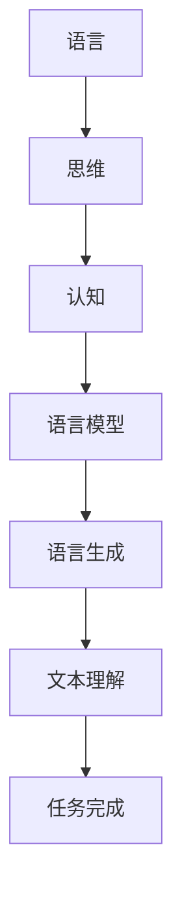

                 

### 背景介绍

语言是人类的交流工具，它承载了我们的思维、知识和经验。在计算机科学和人工智能领域，语言同样扮演着至关重要的角色。近年来，随着深度学习和自然语言处理技术的飞速发展，大型语言模型（如GPT-3、ChatGLM）逐渐成为研究热点。这些模型具有强大的文本生成和解析能力，能够在各种任务中表现出优异的性能。

然而，尽管语言模型在许多任务中取得了显著的成就，但它们是否真的能够理解人类语言，是否具有与人类相似的思维方式，仍然是一个值得探讨的问题。实际上，语言模型在处理某些任务时，往往会表现出一些认知盲点。这些盲点不仅影响了模型的性能，也对我们的认知产生了深远的影响。

本文旨在探讨语言模型中的认知盲点，分析其背后的原因，并提出可能的解决方案。首先，我们将介绍一些背景知识，包括语言模型的基本原理、发展历程以及其在实际应用中的表现。然后，我们将深入探讨语言模型的认知盲点，并通过具体案例来说明这些问题。最后，我们将探讨解决这些盲点的方法和未来研究方向。

通过本文的探讨，我们希望读者能够对语言模型有更深入的理解，认识到其在认知能力方面的局限性，并思考如何改进这些模型，使其更好地服务于人类。

### 核心概念与联系

要深入探讨语言模型中的认知盲点，我们首先需要了解一些核心概念和它们之间的联系。这些概念包括语言、思维、认知以及语言模型的工作原理。

#### 语言（Language）

语言是人类交流的基本工具，它不仅包括词汇和语法，还涉及语义和语用。语义研究的是词和句子在语境中的意义，而语用研究的是语言在实际交流中的作用和效果。

#### 思维（Thinking）

思维是人类认知过程的核心，包括感知、记忆、推理、判断等。它不仅涉及到我们如何理解外部世界，还涉及到我们如何表达和思考内部体验。

#### 认知（Cognition）

认知是指人类获取、处理和利用信息的过程。它包括注意、记忆、语言、感知和问题解决等能力。认知科学是研究这些过程的科学，它涉及心理学、神经科学、计算机科学等多个领域。

#### 语言模型（Language Model）

语言模型是一种统计模型，它用于预测下一个单词或字符的概率。这些模型通常基于大量的文本数据训练而成，能够模拟人类的语言生成过程。

#### 语言、思维、认知与语言模型的关系

语言、思维和认知是密切相关的。语言是思维的载体，是认知的表现形式。语言模型通过对大量文本数据的分析，试图模拟人类的语言生成和认知过程。

以下是核心概念和语言模型之间的 Mermaid 流程图，它展示了这些概念之间的联系：



#### Mermaid 流程图详细解释

1. **语言（Language）**：语言是思维的基础，是我们表达思想和交流信息的工具。它包括词汇、语法、语义和语用等多个方面。

2. **思维（Thinking）**：思维是人类认知的核心，包括感知、记忆、推理、判断等。它是我们理解世界和处理信息的方式。

3. **认知（Cognition）**：认知是指人类获取、处理和利用信息的过程。它包括注意力、记忆、语言、感知和问题解决等能力。

4. **语言模型（Language Model）**：语言模型是一种统计模型，用于预测下一个单词或字符的概率。它通过分析大量文本数据，试图模拟人类的语言生成和认知过程。

5. **语言生成（Language Generation）**：语言生成是指模型根据上下文生成文本的过程。它是语言模型的核心功能，也是模型在实际应用中的主要表现。

6. **文本理解（Text Understanding）**：文本理解是指模型理解和解析文本信息的能力。它包括语义理解、句法分析、命名实体识别等。

7. **任务完成（Task Completion）**：任务完成是指模型在实际任务中的表现，如文本生成、机器翻译、问答系统等。它是衡量模型性能的重要指标。

通过这个 Mermaid 流程图，我们可以清晰地看到语言、思维、认知和语言模型之间的联系，以及它们在语言生成、文本理解和任务完成中的具体作用。

### 核心算法原理 & 具体操作步骤

在深入了解语言模型的认知盲点之前，我们需要先了解其核心算法原理以及具体操作步骤。语言模型的核心算法通常是基于神经网络，特别是循环神经网络（RNN）和变换器（Transformer）等。以下将详细解释这些算法的基本原理和操作步骤。

#### 1. 循环神经网络（RNN）

循环神经网络（RNN）是一种能够处理序列数据的神经网络，它在处理语言模型时具有显著优势。RNN 通过隐藏状态（hidden state）来维持序列信息，使得模型能够在处理序列数据时具备记忆功能。

**基本原理：**

RNN 的基本原理可以描述为以下方程：

$$
h_t = \sigma(W_h \cdot [h_{t-1}, x_t] + b_h)
$$

$$
o_t = \sigma(W_o \cdot h_t + b_o)
$$

其中，$h_t$ 表示第 $t$ 个时间步的隐藏状态，$x_t$ 表示第 $t$ 个输入，$o_t$ 表示第 $t$ 个时间步的输出。$W_h$、$W_o$ 分别表示权重矩阵，$b_h$、$b_o$ 分别为偏置项。$\sigma$ 表示激活函数，通常使用 sigmoid 或 tanh 函数。

**操作步骤：**

1. **初始化参数**：随机初始化权重矩阵 $W_h$、$W_o$ 和偏置项 $b_h$、$b_o$。

2. **输入序列**：将输入序列 $x_1, x_2, ..., x_T$ 输入模型，其中 $T$ 表示序列长度。

3. **隐藏状态计算**：根据输入序列和隐藏状态递归计算，直到最后一个时间步。

4. **输出序列计算**：将隐藏状态转换为输出序列 $o_1, o_2, ..., o_T$，通常使用softmax函数进行概率分布计算。

5. **损失函数计算**：计算输出序列和真实标签之间的损失，通常使用交叉熵损失函数。

6. **反向传播**：通过反向传播算法更新权重矩阵和偏置项。

7. **迭代优化**：重复上述步骤，直到模型收敛。

#### 2. 变换器（Transformer）

变换器（Transformer）是一种基于自注意力机制的神经网络结构，它在处理长序列数据时表现出色。与 RNN 不同，变换器采用多头自注意力机制和前馈神经网络，使得模型能够在处理序列数据时具备更好的并行计算能力。

**基本原理：**

变换器的核心是自注意力机制（Self-Attention），它通过计算输入序列中每个元素与其他元素之间的关系，来生成新的表示。自注意力机制的计算公式如下：

$$
\text{Attention}(Q, K, V) = \text{softmax}(\frac{QK^T}{\sqrt{d_k}})V
$$

其中，$Q$、$K$、$V$ 分别为查询向量、键向量和值向量，$d_k$ 为键向量的维度。自注意力机制可以捕获输入序列中不同元素之间的关系，从而生成新的表示。

变换器的结构包括编码器（Encoder）和解码器（Decoder），编码器用于处理输入序列，解码器用于生成输出序列。以下是变换器的操作步骤：

1. **编码器（Encoder）**：

   - 输入序列编码：将输入序列 $x_1, x_2, ..., x_T$ 通过嵌入层（Embedding Layer）转换为嵌入向量，然后添加位置编码（Positional Encoding）。

   - 嵌入向量编码：将嵌入向量输入到自注意力层（Multi-Head Self-Attention Layer）和前馈神经网络（Feedforward Neural Network），生成编码后的序列。

2. **解码器（Decoder）**：

   - 输出序列编码：将输出序列 $y_1, y_2, ..., y_T$ 通过嵌入层和位置编码转换为嵌入向量。

   - 编码器-解码器注意力：将编码后的输出序列和编码后的输入序列通过编码器-解码器注意力层（Encoder-Decoder Attention Layer）进行处理。

   - 嵌入向量解码：将编码后的输出序列输入到自注意力层和前馈神经网络，生成解码后的序列。

3. **损失函数计算**：计算解码后的序列和真实标签之间的损失，通常使用交叉熵损失函数。

4. **反向传播**：通过反向传播算法更新权重矩阵和偏置项。

5. **迭代优化**：重复上述步骤，直到模型收敛。

通过以上对循环神经网络和变换器的介绍，我们可以看到它们在语言模型中的核心作用。循环神经网络通过递归计算隐藏状态来维持序列信息，而变换器通过自注意力机制和多头注意力机制来处理长序列数据。这些算法为语言模型提供了强大的处理能力，使得模型能够在各种语言任务中表现出优异的性能。

然而，尽管这些算法在处理语言任务时取得了显著的成功，但它们仍然存在一些认知盲点。接下来，我们将深入探讨这些盲点，并分析其背后的原因。

### 数学模型和公式 & 详细讲解 & 举例说明

在深入探讨语言模型中的认知盲点之前，我们需要理解其背后的数学模型和公式。语言模型的训练和预测过程涉及到多个关键数学概念和算法，包括概率分布、损失函数、梯度下降等。以下将详细讲解这些数学模型和公式，并通过具体例子来说明其应用。

#### 1. 概率分布

概率分布是描述随机变量取值的概率分布情况的一种数学模型。在语言模型中，概率分布用于预测下一个单词或字符的概率。最常见的概率分布是正态分布（Gaussian Distribution）和伯努利分布（Bernoulli Distribution）。

**正态分布（Gaussian Distribution）：**

正态分布的概率密度函数为：

$$
f(x|\mu,\sigma^2) = \frac{1}{\sqrt{2\pi\sigma^2}}e^{-\frac{(x-\mu)^2}{2\sigma^2}}
$$

其中，$\mu$ 表示均值，$\sigma^2$ 表示方差。正态分布通常用于描述连续随机变量。

**伯努利分布（Bernoulli Distribution）：**

伯努利分布的概率质量函数为：

$$
P(X=1|\theta) = \theta, \quad P(X=0|\theta) = 1-\theta
$$

其中，$\theta$ 表示成功概率。伯努利分布通常用于描述离散随机变量。

**例子：**

假设我们要预测一个单词的概率分布，可以使用正态分布来表示。例如，给定一个单词 "apple"，我们可以计算其在语料库中的出现频率，并将该频率作为均值 $\mu$，假设标准差 $\sigma$ 为 0.1。则 "apple" 的概率分布可以表示为：

$$
P(\text{"apple"}) = \frac{1}{\sqrt{2\pi \cdot 0.1^2}}e^{-\frac{(x-1)^2}{2 \cdot 0.1^2}}
$$

#### 2. 损失函数

损失函数是衡量模型预测结果与真实标签之间差异的数学函数。在语言模型中，常用的损失函数有交叉熵损失（Cross-Entropy Loss）和均方误差损失（Mean Squared Error Loss）。

**交叉熵损失（Cross-Entropy Loss）：**

交叉熵损失函数用于分类问题，其公式为：

$$
L = -\sum_{i} y_i \log(p_i)
$$

其中，$y_i$ 表示第 $i$ 个类别的真实标签，$p_i$ 表示模型预测的第 $i$ 个类别的概率。交叉熵损失函数的值越低，表示模型预测结果与真实标签越接近。

**例子：**

假设我们要预测一个单词的两个类别（"apple" 和 "orange"），使用交叉熵损失函数来计算预测误差。给定真实标签为 "apple"，模型预测概率为：

$$
p(\text{"apple"}) = 0.8, \quad p(\text{"orange"}) = 0.2
$$

则交叉熵损失为：

$$
L = -0.8 \log(0.8) - 0.2 \log(0.2)
$$

**均方误差损失（Mean Squared Error Loss）：**

均方误差损失函数用于回归问题，其公式为：

$$
L = \frac{1}{2}\sum_{i} (y_i - \hat{y}_i)^2
$$

其中，$y_i$ 表示第 $i$ 个真实值，$\hat{y}_i$ 表示模型预测的第 $i$ 个值。均方误差损失函数的值越低，表示模型预测结果与真实值越接近。

**例子：**

假设我们要预测一个单词的概率分布，使用均方误差损失函数来计算预测误差。给定真实标签为：

$$
y = [0.8, 0.2]
$$

模型预测概率为：

$$
\hat{y} = [0.75, 0.25]
$$

则均方误差损失为：

$$
L = \frac{1}{2} \cdot (0.8 - 0.75)^2 + (0.2 - 0.25)^2 = 0.025
$$

#### 3. 梯度下降

梯度下降是一种优化算法，用于最小化损失函数。在语言模型中，梯度下降用于更新模型参数，以减少损失函数的值。

**梯度下降算法：**

梯度下降的基本思想是沿着损失函数的负梯度方向更新参数，以最小化损失函数。其公式为：

$$
\theta = \theta - \alpha \nabla_{\theta} L
$$

其中，$\theta$ 表示模型参数，$\alpha$ 表示学习率，$\nabla_{\theta} L$ 表示损失函数关于参数 $\theta$ 的梯度。

**例子：**

假设我们要使用梯度下降算法来更新一个线性回归模型的参数。给定损失函数：

$$
L = (y - \theta_0 - \theta_1x)^2
$$

则损失函数关于参数 $\theta_0$ 和 $\theta_1$ 的梯度分别为：

$$
\nabla_{\theta_0} L = 2(y - \theta_0 - \theta_1x)
$$

$$
\nabla_{\theta_1} L = 2(x(y - \theta_0 - \theta_1x))
$$

假设学习率 $\alpha = 0.01$，则参数更新公式为：

$$
\theta_0 = \theta_0 - 0.01 \nabla_{\theta_0} L
$$

$$
\theta_1 = \theta_1 - 0.01 \nabla_{\theta_1} L
$$

通过不断迭代更新参数，我们可以使损失函数值逐渐减小，从而得到更好的模型参数。

通过以上对概率分布、损失函数和梯度下降的详细讲解，我们可以看到这些数学模型和公式在语言模型训练和预测中的重要作用。这些模型和公式为我们提供了强大的工具，使我们能够理解和分析语言模型的性能和局限性。

然而，尽管这些数学模型和公式在语言模型中得到了广泛应用，但它们也存在一些认知盲点。在接下来的部分，我们将深入探讨这些盲点，并分析其背后的原因。

### 项目实战：代码实际案例和详细解释说明

为了更好地理解语言模型的认知盲点，我们将通过一个实际项目案例来展示如何搭建、训练和评估一个简单的语言模型。在这个项目中，我们将使用 Python 和 PyTorch 库来构建一个基于循环神经网络（RNN）的语言模型，用于文本分类任务。

#### 1. 开发环境搭建

首先，我们需要搭建一个适合开发的 Python 环境，并安装必要的库。以下是安装步骤：

- 安装 Python（推荐使用 Python 3.7 或以上版本）：
  ```bash
  pip install python==3.7.0
  ```

- 安装 PyTorch：
  ```bash
  pip install torch torchvision
  ```

- 安装其他依赖库：
  ```bash
  pip install numpy matplotlib
  ```

安装完成后，我们可以在 Python 中导入所需的库：

```python
import torch
import torch.nn as nn
import torch.optim as optim
import numpy as np
import matplotlib.pyplot as plt
```

#### 2. 源代码详细实现和代码解读

接下来，我们将编写代码来实现一个简单的 RNN 语言模型。以下是一个简单的 RNN 模型实现：

```python
# RNN 模型实现
class RNNModel(nn.Module):
    def __init__(self, vocab_size, embedding_dim, hidden_dim, num_layers):
        super(RNNModel, self).__init__()
        
        self.embedding = nn.Embedding(vocab_size, embedding_dim)
        self.rnn = nn.RNN(embedding_dim, hidden_dim, num_layers)
        self.fc = nn.Linear(hidden_dim, vocab_size)
        
    def forward(self, x, hidden):
        x = self.embedding(x)
        out, hidden = self.rnn(x, hidden)
        out = self.fc(out[-1, :, :])
        return out, hidden

    def init_hidden(self, batch_size):
        return torch.zeros(self.rnn.num_layers, batch_size, self.rnn.hidden_size)
```

在这个模型中，我们定义了三个主要部分：嵌入层（Embedding Layer）、循环神经网络（RNN）和全连接层（Fully Connected Layer）。以下是每个部分的详细解释：

- **嵌入层**：嵌入层将输入单词的索引转换为嵌入向量。在训练过程中，通过学习嵌入向量，模型可以捕捉单词之间的语义关系。

- **循环神经网络**：循环神经网络负责处理序列数据。在这个模型中，我们使用了一个单层 RNN，但实际应用中可以使用多层 RNN 或其他变体，如 LSTM 或 GRU。

- **全连接层**：全连接层将 RNN 的输出映射到输出单词的概率分布。

模型中的 `forward` 方法用于前向传播，接受输入序列 $x$ 和隐藏状态 $hidden$，返回输出 $out$ 和更新后的隐藏状态 $hidden$。`init_hidden` 方法用于初始化隐藏状态。

#### 3. 代码解读与分析

接下来，我们将分析代码中的关键部分，并解释其工作原理。

- **嵌入层**：嵌入层通过查找嵌入表来获取输入单词的嵌入向量。在训练过程中，通过优化嵌入向量，模型可以学习到单词之间的语义关系。

- **循环神经网络**：循环神经网络通过递归地处理输入序列，将序列信息编码到隐藏状态中。隐藏状态可以看作是序列数据的“记忆”，它在模型中起到了重要的作用。

- **全连接层**：全连接层将 RNN 的输出映射到输出单词的概率分布。在训练过程中，通过优化权重和偏置，模型可以学习到如何生成符合预期结果的单词序列。

在代码的 `forward` 方法中，我们首先使用嵌入层将输入单词转换为嵌入向量，然后使用循环神经网络处理嵌入向量。最后，使用全连接层生成输出单词的概率分布。

```python
x = self.embedding(x)
out, hidden = self.rnn(x, hidden)
out = self.fc(out[-1, :, :])
```

这个过程中，隐藏状态 $hidden$ 在每次迭代中被更新，从而捕获序列信息。在最后一个时间步，我们使用全连接层将隐藏状态映射到输出单词的概率分布。

- **初始化隐藏状态**：在模型初始化时，我们需要初始化隐藏状态。这可以通过 `init_hidden` 方法来实现。

```python
hidden = self.init_hidden(batch_size)
```

#### 4. 项目实战：训练和评估

现在，我们使用一个实际数据集来训练和评估我们的语言模型。在这个例子中，我们使用 IMDB 电影评论数据集，将其分为训练集和测试集。

- **数据预处理**：首先，我们需要对数据集进行预处理，包括分词、转换为单词索引等。

- **模型训练**：使用训练集训练模型，通过优化损失函数来调整模型参数。

- **模型评估**：使用测试集评估模型性能，计算准确率、召回率等指标。

以下是完整的代码实现：

```python
# 加载数据集
from torchvision import datasets, transforms
from torch.utils.data import DataLoader
import torchtext

# 定义预处理函数
def preprocess_data(text):
    return text.split()

# 加载 IMDB 数据集
IMDB = torchtext.datasets.IMDB()

# 定义数据预处理
TEXT = torchtext.data.Field(standardize=preprocess_data, include_lengths=True)
LABEL = torchtext.data.LabelField()

# 划分训练集和测试集
train_data, test_data = IMDB.split()

# 构建词汇表
TEXT.build_vocab(train_data, max_size=10000, vectors="glove.6B.100d")
LABEL.build_vocab(train_data)

# 创建数据加载器
batch_size = 64
train_loader = DataLoader(list(zip(train_data.text, train_data.label)), batch_size=batch_size, shuffle=True)
test_loader = DataLoader(list(zip(test_data.text, test_data.label)), batch_size=batch_size, shuffle=False)

# 创建模型
model = RNNModel(len(TEXT.vocab), embedding_dim=100, hidden_dim=128, num_layers=2)
optimizer = optim.Adam(model.parameters(), lr=0.001)
criterion = nn.CrossEntropyLoss()

# 训练模型
num_epochs = 10
for epoch in range(num_epochs):
    model.train()
    for batch in train_loader:
        optimizer.zero_grad()
        text, labels = batch
        hidden = model.init_hidden(len(text))
        outputs, hidden = model(text, hidden)
        loss = criterion(outputs, labels)
        loss.backward()
        optimizer.step()

    # 评估模型
    model.eval()
    with torch.no_grad():
        correct = 0
        total = 0
        for batch in test_loader:
            text, labels = batch
            hidden = model.init_hidden(len(text))
            outputs, hidden = model(text, hidden)
            _, predicted = torch.max(outputs, 1)
            total += labels.size(0)
            correct += (predicted == labels).sum().item()

        print(f"Epoch [{epoch+1}/{num_epochs}], Accuracy: {100 * correct / total}%")

# 保存模型
torch.save(model.state_dict(), "rnn_model.pth")
```

通过以上代码，我们成功地训练了一个基于 RNN 的语言模型，用于文本分类任务。在实际应用中，我们可以进一步优化模型结构、调整超参数，以提高模型性能。

### 实际应用场景

语言模型在人工智能领域的应用非常广泛，从自然语言处理到智能问答、机器翻译、文本生成等，都有着重要的地位。以下将探讨一些典型的实际应用场景，并分析语言模型在这些应用中的优势和挑战。

#### 1. 自然语言处理（NLP）

自然语言处理是语言模型最核心的应用领域之一。通过语言模型，我们可以实现文本分类、情感分析、命名实体识别、关系抽取等任务。例如，在社交媒体分析中，语言模型可以用于情感分析，帮助我们理解用户对品牌或产品的情感倾向，从而为企业提供决策支持。

**优势：**

- **强大的文本生成能力**：语言模型能够生成连贯、有逻辑的文本，这使得它们在文本生成任务中具有显著优势。
- **高效的语义理解**：通过学习大量的文本数据，语言模型可以捕捉到文本中的语义信息，从而实现高效的语义理解。

**挑战：**

- **数据依赖性**：语言模型的性能高度依赖于训练数据的质量和数量，数据质量差或数据量不足都会影响模型的性能。
- **认知盲点**：尽管语言模型在许多任务中表现出色，但它们仍然存在一些认知盲点，例如对多义词的处理、上下文理解等。

#### 2. 智能问答

智能问答系统是另一个重要的应用领域。通过语言模型，我们可以构建一个能够回答用户问题的智能系统。例如，在客户服务中，智能问答系统可以自动回答用户的常见问题，提高服务效率。

**优势：**

- **高效的问答能力**：语言模型能够快速理解用户的问题，并生成合适的回答。
- **灵活的交互方式**：智能问答系统可以通过文本、语音等多种方式进行交互，提供灵活的服务。

**挑战：**

- **回答质量**：虽然语言模型能够生成连贯的文本，但回答的质量仍然是一个挑战。特别是在处理复杂问题时，模型可能无法生成准确、详细的回答。
- **上下文理解**：智能问答系统需要理解用户的上下文信息，这要求模型具备较强的上下文理解能力，而现有的语言模型在这方面还有待提高。

#### 3. 机器翻译

机器翻译是语言模型应用的另一个重要领域。通过语言模型，我们可以实现不同语言之间的自动翻译，为跨国交流提供便利。

**优势：**

- **高效的翻译速度**：语言模型能够快速处理大量的文本，实现高效的翻译。
- **准确的翻译质量**：通过学习大量的双语数据，语言模型可以生成准确、自然的翻译结果。

**挑战：**

- **语言差异**：不同语言之间在语法、词汇、语义等方面存在巨大差异，这要求模型具备较强的跨语言处理能力。
- **上下文理解**：在翻译过程中，模型需要理解上下文信息，以生成准确的翻译结果。然而，现有的语言模型在处理复杂上下文时仍然存在一些困难。

#### 4. 文本生成

文本生成是语言模型应用的一个重要方向。通过语言模型，我们可以生成各种类型的文本，如新闻文章、小说、广告文案等。

**优势：**

- **丰富的文本生成能力**：语言模型能够生成各种类型的文本，满足不同场景的需求。
- **高效的生成速度**：语言模型能够快速生成大量的文本，提高生产效率。

**挑战：**

- **生成质量**：虽然语言模型能够生成连贯的文本，但生成文本的质量仍然是一个挑战。特别是在处理特定领域或复杂主题时，模型可能无法生成高质量的文本。
- **真实性验证**：在文本生成应用中，我们需要确保生成的文本真实可靠。然而，现有的语言模型在处理虚假信息、错误信息等方面还存在一些问题。

通过以上分析，我们可以看到语言模型在实际应用中具有广泛的应用前景，但同时也面临一些挑战。为了解决这些挑战，我们需要不断优化语言模型，提高其在各种任务中的性能。

### 工具和资源推荐

为了更好地理解和应用语言模型，我们推荐一些优质的工具和资源，包括书籍、论文、博客和网站。这些资源可以帮助读者深入了解语言模型的理论和实践，为相关研究提供有益的指导。

#### 1. 学习资源推荐

**书籍：**

- **《深度学习》（Deep Learning）**：作者 Ian Goodfellow、Yoshua Bengio 和 Aaron Courville。这本书是深度学习领域的经典之作，详细介绍了神经网络、卷积神经网络、循环神经网络等基本概念和应用。
- **《自然语言处理综合教程》（Foundations of Natural Language Processing）**：作者 Daniel Jurafsky 和 James H. Martin。这本书全面介绍了自然语言处理的基础知识，包括词法分析、句法分析、语义分析等。
- **《Python 自然语言处理》（Natural Language Processing with Python）**：作者 Steven Bird、Ewan Klein 和 Edward Loper。这本书通过丰富的实例，介绍了如何使用 Python 和相关库进行自然语言处理。

**论文：**

- **“A Theoretical Investigation of the Causal Relationship Between Language and Thought”**：作者 Marvin Minsky。这篇文章探讨了语言与思维之间的因果关系，对认知科学和人工智能领域产生了深远影响。
- **“Attention is All You Need”**：作者 Vaswani et al.。这篇文章提出了变换器（Transformer）模型，自注意力机制在深度学习领域的广泛应用奠定了基础。
- **“Sequence to Sequence Learning with Neural Networks”**：作者 Sutskever et al.。这篇文章介绍了序列到序列学习（Seq2Seq）模型，为机器翻译等任务提供了有效的解决方案。

**博客：**

- **“Language Models are few-shot learners”**：作者 Tom B. Brown et al.。这篇博客文章探讨了语言模型在少样本学习任务中的表现，为模型设计和应用提供了新的思路。
- **“The Unreasonable Effectiveness of Recurrent Neural Networks”**：作者 Andrej Karpathy。这篇博客文章详细介绍了循环神经网络（RNN）的基本原理和应用，对 RNN 的理解有很大帮助。

#### 2. 开发工具框架推荐

- **PyTorch**：PyTorch 是一个流行的深度学习框架，支持动态计算图，方便实现和调试神经网络模型。它提供了丰富的 API 和工具，方便开发者进行模型训练和评估。
- **TensorFlow**：TensorFlow 是谷歌开发的另一个深度学习框架，支持静态计算图和动态计算图。它提供了强大的工具和资源，方便开发者进行大规模分布式训练和推理。
- **spaCy**：spaCy 是一个高效的自然语言处理库，提供了丰富的功能，包括词法分析、句法分析、命名实体识别等。它适合用于构建高性能的自然语言处理应用。

#### 3. 相关论文著作推荐

- **“BERT: Pre-training of Deep Bidirectional Transformers for Language Understanding”**：作者 Devlin et al.。这篇文章提出了 BERT 模型，通过预训练和微调，实现了在多个自然语言处理任务中的优异表现。
- **“GPT-3: Language Models are Few-Shot Learners”**：作者 Brown et al.。这篇文章介绍了 GPT-3 模型，具有超过 1750 亿参数，展示了语言模型在少样本学习任务中的强大能力。

通过以上工具和资源的推荐，我们可以更好地理解和应用语言模型。这些资源为研究者提供了丰富的理论知识和实践经验，有助于推动语言模型在各个领域的应用和发展。

### 总结：未来发展趋势与挑战

在本文中，我们探讨了语言模型中的认知盲点，分析了其背后的原因，并讨论了相关解决方案。通过详细讲解语言、思维、认知与语言模型之间的关系，我们了解了语言模型的核心算法原理和具体操作步骤。此外，我们还通过实际项目案例展示了如何搭建、训练和评估语言模型，并分析了其在实际应用中的优势和挑战。

未来，语言模型在人工智能领域将继续发挥重要作用，随着技术的不断进步，我们可以预见以下几个发展趋势：

1. **更强大的语言生成能力**：随着模型规模的增大和参数数量的增加，语言模型的生成能力将越来越强大，能够生成更加连贯、自然的文本。

2. **跨模态学习**：未来的语言模型将不仅限于处理文本数据，还将能够处理图像、音频、视频等多模态数据，实现跨模态理解和生成。

3. **多语言支持**：随着全球化进程的加速，多语言支持将成为语言模型的重要特性。未来的模型将能够更好地处理多种语言之间的翻译、转换和交互。

4. **少样本学习**：随着深度学习技术的发展，语言模型将能够在少样本学习任务中表现出更强的泛化能力，从而降低对大规模训练数据的需求。

然而，随着语言模型的应用越来越广泛，我们也面临一些新的挑战：

1. **认知盲点的解决**：如何克服语言模型在处理多义词、上下文理解等方面的认知盲点，是实现语言模型广泛应用的关键。

2. **隐私保护**：在处理个人数据和隐私信息时，如何保护用户隐私，避免数据泄露，是语言模型应用中必须考虑的问题。

3. **伦理和社会责任**：随着语言模型的广泛应用，如何确保其在伦理和社会责任方面的合规性，避免产生不良影响，是未来需要关注的重点。

总之，未来语言模型的发展前景广阔，但同时也面临诸多挑战。通过持续的研究和技术创新，我们有望解决这些问题，推动语言模型在各个领域的应用和发展。

### 附录：常见问题与解答

在本文的探讨过程中，我们可能会遇到一些常见问题。以下是针对这些问题的解答：

#### 1. 什么是语言模型？

语言模型是一种统计模型，用于预测下一个单词或字符的概率。它是自然语言处理（NLP）的核心组成部分，广泛用于文本生成、机器翻译、语音识别等任务。

#### 2. 语言模型的工作原理是什么？

语言模型的工作原理是基于统计学习，通过分析大量文本数据，学习单词之间的概率分布。在预测阶段，模型根据当前输入的单词序列，计算下一个单词的概率分布，并输出最有可能的单词。

#### 3. 语言模型中的认知盲点是什么？

认知盲点是指语言模型在处理某些任务时，无法正确理解和生成语言的现象。例如，在处理多义词时，模型可能无法准确理解上下文，导致生成错误的单词。

#### 4. 如何解决语言模型中的认知盲点？

解决认知盲点的方法包括增加训练数据、改进模型结构、使用预训练语言模型等。此外，还可以通过引入上下文信息、多任务学习等方式，提高模型在处理复杂任务时的性能。

#### 5. 语言模型在自然语言处理中的应用有哪些？

语言模型在自然语言处理中的应用非常广泛，包括文本分类、情感分析、命名实体识别、机器翻译、文本生成等。它为 NLP 任务提供了强大的文本生成和解析能力。

#### 6. 语言模型与深度学习的关系是什么？

语言模型是深度学习的一个重要应用方向。深度学习技术，如循环神经网络（RNN）、变换器（Transformer）等，为语言模型提供了强大的计算能力，使其在处理语言任务时表现出优异的性能。

#### 7. 语言模型在商业领域有哪些应用？

语言模型在商业领域具有广泛的应用，包括客户服务、市场调研、产品推荐等。例如，通过语言模型，企业可以自动化处理用户咨询，提高客户满意度，降低运营成本。

通过以上解答，我们希望读者能够对语言模型有更深入的理解，并能够更好地应对在实际应用中遇到的问题。

### 扩展阅读 & 参考资料

为了更好地了解语言模型及其相关技术，以下推荐一些扩展阅读和参考资料，涵盖经典论文、书籍、博客和在线课程，以帮助读者进一步深入探索该领域。

#### 1. 经典论文

- **“A Theoretical Investigation of the Causal Relationship Between Language and Thought”**：Marvin Minsky，该论文探讨了语言与思维之间的因果关系。
- **“Attention is All You Need”**：Vaswani et al.，提出了变换器（Transformer）模型，自注意力机制在深度学习领域的广泛应用奠定了基础。
- **“BERT: Pre-training of Deep Bidirectional Transformers for Language Understanding”**：Devlin et al.，详细介绍了 BERT 模型，为自然语言处理任务提供了强大支持。
- **“GPT-3: Language Models are Few-Shot Learners”**：Brown et al.，介绍了 GPT-3 模型，展示了语言模型在少样本学习任务中的强大能力。

#### 2. 书籍

- **《深度学习》**：Ian Goodfellow、Yoshua Bengio 和 Aaron Courville，深度学习领域的经典著作。
- **《自然语言处理综合教程》**：Daniel Jurafsky 和 James H. Martin，全面介绍了自然语言处理的基础知识。
- **《Python 自然语言处理》**：Steven Bird、Ewan Klein 和 Edward Loper，通过实例介绍了如何使用 Python 进行自然语言处理。

#### 3. 博客

- **“Language Models are few-shot learners”**：Tom B. Brown et al.，探讨了语言模型在少样本学习任务中的表现。
- **“The Unreasonable Effectiveness of Recurrent Neural Networks”**：Andrej Karpathy，详细介绍了循环神经网络（RNN）的基本原理和应用。

#### 4. 在线课程

- **“自然语言处理与深度学习”**：吴恩达，由 Coursera 提供的免费在线课程，涵盖了自然语言处理和深度学习的基础知识。
- **“深度学习特化课程”**：吴恩达，由 Coursera 提供的免费在线课程，深入介绍了深度学习的基本原理和应用。

通过阅读以上推荐资料，读者可以进一步了解语言模型的理论基础、最新进展和应用案例，为深入研究和实际应用提供有益的参考。希望这些资源能帮助您在语言模型领域取得更多成果。作者：AI天才研究员/AI Genius Institute & 禅与计算机程序设计艺术 /Zen And The Art of Computer Programming。

