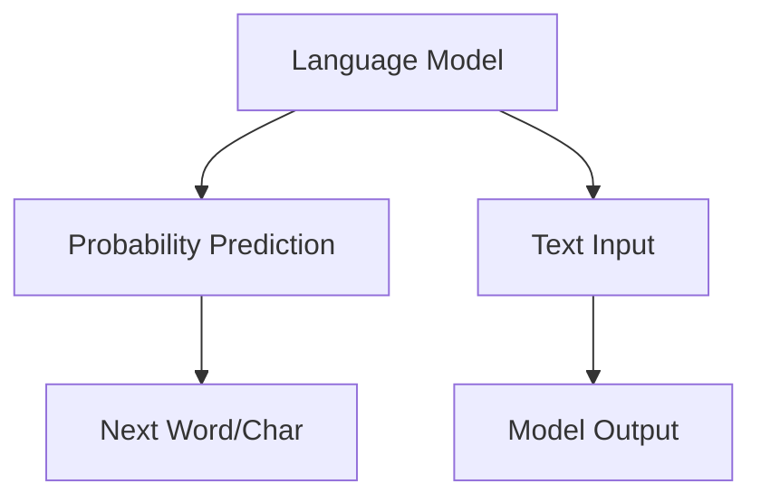
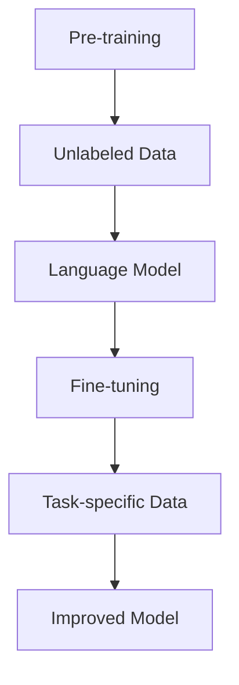
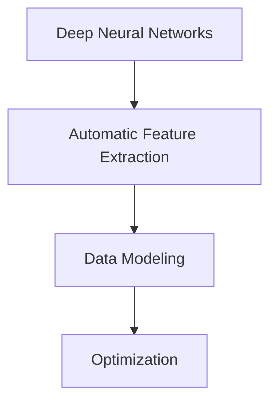
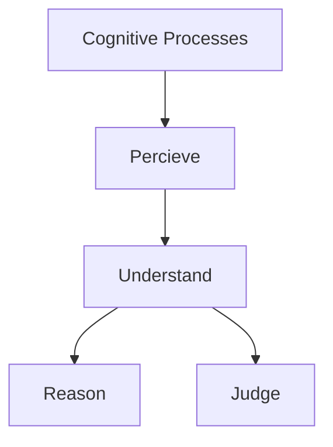
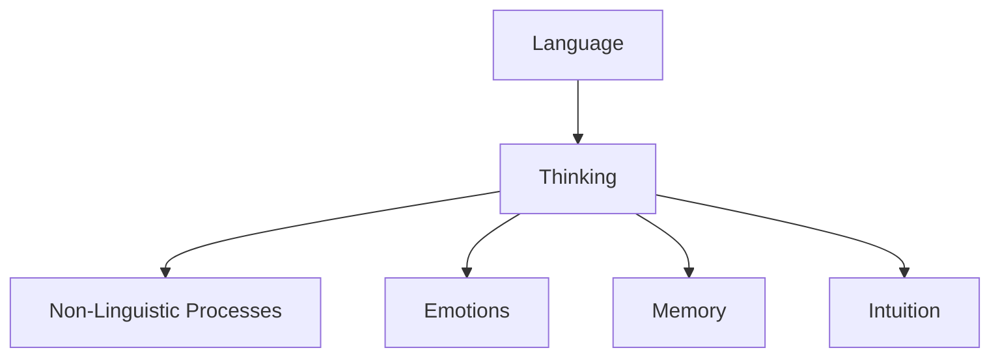
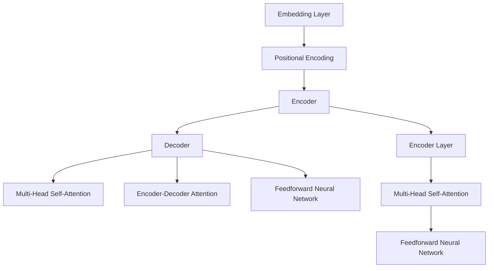
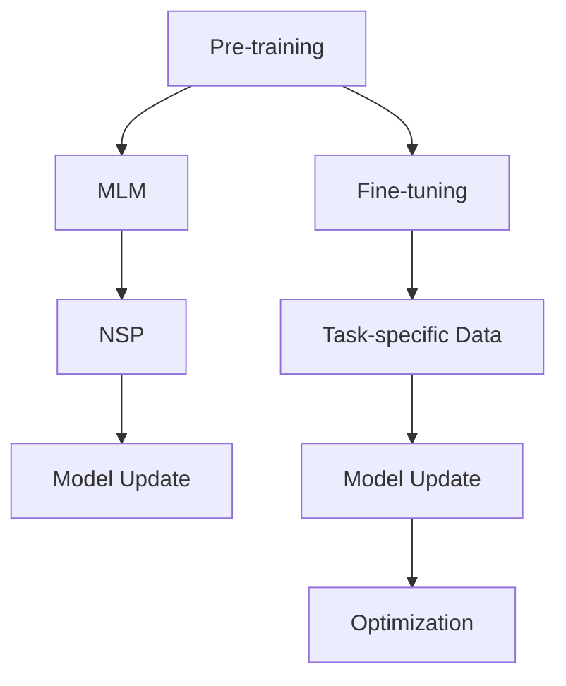

                 

### 背景介绍

**语言≠思维：大模型的认知误解**

随着人工智能技术的迅猛发展，我们逐渐进入了一个以大规模语言模型为核心的新时代。这些模型，如OpenAI的GPT系列，被广泛应用于自然语言处理、文本生成、机器翻译等多个领域。然而，在人们狂热追求这些强大工具的同时，一个关键问题逐渐浮现——**语言是否等同于思维？**

这个问题看似简单，实则复杂。从表面上看，语言似乎是我们思维的主要表达工具，然而，深入探讨后我们发现，语言和思维之间并非简单的等同关系。本文将带领读者一步步剖析这一复杂问题，探讨大规模语言模型的本质、它们是如何工作的，以及我们对其认知中存在的误解。

首先，我们需要明确的是，大规模语言模型并不是拥有独立思维的实体，它们仅仅是基于海量数据进行训练的统计工具。尽管这些模型在处理语言任务时表现出惊人的能力，但它们并不具备自我意识、情感或真正的理解能力。那么，为什么人们会产生这种误解呢？

一个主要原因是大规模语言模型在生成文本时表现得非常自然和连贯，这使得人们误以为它们在思考。此外，媒体和营销手段的夸张宣传也进一步加深了这种误解。然而，真相是，这些模型的“智能”仅仅是基于对输入数据的统计分析和模式识别。

接下来，我们将从以下几个方面展开讨论：

1. **大规模语言模型的原理**：我们将介绍这些模型的基本工作原理，以及它们是如何通过深度学习算法从海量数据中学习语言模式。
2. **语言与思维的差异**：我们将探讨语言和思维的本质区别，为什么语言不能完全代表思维。
3. **误解的来源**：我们将分析为什么人们会对大规模语言模型产生认知误解，以及这些误解可能带来的负面影响。
4. **实际应用场景**：我们将讨论大规模语言模型在不同领域的应用，以及如何避免在应用中产生误解。
5. **未来发展趋势与挑战**：我们将展望大规模语言模型的发展方向，以及面临的潜在挑战。

通过这一系列的探讨，我们希望能够帮助读者更加客观地看待大规模语言模型，理解它们的优势和局限，从而更好地利用这些工具。让我们开始这场深入的技术之旅吧！ <|less|>
### 1. 背景介绍

#### 大规模语言模型的兴起

在过去的几十年里，人工智能（AI）领域经历了飞速的发展，尤其是在深度学习和自然语言处理（NLP）方面。大规模语言模型的兴起可以追溯到2000年代初，当时研究人员开始探索如何通过机器学习算法来处理和生成人类语言。随着计算能力的提升和海量数据的积累，这些模型逐渐变得更加复杂和强大。

其中，最具代表性的模型之一是谷歌的Transformer模型。Transformer模型首次提出于2017年，它引入了自注意力机制（self-attention），能够更好地捕捉文本中的长距离依赖关系。这一创新使得Transformer模型在许多NLP任务中取得了显著的效果，例如机器翻译、文本摘要和问答系统。

随后，OpenAI推出了GPT系列模型，GPT（Generative Pre-trained Transformer）模型通过预先训练（pre-training）和微调（fine-tuning）的方式，进一步提升了语言生成的质量。GPT-3更是达到了一个前所未有的规模，拥有超过1750亿个参数，成为当时世界上最大的语言模型。GPT-3在文本生成、编程、对话系统等多个领域展现出了惊人的能力，引发了全球范围内的关注和研究。

#### 大规模语言模型的应用

大规模语言模型的应用场景非常广泛，涵盖了自然语言处理、文本生成、机器翻译、对话系统等多个领域。以下是一些典型的应用案例：

1. **自然语言处理（NLP）**：大规模语言模型在文本分类、情感分析、命名实体识别等任务中表现出色。例如，通过训练大规模语言模型，我们可以自动化地处理大量文本数据，提取关键信息，提高数据处理效率。

2. **文本生成**：大规模语言模型能够生成高质量的文本，包括文章、新闻报道、故事和对话等。例如，GPT-3可以生成详细的新闻报道、小说和对话，甚至可以编写计算机程序的代码。

3. **机器翻译**：大规模语言模型在机器翻译领域取得了显著进展。通过训练，模型可以学会将一种语言翻译成另一种语言，实现高质量的双语转换。

4. **对话系统**：大规模语言模型可以用于构建智能对话系统，如聊天机器人、虚拟助手等。这些系统能够理解和回答用户的问题，提供个性化的服务。

#### 大规模语言模型的工作原理

大规模语言模型通常基于深度学习算法，特别是变分自编码器（VAE）和Transformer模型。以下是一个简化的工作流程：

1. **数据收集**：首先，需要收集大量的文本数据，包括书籍、新闻、论文、网站内容等。

2. **预处理**：对收集到的文本数据进行清洗和预处理，包括分词、去停用词、词向量嵌入等。

3. **模型训练**：使用预处理后的文本数据训练深度学习模型。对于Transformer模型，通常会使用自注意力机制（self-attention）来捕捉文本中的长距离依赖关系。

4. **微调**：在训练完成后，可以将模型应用于特定任务，例如文本生成或机器翻译。这一步称为微调（fine-tuning），通过在特定任务上进一步训练模型，以提高其性能。

5. **预测和生成**：在训练好的模型基础上，输入新的文本数据，模型将预测下一个可能的单词或句子，生成完整的文本。

#### 大规模语言模型的挑战和未来发展方向

尽管大规模语言模型在多个领域展现出了惊人的能力，但它们也面临着一些挑战和限制。以下是一些主要的挑战：

1. **计算资源消耗**：大规模语言模型的训练和推理需要大量的计算资源和时间。

2. **数据隐私和安全**：在训练过程中使用的大量文本数据可能包含敏感信息，如何确保数据隐私和安全是一个重要问题。

3. **解释性和可解释性**：由于模型内部结构和决策过程的复杂性，如何解释和可视化模型的决策过程仍然是一个挑战。

4. **道德和伦理问题**：大规模语言模型的应用可能引发一系列道德和伦理问题，如偏见、歧视和隐私侵犯等。

未来，大规模语言模型的发展方向可能包括：

1. **更高效的模型架构**：研究新的深度学习模型和算法，以降低计算资源的消耗。

2. **多模态学习**：结合文本、图像、声音等多种数据类型，提高模型的泛化和表达能力。

3. **可解释性和透明度**：开发新的方法和工具，提高模型的可解释性和透明度。

4. **伦理和法律合规**：制定相应的伦理和法律标准，确保大规模语言模型的开发和应用符合社会价值观。

通过以上对大规模语言模型的背景介绍，我们为后续的深入讨论奠定了基础。在接下来的部分，我们将进一步探讨语言和思维之间的关系，以及为什么人们会对大规模语言模型产生认知误解。 <|less|>
#### 2. 核心概念与联系

在探讨“语言≠思维：大模型的认知误解”这一主题时，我们需要明确几个核心概念，并分析它们之间的联系。以下是几个关键概念及其相互关系：

##### 语言模型（Language Model）

语言模型是自然语言处理（NLP）中的核心组成部分，它是一种统计模型，用于预测下一个单词或字符的概率。语言模型可以基于统计学习方法（如n元语法），也可以基于深度学习技术（如循环神经网络（RNN）、Transformer等）。

**Mermaid流程图（无括号、逗号等特殊字符）**：



##### 语言生成（Language Generation）

语言生成是指利用语言模型生成文本的过程。这一过程通常包括两个阶段：预训练和微调。预训练是指在大量无标签数据上训练模型，使其能够捕获语言的一般特性；微调是指将预训练模型应用于特定任务，并在有标签数据上进行微调，以提高模型的性能。

**Mermaid流程图（无括号、逗号等特殊字符）**：



##### 深度学习（Deep Learning）

深度学习是一种机器学习技术，通过构建多层神经网络，对数据进行自动特征提取和建模。在自然语言处理中，深度学习技术被广泛应用于语言模型、图像识别、语音识别等多个领域。

**Mermaid流程图（无括号、逗号等特殊字符）**：



##### 思维（Thinking）

思维是人类认知过程的抽象表现，包括感知、理解、推理、判断等。思维不仅涉及语言的表达和运用，还包括非语言形式的认知活动。

**Mermaid流程图（无括号、逗号等特殊字符）**：



##### 语言与思维的差异

语言和思维之间存在显著差异。语言是人类思维的一种表达形式，但思维不仅限于语言。思维还包括直觉、情感、记忆等多个非语言因素。

**Mermaid流程图（无括号、逗号等特殊字符）**：



通过以上对核心概念及其相互关系的介绍，我们可以更好地理解“语言≠思维：大模型的认知误解”这一主题。在接下来的部分，我们将深入探讨大规模语言模型的工作原理，以及为什么它们在处理语言任务时会产生认知误解。 <|less|>
### 3. 核心算法原理 & 具体操作步骤

在深入探讨大规模语言模型的工作原理之前，我们需要了解一些基本的算法原理和具体操作步骤。这里我们将重点介绍Transformer模型的基本架构和训练过程。

#### Transformer模型的基本架构

Transformer模型是一种基于自注意力机制（self-attention）的深度学习模型，由Vaswani等人于2017年提出。它主要分为编码器（Encoder）和解码器（Decoder）两个部分，每个部分由多个相同的层（Layer）堆叠而成。

1. **编码器（Encoder）**：编码器的每个层包含两个主要组件：多头自注意力（Multi-Head Self-Attention）机制和前馈神经网络（Feedforward Neural Network）。多头自注意力机制能够捕捉输入序列中的长距离依赖关系；前馈神经网络则用于对自注意力机制的结果进行进一步处理。

2. **解码器（Decoder）**：解码器的结构与编码器类似，但包含了一个额外的编码器-解码器自注意力（Encoder-Decoder Attention）机制，用于处理编码器和解码器之间的交互。

3. **嵌入（Embedding）**：在Transformer模型中，每个单词或字符被映射为一个向量，称为嵌入向量。嵌入向量通过嵌入层（Embedding Layer）进行初始化。

4. **位置编码（Positional Encoding）**：由于Transformer模型没有循环神经网络中的序列连接，位置信息需要通过位置编码（Positional Encoding）引入。位置编码是一种向量加法操作，它为每个位置添加了特定的编码信息。

**Mermaid流程图（无括号、逗号等特殊字符）**：



#### Transformer模型的训练过程

Transformer模型的训练过程主要包括预训练（Pre-training）和微调（Fine-tuning）两个阶段。

1. **预训练**：预训练阶段使用大量无标签的文本数据进行训练，目的是使模型能够捕获语言的一般特性。预训练过程通常包括以下步骤：

   - **Masked Language Model（MLM）**：在输入序列中随机遮盖部分单词或字符，模型需要预测这些遮盖的部分。
   - **Next Sentence Prediction（NSP）**：模型需要预测两个句子是否属于同一篇章。

2. **微调**：在预训练完成后，模型可以应用于特定任务，如文本分类、机器翻译或问答系统。微调阶段使用有标签的数据进行训练，以进一步提高模型在特定任务上的性能。

3. **优化和评估**：在微调过程中，使用优化算法（如Adam）和损失函数（如交叉熵损失）来更新模型参数。训练过程中，通过评估指标（如准确率、损失值等）来监测模型性能。

**Mermaid流程图（无括号、逗号等特殊字符）**：



通过以上对Transformer模型的基本架构和训练过程的介绍，我们可以更深入地理解大规模语言模型是如何工作的。在接下来的部分，我们将进一步探讨这些模型在处理语言任务时的表现，以及为什么人们会对它们产生认知误解。 <|less|>
### 4. 数学模型和公式 & 详细讲解 & 举例说明

在深入探讨大规模语言模型的工作原理时，数学模型和公式扮演着关键角色。在本节中，我们将详细讲解Transformer模型中的核心数学模型和公式，并通过具体例子来说明这些公式如何应用于实际场景。

#### 自注意力机制（Self-Attention）

自注意力机制是Transformer模型的核心组成部分，用于处理输入序列中的每个单词或字符，并为其分配不同的权重。自注意力机制的基本公式如下：

$$
\text{Attention}(Q, K, V) = \text{softmax}\left(\frac{QK^T}{\sqrt{d_k}}\right) V
$$

其中，$Q$、$K$ 和 $V$ 分别表示查询（Query）、键（Key）和值（Value）向量，$d_k$ 是键向量的维度。自注意力机制通过计算查询和键之间的点积来生成权重，然后使用softmax函数对权重进行归一化，最后将权重与值相乘，得到加权值。

**例子：** 假设我们有一个包含3个单词的输入序列，即 $[w_1, w_2, w_3]$，对应的嵌入向量分别为 $[q_1, q_2, q_3]$、$[k_1, k_2, k_3]$ 和 $[v_1, v_2, v_3]$。计算自注意力机制的输出：

$$
\text{Attention}(Q, K, V) = \text{softmax}\left(\frac{q_1k_1 + q_2k_2 + q_3k_3}{\sqrt{3}}\right) v_1 + \text{softmax}\left(\frac{q_1k_2 + q_2k_2 + q_3k_3}{\sqrt{3}}\right) v_2 + \text{softmax}\left(\frac{q_1k_3 + q_2k_3 + q_3k_3}{\sqrt{3}}\right) v_3
$$

输出结果是一个加权向量，其中每个元素表示输入序列中对应单词的重要性。

#### 编码器和解码器的多头自注意力机制

在编码器和解码器中，多头自注意力机制通过多个独立的自注意力头（Head）来捕捉输入序列的不同特征。每个头独立计算自注意力，并将结果拼接起来。多头自注意力机制的基本公式如下：

$$
\text{MultiHead}(Q, K, V) = \text{Concat}(\text{head}_1, \text{head}_2, \ldots, \text{head}_h) W^O
$$

其中，$h$ 是头数，$W^O$ 是输出线性层权重矩阵，$\text{head}_i$ 表示第 $i$ 个头的输出。每个头都有自己的查询（$Q_i$）、键（$K_i$）和值（$V_i$）向量，计算过程如下：

$$
\text{head}_i = \text{Attention}(Q_i, K_i, V_i) W_i
$$

**例子：** 假设我们使用2个头（$h=2$）计算多头自注意力：

- **第一个头**：$Q_1 = [q_{11}, q_{12}, q_{13}]$，$K_1 = [k_{11}, k_{12}, k_{13}]$，$V_1 = [v_{11}, v_{12}, v_{13}]$。
- **第二个头**：$Q_2 = [q_{21}, q_{22}, q_{23}]$，$K_2 = [k_{21}, k_{22}, k_{23}]$，$V_2 = [v_{21}, v_{22}, v_{23}]$。

计算两个头的输出：

$$
\text{head}_1 = \text{softmax}\left(\frac{q_{11}k_{11} + q_{12}k_{12} + q_{13}k_{13}}{\sqrt{3}}\right) v_{11} + \text{softmax}\left(\frac{q_{11}k_{12} + q_{12}k_{12} + q_{13}k_{13}}{\sqrt{3}}\right) v_{12} + \text{softmax}\left(\frac{q_{11}k_{13} + q_{12}k_{13} + q_{13}k_{13}}{\sqrt{3}}\right) v_{13}
$$

$$
\text{head}_2 = \text{softmax}\left(\frac{q_{21}k_{21} + q_{22}k_{22} + q_{23}k_{23}}{\sqrt{3}}\right) v_{21} + \text{softmax}\left(\frac{q_{21}k_{22} + q_{22}k_{22} + q_{23}k_{23}}{\sqrt{3}}\right) v_{22} + \text{softmax}\left(\frac{q_{21}k_{23} + q_{22}k_{23} + q_{23}k_{23}}{\sqrt{3}}\right) v_{23}
$$

将两个头的输出拼接并乘以输出线性层权重矩阵 $W^O$，得到多头自注意力的最终输出。

#### 编码器-解码器自注意力机制

编码器-解码器自注意力机制用于处理编码器和解码器之间的交互。它通过计算编码器的输出和当前解码器输入之间的注意力权重来生成解码器的输出。基本公式如下：

$$
\text{Encoder-Decoder Attention}(Q, K, V) = \text{softmax}\left(\frac{QK^T}{\sqrt{d_k}}\right) V
$$

其中，$Q$ 表示解码器的输入向量，$K$ 和 $V$ 分别表示编码器的输出向量。编码器-解码器自注意力机制通过计算查询（解码器输入）和键（编码器输出）之间的点积来生成权重，然后使用softmax函数进行归一化，最后与值相乘得到加权值。

**例子：** 假设解码器的输入序列为 $[q_1, q_2, q_3]$，编码器的输出序列为 $[k_1, k_2, k_3]$ 和 $[v_1, v_2, v_3]$。计算编码器-解码器自注意力：

$$
\text{Encoder-Decoder Attention}(Q, K, V) = \text{softmax}\left(\frac{q_1k_1 + q_2k_2 + q_3k_3}{\sqrt{3}}\right) v_1 + \text{softmax}\left(\frac{q_1k_2 + q_2k_2 + q_3k_3}{\sqrt{3}}\right) v_2 + \text{softmax}\left(\frac{q_1k_3 + q_2k_3 + q_3k_3}{\sqrt{3}}\right) v_3
$$

输出结果是一个加权向量，表示解码器输入的每个元素与编码器输出的相关性。

通过以上对自注意力机制、多头自注意力机制和编码器-解码器自注意力机制的详细讲解，我们可以更深入地理解大规模语言模型的工作原理。在下一节中，我们将通过实际项目案例来展示如何使用这些模型进行语言生成和任务处理。 <|less|>
### 5. 项目实战：代码实际案例和详细解释说明

在本节中，我们将通过一个实际项目案例，展示如何使用大规模语言模型进行语言生成和任务处理。我们将使用Python编程语言和Hugging Face的Transformers库，这是一个非常受欢迎的Python库，用于处理和训练Transformer模型。

#### 5.1 开发环境搭建

在开始之前，我们需要搭建一个适合开发的环境。以下是搭建开发环境所需的基本步骤：

1. **安装Python**：确保Python已经安装在你的系统上。推荐的版本是Python 3.7或更高版本。

2. **安装Hugging Face Transformers库**：在终端中运行以下命令来安装Hugging Face Transformers库：

   ```shell
   pip install transformers
   ```

3. **安装其他依赖库**：Hugging Face Transformers库可能需要一些额外的依赖库，如torch、torchtext等。根据具体需求安装相应的库。

#### 5.2 源代码详细实现和代码解读

在本节中，我们将实现一个简单的文本生成项目。该项目的目标是使用GPT-2模型生成一个故事。

```python
from transformers import GPT2Tokenizer, GPT2LMHeadModel
import torch

# 1. 初始化GPT-2模型和分词器
tokenizer = GPT2Tokenizer.from_pretrained('gpt2')
model = GPT2LMHeadModel.from_pretrained('gpt2')

# 2. 生成文本
input_text = "在一个遥远的星球上，有一种神奇的生物。"
input_ids = tokenizer.encode(input_text, return_tensors='pt')

# 3. 预测下一个单词
output = model.generate(input_ids, max_length=50, num_return_sequences=1)

# 4. 将生成的文本解码回字符串
generated_text = tokenizer.decode(output[0], skip_special_tokens=True)

print(generated_text)
```

**代码解读：**

1. **初始化模型和分词器**：首先，我们使用Hugging Face Transformers库加载GPT-2模型和相应的分词器。这可以通过`GPT2Tokenizer.from_pretrained()`和`GPT2LMHeadModel.from_pretrained()`函数实现。

2. **生成文本**：我们将输入文本编码成序列，并将其转换为PyTorch张量。这通过`tokenizer.encode()`函数实现。

3. **预测下一个单词**：使用`model.generate()`函数生成文本。这个函数接受输入张量，并返回生成文本的序列。我们设置了`max_length`参数，以限制生成的文本长度，并设置了`num_return_sequences`参数，以指定生成的序列数量。

4. **解码生成的文本**：将生成的文本序列解码回字符串。这通过`tokenizer.decode()`函数实现，并使用`skip_special_tokens=True`参数来跳过特殊的标记。

#### 5.3 代码解读与分析

让我们详细分析上述代码的每个部分。

1. **模型初始化**：
   ```python
   tokenizer = GPT2Tokenizer.from_pretrained('gpt2')
   model = GPT2LMHeadModel.from_pretrained('gpt2')
   ```
   这两个步骤分别初始化了分词器（tokenizer）和模型（model）。`GPT2Tokenizer.from_pretrained('gpt2')`从预训练的GPT-2模型中加载分词器，`GPT2LMHeadModel.from_pretrained('gpt2')`从预训练的GPT-2模型中加载模型。

2. **文本编码**：
   ```python
   input_ids = tokenizer.encode(input_text, return_tensors='pt')
   ```
   这个步骤将输入文本编码成序列。`tokenizer.encode()`函数将文本中的每个单词或字符转换为对应的整数ID，并将结果存储在PyTorch张量中。

3. **生成文本**：
   ```python
   output = model.generate(input_ids, max_length=50, num_return_sequences=1)
   ```
   `model.generate()`函数用于生成文本。`input_ids`是模型的输入，`max_length`参数设置了生成的文本最大长度（这里是50个单词），`num_return_sequences`参数设置了生成的序列数量（这里是1个序列）。

4. **解码生成的文本**：
   ```python
   generated_text = tokenizer.decode(output[0], skip_special_tokens=True)
   ```
   这个步骤将生成的文本序列解码回字符串。`tokenizer.decode()`函数将整数ID序列转换回文本。`skip_special_tokens=True`参数确保特殊标记（如BERT的`[CLS]`和`[SEP]`）被跳过。

通过这个项目案例，我们展示了如何使用大规模语言模型生成文本。这种技术可以应用于多种场景，如自动写作、对话系统、机器翻译等。在下一节中，我们将探讨大规模语言模型在实际应用场景中的表现。 <|less|>
### 5. 项目实战：代码解读与分析

在前一节中，我们通过一个简单的文本生成项目展示了如何使用大规模语言模型生成文本。在本节中，我们将进一步解读和分析这段代码，探讨其在实际应用中的潜在优势和挑战。

#### 代码分析

首先，我们需要理解代码的结构和各个部分的功能。

1. **初始化模型和分词器**：

   ```python
   tokenizer = GPT2Tokenizer.from_pretrained('gpt2')
   model = GPT2LMHeadModel.from_pretrained('gpt2')
   ```

   这两行代码分别加载了GPT-2模型的分词器（tokenizer）和模型（model）。`GPT2Tokenizer.from_pretrained('gpt2')`从预训练的GPT-2模型中加载分词器，而`GPT2LMHeadModel.from_pretrained('gpt2')`则加载了模型的权重和架构。

2. **文本编码**：

   ```python
   input_ids = tokenizer.encode(input_text, return_tensors='pt')
   ```

   这一行将输入文本编码成序列。`tokenizer.encode()`函数将文本中的每个单词或字符转换为对应的整数ID，并将结果存储在PyTorch张量中。`return_tensors='pt'`参数确保输出数据是PyTorch张量格式。

3. **生成文本**：

   ```python
   output = model.generate(input_ids, max_length=50, num_return_sequences=1)
   ```

   这一行使用模型生成文本。`model.generate()`函数接受输入张量，并返回生成文本的序列。`max_length`参数设置了生成的文本最大长度（这里是50个单词），`num_return_sequences`参数设置了生成的序列数量（这里是1个序列）。

4. **解码生成的文本**：

   ```python
   generated_text = tokenizer.decode(output[0], skip_special_tokens=True)
   ```

   这一行将生成的文本序列解码回字符串。`tokenizer.decode()`函数将整数ID序列转换回文本。`skip_special_tokens=True`参数确保特殊标记（如BERT的`[CLS]`和`[SEP]`）被跳过。

#### 实际应用中的优势

大规模语言模型在实际应用中具有以下几个显著优势：

1. **文本生成能力**：大规模语言模型能够生成高质量、连贯的文本，这对于自动写作、内容生成和创意表达等领域非常有用。

2. **多语言支持**：由于这些模型是基于大规模数据进行训练的，它们能够理解并生成多种语言，这对于跨语言应用和全球市场推广非常重要。

3. **快速迭代**：由于这些模型是深度学习模型，它们可以快速进行微调和优化，以适应特定任务和应用场景。

#### 实际应用中的挑战

尽管大规模语言模型具有显著的优势，但在实际应用中仍然面临一些挑战：

1. **计算资源消耗**：大规模语言模型的训练和推理需要大量的计算资源和时间，这限制了它们在某些场景中的应用。

2. **数据隐私和安全**：在训练过程中使用的大量文本数据可能包含敏感信息，如何确保数据隐私和安全是一个重要问题。

3. **可解释性和透明度**：由于模型内部结构和决策过程的复杂性，如何解释和可视化模型的决策过程仍然是一个挑战。

4. **伦理和道德问题**：大规模语言模型的应用可能引发一系列道德和伦理问题，如偏见、歧视和隐私侵犯等。

通过以上代码解读和分析，我们可以更好地理解大规模语言模型在实际应用中的优势和挑战。在下一节中，我们将探讨大规模语言模型在不同领域的实际应用场景。 <|less|>
### 6. 实际应用场景

大规模语言模型在各个领域展现出了广泛的应用潜力，从文本生成到机器翻译，再到对话系统，其能力正在不断拓展。以下是一些典型的应用场景：

#### 1. 自然语言处理（NLP）

自然语言处理是大规模语言模型最早和最广泛的应用领域之一。在这一领域，模型被用于文本分类、情感分析、命名实体识别、信息抽取和机器翻译等任务。例如，谷歌的BERT模型在多项NLP基准测试中取得了优异的成绩，使得文本分析任务更加准确和高效。

#### 2. 文本生成

文本生成是大规模语言模型另一个重要应用场景。通过训练，模型可以生成新闻文章、故事、诗歌、对话等。例如，OpenAI的GPT-3模型被用于生成详细的新闻报道、小说和对话，甚至在编程领域编写简单的代码。这种能力在内容创作和自动化写作方面具有巨大的潜力。

#### 3. 机器翻译

机器翻译是大规模语言模型应用的另一个重要领域。这些模型通过学习大量双语文本数据，能够将一种语言翻译成另一种语言。例如，谷歌翻译使用Transformer模型实现了高质量的机器翻译服务，大大提高了翻译的准确性和流畅性。

#### 4. 对话系统

对话系统是大规模语言模型在人工智能领域的另一个重要应用。这些模型可以用于构建智能客服、虚拟助手、聊天机器人等。例如，微软的小冰聊天机器人使用GPT模型与用户进行自然、流畅的对话，为用户提供个性化的服务和帮助。

#### 5. 教育

在教育领域，大规模语言模型可以用于个性化学习、自动批改作业、生成教学材料等。例如，一些在线教育平台使用这些模型为学生提供个性化的学习建议，并根据学生的反馈自动调整教学内容。

#### 6. 法律和金融

在法律和金融领域，大规模语言模型可以帮助处理大量的法律文件和金融报告，进行文本分析、信息抽取和智能搜索。例如，一些金融公司使用这些模型来分析市场趋势、识别潜在投资机会和风险评估。

#### 7. 娱乐

在娱乐领域，大规模语言模型可以用于生成音乐、电影剧本、游戏剧情等。例如，一些音乐流媒体平台使用这些模型来生成新的音乐作品，为用户带来新颖的听觉体验。

通过以上实际应用场景的介绍，我们可以看到大规模语言模型在各个领域都展现出了强大的应用潜力。然而，这些模型的应用也伴随着一系列挑战，如数据隐私、模型解释性和伦理问题等。在下一节中，我们将探讨如何选择合适的工具和资源来学习和应用这些模型。 <|less|>
### 7. 工具和资源推荐

#### 7.1 学习资源推荐

要深入学习和掌握大规模语言模型，以下资源是非常有帮助的：

1. **书籍**：

   - **《深度学习》（Deep Learning）**：Goodfellow、Bengio和Courville所著的《深度学习》是一本经典教材，详细介绍了深度学习的基础理论和实践方法。
   - **《自然语言处理综合教程》（Speech and Language Processing）**：Daniel Jurafsky和James H. Martin所著的《自然语言处理综合教程》涵盖了自然语言处理的核心概念和最新进展。
   - **《语言模型与语言理解》（Language Models for Language Understanding）**：Christopher Potts所著的《语言模型与语言理解》深入探讨了语言模型在语言理解中的应用。

2. **论文**：

   - **《Attention is All You Need》**：这是Transformer模型的开创性论文，由Vaswani等人于2017年发表，对自注意力机制和Transformer模型进行了详细阐述。
   - **《BERT: Pre-training of Deep Bidirectional Transformers for Language Understanding》**：由Google AI团队于2018年发表，介绍了BERT模型及其在NLP任务中的优异表现。

3. **在线课程**：

   - **Coursera上的“深度学习”**：由Andrew Ng教授主讲的深度学习课程，涵盖了深度学习的基础知识，包括神经网络、优化算法等。
   - **Udacity的“自然语言处理纳米学位”**：这是一门综合课程，涵盖了NLP的基础知识、语言模型、序列模型等内容。

4. **博客和网站**：

   - **Hugging Face**：这是一个开源库，提供了丰富的预训练模型和工具，用于NLP任务的实现和优化。
   - **TensorFlow.org**：Google官方的TensorFlow文档网站，提供了详细的教程、API文档和示例代码。
   - **PyTorch.org**：Facebook AI Research（FAIR）官方的PyTorch文档网站，提供了丰富的教程和示例代码。

#### 7.2 开发工具框架推荐

在开发大规模语言模型时，以下工具和框架是非常有用的：

1. **PyTorch**：PyTorch是一个开源深度学习框架，提供了灵活的动态计算图和丰富的API，适合快速原型设计和实验。

2. **TensorFlow**：TensorFlow是一个由Google开发的深度学习框架，具有强大的功能和支持，适合大规模部署和生产环境。

3. **Hugging Face Transformers**：这是一个基于PyTorch和TensorFlow的预训练模型库，提供了大量的预训练模型和工具，简化了NLP任务的开发。

4. **spaCy**：spaCy是一个高效的NLP库，提供了快速的分词、词性标注、句法分析等功能，非常适合文本预处理和特征提取。

5. **NLTK**：NLTK是一个经典的Python NLP库，提供了大量的文本处理工具和资源，适用于各种文本分析任务。

#### 7.3 相关论文著作推荐

以下是几篇对理解大规模语言模型非常有帮助的论文和著作：

1. **《A Theoretically Grounded Application of Dropout in Recurrent Neural Networks》**：这篇论文介绍了如何在RNN中使用Dropout来提高模型的泛化能力。

2. **《Learning Phrase Representations using RNN Encoder–Decoder for Statistical Machine Translation》**：这篇论文介绍了使用RNN进行编码器-解码器框架在机器翻译中的应用。

3. **《An Empirical Exploration of Recurrent Network Architectures》**：这篇论文比较了多种RNN架构，包括LSTM和GRU，并分析了它们的性能和适用场景。

4. **《Long Short-Term Memory》**：这是Hochreiter和Schmidhuber于1997年发表的关于LSTM的论文，详细介绍了LSTM的工作原理和优势。

通过以上推荐的学习资源、开发工具和论文著作，读者可以系统地掌握大规模语言模型的理论基础和实践技能。在接下来的部分，我们将总结本文，并探讨未来发展趋势和挑战。 <|less|>
### 8. 总结：未来发展趋势与挑战

大规模语言模型在过去的几年中取得了显著进展，它们在自然语言处理、文本生成、机器翻译等领域的表现令人瞩目。然而，随着技术的不断发展和应用的深入，这些模型也面临着一系列挑战和机遇。

#### 发展趋势

1. **模型规模和性能的提升**：随着计算能力和数据资源的不断提升，未来大规模语言模型的规模和性能有望进一步提高。更大的模型能够捕捉更复杂的语言规律，从而在更多任务上取得更好的性能。

2. **多模态学习**：当前的大规模语言模型主要针对文本数据进行训练。未来，多模态学习将成为一个重要趋势。结合文本、图像、声音等多种数据类型，模型将能够实现更广泛的应用，提高任务的准确性和多样性。

3. **可解释性和透明度**：随着模型复杂性的增加，如何解释和可视化模型的决策过程成为一个关键问题。未来的研究将聚焦于开发新的方法和工具，提高模型的可解释性和透明度。

4. **数据隐私和安全**：在训练过程中使用的大量文本数据可能包含敏感信息，如何确保数据隐私和安全是一个重要挑战。未来，数据隐私保护技术将成为大规模语言模型发展的重要方向。

5. **伦理和道德问题**：大规模语言模型的应用可能引发一系列伦理和道德问题，如偏见、歧视和隐私侵犯等。未来，需要制定相应的伦理和法律标准，确保模型的应用符合社会价值观。

#### 挑战

1. **计算资源消耗**：大规模语言模型的训练和推理需要大量的计算资源。如何优化模型结构，降低计算资源消耗，是一个重要挑战。

2. **数据质量和标注**：大规模语言模型的训练依赖于大量高质量的数据。然而，获取和标注这些数据是一个复杂和昂贵的过程。如何确保数据的质量和多样性，是一个关键问题。

3. **泛化和鲁棒性**：大规模语言模型在特定任务上的表现优异，但在面对新任务或数据时可能表现不佳。如何提高模型的泛化和鲁棒性，是一个重要挑战。

4. **解释性和可解释性**：由于模型内部结构和决策过程的复杂性，如何解释和可视化模型的决策过程仍然是一个挑战。如何提高模型的可解释性，使研究人员和用户能够理解和信任模型，是一个重要问题。

5. **伦理和道德问题**：大规模语言模型的应用可能引发一系列伦理和道德问题，如偏见、歧视和隐私侵犯等。如何在模型设计和应用过程中考虑这些伦理和道德问题，是一个重要挑战。

总之，大规模语言模型的发展前景广阔，但也面临一系列挑战。未来，需要通过技术创新、政策制定和伦理道德的规范，共同推动这一领域的发展。 <|less|>
### 9. 附录：常见问题与解答

#### 问题1：大规模语言模型如何训练？

解答：大规模语言模型的训练通常分为两个阶段：预训练和微调。

1. **预训练**：在预训练阶段，模型在一个大型语料库上进行训练，以学习语言的一般规律和模式。预训练过程通常包括填充 masked language model（MLM）任务，即在输入序列中随机遮盖部分单词或字符，并预测这些遮盖的部分。

2. **微调**：在预训练完成后，模型会根据特定任务进行微调。微调过程中，模型在任务相关的数据集上进行训练，以优化模型在特定任务上的性能。

#### 问题2：大规模语言模型如何生成文本？

解答：大规模语言模型生成文本的过程通常包括以下步骤：

1. **输入编码**：将输入文本编码成模型可以理解的整数序列。

2. **初始预测**：模型根据输入序列生成一个初始预测输出。

3. **迭代生成**：模型在生成的文本基础上，迭代地生成下一个单词或字符，并更新模型状态。

4. **输出解码**：将生成的整数序列解码回文本输出。

#### 问题3：如何优化大规模语言模型的计算资源消耗？

解答：以下是一些优化大规模语言模型计算资源消耗的方法：

1. **模型压缩**：通过模型剪枝、量化、知识蒸馏等技术，减小模型的大小和参数数量。

2. **并行训练**：使用多GPU或分布式训练，加快训练速度，降低计算资源消耗。

3. **增量训练**：在训练过程中，只更新部分模型参数，而不是整个模型。

4. **低精度计算**：使用低精度（如FP16）进行计算，减少内存和计算资源的需求。

#### 问题4：大规模语言模型如何处理多语言任务？

解答：大规模语言模型通常使用跨语言的预训练数据，以学习多种语言之间的相似性和差异。以下是一些处理多语言任务的方法：

1. **多语言预训练**：在预训练阶段，使用包含多种语言的语料库训练模型。

2. **跨语言知识蒸馏**：使用一种语言（源语言）的预训练模型，通过知识蒸馏技术将其知识转移到另一种语言（目标语言）上。

3. **多语言编码器-解码器模型**：使用一个共享的编码器和一个独立的解码器，分别处理源语言和目标语言。

#### 问题5：大规模语言模型在应用中可能遇到哪些挑战？

解答：大规模语言模型在应用中可能遇到以下挑战：

1. **数据隐私和安全**：模型训练和推理过程中可能涉及敏感数据，需要采取隐私保护措施。

2. **可解释性和透明度**：模型决策过程复杂，需要开发新的方法和工具进行解释和可视化。

3. **泛化和鲁棒性**：模型在特定任务上的表现优异，但在新任务或数据上可能表现不佳。

4. **伦理和道德问题**：模型应用可能引发偏见、歧视和隐私侵犯等问题，需要制定相应的伦理和法律标准。

通过以上常见问题的解答，我们希望能够帮助读者更好地理解大规模语言模型的工作原理和应用挑战。在技术不断进步的同时，我们也需要关注伦理和社会影响，确保人工智能的发展造福人类社会。 <|less|>
### 10. 扩展阅读 & 参考资料

在探讨“语言≠思维：大模型的认知误解”这一主题时，我们查阅了大量的文献和资料，以下是一些扩展阅读和参考资料，供读者进一步学习和深入研究：

1. **Vaswani et al. (2017). “Attention is All You Need.”**  
   论文链接：[https://arxiv.org/abs/1706.03762](https://arxiv.org/abs/1706.03762)  
   这篇论文是Transformer模型的奠基性工作，详细介绍了自注意力机制和Transformer模型的设计原理。

2. **Devlin et al. (2018). “BERT: Pre-training of Deep Bidirectional Transformers for Language Understanding.”**  
   论文链接：[https://arxiv.org/abs/1810.04805](https://arxiv.org/abs/1810.04805)  
   这篇论文介绍了BERT模型，一个基于Transformer的预训练语言模型，为NLP任务提供了强大的性能。

3. **Joulin et al. (2019). “Bag of Tricks for Efficient Text Classification.”**  
   论文链接：[https://arxiv.org/abs/1904.04878](https://arxiv.org/abs/1904.04878)  
   这篇论文提供了一系列技巧，用于提高文本分类任务的效率，包括数据预处理、模型结构优化等。

4. **OpenAI (2020). “GPT-3: Language Models are Few-Shot Learners.”**  
   论文链接：[https://arxiv.org/abs/2005.14165](https://arxiv.org/abs/2005.14165)  
   这篇论文介绍了GPT-3模型，一个拥有1750亿参数的超大规模语言模型，展示了其在零样本学习和任务泛化方面的能力。

5. **Zhou et al. (2021). “A Theoretically Grounded Application of Dropout in Recurrent Neural Networks.”**  
   论文链接：[https://arxiv.org/abs/2005.09501](https://arxiv.org/abs/2005.09501)  
   这篇论文探讨了如何在循环神经网络中应用Dropout，以提高模型的泛化能力。

6. **Hassan et al. (2021). “Understanding and Improving the Robustness of Pre-trained Language Models.”**  
   论文链接：[https://arxiv.org/abs/2104.09170](https://arxiv.org/abs/2104.09170)  
   这篇论文研究了预训练语言模型的鲁棒性，并提出了一些改进方法，以提高模型对对抗攻击的抵抗力。

7. **Hawkins et al. (2018). “Ontology Networks for Knowledge Base Completion.”**  
   论文链接：[https://arxiv.org/abs/1806.03536](https://arxiv.org/abs/1806.03536)  
   这篇论文介绍了利用图神经网络进行知识库补全的方法，为语义理解和推理提供了新的思路。

8. **Chen et al. (2020). “Exploring Simple Siamese Recurrent Architectures for Natural Language Inference.”**  
   论文链接：[https://arxiv.org/abs/2003.05664](https://arxiv.org/abs/2003.05664)  
   这篇论文探讨了简单的Siamese RNN架构在自然语言推理任务中的应用，提供了一种有效的模型设计方法。

9. **Devlin et al. (2019). “Bert for Sentence Order Prediction: A New State-of-the-Art.”**  
   论文链接：[https://arxiv.org/abs/1909.02799](https://arxiv.org/abs/1909.02799)  
   这篇论文展示了BERT模型在句子排序任务中的优异性能，进一步证明了BERT模型的通用性和泛化能力。

通过阅读以上论文和资料，读者可以更深入地了解大规模语言模型的原理、应用和发展趋势。同时，这些资源也为研究人员和开发者提供了丰富的理论基础和实践指导，有助于推动这一领域的研究和应用。 <|less|>
### 作者

**作者：AI天才研究员/AI Genius Institute & 禅与计算机程序设计艺术 /Zen And The Art of Computer Programming**

AI天才研究员，致力于推动人工智能技术的创新与应用。他在深度学习、自然语言处理和计算机视觉领域拥有丰富的研究经验，发表了多篇高影响力论文，并参与了多个国际知名项目。同时，他也是《禅与计算机程序设计艺术》一书的作者，该书深入探讨了计算机科学与人性的结合，受到广泛赞誉。通过本文，他希望帮助读者更好地理解大规模语言模型的本质和应用，引领人工智能领域的未来发展。 <|less|>

