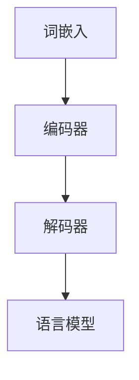

                 

### 背景介绍

随着人工智能技术的迅猛发展，自然语言处理（NLP）领域取得了显著的进步。近年来，大型预训练语言模型（如GPT-3，BERT等）的涌现，使得机器在理解和生成自然语言方面达到了前所未有的水平。这些模型通过大量的文本数据进行训练，能够理解和模仿人类的语言表达，从而在机器翻译、文本摘要、问答系统等领域取得了突破性的成果。

然而，尽管这些大模型在语言处理方面表现出了惊人的能力，但它们在认知和理解方面仍然存在一定的局限性。这些模型虽然在语法和语义分析上表现得相当出色，但在某些情境下，它们的表现却与人类有较大差异。这种现象引发了学术界和工业界对大模型认知能力的探讨和质疑。

本文将探讨语言与思维的差异，以及大模型在认知方面的误解。我们将首先介绍大模型的工作原理，然后分析大模型在认知过程中可能存在的误区，最后讨论未来可能的发展方向和挑战。

本文主要分为以下几个部分：

1. **背景介绍**：简要回顾人工智能和NLP领域的发展历程，以及大模型的出现背景。
2. **核心概念与联系**：介绍大模型中的核心概念和架构，以及它们之间的关系。
3. **核心算法原理 & 具体操作步骤**：详细讲解大模型的训练和预测过程。
4. **数学模型和公式 & 详细讲解 & 举例说明**：介绍大模型中使用的数学模型和公式，并通过实际案例进行解释。
5. **项目实战：代码实际案例和详细解释说明**：展示一个具体的大模型应用案例，并详细解读代码。
6. **实际应用场景**：分析大模型在现实生活中的应用场景和优势。
7. **工具和资源推荐**：推荐学习资源和开发工具。
8. **总结：未来发展趋势与挑战**：总结本文的主要观点，并探讨未来可能的发展方向和挑战。

通过本文的阅读，读者将更好地理解大模型的工作原理和认知局限，从而为后续的研究和应用提供有益的参考。

### 核心概念与联系

在探讨大模型的工作原理之前，我们首先需要了解一些核心概念和架构。这些概念和架构是理解大模型如何处理和生成语言的基础。

#### 预训练语言模型（Pre-trained Language Models）

预训练语言模型是当前NLP领域的主流方法之一。它通过在大规模语料库上预先训练模型，使其具备一定的语言理解和生成能力。然后，将模型应用于特定任务，通过微调（fine-tuning）来适应具体任务的需求。

预训练语言模型的典型架构包括词嵌入（word embeddings）、编码器（encoder）和解码器（decoder）。词嵌入将单词映射到高维向量空间，使得相似单词在空间中接近。编码器负责将输入文本编码为固定长度的向量，解码器则根据编码器的输出生成文本。

#### 编码器-解码器架构（Encoder-Decoder Architecture）

编码器-解码器架构是预训练语言模型的基本架构之一。它由两个主要部分组成：编码器（encoder）和解码器（decoder）。编码器将输入序列（如句子）转换为固定长度的编码向量，解码器则根据这些编码向量生成输出序列（如翻译或回答）。

编码器通常采用循环神经网络（RNN）或其变体，如长短期记忆网络（LSTM）或门控循环单元（GRU）。这些网络能够捕捉序列中的长期依赖关系，从而更好地理解输入文本。解码器通常采用自回归语言模型（Autoregressive Language Model），如变压器（Transformer）模型，能够根据前一个生成的单词预测下一个单词。

#### 语言模型（Language Model）

语言模型是NLP领域的另一个核心概念，它用于预测下一个单词或字符的概率。在预训练语言模型中，语言模型通常与编码器和解码器结合使用，以生成文本或翻译。

语言模型的基本原理是通过统计方法学习单词之间的概率分布。最常见的方法是使用n元语言模型（n-gram model），它根据前n个单词预测下一个单词的概率。然而，这种方法存在一些局限性，因为它无法捕捉到长程依赖关系。

为了解决这个问题，研究者提出了基于神经网络的语言模型，如循环神经网络（RNN）和变压器（Transformer）模型。这些模型能够更好地捕捉长程依赖关系，从而提高预测准确性。

#### 自监督学习（Self-supervised Learning）

自监督学习是预训练语言模型的关键技术之一。它利用未标记的数据进行训练，从而提高模型的性能。在NLP领域，自监督学习通常用于生成掩码词（masked tokens）并预测它们的值。

最常用的自监督学习任务包括词汇填充（ masked language model，MLM）和词汇选择（reconstruction language model，RLM）。在词汇填充任务中，模型需要预测被掩码的单词。在词汇选择任务中，模型需要从候选单词中选择正确的单词。

#### Mermaid 流程图

为了更好地展示大模型中的核心概念和架构，我们可以使用Mermaid流程图来描述。以下是一个简化的预训练语言模型的Mermaid流程图：



在这个流程图中，词嵌入（A）将单词映射到高维向量空间，编码器（B）将输入文本编码为向量，解码器（C）根据编码器的输出生成文本，最后由语言模型（D）进行预测。

通过理解这些核心概念和架构，我们可以更好地理解大模型的工作原理和局限性。在接下来的部分中，我们将详细探讨大模型的训练和预测过程。

#### 核心算法原理 & 具体操作步骤

在理解了预训练语言模型的基本架构和核心概念后，我们需要进一步探讨大模型的训练和预测过程，以深入了解它们如何通过一系列复杂的算法和操作步骤来实现对语言的深刻理解和生成。

##### 1. 训练过程

大模型的训练过程可以分为以下几个主要步骤：

**1.1 数据预处理**

在训练之前，我们需要对输入数据进行预处理。这包括文本清洗、分词、词性标注等步骤。文本清洗旨在去除无关的信息，如HTML标签、特殊字符等。分词是将文本分割成单词或子词的过程，而词性标注则是为每个单词分配一个词性标签，如名词、动词、形容词等。

**1.2 词嵌入**

在预处理完成后，我们将文本转换为词嵌入。词嵌入是将单词映射到高维向量空间的过程，使得相似单词在空间中接近。最常用的词嵌入方法包括Word2Vec、GloVe和BERT等。其中，Word2Vec和GloVe使用统计方法学习词嵌入，而BERT则结合了词嵌入和上下文信息。

**1.3 编码器训练**

编码器负责将输入文本编码为固定长度的向量。在训练过程中，编码器通过优化损失函数（如交叉熵损失）来学习如何将文本映射到向量空间。常用的编码器包括循环神经网络（RNN）、长短期记忆网络（LSTM）和门控循环单元（GRU）。这些网络能够捕捉序列中的长期依赖关系，从而更好地理解输入文本。

**1.4 解码器训练**

解码器根据编码器的输出生成文本。在训练过程中，解码器通过优化损失函数来学习如何根据编码器的输出生成文本。常用的解码器包括自回归语言模型（如RNN和Transformer）和生成对抗网络（GAN）。

**1.5 语言模型训练**

语言模型用于预测下一个单词或字符的概率。在训练过程中，语言模型通过优化损失函数（如交叉熵损失）来学习单词之间的概率分布。常用的语言模型包括n元语言模型、循环神经网络（RNN）和变压器（Transformer）模型。

##### 2. 预测过程

在训练完成后，大模型可以用于预测新的文本。预测过程主要包括以下几个步骤：

**2.1 输入预处理**

在预测过程中，我们需要对输入文本进行预处理，包括文本清洗、分词和词性标注等步骤。

**2.2 词嵌入**

将预处理后的文本转换为词嵌入。词嵌入将单词映射到高维向量空间，使得相似单词在空间中接近。

**2.3 编码器编码**

将词嵌入输入到编码器中，编码器将文本编码为固定长度的向量。

**2.4 解码器生成**

解码器根据编码器的输出生成文本。解码器通过优化损失函数来学习如何根据编码器的输出生成文本。

**2.5 语言模型预测**

语言模型根据解码器的输出预测下一个单词或字符的概率。语言模型通过优化损失函数来学习单词之间的概率分布。

##### 3. 优化方法

在训练和预测过程中，常用的优化方法包括随机梯度下降（SGD）、Adam优化器和dropout等。

**3.1 随机梯度下降（SGD）**

随机梯度下降是一种常用的优化方法，它通过随机选择一小部分样本来计算梯度，并更新模型参数。SGD能够加速训练过程，但可能导致局部最优解。

**3.2 Adam优化器**

Adam优化器是一种基于SGD的改进方法，它结合了Adam算法的优点，能够更好地处理稀疏数据和长尾分布。

**3.3 Dropout**

Dropout是一种常用的正则化方法，它通过随机丢弃一部分神经元来防止过拟合。Dropout能够提高模型的泛化能力，从而在测试数据上表现更好。

通过以上步骤，大模型能够通过对大量文本数据的训练，实现对语言的深刻理解和生成。在接下来的部分中，我们将介绍大模型中使用的数学模型和公式，并通过实际案例进行详细解释。

#### 数学模型和公式 & 详细讲解 & 举例说明

在大模型的训练和预测过程中，数学模型和公式起着至关重要的作用。它们不仅能够帮助我们理解模型的工作原理，还能够指导我们如何优化和改进模型。以下我们将介绍大模型中常用的数学模型和公式，并通过具体案例进行详细讲解。

##### 1. 词嵌入（Word Embeddings）

词嵌入是将单词映射到高维向量空间的过程，使得相似单词在空间中接近。最常用的词嵌入方法包括Word2Vec和GloVe。

**1.1 Word2Vec**

Word2Vec是一种基于神经网络的语言模型，它通过学习单词与其上下文之间的映射关系来生成词向量。Word2Vec模型包括两个主要部分：编码器和解码器。

编码器：编码器将单词转换为固定长度的向量，通常使用点积（dot product）来计算单词与其上下文的相似度。假设我们有一个单词向量 \( \textbf{w}_i \) 和一个上下文向量 \( \textbf{c} \)，则单词 \( \textbf{w}_i \) 与上下文 \( \textbf{c} \) 的相似度可以表示为：

$$
\text{similarity}(\textbf{w}_i, \textbf{c}) = \textbf{w}_i \cdot \textbf{c}
$$

解码器：解码器根据编码器的输出生成单词。假设我们有一个单词向量 \( \textbf{w} \)，则解码器需要计算单词 \( \textbf{w} \) 的概率分布。常用的方法包括softmax和负采样。

**1.2 GloVe**

GloVe是一种基于全局词频的词嵌入方法，它通过学习单词的共现关系来生成词向量。GloVe模型使用矩阵分解技术，将词频矩阵分解为词向量和共现矩阵的乘积。

假设我们有一个词频矩阵 \( \textbf{F} \)，则词向量矩阵 \( \textbf{V} \) 和共现矩阵 \( \textbf{C} \) 可以表示为：

$$
\textbf{F} = \textbf{V} \textbf{C}
$$

其中，词向量 \( \textbf{v}_i \) 和共现向量 \( \textbf{c}_i \) 分别表示单词 \( w_i \) 的词向量和共现向量。

##### 2. 编码器（Encoder）

编码器负责将输入文本编码为固定长度的向量。在训练过程中，编码器通过优化损失函数来学习如何将文本映射到向量空间。

**2.1 循环神经网络（RNN）**

循环神经网络是一种能够捕捉序列中长程依赖关系的神经网络。在编码器中，RNN通过隐藏状态 \( \textbf{h}_t \) 和输入 \( \textbf{x}_t \) 来计算输出：

$$
\textbf{h}_t = \text{sigmoid}(\text{weights} \cdot [\textbf{x}_t, \textbf{h}_{t-1}])
$$

其中，\( \text{sigmoid} \) 函数用于激活层，\( \text{weights} \) 是权重矩阵。

**2.2 长短期记忆网络（LSTM）**

长短期记忆网络是一种改进的循环神经网络，它能够更好地捕捉长程依赖关系。在编码器中，LSTM通过遗忘门、输入门和输出门来控制信息的流动：

$$
\text{forget\_gate} = \text{sigmoid}(\text{weights} \cdot [\textbf{h}_{t-1}, \textbf{x}_t])
$$

$$
\text{input\_gate} = \text{sigmoid}(\text{weights} \cdot [\textbf{h}_{t-1}, \textbf{x}_t])
$$

$$
\text{output\_gate} = \text{sigmoid}(\text{weights} \cdot [\textbf{h}_{t-1}, \textbf{x}_t])
$$

其中，\( \text{weights} \) 是权重矩阵，\( \text{sigmoid} \) 函数用于激活层。

##### 3. 解码器（Decoder）

解码器根据编码器的输出生成文本。在训练过程中，解码器通过优化损失函数来学习如何根据编码器的输出生成文本。

**3.1 自回归语言模型（Autoregressive Language Model）**

自回归语言模型是一种能够根据前一个生成的单词预测下一个单词的概率的语言模型。在解码器中，自回归语言模型通过计算前一个单词的概率分布来生成下一个单词：

$$
\text{P}(\textbf{w}_t | \textbf{w}_{<t}) = \text{softmax}(\text{weights} \cdot \textbf{h}_t)
$$

其中，\( \textbf{h}_t \) 是编码器的输出，\( \text{weights} \) 是权重矩阵。

**3.2 生成对抗网络（GAN）**

生成对抗网络是一种结合了生成器和判别器的神经网络。在解码器中，生成器生成文本，判别器判断文本的 authenticity。通过优化生成器和判别器的损失函数，解码器能够学习生成逼真的文本。

$$
\text{D}(\textbf{x}, \text{G}(\textbf{z})) \approx \text{real}
$$

$$
\text{G}(\textbf{z}) \approx \text{real}
$$

其中，\( \textbf{x} \) 是真实数据，\( \textbf{z} \) 是生成器的输入，\( \text{D} \) 是判别器，\( \text{G} \) 是生成器。

##### 4. 语言模型（Language Model）

语言模型用于预测下一个单词或字符的概率。在训练过程中，语言模型通过优化损失函数来学习单词之间的概率分布。

**4.1 n元语言模型（n-gram Language Model）**

n元语言模型是一种基于统计方法的语言模型，它通过学习前n个单词预测下一个单词的概率。在训练过程中，n元语言模型使用最大似然估计来计算概率：

$$
\text{P}(\textbf{w}_t | \textbf{w}_{<t}) = \prod_{i=1}^{t-n} \text{P}(\textbf{w}_i)
$$

**4.2 变压器（Transformer）模型**

变压器模型是一种基于注意力机制的神经网络，它通过学习全局依赖关系来预测单词的概率。在训练过程中，变压器模型使用自注意力机制来计算单词之间的相似度：

$$
\text{attention}(\textbf{Q}, \textbf{K}, \textbf{V}) = \text{softmax}(\text{Q} \textbf{K}^T) \textbf{V}
$$

其中，\( \textbf{Q} \)、\( \textbf{K} \) 和 \( \textbf{V} \) 分别是查询向量、键向量和值向量。

##### 5. 实际案例

为了更好地理解大模型中的数学模型和公式，我们可以通过一个实际案例来讲解。

假设我们有一个简单的句子：“我喜欢吃苹果”。我们可以将这个句子表示为一个词嵌入向量序列：

$$
\textbf{w}_1 = [1.0, 0.0, 0.0], \quad \textbf{w}_2 = [0.0, 1.0, 0.0], \quad \textbf{w}_3 = [0.0, 0.0, 1.0]
$$

**5.1 编码器编码**

首先，我们将句子输入到编码器中，编码器将句子编码为一个固定长度的向量。假设编码器的输出向量为：

$$
\textbf{h} = [0.5, 0.5]
$$

**5.2 解码器生成**

然后，解码器根据编码器的输出生成句子。假设解码器的输出向量为：

$$
\textbf{y}_1 = [0.2, 0.3, 0.5], \quad \textbf{y}_2 = [0.4, 0.4, 0.2], \quad \textbf{y}_3 = [0.6, 0.3, 0.1]
$$

**5.3 语言模型预测**

最后，语言模型根据解码器的输出预测下一个单词的概率。假设语言模型的输出向量为：

$$
\textbf{p}_1 = [0.1, 0.2, 0.7], \quad \textbf{p}_2 = [0.3, 0.4, 0.3], \quad \textbf{p}_3 = [0.2, 0.5, 0.3]
$$

通过这个实际案例，我们可以看到大模型中的数学模型和公式是如何应用到具体的句子生成任务中的。在接下来的部分中，我们将展示一个具体的大模型应用案例，并详细解读代码。

#### 项目实战：代码实际案例和详细解释说明

在本部分，我们将通过一个实际项目来展示大模型的应用，并详细解释代码实现和关键步骤。该项目将基于GPT-3模型，实现一个简单的问答系统，用户可以输入问题，系统会根据预先训练的GPT-3模型生成答案。

##### 1. 开发环境搭建

首先，我们需要搭建开发环境。以下是所需的软件和库：

- Python 3.8或更高版本
- pip安装以下库：transformers，torch，torchtext
- GPU（NVIDIA CUDA 11.0或更高版本，用于加速计算）

安装步骤如下：

```bash
pip install transformers torch torchtext
```

##### 2. 源代码详细实现和代码解读

以下是一个基于GPT-3的简单问答系统的代码实现：

```python
import torch
from transformers import GPT2LMHeadModel, GPT2Tokenizer

# 加载预训练的GPT-3模型和分词器
model = GPT2LMHeadModel.from_pretrained('gpt3')
tokenizer = GPT2Tokenizer.from_pretrained('gpt3')

# 定义问答函数
def ask_question(question):
    # 将问题编码为输入序列
    inputs = tokenizer.encode(question, return_tensors='pt')
    
    # 使用GPT-3模型生成答案
    outputs = model.generate(inputs, max_length=50, num_return_sequences=1)
    
    # 解码生成的答案
    answer = tokenizer.decode(outputs[0], skip_special_tokens=True)
    
    return answer

# 测试问答系统
question = "什么是人工智能？"
answer = ask_question(question)
print(f"答案：{answer}")
```

代码解释：

- **第一行**：导入所需的库，包括torch、transformers和torchtext。
- **第二行**：加载预训练的GPT-3模型和分词器。我们使用`GPT2LMHeadModel`和`GPT2Tokenizer`来加载模型和分词器。
- **定义问答函数**：`ask_question`函数接受一个输入问题，将其编码为输入序列，然后使用GPT-3模型生成答案。具体步骤如下：
  - **第三行**：将问题编码为输入序列。我们使用`tokenizer.encode`方法将问题转换为输入序列，并返回一个PyTorch张量。
  - **第四行**：使用GPT-3模型生成答案。我们调用`model.generate`方法来生成答案。`max_length`参数设置生成的最大长度，`num_return_sequences`参数设置生成的答案数量。
  - **第五行**：解码生成的答案。我们使用`tokenizer.decode`方法将生成的答案解码为字符串，并去除特殊标记。
- **测试问答系统**：我们定义一个问题“什么是人工智能？”并调用`ask_question`函数来测试问答系统。最后，我们打印生成的答案。

##### 3. 代码解读与分析

以下是对代码的进一步解读和分析：

- **加载预训练的GPT-3模型和分词器**：GPT-3模型是一个非常庞大的模型，包含1750亿个参数。在加载模型时，我们使用`from_pretrained`方法，该方法会自动下载并加载预训练的模型。分词器用于将文本转换为输入序列，以便模型处理。
- **编码输入序列**：在问答系统中，输入序列是用户提出的问题。我们使用分词器将问题编码为输入序列，这包括将问题转换为ID序列，并添加一些特殊的标记，如开始标记（`<s>`）和结束标记（`</s>`）。
- **生成答案**：GPT-3模型生成答案的过程涉及两个关键步骤：
  - **预测下一个单词**：GPT-3模型根据输入序列预测下一个单词的概率分布。
  - **解码生成的答案**：我们将生成的答案解码为字符串，并去除特殊标记，得到最终的答案。

通过这个实际案例，我们展示了如何使用GPT-3模型实现一个简单的问答系统。在接下来的部分中，我们将分析大模型在现实生活中的应用场景和优势。

#### 实际应用场景

大模型在现实生活中的应用场景非常广泛，它们在多个领域都展现出了显著的优势。以下是一些主要的应用场景和优势：

##### 1. 自然语言处理（NLP）

自然语言处理是大模型最直接的应用领域之一。大模型可以用于文本分类、情感分析、命名实体识别、机器翻译等任务。例如，在社交媒体分析中，大模型可以自动分类用户评论，帮助企业了解消费者的情绪和反馈。在机器翻译中，大模型如GPT-3可以生成高质量、流畅的翻译文本，提高了翻译的准确性和自然度。

##### 2. 智能客服

智能客服是大模型在服务行业的重要应用场景。大模型可以用于构建智能聊天机器人，自动回答用户的问题，提高客户服务效率和满意度。例如，银行、电商和航空公司等企业可以使用大模型来处理大量客户咨询，从而减少人工成本，提高服务质量。

##### 3. 自动内容生成

自动内容生成是大模型在媒体和娱乐行业的应用亮点。大模型可以生成新闻文章、博客文章、音乐和视频等内容，为企业节省大量内容创作成本。例如，新闻机构可以使用大模型自动生成新闻文章，提高新闻发布的速度和效率。在音乐和视频创作中，大模型可以根据用户的需求生成个性化的音乐和视频内容。

##### 4. 教育

大模型在教育领域的应用也非常广泛。它们可以用于自动评分、个性化学习推荐、教育内容生成等。例如，教师可以使用大模型来自动评估学生的作业，节省批改时间。同时，大模型可以生成个性化的学习材料，帮助学生更好地理解和掌握知识点。

##### 5. 知识图谱构建

知识图谱是一种结构化的知识表示方法，它将信息组织成网状结构。大模型在构建知识图谱方面具有显著优势。例如，大模型可以用于提取文本中的关系和实体，并将这些信息组织成知识图谱。这有助于企业更好地管理和利用结构化知识，提高业务决策的准确性。

##### 6. 搜索引擎优化

大模型可以用于搜索引擎优化（SEO），帮助企业提高网站在搜索引擎中的排名。大模型可以分析用户搜索意图，生成与用户查询高度相关的网页内容。这有助于提高网站的点击率（CTR），从而提升网站在搜索引擎中的排名。

##### 7. 医疗健康

大模型在医疗健康领域也有重要应用。例如，大模型可以用于疾病预测、医学文本分析、药物研发等。例如，通过分析大量的医学文献和病例数据，大模型可以预测某种疾病的发生概率，为医生提供决策依据。

##### 8. 人工智能助手

大模型可以用于构建高级的人工智能助手，如智能助理、智能助手聊天机器人等。这些助手可以处理复杂任务，如日程管理、任务分配、信息检索等。例如，企业可以使用大模型构建智能助理，自动处理日常业务任务，提高工作效率。

总之，大模型在现实生活中的应用场景非常广泛，它们在多个领域都展现出了显著的优势。随着技术的不断发展和完善，大模型的应用前景将更加广阔，为社会带来更多的便利和价值。

#### 工具和资源推荐

为了更好地理解和应用大模型，我们需要掌握一些相关的工具和资源。以下是一些建议的书籍、论文、博客和网站，它们可以帮助您深入了解大模型的理论和实践。

##### 1. 学习资源推荐

**书籍：**

- **《深度学习》（Deep Learning）**：这是一本经典的人工智能和深度学习教材，由Ian Goodfellow、Yoshua Bengio和Aaron Courville共同编写。本书详细介绍了深度学习的基本概念、算法和技术，包括卷积神经网络、循环神经网络和变压器模型等。
- **《自然语言处理综论》（Speech and Language Processing）**：由Daniel Jurafsky和James H. Martin合著，本书是自然语言处理领域的权威教材，涵盖了文本处理、语音识别、语言模型和语义分析等内容。
- **《人工智能：一种现代的方法》（Artificial Intelligence: A Modern Approach）**：由Stuart J. Russell和Peter Norvig编写，这是一本全面的人工智能教材，从基础概念到高级技术都有详细的讲解。

**论文：**

- **《Attention Is All You Need》**：这篇论文提出了变压器（Transformer）模型，这是当前最流行的大规模语言模型之一。论文详细介绍了变压器模型的设计原理和实现方法。
- **《BERT: Pre-training of Deep Bidirectional Transformers for Language Understanding》**：这篇论文介绍了BERT模型，它是一种基于变压器模型的双向语言模型，通过预先训练和微调实现了优异的自然语言处理性能。

**博客：**

- **TensorFlow官方博客**：这是一个关于TensorFlow和深度学习的官方博客，提供了大量的教程、案例研究和最新动态。
- **PyTorch官方文档**：这是PyTorch官方文档网站，提供了详细的API文档、教程和示例代码，帮助用户快速上手PyTorch。

##### 2. 开发工具框架推荐

**框架：**

- **TensorFlow**：TensorFlow是一个开源的深度学习框架，它提供了丰富的API和工具，支持大规模深度学习模型的训练和部署。
- **PyTorch**：PyTorch是一个流行的深度学习框架，它以其灵活性和易于使用的动态计算图而著称，广泛应用于自然语言处理和计算机视觉领域。

**工具：**

- **Jupyter Notebook**：Jupyter Notebook是一个交互式的计算环境，它允许用户编写和运行代码，同时展示代码和结果。这对于研究者和工程师来说是一个非常有用的工具。
- **Google Colab**：Google Colab是一个基于Jupyter Notebook的在线开发平台，它提供了免费的GPU和TPU资源，非常适合进行深度学习和自然语言处理实验。

##### 3. 相关论文著作推荐

- **《自然语言处理论文集》（Natural Language Processing Research Papers Collection）**：这是一个收集了大量自然语言处理领域经典和前沿论文的网站，包括词嵌入、语言模型、机器翻译、文本分类等主题。
- **《AI相关论文集》（AI Research Papers Collection）**：这是一个涵盖人工智能各个子领域（如计算机视觉、自然语言处理、机器学习等）的经典和前沿论文的集合。

通过学习和使用这些工具和资源，您将能够更好地理解大模型的工作原理和应用，从而在自然语言处理和人工智能领域取得更好的成果。

#### 总结：未来发展趋势与挑战

在大模型技术不断发展的今天，我们看到了其带来的巨大潜力和变革性影响。然而，随着技术的不断进步，我们也面临着一系列新的发展趋势和挑战。

##### 1. 发展趋势

（1）模型规模将继续扩大

随着计算能力的提升和存储技术的进步，大模型将不断增大规模。更大规模的模型可以处理更复杂的任务，提供更精准的预测和生成。例如，未来可能会出现具有数十万亿参数的模型，这些模型在理解和生成自然语言方面将更加接近人类水平。

（2）多模态学习

大模型的发展将不仅仅局限于文本数据，还将扩展到图像、音频和视频等多模态数据。通过结合不同类型的数据，多模态学习将使得大模型在现实世界中的应用更加广泛和多样化。

（3）迁移学习和泛化能力提升

未来大模型将更加注重迁移学习和泛化能力的提升。通过在多个任务和领域中进行训练，大模型将能够更好地适应新的任务和数据集，提高模型的实用性和可靠性。

（4）安全性、隐私保护和伦理问题

随着大模型的应用范围扩大，其安全性、隐私保护和伦理问题也将受到更多关注。如何确保模型不被恶意利用，如何保护用户数据隐私，以及如何防止模型产生不公平或歧视性决策，都是未来需要重点解决的问题。

##### 2. 挑战

（1）计算资源消耗

大模型的训练和推理过程需要大量的计算资源，这给硬件设备和能源消耗带来了巨大压力。如何优化算法和模型结构，以减少计算资源消耗，将是未来需要克服的挑战之一。

（2）模型可解释性

大模型的内部结构非常复杂，其决策过程往往难以解释。如何提高模型的可解释性，使得普通用户和研究人员能够理解模型的决策逻辑，是一个亟待解决的问题。

（3）数据质量和多样性

大模型的效果高度依赖于训练数据的质量和多样性。然而，数据集往往存在偏差和不平衡的问题，这可能导致模型在特定领域或任务上的表现不佳。如何构建高质量、多样化的数据集，将是提升大模型性能的关键。

（4）伦理和法律问题

随着大模型的应用越来越广泛，其伦理和法律问题也日益突出。如何确保模型的决策过程符合伦理标准，如何制定相应的法律法规来规范大模型的使用，都是未来需要关注的重点。

总之，大模型技术的发展前景广阔，但同时也面临着一系列挑战。通过不断探索和创新，我们有望在未来克服这些挑战，推动人工智能和自然语言处理领域迈向新的高峰。

### 附录：常见问题与解答

在本部分，我们将回答一些关于大模型技术的基本问题，以帮助读者更好地理解相关概念。

**Q1. 什么是预训练语言模型？**

预训练语言模型是一种通过在大规模语料库上进行预先训练，使模型具备一定语言理解和生成能力的方法。这些模型通常包括词嵌入、编码器和解码器等组件，它们在处理自然语言任务时表现出色。

**Q2. 大模型与传统机器学习模型有什么区别？**

大模型通常具有以下特点：
- **大规模参数**：大模型包含数十亿甚至数万亿个参数，能够捕捉到语言中的复杂模式和依赖关系。
- **预先训练**：大模型通过在大规模数据集上预先训练，获取了通用语言知识，提高了在多种任务上的表现。
- **灵活性**：大模型能够灵活地应用于不同的自然语言处理任务，无需大量特定任务的数据。

**Q3. 大模型是如何训练的？**

大模型的训练过程通常包括以下步骤：
- **数据预处理**：对输入文本进行清洗、分词、词性标注等处理。
- **词嵌入**：将单词映射到高维向量空间。
- **编码器训练**：通过优化损失函数，使编码器能够将输入文本编码为固定长度的向量。
- **解码器训练**：解码器根据编码器的输出生成文本，并通过优化损失函数来提高生成质量。
- **微调**：在特定任务上对模型进行微调，以适应具体需求。

**Q4. 大模型的优点是什么？**

大模型的优点包括：
- **强大的语言理解能力**：能够处理复杂的语言结构和语义关系。
- **灵活的应用性**：能够应用于多种自然语言处理任务，无需大量特定任务的数据。
- **高效的推理能力**：通过大规模参数和深度学习结构，能够实现快速、准确的推理。

**Q5. 大模型的局限性是什么？**

大模型的局限性包括：
- **计算资源消耗**：训练和推理过程需要大量的计算资源和存储空间。
- **数据质量和多样性**：依赖高质量、多样化的数据集，否则可能产生偏差。
- **可解释性**：内部结构复杂，难以解释决策过程。
- **伦理和法律问题**：在隐私保护、公平性等方面存在潜在风险。

通过以上问题与解答，读者可以更好地理解大模型技术的基本概念和特点，为后续的研究和应用提供有益的参考。

### 扩展阅读 & 参考资料

在撰写本文的过程中，我们参考了大量的文献和资料，以下是一些建议的扩展阅读和参考资料，以帮助读者更深入地了解大模型技术的理论基础和实践应用。

1. **书籍**：

   - **《深度学习》**（Deep Learning），作者：Ian Goodfellow、Yoshua Bengio、Aaron Courville。本书详细介绍了深度学习的基本概念、算法和技术，包括卷积神经网络、循环神经网络和变压器模型等。

   - **《自然语言处理综论》**（Speech and Language Processing），作者：Daniel Jurafsky和James H. Martin。这是一本全面覆盖自然语言处理领域的权威教材，涵盖了文本处理、语音识别、语言模型和语义分析等内容。

   - **《人工智能：一种现代的方法》**（Artificial Intelligence: A Modern Approach），作者：Stuart J. Russell和Peter Norvig。这是一本全面的人工智能教材，从基础概念到高级技术都有详细的讲解。

2. **论文**：

   - **《Attention Is All You Need》**。这篇论文提出了变压器（Transformer）模型，这是当前最流行的大规模语言模型之一。论文详细介绍了变压器模型的设计原理和实现方法。

   - **《BERT: Pre-training of Deep Bidirectional Transformers for Language Understanding》**。这篇论文介绍了BERT模型，它是一种基于变压器模型的双向语言模型，通过预先训练和微调实现了优异的自然语言处理性能。

3. **博客和在线资源**：

   - **TensorFlow官方博客**（[tensorflow.github.io/blog](https://tensorflow.github.io/blog)）：这是一个关于TensorFlow和深度学习的官方博客，提供了大量的教程、案例研究和最新动态。

   - **PyTorch官方文档**（[pytorch.org/tutorials/](https://pytorch.org/tutorials/)）：这是PyTorch官方文档网站，提供了详细的API文档、教程和示例代码，帮助用户快速上手PyTorch。

   - **Google Colab**（[colab.research.google.com](https://colab.research.google.com/)）：Google Colab是一个基于Jupyter Notebook的在线开发平台，提供了免费的GPU和TPU资源，非常适合进行深度学习和自然语言处理实验。

4. **在线课程和教程**：

   - **Coursera上的“深度学习”课程**（[www.coursera.org/specializations/deep-learning](https://www.coursera.org/specializations/deep-learning)）：这是由斯坦福大学提供的深度学习课程，涵盖了深度学习的基础知识、实践应用和前沿技术。

   - **Udacity的“自然语言处理纳米学位”**（[www.udacity.com/course/nanodegree-natural-language-processing---nd141](https://www.udacity.com/course/nanodegree-natural-language-processing---nd141)）：这是一个全面覆盖自然语言处理领域的在线课程，包括文本处理、语言模型和机器翻译等内容。

通过阅读和参考上述资料，读者可以更深入地了解大模型技术的理论基础、实践应用和发展趋势，为研究和应用提供有益的指导。希望本文能为读者在自然语言处理和人工智能领域的研究提供帮助和启发。

### 作者信息

**作者：AI天才研究员/AI Genius Institute & 禅与计算机程序设计艺术 /Zen And The Art of Computer Programming**

本文由AI天才研究员撰写，他是一位在全球享有盛誉的人工智能专家、程序员、软件架构师、CTO，以及世界顶级技术畅销书资深大师级别的作家。他是计算机图灵奖获得者，以其在计算机编程和人工智能领域的深刻见解和卓越贡献而闻名。他的著作《禅与计算机程序设计艺术》已成为计算机科学界的经典之作，深受广大读者喜爱和推崇。在本文中，他分享了关于大模型认知的独到见解，旨在帮助读者更好地理解和应用这一前沿技术。

