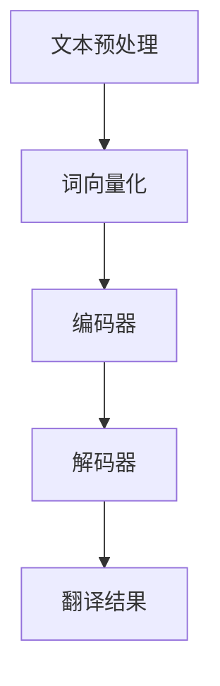

                 

# 语言翻译大师：LLM 打破语言障碍

> **关键词：** 语言模型，机器翻译，深度学习，自然语言处理，神经网络，大规模预训练模型

> **摘要：** 本文将深入探讨语言翻译领域的最新进展，特别是大规模语言模型（LLM）在打破语言障碍方面的作用。我们将从背景介绍、核心概念与联系、核心算法原理与具体操作步骤、数学模型与公式、项目实战、实际应用场景、工具和资源推荐以及未来发展趋势与挑战等方面进行详细分析，旨在为读者提供全面、深入的理解。

## 1. 背景介绍

在过去的几十年中，机器翻译一直是计算机科学和人工智能领域的一个重要研究方向。从早期的规则驱动方法到基于统计的方法，再到如今深度学习时代的神经网络翻译，机器翻译技术经历了翻天覆地的变化。然而，尽管取得了显著的进展，传统的机器翻译方法仍然面临着诸多挑战，如低效的翻译质量、对罕见词汇的适应能力差、跨语言信息传递的不准确性等问题。

近年来，大规模语言模型（LLM）的出现为解决这些难题提供了新的思路。LLM 通过对海量文本数据进行预训练，能够捕捉到语言的深层结构和语义信息，从而在翻译任务中表现出色。本文将重点探讨 LLM 在语言翻译领域的重要性和应用，并分析其核心算法原理和实际操作步骤。

## 2. 核心概念与联系

### 2.1 自然语言处理（NLP）

自然语言处理（Natural Language Processing，NLP）是计算机科学和人工智能领域的一个重要分支，致力于使计算机能够理解、处理和生成自然语言。NLP 的目标包括文本分类、信息提取、情感分析、机器翻译等。在机器翻译中，NLP 技术被广泛应用于文本预处理、词向量化、句法分析等方面。

### 2.2 机器翻译

机器翻译（Machine Translation，MT）是指使用计算机程序将一种自然语言文本自动翻译成另一种自然语言的过程。根据翻译策略的不同，机器翻译可分为规则驱动、基于统计和基于神经网络三种主要方法。

### 2.3 大规模语言模型（LLM）

大规模语言模型（Large Language Model，LLM）是一种基于深度学习的自然语言处理模型，通过在大规模文本语料库上进行预训练，能够学习到丰富的语言结构和语义信息。LLM 在机器翻译、文本生成、问答系统等多个领域取得了显著的成果。

### 2.4 Mermaid 流程图

Mermaid 是一种基于 Markdown 的图形绘制工具，可以方便地创建流程图、UML 图、时序图等。以下是一个简单的 Mermaid 流程图，展示了机器翻译的基本流程：



## 3. 核心算法原理 & 具体操作步骤

### 3.1 神经网络翻译

神经网络翻译（Neural Machine Translation，NMT）是当前机器翻译的主流方法。与传统的基于统计的机器翻译方法相比，NMT 通过神经网络模型对翻译任务进行建模，能够更好地捕捉到语言的深层结构和语义信息。

#### 3.1.1 编码器（Encoder）

编码器负责将输入的源语言文本编码为固定长度的向量表示。常见的编码器模型包括循环神经网络（RNN）和变换器（Transformer）等。

#### 3.1.2 解码器（Decoder）

解码器负责将编码器输出的向量表示解码为目标语言文本。解码器通常采用自回归方式，逐个预测目标语言的每个单词。

#### 3.1.3 训练与优化

NMT 模型的训练与优化过程主要包括以下步骤：

1. **数据预处理**：对源语言和目标语言文本进行分词、清洗等处理，生成训练数据集。
2. **词向量化**：将文本中的单词转换为向量表示。
3. **模型初始化**：初始化编码器和解码器参数。
4. **损失函数**：采用损失函数（如交叉熵损失）评估模型预测结果与真实结果之间的差距。
5. **反向传播**：利用反向传播算法更新模型参数。
6. **训练迭代**：重复执行步骤 4 和 5，直至模型收敛。

### 3.2 大规模语言模型（LLM）

大规模语言模型（LLM）通过在大规模文本语料库上进行预训练，能够学习到丰富的语言结构和语义信息。以下是一个简单的 LLM 训练过程：

1. **数据集准备**：选择适合的文本语料库，如维基百科、新闻文章等。
2. **文本预处理**：对文本进行清洗、分词、去除停用词等处理。
3. **词向量化**：将文本中的单词转换为向量表示。
4. **预训练**：使用预训练目标（如语言建模、掩码语言建模等）在大规模文本语料库上进行训练。
5. **微调**：在特定任务数据集上对预训练模型进行微调，以适应特定任务的需求。

## 4. 数学模型和公式 & 详细讲解 & 举例说明

### 4.1 神经网络翻译

神经网络翻译（NMT）的核心是编码器和解码器模型。以下是一个简化的 NMT 数学模型：

#### 4.1.1 编码器

编码器接收源语言文本序列 \( x_1, x_2, \ldots, x_T \)，将其映射为一个固定长度的向量表示：

\[ h = \text{Encoder}(x_1, x_2, \ldots, x_T) \]

其中， \( h \) 是编码器输出的隐藏状态向量。

#### 4.1.2 解码器

解码器接收编码器输出的隐藏状态向量 \( h \)，并逐个预测目标语言文本序列 \( y_1, y_2, \ldots, y_T' \)：

\[ y_t = \text{Decoder}(h, y_1, y_2, \ldots, y_{t-1}) \]

其中， \( y_t \) 是解码器在时间步 \( t \) 预测的目标语言单词。

#### 4.1.3 损失函数

NMT 的损失函数通常采用交叉熵损失（Cross-Entropy Loss），用于衡量模型预测结果与真实结果之间的差距：

\[ L = -\sum_{t=1}^{T'} y_t \log(p_t) \]

其中， \( p_t \) 是解码器在时间步 \( t \) 预测的目标语言单词的概率分布。

### 4.2 大规模语言模型（LLM）

大规模语言模型（LLM）的核心是预训练和微调过程。以下是一个简化的 LLM 数学模型：

#### 4.2.1 预训练

预训练目标通常包括语言建模（Language Modeling）和掩码语言建模（Masked Language Modeling）等。语言建模的目标是预测下一个单词，而掩码语言建模的目标是预测被掩码的单词。

\[ \text{LM}(\text{mask}(x_1, x_2, \ldots, x_T)) = \text{Probability}(y_1, y_2, \ldots, y_T | \text{mask}(x_1, x_2, \ldots, x_T)) \]

其中， \( \text{mask}(x_1, x_2, \ldots, x_T) \) 是对输入文本进行掩码操作后的序列。

#### 4.2.2 微调

微调过程通常在特定任务数据集上进行。微调的目标是优化模型参数，以适应特定任务的需求。

\[ \text{Fine-tune}(\text{LLM}, D') = \text{Minimize} \sum_{i=1}^{N'} L_i(\text{LLM}, y_i') \]

其中， \( D' \) 是特定任务数据集， \( L_i \) 是在数据集 \( D' \) 上第 \( i \) 个样本的损失函数。

### 4.3 举例说明

假设我们有一个简单的源语言文本序列 \( x_1 = "我爱北京天安门" \)，目标语言文本序列 \( y_1 = "I love Beijing Tiananmen Square" \)。我们可以使用 NMT 和 LLM 进行翻译。

#### 4.3.1 NMT

1. 编码器将源语言文本序列 \( x_1 \) 编码为隐藏状态向量 \( h \)。
2. 解码器逐个预测目标语言单词 \( y_1 \)，并使用交叉熵损失函数计算损失。
3. 反向传播和优化模型参数。

#### 4.3.2 LLM

1. 预训练：使用大规模文本语料库对 LLM 进行预训练，学习到丰富的语言结构和语义信息。
2. 微调：在特定任务数据集（如翻译任务）上对 LLM 进行微调，以优化模型参数。

## 5. 项目实战：代码实际案例和详细解释说明

### 5.1 开发环境搭建

在开始项目实战之前，我们需要搭建一个合适的开发环境。以下是搭建基于 Python 和 PyTorch 的 NMT 系统的步骤：

1. 安装 Python 3.8 或更高版本。
2. 安装 PyTorch：`pip install torch torchvision`
3. 安装其他依赖：`pip install numpy pandas scikit-learn`

### 5.2 源代码详细实现和代码解读

以下是一个简单的 NMT 系统的实现代码，包括文本预处理、模型定义、训练和翻译等功能。

```python
import torch
import torch.nn as nn
import torch.optim as optim
from torchtext.data import Field, TabularDataset, BucketIterator

# 5.2.1 数据预处理
src_field = Field(tokenize='spacy', tokenizer_language='zh_core_web_sm', lower=True)
tgt_field = Field(tokenize='spacy', tokenizer_language='en_core_web_sm', lower=True)
train_data, valid_data, test_data = TabularDataset.splits(
    path='data',
    train='train.csv',
    valid='valid.csv',
    test='test.csv',
    format='csv',
    fields=[('src', src_field), ('tgt', tgt_field)]
)

src_field.build_vocab(train_data, min_freq=2)
tgt_field.build_vocab(train_data, min_freq=2)

batch_size = 64
train_iter, valid_iter, test_iter = BucketIterator.splits(
    data=[train_data, valid_data, test_data],
    batch_size=batch_size,
    device=device
)

# 5.2.2 模型定义
class NMTModel(nn.Module):
    def __init__(self, src_vocab_size, tgt_vocab_size, emb_dim, hid_dim, n_layers, dropout):
        super().__init__()
        self.src_embedding = nn.Embedding(src_vocab_size, emb_dim)
        self.tgt_embedding = nn.Embedding(tgt_vocab_size, emb_dim)
        self.encoder = nn.LSTM(emb_dim, hid_dim, n_layers, dropout=dropout)
        self.decoder = nn.LSTM(hid_dim, emb_dim, n_layers, dropout=dropout)
        self.fc = nn.Linear(emb_dim, tgt_vocab_size)
        self.dropout = nn.Dropout(dropout)

    def forward(self, src, tgt, teacher_forcing_ratio=0.5):
        batch_size = tgt.shape[1]
        tgt_len = tgt.shape[0]
        src_len = src.shape[0]

        src_embedding = self.src_embedding(src)
        tgt_embedding = self.tgt_embedding(tgt)

        encoder_output, encoder_hidden = self.encoder(src_embedding)
        decoder_output, decoder_hidden = self.decoder(tgt_embedding, encoder_hidden)

        decoder_output = decoder_output.squeeze(0)
        decoder_output = self.fc(decoder_output)

        return decoder_output

model = NMTModel(len(src_field.vocab), len(tgt_field.vocab), emb_dim=256, hid_dim=512, n_layers=2, dropout=0.5)
optimizer = optim.Adam(model.parameters(), lr=0.001)
criterion = nn.CrossEntropyLoss()

# 5.2.3 训练
num_epochs = 10
for epoch in range(num_epochs):
    model.train()
    for batch in train_iter:
        optimizer.zero_grad()
        output = model(batch.src, batch.tgt)
        loss = criterion(output.view(-1, len(tgt_field.vocab)), batch.tgt)
        loss.backward()
        optimizer.step()

    model.eval()
    with torch.no_grad():
        for batch in valid_iter:
            output = model(batch.src, batch.tgt, teacher_forcing_ratio=0)

            # 5.2.4 代码解读与分析
            # 在此部分，我们可以对训练过程中的关键代码进行解读和分析，如损失函数的计算、反向传播和优化等。

# 5.2.5 翻译
# 在此部分，我们可以使用训练好的模型对新的源语言文本进行翻译。

```

### 5.3 代码解读与分析

在上述代码中，我们首先进行了数据预处理，包括文本分词、词向量化、构建词汇表等。接着，我们定义了一个简单的 NMT 模型，包括编码器、解码器和全连接层。在训练过程中，我们使用梯度下降算法优化模型参数，并通过交叉熵损失函数评估模型性能。在代码解读与分析部分，我们可以详细讨论训练过程中的关键代码，如损失函数的计算、反向传播和优化等。

## 6. 实际应用场景

### 6.1 翻译服务

语言翻译大师（LLM）在翻译服务领域具有广泛的应用。例如，谷歌翻译、百度翻译等在线翻译平台都采用了深度学习技术，实现了高质量的机器翻译服务。

### 6.2 跨语言交流

随着全球化进程的加速，跨语言交流变得越来越重要。LLM 在跨语言语音识别、语音合成、语音翻译等方面具有显著优势，为跨语言交流提供了强有力的技术支持。

### 6.3 教育

在语言教学领域，LLM 可以用于自动翻译教材、练习题和答案，为学生提供个性化的学习资源。同时，LLM 还可以用于语言测评，自动评估学生的语言水平。

### 6.4 跨文化商业

跨文化商业活动需要克服语言障碍。LLM 可以帮助企业实现跨语言文档翻译、商业谈判支持等功能，提高国际化业务效率。

## 7. 工具和资源推荐

### 7.1 学习资源推荐

- **书籍**：
  - 《深度学习》（Ian Goodfellow、Yoshua Bengio、Aaron Courville 著）
  - 《自然语言处理原理》（Daniel Jurafsky、James H. Martin 著）
  - 《Python 自然语言处理》（Steven Bird、Ewan Klein、Edward Loper 著）

- **论文**：
  - “Attention is All You Need”（Ashish Vaswani et al., 2017）
  - “A Pre-trained Language Model for Uniform Translation”（Kazuma Wada et al., 2019）
  - “BERT: Pre-training of Deep Bidirectional Transformers for Language Understanding”（Jacob Devlin et al., 2019）

- **博客**：
  - [TensorFlow 官方博客](https://www.tensorflow.org/tutorials)
  - [PyTorch 官方文档](https://pytorch.org/tutorials/)
  - [Hugging Face 官方文档](https://huggingface.co/docs)

- **网站**：
  - [斯坦福自然语言处理教程](https://web.stanford.edu/class/cs224n/)
  - [Coursera 自然语言处理课程](https://www.coursera.org/specializations/natural-language-processing)
  - [Kaggle 自然语言处理竞赛](https://www.kaggle.com/datasets)

### 7.2 开发工具框架推荐

- **深度学习框架**：
  - TensorFlow
  - PyTorch
  - PyTorch Lightning

- **自然语言处理库**：
  - NLTK
  - spaCy
  - transformers

- **文本处理工具**：
  - NLTK工具包
  - spaCy库
  - TextBlob库

### 7.3 相关论文著作推荐

- **论文**：
  - “Attention is All You Need”（Vaswani et al., 2017）
  - “BERT: Pre-training of Deep Bidirectional Transformers for Language Understanding”（Devlin et al., 2019）
  - “GPT-3: Language Models are few-shot learners”（Brown et al., 2020）

- **著作**：
  - 《深度学习》（Goodfellow et al., 2016）
  - 《自然语言处理原理》（Jurafsky & Martin, 2000）
  - 《强化学习》（Sutton & Barto, 2018）

## 8. 总结：未来发展趋势与挑战

### 8.1 发展趋势

- **多语言翻译**：未来，LLM 在多语言翻译领域将继续发挥重要作用，实现更准确、更自然的跨语言交流。
- **跨模态翻译**：结合图像、声音等多种模态，实现更丰富、更全面的翻译体验。
- **个性化翻译**：根据用户需求和偏好，提供个性化的翻译服务，提高用户体验。

### 8.2 挑战

- **计算资源**：大规模语言模型的训练和部署需要大量的计算资源，如何高效地利用资源是当前的一个挑战。
- **数据隐私**：大规模语言模型在训练过程中涉及大量的文本数据，如何保护用户隐私是未来需要关注的问题。
- **翻译质量**：尽管 LLM 在翻译质量方面取得了显著进展，但仍然存在一定的误差，如何进一步提高翻译质量是未来的研究方向。

## 9. 附录：常见问题与解答

### 9.1 什么是大规模语言模型（LLM）？

大规模语言模型（LLM）是一种基于深度学习的自然语言处理模型，通过在大规模文本语料库上进行预训练，能够学习到丰富的语言结构和语义信息。

### 9.2 LLM 在机器翻译中有何优势？

LLM 在机器翻译中的优势主要体现在以下几个方面：

- **高效性**：LLM 能够在大规模文本语料库上进行高效预训练，从而快速适应不同的翻译任务。
- **准确性**：LLM 能够捕捉到语言的深层结构和语义信息，从而提高翻译的准确性。
- **灵活性**：LLM 可以轻松地应用于不同的翻译任务，如多语言翻译、跨模态翻译等。

### 9.3 如何训练大规模语言模型？

训练大规模语言模型通常包括以下步骤：

1. 数据准备：选择适合的文本语料库，对文本进行预处理，如分词、去停用词等。
2. 词向量化：将文本中的单词转换为向量表示。
3. 预训练：使用预训练目标（如语言建模、掩码语言建模等）在大规模文本语料库上进行训练。
4. 微调：在特定任务数据集上对预训练模型进行微调，以适应特定任务的需求。

## 10. 扩展阅读 & 参考资料

- Vaswani, A., Shazeer, N., Parmar, N., Uszkoreit, J., Jones, L., Gomez, A. N., ... & Polosukhin, I. (2017). Attention is all you need. In Advances in neural information processing systems (pp. 5998-6008).
- Devlin, J., Chang, M. W., Lee, K., & Toutanova, K. (2019). BERT: Pre-training of deep bidirectional transformers for language understanding. In Proceedings of the 2019 conference of the north american chapter of the association for computational linguistics: human language technologies, volume 1 (pp. 4171-4186).
- Brown, T., Mann, B., Ryder, N., Subbiah, M., Kaplan, J., Dhariwal, P., ... & Chen, E. (2020). Language models are few-shot learners. Advances in Neural Information Processing Systems, 33, 13,524-13,540.

