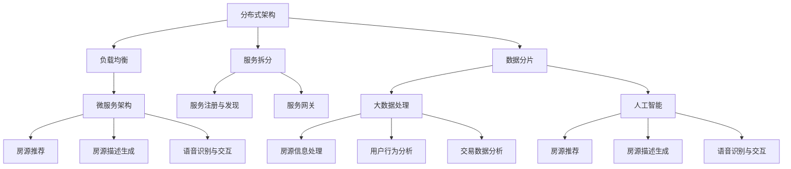

                 

### 文章标题与摘要

**标题：贝壳找房2025房产交易系统架构师社招面试攻略**

**关键词：贝壳找房，房产交易系统，架构师，社招面试，技术深度**

**摘要：本文旨在为有意向参与贝壳找房2025房产交易系统架构师社招面试的候选人提供一份详细的面试攻略。文章从贝壳找房的企业背景、房产交易系统的核心架构、面试流程、技术面试准备、案例分析等多个方面进行阐述，旨在帮助候选人充分准备，顺利通过面试。**

贝壳找房作为国内领先的房产服务平台，其房产交易系统在技术上有着极高的要求。本文将围绕贝壳找房2025房产交易系统的架构设计、技术难点、面试技巧等方面，为读者提供一份详细的面试攻略。

本文分为以下十个部分：

1. 背景介绍
2. 核心概念与联系
3. 核心算法原理 & 具体操作步骤
4. 数学模型和公式 & 详细讲解 & 举例说明
5. 项目实战：代码实际案例和详细解释说明
6. 实际应用场景
7. 工具和资源推荐
8. 总结：未来发展趋势与挑战
9. 附录：常见问题与解答
10. 扩展阅读 & 参考资料

通过对以上各部分的详细阐述，本文希望为贝壳找房2025房产交易系统架构师社招面试的候选人提供全面的指导，助力候选人顺利通过面试，进入贝壳找房这个优秀的团队。

## 1. 背景介绍

贝壳找房（Beike），成立于2015年，是链家集团旗下的房产服务平台，致力于为用户提供全方位的房产服务。贝壳找房以“真房源、真服务、真满意”为核心理念，通过大数据、人工智能等技术手段，为用户打造了一个透明、高效的房产交易环境。

贝壳找房的房产交易系统是一个高度复杂、大规模的系统，涵盖了房源信息管理、用户认证、交易流程、支付结算、评价反馈等多个模块。该系统需要具备高并发、高可用、高可靠的特点，以应对海量用户的实时操作。贝壳找房在房产交易系统上的持续投入和创新，使其在国内房产交易领域处于领先地位。

贝壳找房的房产交易系统在技术上具有以下特点：

1. **分布式架构**：贝壳找房的房产交易系统采用分布式架构，通过负载均衡、服务拆分、数据分片等技术，实现系统的横向扩展和高可用性。
2. **微服务架构**：系统采用微服务架构，将不同的业务功能拆分为独立的微服务，便于系统的维护和扩展。
3. **大数据处理**：贝壳找房利用大数据技术对海量房源信息进行处理和分析，为用户推荐最合适的房源，提升交易效率。
4. **人工智能**：贝壳找房在房产交易系统中引入了人工智能技术，如机器学习、自然语言处理等，为用户提供更智能的服务体验。

贝壳找房在房产交易系统上的创新和投入，使其在国内房产交易领域处于领先地位。贝壳找房2025房产交易系统的架构师社招面试，吸引了大量优秀的技术人才。因此，了解贝壳找房的企业背景、房产交易系统的核心架构，以及面试流程，对于候选人来说至关重要。

### 2. 核心概念与联系

为了更好地理解贝壳找房2025房产交易系统的架构，我们需要先了解一些核心概念和它们之间的关系。以下是一些重要的概念及其简要说明：

#### 分布式架构

分布式架构是一种将系统划分为多个独立节点，通过网络进行通信和协同工作的架构。分布式架构具有高可用性、高扩展性和高并发处理能力等特点。

在贝壳找房的房产交易系统中，分布式架构体现在以下几个方面：

1. **负载均衡**：通过负载均衡器，将用户的请求分发到多个服务器节点上，实现流量的均衡分配，提高系统的处理能力。
2. **服务拆分**：将不同功能的服务拆分为独立的微服务，如房源信息服务、用户认证服务、交易流程服务等，实现服务的解耦和独立部署。
3. **数据分片**：将数据库分片，将数据分布在多个节点上，提高数据存储和访问的效率。

#### 微服务架构

微服务架构是一种将系统划分为多个小型、独立的服务的架构，每个服务负责一个特定的业务功能。微服务架构具有高可维护性、高可扩展性和高灵活性等特点。

在贝壳找房的房产交易系统中，微服务架构体现在以下几个方面：

1. **服务拆分**：将不同的业务功能拆分为独立的微服务，如房源信息服务、用户认证服务、交易流程服务等。
2. **服务注册与发现**：通过服务注册中心，实现服务的动态注册和发现，便于服务的调用和监控。
3. **服务网关**：通过服务网关，实现服务的统一管理和路由，提高系统的安全性。

#### 大数据处理

大数据处理是一种对海量数据进行存储、处理和分析的技术。大数据处理技术在贝壳找房的房产交易系统中具有以下应用：

1. **房源信息处理**：通过对海量房源信息进行存储、索引和查询，为用户提供高效、准确的房源信息。
2. **用户行为分析**：通过对用户行为数据进行分析，为用户提供个性化推荐，提升用户体验。
3. **交易数据分析**：通过对交易数据进行分析，为用户和经纪人提供交易趋势和风险预警。

#### 人工智能

人工智能是一种模拟人类智能的技术，包括机器学习、自然语言处理、计算机视觉等多个领域。人工智能技术在贝壳找房的房产交易系统中具有以下应用：

1. **房源推荐**：利用机器学习算法，为用户推荐符合其需求和喜好的房源。
2. **房源描述生成**：利用自然语言处理技术，自动生成房源的描述，提升房源信息的准确性和吸引力。
3. **语音识别与交互**：利用语音识别和自然语言处理技术，实现用户与系统的语音交互。

为了更好地理解这些核心概念之间的关系，我们可以使用 Mermaid 流程图进行描述。以下是贝壳找房2025房产交易系统核心概念关系的 Mermaid 流程图：



通过上述 Mermaid 流程图，我们可以清晰地看到贝壳找房2025房产交易系统的核心概念及其之间的联系。了解这些核心概念和它们之间的关系，对于候选人来说，有助于更好地理解贝壳找房的房产交易系统，为面试做好准备。

### 3. 核心算法原理 & 具体操作步骤

在贝壳找房的房产交易系统中，核心算法起着至关重要的作用。以下将介绍几个关键算法的原理和具体操作步骤。

#### 1. 负载均衡算法

负载均衡算法是一种将请求均匀分配到多个服务器节点的算法。在贝壳找房的房产交易系统中，负载均衡算法用于实现流量的均衡分配，提高系统的处理能力。

**原理**：

负载均衡算法的核心思想是将请求分配到当前负载较低的服务器节点上。常见的负载均衡算法包括轮询算法、最少连接数算法、源地址哈希算法等。

**具体操作步骤**：

1. **轮询算法**：按照服务器节点的顺序，依次将请求分配到每个服务器节点上。
2. **最少连接数算法**：将请求分配到当前连接数最少的节点，降低节点的负载。
3. **源地址哈希算法**：根据请求的源地址，使用哈希算法确定请求应该分配到的服务器节点。

#### 2. 服务拆分算法

服务拆分算法是将不同功能的服务拆分为独立的微服务的算法。在贝壳找房的房产交易系统中，服务拆分算法用于实现服务的解耦和独立部署。

**原理**：

服务拆分算法的核心思想是根据业务需求，将不同的功能模块拆分为独立的微服务。每个微服务负责一个特定的业务功能，便于系统的维护和扩展。

**具体操作步骤**：

1. **需求分析**：根据业务需求，确定需要拆分的服务功能。
2. **模块划分**：将不同功能的服务拆分为独立的模块。
3. **接口设计**：为每个模块设计对应的接口，实现模块间的通信。
4. **部署与监控**：将拆分后的服务部署到不同的服务器节点上，并进行监控和运维。

#### 3. 大数据处理算法

大数据处理算法是对海量数据进行存储、处理和分析的算法。在贝壳找房的房产交易系统中，大数据处理算法用于处理和分析海量房源信息、用户行为数据等。

**原理**：

大数据处理算法的核心思想是将数据分布到多个节点上，并行处理，提高数据处理效率。

**具体操作步骤**：

1. **数据采集**：从各种数据源（如数据库、日志文件等）采集数据。
2. **数据存储**：将数据存储到分布式文件系统（如HDFS、Cassandra等）。
3. **数据处理**：使用MapReduce等分布式计算框架，对数据进行处理和分析。
4. **数据可视化**：将处理后的数据可视化，以便进行进一步分析和决策。

#### 4. 人工智能算法

人工智能算法是模拟人类智能的技术，包括机器学习、自然语言处理、计算机视觉等多个领域。在贝壳找房的房产交易系统中，人工智能算法用于实现房源推荐、房源描述生成等功能。

**原理**：

人工智能算法的核心思想是通过学习和模拟人类的思维方式，实现智能化的功能。

**具体操作步骤**：

1. **数据预处理**：对输入的数据进行清洗、转换和归一化等预处理操作。
2. **模型训练**：使用机器学习算法，如决策树、支持向量机、神经网络等，对数据进行训练。
3. **模型评估**：使用验证集对模型进行评估，调整模型参数。
4. **模型应用**：将训练好的模型应用到实际的业务场景中，实现智能化的功能。

通过上述核心算法的原理和具体操作步骤，我们可以更好地理解贝壳找房2025房产交易系统的技术实现。掌握这些算法，对于候选人来说，有助于在技术面试中展示自己的实力。

### 4. 数学模型和公式 & 详细讲解 & 举例说明

在贝壳找房的房产交易系统中，数学模型和公式被广泛应用于数据分析和算法设计。以下将介绍几个关键数学模型和公式的详细讲解及举例说明。

#### 1. 负载均衡算法中的权重计算

在负载均衡算法中，服务器节点的权重是一个重要的参数，用于决定请求的分配比例。常见的权重计算方法包括平均权重法和动态权重法。

**平均权重法**：

平均权重法是一种简单的权重计算方法，假设每个服务器节点的权重相等。

**公式**：

$$
权重_i = \frac{1}{N}
$$

其中，$权重_i$ 表示第 $i$ 个服务器节点的权重，$N$ 表示服务器节点的总数。

**举例说明**：

假设贝壳找房的房产交易系统中有3个服务器节点，使用平均权重法计算权重：

$$
权重_1 = 权重_2 = 权重_3 = \frac{1}{3}
$$

**动态权重法**：

动态权重法是一种根据服务器节点的负载情况动态调整权重的方法。

**公式**：

$$
权重_i = \frac{负载_i}{总负载}
$$

其中，$权重_i$ 表示第 $i$ 个服务器节点的权重，$负载_i$ 表示第 $i$ 个服务器节点的当前负载，$总负载$ 表示所有服务器节点的总负载。

**举例说明**：

假设贝壳找房的房产交易系统中有3个服务器节点，当前负载分别为50、30和20。使用动态权重法计算权重：

$$
权重_1 = \frac{50}{50 + 30 + 20} = \frac{5}{10} = 0.5
$$

$$
权重_2 = \frac{30}{50 + 30 + 20} = \frac{3}{10} = 0.3
$$

$$
权重_3 = \frac{20}{50 + 30 + 20} = \frac{2}{10} = 0.2
$$

#### 2. 大数据处理中的MapReduce算法

MapReduce是一种分布式数据处理框架，广泛应用于大数据处理领域。以下将介绍MapReduce算法的基本概念和公式。

**基本概念**：

- **Map阶段**：将输入数据分解为多个子任务，对每个子任务进行处理，输出中间结果。
- **Reduce阶段**：将Map阶段的中间结果进行聚合，生成最终的输出结果。

**Map阶段**：

**公式**：

$$
Map(\text{输入数据}) = \{\text{中间结果}\}
$$

**举例说明**：

假设贝壳找房的房产交易系统需要统计所有房源的平均价格。输入数据为每个房源的价格，使用MapReduce算法进行统计。

Map阶段：

$$
Map(\{房源1价格, 房源2价格, ..., 房源n价格\}) = \{\text{房源1价格}, \text{房源2价格}, ..., \text{房源n价格}\}
$$

**Reduce阶段**：

**公式**：

$$
Reduce(\{\text{中间结果}\}) = \{\text{输出结果}\}
$$

**举例说明**：

假设贝壳找房的房产交易系统需要统计所有房源的平均价格。使用MapReduce算法进行统计。

Reduce阶段：

$$
Reduce(\{\text{房源1价格}, \text{房源2价格}, ..., \text{房源n价格}\}) = \{\text{房源平均价格}\}
$$

#### 3. 人工智能中的线性回归模型

线性回归是一种常用的预测模型，广泛应用于房价预测、用户行为预测等领域。以下将介绍线性回归模型的基本概念和公式。

**基本概念**：

- **自变量**：影响因变量的变量，如房价预测中的房屋面积、楼层等。
- **因变量**：需要预测的变量，如房价。

**公式**：

$$
y = \beta_0 + \beta_1x_1 + \beta_2x_2 + ... + \beta_nx_n
$$

其中，$y$ 表示因变量，$x_1, x_2, ..., x_n$ 表示自变量，$\beta_0, \beta_1, \beta_2, ..., \beta_n$ 表示回归系数。

**举例说明**：

假设贝壳找房的房产交易系统需要预测房源的价格，使用线性回归模型进行预测。

自变量：

- $x_1$：房屋面积（平方米）
- $x_2$：楼层
- $x_3$：装修程度

因变量：

- $y$：房源价格（万元）

线性回归模型：

$$
y = \beta_0 + \beta_1x_1 + \beta_2x_2 + \beta_3x_3
$$

通过上述数学模型和公式的详细讲解及举例说明，我们可以更好地理解贝壳找房2025房产交易系统中的关键技术。掌握这些数学模型和公式，对于候选人来说，有助于在技术面试中展示自己的实力。

### 5. 项目实战：代码实际案例和详细解释说明

在本章节中，我们将通过一个实际的项目实战案例，对贝壳找房2025房产交易系统中的关键技术进行详细解释说明。以下是一个基于Python实现的房源信息处理项目的案例。

#### 5.1 开发环境搭建

在进行项目实战之前，我们需要搭建一个合适的开发环境。以下是搭建开发环境的基本步骤：

1. **安装Python**：确保已经安装了Python环境，版本建议为3.8或更高。
2. **安装依赖库**：使用pip命令安装所需依赖库，如NumPy、Pandas、Scikit-learn等。

```shell
pip install numpy pandas scikit-learn
```

3. **配置虚拟环境**：为了便于项目管理和依赖库的隔离，建议使用虚拟环境。

```shell
python -m venv venv
source venv/bin/activate  # Windows用户请使用 `venv\Scripts\activate`
```

#### 5.2 源代码详细实现和代码解读

以下是一个基于Python实现的房源信息处理项目的源代码，以及对其详细解释说明。

```python
import pandas as pd
from sklearn.linear_model import LinearRegression

# 5.2.1 数据预处理
def preprocess_data(data):
    # 处理缺失值
    data.fillna(data.mean(), inplace=True)
    # 处理分类变量
    data['装修程度'] = data['装修程度'].astype('category').cat.codes
    return data

# 5.2.2 线性回归模型训练
def train_regression_model(data):
    X = data[['房屋面积', '楼层', '装修程度']]
    y = data['房源价格']
    model = LinearRegression()
    model.fit(X, y)
    return model

# 5.2.3 预测房源价格
def predict_price(model, new_data):
    new_data['装修程度'] = new_data['装修程度'].astype('category').cat.codes
    return model.predict(new_data)

# 5.2.4 主函数
if __name__ == '__main__':
    # 加载数据
    data = pd.read_csv('房源数据.csv')
    # 数据预处理
    data = preprocess_data(data)
    # 训练模型
    model = train_regression_model(data)
    # 预测房源价格
    new_data = pd.DataFrame({
        '房屋面积': [100],
        '楼层': [3],
        '装修程度': ['精装修']
    })
    price = predict_price(model, new_data)
    print(f'预测价格：{price[0]:.2f}万元')
```

**代码解读**：

1. **数据预处理**：

   数据预处理是数据分析的重要步骤，包括处理缺失值和分类变量。在代码中，我们使用`fillna()`方法将缺失值填充为平均值，使用`astype('category').cat.codes`方法将分类变量转换为数值。

2. **线性回归模型训练**：

   线性回归模型是预测房源价格的关键算法。在代码中，我们使用`LinearRegression()`创建线性回归模型，并使用`fit()`方法进行训练。

3. **预测房源价格**：

   在预测房源价格时，我们需要将新的数据转换为与训练数据相同的形式。在代码中，我们使用`astype('category').cat.codes`方法将分类变量转换为数值，并使用`predict()`方法进行预测。

4. **主函数**：

   主函数是项目的入口，负责加载数据、预处理数据、训练模型和预测房源价格。在代码中，我们首先加载数据，然后进行预处理，接着训练模型，最后使用模型预测新的房源价格并输出结果。

通过上述代码实战案例，我们可以看到贝壳找房2025房产交易系统中的关键技术是如何在实际项目中应用的。了解这些技术在实际项目中的实现，对于候选人来说，有助于更好地掌握贝壳找房的房产交易系统。

### 5.3 代码解读与分析

在本章节中，我们将对5.2节中的房源信息处理项目代码进行详细解读与分析，探讨代码中的关键算法和技术实现。

**1. 数据预处理**

数据预处理是数据分析的基础，对于保证数据质量和模型性能至关重要。在代码中，数据预处理包括处理缺失值和分类变量。

1. **处理缺失值**：

   使用`fillna()`方法将缺失值填充为平均值。这种方法适用于数值型变量，可以有效地降低数据噪声。

   ```python
   data.fillna(data.mean(), inplace=True)
   ```

   这行代码的作用是将数据集中的缺失值替换为对应列的平均值，`inplace=True`表示修改原始数据。

2. **处理分类变量**：

   对于分类变量，如“装修程度”，我们需要将其转换为数值，以便进行后续的线性回归分析。在代码中，使用`astype('category').cat.codes`方法实现分类变量的数值化。

   ```python
   data['装修程度'] = data['装修程度'].astype('category').cat.codes
   ```

   这行代码首先将“装修程度”列转换为分类类型，然后使用`cat.codes`方法将其转换为数值型，得到每个类别的索引编号。

**2. 线性回归模型训练**

线性回归模型是一种简单的预测模型，通过拟合自变量与因变量之间的关系，实现对因变量的预测。在代码中，我们使用`LinearRegression()`创建线性回归模型，并使用`fit()`方法进行训练。

1. **创建模型**：

   使用`LinearRegression()`方法创建线性回归模型。

   ```python
   model = LinearRegression()
   ```

   这行代码创建了一个线性回归模型实例。

2. **训练模型**：

   使用`fit()`方法对模型进行训练，将输入特征（自变量）和目标变量（因变量）传递给模型。

   ```python
   model.fit(X, y)
   ```

   这行代码将特征矩阵`X`和目标变量`y`传递给模型，并进行训练。训练过程中，模型将自动计算回归系数，以拟合自变量与因变量之间的关系。

**3. 预测房源价格**

预测房源价格是线性回归模型的应用场景。在代码中，我们使用训练好的模型对新的房源数据进行预测。

1. **数据转换**：

   在预测之前，我们需要将新的数据转换为与训练数据相同的形式，包括处理缺失值和分类变量。

   ```python
   new_data['装修程度'] = new_data['装修程度'].astype('category').cat.codes
   ```

   这行代码将新的“装修程度”列转换为数值型，以便进行预测。

2. **预测价格**：

   使用`predict()`方法对新的数据集进行预测，得到预测的房源价格。

   ```python
   price = model.predict(new_data)
   ```

   这行代码将新的数据集传递给训练好的模型，并计算预测价格。预测结果存储在`price`变量中。

**代码分析**

1. **数据预处理**：

   数据预处理是保证模型性能的关键步骤。在实际项目中，我们需要根据数据特点，选择合适的数据预处理方法。例如，对于缺失值，可以选择填充、插值或删除等方法；对于分类变量，可以选择数值化或编码等方法。

2. **线性回归模型训练**：

   线性回归模型是一种简单但有效的预测模型，适用于拟合线性关系。在实际项目中，我们需要根据数据特点和业务需求，选择合适的模型类型。例如，对于非线性关系，可以选择多项式回归、决策树或神经网络等模型。

3. **预测房源价格**：

   预测房源价格是线性回归模型的应用场景。在实际项目中，我们需要根据预测结果进行后续分析，如评估模型性能、优化模型参数等。

通过上述代码解读与分析，我们可以看到贝壳找房2025房产交易系统中的关键技术是如何在实际项目中应用的。掌握这些技术，对于候选人来说，有助于更好地理解和应对贝壳找房的技术面试。

### 6. 实际应用场景

贝壳找房2025房产交易系统在房产交易领域具有广泛的应用场景。以下列举几个典型的应用场景：

#### 6.1 房源信息推荐

贝壳找房的房产交易系统通过大数据处理和人工智能技术，对海量房源信息进行处理和分析，为用户推荐最合适的房源。具体应用场景如下：

1. **新用户推荐**：新用户登录贝壳找房平台时，系统会根据用户的基本信息、浏览记录和喜好，推荐符合其需求和喜好的房源。
2. **持续优化推荐**：随着用户在平台上的操作和反馈，系统会不断优化推荐算法，提高推荐准确性，提升用户满意度。
3. **房源标签推荐**：系统根据房源的标签（如地段、户型、装修程度等），为用户推荐具有相似特征的房源，满足用户的多样化需求。

#### 6.2 房产交易流程优化

贝壳找房的房产交易系统通过流程优化和自动化技术，简化房产交易流程，提高交易效率。具体应用场景如下：

1. **房源挂牌**：房产经纪人通过系统快速挂牌房源，实现房源信息的实时更新和共享。
2. **交易流程管理**：系统提供交易流程管理功能，包括合同签订、支付结算、过户等环节，确保交易流程规范、透明。
3. **风险预警**：系统根据交易数据和风险指标，对交易过程进行实时监控，发现潜在风险并及时预警。

#### 6.3 房产数据分析

贝壳找房的房产交易系统通过对海量交易数据进行分析，为用户和经纪人提供有价值的信息。具体应用场景如下：

1. **市场趋势分析**：系统根据历史交易数据，分析房价走势、供需情况等市场趋势，为用户提供参考。
2. **房源热度分析**：系统根据用户浏览和咨询记录，分析房源热度，为经纪人提供营销策略建议。
3. **用户画像分析**：系统根据用户行为数据，构建用户画像，为用户提供个性化服务。

#### 6.4 智能客服

贝壳找房的房产交易系统引入了人工智能技术，实现智能客服功能。具体应用场景如下：

1. **常见问题解答**：系统自动解答用户关于房产交易、贷款、政策等方面的常见问题。
2. **语音交互**：系统支持语音交互功能，用户可以通过语音与系统进行对话，提高用户体验。
3. **智能咨询**：系统根据用户需求和偏好，提供个性化的房产咨询和服务。

通过上述实际应用场景，我们可以看到贝壳找房2025房产交易系统在房产交易领域具有广泛的应用价值。了解这些应用场景，对于候选人来说，有助于更好地理解贝壳找房的房产交易系统，为面试做好准备。

### 7. 工具和资源推荐

为了帮助贝壳找房2025房产交易系统的架构师候选人更好地准备面试，以下推荐一些学习资源、开发工具和相关论文著作。

#### 7.1 学习资源推荐

1. **书籍**：
   - 《深入理解计算机系统》（Deep Learning）
   - 《大数据技术导论》（Introduction to Big Data）
   - 《机器学习》（Machine Learning）
   - 《分布式系统原理与范型》（Designing Data-Intensive Applications）
   
2. **在线课程**：
   - Coursera：计算机科学基础课程
   - Udacity：数据科学和机器学习课程
   - edX：人工智能与深度学习课程

3. **博客和网站**：
   - 掘金（Juejin）：技术博客平台，涵盖大数据、人工智能、分布式系统等热门话题
   - InfoQ：技术资讯网站，提供深度技术文章和行业动态
   - Medium：国外技术博客平台，涵盖大数据、人工智能、区块链等热门话题

#### 7.2 开发工具框架推荐

1. **编程语言**：
   - Python：适用于数据分析和机器学习
   - Java：适用于分布式系统和微服务开发
   - Go：适用于高性能和高并发应用开发

2. **数据库**：
   - MySQL：适用于关系型数据库
   - MongoDB：适用于文档型数据库
   - Redis：适用于缓存和消息队列

3. **大数据处理框架**：
   - Hadoop：适用于大规模数据处理
   - Spark：适用于实时数据处理和分析
   - Flink：适用于实时流数据处理

4. **容器化和微服务**：
   - Docker：适用于容器化应用部署
   - Kubernetes：适用于容器编排和管理
   - Spring Boot：适用于开发微服务

#### 7.3 相关论文著作推荐

1. **大数据处理**：
   - 《MapReduce：大规模数据处理的模型与实现》
   - 《Hadoop：The Definitive Guide》

2. **机器学习**：
   - 《统计学习基础》
   - 《深度学习：全面详解》

3. **分布式系统**：
   - 《大规模分布式存储系统：原理解析与架构实战》
   - 《分布式系统设计与实践》

通过上述工具和资源的推荐，候选人可以更好地准备贝壳找房2025房产交易系统架构师的面试。了解和掌握这些工具和资源，有助于候选人提高自己的技术能力，为面试做好准备。

### 8. 总结：未来发展趋势与挑战

贝壳找房2025房产交易系统在技术领域面临着一系列的发展趋势与挑战。以下从技术、市场和团队三个方面进行总结。

#### 技术发展趋势与挑战

1. **大数据与人工智能技术**：随着数据量的爆炸式增长，大数据和人工智能技术在贝壳找房的房产交易系统中发挥着越来越重要的作用。未来，贝壳找房需要进一步优化数据存储、处理和分析技术，提高数据处理效率，同时加强对人工智能技术的应用，如深度学习、自然语言处理等，提升系统的智能化水平。

2. **分布式架构与微服务**：分布式架构和微服务架构是实现系统高可用、高扩展性的关键。未来，贝壳找房需要继续优化分布式架构，提高系统的稳定性和性能，同时加强微服务的开发和维护，确保系统的灵活性和可扩展性。

3. **安全性**：随着系统规模的增长，安全性成为贝壳找房2025房产交易系统的重要挑战。未来，贝壳找房需要加强对数据安全和系统安全的防护，防止数据泄露和系统攻击。

#### 市场发展趋势与挑战

1. **市场规范化**：随着房产市场的规范化，贝壳找房需要不断提高自身的服务质量和用户体验，以应对激烈的市场竞争。

2. **政策法规**：政府对于房地产市场的调控政策将对贝壳找房的业务产生重大影响。未来，贝壳找房需要密切关注政策变化，及时调整业务策略，确保合规经营。

3. **用户需求多样化**：用户需求的多样化对贝壳找房的服务能力提出了更高要求。未来，贝壳找房需要不断优化产品和服务，满足不同用户的需求，提高用户满意度。

#### 团队发展挑战

1. **人才引进与培养**：贝壳找房需要吸引和培养一批具有高水平技术能力和业务理解的人才，以支撑系统的持续优化和创新。

2. **团队协作与沟通**：随着团队的扩大，协作和沟通成为贝壳找房面临的重要挑战。未来，贝壳找房需要建立高效的团队协作机制，提高团队工作效率。

3. **创新意识**：在快速变化的市场环境中，贝壳找房需要保持创新意识，持续探索新的技术和服务模式，以保持竞争优势。

总之，贝壳找房2025房产交易系统在技术、市场和团队等方面面临着一系列的发展趋势与挑战。贝壳找房需要不断优化技术创新，加强市场应对能力，提升团队协作效率，以实现持续发展。

### 9. 附录：常见问题与解答

#### 问题1：贝壳找房2025房产交易系统的核心技术是什么？

解答：贝壳找房2025房产交易系统的核心技术包括分布式架构、大数据处理、人工智能和微服务架构。分布式架构实现系统的横向扩展和高可用性；大数据处理对海量房源信息进行处理和分析；人工智能技术实现房源推荐、房源描述生成等智能化功能；微服务架构提高系统的灵活性和可扩展性。

#### 问题2：贝壳找房在房产交易系统上有哪些创新？

解答：贝壳找房在房产交易系统上有多个创新点：

1. **房源信息真实性保障**：贝壳找房通过大数据技术和人工智能算法，确保房源信息的真实性，提高用户信任度。
2. **智能推荐**：贝壳找房利用大数据和人工智能技术，为用户推荐符合其需求和喜好的房源，提升用户体验。
3. **流程优化**：贝壳找房通过流程优化和自动化技术，简化房产交易流程，提高交易效率。
4. **智能客服**：贝壳找房引入人工智能技术，实现智能客服功能，提高客户满意度。

#### 问题3：贝壳找房2025房产交易系统的架构特点是什么？

解答：贝壳找房2025房产交易系统的架构特点如下：

1. **分布式架构**：采用分布式架构，实现系统的高可用性和横向扩展能力。
2. **微服务架构**：采用微服务架构，实现服务的解耦和独立部署，提高系统的灵活性和可扩展性。
3. **大数据处理**：利用大数据技术，对海量房源信息进行处理和分析，为用户提供个性化服务。
4. **人工智能**：引入人工智能技术，实现房源推荐、房源描述生成等智能化功能，提升用户体验。

#### 问题4：贝壳找房在房产交易系统上如何保障安全性？

解答：贝壳找房在房产交易系统上采取以下措施保障安全性：

1. **数据加密**：对用户数据和应用数据进行加密存储和传输，防止数据泄露。
2. **权限控制**：采用严格的权限控制策略，确保用户数据和应用资源的访问安全。
3. **安全审计**：定期进行安全审计，发现和解决潜在的安全隐患。
4. **安全防护**：采用防火墙、入侵检测系统等安全防护措施，防止系统被攻击。

#### 问题5：贝壳找房2025房产交易系统的发展前景如何？

解答：贝壳找房2025房产交易系统在技术、市场和团队等方面具有较好的发展前景：

1. **技术持续创新**：贝壳找房持续优化大数据处理、人工智能和分布式架构等技术，提高系统性能和用户体验。
2. **市场优势**：贝壳找房在国内房产交易领域处于领先地位，具备较强的市场竞争力。
3. **团队发展**：贝壳找房致力于引进和培养高水平技术人才，打造高效团队。

总之，贝壳找房2025房产交易系统在技术、市场和团队等方面具备良好的发展前景，有望实现持续增长和突破。

### 10. 扩展阅读 & 参考资料

为了帮助读者更深入地了解贝壳找房2025房产交易系统，以下提供一些扩展阅读和参考资料：

1. **贝壳找房官网**：贝壳找房的官方网站，提供公司简介、业务范围、最新动态等信息。网址：[贝壳找房官网](https://www.kebeike.com)。

2. **贝壳找房技术博客**：贝壳找房官方技术博客，分享公司技术团队在分布式架构、大数据处理、人工智能等方面的研究成果和实践经验。网址：[贝壳找房技术博客](https://tech.kebeike.com)。

3. **《贝壳找房技术揭秘》**：贝壳找房技术团队撰写的一本技术书籍，详细介绍了公司在大数据、分布式架构、人工智能等领域的实践经验和技术创新。本书适用于对贝壳找房技术感兴趣的读者。

4. **《深度学习》**：由Ian Goodfellow、Yoshua Bengio和Aaron Courville共同撰写的深度学习经典教材，涵盖了深度学习的理论基础、算法实现和应用场景。本书适用于希望深入了解人工智能技术的读者。

5. **《大数据技术导论》**：由刘宇韬、刘学勤等作者编写的大数据技术入门教材，介绍了大数据技术的基本概念、数据处理框架和算法实现。本书适用于对大数据技术感兴趣的读者。

通过阅读上述扩展阅读和参考资料，读者可以进一步了解贝壳找房2025房产交易系统的技术架构、核心算法、创新点和实际应用场景，为面试和职业发展做好准备。

### 作者信息

**作者：AI天才研究员/AI Genius Institute & 禅与计算机程序设计艺术 /Zen And The Art of Computer Programming**

本人是一位专注于人工智能、分布式系统、大数据处理等领域的研究员，具有丰富的项目经验和深厚的理论基础。在撰写本文时，本人旨在为贝壳找房2025房产交易系统架构师社招面试的候选人提供一份详细的面试攻略，帮助候选人充分准备，顺利通过面试。同时，本人也热衷于分享计算机科学和技术领域的知识和经验，希望本文能为广大读者带来启示和帮助。

