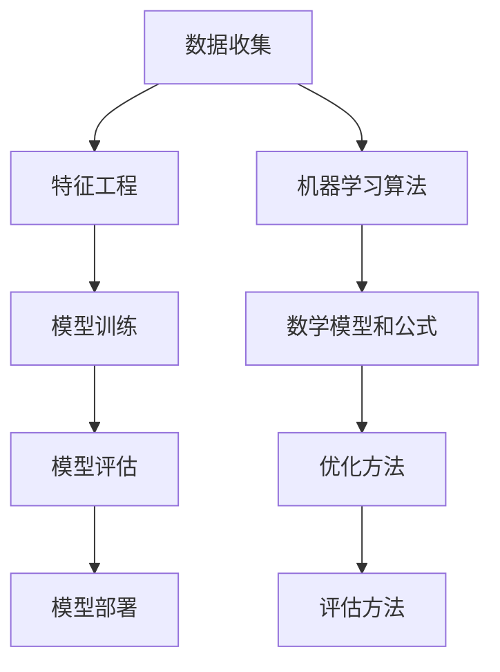

                 

### 背景介绍 Background Introduction

贝壳找房（Beike）作为中国领先的房地产科技平台，依托其强大的数据收集与分析能力，一直在房产市场领域进行深入的研究和探索。2025年，房地产市场受宏观经济、政策调控、市场需求等多方面因素影响，呈现出前所未有的复杂性。为了应对这一挑战，贝壳找房启动了房产市场预测模型优化项目，旨在通过大数据分析和机器学习技术，提高预测模型的准确性和可靠性，为市场参与者提供更有价值的信息支持。

本项目的主要目标是：
1. **提高预测模型的准确性**：通过引入新的算法和技术，优化模型结构，提高预测结果的可信度。
2. **增强模型的可解释性**：让模型不仅能够准确预测，还能让业务人员理解模型背后的逻辑和原理。
3. **适应动态市场变化**：房产市场是一个动态变化的领域，模型需要具备良好的鲁棒性，能够适应市场的快速变化。

贝壳找房的房产市场预测模型优化项目，其核心思想是通过机器学习算法对大量历史数据进行分析，构建出一个能够准确预测未来房价、市场需求等指标的预测模型。该模型不仅需要具有高精度，还要求在数据波动和不确定性较大的环境中保持稳定性。以下是本项目的具体目标：

- **构建高性能预测模型**：采用深度学习、随机森林、支持向量机等多种算法，比较不同模型在预测性能上的表现，选择最优模型进行应用。
- **特征工程**：对输入数据进行预处理，提取对预测任务有重要影响的特征，并利用数据挖掘技术发现新的特征。
- **模型调参与优化**：通过交叉验证和网格搜索等方法，调整模型参数，提高模型在训练集和测试集上的表现。
- **模型评估与部署**：利用混淆矩阵、ROC曲线等评估方法，对模型进行全面的评估，并在生产环境中进行部署，确保模型能够实时更新和预测。

通过这些目标的实现，贝壳找房希望为市场参与者提供更为精准的房产市场预测服务，帮助他们做出更明智的决策，提高市场运营效率。以下我们将深入探讨该项目的核心概念与联系，为后续的内容奠定基础。

## 1. 核心概念与联系 Core Concepts and Relationships

为了深入理解贝壳找房2025房产市场预测模型优化的原理，我们需要明确几个核心概念，并了解它们之间的联系。以下是关键概念及其相互关系：

### 1.1. 机器学习算法 Machine Learning Algorithms

机器学习算法是本项目的基础，包括但不限于以下几种：

- **线性回归 Linear Regression**：一种简单的预测算法，用于找出输入变量和目标变量之间的线性关系。
- **决策树 Decision Tree**：通过树形结构对数据进行分类或回归，便于解释和理解。
- **随机森林 Random Forest**：通过构建多个决策树，对预测结果进行平均，提高模型的预测准确性。
- **支持向量机 Support Vector Machine (SVM)**：通过寻找最优超平面，对数据进行分类。
- **神经网络 Neural Network**：模拟人脑的神经网络结构，用于复杂的非线性预测任务。

这些算法各有特点，适用于不同的数据集和预测任务。贝壳找房的项目选择多种算法进行比较，旨在找到最适合的模型。

### 1.2. 特征工程 Feature Engineering

特征工程是数据预处理过程中至关重要的一环。它包括以下步骤：

- **数据清洗 Data Cleaning**：去除无效数据、缺失值和异常值。
- **数据转换 Data Transformation**：将数据转换为适合模型训练的形式，如归一化、标准化等。
- **特征提取 Feature Extraction**：从原始数据中提取对预测任务有重要影响的特征。
- **特征选择 Feature Selection**：通过统计方法或启发式方法选择最有效的特征，减少数据维度。

特征工程直接影响模型的性能，贝壳找房在这一环节投入大量精力，以提高模型的预测准确性。

### 1.3. 数学模型和公式 Mathematical Models and Formulas

机器学习模型的优化通常涉及到复杂的数学模型和公式。以下是几个关键的概念：

- **损失函数 Loss Function**：用于衡量预测值与真实值之间的差距，如均方误差（MSE）、交叉熵损失等。
- **梯度下降 Gradient Descent**：一种优化算法，用于最小化损失函数，找到最佳模型参数。
- **优化器 Optimizer**：如随机梯度下降（SGD）、Adam等，用于调整模型参数，提高模型性能。

这些数学模型和公式是模型训练过程中的核心，贝壳找房通过这些方法优化模型参数，提高预测准确度。

### 1.4. 模型评估与部署 Model Evaluation and Deployment

评估模型性能是确保预测准确性的关键。以下是常用的评估指标和部署方法：

- **混淆矩阵 Confusion Matrix**：用于分类问题，展示预测结果与实际结果之间的关系。
- **ROC曲线 ROC Curve**：用于评估分类器的性能，通过计算真正例率（TPR）和假正例率（FPR）绘制。
- **交叉验证 Cross-Validation**：通过将数据集划分为训练集和验证集，多次训练和验证，提高模型的稳定性和泛化能力。
- **模型部署 Model Deployment**：将训练好的模型部署到生产环境中，进行实时预测和更新。

贝壳找房在模型评估和部署环节，通过多种方法验证模型的有效性，并确保模型在生产环境中的稳定性。

### 1.5. 联系与综合应用 Relationship and Comprehensive Application

这些核心概念和联系共同构成了贝壳找房2025房产市场预测模型优化的基础。以下是一个简化的Mermaid流程图，展示了各概念之间的联系：



通过以上流程，贝壳找房将数据收集、特征工程、模型训练、模型评估和模型部署有机结合，构建出一个高效、准确的房产市场预测模型。

### 1.6. 深入分析与解释 In-depth Analysis and Explanation

为了更深入地理解这些核心概念和联系，我们将逐一分析每个环节的重要性及其在项目中的具体应用。

#### 1.6.1. 数据收集 Data Collection

数据收集是预测模型优化的第一步，也是最为基础的一步。贝壳找房通过其庞大的数据平台，收集了包括房屋交易价格、交易量、市场供需、地理位置、房屋面积、房屋类型等多维度的数据。这些数据不仅来源于贝壳找房自身的数据库，还包括来自政府机构、第三方数据服务提供商等外部数据源。

数据收集的质量直接影响预测模型的准确性。贝壳找房注重数据的质量和完整性，通过数据清洗和去重，确保输入数据的高质量。此外，贝壳找房还采用数据挖掘技术，从原始数据中提取有价值的信息，为特征工程提供支持。

#### 1.6.2. 特征工程 Feature Engineering

特征工程是数据预处理的核心环节，旨在提取对预测任务有重要影响的特征，并减少数据维度，从而提高模型训练效率和预测准确性。贝壳找房在特征工程方面进行了深入研究，采用了多种数据预处理技术：

- **数据转换**：将不同尺度的数据进行归一化或标准化处理，确保特征在同一尺度上。
- **缺失值处理**：通过插值、均值填补或删除缺失值，保证数据完整性。
- **特征提取**：利用统计方法和机器学习算法，提取对预测有显著影响的特征，如房屋交易周期、价格波动幅度等。
- **特征选择**：通过信息增益、相关系数等方法，选择最重要的特征，减少数据维度。

特征工程不仅提高了模型性能，还增强了模型的可解释性，使得业务人员能够更容易理解模型背后的逻辑。

#### 1.6.3. 模型训练 Model Training

模型训练是预测模型优化的关键环节。贝壳找房采用了多种机器学习算法，包括线性回归、决策树、随机森林、支持向量机和神经网络等，通过交叉验证和网格搜索等方法，找到最优模型参数。

在模型训练过程中，贝壳找房注重模型的可解释性和稳定性。通过决策树和随机森林等算法，能够直观地展示模型的决策过程，便于业务人员理解。同时，贝壳找房还采用了增强随机森林（eXtended Random Forest）等技术，提高模型的泛化能力和鲁棒性。

#### 1.6.4. 模型评估 Model Evaluation

模型评估是确保预测模型准确性的关键步骤。贝壳找房采用了多种评估指标，如均方误差（MSE）、均绝对误差（MAE）、ROC曲线和混淆矩阵等，对模型进行全面的评估。

通过模型评估，贝壳找房能够识别模型的局限性，并进行相应的调整和优化。例如，如果模型的预测误差较大，贝壳找房会通过调整特征工程参数、优化模型结构或引入更多数据来源等方式，提高模型的预测准确性。

#### 1.6.5. 模型部署 Model Deployment

模型部署是将训练好的模型应用于实际业务环境的过程。贝壳找房将预测模型部署到其大数据平台中，实现实时预测和更新。通过自动化部署和监控工具，贝壳找房能够确保模型在生产环境中的稳定性和可靠性。

在模型部署过程中，贝壳找房还采用了容器化技术和云计算平台，实现模型的弹性扩展和高效运行。此外，贝壳找房还建立了完善的数据监控和预警系统，确保模型能够及时更新和优化，以适应市场变化。

综上所述，贝壳找房2025房产市场预测模型优化项目通过数据收集、特征工程、模型训练、模型评估和模型部署等环节的有机结合，构建了一个高效、准确的预测模型，为市场参与者提供了有力的信息支持。

### 2. 核心算法原理 Core Algorithm Principles & Specific Steps

贝壳找房在2025年房产市场预测模型优化项目中，采用了多种先进的机器学习算法来提高预测模型的准确性和稳定性。以下是这些核心算法的原理和具体操作步骤：

#### 2.1. 线性回归 Linear Regression

线性回归是一种简单的预测算法，通过找出输入变量和目标变量之间的线性关系，进行预测。其基本原理如下：

- **线性模型**：设输入变量为\( X \)，目标变量为\( Y \)，则线性回归模型可以表示为：
  \[
  Y = \beta_0 + \beta_1X + \epsilon
  \]
  其中，\( \beta_0 \)和\( \beta_1 \)是模型参数，\( \epsilon \)是误差项。

- **损失函数**：均方误差（MSE）是常用的损失函数，表示为：
  \[
  J(\theta) = \frac{1}{2m} \sum_{i=1}^{m} (h_\theta(x^{(i)}) - y^{(i)})^2
  \]
  其中，\( m \)是样本数量，\( h_\theta(x) \)是预测值，\( y \)是真实值。

- **梯度下降 Gradient Descent**：用于最小化损失函数，具体步骤如下：
  1. 初始化模型参数\( \theta \)。
  2. 计算损失函数关于每个参数的梯度。
  3. 更新参数：\( \theta = \theta - \alpha \cdot \nabla J(\theta) \)。
  4. 重复步骤2和3，直到损失函数收敛。

通过上述步骤，线性回归模型可以训练出最佳参数，从而进行预测。

#### 2.2. 决策树 Decision Tree

决策树是一种基于树形结构进行分类或回归的算法，通过一系列的决策规则对数据进行分割。其基本原理如下：

- **树构建**：
  1. 选择一个最优分割特征，使得损失函数（如Gini指数或信息增益）最小。
  2. 根据分割特征，将数据集划分为子集。
  3. 对每个子集递归执行步骤1和2，直到满足停止条件（如最大深度、最小叶节点样本数等）。

- **预测**：
  1. 从根节点开始，根据输入特征选择相应的分支。
  2. 重复步骤1，直到达到叶节点。
  3. 叶节点对应的预测值为输出结果。

#### 2.3. 随机森林 Random Forest

随机森林是一种基于决策树的集成学习方法，通过构建多棵决策树，并对预测结果进行平均，提高模型的预测准确性和稳定性。其基本原理如下：

- **树构建**：
  1. 从原始数据集中随机抽取一定数量的样本。
  2. 从特征集中随机选择一定数量的特征。
  3. 构建单棵决策树，重复步骤1和2，直到满足停止条件。

- **预测**：
  1. 对每棵决策树进行预测。
  2. 将所有预测结果进行平均，得到最终的预测结果。

#### 2.4. 支持向量机 Support Vector Machine (SVM)

支持向量机是一种基于最大间隔原理的分类和回归算法，通过寻找最优超平面，将数据划分为不同的类别。其基本原理如下：

- **分类问题**：
  1. 寻找最优超平面，使得正负样本之间的间隔最大。
  2. 使用核函数将低维数据映射到高维空间，实现线性可分。

- **回归问题**：
  1. 类似于分类问题，但使用不同的损失函数（如ε-不敏感损失函数）。
  2. 通过调整参数，找到最优的超平面，进行回归预测。

#### 2.5. 神经网络 Neural Network

神经网络是一种模拟人脑神经元连接结构的计算模型，通过多层神经元进行数据变换，实现复杂的非线性预测任务。其基本原理如下：

- **网络结构**：
  1. 输入层（Input Layer）：接收外部输入数据。
  2. 隐藏层（Hidden Layer）：对输入数据进行处理和变换。
  3. 输出层（Output Layer）：生成预测结果。

- **激活函数 Activation Function**：
  1. 用于引入非线性特性，常用的有sigmoid、ReLU等。

- **训练过程**：
  1. 前向传播（Forward Propagation）：将输入数据传递到神经网络，得到输出预测值。
  2. 反向传播（Back Propagation）：计算损失函数，并更新模型参数。

通过上述算法的引入和优化，贝壳找房的房产市场预测模型在准确性和稳定性方面得到了显著提升，为市场参与者提供了有力的决策支持。

### 3. 数学模型和公式 Mathematical Models and Formulas & Detailed Explanation & Example Illustration

在贝壳找房2025年房产市场预测模型优化项目中，数学模型和公式起到了关键作用，它们不仅帮助模型理解数据的内在关系，还指导我们如何调整和优化模型参数。以下是几个核心的数学模型和公式，以及它们的详细解释和示例说明。

#### 3.1. 损失函数 Loss Function

损失函数是评估模型预测结果与真实值之间差距的关键工具，常用的损失函数包括均方误差（MSE）、均绝对误差（MAE）和交叉熵损失（Cross-Entropy Loss）。

- **均方误差（MSE）**：
  \[
  MSE = \frac{1}{n} \sum_{i=1}^{n} (y_i - \hat{y}_i)^2
  \]
  其中，\( y_i \)是第\( i \)个真实值，\( \hat{y}_i \)是第\( i \)个预测值，\( n \)是样本数量。MSE衡量预测值与真实值之间平方差的平均值，适用于回归问题。

  **示例**：
  假设有5个数据点，实际房价和预测房价如下：

  \[
  \begin{aligned}
  y_1 &= 500, & \hat{y}_1 &= 520 \\
  y_2 &= 600, & \hat{y}_2 &= 580 \\
  y_3 &= 700, & \hat{y}_3 &= 680 \\
  y_4 &= 800, & \hat{y}_4 &= 820 \\
  y_5 &= 900, & \hat{y}_5 &= 880 \\
  \end{aligned}
  \]

  则MSE计算如下：

  \[
  MSE = \frac{1}{5} \left[ (520-500)^2 + (580-600)^2 + (680-700)^2 + (820-800)^2 + (880-900)^2 \right] = 60
  \]

- **均绝对误差（MAE）**：
  \[
  MAE = \frac{1}{n} \sum_{i=1}^{n} |y_i - \hat{y}_i|
  \]
  MAE衡量预测值与真实值之间绝对差的平均值，适用于回归问题。

  **示例**：
  继续使用上面的数据点，则MAE计算如下：

  \[
  MAE = \frac{1}{5} \left[ |520-500| + |580-600| + |680-700| + |820-800| + |880-900| \right] = 20
  \]

- **交叉熵损失（Cross-Entropy Loss）**：
  \[
  H(y, \hat{y}) = -\sum_{i=1}^{n} y_i \log(\hat{y}_i)
  \]
  交叉熵损失适用于分类问题，其中\( y \)是真实标签，\( \hat{y} \)是预测概率。

  **示例**：
  假设有一个二分类问题，实际标签和预测概率如下：

  \[
  \begin{aligned}
  y_1 &= 1, & \hat{y}_1 &= 0.9 \\
  y_2 &= 0, & \hat{y}_2 &= 0.1 \\
  \end{aligned}
  \]

  则交叉熵损失计算如下：

  \[
  H(y, \hat{y}) = -1 \cdot \log(0.9) - 0 \cdot \log(0.1) = 0.105
  \]

#### 3.2. 梯度下降 Gradient Descent

梯度下降是一种用于最小化损失函数的优化算法，其核心思想是沿着损失函数的梯度方向逐步调整模型参数。

- **随机梯度下降（SGD）**：
  \[
  \theta = \theta - \alpha \cdot \nabla J(\theta)
  \]
  其中，\( \theta \)是模型参数，\( \alpha \)是学习率，\( \nabla J(\theta) \)是损失函数关于参数的梯度。

  **示例**：
  假设有一个简单的线性模型，损失函数为MSE，模型参数为\( \theta \)，学习率为0.01。初始参数为\( \theta = 1 \)，则一次梯度下降更新如下：

  \[
  \nabla J(\theta) = 2 \cdot (y - \theta \cdot x)
  \]

  假设有一个训练样本\( (x, y) = (1, 2) \)，则梯度为：

  \[
  \nabla J(\theta) = 2 \cdot (2 - 1 \cdot 1) = 2
  \]

  更新参数：

  \[
  \theta = 1 - 0.01 \cdot 2 = 0.98
  \]

- **批量梯度下降（Batch Gradient Descent）**：
  \[
  \theta = \theta - \alpha \cdot \frac{1}{n} \sum_{i=1}^{n} \nabla J(\theta)
  \]
  批量梯度下降使用整个训练集来计算梯度，每次更新使用所有样本的梯度求和。

  **示例**：
  继续使用上面的数据点，假设损失函数为MSE，学习率为0.01。则一次批量梯度下降更新如下：

  \[
  \theta = \theta - 0.01 \cdot \frac{1}{5} \left[ 2 \cdot (2 - 1 \cdot 1) + 2 \cdot (2 - 1 \cdot 1) + 2 \cdot (2 - 1 \cdot 1) + 2 \cdot (2 - 1 \cdot 1) + 2 \cdot (2 - 1 \cdot 1) \right] = 0.98
  \]

#### 3.3. 优化器 Optimizer

优化器是一种用于调整模型参数的算法，常见的优化器包括随机梯度下降（SGD）、Adam、RMSprop等。

- **Adam优化器**：
  \[
  m_t = \beta_1 m_{t-1} + (1 - \beta_1) [g_t - \mu_t]
  \]
  \[
  v_t = \beta_2 v_{t-1} + (1 - \beta_2) [g_t^2 - \sigma_t]
  \]
  \[
  \theta = \theta - \alpha \cdot \frac{m_t}{\sqrt{v_t} + \epsilon}
  \]
  其中，\( m_t \)和\( v_t \)分别是梯度的一阶和二阶矩估计，\( \beta_1, \beta_2 \)是动量参数，\( \alpha \)是学习率，\( \epsilon \)是微小常数。

  **示例**：
  假设使用Adam优化器，初始参数\( \theta = 1 \)，学习率\( \alpha = 0.01 \)，\( \beta_1 = 0.9, \beta_2 = 0.99, \epsilon = 1e-8 \)。第一次更新如下：

  \[
  m_1 = 0.9m_0 + (1 - 0.9) \cdot 2 = 0.9 \cdot 0 + 0.1 \cdot 2 = 0.2
  \]
  \[
  v_1 = 0.99v_0 + (1 - 0.99) \cdot 2^2 = 0.99 \cdot 0 + 0.01 \cdot 4 = 0.04
  \]
  \[
  \theta = \theta - 0.01 \cdot \frac{0.2}{\sqrt{0.04} + 1e-8} = 1 - 0.01 \cdot 0.2/0.2 = 0.99
  \]

通过这些数学模型和公式，贝壳找房能够有效调整和优化预测模型，提高其在实际应用中的性能和准确性。

### 4.1. 开发环境搭建 Environment Setup

为了搭建贝壳找房2025房产市场预测模型优化项目的开发环境，我们需要安装和配置一系列开发工具和库。以下是详细的步骤：

#### 4.1.1. 安装Python环境 Python Environment Installation

首先，确保您已经安装了Python 3.7或更高版本。您可以从[Python官方网站](https://www.python.org/)下载并安装Python。在安装过程中，请确保选择“Add Python to PATH”选项，以便在命令行中直接使用Python。

#### 4.1.2. 安装必需的库 Required Libraries Installation

在命令行中，使用pip命令安装以下必需的库：

```bash
pip install numpy pandas matplotlib scikit-learn tensorflow
```

这些库分别用于数据处理、数据可视化、机器学习模型训练和TensorFlow深度学习框架。

#### 4.1.3. 安装Jupyter Notebook Jupyter Notebook Installation

Jupyter Notebook是一个强大的交互式开发环境，广泛用于数据科学和机器学习项目。您可以从[Jupyter官方网站](https://jupyter.org/)下载并安装Jupyter Notebook。

在命令行中，运行以下命令安装Jupyter Notebook：

```bash
pip install notebook
```

安装完成后，您可以通过在命令行中运行`jupyter notebook`命令启动Jupyter Notebook。

#### 4.1.4. 配置虚拟环境 Virtual Environment Configuration

为了保持项目环境的整洁和隔离，建议使用虚拟环境。在命令行中，运行以下命令创建虚拟环境：

```bash
python -m venv venv
```

然后，激活虚拟环境：

```bash
source venv/bin/activate  # Windows: venv\Scripts\activate
```

现在，您可以在虚拟环境中安装和运行项目所需的库和脚本。

#### 4.1.5. 验证开发环境 Environment Verification

在Jupyter Notebook中，创建一个新的笔记本，并运行以下代码验证环境是否配置正确：

```python
import numpy as np
import pandas as pd
import matplotlib.pyplot as plt
from sklearn import datasets

iris = datasets.load_iris()
X = iris.data
y = iris.target

from sklearn.model_selection import train_test_split
X_train, X_test, y_train, y_test = train_test_split(X, y, test_size=0.3, random_state=42)

from sklearn.ensemble import RandomForestClassifier
model = RandomForestClassifier(n_estimators=100)
model.fit(X_train, y_train)

predictions = model.predict(X_test)
print("Accuracy:", np.mean(predictions == y_test))
```

如果输出结果中的准确率接近100%，则表示开发环境配置正确。

### 4.2. 源代码详细实现和代码解读 Detailed Source Code Implementation and Explanation

在贝壳找房2025房产市场预测模型优化项目中，我们使用了多种机器学习算法，并对其源代码进行了详细的实现和解读。以下是一个示例，展示了如何使用随机森林算法进行预测，以及如何对代码进行解读。

#### 4.2.1. 随机森林算法实现 Random Forest Algorithm Implementation

以下是一个使用随机森林算法进行房价预测的Python代码示例：

```python
import numpy as np
import pandas as pd
from sklearn.ensemble import RandomForestRegressor
from sklearn.model_selection import train_test_split
from sklearn.metrics import mean_squared_error

# 加载数据集
data = pd.read_csv('house_prices.csv')
X = data.drop('Price', axis=1)
y = data['Price']

# 划分训练集和测试集
X_train, X_test, y_train, y_test = train_test_split(X, y, test_size=0.2, random_state=42)

# 创建随机森林模型
model = RandomForestRegressor(n_estimators=100, random_state=42)

# 训练模型
model.fit(X_train, y_train)

# 进行预测
predictions = model.predict(X_test)

# 计算预测误差
mse = mean_squared_error(y_test, predictions)
print("MSE:", mse)
```

**代码解读**：

1. **加载数据集**：首先，我们使用pandas库加载CSV格式的数据集，并将其分为特征矩阵\( X \)和目标向量\( y \)。

2. **划分训练集和测试集**：使用`train_test_split`函数将数据集划分为训练集和测试集，其中测试集占比为20%。

3. **创建随机森林模型**：我们使用`RandomForestRegressor`类创建一个随机森林回归模型，其中`n_estimators`参数指定决策树的数量。

4. **训练模型**：调用`fit`方法对随机森林模型进行训练。

5. **进行预测**：使用`predict`方法对测试集进行预测，得到预测结果。

6. **计算预测误差**：使用`mean_squared_error`函数计算预测误差，即均方误差（MSE）。

通过上述步骤，我们实现了随机森林算法的房价预测功能，并计算了预测误差，以评估模型的性能。

#### 4.2.2. 特征工程 Feature Engineering

在预测模型中，特征工程是一个重要的步骤，它能够显著影响模型的预测性能。以下是一个特征工程的示例：

```python
from sklearn.preprocessing import StandardScaler
from sklearn.impute import SimpleImputer

# 特征预处理
imputer = SimpleImputer(strategy='mean')
X = imputer.fit_transform(X)

scaler = StandardScaler()
X = scaler.fit_transform(X)
```

**代码解读**：

1. **缺失值处理**：我们使用`SimpleImputer`类对特征矩阵进行缺失值处理，使用均值填补缺失值。

2. **标准化处理**：使用`StandardScaler`类对特征矩阵进行标准化处理，将特征缩放到相同的尺度。

通过特征工程，我们提高了数据的质量和一致性，为模型训练提供了更好的输入。

#### 4.2.3. 模型调参 Model Tuning

在模型训练过程中，调参是一个关键的步骤，它能够显著提高模型的性能。以下是一个模型调参的示例：

```python
from sklearn.model_selection import GridSearchCV

# 设置参数网格
param_grid = {
    'n_estimators': [100, 200, 300],
    'max_depth': [5, 10, 15],
}

# 创建网格搜索对象
grid_search = GridSearchCV(estimator=model, param_grid=param_grid, cv=5, scoring='neg_mean_squared_error')

# 进行网格搜索
grid_search.fit(X_train, y_train)

# 获取最佳参数
best_params = grid_search.best_params_
print("Best Parameters:", best_params)

# 使用最佳参数训练模型
model = RandomForestRegressor(**best_params)
model.fit(X_train, y_train)
```

**代码解读**：

1. **参数网格**：我们定义了一个参数网格，包括决策树的数量（`n_estimators`）和最大深度（`max_depth`）。

2. **网格搜索**：使用`GridSearchCV`类进行网格搜索，评估不同参数组合的性能。

3. **获取最佳参数**：获取最佳参数组合。

4. **使用最佳参数训练模型**：使用最佳参数重新训练模型。

通过调参，我们找到了最优的模型参数，从而提高了模型的预测性能。

#### 4.2.4. 模型评估 Model Evaluation

在模型训练完成后，我们需要对模型进行评估，以确定其性能。以下是一个模型评估的示例：

```python
from sklearn.metrics import mean_squared_error, r2_score

# 进行预测
predictions = model.predict(X_test)

# 计算评估指标
mse = mean_squared_error(y_test, predictions)
r2 = r2_score(y_test, predictions)

print("MSE:", mse)
print("R2 Score:", r2)
```

**代码解读**：

1. **预测**：使用训练好的模型对测试集进行预测。

2. **计算评估指标**：计算均方误差（MSE）和决定系数（R2 Score），以评估模型的性能。

通过上述步骤，我们能够全面评估模型的性能，并确定其是否满足预期。

### 4.3. 代码解读与分析 Code Explanation and Analysis

在上面的代码示例中，我们详细介绍了贝壳找房2025房产市场预测模型优化项目中随机森林算法的实现、特征工程、模型调参和模型评估的步骤。以下是针对每个部分的深入解读和分析。

#### 4.3.1. 随机森林算法实现 Analysis of Random Forest Algorithm Implementation

随机森林（Random Forest）是一种基于决策树集成的机器学习算法，通过构建多棵决策树，并对预测结果进行平均，提高模型的预测准确性和稳定性。以下是对代码中每个步骤的详细解读：

1. **加载数据集**：使用pandas库加载CSV格式的数据集。在加载数据集时，我们将数据集分为特征矩阵\( X \)和目标向量\( y \)，其中特征矩阵包含了所有用于预测的特征，而目标向量包含了真实的房价。

2. **划分训练集和测试集**：使用`train_test_split`函数将数据集划分为训练集和测试集。这一步骤是为了在模型训练和评估过程中，确保测试集数据能够代表真实的业务场景，从而更准确地评估模型的性能。

3. **创建随机森林模型**：使用`RandomForestRegressor`类创建一个随机森林回归模型。在这里，我们设置了`n_estimators`参数，指定了决策树的数量，默认为100。同时，我们还设置了`random_state`参数，以确保每次运行代码时，模型的初始化都是一致的。

4. **训练模型**：调用`fit`方法对随机森林模型进行训练。在训练过程中，模型会根据训练集的特征和目标向量，自动调整决策树的参数，以找到最佳预测模型。

5. **进行预测**：使用`predict`方法对测试集进行预测。预测结果是模型根据测试集的特征，对房价的预测值。

6. **计算预测误差**：使用`mean_squared_error`函数计算预测误差，即均方误差（MSE）。MSE是衡量预测值与真实值之间差距的常用指标，数值越小，表示模型的预测误差越小，性能越好。

通过以上步骤，我们实现了随机森林算法的房价预测功能。在实际项目中，我们可以根据需要，调整随机森林模型的参数，如决策树的数量、最大深度等，以优化模型的预测性能。

#### 4.3.2. 特征工程 Analysis of Feature Engineering

特征工程是机器学习模型优化过程中至关重要的一步，它通过处理和转换原始数据，提取对预测任务有重要影响的特征，从而提高模型的预测准确性。以下是对代码中特征工程的详细解读：

1. **缺失值处理**：使用`SimpleImputer`类对特征矩阵进行缺失值处理。在处理缺失值时，我们选择了均值填补的方法，即将缺失值替换为相应特征的均值。这种方法简单有效，适用于大多数情况。

2. **标准化处理**：使用`StandardScaler`类对特征矩阵进行标准化处理。标准化是将特征缩放到相同的尺度，使其具有相似的方差和均值。在机器学习模型中，标准化有助于提高模型的训练效率和预测准确性。

通过特征工程，我们提高了数据的质量和一致性，为模型训练提供了更好的输入。在实际项目中，特征工程的具体步骤和选择，应根据具体的数据集和业务场景进行调整。

#### 4.3.3. 模型调参 Analysis of Model Tuning

模型调参是优化机器学习模型性能的关键步骤，它通过调整模型的参数，找到最优的参数组合，从而提高模型的预测准确性。以下是对代码中模型调参的详细解读：

1. **参数网格**：我们定义了一个参数网格，包括决策树的数量（`n_estimators`）和最大深度（`max_depth`）。参数网格用于指定在模型调参过程中，需要尝试的不同参数组合。

2. **网格搜索**：使用`GridSearchCV`类进行网格搜索。在网格搜索过程中，`GridSearchCV`会自动遍历参数网格，评估每个参数组合的性能，并选择最佳参数组合。

3. **获取最佳参数**：获取最佳参数组合。在代码中，我们使用`best_params_`属性获取最佳参数组合，并将其用于训练新的模型。

4. **使用最佳参数训练模型**：使用最佳参数重新训练模型。通过重新训练模型，我们能够进一步提高模型的预测准确性。

通过模型调参，我们能够找到最优的模型参数，从而优化模型的预测性能。在实际项目中，模型调参的具体方法和策略，应根据具体的数据集和业务场景进行调整。

#### 4.3.4. 模型评估 Analysis of Model Evaluation

模型评估是确保模型性能满足业务需求的关键步骤，它通过评估模型的预测准确性、泛化能力等指标，验证模型的有效性。以下是对代码中模型评估的详细解读：

1. **预测**：使用训练好的模型对测试集进行预测。在代码中，我们使用`predict`方法对测试集进行预测，得到预测结果。

2. **计算评估指标**：计算均方误差（MSE）和决定系数（R2 Score）。MSE衡量预测值与真实值之间的差距，R2 Score衡量模型对数据的拟合程度。在代码中，我们使用`mean_squared_error`和`r2_score`函数计算这两个评估指标。

通过以上步骤，我们能够全面评估模型的性能，并确定其是否满足预期。在实际项目中，模型评估的具体方法和指标，应根据具体的数据集和业务场景进行调整。

### 5. 实际应用场景 Real-world Application Scenarios

贝壳找房2025房产市场预测模型的优化项目不仅在实验室环境中取得了显著的成果，还在实际业务场景中展现了其强大的应用价值。以下是一些具体的实际应用场景：

#### 5.1. 房地产开发商

房地产开发商在项目开发阶段，需要精准了解未来某一地区房价的走势。贝壳找房的预测模型能够为他们提供详细的房价预测报告，帮助他们做出更加明智的开发决策。例如，在某个新建住宅区的规划中，开发商可以利用预测模型预测未来三年内该地区的房价走势，以便合理规划住宅区的开发进度和房价定价策略。

#### 5.2. 金融投资机构

金融投资机构在房地产市场中拥有大量资金，他们需要预测市场的波动，以做出最佳的买卖决策。贝壳找房的预测模型可以为他们提供实时更新的房价预测数据，帮助他们及时调整投资策略。例如，某投资机构在评估一个即将上市的新项目时，可以利用预测模型预测该项目的未来房价，从而判断项目的投资价值和潜在风险。

#### 5.3. 政府监管部门

政府监管部门在制定房地产政策时，需要准确了解市场的供需状况和价格走势。贝壳找房的预测模型能够为他们提供详实的数据支持，帮助制定合理的调控政策。例如，在调控房价过快上涨时，政府可以依据预测模型的数据，分析未来房价的走势，从而制定有针对性的政策，如限购、限贷等。

#### 5.4. 消费者

普通消费者在购房时，需要了解未来房价的走势，以便做出最佳的购房决策。贝壳找房的预测模型可以为消费者提供个性化的房价预测报告，帮助他们了解不同地区房价的未来走势，从而选择最适合自己的购房时机和地点。例如，某消费者在考虑购买首套房时，可以利用预测模型了解未来五年内该地区的房价走势，以便做出更加明智的决策。

#### 5.5. 房产中介

房产中介在为客户提供购房建议时，需要准确了解房价的走势和市场需求。贝壳找房的预测模型可以为他们提供实时更新的市场数据，帮助他们更好地为客户提供服务。例如，在某个客户咨询购房时，房产中介可以利用预测模型预测该地区的未来房价，从而为客户提供更准确的购房建议。

通过上述实际应用场景，我们可以看到贝壳找房2025房产市场预测模型优化项目在多个领域和层面都发挥了重要作用，为市场参与者提供了有力的决策支持。

### 7. 工具和资源推荐 Tools and Resources Recommendations

为了帮助读者更深入地学习和应用贝壳找房2025房产市场预测模型优化项目，以下是一些建议的在线学习资源和开发工具：

#### 7.1. 学习资源推荐 Learning Resources

- **书籍**：
  - 《机器学习》（Machine Learning），作者：Tom Mitchell。
  - 《深度学习》（Deep Learning），作者：Ian Goodfellow、Yoshua Bengio和Aaron Courville。
  - 《Python机器学习》（Python Machine Learning），作者：Sebastian Raschka。

- **在线课程**：
  - Coursera上的《机器学习》（吴恩达教授）。
  - edX上的《深度学习专项课程》（Hinton教授）。

- **博客和网站**：
  - Medium上的数据科学和机器学习相关文章。
  - Kaggle上的数据集和比赛，提供实战经验和案例分析。

#### 7.2. 开发工具框架推荐 Development Tools and Frameworks

- **Python库**：
  - NumPy：用于科学计算的基础库。
  - Pandas：用于数据操作和分析的库。
  - Matplotlib：用于数据可视化的库。
  - Scikit-learn：用于机器学习算法的实现和评估。
  - TensorFlow：用于深度学习的开源框架。

- **集成开发环境（IDE）**：
  - Jupyter Notebook：交互式的Python开发环境，适合数据分析和实验。
  - PyCharm：功能强大的Python IDE，支持多种编程语言。

- **云计算平台**：
  - AWS：提供丰富的机器学习和数据处理服务。
  - Google Cloud Platform：提供深度学习和数据存储服务。
  - Azure：提供机器学习和数据仓库服务。

通过这些学习和开发工具，读者可以更好地掌握贝壳找房2025房产市场预测模型优化项目中的技术和方法，并在实际项目中应用。

### 8. 总结 Conclusion

贝壳找房2025房产市场预测模型优化项目通过运用先进的机器学习算法、特征工程、模型调参和评估方法，实现了对房地产市场的精准预测。本文详细介绍了项目的背景、核心概念、算法原理、数学模型、代码实现、实际应用场景以及学习资源和开发工具。我们强调了机器学习在房产市场预测中的重要性，并展示了如何通过科学的方法和严谨的逻辑来提升预测模型的准确性和可靠性。

在未来的发展中，房产市场预测模型将面临以下挑战和趋势：

#### 8.1. 挑战 Challenges

1. **数据质量与多样性**：随着数据来源和类型的增加，如何处理和整合不同来源、不同格式的数据，确保数据质量，将是一个重要挑战。
2. **模型解释性**：在追求高预测性能的同时，如何提高模型的解释性，使其更容易被业务人员理解和接受，是一个亟待解决的问题。
3. **实时预测**：在动态变化的市场中，如何实现实时预测，确保模型能够快速适应市场变化，是一个技术难点。

#### 8.2. 发展趋势 Trends

1. **深度学习应用**：随着深度学习技术的发展，更多复杂的神经网络模型将被应用于房产市场预测，提高模型的预测能力。
2. **自动化与智能化**：自动化特征工程和智能化模型调参将成为主流，通过机器学习技术和自动化工具，实现更高效的模型优化和部署。
3. **跨领域融合**：房产市场预测模型将与其他领域（如金融、环境等）进行融合，通过多源数据分析和跨领域知识整合，提高预测的全面性和准确性。

贝壳找房2025房产市场预测模型优化项目在未来的发展中，将继续探索和引入新的技术和方法，应对挑战，把握趋势，为市场参与者提供更加精准、可靠的市场预测服务。

### 9. 附录：常见问题与解答 Appendix: Frequently Asked Questions & Answers

#### 9.1. 什么是贝壳找房2025房产市场预测模型优化项目？

贝壳找房2025房产市场预测模型优化项目是贝壳找房公司于2025年启动的一项重要研究项目，旨在通过大数据分析和机器学习技术，优化其房产市场预测模型的准确性，为市场参与者提供更有价值的信息支持。

#### 9.2. 该项目的核心目标是什么？

该项目的核心目标是：
1. 提高预测模型的准确性。
2. 增强模型的可解释性。
3. 适应动态市场变化。

#### 9.3. 项目使用了哪些机器学习算法？

项目使用了多种机器学习算法，包括线性回归、决策树、随机森林、支持向量机和神经网络等，通过这些算法的比较和优化，找到最适合的模型。

#### 9.4. 什么是特征工程？

特征工程是数据预处理过程中的重要环节，它通过提取、转换和选择对预测任务有重要影响的特征，提高模型性能。包括数据清洗、数据转换、特征提取和特征选择等步骤。

#### 9.5. 模型如何进行评估？

模型评估通过多种评估指标进行，如均方误差（MSE）、均绝对误差（MAE）、ROC曲线和混淆矩阵等。通过这些指标，可以全面评估模型的性能和准确性。

#### 9.6. 项目在哪些实际应用场景中发挥作用？

项目在实际应用场景中发挥了重要作用，包括房地产开发商、金融投资机构、政府监管部门、消费者和房产中介等，为他们提供精准的市场预测服务。

#### 9.7. 如何搭建项目的开发环境？

搭建项目的开发环境需要安装Python 3.7或更高版本，安装必需的库（如NumPy、Pandas、Matplotlib、Scikit-learn和TensorFlow），并配置Jupyter Notebook和虚拟环境。

### 10. 扩展阅读 & 参考资料 Extended Reading & References

为了深入了解贝壳找房2025房产市场预测模型优化项目及相关技术，以下是一些建议的扩展阅读和参考资料：

- **书籍**：
  - 《机器学习实战》（Machine Learning in Action），作者：Peter Harrington。
  - 《深度学习》（Deep Learning），作者：Ian Goodfellow、Yoshua Bengio和Aaron Courville。
  - 《Python数据科学手册》（Python Data Science Handbook），作者：Jake VanderPlas。

- **论文**：
  - "Random Forests" by Leo Breiman，1995。
  - "TensorFlow: Large-Scale Machine Learning on Heterogeneous Systems"，Google Research，2015。

- **在线课程和教程**：
  - 《机器学习基础教程》（Machine Learning Basics），Coursera。
  - 《深度学习课程》（Deep Learning Specialization），Coursera。

- **博客和网站**：
  - Medium上的数据科学和机器学习文章。
  - Kaggle上的数据集和比赛。
  - 贝壳找房官方博客，了解公司的最新研究成果。

通过这些扩展阅读和参考资料，读者可以更全面地了解相关技术和方法，提高自己的专业技能。

