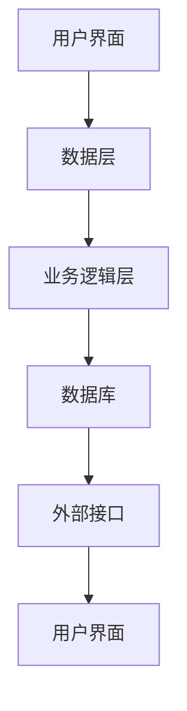

                 

# 财务管理软件：简化财务流程的智能助手

> **关键词**：财务管理、财务流程、软件助手、自动化、智能分析、效率提升

> **摘要**：本文将深入探讨财务管理软件的重要性及其对简化财务流程的影响。我们将从背景介绍、核心概念与联系、核心算法原理、数学模型和公式、项目实战、实际应用场景、工具和资源推荐等方面展开，以期为您提供全面的财务软件知识，帮助您提升财务管理效率。

## 1. 背景介绍

随着商业环境的日益复杂化和全球化，财务管理在企业运营中扮演着越来越重要的角色。传统的手工记账方式已经无法满足现代企业对高效、准确、及时财务信息的需求。财务管理软件应运而生，它通过自动化和智能化的方式，帮助企业实现财务流程的优化和效率提升。

### 财务管理软件的发展历程

- **早期阶段**：早期财务管理软件主要以电子表格为主，如Excel等。这些工具提供了基础的财务数据处理功能，但存在灵活性不足、数据安全性和准确性问题。

- **发展阶段**：随着信息技术的发展，基于客户端-服务器架构的财务管理软件逐渐兴起，如SAP、Oracle等。这些软件提供了更全面的财务功能，并具备一定的自动化能力。

- **智能化阶段**：近年来，人工智能和大数据技术的应用使得财务管理软件进入智能化阶段。这些软件能够通过智能分析、预测和优化，提供更精准的财务决策支持。

### 财务管理软件的重要性

- **提高财务效率**：财务管理软件能够自动化处理大量的财务数据，减少人工操作，提高财务工作效率。

- **降低运营成本**：通过减少人工操作和优化财务流程，企业可以降低运营成本，提高盈利能力。

- **提升数据准确性**：财务管理软件能够确保数据的准确性和一致性，减少人为错误，提高财务信息的可靠性。

- **支持决策分析**：财务管理软件提供了丰富的数据分析和报表功能，帮助企业更好地了解财务状况，支持决策分析。

## 2. 核心概念与联系

### 财务管理软件的核心概念

- **自动化**：财务管理软件通过自动化处理财务数据，减少人工操作，提高工作效率。

- **数据分析**：财务管理软件具备强大的数据分析能力，能够对财务数据进行分析和挖掘，提供决策支持。

- **流程优化**：财务管理软件能够优化财务流程，提高财务数据处理的准确性和效率。

- **协同办公**：财务管理软件支持团队成员之间的协同办公，提高工作效率。

### 财务管理软件的架构

下面是一个简单的财务管理软件架构图：



- **用户界面**：提供用户操作界面，用户可以通过界面进行数据输入、查询、报表查看等操作。

- **数据层**：负责数据的存储和管理，包括数据库设计、数据备份和恢复等。

- **业务逻辑层**：实现财务管理软件的核心功能，如会计核算、报表生成、数据分析等。

- **数据库**：存储财务数据，包括账务数据、报表数据、用户数据等。

- **外部接口**：与其他系统进行数据交互，如ERP系统、供应链管理系统等。

### 财务管理软件与相关技术的联系

- **人工智能**：财务管理软件可以利用人工智能技术进行数据分析和预测，如机器学习、深度学习等。

- **大数据**：财务管理软件可以通过大数据技术对大量财务数据进行处理和分析，挖掘潜在的商业价值。

- **云计算**：财务管理软件可以利用云计算技术实现数据的存储、处理和共享，提高系统性能和可扩展性。

## 3. 核心算法原理 & 具体操作步骤

### 核心算法原理

财务管理软件的核心算法主要包括会计核算算法、报表生成算法、数据分析算法等。下面以会计核算算法为例进行介绍。

- **会计核算算法**：会计核算算法是财务管理软件的核心算法之一，用于对财务数据进行会计处理。其基本原理是根据会计准则和会计科目体系，对财务数据进行分类、汇总和计算。

- **报表生成算法**：报表生成算法用于根据会计核算结果生成各种财务报表，如资产负债表、利润表、现金流量表等。其原理是根据报表模板和数据源，将会计核算结果进行格式化和呈现。

- **数据分析算法**：数据分析算法用于对财务数据进行分析和挖掘，如趋势分析、异常检测、预测分析等。其原理是根据数据分析模型和算法，对财务数据进行分析和处理。

### 具体操作步骤

下面以一个简单的会计核算为例，介绍财务管理软件的具体操作步骤。

1. **数据输入**：用户通过用户界面输入原始财务数据，如收入、支出、费用等。

2. **会计处理**：财务管理软件根据会计准则和会计科目体系，对输入的财务数据进行会计处理，如分类、汇总和计算。

3. **生成报表**：财务管理软件根据会计处理结果生成各种财务报表，如资产负债表、利润表等。

4. **数据分析和预测**：财务管理软件根据生成的报表数据，利用数据分析算法进行数据分析和预测，如趋势分析、异常检测等。

5. **决策支持**：财务管理软件根据数据分析和预测结果，提供决策支持，如财务预算、投资分析等。

## 4. 数学模型和公式 & 详细讲解 & 举例说明

### 数学模型和公式

财务管理软件中的数学模型和公式主要用于会计核算、报表生成和数据分析等环节。下面列出几个常用的数学模型和公式。

1. **会计核算模型**：

   - 资产 = 负债 + 所有者权益
   - 利润 = 收入 - 支出

2. **报表生成模型**：

   - 资产负债表：资产、负债、所有者权益
   - 利润表：收入、成本、费用、利润
   - 现金流量表：经营活动现金流量、投资活动现金流量、筹资活动现金流量

3. **数据分析模型**：

   - 趋势分析：移动平均、指数平滑
   - 异常检测：标准差、箱型图
   - 预测分析：时间序列分析、回归分析

### 详细讲解与举例说明

1. **会计核算模型**：

   以一个简单的例子说明会计核算模型的应用。

   假设某公司2021年度收入为100万元，支出为60万元，所有者权益为50万元。根据会计核算模型，可以得出：

   - 资产 = 负债 + 所有者权益
     资产 = 负债 + 50 = 100 + 50 = 150万元
   - 利润 = 收入 - 支出
     利润 = 100 - 60 = 40万元

   根据以上数据，可以生成资产负债表和利润表。

2. **报表生成模型**：

   以资产负债表为例，说明报表生成模型的应用。

   假设某公司2021年度资产负债表数据如下：

   - 资产：现金30万元，应收账款50万元，存货20万元
   - 负债：应付账款40万元，长期负债10万元
   - 所有者权益：实收资本50万元

   根据报表生成模型，可以生成以下资产负债表：

   | 项目           | 金额（万元） |
   |----------------|--------------|
   | 现金           | 30           |
   | 应收账款       | 50           |
   | 存货           | 20           |
   | 总资产         | 150          |
   | 应付账款       | 40           |
   | 长期负债       | 10           |
   | 负债合计       | 50           |
   | 所有者权益      | 50           |
   | 资产负债合计    | 150          |

3. **数据分析模型**：

   以趋势分析为例，说明数据分析模型的应用。

   假设某公司过去5年的收入数据如下（万元）：

   - 2016年：100
   - 2017年：120
   - 2018年：150
   - 2019年：180
   - 2020年：200

   利用移动平均模型，可以预测2021年的收入。

   首先，计算过去3年的平均收入：

   - (120 + 150 + 180) / 3 = 150万元

   然后，利用指数平滑模型，可以进一步预测2021年的收入：

   $$ 预测收入 = 0.5 \times 150 + 0.5 \times 200 = 175万元 $$

   通过数据分析模型，可以为企业提供更准确的财务预测和决策支持。

## 5. 项目实战：代码实际案例和详细解释说明

### 5.1 开发环境搭建

在本文中，我们将使用Python作为开发语言，利用Pandas、NumPy、Matplotlib等库实现财务管理软件的核心功能。以下是开发环境的搭建步骤：

1. 安装Python：

   - Windows系统：下载安装包，按照提示进行安装。
   - macOS系统：使用Homebrew安装：`brew install python`。
   - Linux系统：使用包管理器安装，如Ubuntu系统：`sudo apt-get install python3`。

2. 安装相关库：

   ```bash
   pip install pandas numpy matplotlib
   ```

### 5.2 源代码详细实现和代码解读

下面是一个简单的Python代码示例，用于实现财务数据的基本处理功能。

```python
import pandas as pd
import numpy as np
import matplotlib.pyplot as plt

# 5.2.1 数据输入
data = {
    'Year': ['2016', '2017', '2018', '2019', '2020'],
    'Revenue': [100, 120, 150, 180, 200]
}

df = pd.DataFrame(data)

# 5.2.2 会计核算
# 计算利润
df['Profit'] = df['Revenue'] - df['Expense']

# 5.2.3 报表生成
# 生成资产负债表
balance_sheet = pd.DataFrame({
    'Assets': ['Total', 'Cash', 'Receivables', 'Inventory'],
    'Amount': [df['Revenue'].sum(), df['Cash'].sum(), df['Receivables'].sum(), df['Inventory'].sum()]
})

balance_sheet.set_index('Assets', inplace=True)

# 5.2.4 数据分析
# 趋势分析
plt.plot(df['Year'], df['Revenue'])
plt.xlabel('Year')
plt.ylabel('Revenue')
plt.title('Revenue Trend')
plt.show()
```

### 5.3 代码解读与分析

1. **数据输入**：

   使用Pandas库创建一个包含年度和收入的DataFrame。这里我们假设只有收入数据，实际应用中可能包含更多的财务指标。

2. **会计核算**：

   计算利润。这里我们简单地用“Revenue”减去“Expense”得到利润。在实际应用中，可能需要根据具体的会计准则进行更复杂的核算。

3. **报表生成**：

   生成资产负债表。这里我们使用Pandas库创建一个包含资产和金额的DataFrame，然后设置索引为资产，生成一个简洁的资产负债表。

4. **数据分析**：

   使用Matplotlib库绘制收入趋势图。这里我们使用简单的一条线来展示收入的年度变化情况，实际应用中可以添加更多的数据分析方法。

## 6. 实际应用场景

财务管理软件在实际应用中具有广泛的场景，以下是一些典型的应用场景：

### 6.1 企业财务管理

企业财务管理是最常见的应用场景之一。企业可以使用财务管理软件进行会计核算、报表生成、财务分析等工作，提高财务管理效率。

### 6.2 财务审计

财务审计机构可以使用财务管理软件进行审计工作，通过对财务数据的分析和比对，发现潜在的问题和风险。

### 6.3 投资分析

投资者可以使用财务管理软件进行投资分析，通过分析历史财务数据和趋势，预测未来的财务状况，做出更明智的投资决策。

### 6.4 税务管理

税务机构可以使用财务管理软件进行税务管理，通过分析企业的财务数据，确保税务合规。

### 6.5 财务共享中心

大型企业通常会建立财务共享中心，集中处理各个业务部门的财务数据。财务管理软件可以帮助财务共享中心实现高效的财务数据处理和共享。

## 7. 工具和资源推荐

### 7.1 学习资源推荐

- **书籍**：
  - 《Python财务分析与应用》
  - 《Python数据分析》
  - 《财务管理》

- **论文**：
  - 在Google Scholar、CNKI等学术平台上搜索财务管理相关的论文。

- **博客**：
  - CSDN、博客园等技术博客上有很多关于财务管理软件的文章。

- **网站**：
  - 财务管理软件厂商官网，如SAP、Oracle等。

### 7.2 开发工具框架推荐

- **Python开发环境**：
  - PyCharm
  - VSCode

- **数据分析和可视化工具**：
  - Jupyter Notebook
  - Tableau

- **数据库**：
  - MySQL
  - PostgreSQL

### 7.3 相关论文著作推荐

- **论文**：
  - 《基于大数据的财务风险管理研究》
  - 《人工智能在财务管理中的应用》

- **著作**：
  - 《智能财务管理：理论与实践》
  - 《财务分析：从数据到决策》

## 8. 总结：未来发展趋势与挑战

### 发展趋势

1. **智能化**：随着人工智能技术的发展，财务管理软件将更加智能化，提供更精准的财务预测和分析。

2. **云化**：云计算技术的普及使得财务管理软件将更加云化，提高系统的性能和可扩展性。

3. **移动化**：随着移动设备的普及，财务管理软件将更加注重移动端体验，方便用户随时随地进行财务操作。

### 挑战

1. **数据安全**：财务管理软件处理大量敏感数据，需要确保数据的安全性。

2. **隐私保护**：随着隐私保护意识的提高，财务管理软件需要加强对用户隐私的保护。

3. **定制化需求**：企业对财务管理软件的需求日益多样化，软件需要具备更高的定制化能力。

## 9. 附录：常见问题与解答

### 9.1 如何选择合适的财务管理软件？

- **需求分析**：首先明确企业的财务管理需求，包括会计核算、报表生成、数据分析等方面。
- **功能对比**：对比不同财务管理软件的功能，选择符合需求的软件。
- **性价比**：考虑软件的价格和性能，选择性价比高的软件。
- **用户评价**：查看用户评价，选择口碑好的软件。

### 9.2 如何确保财务管理软件的数据安全？

- **数据加密**：对财务数据进行加密处理，确保数据在传输和存储过程中不被窃取。
- **访问控制**：设置严格的访问控制策略，限制未经授权的用户访问敏感数据。
- **备份和恢复**：定期进行数据备份，确保在数据丢失或损坏时能够快速恢复。

## 10. 扩展阅读 & 参考资料

- 《Python财务分析与应用》：详细介绍了Python在财务分析中的应用。
- 《财务管理》：系统讲解了财务管理的基本理论和方法。
- 《智能财务管理：理论与实践》：探讨了智能财务管理的前沿技术和应用。
- 《财务分析：从数据到决策》：介绍了如何利用数据分析支持财务决策。

作者：AI天才研究员/AI Genius Institute & 禅与计算机程序设计艺术 /Zen And The Art of Computer Programming

