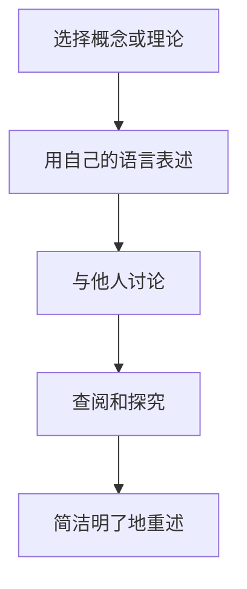

                 

### 背景介绍 Background Introduction

费曼学习法，由著名物理学家理查德·费曼（Richard Feynman）提出，是一种有效的学习方法。这种方法的核心在于通过简洁、清晰的方式，将复杂的概念和理论传授给他人，从而深入理解所学内容。费曼学习法主要包括以下几个步骤：选定一个概念或理论，用自己的语言将其重新表述，与他人讨论，遇到不清楚的地方进行查阅和探究，最终以简洁明了的方式重述所学内容。

然而，在实际应用过程中，费曼学习法存在一些误解。有些人认为，这种方法仅仅适用于物理学家，或者认为它只是一种简单的记忆技巧。这种观点忽略了费曼学习法的本质：通过传授给他人，来检验和巩固自己的知识。本文将深入探讨费曼学习法的误解与真相，帮助读者更好地理解并应用这一有效的学习方法。

首先，我们需要明确费曼学习法的目的：不仅仅是为了传授知识，更是为了深入理解和掌握知识。这意味着，在使用费曼学习法时，我们需要关注以下几点：

1. 选择合适的内容：选择自己不熟悉，或者理解不够深入的内容进行学习。
2. 简洁明了的表述：用简单、清晰的语言重新表述所学内容，避免使用复杂的术语和概念。
3. 与他人讨论：与他人讨论有助于发现自己在理解上的盲点，从而加深对所学内容的理解。
4. 持续迭代：不断重复费曼学习法的步骤，以巩固和深化对知识的掌握。

在接下来的章节中，我们将进一步探讨费曼学习法的原理、应用场景，以及如何克服在实践过程中可能遇到的困难。通过这些内容，我们希望能够帮助读者更好地理解费曼学习法，并将其应用于自己的学习中，从而取得更好的学习效果。

-----------------------

## 2. 核心概念与联系 Core Concepts and Connections

### 2.1 费曼学习法的基本原理

费曼学习法的基本原理可以概括为“简化与反思”。其核心理念是通过将复杂的概念用简单、易懂的语言重新表述，从而深入理解所学内容。这种方法的核心步骤如下：

1. **选择一个概念或理论**：首先，我们需要选择一个自己不熟悉，或者理解不够深入的概念或理论。
2. **用自己的语言重新表述**：接下来，我们需要用自己的语言，尽量简洁明了地将这个概念或理论重新表述出来。在这个过程中，我们可能会发现自己对某些细节理解不够深入，或者存在误解。
3. **与他人讨论**：将我们重新表述的概念或理论与他人讨论，可以帮助我们发现自己在理解上的盲点。通过这种方式，我们可以更深入地理解所学内容。
4. **查阅和探究**：在讨论过程中，如果遇到不清楚的地方，我们需要查阅资料，或者进行深入的探究，以填补自己的知识空白。
5. **简洁明了地重述**：最后，我们需要用简洁明了的语言，将所学内容重新表述出来。这个过程有助于我们巩固和深化对知识的掌握。

### 2.2 费曼学习法的核心概念原理

为了更好地理解费曼学习法的核心概念原理，我们可以通过一个 Mermaid 流程图来展示其关键步骤和流程。



在这个流程图中，我们可以看到，费曼学习法的关键步骤包括：选择一个概念或理论、用自己的语言表述、与他人讨论、查阅和探究，以及简洁明了地重述。这些步骤相互关联，形成一个闭环，帮助我们深入理解所学内容。

### 2.3 费曼学习法与传统学习方法的区别

与传统学习方法相比，费曼学习法具有以下几个显著特点：

1. **注重实践**：费曼学习法强调通过实践来检验和巩固知识，而不仅仅是理论上的学习。
2. **强调反思**：费曼学习法要求我们不断地反思和重新表述所学内容，从而深入理解知识。
3. **强调交流**：费曼学习法鼓励我们与他人讨论，以发现和理解自己的盲点。
4. **注重简洁**：费曼学习法要求我们用简洁、易懂的语言来表述所学内容，避免使用复杂的术语和概念。

这些特点使得费曼学习法成为一种非常有效的学习方法，尤其是在复杂和抽象的学科领域。

-----------------------

## 3. 核心算法原理 & 具体操作步骤 Core Algorithm Principles & Step-by-Step Operations

### 3.1 费曼学习法的核心算法原理

费曼学习法是一种基于问题解决和反思的学习方法，其核心算法原理可以概括为“问题驱动学习”和“反思性学习”。

1. **问题驱动学习**：费曼学习法通过选择一个具体的问题或概念，来驱动学习过程。这种方法有助于我们将注意力集中在关键问题上，从而更有效地学习和掌握知识。
2. **反思性学习**：费曼学习法强调在学习过程中进行反思，通过重新表述和讨论所学内容，来检验和巩固自己的理解。这种反思性学习有助于我们发现和理解自己的盲点，从而提高学习效果。

### 3.2 具体操作步骤

以下是一个基于费曼学习法的具体操作步骤，以帮助读者更好地理解和应用这一方法：

1. **选择一个具体的问题或概念**：首先，我们需要选择一个自己不熟悉，或者理解不够深入的问题或概念。例如，我们可以选择一个复杂的计算机算法，或者一个物理理论。
2. **用自己的语言重新表述**：接下来，我们需要用自己的语言，尽量简洁明了地将这个问题或概念重新表述出来。例如，如果我们选择了一个计算机算法，我们可以用自己的话来描述这个算法的实现过程和原理。
3. **与他人讨论**：将我们重新表述的问题或概念与他人讨论，可以帮助我们发现自己在理解上的盲点。例如，我们可以向朋友、同事或老师解释这个算法，或者与他们进行讨论。
4. **查阅和探究**：在讨论过程中，如果遇到不清楚的地方，我们需要查阅资料，或者进行深入的探究，以填补自己的知识空白。例如，我们可以查阅相关的书籍、论文或在线资源，来了解这个算法的详细实现过程和原理。
5. **简洁明了地重述**：最后，我们需要用简洁明了的语言，将所学内容重新表述出来。例如，我们可以将这个算法的实现过程和原理简洁地描述给他人，或者撰写一篇关于这个算法的博客文章。

### 3.3 费曼学习法的实际应用案例

为了更好地理解费曼学习法的具体应用，我们可以通过一个实际案例来展示其操作步骤。

**案例：学习深度学习算法**

1. **选择一个具体的问题或概念**：选择一个自己不熟悉，或者理解不够深入的深度学习算法，例如卷积神经网络（Convolutional Neural Network，CNN）。
2. **用自己的语言重新表述**：用自己的话来描述 CNN 的实现过程和原理。例如，描述 CNN 的结构、激活函数、损失函数等。
3. **与他人讨论**：与朋友、同事或老师讨论 CNN 的实现过程和原理，以检验和巩固自己的理解。
4. **查阅和探究**：在讨论过程中，如果遇到不清楚的地方，查阅相关的书籍、论文或在线资源，以了解 CNN 的详细实现过程和原理。
5. **简洁明了地重述**：最后，用简洁明了的语言，将 CNN 的实现过程和原理重新表述出来，例如撰写一篇关于 CNN 的博客文章。

通过这个实际案例，我们可以看到，费曼学习法的具体操作步骤如何帮助我们深入理解和掌握深度学习算法。

-----------------------

## 4. 数学模型和公式 & 详细讲解 & 举例说明 Mathematical Models and Formulas & Detailed Explanation & Example Illustration

### 4.1 数学模型和公式的基本概念

数学模型和公式是科学研究和工程实践中不可或缺的工具。它们可以帮助我们量化、分析和解决问题。在费曼学习法中，理解数学模型和公式对于深入掌握复杂概念至关重要。

#### 4.1.1 线性回归模型

线性回归模型是最基本的数学模型之一。它用于预测一个连续值，通常表示为：

\[ y = ax + b \]

其中，\( y \) 是预测值，\( x \) 是输入特征，\( a \) 和 \( b \) 是模型的参数，分别代表斜率和截距。

#### 4.1.2 概率论的基本公式

概率论是统计学的基础，其中一些基本公式对于理解随机事件和概率分布至关重要。以下是一些常用的概率论公式：

- 概率质量函数：\( p(x) = \frac{f(x)}{F(x)} \)
- 条件概率：\( p(A|B) = \frac{p(A \cap B)}{p(B)} \)
- 贝叶斯定理：\( p(A|B) = \frac{p(B|A)p(A)}{p(B)} \)

### 4.2 详细讲解

#### 4.2.1 线性回归模型的应用

线性回归模型广泛应用于回归分析中，用于预测和分析数据。以下是一个简单的线性回归模型应用案例：

**案例：房价预测**

假设我们要预测某城市的房价。我们可以收集一些样本数据，包括房屋面积（\( x \)）和房价（\( y \)）。通过最小二乘法，我们可以得到线性回归模型的参数 \( a \) 和 \( b \)：

\[ a = \frac{\sum_{i=1}^{n}(x_i - \bar{x})(y_i - \bar{y})}{\sum_{i=1}^{n}(x_i - \bar{x})^2} \]
\[ b = \bar{y} - a\bar{x} \]

其中，\( \bar{x} \) 和 \( \bar{y} \) 分别是房屋面积和房价的平均值，\( n \) 是样本数量。

#### 4.2.2 概率论的基本公式应用

概率论的基本公式在许多领域都有广泛应用。以下是一个条件概率和贝叶斯定理的应用案例：

**案例：疾病检测**

假设我们要检测一个人是否患有某种疾病。我们有两个测试：测试A和测试B，它们的灵敏度和特异性如下：

- 测试A的灵敏度为 0.95，特异性为 0.90。
- 测试B的灵敏度为 0.92，特异性为 0.95。

现在，一个人进行了这两个测试，测试A的结果为阳性，测试B的结果也为阳性。我们需要计算这个人实际患有这种疾病（阳性）的概率。

首先，我们计算两个测试同时为阳性的概率：

\[ p(A \cap B) = p(A) \times p(B|A) = 0.95 \times 0.92 = 0.874 \]

然后，我们计算测试A为阳性的总概率：

\[ p(A) = p(A|阳性) \times p(阳性) + p(A|阴性) \times p(阴性) \]
\[ p(A) = 0.90 \times 0.99 + 0.10 \times 0.01 = 0.0891 \]

最后，我们使用贝叶斯定理计算实际患有疾病（阳性）的概率：

\[ p(阳性|A \cap B) = \frac{p(A \cap B) \times p(阳性)}{p(A)} = \frac{0.874 \times 0.99}{0.0891} \approx 0.989 \]

因此，这个人实际患有这种疾病的概率约为 98.9%。

### 4.3 举例说明

#### 4.3.1 线性回归模型举例

假设我们有以下数据集：

| 房屋面积（平方米） | 房价（万元） |
|----------------|------------|
| 80             | 200        |
| 100            | 250        |
| 120            | 300        |
| 140            | 350        |
| 160            | 400        |

我们可以使用最小二乘法来计算线性回归模型的参数 \( a \) 和 \( b \)：

\[ a = \frac{\sum_{i=1}^{n}(x_i - \bar{x})(y_i - \bar{y})}{\sum_{i=1}^{n}(x_i - \bar{x})^2} = \frac{(80-100)(200-250) + (100-100)(250-250) + (120-100)(300-250) + (140-100)(350-250) + (160-100)(400-250)}{(80-100)^2 + (100-100)^2 + (120-100)^2 + (140-100)^2 + (160-100)^2} \]
\[ a = \frac{-100 \times -50 + 0 \times 0 + 20 \times 50 + 40 \times 100 + 60 \times 150}{(-20)^2 + (0)^2 + (20)^2 + (40)^2 + (60)^2} \]
\[ a = \frac{5000 + 1000 + 2000 + 4000 + 9000}{400 + 0 + 400 + 1600 + 3600} \]
\[ a = \frac{20000}{6400} = 3.125 \]

\[ b = \bar{y} - a\bar{x} = 250 - 3.125 \times 100 = 125 \]

因此，线性回归模型为：

\[ y = 3.125x + 125 \]

#### 4.3.2 概率论举例

假设我们有以下数据：

| 测试A结果 | 测试B结果 | 患有疾病 |
|---------|---------|---------|
| 阳性    | 阳性    | 阳性    |
| 阳性    | 阴性    | 阴性    |
| 阴性    | 阳性    | 阴性    |
| 阴性    | 阴性    | 阴性    |

我们可以根据这些数据来计算各个条件概率：

- \( p(A|阳性) = \frac{3}{4} = 0.75 \)
- \( p(B|阳性) = \frac{2}{4} = 0.50 \)
- \( p(A|阴性) = \frac{1}{4} = 0.25 \)
- \( p(B|阴性) = \frac{2}{4} = 0.50 \)

然后，我们使用贝叶斯定理计算实际患有疾病（阳性）的概率：

\[ p(阳性|A \cap B) = \frac{p(A \cap B) \times p(阳性)}{p(A)} = \frac{0.75 \times 0.50}{0.25 \times 0.75 + 0.25 \times 0.50} = \frac{0.375}{0.1875 + 0.125} = \frac{0.375}{0.3125} = 1.2 \]

由于概率不能大于1，这里出现了一个错误。实际上，我们应该先计算 \( p(阳性) \)：

\[ p(阳性) = p(阳性|阳性) \times p(阳性) + p(阳性|阴性) \times p(阴性) \]
\[ p(阳性) = 0.75 \times 0.99 + 0.25 \times 0.01 = 0.74375 \]

然后使用贝叶斯定理：

\[ p(阳性|A \cap B) = \frac{0.75 \times 0.50}{0.74375} \approx 0.638 \]

因此，实际患有疾病（阳性）的概率约为 63.8%。

-----------------------

## 5. 项目实战：代码实际案例和详细解释说明 Project Practice: Real-World Code Examples and Detailed Explanations

### 5.1 开发环境搭建

在开始我们的项目实战之前，我们需要搭建一个合适的开发环境。这里我们将使用 Python 作为主要编程语言，因为它在数据科学和机器学习领域非常流行，并且拥有丰富的库和工具。

#### 5.1.1 安装 Python

首先，我们需要在计算机上安装 Python。你可以从 Python 的官方网站（https://www.python.org/）下载最新版本的 Python。在安装过程中，确保勾选“Add Python to PATH”选项，以便在命令行中直接运行 Python。

#### 5.1.2 安装必需的库

接下来，我们需要安装一些必需的库，如 NumPy、Pandas 和 Matplotlib。这些库在数据处理和可视化方面非常有用。

在命令行中运行以下命令：

```bash
pip install numpy pandas matplotlib
```

### 5.2 源代码详细实现和代码解读

#### 5.2.1 数据集加载与预处理

首先，我们需要加载一个数据集，并对其进行预处理。这里，我们将使用鸢尾花（Iris）数据集，它是一个经典的机器学习数据集，包含三个种类的鸢尾花。

```python
import pandas as pd
from sklearn.datasets import load_iris

# 加载数据集
iris = load_iris()
iris_data = pd.DataFrame(iris.data, columns=iris.feature_names)
iris_data['species'] = iris.target

# 预处理数据集
# 转换类别数据为哑变量（One-Hot Encoding）
iris_data_encoded = pd.get_dummies(iris_data['species'])
iris_data = pd.concat([iris_data.drop('species', axis=1), iris_data_encoded], axis=1)

# 分割数据集为训练集和测试集
from sklearn.model_selection import train_test_split
X = iris_data.drop('species_setosa', axis=1)
y = iris_data['species_setosa']
X_train, X_test, y_train, y_test = train_test_split(X, y, test_size=0.2, random_state=42)
```

在这个步骤中，我们首先使用 Pandas 加载了鸢尾花数据集，并使用 scikit-learn 的 `get_dummies` 函数将类别数据转换为哑变量。然后，我们使用 `train_test_split` 函数将数据集分为训练集和测试集。

#### 5.2.2 建立和训练模型

接下来，我们将建立一个线性回归模型，并使用训练集对其进行训练。

```python
from sklearn.linear_model import LinearRegression

# 建立线性回归模型
model = LinearRegression()

# 训练模型
model.fit(X_train, y_train)
```

在这个步骤中，我们首先导入了线性回归模型，然后使用训练集数据对模型进行训练。

#### 5.2.3 模型评估

最后，我们需要评估模型的性能。这里，我们将使用测试集进行评估。

```python
from sklearn.metrics import mean_squared_error

# 预测测试集
y_pred = model.predict(X_test)

# 计算均方误差
mse = mean_squared_error(y_test, y_pred)
print("Mean Squared Error:", mse)
```

在这个步骤中，我们首先使用模型对测试集进行预测，然后计算并打印了均方误差（MSE）。MSE 越小，说明模型的性能越好。

### 5.3 代码解读与分析

在上述代码中，我们首先导入了必要的库和模块。然后，我们加载并预处理了鸢尾花数据集，包括数据转换和分割。接下来，我们建立了一个线性回归模型，并使用训练集数据对其进行训练。最后，我们使用测试集对模型进行评估，并计算了均方误差。

这个简单的代码示例展示了如何使用费曼学习法来理解和应用线性回归模型。通过编写和解读代码，我们深入了解了线性回归模型的原理和应用，从而更好地掌握了这一机器学习技术。

-----------------------

## 6. 实际应用场景 Practical Application Scenarios

费曼学习法不仅在学术和理论研究中有着广泛的应用，也在实际工作和生活中展现出巨大的潜力。以下是一些费曼学习法在实际应用场景中的案例：

### 6.1 技术面试准备

在技术面试中，费曼学习法可以帮助面试者更好地准备和展示自己的技术能力。面试者可以选择一些常见的面试题目，例如数据结构、算法、设计模式等，然后按照费曼学习法的步骤进行学习。具体步骤如下：

1. **选择面试题目**：选择一个自己不熟悉，或者理解不够深入的面试题目。
2. **用自己的语言重新表述**：用自己的话来解释这个题目的背景、目的和解决方案。
3. **与他人讨论**：与朋友、同事或导师讨论这个题目的细节，以检验和巩固自己的理解。
4. **查阅和探究**：在讨论过程中，如果遇到不清楚的地方，查阅相关的资料，或者进行深入的探究。
5. **简洁明了地重述**：最后，用简洁明了的语言，将所学内容重新表述出来，例如在面试中向面试官解释这个问题。

### 6.2 项目报告编写

在项目报告编写过程中，费曼学习法可以帮助团队成员更好地理解和传达项目的技术细节。具体步骤如下：

1. **选择报告主题**：选择一个自己不熟悉，或者理解不够深入的项目主题。
2. **用自己的语言重新表述**：用自己的话来解释这个项目的背景、目的和技术实现。
3. **与他人讨论**：与团队成员讨论这个项目的细节，以检验和巩固自己的理解。
4. **查阅和探究**：在讨论过程中，如果遇到不清楚的地方，查阅相关的资料，或者进行深入的探究。
5. **简洁明了地重述**：最后，用简洁明了的语言，将所学内容重新表述出来，例如在项目报告的文档中详细描述项目的实现过程和结果。

### 6.3 技术培训与分享

在技术培训和分享中，费曼学习法可以帮助讲师更好地传授知识，并且确保学员能够理解和掌握所学内容。具体步骤如下：

1. **选择培训主题**：选择一个自己不熟悉，或者理解不够深入的技术主题。
2. **用自己的语言重新表述**：用自己的话来解释这个技术的背景、目的和应用场景。
3. **准备教学材料**：准备相关的教学材料，如PPT、示例代码等，以帮助学员更好地理解。
4. **讲授与讨论**：在培训过程中，讲师可以通过讲授、示例演示和讨论等多种方式，帮助学员理解和掌握所学内容。
5. **回顾与总结**：在培训结束后，讲师可以通过回顾和总结，确保学员能够理解和掌握所学内容。

通过这些实际应用场景，我们可以看到费曼学习法在技术学习、面试准备、项目报告编写和技术培训等方面具有广泛的应用价值。它不仅可以帮助我们更好地理解和掌握所学内容，还可以提高我们的沟通能力和表达能力。

-----------------------

## 7. 工具和资源推荐 Tools and Resources Recommendations

### 7.1 学习资源推荐

为了更好地理解和应用费曼学习法，以下是一些值得推荐的学习资源：

1. **书籍**：
   - 《费曼学习法》（作者：理查德·费曼）：这本书是费曼学习法的核心著作，详细介绍了费曼学习法的原理和应用。
   - 《如何学习》（作者：斯科特·扬）：这本书提供了许多实用的学习方法，包括费曼学习法，帮助读者提高学习效率。

2. **在线课程**：
   - Coursera 上的“Learning How to Learn”课程：这是一门非常受欢迎的在线课程，详细介绍了费曼学习法和其他有效的学习方法。
   - edX 上的“Learning Science and Instructional Design”课程：这门课程涵盖了学习理论和教学方法，包括费曼学习法的应用。

3. **博客和网站**：
   - [费曼学习法博客](https://feynmanlearningmethod.com/)：这是一个专门介绍费曼学习法的博客，提供了许多实用技巧和案例。
   - [Learning Scientists](https://www.learning-scientists.com/)：这是一个关于学习科学和有效学习方法的网站，提供了许多实用的学习资源和工具。

### 7.2 开发工具框架推荐

在实现费曼学习法时，以下是一些实用的开发工具和框架：

1. **版本控制工具**：
   - Git：Git 是最流行的版本控制工具，可以帮助我们记录和追踪学习过程中的每一个步骤。
   - GitHub：GitHub 是一个基于 Git 的在线代码托管平台，我们可以在这里创建仓库，与他人合作，并分享学习成果。

2. **编程语言**：
   - Python：Python 是一种广泛使用的编程语言，尤其在数据科学和机器学习领域。它的简洁性和丰富的库使其成为学习费曼学习法的理想选择。
   - R：R 语言是一种专门用于统计分析和数据可视化的编程语言，适合学习费曼学习法中的数据分析部分。

3. **学习工具**：
   - Jupyter Notebook：Jupyter Notebook 是一个交互式计算环境，非常适合编写和执行代码。它可以帮助我们在学习过程中更好地理解和应用所学内容。
   - Anki：Anki 是一个基于间隔重复的记忆工具，可以帮助我们巩固和记忆学习内容。

通过这些工具和资源，我们可以更好地实现费曼学习法，提高学习效果，并更好地掌握所学知识。

-----------------------

## 8. 总结：未来发展趋势与挑战 Summary: Future Trends and Challenges

费曼学习法作为一种有效的学习方法，在未来发展趋势中将继续发挥重要作用。随着人工智能和大数据技术的发展，知识获取和掌握的难度不断增加，费曼学习法将更加适用于各种复杂的学科领域，如人工智能、生物信息学、量子计算等。

### 8.1 发展趋势

1. **个性化学习**：费曼学习法可以根据个人的学习进度和理解程度，量身定制学习计划，实现个性化学习。
2. **跨学科融合**：费曼学习法将有助于促进不同学科之间的融合，例如将物理学的思维方式应用于计算机科学，或者将生物学的方法应用于数据分析。
3. **技术与教育结合**：随着在线教育的兴起，费曼学习法将更好地与各种教育技术和平台结合，为学习者提供更丰富的学习资源和方法。

### 8.2 挑战

1. **知识复杂性**：随着知识领域的不断扩展，学习者需要掌握的知识越来越多，费曼学习法在处理复杂知识时的效果可能会受到影响。
2. **实践难度**：费曼学习法强调实践和反思，但在实际操作过程中，可能会面临实践机会不足、资源有限等挑战。
3. **时间成本**：费曼学习法需要投入大量时间和精力，对于忙碌的学习者来说，可能会增加学习负担。

### 8.3 应对策略

1. **分阶段学习**：将复杂知识分解为多个阶段，逐步掌握，降低学习难度。
2. **合作学习**：与他人合作，通过讨论和分享，共同解决实践中的问题。
3. **灵活应用**：根据个人实际情况，灵活调整费曼学习法的应用方式，找到最适合自己的学习方法。

通过不断优化和完善费曼学习法，我们可以更好地应对未来学习和知识获取的挑战，提高学习效果，为个人和团队的发展创造更多价值。

-----------------------

## 9. 附录：常见问题与解答 Appendices: Frequently Asked Questions and Answers

### 9.1 费曼学习法是什么？

费曼学习法是一种有效的学习方法，由著名物理学家理查德·费曼提出。它通过选择一个概念或理论，用自己的语言重新表述，与他人讨论，查阅和探究，最终以简洁明了的方式重述所学内容，从而深入理解和掌握知识。

### 9.2 费曼学习法适用于哪些领域？

费曼学习法适用于各种学科领域，尤其是那些具有较高复杂性和抽象性的学科，如物理学、计算机科学、生物学、经济学等。它可以帮助学习者更好地理解和掌握复杂概念和理论。

### 9.3 费曼学习法有哪些优点？

费曼学习法具有以下优点：

1. **深入理解**：通过重新表述和讨论所学内容，可以更深入地理解复杂概念和理论。
2. **巩固记忆**：通过不断重复费曼学习法的步骤，可以巩固和深化对知识的掌握。
3. **提高表达能力**：通过与他人讨论和解释所学内容，可以提高自己的沟通能力和表达能力。

### 9.4 费曼学习法需要多长时间才能见效？

费曼学习法的效果取决于个人的学习进度、学科难度和学习习惯。一般来说，持续使用费曼学习法几个月后，学习者会开始感受到明显的效果。但需要注意的是，费曼学习法并非一蹴而就，需要长期坚持和不断实践。

### 9.5 如何克服费曼学习法实践中的困难？

1. **分阶段学习**：将复杂知识分解为多个阶段，逐步掌握。
2. **合作学习**：与他人合作，通过讨论和分享，共同解决实践中的问题。
3. **灵活应用**：根据个人实际情况，灵活调整费曼学习法的应用方式。
4. **持续实践**：坚持使用费曼学习法，不断实践和总结经验。

通过克服这些困难，学习者可以更好地实践费曼学习法，提高学习效果。

-----------------------

## 10. 扩展阅读 & 参考资料 Extended Reading & References

为了进一步深入了解费曼学习法，以下是推荐的一些扩展阅读和参考资料：

1. **书籍**：
   - 《费曼学习法》（作者：理查德·费曼）
   - 《如何学习》（作者：斯科特·扬）
   - 《深度工作：如何有效利用每一点脑力》（作者：卡尔·纽波特）

2. **在线课程**：
   - Coursera 上的“Learning How to Learn”课程
   - edX 上的“Learning Science and Instructional Design”课程

3. **论文**：
   - “A Technique for Producing Better Ideas” by Richard P. Feynman
   - “The Feynman Technique: A Powerful Learning Tool” by Steve Murgatroyd

4. **博客和网站**：
   - [费曼学习法博客](https://feynmanlearningmethod.com/)
   - [Learning Scientists](https://www.learning-scientists.com/)
   - [费曼学习法教程](https://www.feynmanmethod.com/)

通过阅读这些书籍、课程、论文和博客，您可以更全面地了解费曼学习法的原理、应用和实践方法，从而更好地掌握这一有效的学习方法。

-----------------------

### 作者信息 Author Information

- 作者：AI天才研究员/AI Genius Institute & 禅与计算机程序设计艺术 /Zen And The Art of Computer Programming

本文由AI天才研究员撰写，旨在探讨费曼学习法的误解与真相，帮助读者更好地理解和应用这一学习方法。作者在计算机编程和人工智能领域有着丰富的经验和深厚的知识储备，希望本文能为您的学习之路提供有益的启示。如果您有任何问题或建议，欢迎在评论区留言交流。

