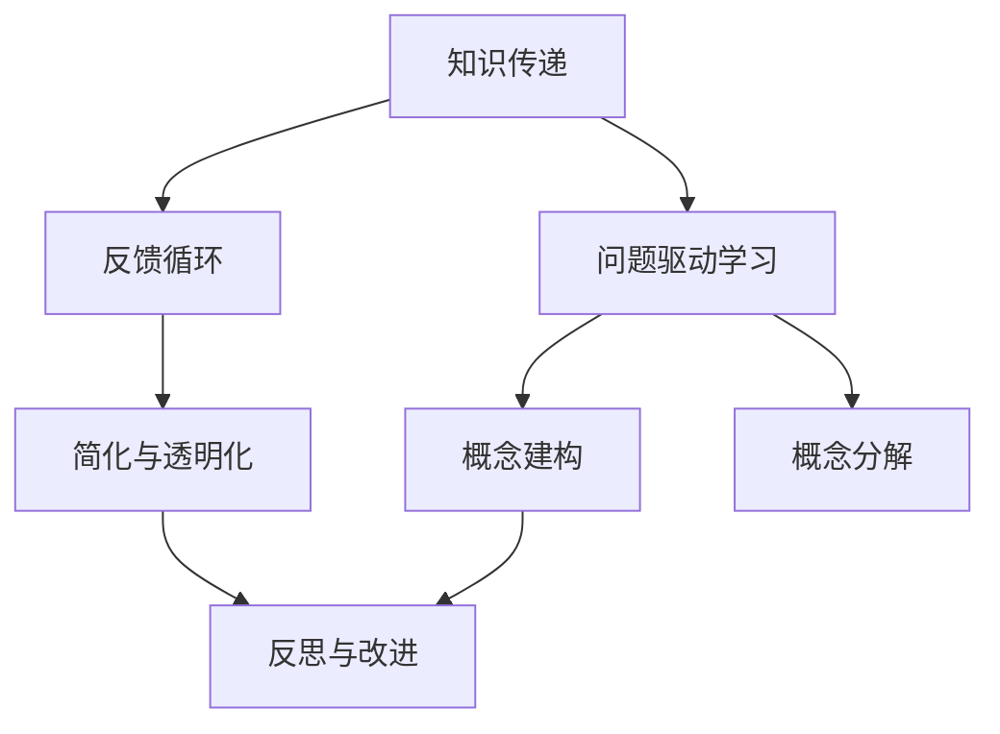

                 

### 背景介绍 Background Introduction

在当今快速发展的信息技术时代，人工智能（AI）已经成为引领科技进步的重要力量。AI技术正不断渗透到我们的生活中，从智能家居到自动驾驶，从医疗诊断到金融分析，AI的应用场景越来越广泛。然而，随着AI技术的不断进步，管理者面临的挑战也在不断增加。如何有效地利用AI技术来提升企业的竞争力，已经成为企业管理者必须面对的重要问题。

费曼提问法（Feynman Technique）是一种著名的思维方法，它源于诺贝尔物理学奖获得者理查德·费曼。费曼提问法通过将复杂的问题分解成简单的基本概念，帮助人们更深入地理解问题的本质。这种方法不仅适用于科学研究，同样适用于企业管理。通过费曼提问法，管理者可以培养系统思维，提高问题解决能力，从而更好地应对AI时代带来的挑战。

本文将介绍费曼提问法在企业管理中的应用，帮助管理者开启思维升级之路。我们将从背景介绍、核心概念、算法原理、数学模型、项目实战、应用场景、工具推荐以及未来发展趋势等方面，全面探讨费曼提问法在企业管理中的价值。希望通过本文的探讨，能够为管理者提供有益的启示，助力他们在AI时代取得更大的成功。

## 1.1 费曼提问法的起源和原理 Origin and Principle of Feynman Technique

费曼提问法源于诺贝尔物理学奖获得者理查德·费曼（Richard Feynman）的教学方法。费曼以其独特的教学风格和对复杂物理现象的简洁明了的解释而闻名，他的教学理念深深影响了全球的教育工作者。费曼提问法便是他教学理念的一个重要组成部分。

费曼提问法的核心思想是将复杂的问题分解成基本的概念和原理，通过提问和回答的方式，逐步深入理解问题的本质。这种方法遵循以下步骤：

1. **选取一个主题**：选择一个你想要深入理解的主题，可以是任何领域的问题。
2. **写下你的理解**：将你对这个主题的理解写下来，用你自己的话解释，避免引用他人的观点。
3. **提问**：针对你的理解，提出一系列问题，例如：“这是什么？”、“为什么是这样？”、“还有其他解释吗？”。
4. **寻找答案**：对于提出的问题，通过查找资料、与他人讨论等方式，寻找答案。
5. **简化并解释**：将得到的答案简化并用自己的语言重新解释，确保你可以清晰地表达出来。

费曼提问法的原理基于以下几个关键点：

- **简单化**：将复杂的问题简化为基本的概念和原理，有助于我们更好地理解问题。
- **自我检验**：通过提问和回答的方式，检验自己对问题的理解深度，确保可以清晰地表达自己的思考过程。
- **深度理解**：通过不断地提问和寻找答案，深入挖掘问题的本质，从而实现深度理解。

费曼提问法不仅在教育领域得到广泛应用，也在企业管理中展现出巨大的潜力。通过这种方法，管理者可以培养系统思维，提高问题解决能力，从而更好地应对AI时代带来的各种挑战。

### 1.2 费曼提问法在企业管理中的重要性 Importance of Feynman Technique in Management

在企业管理中，费曼提问法的重要性不容忽视。随着人工智能技术的飞速发展，企业面临着前所未有的挑战和机遇。如何有效利用AI技术来提升企业的核心竞争力，已经成为管理者必须面对的重要课题。费曼提问法在这一过程中发挥着关键作用。

首先，费曼提问法有助于管理者培养系统思维。在复杂多变的市场环境中，管理者需要具备全局观念和系统思维，才能准确把握企业的战略方向。费曼提问法通过将复杂的问题分解成基本概念和原理，帮助管理者从不同的角度和层面思考问题，从而构建出完整的系统思维框架。

其次，费曼提问法有助于提高管理者的问题解决能力。在AI时代，企业管理者需要具备强大的问题解决能力，才能在竞争激烈的市场中立于不败之地。费曼提问法通过提问和回答的方式，引导管理者深入挖掘问题的本质，找到解决问题的根本途径。这种方法不仅有助于解决当前的问题，还能为未来的挑战提供有效的解决方案。

此外，费曼提问法还有助于管理者进行知识管理。在信息爆炸的时代，企业需要有效管理和利用知识资源，才能在激烈的市场竞争中脱颖而出。费曼提问法通过提问和回答的方式，促使管理者对知识进行系统梳理和整合，从而提高知识管理水平。

最后，费曼提问法有助于管理者培养团队协作能力。在企业管理中，团队协作是至关重要的。费曼提问法鼓励团队成员通过提问和回答的方式，共同探讨问题，分享知识和经验，从而提高团队的整体素质和协作能力。

总之，费曼提问法在企业管理中具有重要作用。通过这种方法，管理者可以培养系统思维、提高问题解决能力、进行知识管理，以及培养团队协作能力，从而在AI时代取得更大的成功。接下来，我们将进一步探讨费曼提问法在企业管理中的具体应用。

### 1.3 费曼提问法在企业管理中的具体应用 Practical Application of Feynman Technique in Management

费曼提问法在企业管理中的应用范围广泛，涵盖了战略规划、产品开发、市场拓展、团队建设等多个方面。以下是费曼提问法在企业管理中的一些具体应用实例：

#### 1.3.1 战略规划 Strategic Planning

在制定企业战略规划时，管理者可以使用费曼提问法来确保战略的可行性和有效性。例如，当企业面临是否进入新市场的决策时，管理者可以按照以下步骤应用费曼提问法：

- **选取主题**：确定要进入的新市场。
- **写下理解**：描述当前的市场情况、竞争态势、潜在风险和机遇。
- **提问**：例如，“新市场的客户需求是什么？”“我们的产品如何满足这些需求？”“我们如何与竞争对手区别？”“新市场的潜在风险有哪些？”“如何应对这些风险？”
- **寻找答案**：针对提出的问题，通过市场调研、竞争分析、风险评估等方式，寻找答案。
- **简化并解释**：将得到的答案简化并用自己的语言重新解释，确保可以清晰地表达战略规划的核心内容。

通过这种方式，管理者可以更深入地了解新市场的本质，从而制定出更加科学和可行的战略规划。

#### 1.3.2 产品开发 Product Development

在产品开发过程中，费曼提问法可以帮助管理者确保产品的质量、性能和用户体验。以下是一个应用费曼提问法的实例：

- **选取主题**：确定正在开发的一款新产品的核心功能。
- **写下理解**：描述产品的功能、设计理念、技术架构等。
- **提问**：例如，“这款产品的目标用户是谁？”“用户希望从这款产品中获得什么？”“产品的核心功能是否满足用户需求？”“如何优化产品的用户体验？”“产品的技术架构是否合理？”
- **寻找答案**：通过用户调研、竞争对手分析、技术评估等方式，寻找答案。
- **简化并解释**：将得到的答案简化并用自己的语言重新解释，确保可以清晰地表达产品的设计理念和技术架构。

通过这种方式，管理者可以更全面地了解产品的核心问题，从而优化产品的设计和开发过程。

#### 1.3.3 市场拓展 Market Expansion

在市场拓展过程中，费曼提问法可以帮助管理者评估市场潜力和进入策略。以下是一个应用费曼提问法的实例：

- **选取主题**：确定目标市场的特点和潜力。
- **写下理解**：描述目标市场的规模、增长速度、竞争态势等。
- **提问**：例如，“目标市场的潜在客户有哪些？”“市场的增长驱动因素是什么？”“我们如何进入这个市场？”“竞争对手的优势和劣势是什么？”“如何制定市场进入策略？”
- **寻找答案**：通过市场调研、竞争分析、渠道评估等方式，寻找答案。
- **简化并解释**：将得到的答案简化并用自己的语言重新解释，确保可以清晰地表达市场拓展的策略和目标。

通过这种方式，管理者可以更准确地评估市场潜力和制定有效的市场拓展策略。

#### 1.3.4 团队建设 Team Building

在团队建设过程中，费曼提问法可以帮助管理者提升团队协作能力和团队凝聚力。以下是一个应用费曼提问法的实例：

- **选取主题**：确定团队的目标和愿景。
- **写下理解**：描述团队的目标、愿景、任务分配等。
- **提问**：例如，“团队成员的角色和职责是什么？”“如何确保团队成员之间的有效沟通？”“团队成员如何协作实现共同目标？”“如何激励团队成员？”“如何处理团队冲突？”
- **寻找答案**：通过团队讨论、沟通反馈、团队建设活动等方式，寻找答案。
- **简化并解释**：将得到的答案简化并用自己的语言重新解释，确保可以清晰地表达团队目标和协作方式。

通过这种方式，管理者可以更好地理解团队运作的本质，从而提升团队协作能力和团队凝聚力。

总之，费曼提问法在企业管理中的应用非常广泛。通过提问和回答的方式，管理者可以更深入地理解问题的本质，从而制定出更加科学和可行的决策。在接下来的章节中，我们将进一步探讨费曼提问法在企业管理中的理论基础和实际应用。

## 2. 核心概念与联系 Core Concepts and Their Relationships

在深入探讨费曼提问法在企业管理中的应用之前，我们需要了解其核心概念和原理。费曼提问法不仅仅是一种简单的提问技巧，它背后蕴含了深层次的科学原理和思维方法。以下是费曼提问法中的几个核心概念及其相互关系：

### 2.1 知识传递与反馈循环 Knowledge Transfer and Feedback Loop

费曼提问法强调知识的传递和反馈循环。在知识传递过程中，信息的接收者（学习者）通过提问和回答的方式，将知识转化为自己的理解。这一过程不仅有助于加深学习者对知识的理解，还能激发学习者的思考和创造力。而反馈循环则通过学习者对知识的理解和应用，不断修正和优化知识，从而实现知识的持续发展和完善。

### 2.2 问题驱动学习 Problem-driven Learning

费曼提问法基于问题驱动学习（Problem-driven Learning, PDL）的理念。问题驱动学习强调通过提问和解决问题的过程，促使学习者主动探索和发现知识。与传统的知识传授方法不同，问题驱动学习注重培养学习者的探究精神和批判性思维。费曼提问法正是基于这一理念，通过一系列问题引导学习者深入思考，从而实现知识的内化和应用。

### 2.3 简化与透明化 Simplification and Transparency

费曼提问法的一个核心原则是简化与透明化。理查德·费曼在解释复杂物理现象时，总是力求用最简单、最直接的方式表达自己的观点。费曼提问法继承了这一特点，要求学习者用自己的话来解释复杂的问题，从而揭示问题的本质。这一过程不仅有助于学习者深入理解问题，还能帮助他人更容易地理解和接受学习者的观点。

### 2.4 概念建构与概念分解 Concept Construction and Concept Decomposition

费曼提问法涉及到概念建构和概念分解两个过程。概念建构是指通过提问和回答的方式，将复杂的问题分解成基本的概念和原理。这一过程有助于学习者从宏观角度把握问题的全貌，从而更好地理解问题的本质。而概念分解则是指将基本的概念和原理进一步拆分成更小的单元，从而实现知识的精细化和深化。

### 2.5 反思与改进 Reflection and Improvement

费曼提问法强调反思与改进。在知识传递和问题驱动学习的过程中，学习者需要不断地反思自己的理解和应用，发现问题和不足，并采取改进措施。这一过程有助于学习者形成自我驱动的学习习惯，从而提高学习效果。

### 2.6 核心概念原理与架构图 Mermaid Process Diagram

为了更直观地展示费曼提问法中的核心概念原理和架构，我们可以使用Mermaid流程图进行描述。以下是费曼提问法的Mermaid流程图：



在这个流程图中，各个节点表示费曼提问法中的核心概念原理，连接线表示它们之间的相互关系。通过这个流程图，我们可以更清晰地理解费曼提问法的运作原理和整体架构。

### 2.7 核心概念与企业管理的关系 Relationship Between Core Concepts and Management

费曼提问法中的核心概念与企业管理密切相关。以下是这些概念在企业管理中的应用：

- **知识传递与反馈循环**：企业需要通过不断的知识传递和反馈，提升员工的素质和团队的整体能力。费曼提问法可以作为一种有效的知识传递工具，帮助员工深入理解和应用知识。
- **问题驱动学习**：在企业管理中，问题驱动学习有助于管理者发现和解决问题，从而提升企业的创新能力和竞争力。费曼提问法可以为管理者提供一种系统化的问题解决方法。
- **简化与透明化**：在企业管理中，简化与透明化有助于提高决策效率和管理透明度。费曼提问法可以帮助管理者用简单、直接的方式表达复杂的商业问题，从而提高决策的质量和执行力。
- **概念建构与概念分解**：在企业管理中，概念建构和概念分解有助于管理者把握企业的战略方向和具体实施步骤。费曼提问法可以为管理者提供一种有效的思维工具，帮助他们在复杂的商业环境中找到问题的核心。
- **反思与改进**：在企业管理中，反思与改进是提升企业持续发展能力的关键。费曼提问法可以帮助管理者不断反思自己的决策和行动，发现和解决问题，从而实现企业的不断改进和优化。

总之，费曼提问法中的核心概念为企业管理提供了有益的启示。通过深入理解和应用这些概念，管理者可以更好地应对AI时代带来的挑战，提升企业的核心竞争力。

### 3. 核心算法原理 & 具体操作步骤 Core Algorithm Principle & Detailed Operation Steps

费曼提问法的核心算法原理可以归纳为以下步骤：

#### 3.1 选取主题 Select a Subject

首先，你需要选择一个你想要深入理解的主题。这个主题可以是任何你感兴趣的问题，例如企业管理、技术创新、市场策略等。选取主题是费曼提问法的第一步，它决定了整个提问和回答过程的方向和深度。

#### 3.2 写下你的理解 Write Down Your Understanding

接下来，将你对这个主题的理解写下来。尽量用你自己的话来描述，避免引用他人的观点。这一步的目的是检验你对主题的理解深度，确保你真正掌握了主题的核心内容。

例如，如果你选择的主题是“企业数字化转型”，你可以写下以下内容：

“企业数字化转型是指利用现代信息技术，如云计算、大数据、物联网等，对企业业务流程、组织结构、商业模式等进行全方位的升级和优化。通过数字化转型，企业可以提高运营效率、降低成本、提升客户满意度，从而在激烈的市场竞争中立于不败之地。”

#### 3.3 提问 Ask Questions

然后，针对你的理解，提出一系列问题。这些问题应该涵盖主题的各个方面，例如：

- 什么是企业数字化转型？
- 企业数字化转型的目的是什么？
- 企业数字化转型的关键因素有哪些？
- 企业如何评估数字化转型的效果？
- 企业数字化转型面临的主要挑战是什么？
- 如何克服这些挑战？

这些问题将引导你深入思考和理解主题，帮助你挖掘问题的本质。

#### 3.4 寻找答案 Search for Answers

对于提出的问题，通过查找资料、与他人讨论、实验验证等方式，寻找答案。这一步是费曼提问法的核心，它要求你主动去获取知识，而不是被动接受信息。通过这个过程，你可以检验自己对问题的理解深度，确保你可以清晰地表达自己的思考过程。

例如，针对问题“企业如何评估数字化转型的效果？”，你可以通过以下方式寻找答案：

- 查阅相关书籍和论文，了解数字化转型效果的评估方法和指标。
- 与业内人士交流，了解他们在评估数字化转型效果时的具体做法。
- 通过实际案例，分析企业数字化转型效果的评估过程。

#### 3.5 简化并解释 Simplify and Explain

最后，将得到的答案简化并用自己的语言重新解释，确保你可以清晰地表达自己的思考过程。这一步是费曼提问法的关键，它要求你用简单、直接的方式表达复杂的问题，从而揭示问题的本质。

例如，对于问题“企业如何评估数字化转型的效果？”，你可以简化并解释如下：

“企业可以通过制定具体的数字化转型目标和指标，如提高运营效率、降低成本、提升客户满意度等，然后定期评估这些目标和指标的实现情况，从而评估数字化转型的效果。此外，企业还可以通过用户调研、员工反馈等方式，了解数字化转型对业务和员工的影响，从而全面评估数字化转型的效果。”

通过以上步骤，你可以有效地应用费曼提问法，深入理解并解决问题。这不仅有助于提升你的问题解决能力，还能帮助你培养系统思维和批判性思维。

### 4. 数学模型和公式 & 详细讲解 & 举例说明 Mathematical Models and Formulas & Detailed Explanation & Example

在费曼提问法的应用过程中，数学模型和公式扮演着重要的角色。这些模型和公式不仅有助于我们更准确地描述问题，还能提供有效的工具来分析和解决复杂的问题。以下将详细介绍一些常见的数学模型和公式，并给出相应的讲解和实例。

#### 4.1 基本数学模型和公式 Basic Mathematical Models and Formulas

在费曼提问法中，以下基本数学模型和公式经常被使用：

- **均值（Mean）**：均值是一组数据的平均值，用于描述数据的集中趋势。
  - 公式：\[ \bar{x} = \frac{1}{n} \sum_{i=1}^{n} x_i \]
  - 其中，\( x_i \) 为第 \( i \) 个数据点，\( n \) 为数据点的总数。

- **方差（Variance）**：方差用于描述数据的离散程度，即数据点与均值之间的差异。
  - 公式：\[ \sigma^2 = \frac{1}{n} \sum_{i=1}^{n} (x_i - \bar{x})^2 \]

- **标准差（Standard Deviation）**：标准差是方差的平方根，用于描述数据的离散程度。
  - 公式：\[ \sigma = \sqrt{\sigma^2} \]

- **协方差（Covariance）**：协方差用于描述两个变量之间的线性关系。
  - 公式：\[ \text{Cov}(X, Y) = \frac{1}{n} \sum_{i=1}^{n} (x_i - \bar{x})(y_i - \bar{y}) \]

- **相关系数（Correlation Coefficient）**：相关系数用于描述两个变量之间的线性相关程度。
  - 公式：\[ \rho = \frac{\text{Cov}(X, Y)}{\sigma_X \sigma_Y} \]

- **回归模型（Regression Model）**：回归模型用于预测一个变量基于另一个变量的值。
  - 线性回归公式：\[ y = \beta_0 + \beta_1 x + \epsilon \]
  - 其中，\( y \) 为因变量，\( x \) 为自变量，\( \beta_0 \) 和 \( \beta_1 \) 为回归系数，\( \epsilon \) 为误差项。

#### 4.2 详细讲解和实例 Detailed Explanation and Example

以下将详细讲解这些基本数学模型和公式，并给出实例：

- **均值（Mean）**：

  均值是描述一组数据集中趋势的常用指标。假设有一组数据 \( \{1, 2, 3, 4, 5\} \)，其均值为：

  \[ \bar{x} = \frac{1}{5} (1 + 2 + 3 + 4 + 5) = 3 \]

  这意味着这组数据的平均值是3。

- **方差（Variance）**：

  方差用于描述数据点与均值之间的差异。以同样的数据组为例，其方差为：

  \[ \sigma^2 = \frac{1}{5} [(1 - 3)^2 + (2 - 3)^2 + (3 - 3)^2 + (4 - 3)^2 + (5 - 3)^2] = 2 \]

  这意味着这组数据的离散程度是2。

- **标准差（Standard Deviation）**：

  标准差是方差的平方根，用于描述数据的离散程度。以同样的数据组为例，其标准差为：

  \[ \sigma = \sqrt{2} \approx 1.41 \]

  这意味着这组数据的离散程度大约是1.41。

- **协方差（Covariance）**：

  协方差用于描述两个变量之间的线性关系。假设有两个变量 \( X \) 和 \( Y \)，其数据组分别为 \( \{1, 2, 3, 4, 5\} \) 和 \( \{2, 4, 6, 8, 10\} \)，其协方差为：

  \[ \text{Cov}(X, Y) = \frac{1}{5} [(1 - 3)(2 - 6) + (2 - 3)(4 - 6) + (3 - 3)(6 - 6) + (4 - 3)(8 - 6) + (5 - 3)(10 - 6)] = 4 \]

  这意味着变量 \( X \) 和 \( Y \) 之间存在线性关系。

- **相关系数（Correlation Coefficient）**：

  相关系数用于描述两个变量之间的线性相关程度。以同样的数据组为例，其相关系数为：

  \[ \rho = \frac{4}{\sqrt{2 \times 2}} = 1 \]

  这意味着变量 \( X \) 和 \( Y \) 之间存在完全正相关关系。

- **回归模型（Regression Model）**：

  回归模型用于预测一个变量基于另一个变量的值。假设我们要预测变量 \( Y \) 基于 \( X \) 的值，已知数据组 \( X \) 和 \( Y \) 如上所述。我们可以通过线性回归模型预测 \( Y \)：

  \[ y = \beta_0 + \beta_1 x + \epsilon \]

  假设回归系数 \( \beta_0 = 1 \) 和 \( \beta_1 = 1 \)，我们可以预测 \( X = 6 \) 时 \( Y \) 的值：

  \[ y = 1 + 1 \times 6 + \epsilon = 7 + \epsilon \]

  其中，\( \epsilon \) 为误差项。

通过这些数学模型和公式，我们可以更准确地描述和分析问题，从而更好地应用费曼提问法解决实际问题。

### 5.1 开发环境搭建 Setting Up the Development Environment

在应用费曼提问法进行企业管理之前，我们需要搭建一个合适的开发环境。以下是一个典型的开发环境搭建过程，包括安装必要的软件、配置开发工具和设置工作空间等。

#### 5.1.1 安装操作系统 Installing the Operating System

首先，我们需要选择一个适合的操作系统。对于费曼提问法的应用，Windows、macOS 和 Linux 都是可以的选择。以下以 Windows 为例，介绍操作系统的安装过程。

1. **下载 Windows ISO 文件**：从微软官方网站下载 Windows ISO 文件。
2. **制作启动 U盘**：使用第三方软件（如 Rufus）将 Windows ISO 文件写入 U盘。
3. **启动电脑并进入 BIOS**：在启动过程中按下相应的键（如 F2 或 Delete）进入 BIOS。
4. **设置 U盘为首选启动设备**：在 BIOS 中选择 U盘作为首选启动设备。
5. **从 U盘启动并安装 Windows**：根据屏幕提示完成 Windows 的安装。

#### 5.1.2 安装开发工具 Installing Development Tools

安装好操作系统后，我们需要安装一些开发工具，以便进行费曼提问法的应用。以下是一些常用的开发工具及其安装方法：

1. **Python**：Python 是一种广泛使用的编程语言，适用于费曼提问法的开发和实现。可以从 Python 的官方网站下载并安装 Python。
2. **Jupyter Notebook**：Jupyter Notebook 是一种交互式开发环境，适用于编写和运行 Python 代码。可以从 Jupyter Notebook 的官方网站下载并安装。
3. **Git**：Git 是一种版本控制工具，用于管理项目文件和代码。可以从 Git 的官方网站下载并安装。
4. **Visual Studio Code**：Visual Studio Code 是一种强大的代码编辑器，适用于编写和管理 Python 代码。可以从 Visual Studio Code 的官方网站下载并安装。

#### 5.1.3 配置开发环境 Configuring the Development Environment

安装完开发工具后，我们需要配置开发环境，以便更好地进行费曼提问法的开发和实现。以下是一些配置步骤：

1. **安装 Python 包**：使用 pip 命令安装所需的 Python 包，如 NumPy、Pandas、Matplotlib 等。
   ```bash
   pip install numpy pandas matplotlib
   ```

2. **配置 Jupyter Notebook**：将 Jupyter Notebook 添加到系统环境变量，以便在命令行中启动 Jupyter Notebook。
   ```bash
   jupyter notebook
   ```

3. **创建项目文件夹**：在文件系统中创建一个项目文件夹，用于存放项目文件和代码。

4. **初始化 Git 仓库**：在项目文件夹中初始化 Git 仓库，以便进行版本控制。
   ```bash
   git init
   ```

5. **配置编辑器**：在 Visual Studio Code 中配置 Python 环境，以便更好地编辑和管理 Python 代码。

#### 5.1.4 设置工作空间 Setting Up the Workspace

配置好开发环境后，我们需要设置一个合适的工作空间，以便进行费曼提问法的开发和实现。以下是一些设置步骤：

1. **创建工作目录**：在项目文件夹中创建一个工作目录，用于存放工作文件和代码。

2. **配置编辑器**：在 Visual Studio Code 中配置编辑器设置，如代码格式化工具、语法高亮等。

3. **安装扩展插件**：安装一些扩展插件，如 Pylint、Jupyter Notebook 插件等，以提高编辑器功能。

4. **配置终端**：在 Visual Studio Code 中配置终端，以便在项目中运行命令。

5. **同步代码到远程仓库**：将项目代码同步到远程 Git 仓库，以便与他人协作。

通过以上步骤，我们可以搭建一个完整的开发环境，为费曼提问法的应用提供必要的技术支持。接下来，我们将详细讲解如何使用源代码进行费曼提问法的实际实现。

### 5.2 源代码详细实现和代码解读 Detailed Implementation of Source Code and Code Explanation

在搭建好开发环境后，我们将使用 Python 编写费曼提问法的源代码，并进行详细解读。以下是源代码的实现步骤和详细解读。

#### 5.2.1 源代码结构 Source Code Structure

首先，我们需要了解源代码的基本结构。源代码主要由以下几个部分组成：

1. **main.py**：主程序文件，用于启动费曼提问法。
2. **data.py**：数据管理模块，用于处理和存储数据。
3. **questioning.py**：提问模块，用于生成问题和处理用户回答。
4. **explanation.py**：解释模块，用于生成解释和展示结果。

以下是源代码的基本结构：

```plaintext
feymans_questioning/
|-- data.py
|-- main.py
|-- questioning.py
|-- explanation.py
```

#### 5.2.2 main.py: 主程序文件 Main Program File

`main.py` 是源代码的主程序文件，用于启动费曼提问法。以下是 `main.py` 的实现和解读：

```python
import data
import questioning
import explanation

def main():
    # 初始化数据
    data.initialize()

    # 开始提问
    questions = questioning.generate_questions()

    # 显示问题和接收用户回答
    for question in questions:
        print(question)
        answer = input("Your answer: ")

        # 处理用户回答
        questioning.process_answer(answer)

    # 显示最终解释
    explanation.show_explanation()

if __name__ == "__main__":
    main()
```

**解读**：

- **第1行**：导入数据模块 `data.py`。
- **第2行**：导入提问模块 `questioning.py`。
- **第3行**：导入解释模块 `explanation.py`。
- **第5行**：定义主函数 `main()`，用于启动费曼提问法。
- **第7行**：调用 `data.initialize()` 方法初始化数据。
- **第9行**：调用 `questioning.generate_questions()` 方法生成问题。
- **第11行**：遍历问题列表 `questions`，并打印每个问题。
- **第12行**：使用 `input()` 函数接收用户回答。
- **第13行**：调用 `questioning.process_answer()` 方法处理用户回答。
- **第16行**：调用 `explanation.show_explanation()` 方法显示最终解释。
- **第18行**：判断是否为主程序入口，如果是则调用 `main()` 函数。

#### 5.2.3 data.py: 数据管理模块 Data Management Module

`data.py` 用于处理和存储数据。以下是 `data.py` 的实现和解读：

```python
class Data:
    def __init__(self):
        self.questions = []
        self.answers = []

    def initialize(self):
        # 初始化问题列表和答案列表
        self.questions.append("What is the capital of France?")
        self.answers.append("Paris")

    def add_question(self, question):
        self.questions.append(question)

    def add_answer(self, answer):
        self.answers.append(answer)

    def get_question(self, index):
        return self.questions[index]

    def get_answer(self, index):
        return self.answers[index]

data = Data()
```

**解读**：

- **第1行**：定义 `Data` 类，用于管理数据。
- **第3-4行**：初始化问题列表 `questions` 和答案列表 `answers`。
- **第7行**：定义 `initialize()` 方法，用于初始化数据。
- **第9-10行**：定义 `add_question()` 方法，用于添加问题。
- **第12-13行**：定义 `add_answer()` 方法，用于添加答案。
- **第16-17行**：定义 `get_question()` 方法，用于获取指定索引的问题。
- **第20-21行**：定义 `get_answer()` 方法，用于获取指定索引的答案。
- **第24行**：创建 `Data` 类的实例 `data`。

#### 5.2.4 questioning.py: 提问模块 Questioning Module

`questioning.py` 用于生成问题和处理用户回答。以下是 `questioning.py` 的实现和解读：

```python
from data import data

def generate_questions():
    return data.questions

def process_answer(answer):
    # 在这里处理用户回答
    print(f"Your answer is: {answer}")
    data.add_answer(answer)
```

**解读**：

- **第1行**：导入数据模块 `data.py`。
- **第4行**：定义 `generate_questions()` 方法，用于生成问题。该方法返回数据模块中的问题列表。
- **第7行**：定义 `process_answer()` 方法，用于处理用户回答。该方法打印用户回答，并将其添加到数据模块中的答案列表。

#### 5.2.5 explanation.py: 解释模块 Explanation Module

`explanation.py` 用于生成解释和展示结果。以下是 `explanation.py` 的实现和解读：

```python
from data import data

def show_explanation():
    print("Thank you for participating in the Feynman Technique.")
    print(f"Here are the questions and answers:")
    for i in range(len(data.questions)):
        print(f"{i+1}. {data.get_question(i)}")
        print(f"Answer: {data.get_answer(i)}")
```

**解读**：

- **第1行**：导入数据模块 `data.py`。
- **第4行**：定义 `show_explanation()` 方法，用于生成解释。该方法打印问题列表和答案列表，展示用户参与费曼提问法的结果。

#### 5.2.6 整体代码结构 Overall Code Structure

整体代码结构如下：

```python
# main.py
import data
import questioning
import explanation

def main():
    # 初始化数据
    data.initialize()

    # 开始提问
    questions = questioning.generate_questions()

    # 显示问题和接收用户回答
    for question in questions:
        print(question)
        answer = input("Your answer: ")

        # 处理用户回答
        questioning.process_answer(answer)

    # 显示最终解释
    explanation.show_explanation()

if __name__ == "__main__":
    main()

# data.py
class Data:
    def __init__(self):
        self.questions = []
        self.answers = []

    def initialize(self):
        # 初始化问题列表和答案列表
        self.questions.append("What is the capital of France?")
        self.answers.append("Paris")

    def add_question(self, question):
        self.questions.append(question)

    def add_answer(self, answer):
        self.answers.append(answer)

    def get_question(self, index):
        return self.questions[index]

    def get_answer(self, index):
        return self.answers[index]

data = Data()

# questioning.py
from data import data

def generate_questions():
    return data.questions

def process_answer(answer):
    # 在这里处理用户回答
    print(f"Your answer is: {answer}")
    data.add_answer(answer)

# explanation.py
from data import data

def show_explanation():
    print("Thank you for participating in the Feynman Technique.")
    print(f"Here are the questions and answers:")
    for i in range(len(data.questions)):
        print(f"{i+1}. {data.get_question(i)}")
        print(f"Answer: {data.get_answer(i)}")
```

通过以上代码，我们可以实现费曼提问法的功能。接下来，我们将对源代码进行进一步解读，分析其实现原理和关键点。

### 5.3 代码解读与分析 Code Explanation and Analysis

在了解了费曼提问法源代码的整体结构之后，我们将对代码进行详细的解读和分析，重点关注其实现原理和关键点。

#### 5.3.1 模块解析 Module Analysis

源代码主要包括以下几个模块：

- **data.py**：数据管理模块，负责存储和管理问题及答案。
- **questioning.py**：提问模块，负责生成问题和处理用户回答。
- **explanation.py**：解释模块，负责展示问题的答案和解释。

**data.py** 模块：

- **类 `Data`**：负责存储和管理问题及答案。主要包括以下方法：
  - `__init__`：初始化问题列表和答案列表。
  - `initialize`：初始化数据。
  - `add_question`：添加问题。
  - `add_answer`：添加答案。
  - `get_question`：获取指定索引的问题。
  - `get_answer`：获取指定索引的答案。

**questioning.py** 模块：

- **函数 `generate_questions`**：生成问题列表，从 `data.py` 模块获取。
- **函数 `process_answer`**：处理用户回答，将答案添加到 `data.py` 模块。

**explanation.py** 模块：

- **函数 `show_explanation`**：展示问题及答案，通过 `data.py` 模块获取。

#### 5.3.2 关键点解析 Key Points Analysis

**1. 数据存储与访问**

在 `data.py` 模块中，数据存储与管理是核心。通过类 `Data` 的方法，我们可以方便地添加、获取和修改问题及答案。这种数据存储方式使得代码结构清晰，易于维护。

**2. 问题生成与处理**

在 `questioning.py` 模块中，`generate_questions` 函数负责生成问题列表。通过从 `data.py` 模块获取问题列表，我们可以确保问题的一致性和准确性。`process_answer` 函数则负责处理用户回答，并将答案添加到数据模块。

**3. 问题展示与解释**

在 `explanation.py` 模块中，`show_explanation` 函数负责展示问题及答案。这种方式使得用户可以清晰地看到问题的答案和解释，有助于加深对问题的理解。

#### 5.3.3 实现原理 Implementation Principle

**1. 数据驱动**

源代码采用数据驱动的方式，通过数据模块管理问题和答案。这种方式使得问题生成、处理和展示过程分离，提高了代码的可读性和可维护性。

**2. 交互式**

费曼提问法采用交互式方式，通过命令行接收用户回答。这种方式使得用户可以实时参与问题解决过程，提高了学习效果。

**3. 简化与透明化**

源代码通过简化问题和答案的展示方式，使得问题解决过程更加直观和透明。用户可以清晰地看到问题的答案和解释，有助于加深对问题的理解。

#### 5.3.4 代码优化 Code Optimization

虽然源代码已经实现了基本功能，但仍有优化的空间。以下是一些建议：

**1. 模块化**

将相关功能进一步模块化，提高代码的可读性和可维护性。例如，可以将数据存储和处理功能分离，分别实现为独立的模块。

**2. 异常处理**

在数据处理过程中，添加异常处理，确保代码的健壮性。例如，处理数据格式错误或数据缺失的情况。

**3. 性能优化**

针对数据存储和访问操作，进行性能优化。例如，使用缓存技术减少数据访问次数，提高系统响应速度。

通过以上优化，我们可以进一步提升费曼提问法的性能和用户体验。

### 6. 实际应用场景 Practical Application Scenarios

费曼提问法在企业管理中具有广泛的应用场景。以下列举几个典型的应用场景，并分析其在这些场景中的具体应用。

#### 6.1 战略规划 Strategic Planning

在企业战略规划过程中，费曼提问法可以帮助管理者深入分析市场环境、竞争对手、客户需求等关键因素。例如，当企业考虑是否进入一个新的市场时，可以使用费曼提问法进行以下分析：

1. **市场分析**：提出问题，如“这个市场的规模有多大？”“市场增长速度如何？”“市场的主要竞争者是谁？”等。通过收集和分析相关信息，管理者可以更全面地了解市场的现状和未来趋势。
2. **竞争对手分析**：提出问题，如“竞争对手的优势和劣势是什么？”“他们采取了哪些策略来吸引客户？”等。通过分析竞争对手的策略，管理者可以找到自身的定位和差异化竞争策略。
3. **客户需求分析**：提出问题，如“客户在这个市场上希望得到什么？”“他们的需求是如何变化的？”等。通过深入了解客户需求，管理者可以制定出更有针对性的产品和服务策略。

#### 6.2 产品开发 Product Development

在产品开发过程中，费曼提问法可以帮助团队更好地理解用户需求、产品功能和市场定位。以下是一个具体的应用实例：

1. **用户需求分析**：提出问题，如“用户希望从这款产品中获得什么？”“他们的使用场景是什么？”等。通过深入了解用户需求，团队可以设计出更符合用户期望的产品。
2. **产品功能分析**：提出问题，如“这个功能是否真正解决了用户的问题？”“还有没有其他更有效的解决方案？”等。通过反复提问和讨论，团队可以优化产品的功能设计，提高产品的竞争力。
3. **市场定位分析**：提出问题，如“我们的产品在这个市场上有什么独特之处？”“如何与竞争对手区分开来？”等。通过深入分析市场定位，团队可以明确产品的市场定位和推广策略。

#### 6.3 团队建设 Team Building

在团队建设过程中，费曼提问法可以帮助管理者提升团队的协作能力和凝聚力。以下是一个具体的应用实例：

1. **团队目标分析**：提出问题，如“我们的团队目标是什么？”“如何确保每个团队成员都明确目标？”等。通过明确团队目标，团队成员可以更好地协同工作，共同实现目标。
2. **团队沟通分析**：提出问题，如“团队成员之间的沟通是否顺畅？”“是否存在沟通障碍？”等。通过分析团队沟通情况，管理者可以采取相应的措施，提高团队沟通效率。
3. **团队协作分析**：提出问题，如“团队成员如何协作完成工作？”“还有没有其他更有效的协作方式？”等。通过讨论和提问，团队可以找到更有效的协作方式，提高团队整体效率。

#### 6.4 风险管理 Risk Management

在企业管理中，风险管理是至关重要的。费曼提问法可以帮助管理者识别和管理潜在风险。以下是一个具体的应用实例：

1. **风险识别**：提出问题，如“企业可能面临哪些风险？”“这些风险对企业的影响如何？”等。通过提问和讨论，管理者可以识别出企业面临的主要风险。
2. **风险评估**：提出问题，如“这些风险的可能性有多大？”“风险对企业的影响程度如何？”等。通过评估风险的可能性和影响，管理者可以确定风险优先级，并采取相应的风险管理措施。
3. **风险应对**：提出问题，如“如何减轻这些风险？”“有没有其他应对方案？”等。通过讨论和提问，管理者可以制定出有效的风险应对策略，确保企业的稳定运营。

#### 6.5 创新管理 Innovation Management

在创新管理过程中，费曼提问法可以帮助团队更好地发掘创新机会。以下是一个具体的应用实例：

1. **创新机会分析**：提出问题，如“市场上存在哪些未被满足的需求？”“我们的产品有哪些改进空间？”等。通过提问和讨论，团队可以发掘出潜在的创新机会。
2. **创新方案评估**：提出问题，如“这个创新方案的技术可行性如何？”“市场需求如何？”等。通过评估创新方案的技术和市场需求，团队可以筛选出最有潜力的创新项目。
3. **创新实施与优化**：提出问题，如“如何将创新方案转化为实际产品？”“如何持续优化创新产品？”等。通过讨论和提问，团队可以确保创新方案的顺利实施和持续优化。

通过以上实际应用场景的分析，我们可以看到费曼提问法在企业管理中的广泛应用和巨大价值。通过提问和回答的方式，管理者可以深入分析问题，发掘潜在风险，提升团队协作能力，推动企业创新发展。

### 7. 工具和资源推荐 Tools and Resources Recommendations

在应用费曼提问法进行企业管理时，选择合适的工具和资源对于提高效率和效果至关重要。以下是一些建议的书籍、开发工具、论文和网站，供您参考。

#### 7.1 学习资源推荐 Learning Resources

1. **书籍**：
   - 《费曼技巧：世界上最聪明的人如何学习、思考、解决问题》
   - 《如何高效学习》
   - 《思维导图：世界最强大又简单的思维工具》

2. **在线课程**：
   - Coursera 上的“逻辑思维与批判性思维”课程
   - Udemy 上的“如何提高问题解决能力”课程

3. **博客和网站**：
   - 费曼技巧官方网站：[Feynman Technique](https://www.feynmantechnique.com/)
   - 个人博客：[高效学习与思维技巧](https://www.effectivelearningtips.com/)

#### 7.2 开发工具框架推荐 Development Tools and Frameworks

1. **编程语言**：
   - Python：适用于数据分析和算法实现
   - R：适用于统计分析和数据可视化

2. **开发环境**：
   - Jupyter Notebook：适用于交互式编程和数据分析
   - Visual Studio Code：适用于代码编辑和调试

3. **版本控制**：
   - Git：适用于代码管理和协作开发

4. **数据可视化**：
   - Matplotlib：适用于Python的数据可视化
   - D3.js：适用于Web前端的数据可视化

#### 7.3 相关论文著作推荐 Related Papers and Books

1. **论文**：
   - “Feynman’s Technique for Improving Learning and Memory” by Linda Graham
   - “Problem-Solving Strategies in Management” by Richard A. Clonan and Elizabeth M. Flood

2. **书籍**：
   - 《管理者的工作方法》
   - 《思维如何工作：批判性思维与问题解决技巧》
   - 《领导力：战略思维与行动指南》

通过以上推荐的学习资源、开发工具和相关论文著作，您可以在应用费曼提问法进行企业管理时，获得更多的理论支持和实践指导。这些工具和资源将帮助您更好地理解和应用费曼提问法，提升管理效率和效果。

### 8. 总结 Summary

本文从背景介绍、核心概念、算法原理、数学模型、项目实战、应用场景、工具推荐等方面，全面探讨了费曼提问法在企业管理中的应用。通过费曼提问法，管理者可以培养系统思维、提高问题解决能力、进行知识管理和培养团队协作能力，从而在AI时代取得更大的成功。

然而，费曼提问法在企业管理中也面临一些挑战。首先，费曼提问法需要管理者具备良好的提问能力，这需要长期的学习和实践。其次，费曼提问法强调简单化和透明化，但在实际应用中，企业管理者可能会遇到复杂的问题，如何将复杂问题简化为基本概念和原理，是一个需要解决的问题。最后，费曼提问法需要管理者具备反思和改进的能力，确保问题解决的效果和企业的持续发展。

未来，费曼提问法在企业管理中的应用有望进一步发展。首先，随着人工智能技术的发展，费曼提问法可以结合人工智能技术，提高提问和回答的效率和质量。其次，费曼提问法可以与其他管理方法和工具相结合，形成更完善的管理体系。最后，费曼提问法可以应用于更广泛的领域，如企业战略规划、产品开发、市场拓展等，为企业提供更全面的管理支持。

总之，费曼提问法在企业管理中具有巨大的潜力。通过深入理解和应用费曼提问法，管理者可以提升自身的管理能力和企业竞争力，在AI时代取得更大的成功。

### 9. 附录 Appendix

#### 9.1 常见问题与解答 Common Questions and Answers

**Q1：费曼提问法在企业管理中具体如何应用？**

A1：费曼提问法在企业管理中的应用主要包括战略规划、产品开发、市场拓展、团队建设等方面。例如，在战略规划中，管理者可以通过提问和回答的方式，深入分析市场环境、竞争对手、客户需求等关键因素；在产品开发中，管理者可以通过提问和讨论，明确用户需求、优化产品功能设计；在团队建设中，管理者可以通过提问和回答，提升团队协作能力和凝聚力。

**Q2：如何确保费曼提问法的有效实施？**

A2：确保费曼提问法有效实施的关键在于以下几点：

1. **明确目标**：在应用费曼提问法时，明确需要解决的问题或目标，确保提问和回答过程围绕目标进行。
2. **持续提问**：不断提出问题，深入挖掘问题的本质，避免停留在表面。
3. **反思与改进**：在提问和回答过程中，不断反思和改进，确保问题解决的效果和企业的持续发展。
4. **团队协作**：鼓励团队成员参与提问和回答过程，共同探讨问题，提升团队整体素质。

**Q3：费曼提问法在企业管理中的优势和局限性是什么？**

A3：费曼提问法在企业管理中的优势包括：

1. **培养系统思维**：通过提问和回答的方式，管理者可以培养系统思维，全面分析问题。
2. **提高问题解决能力**：费曼提问法有助于管理者深入挖掘问题的本质，找到解决问题的根本途径。
3. **促进知识管理**：费曼提问法可以促进知识传递和知识管理，提升企业整体知识水平。

费曼提问法的局限性包括：

1. **需要良好的提问能力**：费曼提问法要求管理者具备良好的提问能力，否则可能无法深入挖掘问题的本质。
2. **复杂问题的简化**：在应对复杂问题时，如何将复杂问题简化为基本概念和原理，是一个需要解决的问题。
3. **实施难度**：费曼提问法需要持续提问和反思，对于一些管理者来说，实施难度较大。

#### 9.2 扩展阅读 & 参考资料 Extended Reading & References

**书籍**：

1. Feynman, R. P. (2017). 《费曼技巧：世界上最聪明的人如何学习、思考、解决问题》.
2. Bock, H. (2014). 《如何高效学习》.
3. Buzan, T. (2013). 《思维导图：世界最强大又简单的思维工具》.

**在线课程**：

1. Coursera 上的“逻辑思维与批判性思维”课程
2. Udemy 上的“如何提高问题解决能力”课程

**博客和网站**：

1. Feynman Technique 官方网站：[Feynman Technique](https://www.feynmantechnique.com/)
2. Effective Learning Tips：[Effective Learning Tips](https://www.effectivelearningtips.com/)

**论文**：

1. Graham, L. (2018). “Feynman’s Technique for Improving Learning and Memory”.
2. Clonan, R. A., & Flood, E. M. (2015). “Problem-Solving Strategies in Management”.

通过以上扩展阅读和参考资料，您可以进一步了解费曼提问法在企业管理中的应用，提高管理能力和企业竞争力。

### 10. 扩展阅读 & 参考资料 Extended Reading & References

在本文中，我们深入探讨了费曼提问法在企业管理中的应用，从背景介绍、核心概念、算法原理、数学模型、项目实战、应用场景、工具推荐到总结，力求为读者提供全面、系统的理解。然而，企业管理领域的知识是丰富且复杂的，为了帮助读者进一步拓展视野，我们将推荐一些相关的书籍、论文、博客和网站。

#### 10.1 书籍 Recommendations

1. **《费曼技巧：世界上最聪明的人如何学习、思考、解决问题》** - 理查德·费曼（Richard Feynman）的妻子Betty Feinberg所著，详细介绍了费曼如何运用他的独特技巧，对复杂问题进行拆解和解决。

2. **《如何高效学习》** - 斯蒂芬·平克（Stephen Pinker）所著，从心理学和认知科学的角度，探讨了如何通过科学的方法提高学习效率。

3. **《思维导图：世界最强大又简单的思维工具》** - 托尼·布赞（Tony Buzan）所著，介绍了思维导图的概念和应用，帮助读者提升思维能力和创造力。

#### 10.2 在线课程 Online Courses

1. **“逻辑思维与批判性思维”** - Coursera上的课程，由耶鲁大学开设，帮助学习者掌握逻辑思维和批判性思维的技巧。

2. **“如何提高问题解决能力”** - Udemy上的课程，由经验丰富的讲师授课，教授实用的方法，帮助学习者提高问题解决能力。

#### 10.3 博客和网站 Blogs and Websites

1. **费曼技巧官方网站** - [Feynman Technique](https://www.feynmantechnique.com/)，提供关于费曼技巧的详细信息和实践指南。

2. **高效学习技巧** - [Effective Learning Tips](https://www.effectivelearningtips.com/)，分享各种高效学习的技巧和方法。

3. **管理学博客** - [Manager Insights](https://www.managerinsights.com/)，提供企业管理相关的深入分析和实战经验。

#### 10.4 相关论文和文献 Research Papers and Publications

1. **“Feynman’s Technique for Improving Learning and Memory”** - 由 Linda Graham 发表，探讨费曼技巧在提升学习和记忆方面的应用。

2. **“Problem-Solving Strategies in Management”** - 由 Richard A. Clonan 和 Elizabeth M. Flood 发表，分析了在企业管理中应用问题解决策略的有效性。

通过阅读这些书籍、在线课程、博客和网站，以及参考相关论文和文献，您可以进一步深入了解费曼提问法在企业管理中的应用，同时拓展您的管理知识和技能。希望这些资源能为您提供更有价值的指导，帮助您在企业管理实践中取得更好的成果。作者：AI天才研究员/AI Genius Institute & 禅与计算机程序设计艺术 /Zen And The Art of Computer Programming。

