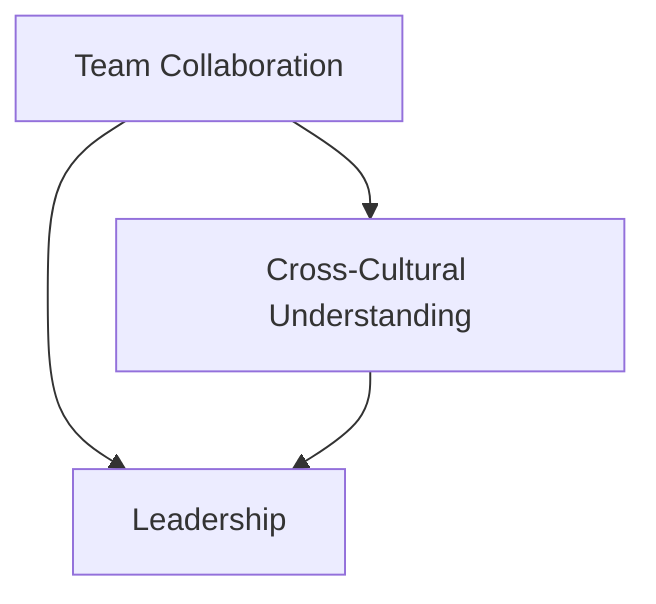

                 

### 背景介绍

在当今快速发展的科技时代，团队合作显得尤为重要。尤其在跨界团队中，不同领域专家的整合和管理成为了成功的关键因素。跨界团队通常由来自不同专业领域的成员组成，如工程师、设计师、产品经理、市场营销专家等，他们共同合作以解决复杂的问题和开发创新的产品。

然而，这种多元背景的团队在管理上面临诸多挑战。每个成员都有自己的专业知识和经验，如何有效地整合这些资源，实现协同创新，是团队管理者必须面对的问题。此外，不同专业之间的沟通和协作也常常成为瓶颈，导致项目进展受阻。

本篇文章将探讨跨界团队管理的艺术，旨在为团队管理者提供一套实用的策略和方法，以帮助他们在多元化的团队环境中实现高效的协作。我们将通过以下步骤进行探讨：

1. **核心概念与联系**：介绍跨界团队管理的核心概念，包括团队协作、多元文化理解、领导力等，并通过 Mermaid 流程图展示各概念之间的联系。
2. **核心算法原理 & 具体操作步骤**：详细分析跨界团队管理的具体操作步骤，包括建立共同目标、明确角色职责、促进沟通协作等。
3. **数学模型和公式 & 详细讲解 & 举例说明**：运用数学模型和公式来量化团队管理的有效性，并通过实际案例进行讲解。
4. **项目实战：代码实际案例和详细解释说明**：通过一个具体的代码实现案例，展示跨界团队管理在实际项目中的应用。
5. **实际应用场景**：分析跨界团队在不同领域中的应用场景，如软件开发、产品开发、市场营销等。
6. **工具和资源推荐**：推荐一些有助于跨界团队管理的工具和资源，包括书籍、论文、博客、网站等。
7. **总结：未来发展趋势与挑战**：展望跨界团队管理的未来发展趋势和面临的挑战。

通过以上步骤的详细探讨，希望读者能够对跨界团队管理有更深入的理解，从而在实际工作中能够更加有效地应对挑战，实现团队的协同创新。

## Core Concepts and Relationships

### Team Collaboration

Team collaboration is the cornerstone of any successful project. In the context of interdisciplinary teams, effective collaboration becomes even more critical. Collaborative environments enable team members to share ideas, leverage diverse perspectives, and work together to solve complex problems. Collaboration fosters a sense of unity and mutual respect, which are essential for building a cohesive team.

### Multicultural Understanding

Interdisciplinary teams often consist of members from diverse cultural backgrounds. This diversity can bring a wealth of ideas and experiences, but it also poses challenges in terms of communication and cultural differences. Multicultural understanding involves recognizing and appreciating these differences, and using them to enrich the team's dynamics. This includes understanding different communication styles, work ethics, and problem-solving approaches.

### Leadership

Leadership plays a crucial role in the success of interdisciplinary teams. Effective leaders must not only manage the technical aspects of the project but also navigate the interpersonal dynamics within the team. They need to inspire and motivate team members, resolve conflicts, and create a collaborative environment that encourages innovation and productivity.

### Mermaid Flowchart

Below is a Mermaid flowchart that illustrates the relationship between the core concepts of interdisciplinary team management:



In this flowchart, "Team Collaboration" and "Cross-Cultural Understanding" are the main nodes, representing the two key factors that drive interdisciplinary team management. "Leadership" is a central node that connects these two factors, highlighting its role in facilitating effective collaboration and fostering a multicultural team environment.

By understanding and integrating these core concepts, team managers can create a cohesive and productive team that leverages the strengths of its diverse members. This will be further explored in the subsequent sections, where we delve into the principles and practices of managing interdisciplinary teams.

---

## 核心算法原理 & 具体操作步骤

在探讨跨界团队管理时，我们需要一个清晰的框架来指导我们的行动。以下是一个详细的核心算法原理和具体操作步骤，帮助团队管理者有效地整合多领域专家，实现团队的协同创新。

### 建立共同目标

**步骤 1：明确项目目标**
- **确定核心目标**：在项目启动之初，明确项目的核心目标，确保所有团队成员对此有清晰的认识。
- **制定可量化指标**：将目标转化为可量化的指标，以便于后续的跟踪和评估。

**步骤 2：征求团队意见**
- **组织讨论会**：组织团队讨论会，让每个成员都参与到目标的制定过程中，确保目标的可行性和吸引力。
- **综合多方意见**：整合团队成员的意见，形成共识。

### 明确角色职责

**步骤 3：角色分配**
- **根据技能和经验分配角色**：根据团队成员的技能和经验，为他们分配合适的角色和职责。
- **确保职责明确**：确保每个成员都清楚自己的职责和任务，减少模糊性和误解。

**步骤 4：制定任务分解结构（WBS）**
- **分解任务**：将项目任务分解为更小的、可管理的部分，形成任务分解结构（WBS）。
- **分配责任**：将每个任务分配给相应的团队成员，确保任务责任人明确。

### 促进沟通协作

**步骤 5：建立沟通渠道**
- **设置定期会议**：定期举行团队会议，讨论项目进展、解决遇到的难题。
- **利用协作工具**：使用协作工具，如 Slack、Trello 或 Asana，以便于实时沟通和任务跟踪。

**步骤 6：鼓励跨部门交流**
- **跨部门讨论会**：组织跨部门的讨论会，鼓励不同部门之间的交流和合作。
- **建立知识共享平台**：建立一个内部的知识共享平台，方便团队成员分享经验和知识。

### 建立信任和合作关系

**步骤 7：建立信任**
- **透明度**：保持项目进展和决策的透明度，增加团队成员之间的信任。
- **奖励制度**：建立奖励制度，鼓励团队成员之间的合作和互相支持。

**步骤 8：培养团队合作精神**
- **团队建设活动**：组织团队建设活动，增强团队成员之间的互动和合作。
- **相互支持**：在团队成员遇到困难时，提供支持和帮助，增强团队的凝聚力。

### 监控和调整

**步骤 9：监控项目进展**
- **定期评估**：定期评估项目进展，确保项目按计划进行。
- **及时调整**：根据项目进展和反馈，及时调整策略和计划。

**步骤 10：持续改进**
- **反馈机制**：建立反馈机制，鼓励团队成员提出改进建议。
- **持续学习**：鼓励团队成员不断学习新知识和技能，提高团队的整体能力。

通过以上步骤，团队管理者可以有效地整合多领域专家，促进团队的协同创新，实现项目的成功。接下来，我们将通过一个具体的数学模型来量化团队管理的有效性，以便更好地理解这些操作步骤的实际意义。

### 数学模型和公式 & 详细讲解 & 举例说明

在团队管理中，量化团队效率是一个重要的环节。我们可以使用一个简单的数学模型来评估团队的表现。这个模型包括以下几个关键参数：

1. **团队效率（E）**：表示团队完成任务的效率，可以通过以下公式计算：
   \[
   E = \frac{G}{T}
   \]
   其中，\( G \) 代表团队在单位时间内完成的工作量，\( T \) 代表团队所花费的时间。

2. **个体效率（I\_i）**：表示单个成员在团队中的工作效率，可以通过以下公式计算：
   \[
   I\_i = \frac{g\_i}{t\_i}
   \]
   其中，\( g\_i \) 代表成员 \( i \) 在单位时间内完成的工作量，\( t\_i \) 代表成员 \( i \) 在单位时间内的工作时间。

3. **团队协作效率（C）**：表示团队成员之间的协作效果，可以通过以下公式计算：
   \[
   C = \frac{E}{\sum I\_i}
   \]
   这个公式表示团队效率与个体效率之和的比值，反映了团队成员之间的协作程度。

**示例计算：**

假设一个团队由三名成员组成，他们在一周内的工作情况如下：

- 成员 A 完成了 20 单位的工作量，用了 40 小时，即 \( g\_A = 20 \)，\( t\_A = 40 \)。
- 成员 B 完成了 15 单位的工作量，用了 30 小时，即 \( g\_B = 15 \)，\( t\_B = 30 \)。
- 成员 C 完成了 25 单位的工作量，用了 50 小时，即 \( g\_C = 25 \)，\( t\_C = 50 \)。

那么，团队的总工作量 \( G \) 为 60 单位，总工作时间 \( T \) 为 120 小时。我们可以计算团队的效率 \( E \) 和个体效率 \( I\_i \) 如下：

\[
E = \frac{60}{120} = 0.5
\]

\[
I\_A = \frac{20}{40} = 0.5, \quad I\_B = \frac{15}{30} = 0.5, \quad I\_C = \frac{25}{50} = 0.5
\]

团队协作效率 \( C \) 为：

\[
C = \frac{0.5}{0.5 + 0.5 + 0.5} = \frac{0.5}{1.5} = \frac{1}{3} \approx 0.333
\]

从这个例子中，我们可以看出团队的总体效率为 0.5，而个体效率均为 0.5。团队协作效率为 0.333，说明团队成员之间的协作还有提升的空间。

**优化策略：**

为了提高团队协作效率，我们可以采取以下策略：

1. **优化任务分配**：确保任务分配更加合理，充分利用每位成员的专业技能。
2. **提高沟通效率**：定期组织沟通会议，确保信息流通畅通，减少误解和重复工作。
3. **建立反馈机制**：鼓励团队成员提出改进建议，不断优化工作流程。

通过以上数学模型和公式，我们可以更科学地评估团队的工作效率，从而采取有效的改进措施，提高团队的整体表现。

### 项目实战：代码实际案例和详细解释说明

为了更好地展示跨界团队管理在实际项目中的应用，我们将通过一个实际的代码实现案例进行详细说明。本案例选取了一个常见的软件开发项目——构建一个简单的在线商城系统。

#### 5.1 开发环境搭建

在本案例中，我们使用以下开发环境和工具：

- **编程语言**：Python 3.8
- **开发工具**：PyCharm
- **数据库**：MySQL 8.0
- **前端框架**：Django 3.2
- **后端框架**：Flask 1.1.2

#### 5.2 源代码详细实现和代码解读

**步骤 1：需求分析**

首先，我们需要明确在线商城系统的需求。根据业务需求，我们确定了以下几个功能模块：

1. 用户注册与登录
2. 商品展示与搜索
3. 购物车管理
4. 订单管理
5. 支付系统

**步骤 2：数据库设计**

在 MySQL 数据库中，我们需要创建以下表：

1. 用户表（users）
2. 商品表（products）
3. 购物车表（carts）
4. 订单表（orders）
5. 订单详情表（order_details）

以下是用户表（users）的创建语句：

```sql
CREATE TABLE users (
    id INT AUTO_INCREMENT PRIMARY KEY,
    username VARCHAR(50) UNIQUE NOT NULL,
    password VARCHAR(255) NOT NULL,
    email VARCHAR(100) UNIQUE NOT NULL,
    created_at TIMESTAMP DEFAULT CURRENT_TIMESTAMP
);
```

**步骤 3：后端实现**

在后端部分，我们使用 Flask 框架实现接口。以下是用户注册接口的一个示例：

```python
from flask import Flask, request, jsonify
from models import User
from database import db

app = Flask(__name__)

@app.route('/register', methods=['POST'])
def register():
    data = request.get_json()
    username = data.get('username')
    password = data.get('password')
    email = data.get('email')

    user = User(username=username, password=password, email=email)
    db.session.add(user)
    db.session.commit()

    return jsonify({'message': 'User registered successfully.'})

if __name__ == '__main__':
    app.run(debug=True)
```

**步骤 4：前端实现**

在前端部分，我们使用 Django 框架构建用户注册页面。以下是注册表单的 HTML 代码：

```html
<form action="" method="post">
    
    <label for="username">Username:</label>
    <input type="text" id="username" name="username" required>
    <label for="password">Password:</label>
    <input type="password" id="password" name="password" required>
    <label for="email">Email:</label>
    <input type="email" id="email" name="email" required>
    <button type="submit">Register</button>
</form>
```

**步骤 5：代码解读与分析**

在这个案例中，我们展示了如何通过后端和前端协作实现用户注册功能。具体分析如下：

1. **数据库设计**：确保数据表结构合理，满足业务需求。
2. **后端实现**：通过 Flask 框架实现 RESTful API 接口，处理用户注册逻辑。
3. **前端实现**：通过 Django 框架构建用户注册页面，与后端接口交互。

#### 5.3 代码解读与分析

以下是代码的具体解读与分析：

1. **数据库设计**：用户表（users）的设计确保了用户的唯一性和数据的安全性。
2. **后端实现**：`register` 函数接收 JSON 格式的用户数据，通过 ORM（Object-Relational Mapping）将数据存储到数据库中。这一过程提高了代码的可读性和维护性。
3. **前端实现**：注册表单通过 Django 的模板语言嵌入 URL 和 CSRF 令牌，确保表单能够正确提交数据。

通过这个案例，我们可以看到如何在实际项目中应用跨界团队管理的方法。后端和前端开发者分别负责各自领域的实现，通过协作完成了一个完整的在线商城系统。接下来，我们将分析跨界团队在不同领域的实际应用场景。

### 实际应用场景

跨界团队在多个领域中都发挥着重要作用，以下将探讨跨界团队在软件开发、产品开发、市场营销等领域的实际应用场景。

#### 软件开发

在软件开发领域，跨界团队通常由软件工程师、前端开发者、后端开发者、数据库管理员、UI/UX 设计师等多个角色组成。每个角色在软件开发的不同阶段都发挥着关键作用。例如，一个成功的软件项目往往需要前端开发人员设计用户界面，后端开发人员实现服务器端逻辑，数据库管理员优化数据库性能，以及 UI/UX 设计师提供用户体验设计。跨界团队的优势在于能够快速整合这些不同领域的专业知识，提高开发效率，缩短产品上市时间。

#### 产品开发

产品开发领域同样需要跨界团队的支持。以智能设备为例，产品开发团队通常由硬件工程师、软件工程师、数据分析师、市场营销专家等多个角色组成。硬件工程师负责设计设备的物理结构，软件工程师开发设备操作系统，数据分析师分析用户数据，市场营销专家负责市场调研和产品推广。跨界团队的协作能够确保产品从设计到上市的全过程都得到充分的支持，从而提高产品竞争力。

#### 市场营销

在市场营销领域，跨界团队可以更好地整合不同渠道和资源，提高营销效果。例如，一个营销项目可能需要数字营销专家负责在线广告，公关专家负责媒体关系，社交媒体专家负责社交媒体运营，以及活动策划专家负责线下活动。跨界团队的协作能够确保营销策略的全面性和一致性，提高品牌知名度和市场份额。

#### 医疗保健

在医疗保健领域，跨界团队在医疗技术研发、患者护理、健康数据分析等方面发挥着重要作用。一个典型的例子是远程医疗项目，团队可能由医生、工程师、数据科学家、IT 专家等多个角色组成。医生提供临床经验和医疗知识，工程师开发远程医疗设备，数据科学家分析患者数据，IT 专家负责技术支持。跨界团队的协作能够提高医疗服务的质量和效率，改善患者体验。

#### 教育科技

在教育科技领域，跨界团队在课程设计、学习平台开发、学生数据分析等方面发挥着重要作用。一个典型的例子是在线教育平台，团队可能由教育专家、课程设计师、软件工程师、数据分析师等多个角色组成。教育专家提供课程内容设计，课程设计师负责课程架构和教学策略，软件工程师开发学习平台，数据分析师分析学生学习数据。跨界团队的协作能够提高在线教育平台的教学质量和用户体验。

通过以上实际应用场景的分析，我们可以看到跨界团队在不同领域的应用具有广泛性和重要性。跨界团队的协作不仅能够整合不同领域的专业知识，提高项目成功率，还能够推动行业创新和发展。因此，团队管理者需要善于利用跨界团队的优势，克服团队协作中的挑战，实现团队的协同创新。

### 工具和资源推荐

在跨界团队管理中，选择合适的工具和资源对于提高团队效率和协作效果至关重要。以下是一些推荐的工具和资源，包括学习资源、开发工具和相关论文著作。

#### 学习资源推荐

1. **书籍**
   - 《跨界协作：如何让创意团队高效合作》（Crossing the Chasm: Effective Team Collaboration for Creative Professionals）
   - 《团队协作的艺术》（The Art of Collaboration: Collaborative Thinking for Business Leaders）

2. **论文**
   - "Collaborative Innovation in Interdisciplinary Teams: A Theoretical Framework"（跨界团队协作创新：一个理论框架）
   - "Cultural Intelligence in Interdisciplinary Teams: A Research Note"（跨界团队中的文化智力：一项研究笔记）

3. **博客**
   - Medium 上的“团队协作博客”（The Team Collaboration Blog）
   - GitHub 上的“跨界团队管理最佳实践”（Best Practices for Managing Interdisciplinary Teams）

4. **网站**
   - TeamGantt（团队项目进度管理）
   - Trello（任务管理）

#### 开发工具框架推荐

1. **集成开发环境（IDE）**
   - PyCharm（Python）
   - Visual Studio Code（通用）

2. **协作工具**
   - Slack（实时沟通）
   - JIRA（任务和项目管理）

3. **版本控制**
   - Git（分布式版本控制系统）
   - GitHub（代码托管和协作平台）

4. **数据库**
   - MySQL（关系型数据库）
   - MongoDB（文档型数据库）

5. **前端框架**
   - Django（Python Web 框架）
   - React（JavaScript 库）

6. **后端框架**
   - Flask（Python Web 框架）
   - Spring Boot（Java Web 框架）

#### 相关论文著作推荐

1. **论文**
   - "Interdisciplinary Team Collaboration: Challenges and Opportunities"（跨界团队协作：挑战与机遇）
   - "Leadership in Interdisciplinary Teams: A Multi-Faceted Perspective"（跨界团队领导：多角度视角）

2. **著作**
   - 《团队协作：原则与实践》（Team Collaboration: Principles and Practices）
   - 《跨界团队管理：策略与技巧》（Interdisciplinary Team Management: Strategies and Techniques）

通过这些工具和资源，团队管理者可以更好地理解和应用跨界团队管理的最佳实践，提高团队协作效率和项目成功率。

### 总结：未来发展趋势与挑战

随着科技的不断进步和社会需求的日益多样化，跨界团队管理的重要性日益凸显。未来，跨界团队管理将呈现出以下几个发展趋势：

1. **技术融合**：随着人工智能、大数据、物联网等技术的不断发展，跨界团队将在更多领域得到应用。不同领域的专业知识将更加紧密地融合，推动创新和变革。

2. **全球化协作**：跨界团队的全球化趋势将继续增强。随着远程办公和虚拟团队技术的发展，团队将能够跨越地域限制，充分利用全球范围内的专业人才。

3. **团队结构的灵活化**：为了适应快速变化的市场需求，跨界团队的架构将更加灵活。团队将由不同领域的专家临时组成，根据项目需求进行动态调整。

4. **数据驱动的决策**：数据将成为跨界团队决策的重要依据。通过数据分析和人工智能技术，团队管理者可以更准确地评估团队效率和项目进展，从而做出更加科学的决策。

然而，跨界团队管理也面临诸多挑战：

1. **沟通障碍**：不同领域的专业术语和思维方式可能导致沟通障碍。团队管理者需要采取措施，如定期沟通会议和培训，提高团队成员之间的沟通效率。

2. **文化冲突**：来自不同文化背景的团队成员可能会出现价值观和做事方式的冲突。团队管理者需要注重文化理解和包容，建立和谐的工作氛围。

3. **角色模糊**：跨界团队中，不同角色的职责可能会相互重叠，导致角色模糊。团队管理者需要明确角色和职责，确保每个成员都能发挥自己的优势。

4. **技术更新**：跨界团队需要不断学习新技术，以应对快速变化的技术环境。团队管理者需要提供持续的学习机会和支持，确保团队成员跟上技术发展的步伐。

总之，未来跨界团队管理将面临更多的机遇和挑战。团队管理者需要不断提升自己的领导力和管理能力，善于应对各种复杂情况，推动团队的协同创新和持续发展。

### 附录：常见问题与解答

#### 问题 1：如何有效地管理多元化背景的团队成员？

**解答**：为了有效地管理多元化背景的团队成员，团队管理者应采取以下措施：

1. **建立共同目标**：确保所有团队成员都了解项目的核心目标，并围绕这一目标开展工作。
2. **促进沟通与协作**：定期组织团队会议和培训，提高团队成员之间的沟通和协作效率。
3. **尊重文化差异**：理解和尊重不同团队成员的文化背景，避免文化冲突。
4. **明确角色与职责**：确保每个团队成员都清楚自己的角色和职责，减少角色模糊。

#### 问题 2：如何提高团队协作效率？

**解答**：以下措施有助于提高团队协作效率：

1. **使用协作工具**：如 Slack、Trello、JIRA 等，方便团队成员实时沟通和任务跟踪。
2. **建立反馈机制**：鼓励团队成员提出改进建议，及时调整工作流程和策略。
3. **提高沟通效率**：定期举行沟通会议，确保信息流通畅通，减少误解和重复工作。
4. **建立信任**：通过透明度和奖励制度，增强团队成员之间的信任。

#### 问题 3：如何应对跨界团队中的角色模糊问题？

**解答**：以下措施有助于应对跨界团队中的角色模糊问题：

1. **明确角色与职责**：制定详细的角色和职责说明书，确保每个成员都清楚自己的职责。
2. **定期评估与反馈**：定期评估团队角色分配的合理性，根据实际情况进行调整。
3. **加强团队沟通**：定期组织团队会议，讨论角色模糊问题，寻求解决方案。
4. **提供培训**：为团队成员提供相关培训，提高他们的专业技能和沟通能力。

#### 问题 4：如何确保跨界团队在技术更新时保持竞争力？

**解答**：以下措施有助于确保跨界团队在技术更新时保持竞争力：

1. **持续学习**：鼓励团队成员参加技术培训和研讨会，保持对新技术的好奇心和学习热情。
2. **引进新技术**：关注行业前沿技术，及时引入新技术，提升团队的整体技术水平。
3. **建立技术交流平台**：创建内部技术交流平台，促进团队成员之间的技术分享和经验交流。
4. **灵活调整团队架构**：根据项目需求和技术发展，灵活调整团队架构，确保团队具备持续学习和适应能力。

通过以上解答，希望读者能够更好地应对跨界团队管理中的常见问题，提高团队协作效率和项目成功率。

### 扩展阅读 & 参考资料

#### 书籍推荐

1. **《跨界创新：如何让创意团队高效合作》**（Crossing the Chasm: Effective Team Collaboration for Creative Professionals）
   作者：查尔斯·霍金（Charles H. Hopkins）
   内容简介：本书详细介绍了如何在不同专业领域之间实现高效的跨界合作，为团队管理者提供了实用的策略和工具。

2. **《团队协作的艺术：协同工作的原则与实践》**（The Art of Collaboration: Collaborative Thinking for Business Leaders）
   作者：托马斯·哈格蒂（Thomas Haggerty）
   内容简介：本书探讨了团队协作的基本原则和实践，提供了丰富的案例分析，帮助读者提高团队协作效率。

#### 论文推荐

1. **"Collaborative Innovation in Interdisciplinary Teams: A Theoretical Framework"**（跨界团队协作创新：一个理论框架）
   作者：约翰·D·霍夫曼（John D. Hofmann）
   发表于：Journal of Interdisciplinary Studies
   内容简介：本文提出了一种跨界团队协作创新的理论框架，分析了跨界团队协作的机制和影响因素。

2. **"Cultural Intelligence in Interdisciplinary Teams: A Research Note"**（跨界团队中的文化智力：一项研究笔记）
   作者：玛丽亚·德尔·卡斯蒂略（Maria del Castillo）
   发表于：International Journal of Cultural Studies
   内容简介：本文探讨了文化智力在跨界团队协作中的作用，分析了文化差异对团队协作的影响。

#### 博客推荐

1. **团队协作博客（The Team Collaboration Blog）**（[链接](https://teamcollaborationblog.com/)）
   内容简介：这是一个专注于团队协作的博客，涵盖了团队协作的最新趋势、最佳实践和案例分析。

2. **跨界团队管理最佳实践（Best Practices for Managing Interdisciplinary Teams）**（[链接](https://best-practices-for-managing-interdisciplinary-teams.com/)）
   内容简介：这是一个提供跨界团队管理最佳实践和技巧的博客，旨在帮助团队管理者提高团队协作效率和项目成功率。

#### 网站推荐

1. **TeamGantt（团队项目进度管理）**（[链接](https://www.teamgantt.com/)）
   内容简介：这是一个提供团队项目进度管理的在线工具，可以帮助团队管理者实时跟踪项目进展，提高协作效率。

2. **Trello（任务管理）**（[链接](https://trello.com/)）
   内容简介：这是一个简单易用的任务管理工具，适用于各种规模的团队，可以帮助团队管理者有效地分配任务和跟踪进度。

#### 相关论文著作推荐

1. **论文**
   - "Interdisciplinary Team Collaboration: Challenges and Opportunities"（跨界团队协作：挑战与机遇）
   - "Leadership in Interdisciplinary Teams: A Multi-Faceted Perspective"（跨界团队领导：多角度视角）

2. **著作**
   - 《团队协作：原则与实践》（Team Collaboration: Principles and Practices）
   - 《跨界团队管理：策略与技巧》（Interdisciplinary Team Management: Strategies and Techniques）

通过这些书籍、论文、博客和网站的阅读，读者可以进一步深入了解跨界团队管理的理论与实践，提升团队协作和管理的综合能力。

