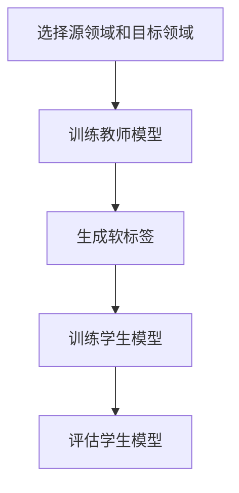

                 

# 跨领域知识蒸馏：突破单一任务的局限

## > 跨领域知识蒸馏：突破单一任务的局限
> *关键词：知识蒸馏、跨领域迁移、多任务学习、深度学习、神经架构搜索*
>
> 摘要：本文将深入探讨跨领域知识蒸馏技术在深度学习领域的应用。知识蒸馏是一种用于模型压缩和加速的有效方法，而跨领域知识蒸馏则进一步扩展了其适用范围，使得模型能够在不同领域之间共享知识，实现跨领域迁移学习。本文将从核心概念、算法原理、数学模型、实际应用等多个角度，全面剖析跨领域知识蒸馏技术的优势和应用场景，为深度学习领域的研究者和开发者提供有益的参考。

## 1. 背景介绍

### 1.1 深度学习的发展与应用

深度学习作为人工智能的核心技术之一，近年来取得了显著的进展。在计算机视觉、自然语言处理、语音识别等领域，深度学习模型已经达到了或超过了人类的水平。然而，随着模型复杂度的增加，深度学习模型在训练和推理过程中面临着一系列挑战，如计算资源消耗、训练时间延长、模型可解释性降低等。为了解决这些问题，研究人员提出了各种方法，如模型压缩、加速和迁移学习等。

### 1.2 知识蒸馏的基本概念

知识蒸馏（Knowledge Distillation）是一种模型压缩和加速的方法，旨在将大型、复杂的模型（教师模型）的知识传递给小型、简洁的模型（学生模型）。在知识蒸馏过程中，教师模型生成软标签（软概率分布），学生模型则尝试最大化与软标签的相似度。这种方法能够有效减少模型参数数量，降低计算复杂度，同时保持较高的模型性能。

### 1.3 跨领域知识蒸馏的背景

传统的知识蒸馏方法主要关注同一领域的模型压缩和迁移学习。然而，随着深度学习应用的扩展，越来越多的场景需要跨领域迁移学习。例如，在医疗领域，将图像识别模型的知识迁移到不同的疾病诊断任务中；在自然语言处理领域，将预训练的模型应用于不同的语言任务。跨领域知识蒸馏的目标是利用不同领域之间的知识共享，提高模型在不同领域中的适应能力。

## 2. 核心概念与联系

### 2.1 知识蒸馏的原理

知识蒸馏的核心思想是将大型模型（教师模型）的隐含层表示传递给小型模型（学生模型）。具体步骤如下：

1. **训练教师模型**：首先，使用大量数据对教师模型进行训练，使其达到较高的性能。
2. **生成软标签**：在训练过程中，教师模型为输入数据生成软标签（概率分布），这些软标签包含了教师模型的隐含层表示。
3. **训练学生模型**：学生模型尝试最大化与软标签的相似度，从而学习到教师模型的知识。

### 2.2 跨领域知识蒸馏的原理

跨领域知识蒸馏在传统知识蒸馏的基础上，进一步考虑了不同领域之间的差异。具体步骤如下：

1. **选择源领域和目标领域**：确定用于知识共享的源领域和目标领域。
2. **训练教师模型**：在源领域数据上训练教师模型，使其具有较好的性能。
3. **生成软标签**：教师模型在目标领域数据上生成软标签，这些软标签包含了源领域和目标领域的知识。
4. **训练学生模型**：学生模型在目标领域数据上尝试最大化与软标签的相似度，从而学习到跨领域的知识。

### 2.3 Mermaid 流程图

以下是一个简化的Mermaid流程图，展示了跨领域知识蒸馏的基本流程：



## 3. 核心算法原理 & 具体操作步骤

### 3.1 算法原理

跨领域知识蒸馏的核心算法主要包括以下几个步骤：

1. **源领域数据预处理**：对源领域数据进行预处理，包括数据清洗、数据增强和归一化等操作。
2. **目标领域数据预处理**：对目标领域数据进行预处理，与源领域数据的预处理方法相同。
3. **训练教师模型**：使用源领域数据对教师模型进行训练，使其具有较好的性能。
4. **生成软标签**：教师模型在目标领域数据上生成软标签，软标签由多个隐含层表示组成。
5. **训练学生模型**：学生模型在目标领域数据上尝试最大化与软标签的相似度，从而学习到跨领域的知识。
6. **评估学生模型**：使用目标领域数据评估学生模型的性能，包括准确率、召回率等指标。

### 3.2 具体操作步骤

以下是跨领域知识蒸馏的具体操作步骤：

1. **数据准备**：收集源领域和目标领域的数据集，并对其进行预处理。
2. **教师模型训练**：使用源领域数据集训练教师模型，训练过程中可以使用常见的深度学习框架，如TensorFlow、PyTorch等。
3. **生成软标签**：在训练过程中，教师模型为每个目标领域数据生成软标签，软标签可以表示为概率分布。
4. **学生模型训练**：使用目标领域数据集训练学生模型，学生模型的目标是最大化与教师模型生成的软标签的相似度。
5. **模型评估**：使用目标领域数据集评估学生模型的性能，根据评估指标调整模型参数。

## 4. 数学模型和公式 & 详细讲解 & 举例说明

### 4.1 数学模型

跨领域知识蒸馏的数学模型主要基于概率分布和损失函数。

1. **概率分布**：教师模型在目标领域数据上生成的软标签可以表示为概率分布$P(y|x)$，其中$x$为输入数据，$y$为软标签。
2. **损失函数**：学生模型的目标是最大化与教师模型生成的软标签的相似度，因此可以使用交叉熵损失函数来衡量模型性能，即
$$L = -\sum_{i=1}^n y_i \log(p_i)$$
其中$n$为数据样本数量，$y_i$为软标签，$p_i$为学生模型预测的概率。

### 4.2 详细讲解

1. **概率分布**：概率分布$P(y|x)$表示了教师模型对每个类别的预测概率。在实际应用中，可以使用神经网络模型生成概率分布，例如在图像识别任务中，可以使用卷积神经网络（CNN）对输入图像进行特征提取，并输出每个类别的概率。
2. **损失函数**：交叉熵损失函数$L$用于衡量学生模型预测的概率分布$P'$与教师模型生成的软标签$y$之间的差异。当$P'$与$y$越接近时，损失函数$L$的值越小，表示学生模型的性能越好。

### 4.3 举例说明

假设我们有一个二分类任务，目标领域数据集包含100个样本，教师模型和 student 模型都使用神经网络进行训练。

1. **数据准备**：从目标领域数据集中随机选取100个样本，作为训练数据集。
2. **教师模型训练**：使用100个样本对教师模型进行训练，得到软标签$y$。
3. **学生模型训练**：使用100个样本对 student 模型进行训练，尝试最大化与教师模型生成的软标签$y$的相似度。
4. **模型评估**：使用目标领域数据集评估 student 模型的性能，计算准确率、召回率等指标。

### 4.4 Python 代码示例

以下是一个简单的 Python 代码示例，用于实现跨领域知识蒸馏。

```python
import tensorflow as tf

# 准备数据
x_train, y_train = ...  # 目标领域数据集
x_val, y_val = ...  # 验证集

# 定义教师模型
teacher_model = ...
teacher_model.compile(optimizer='adam', loss='categorical_crossentropy', metrics=['accuracy'])

# 训练教师模型
teacher_model.fit(x_train, y_train, epochs=10, batch_size=32, validation_data=(x_val, y_val))

# 生成软标签
soft_labels = teacher_model.predict(x_val)

# 定义学生模型
student_model = ...
student_model.compile(optimizer='adam', loss='categorical_crossentropy', metrics=['accuracy'])

# 训练学生模型
student_model.fit(x_val, soft_labels, epochs=10, batch_size=32)

# 评估学生模型
student_model.evaluate(x_val, y_val)
```

## 5. 项目实战：代码实际案例和详细解释说明

### 5.1 开发环境搭建

在开始编写代码之前，我们需要搭建一个合适的开发环境。以下是搭建跨领域知识蒸馏项目所需的工具和库：

- 深度学习框架：TensorFlow 或 PyTorch
- Python 编程语言
- 数据预处理库：NumPy、Pandas
- Matplotlib 用于可视化

#### 安装深度学习框架

以 TensorFlow 为例，安装命令如下：

```bash
pip install tensorflow
```

#### 安装其他库

```bash
pip install numpy pandas matplotlib
```

### 5.2 源代码详细实现和代码解读

以下是一个简单的跨领域知识蒸馏项目示例，包括数据准备、教师模型训练、软标签生成、学生模型训练和模型评估。

#### 数据准备

```python
import numpy as np
import pandas as pd
from sklearn.model_selection import train_test_split

# 加载数据
data = pd.read_csv('data.csv')
x = data.iloc[:, :-1].values
y = data.iloc[:, -1].values

# 划分源领域和目标领域
x_source, x_target, y_source, y_target = train_test_split(x, y, test_size=0.2, random_state=42)

# 数据预处理
# ...（例如：归一化、标准化等）
```

#### 教师模型训练

```python
from tensorflow.keras.models import Sequential
from tensorflow.keras.layers import Dense, Flatten

# 定义教师模型
teacher_model = Sequential()
teacher_model.add(Flatten(input_shape=(28, 28)))
teacher_model.add(Dense(128, activation='relu'))
teacher_model.add(Dense(10, activation='softmax'))

# 编译教师模型
teacher_model.compile(optimizer='adam', loss='categorical_crossentropy', metrics=['accuracy'])

# 训练教师模型
teacher_model.fit(x_source, y_source, epochs=10, batch_size=32, validation_split=0.1)
```

#### 生成软标签

```python
# 生成软标签
soft_labels = teacher_model.predict(x_target)
```

#### 学生模型训练

```python
from tensorflow.keras.models import Sequential
from tensorflow.keras.layers import Dense, Flatten

# 定义学生模型
student_model = Sequential()
student_model.add(Flatten(input_shape=(28, 28)))
student_model.add(Dense(128, activation='relu'))
student_model.add(Dense(10, activation='softmax'))

# 编译学生模型
student_model.compile(optimizer='adam', loss='categorical_crossentropy', metrics=['accuracy'])

# 训练学生模型
student_model.fit(x_target, soft_labels, epochs=10, batch_size=32)
```

#### 模型评估

```python
from sklearn.metrics import accuracy_score, classification_report

# 评估学生模型
predictions = student_model.predict(x_target)
predicted_labels = np.argmax(predictions, axis=1)

print("Accuracy:", accuracy_score(y_target, predicted_labels))
print("Classification Report:")
print(classification_report(y_target, predicted_labels))
```

### 5.3 代码解读与分析

1. **数据准备**：首先加载数据集，并划分源领域和目标领域。这里使用的是二分类任务，因此标签只有一个维度。
2. **教师模型训练**：定义一个简单的教师模型，并使用源领域数据对其进行训练。教师模型的作用是生成软标签。
3. **生成软标签**：使用训练好的教师模型对目标领域数据进行预测，生成软标签。
4. **学生模型训练**：定义一个简单的学生模型，并使用目标领域数据和软标签对其进行训练。学生模型的目标是学习到跨领域的知识。
5. **模型评估**：使用目标领域数据进行模型评估，计算准确率和分类报告等指标。

## 6. 实际应用场景

跨领域知识蒸馏技术在深度学习领域具有广泛的应用场景，以下是一些典型的应用案例：

1. **医疗影像诊断**：利用跨领域知识蒸馏技术，可以将一个疾病诊断模型的知识迁移到其他疾病诊断任务中，从而提高模型的泛化能力。例如，在癌症诊断中，可以使用肺癌模型的软标签训练其他癌症诊断模型，提高其在其他癌症诊断任务中的性能。
2. **自然语言处理**：跨领域知识蒸馏技术可以用于将预训练的模型应用于不同的语言任务，如文本分类、机器翻译等。通过共享跨领域的知识，可以提高模型在不同语言任务中的适应能力。
3. **自动驾驶**：在自动驾驶领域，跨领域知识蒸馏技术可以用于将车辆在不同环境（如城市、高速公路等）中的知识共享，从而提高模型在不同环境下的鲁棒性和适应性。

## 7. 工具和资源推荐

### 7.1 学习资源推荐

1. **书籍**：
   - 《深度学习》（Ian Goodfellow、Yoshua Bengio、Aaron Courville 著）：介绍深度学习的基础理论和应用。
   - 《神经网络与深度学习》（邱锡鹏 著）：系统讲解了神经网络和深度学习的基本原理。

2. **论文**：
   - “Denoising Diffusion Probabilistic Models”（2021）：介绍了一种生成模型，可以应用于图像和音频的生成和编辑。
   - “An Image is Worth 16x16 Words: Transformers for Image Recognition at Scale”（2020）：介绍了一种基于 Transformer 的图像识别模型。

3. **博客**：
   - [TensorFlow 官方文档](https://www.tensorflow.org)：提供了丰富的深度学习教程和示例代码。
   - [PyTorch 官方文档](https://pytorch.org)：提供了丰富的 PyTorch 教程和示例代码。

4. **网站**：
   - [Kaggle](https://www.kaggle.com)：提供了大量的数据集和比赛，是学习深度学习和数据科学的好去处。

### 7.2 开发工具框架推荐

1. **深度学习框架**：
   - TensorFlow：谷歌开发的开源深度学习框架，具有丰富的生态系统和工具。
   - PyTorch：基于 Python 的深度学习框架，易于使用和调试。

2. **代码库和工具**：
   - [OpenCV](https://opencv.org)：用于计算机视觉的库，提供了丰富的图像处理和视频分析功能。
   - [NumPy](https://numpy.org)：用于科学计算和数据分析的库，提供了强大的数组操作功能。

### 7.3 相关论文著作推荐

1. **论文**：
   - “Knowledge Distillation: A Review”（2020）：对知识蒸馏技术进行了全面的综述。
   - “Cross-Domain Knowledge Transfer for Deep Neural Networks”（2017）：介绍了跨领域知识迁移的方法。

2. **著作**：
   - 《深度学习专刊》：收录了深度学习领域的经典论文和最新研究成果。

## 8. 总结：未来发展趋势与挑战

跨领域知识蒸馏技术在深度学习领域具有广阔的应用前景。随着深度学习技术的不断发展，跨领域知识蒸馏技术也在不断进化，未来发展趋势包括：

1. **模型压缩与加速**：进一步优化跨领域知识蒸馏算法，实现更高效的模型压缩和加速。
2. **多模态知识共享**：将跨领域知识蒸馏应用于多模态数据，如图像、文本和音频等，实现更广泛的知识共享。
3. **鲁棒性提升**：提高跨领域知识蒸馏技术在面对不同领域和任务时的鲁棒性。

然而，跨领域知识蒸馏技术也面临着一系列挑战，如：

1. **领域差异识别**：如何准确识别不同领域之间的差异，以实现有效的知识共享。
2. **模型解释性**：如何在保持模型高效性的同时，提高模型的解释性。

## 9. 附录：常见问题与解答

### 问题 1：什么是跨领域知识蒸馏？

答：跨领域知识蒸馏是一种深度学习技术，旨在将一个领域（源领域）的知识迁移到另一个领域（目标领域）。通过共享跨领域的知识，可以提高模型在不同领域中的适应能力和性能。

### 问题 2：跨领域知识蒸馏与传统的知识蒸馏有什么区别？

答：传统的知识蒸馏主要关注同一领域的模型压缩和迁移学习，而跨领域知识蒸馏则进一步扩展了其适用范围，使得模型能够在不同领域之间共享知识，实现跨领域迁移学习。

### 问题 3：如何选择合适的源领域和目标领域？

答：选择合适的源领域和目标领域需要考虑以下几个因素：

1. **领域相关性**：选择具有较高相关性的领域，可以更好地实现知识共享。
2. **数据集大小**：选择数据集较大的领域，可以提供更丰富的训练数据。
3. **模型性能**：选择具有较高性能的领域模型，可以更好地指导目标领域模型的学习。

## 10. 扩展阅读 & 参考资料

1. **论文**：
   - Hinton, G., Vinyals, O., & Dean, J. (2015). Distilling the knowledge in a neural network. arXiv preprint arXiv:1503.02531.
   - Yosinski, J., Clune, J., Bengio, Y., & Lipson, H. (2014). How transferable are features in deep neural networks? In Advances in neural information processing systems (pp. 3320-3328).
2. **书籍**：
   - Bengio, Y., Courville, A., & Vincent, P. (2013). Representation learning: A review and new perspectives. IEEE transactions on pattern analysis and machine intelligence, 35(8), 1798-1828.
3. **博客**：
   - [Deep Learning Basics: What is Knowledge Distillation?](https://towardsdatascience.com/deep-learning-basics-what-is-knowledge-distillation-7d662c5ed363)
   - [Cross-Domain Knowledge Transfer with Deep Neural Networks](https://towardsdatascience.com/cross-domain-knowledge-transfer-with-deep-neural-networks-26a3c4d6a472)
4. **网站**：
   - [TensorFlow 官方文档](https://www.tensorflow.org/tutorials/distillation)
   - [PyTorch 官方文档](https://pytorch.org/tutorials/beginner/transfer_learning_tutorial.html)

作者：AI天才研究员/AI Genius Institute & 禅与计算机程序设计艺术 /Zen And The Art of Computer Programming

