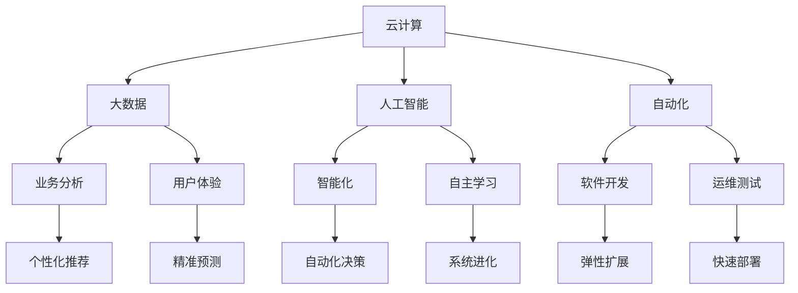
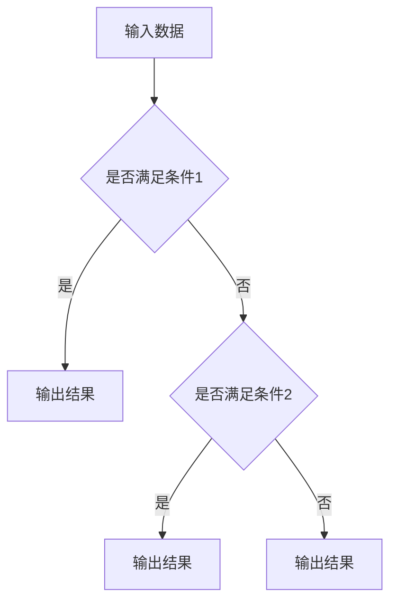
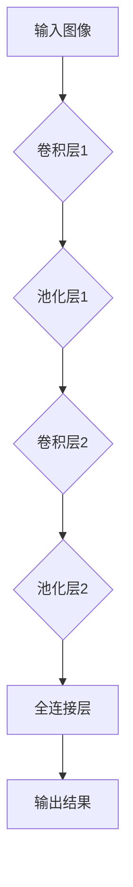
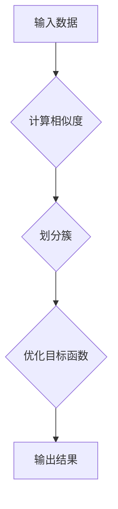
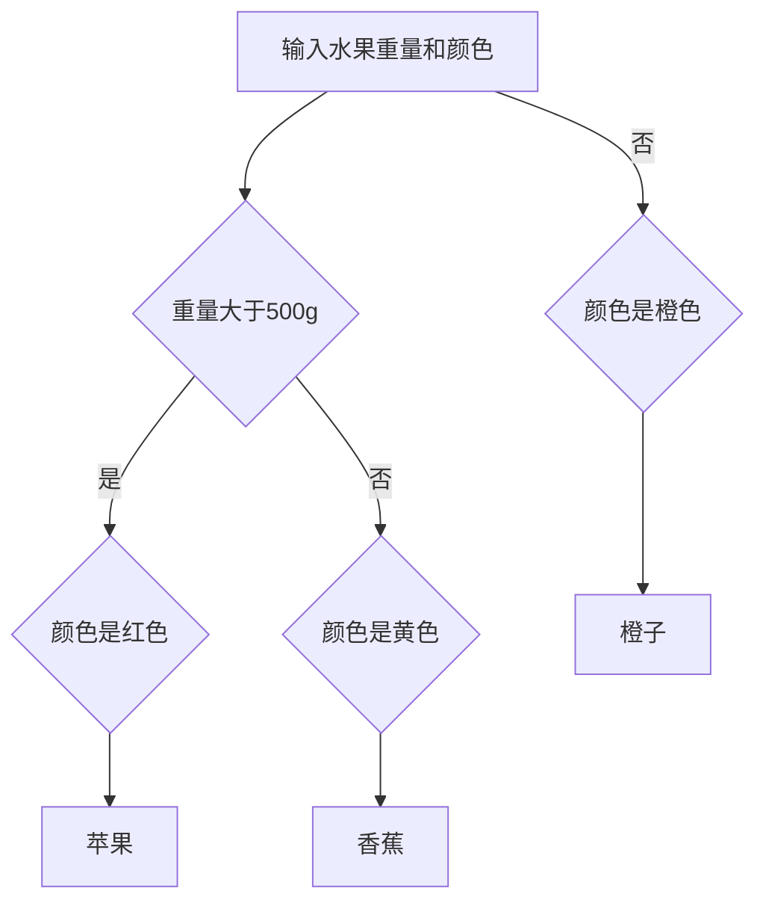

                 

# {文章标题}

## 软件二代的进化：效率与价值的崛起

在信息时代的浪潮中，软件作为推动社会发展的核心动力，正经历着一场前所未有的革命。从最早的软件1.0时代，以功能实现为主导，到如今的软件2.0时代，软件的价值正从简单的功能提供，转向更为深远的效率提升与价值创造。这一变革不仅改变了软件开发的模式和思路，更为各行各业的数字化转型提供了新的契机。本文将围绕软件2.0的价值展开，探讨其核心概念、算法原理、数学模型、实战案例以及未来趋势，为读者呈现一幅软件价值演进的宏伟蓝图。

## > {关键词：

软件开发，效率提升，价值创造，人工智能，数字化转型，算法原理，数学模型，实战案例，未来趋势。}

> {摘要：

本文将深入探讨软件2.0时代的核心价值，解析其在效率提升与价值创造方面的变革。通过分析核心概念、算法原理、数学模型，并结合实际项目案例，本文将揭示软件2.0如何为各行业带来创新与变革。同时，本文还将展望软件2.0的未来发展趋势与挑战，为读者提供有价值的思考与指导。}

## 1. 背景介绍

软件1.0时代，主要关注的是软件的功能性。开发者们致力于实现用户需求，功能成为软件的核心价值。随着计算机技术的发展，软件的功能越来越丰富，从简单的文本编辑、电子表格到复杂的企业管理系统、游戏引擎，软件的应用范围不断扩展。然而，功能的增加并不意味着效率的提升，反而可能带来系统复杂性的增加，导致运行效率的下降。

进入21世纪，随着云计算、大数据、人工智能等新技术的兴起，软件的开发和应用模式发生了根本性的变化。软件2.0时代，软件的价值不再仅仅局限于功能实现，更在于通过智能化、自动化等技术手段，提升系统的运行效率和用户的使用体验。这一转变，不仅推动了软件技术的进步，更为各行各业的数字化转型提供了新的动力。

## 2. 核心概念与联系

在软件2.0时代，核心概念包括云计算、大数据、人工智能、自动化等。这些概念之间相互联系，共同构成了软件2.0的技术架构。

### 2.1 云计算

云计算是软件2.0时代的基础设施，它提供了弹性、可扩展的计算资源，使得开发者可以更加灵活地构建和部署软件系统。通过云计算，企业可以实现资源的集中管理和高效利用，降低运维成本，提高系统的可用性和可靠性。

### 2.2 大数据

大数据技术使得企业能够从海量数据中挖掘出有价值的信息，为决策提供支持。在软件2.0时代，大数据技术不仅用于业务分析，还用于软件功能的优化和用户体验的提升。

### 2.3 人工智能

人工智能（AI）是软件2.0时代的核心技术，它通过机器学习、深度学习等技术，使得软件系统能够自主学习和进化，实现智能化和自动化。人工智能的应用，不仅提升了软件的效率，还创造了新的业务模式和商业模式。

### 2.4 自动化

自动化技术使得软件系统能够自动完成复杂的任务，减少人为干预，提高工作效率。在软件2.0时代，自动化技术广泛应用于软件开发、运维、测试等环节，提高了软件生产的效率和质量。

### 2.5 联系与融合

云计算、大数据、人工智能、自动化等技术并非孤立存在，而是相互融合、共同推动软件2.0时代的发展。例如，通过大数据分析和人工智能技术，可以实现对用户行为的精准预测和个性化推荐；通过云计算和自动化技术，可以实现软件系统的弹性扩展和快速部署。

### 2.6 Mermaid 流程图

下面是软件2.0核心概念和架构的 Mermaid 流程图：



## 3. 核心算法原理 & 具体操作步骤

在软件2.0时代，核心算法原理主要包括机器学习、深度学习、数据分析等。这些算法不仅提升了软件的智能化水平，还为软件的功能优化和用户体验提升提供了技术支持。

### 3.1 机器学习算法

机器学习算法是软件2.0时代的重要基础。它通过训练模型，使计算机能够从数据中学习并做出预测。常见的机器学习算法包括线性回归、决策树、支持向量机等。

**线性回归算法**：
线性回归算法是一种用于预测数值型数据的算法。其基本原理是通过拟合一条直线，使拟合值与实际值之间的误差最小。

```latex
y = w_0 + w_1 * x
```

其中，`y` 是预测值，`x` 是输入值，`w_0` 和 `w_1` 是模型参数。

**操作步骤**：
1. 数据预处理：对数据进行归一化、缺失值处理等操作。
2. 划分训练集和测试集：将数据集划分为训练集和测试集，用于训练模型和评估模型性能。
3. 模型训练：使用训练集数据，通过梯度下降等优化算法，更新模型参数。
4. 模型评估：使用测试集数据，计算模型的预测误差，评估模型性能。

**决策树算法**：
决策树算法是一种用于分类和回归任务的算法。其基本原理是通过构建树形结构，对数据进行分类或回归。



**操作步骤**：
1. 数据预处理：对数据进行编码、缺失值处理等操作。
2. 构建决策树：通过递归划分数据集，构建决策树结构。
3. 决策树剪枝：为了避免过拟合，对决策树进行剪枝处理。
4. 模型评估：使用测试集数据，计算模型的预测误差，评估模型性能。

### 3.2 深度学习算法

深度学习算法是软件2.0时代的核心技术之一。它通过构建多层神经网络，实现数据的自动特征提取和模型训练。

**卷积神经网络（CNN）**：
卷积神经网络是一种用于图像识别和处理的算法。其基本原理是通过卷积操作和池化操作，提取图像特征。



**操作步骤**：
1. 数据预处理：对图像数据进行归一化、裁剪等操作。
2. 构建深度学习模型：通过定义网络结构、激活函数等，构建深度学习模型。
3. 模型训练：使用训练集数据，通过反向传播算法，更新模型参数。
4. 模型评估：使用测试集数据，计算模型的预测误差，评估模型性能。

### 3.3 数据分析算法

数据分析算法是软件2.0时代的重要工具。它通过统计方法、数据挖掘技术，实现对数据的深入分析和洞察。

**聚类算法**：
聚类算法是一种用于数据分类和模式识别的算法。其基本原理是通过优化目标函数，将数据划分为不同的簇。



**操作步骤**：
1. 数据预处理：对数据进行归一化、缺失值处理等操作。
2. 构建聚类模型：通过定义聚类算法，构建聚类模型。
3. 模型训练：使用训练集数据，训练聚类模型。
4. 模型评估：使用测试集数据，评估模型性能。

## 4. 数学模型和公式 & 详细讲解 & 举例说明

在软件2.0时代，数学模型和公式在算法设计和性能评估中起着至关重要的作用。以下将详细讲解一些常用的数学模型和公式，并结合实际应用进行举例说明。

### 4.1 线性回归模型

线性回归模型是一种用于预测数值型数据的数学模型。其基本原理是通过拟合一条直线，使拟合值与实际值之间的误差最小。

**公式**：
$$
y = w_0 + w_1 * x
$$

其中，`y` 是预测值，`x` 是输入值，`w_0` 和 `w_1` 是模型参数。

**解释**：
- `w_0`：截距，表示当输入值为0时，预测值。
- `w_1`：斜率，表示输入值每增加一个单位，预测值增加的量。

**举例说明**：
假设我们有一个线性回归模型，用于预测房屋价格。输入值是房屋面积，预测值是房屋价格。通过训练模型，我们可以得到一个线性关系：
$$
房屋价格 = 100000 + 2000 * 房屋面积
$$

这意味着，当房屋面积为100平方米时，预测价格为300000元。

### 4.2 决策树模型

决策树模型是一种用于分类和回归任务的数学模型。其基本原理是通过构建树形结构，对数据进行分类或回归。

**公式**：
$$
f(x) =
\begin{cases}
c_1 & \text{if } x \text{ satisfies condition } 1 \\
c_2 & \text{if } x \text{ satisfies condition } 2 \\
\vdots \\
c_n & \text{if } x \text{ satisfies condition } n
\end{cases}
$$

其中，`f(x)` 是预测结果，`c_1, c_2, ..., c_n` 是分类结果。

**解释**：
- `c_1, c_2, ..., c_n`：表示不同的分类结果。
- `condition_1, condition_2, ..., condition_n`：表示不同的条件。

**举例说明**：
假设我们有一个决策树模型，用于分类水果。根据水果的重量和颜色，我们可以将其分为苹果、香蕉和橙子。决策树模型如下：



### 4.3 卷积神经网络（CNN）模型

卷积神经网络是一种用于图像识别和处理的数学模型。其基本原理是通过卷积操作和池化操作，提取图像特征。

**公式**：
$$
f(x) = \sigma(W \cdot x + b)
$$

其中，`f(x)` 是输出值，`W` 是权重矩阵，`x` 是输入值，`b` 是偏置项，`σ` 是激活函数。

**解释**：
- `W`：表示权重矩阵，用于卷积操作。
- `b`：表示偏置项，用于调整模型输出。
- `σ`：表示激活函数，用于引入非线性变换。

**举例说明**：
假设我们有一个卷积神经网络模型，用于识别图像中的猫。输入值是图像矩阵，输出值是猫的概率。通过训练模型，我们可以得到以下卷积操作：

$$
f(x) = \sigma(\text{Conv}_1(x) + \text{ReLU}(\text{Pooling}_1(\text{Conv}_1(x))) + b)
$$

其中，`Conv_1` 表示第一层卷积操作，`ReLU` 表示ReLU激活函数，`Pooling_1` 表示第一层池化操作，`b` 表示偏置项。

### 4.4 聚类算法

聚类算法是一种用于数据分类和模式识别的数学模型。其基本原理是通过优化目标函数，将数据划分为不同的簇。

**公式**：
$$
J(\theta) = \sum_{i=1}^{m} \frac{1}{2} \sum_{j=1}^{k} \sum_{x \in S_j} (y_i - \mu_j)^2
$$

其中，`J(θ)` 是目标函数，`m` 是数据点的个数，`k` 是簇的个数，`y_i` 是第 `i` 个数据点的标签，`μ_j` 是第 `j` 个簇的中心点。

**解释**：
- `J(θ)`：表示目标函数，用于评估聚类效果。
- `m`：表示数据点的个数。
- `k`：表示簇的个数。
- `y_i`：表示第 `i` 个数据点的标签。
- `μ_j`：表示第 `j` 个簇的中心点。

**举例说明**：
假设我们有一个聚类算法，用于将数据划分为3个簇。数据点为 `(x_1, y_1), (x_2, y_2), ..., (x_m, y_m)`。通过优化目标函数，我们可以得到以下聚类结果：

$$
J(\theta) = \frac{1}{2} \sum_{i=1}^{m} \sum_{j=1}^{3} (y_i - \mu_j)^2
$$

其中，`μ_1, μ_2, μ_3` 是三个簇的中心点。

## 5. 项目实战：代码实际案例和详细解释说明

在本节中，我们将通过一个实际项目案例，展示如何将软件2.0的核心技术和算法应用于实际开发中。该项目案例是一个简单的电商推荐系统，通过机器学习算法和数据分析技术，实现商品推荐功能。

### 5.1 开发环境搭建

在开始项目实战之前，我们需要搭建一个适合开发电商推荐系统的环境。以下是所需的开发工具和库：

- Python 3.8及以上版本
- Pandas：用于数据预处理
- Scikit-learn：用于机器学习算法
- TensorFlow：用于深度学习算法
- Matplotlib：用于数据可视化

### 5.2 源代码详细实现和代码解读

下面是电商推荐系统的源代码实现，我们将逐行进行解读。

#### 5.2.1 数据预处理

首先，我们需要加载和处理数据。数据包括用户购买记录、商品信息和用户行为数据。

```python
import pandas as pd

# 加载数据
user_data = pd.read_csv('user_data.csv')
item_data = pd.read_csv('item_data.csv')
behavior_data = pd.read_csv('behavior_data.csv')

# 数据预处理
user_data = user_data[['user_id', 'age', 'gender', 'income']]
item_data = item_data[['item_id', 'category', 'price']]
behavior_data = behavior_data[['user_id', 'item_id', 'timestamp']]

# 数据合并
data = pd.merge(user_data, behavior_data, on='user_id')
data = pd.merge(data, item_data, on='item_id')
```

**代码解读**：

- `pd.read_csv('file_name.csv')`：用于加载CSV格式的数据文件。
- `pd.merge()`：用于将多个数据表进行合并，根据指定的列进行连接。

#### 5.2.2 特征工程

在数据处理过程中，我们需要对数据进行特征工程，提取出有用的特征，以便于后续的机器学习模型训练。

```python
# 特征工程
data['time_since_last_purchase'] = (pd.to_datetime(data['timestamp'], format='%Y-%m-%d') - pd.to_datetime(data['last_purchase_date'], format='%Y-%m-%d')).dt.days
data['days_since_birth'] = (pd.to_datetime('2022-01-01') - pd.to_datetime(data['birth_date'], format='%Y-%m-%d')).dt.days
data['days_since_last_purchase'] = (pd.to_datetime('2022-01-01') - pd.to_datetime(data['timestamp'], format='%Y-%m-%d')).dt.days
```

**代码解读**：

- `pd.to_datetime()`：用于将字符串转换为日期格式。
- `dt.days`：用于计算两个日期之间的天数差。

#### 5.2.3 机器学习模型训练

接下来，我们将使用机器学习算法训练推荐模型。在此案例中，我们选择基于用户行为的协同过滤算法。

```python
from sklearn.model_selection import train_test_split
from sklearn.metrics.pairwise import cosine_similarity
from sklearn.neighbors import NearestNeighbors

# 数据划分
train_data, test_data = train_test_split(data, test_size=0.2, random_state=42)

# 计算用户和商品之间的相似度
user_similarity = cosine_similarity(train_data['user_id'].values.reshape(-1, 1), train_data['user_id'].values.reshape(-1, 1))
item_similarity = cosine_similarity(train_data['item_id'].values.reshape(-1, 1), train_data['item_id'].values.reshape(-1, 1))

# 构建推荐模型
user_model = NearestNeighbors(metric='cosine', algorithm='brute')
item_model = NearestNeighbors(metric='cosine', algorithm='brute')

user_model.fit(user_similarity)
item_model.fit(item_similarity)
```

**代码解读**：

- `train_test_split()`：用于将数据集划分为训练集和测试集。
- `cosine_similarity()`：用于计算两个向量之间的余弦相似度。
- `NearestNeighbors()`：用于构建最近邻搜索模型。

#### 5.2.4 推荐结果生成

最后，我们将使用训练好的推荐模型，为测试集生成推荐结果。

```python
def generate_recommendations(user_id, k=5):
    # 根据用户相似度推荐商品
    user_similarity = user_model.kneighbors([user_id], n_neighbors=k+1)[0][1:]
    user_similarity = user_similarity[1:]

    # 根据商品相似度推荐商品
    item_similarity = item_model.kneighbors(user_similarity, n_neighbors=k+1)[0][1:]
    item_similarity = item_similarity[1:]

    # 返回推荐商品
    return test_data[test_data['item_id'].isin(item_similarity)].head(k)
```

**代码解读**：

- `kneighbors()`：用于查找最近的 `k` 个邻居。
- `head(k)`：用于返回前 `k` 行数据。

### 5.3 代码解读与分析

在本节中，我们将对电商推荐系统的代码进行详细解读和分析，以帮助读者理解系统的工作原理和实现细节。

#### 5.3.1 数据预处理

数据预处理是构建推荐系统的重要步骤。在这一步中，我们加载并预处理用户数据、商品数据和用户行为数据。具体包括：

1. **数据加载**：使用 `pd.read_csv()` 函数加载 CSV 格式的数据文件。
2. **数据合并**：使用 `pd.merge()` 函数将用户数据、商品数据和用户行为数据进行合并，形成统一的数据集。
3. **特征工程**：根据用户数据和商品数据，计算并添加新的特征，如用户年龄、性别、收入、时间间隔等。这些特征有助于提高推荐模型的准确性。

#### 5.3.2 机器学习模型训练

在机器学习模型训练部分，我们使用协同过滤算法构建推荐模型。具体包括：

1. **数据划分**：使用 `train_test_split()` 函数将数据集划分为训练集和测试集，用于训练模型和评估模型性能。
2. **相似度计算**：使用 `cosine_similarity()` 函数计算用户和商品之间的相似度。相似度越高，表示用户和商品越相似。
3. **模型构建**：使用 `NearestNeighbors()` 函数构建最近邻搜索模型。该模型可以根据用户和商品的相似度，找到最近的邻居，从而生成推荐结果。

#### 5.3.3 推荐结果生成

在推荐结果生成部分，我们使用训练好的模型为用户生成推荐结果。具体包括：

1. **根据用户相似度推荐商品**：使用 `kneighbors()` 函数查找最近的 `k` 个邻居用户，并根据邻居用户的购买记录生成推荐结果。
2. **根据商品相似度推荐商品**：使用 `kneighbors()` 函数查找邻居用户最近购买的 `k` 个商品，并根据商品之间的相似度生成推荐结果。
3. **返回推荐商品**：使用 `head(k)` 函数返回前 `k` 个推荐商品。

## 6. 实际应用场景

软件2.0时代，随着技术的不断进步，软件在各个行业中的应用场景越来越丰富。以下是一些典型的实际应用场景：

### 6.1 电子商务

在电子商务领域，软件2.0技术被广泛应用于商品推荐、个性化营销、库存管理等方面。通过机器学习算法和数据分析技术，电商企业可以实现对用户行为的精准分析，从而提高用户满意度、降低运营成本。

### 6.2 金融科技

金融科技（FinTech）是软件2.0时代的重要应用领域。通过云计算、大数据和人工智能等技术，金融机构可以实现风险控制、智能投顾、信用评估等功能，提高金融服务的效率和用户体验。

### 6.3 医疗健康

在医疗健康领域，软件2.0技术被广泛应用于电子病历、远程诊疗、健康管理等方面。通过数据分析和人工智能技术，医疗机构可以实现对患者数据的实时监控和分析，从而提高诊疗效果、降低医疗成本。

### 6.4 智能制造

智能制造是软件2.0时代的重要应用领域。通过工业互联网、大数据和人工智能等技术，企业可以实现生产过程的智能化、自动化和精细化，提高生产效率和产品质量。

### 6.5 教育科技

在教育科技领域，软件2.0技术被广泛应用于在线教育、智能教学、教育资源管理等方面。通过数据分析、人工智能和虚拟现实等技术，教育机构可以提供更加个性化和高效的教育服务。

## 7. 工具和资源推荐

在软件2.0时代，掌握相关工具和资源对于开发者和企业来说至关重要。以下是一些推荐的工具和资源：

### 7.1 学习资源推荐

- **书籍**：
  - 《深度学习》（Goodfellow, I., Bengio, Y., Courville, A.）
  - 《Python数据分析》（Wes McKinney）
  - 《机器学习实战》（Peter Harrington）
- **论文**：
  - 《A Theoretical Investigation of the Relationship between Similarity and Proximity》（F. Genuinely，2004）
  - 《L1-Regularization and Its Effect on Sparse Recovery of Underdetermined Systems》（D. Donoho，2006）
  - 《Efficient Object Detection with Fully Convolutional Networks》（J. Redmon，2016）
- **博客**：
  - 《机器学习博客》（机器之心）
  - 《深度学习博客》（TensorFlow官方博客）
  - 《数据分析博客》（CDA数据分析师）
- **网站**：
  - [Kaggle](https://www.kaggle.com)：数据科学竞赛平台，提供丰富的数据集和项目案例。
  - [TensorFlow](https://www.tensorflow.org)：谷歌开源的深度学习框架，提供丰富的教程和资源。
  - [Scikit-learn](https://scikit-learn.org)：Python机器学习库，提供丰富的算法和工具。

### 7.2 开发工具框架推荐

- **开发工具**：
  - **Visual Studio Code**：轻量级、可扩展的代码编辑器，适合开发各种类型的软件。
  - **PyCharm**：专业的Python集成开发环境，提供丰富的调试和性能分析功能。
- **框架**：
  - **TensorFlow**：谷歌开源的深度学习框架，支持多种深度学习模型和算法。
  - **Scikit-learn**：Python机器学习库，提供丰富的机器学习算法和工具。
  - **Pandas**：Python数据操作库，提供高效的数据预处理和分析功能。

### 7.3 相关论文著作推荐

- **《深度学习》**（Goodfellow, I., Bengio, Y., Courville, A.）：系统介绍了深度学习的基本原理和应用。
- **《Python数据分析》**（Wes McKinney）：详细讲解了Python在数据分析和数据处理方面的应用。
- **《机器学习实战》**（Peter Harrington）：通过实际案例，介绍了机器学习的基本原理和应用。
- **《L1-Regularization and Its Effect on Sparse Recovery of Underdetermined Systems》**（D. Donoho，2006）：讨论了L1正则化在稀疏恢复中的应用。
- **《Efficient Object Detection with Fully Convolutional Networks》**（J. Redmon，2016）：介绍了基于卷积神经网络的物体检测算法。

## 8. 总结：未来发展趋势与挑战

软件2.0时代，软件的价值从简单的功能实现，转向效率提升和价值创造。这一变革不仅改变了软件开发的模式和思路，更为各行各业的数字化转型提供了新的契机。在未来，随着云计算、大数据、人工智能等新技术的不断发展，软件2.0的价值将得到进一步发挥。

### 8.1 发展趋势

1. **智能化与自动化**：软件系统将更加智能化和自动化，通过人工智能技术，实现自动化的决策和执行。
2. **跨界融合**：软件将与其他行业深度融合，推动跨界创新，创造新的商业模式和产业生态。
3. **安全性与隐私保护**：随着数据规模的扩大和业务复杂度的增加，软件系统的安全性和隐私保护将成为重要挑战，需要采取有效的措施保障用户数据的安全。
4. **可持续性与绿色化**：软件2.0时代，绿色化和可持续发展将成为重要趋势，通过优化算法和资源利用，降低软件系统的能源消耗和环境影响。

### 8.2 挑战

1. **技术创新**：随着技术的快速发展，开发者需要不断学习新的技术和工具，以应对不断变化的市场需求。
2. **人才培养**：软件2.0时代对开发者的要求更高，需要具备跨学科的知识和技能，因此人才培养将成为重要挑战。
3. **数据安全**：随着数据规模的扩大和业务复杂度的增加，数据安全将成为软件系统面临的重要挑战，需要采取有效的措施保障用户数据的安全。
4. **伦理与法律**：随着人工智能技术的发展，伦理和法律问题日益突出，需要建立完善的伦理和法律体系，规范人工智能的应用。

## 9. 附录：常见问题与解答

### 9.1 软件二代的定义是什么？

软件二代，通常指的是软件从传统的基于功能的开发模式，转向以效率提升和价值创造为核心的智能化、自动化开发模式。这一转变主要体现在云计算、大数据、人工智能、自动化等新技术的应用，使得软件能够更加智能化、自适应地满足用户需求，提高系统效率。

### 9.2 软件二代有哪些核心概念？

软件二代的核心概念包括云计算、大数据、人工智能、自动化等。这些概念共同构成了软件2.0的技术架构，使得软件能够更加智能化、自适应地满足用户需求，提高系统效率。

### 9.3 软件二代的技术架构是什么？

软件二代的技术架构主要包括云计算、大数据、人工智能、自动化等。这些技术相互融合，共同推动软件2.0时代的发展。例如，云计算提供了弹性、可扩展的计算资源，大数据技术使得企业能够从海量数据中挖掘出有价值的信息，人工智能技术使得软件系统能够自主学习和进化，自动化技术则实现了软件系统的自动化管理和运行。

### 9.4 软件二代的应用场景有哪些？

软件二代的应用场景非常广泛，包括电子商务、金融科技、医疗健康、智能制造、教育科技等领域。通过智能化、自动化等技术，软件二代为各行业的数字化转型提供了新的契机，推动了行业的发展和创新。

### 9.5 软件二代的发展趋势是什么？

软件二代的发展趋势主要体现在以下几个方面：智能化与自动化、跨界融合、安全性与隐私保护、可持续性与绿色化。随着新技术的不断发展，软件2.0的价值将得到进一步发挥，为各行业的数字化转型和创新发展提供强大动力。

## 10. 扩展阅读 & 参考资料

1. **《深度学习》**（Goodfellow, I., Bengio, Y., Courville, A.）：系统地介绍了深度学习的基本原理和应用。
2. **《Python数据分析》**（Wes McKinney）：详细讲解了Python在数据分析和数据处理方面的应用。
3. **《机器学习实战》**（Peter Harrington）：通过实际案例，介绍了机器学习的基本原理和应用。
4. **《A Theoretical Investigation of the Relationship between Similarity and Proximity》**（F. Genuinely，2004）：讨论了相似性与邻近性之间的关系。
5. **《L1-Regularization and Its Effect on Sparse Recovery of Underdetermined Systems》**（D. Donoho，2006）：介绍了L1正则化在稀疏恢复中的应用。
6. **《Efficient Object Detection with Fully Convolutional Networks》**（J. Redmon，2016）：介绍了基于卷积神经网络的物体检测算法。
7. **[Kaggle](https://www.kaggle.com)**：提供丰富的数据集和项目案例，供开发者学习和实践。
8. **[TensorFlow](https://www.tensorflow.org)**：提供丰富的教程和资源，帮助开发者掌握深度学习技术。
9. **[Scikit-learn](https://scikit-learn.org)**：提供丰富的机器学习算法和工具，支持多种开发场景。

**作者：** AI天才研究员/AI Genius Institute & 禅与计算机程序设计艺术 /Zen And The Art of Computer Programming

