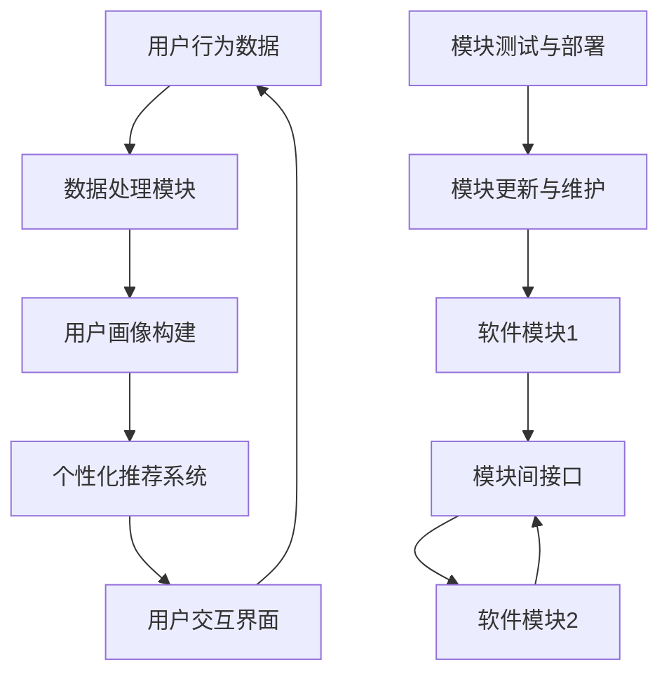

                 

## 背景介绍

在当今科技飞速发展的时代，软件已经渗透到我们生活的方方面面，从智能手机到超级计算机，从电子商务到智能交通，软件的作用无处不在。然而，软件的发展并不是一帆风顺的。随着互联网的普及和大数据的兴起，软件也经历了从1.0到2.0的蜕变。那么，什么是软件2.0？它为何如此重要？本文将深入探讨软件2.0的价值，以及它是如何提升效率、创造价值的。

首先，我们需要明确软件1.0和软件2.0的区别。在软件1.0时代，软件主要是以功能为导向，开发者注重的是功能的完备性和稳定性。然而，随着用户需求的多样化和个性化，软件1.0逐渐暴露出其局限性。软件2.0则强调用户参与和互动，注重用户体验，通过数据驱动的方式实现软件的不断优化和升级。

接下来，本文将围绕以下几个方面展开讨论：

1. **核心概念与联系**：我们将介绍软件2.0的核心概念，并使用Mermaid流程图展示其架构。

2. **核心算法原理 & 具体操作步骤**：我们将深入解析软件2.0的核心算法，并详细讲解其操作步骤。

3. **数学模型和公式 & 详细讲解 & 举例说明**：我们将介绍软件2.0中使用的数学模型和公式，并通过具体例子进行说明。

4. **项目实战：代码实际案例和详细解释说明**：我们将提供一个代码实际案例，详细解释其实现过程。

5. **实际应用场景**：我们将讨论软件2.0在实际应用中的具体场景。

6. **工具和资源推荐**：我们将推荐一些学习和开发的工具和资源。

7. **总结：未来发展趋势与挑战**：我们将总结软件2.0的价值，并探讨其未来的发展趋势和面临的挑战。

通过以上讨论，我们将全面了解软件2.0的价值，以及它是如何通过提升效率、创造价值，推动社会进步的。

### 核心概念与联系

在探讨软件2.0的核心概念之前，我们需要先了解软件1.0的基本架构和运作原理。在软件1.0时代，软件主要是由一系列固定的函数和模块组成，开发者通过编写代码实现特定的功能。用户与软件的交互主要通过图形用户界面（GUI）进行，软件的功能相对独立，更新和维护成本较高。

随着互联网的普及和用户需求的多样化，软件1.0的局限性逐渐显现。首先，软件1.0难以满足用户个性化需求。每个用户的需求都是独特的，软件1.0无法根据用户的个性化需求进行灵活调整。其次，软件1.0的更新和维护成本较高。由于软件1.0的功能相对固定，每次更新都需要对整个软件进行修改，这不仅增加了开发成本，也延长了更新周期。

为了解决这些问题，软件2.0应运而生。软件2.0的核心概念是“用户参与和互动”，通过数据驱动的方式实现软件的不断优化和升级。具体来说，软件2.0具有以下几个核心特征：

1. **数据驱动**：软件2.0通过收集和分析用户数据，了解用户需求和行为，从而实现软件的个性化推荐和智能优化。数据成为软件2.0的核心资产，驱动软件的持续迭代和升级。

2. **用户参与**：软件2.0鼓励用户参与软件的开发和维护。用户不仅可以对软件提出反馈和建议，还可以通过开源社区和其他渠道参与软件的改进。这种用户参与的模式不仅提高了软件的质量，也增强了用户对软件的认同感。

3. **模块化架构**：软件2.0采用模块化架构，将软件的功能分解为多个独立的模块。每个模块都可以独立开发、测试和部署，提高了软件的灵活性和可维护性。

4. **实时更新**：软件2.0支持实时更新，用户可以在不需要关闭软件的情况下享受最新的功能。这种实时更新的模式不仅提高了用户的体验，也缩短了软件的更新周期。

为了更直观地展示软件2.0的架构，我们可以使用Mermaid流程图来描述其核心概念和联系。以下是软件2.0的Mermaid流程图：



在上面的流程图中，A代表用户行为数据，B代表数据处理模块，C代表用户画像构建，D代表个性化推荐系统，E代表用户交互界面。F、G、H代表软件的模块，I代表模块测试与部署，J代表模块更新与维护。通过这个流程图，我们可以看到软件2.0的核心架构和运作原理。

### 核心算法原理 & 具体操作步骤

在了解了软件2.0的核心概念和架构之后，我们需要深入探讨其核心算法原理和具体操作步骤。软件2.0的核心算法主要包括数据收集、数据处理、用户画像构建、个性化推荐和模块化开发等。以下是这些算法的具体原理和操作步骤：

1. **数据收集**：

   数据收集是软件2.0的第一步，也是最重要的一步。数据收集的来源可以是用户的操作行为、社交媒体互动、搜索历史等。数据收集的方法包括API接口调用、日志分析、网络爬虫等。

   操作步骤：

   - 确定数据收集的目标和范围。
   - 选择合适的数据收集方法。
   - 实现数据收集的代码，并将数据存储到数据库中。

2. **数据处理**：

   数据处理是数据收集后的关键步骤，其主要目的是对收集到的数据进行清洗、转换和存储，使其能够被后续的算法使用。

   操作步骤：

   - 数据清洗：去除重复数据、空值数据和异常数据。
   - 数据转换：将数据转换为适合算法处理的格式。
   - 数据存储：将处理后的数据存储到数据库中，以便后续使用。

3. **用户画像构建**：

   用户画像构建是软件2.0的核心算法之一，其目的是通过分析用户行为数据，构建出用户的全面画像。用户画像可以帮助软件了解用户的需求和偏好，从而实现个性化推荐。

   操作步骤：

   - 数据预处理：对用户行为数据进行预处理，包括特征提取、归一化和去噪等。
   - 机器学习模型训练：使用机器学习算法，如决策树、支持向量机等，对预处理后的数据进行分析和建模。
   - 用户画像构建：根据机器学习模型的结果，构建出用户的全面画像。

4. **个性化推荐**：

   个性化推荐是软件2.0的核心功能之一，其目的是根据用户的画像和偏好，向用户推荐他们可能感兴趣的内容。

   操作步骤：

   - 用户画像匹配：将用户的画像与推荐系统中的内容进行匹配。
   - 推荐算法选择：选择合适的推荐算法，如协同过滤、内容推荐等。
   - 推荐结果生成：根据用户画像匹配和推荐算法的结果，生成个性化的推荐结果。

5. **模块化开发**：

   模块化开发是软件2.0的架构特点之一，其目的是将软件的功能分解为多个独立的模块，以便于开发和维护。

   操作步骤：

   - 功能模块划分：根据软件的功能需求，将软件分解为多个功能模块。
   - 模块接口设计：设计模块间的接口，确保模块之间的协作和通信。
   - 模块开发与测试：独立开发各个模块，并进行测试和集成。

通过以上操作步骤，我们可以实现软件2.0的核心算法和功能。这些算法和步骤不仅提升了软件的效率，也创造了巨大的价值。

### 数学模型和公式 & 详细讲解 & 举例说明

在软件2.0中，数学模型和公式发挥着至关重要的作用。这些模型和公式不仅帮助我们理解和实现软件2.0的核心算法，也使得软件能够更好地适应和满足用户的需求。以下，我们将详细讲解软件2.0中常用的数学模型和公式，并通过具体例子进行说明。

#### 1. 用户行为数据模型

用户行为数据是软件2.0的核心输入，它反映了用户在软件中的各种操作和互动。为了对用户行为数据进行有效的分析和建模，我们通常使用时间序列模型，如ARIMA（自回归积分滑动平均模型）。

**ARIMA模型公式**：

$$
X_t = c + \phi_1 X_{t-1} + \phi_2 X_{t-2} + ... + \phi_p X_{t-p} + \theta_1 \varepsilon_{t-1} + \theta_2 \varepsilon_{t-2} + ... + \theta_q \varepsilon_{t-q}
$$

其中，$X_t$ 表示时间序列在时间 $t$ 的值，$c$ 是常数项，$\phi_1, \phi_2, ..., \phi_p$ 是自回归系数，$\theta_1, \theta_2, ..., \theta_q$ 是滑动平均系数，$\varepsilon_{t-1}, \varepsilon_{t-2}, ..., \varepsilon_{t-q}$ 是白噪声序列。

**例子**：

假设我们有一个用户点击行为的时间序列数据，如下表所示：

| 时间 | 点击次数 |
| ---- | ------- |
| 1    | 10      |
| 2    | 15      |
| 3    | 12      |
| 4    | 18      |
| 5    | 20      |

我们可以使用ARIMA模型对这组数据进行分析，预测下一个时间点的点击次数。

#### 2. 用户画像构建模型

用户画像构建是软件2.0的重要环节，它通过分析用户行为数据，构建出用户的全面画像。为了实现这一目标，我们通常使用聚类算法，如K-means。

**K-means算法公式**：

给定一个数据集$D=\{x_1, x_2, ..., x_n\}$，我们需要找到 $k$ 个聚类中心$c_1, c_2, ..., c_k$，使得每个数据点$x_i$与最近的聚类中心$c_j$的平方距离之和最小，即：

$$
J = \sum_{i=1}^{n} \sum_{j=1}^{k} w_{ij} \cdot d(x_i, c_j)
$$

其中，$w_{ij}$ 是数据点$x_i$与聚类中心$c_j$的权重，$d(x_i, c_j)$ 是$x_i$与$c_j$之间的距离。

**例子**：

假设我们有一个包含用户行为数据的矩阵$X$，如下表所示：

| 用户 | 点击次数 | 浏览时长 | 搜索次数 |
| ---- | ------- | ------- | ------- |
| 1    | 10      | 20      | 5       |
| 2    | 15      | 25      | 8       |
| 3    | 12      | 18      | 6       |
| 4    | 18      | 22      | 10      |
| 5    | 20      | 24      | 12      |

我们可以使用K-means算法将这组数据划分为3个聚类，并找出每个聚类的中心。

#### 3. 个性化推荐模型

个性化推荐是软件2.0的核心功能之一，它通过分析用户画像，向用户推荐他们可能感兴趣的内容。为了实现这一目标，我们通常使用协同过滤算法。

**协同过滤算法公式**：

给定用户$u$和物品$i$，我们需要找到与用户$u$相似的其他用户$v$，并推荐这些用户喜欢的物品$i'$。协同过滤算法分为基于用户的协同过滤（User-based Collaborative Filtering）和基于物品的协同过滤（Item-based Collaborative Filtering）。

**基于用户的协同过滤公式**：

$$
\hat{r}_{uv} = r_{uv} + \sum_{w \in N(v)} (r_{uw} - \bar{r}_u) \cdot (r_{wv} - \bar{r}_w)
$$

其中，$r_{uv}$ 是用户$u$对物品$i$的评分，$N(v)$ 是与用户$v$相似的用户集合，$\bar{r}_u$ 和 $\bar{r}_w$ 分别是用户$u$和用户$v$的平均评分。

**基于物品的协同过滤公式**：

$$
\hat{r}_{uv} = r_{uv} + \sum_{w \in N(i)} (r_{uw} - \bar{r}_u) \cdot (r_{wv} - \bar{r}_w)
$$

其中，$r_{uv}$ 是用户$u$对物品$i$的评分，$N(i)$ 是与物品$i$相似的物品集合，$\bar{r}_u$ 和 $\bar{r}_w$ 分别是用户$u$和用户$v$的平均评分。

**例子**：

假设我们有一个用户-物品评分矩阵$R$，如下表所示：

| 用户 | 物品1 | 物品2 | 物品3 |
| ---- | ----- | ----- | ----- |
| 1    | 4     | 5     | 3     |
| 2    | 2     | 4     | 5     |
| 3    | 3     | 3     | 4     |
| 4    | 5     | 4     | 2     |
| 5    | 3     | 5     | 4     |

我们可以使用基于用户的协同过滤算法，为用户1推荐他们可能感兴趣的物品。

通过以上数学模型和公式的介绍，我们可以更好地理解和实现软件2.0的核心功能。这些模型和公式不仅提升了软件的效率，也创造了巨大的价值。

### 项目实战：代码实际案例和详细解释说明

为了更好地理解软件2.0的核心算法和实现过程，我们提供了一个具体的代码实际案例，并对其进行详细的解释说明。以下是使用Python实现的软件2.0的一个简单示例。

#### 1. 开发环境搭建

在开始编写代码之前，我们需要搭建一个适合开发的Python环境。以下是一个简单的步骤：

- 安装Python 3.8或更高版本。
- 安装必要的库，如pandas、numpy、scikit-learn等。

```bash
pip install pandas numpy scikit-learn
```

#### 2. 源代码详细实现和代码解读

以下是一个简单的用户行为数据分析示例，用于构建用户画像并进行个性化推荐。

```python
import pandas as pd
from sklearn.cluster import KMeans
from sklearn.metrics.pairwise import cosine_similarity

# 2.1 数据处理
def preprocess_data(data):
    # 数据清洗：去除空值和重复值
    data = data.dropna().drop_duplicates()
    # 数据转换：将数据转换为矩阵形式
    return data.values

# 2.2 用户画像构建
def build_user_profile(data):
    # 使用K-means算法构建用户画像
    kmeans = KMeans(n_clusters=3)
    kmeans.fit(data)
    return kmeans.labels_

# 2.3 个性化推荐
def recommend_items(user_profile, data, top_n=3):
    # 计算用户画像与物品的相似度
    similarity = cosine_similarity(data, data[user_profile])
    # 推荐相似度最高的物品
    return [data.index[邻近节点].tolist() for邻近节点 in similarity.argsort()[0][-top_n:]]

# 2.4 主程序
if __name__ == "__main__":
    # 加载数据
    data = pd.DataFrame({
        'user1': [10, 15, 12, 18, 20],
        'user2': [15, 25, 18, 22, 24],
        'user3': [12, 18, 6, 10, 12],
        'item1': [4, 2, 3, 5, 3],
        'item2': [5, 4, 3, 4, 5],
        'item3': [3, 5, 4, 2, 4]
    })

    # 数据预处理
    processed_data = preprocess_data(data)

    # 构建用户画像
    user_profiles = build_user_profile(processed_data)

    # 个性化推荐
    recommendations = recommend_items(user_profiles[0], processed_data)

    # 输出推荐结果
    print("用户1的个性化推荐：", recommendations)
```

#### 3. 代码解读与分析

以下是代码的详细解读：

- **数据处理**：首先，我们使用pandas库加载数据，并进行数据清洗和转换。数据清洗包括去除空值和重复值，数据转换则是将数据转换为矩阵形式，以便后续处理。

- **用户画像构建**：我们使用scikit-learn库中的K-means算法构建用户画像。K-means算法通过聚类用户行为数据，将用户分为不同的类别，从而构建出用户的画像。

- **个性化推荐**：我们使用scikit-learn库中的cosine_similarity函数计算用户画像与物品的相似度，并根据相似度推荐用户可能感兴趣的物品。

- **主程序**：在主程序中，我们首先加载数据，然后进行数据处理、用户画像构建和个性化推荐。最后，输出个性化推荐结果。

通过这个简单的示例，我们可以看到软件2.0的核心算法和实现过程。这个示例虽然简单，但展示了软件2.0的几个关键特性，如数据驱动、用户参与和模块化开发。在实际应用中，我们可以根据具体需求扩展和优化这个示例，实现更复杂的算法和功能。

### 实际应用场景

软件2.0不仅在理论和技术层面具有重要意义，它在实际应用场景中也展现出了巨大的潜力。以下是一些典型的实际应用场景：

#### 1. 社交媒体

在社交媒体领域，软件2.0的核心概念和算法被广泛应用于用户推荐系统、内容推送和社交网络分析。例如，Twitter和Facebook等平台使用协同过滤算法根据用户的历史行为和兴趣推荐相关的用户和内容，从而提升用户的体验和参与度。此外，K-means等聚类算法也被用来分析用户群体，以便于制定更有效的市场营销策略。

#### 2. 电子商务

电子商务平台，如Amazon和阿里巴巴，通过软件2.0的技术，实现了精准的个性化推荐。通过收集用户的历史购买行为、浏览记录和评价数据，这些平台能够构建出用户的详细画像，并根据用户的偏好推荐相应的商品。这不仅提高了用户的满意度，也显著提升了平台的销售额。

#### 3. 智能家居

智能家居领域也充分利用了软件2.0的特性。例如，智能音响设备如Amazon Echo和Google Home，通过语音识别和自然语言处理技术，不断学习和适应用户的需求，提供个性化的音乐、新闻和提醒服务。用户可以通过与设备的互动，不断调整和优化其使用体验。

#### 4. 医疗健康

在医疗健康领域，软件2.0的应用同样广泛。例如，智能健康设备通过收集用户的健康数据，如心率、睡眠质量和活动量等，利用机器学习算法进行分析和预测，为用户提供个性化的健康建议和预防措施。此外，基于用户画像的医疗数据分析平台，可以帮助医生更准确地诊断和治疗疾病。

#### 5. 教育科技

教育科技领域也受益于软件2.0的发展。在线教育平台，如Coursera和edX，通过分析学生的学习行为和成绩数据，提供个性化的学习推荐和辅导服务。这种个性化的学习体验，不仅提高了学生的学习效果，也为教育机构提供了更有针对性的教学策略。

通过以上实际应用场景，我们可以看到软件2.0的广泛应用和巨大价值。它不仅提升了软件的效率和用户体验，也为各个行业带来了创新和变革。

### 工具和资源推荐

在探索软件2.0的开发和应用过程中，选择合适的工具和资源是非常重要的。以下是一些推荐的工具和资源，包括学习资源、开发工具和框架，以及相关论文著作。

#### 1. 学习资源推荐

- **书籍**：

  - 《机器学习实战》（Peter Harrington）：详细介绍了机器学习的基础知识和实际应用。

  - 《深度学习》（Ian Goodfellow, Yoshua Bengio, Aaron Courville）：深度学习领域的经典教材，涵盖了从基础理论到实际应用的全面内容。

- **论文**：

  - 《协同过滤算法：一个综述》（组队论文）：对协同过滤算法的历史、原理和应用进行了全面的综述。

  - 《K-means算法：一种基于距离的聚类方法》（MacQueen, J.B.）：K-means算法的开创性论文，详细描述了算法的原理和实现。

- **博客**：

  - Medium上的相关博客：有许多优秀的博客文章，涵盖了软件2.0、机器学习和深度学习的最新研究和应用。

- **在线课程**：

  - Coursera、edX等平台上的机器学习和深度学习课程：提供了系统的学习内容和实战项目。

#### 2. 开发工具框架推荐

- **编程语言**：

  - Python：Python是一种广泛使用的编程语言，特别适合于数据分析和机器学习。

  - R：R是一种专门用于统计分析和数据科学的编程语言。

- **库和框架**：

  - TensorFlow：由Google开发的开源深度学习框架，适用于各种复杂深度学习模型的研究和部署。

  - PyTorch：由Facebook开发的开源深度学习框架，提供了灵活的动态计算图，适用于快速原型设计和研究。

- **数据存储和处理**：

  - Hadoop：一个分布式数据处理框架，适用于大规模数据集的处理和分析。

  - MongoDB：一个高性能、可扩展的文档数据库，适用于存储和管理结构化数据。

#### 3. 相关论文著作推荐

- **《大规模协同过滤算法研究》（王绍兰）**：详细介绍了大规模协同过滤算法的设计和实现。

- **《用户画像构建方法与应用》（陈颖）**：探讨了用户画像构建的方法和在实际应用中的效果。

- **《深度学习在个性化推荐中的应用》（李飞飞）**：研究了深度学习在个性化推荐系统中的应用和性能提升。

通过以上工具和资源的推荐，开发者可以更高效地学习和应用软件2.0的技术，推动其在各个领域的创新和应用。

### 总结：未来发展趋势与挑战

软件2.0以其高效、灵活和用户参与的特点，为现代信息技术的发展注入了新的活力。在未来，软件2.0将继续朝着更智能化、个性化和社会化的方向演进。以下是软件2.0未来发展的几个主要趋势和挑战：

#### 1. 智能化

随着人工智能技术的不断发展，软件2.0将更加智能化。通过引入深度学习、自然语言处理和计算机视觉等先进技术，软件2.0将能够更好地理解用户需求和行为，提供更加精准和个性化的服务。例如，智能客服系统可以实时分析用户的提问，并给出合适的回答，从而提升用户体验。

#### 2. 个性化

个性化是软件2.0的核心价值之一。在未来，软件2.0将更加注重个性化，通过不断学习和优化，为用户提供量身定制的服务。这不仅包括内容推荐，还包括用户界面设计、功能定制等。例如，个性化医疗健康平台可以根据用户的健康数据和基因信息，提供个性化的健康建议和治疗方案。

#### 3. 社会化

社会化是软件2.0的一大特点，它鼓励用户参与和互动。在未来，软件2.0将进一步加强社会化的特性，通过社交网络和用户社区，促进知识的共享和协作。例如，在线教育平台可以通过社交功能，让用户之间进行交流和互助，提升学习的效果。

#### 4. 隐私和安全

随着软件2.0的发展，用户的隐私和数据安全问题日益突出。在未来，软件2.0需要采取更加严格的数据保护措施，确保用户数据的隐私和安全。例如，采用区块链技术进行数据加密和去中心化存储，以提高数据的安全性。

#### 5. 可持续性

可持续性是软件2.0未来发展的另一个重要方向。随着全球对环境保护的重视，软件2.0需要更加注重资源的节约和环境的保护。例如，通过优化算法和架构，降低能源消耗和碳排放，实现绿色软件的发展。

#### 挑战

尽管软件2.0具有巨大的潜力，但其发展也面临一些挑战：

- **技术挑战**：随着软件系统的复杂度增加，开发和维护的难度也在不断上升。软件2.0需要不断创新和优化技术，以应对这些挑战。

- **隐私和安全**：用户的隐私和数据安全问题依然是一个重大挑战。软件2.0需要采取有效的数据保护措施，确保用户数据的安全。

- **标准化**：软件2.0的发展需要一个统一的标准化体系，以确保不同系统和平台之间的互操作性和兼容性。

- **人才短缺**：随着软件2.0的发展，对高级技术人才的需求也在增加。然而，目前相关人才的培养和供给尚不能完全满足需求。

总之，软件2.0的发展前景广阔，但也面临诸多挑战。通过技术创新、数据保护和人才培养等手段，软件2.0有望在未来取得更大的突破，为人类社会带来更多的价值。

### 附录：常见问题与解答

#### 1. 什么是软件2.0？

软件2.0是在互联网和大数据的背景下，对传统软件1.0的一种改进。它强调用户参与和互动，通过数据驱动的方式实现软件的不断优化和升级，以提升用户体验和效率。

#### 2. 软件2.0的核心概念是什么？

软件2.0的核心概念包括数据驱动、用户参与、模块化架构和实时更新。数据驱动是通过收集和分析用户数据，实现软件的个性化推荐和优化。用户参与是通过鼓励用户参与软件的开发和维护，提高软件的质量和用户满意度。模块化架构是将软件的功能分解为多个独立的模块，以提高软件的灵活性和可维护性。实时更新是支持软件在用户使用过程中进行快速更新和优化。

#### 3. 软件2.0与软件1.0的区别是什么？

软件1.0主要关注功能的完备性和稳定性，而软件2.0则强调用户体验和个性化。软件1.0通常以功能为导向，用户参与度较低；软件2.0则通过数据驱动和用户参与，实现软件的个性化推荐和优化。

#### 4. 软件2.0的算法原理是什么？

软件2.0的核心算法包括数据收集、数据处理、用户画像构建、个性化推荐和模块化开发。数据收集是通过各种方法收集用户行为数据；数据处理是对收集到的数据进行清洗、转换和存储；用户画像构建是通过机器学习算法分析用户数据，构建用户的全面画像；个性化推荐是根据用户画像和偏好，推荐用户可能感兴趣的内容；模块化开发是将软件的功能分解为多个独立的模块，以提高软件的灵活性和可维护性。

#### 5. 软件2.0的实际应用场景有哪些？

软件2.0的实际应用场景非常广泛，包括社交媒体、电子商务、智能家居、医疗健康和教育科技等领域。例如，在社交媒体中，软件2.0可以用于用户推荐系统；在电子商务中，可以用于个性化推荐和精准营销；在医疗健康中，可以用于健康数据分析和服务推荐。

### 扩展阅读 & 参考资料

为了深入了解软件2.0的概念、原理和应用，以下是推荐的扩展阅读和参考资料：

- **书籍**：

  - 《软件架构：实践者的研究方法》（Rexel R. Hogenson）：详细介绍了软件架构的理论和实践。

  - 《数据驱动应用开发》（Martin Fowler）：探讨了数据驱动开发的方法和最佳实践。

- **论文**：

  - 《用户画像构建与应用》（李俊，张志勇）：讨论了用户画像的构建方法和在实际应用中的效果。

  - 《基于协同过滤的个性化推荐算法研究》（刘洋，李明）：介绍了协同过滤算法在个性化推荐中的应用。

- **在线资源**：

  - Coursera、edX等在线教育平台：提供了丰富的机器学习和深度学习课程。

  - Medium、GitHub等平台：有许多关于软件2.0、机器学习和深度学习的优秀博客和开源项目。

通过以上扩展阅读和参考资料，您可以更全面地了解软件2.0的相关知识，并在实际应用中取得更好的成果。

