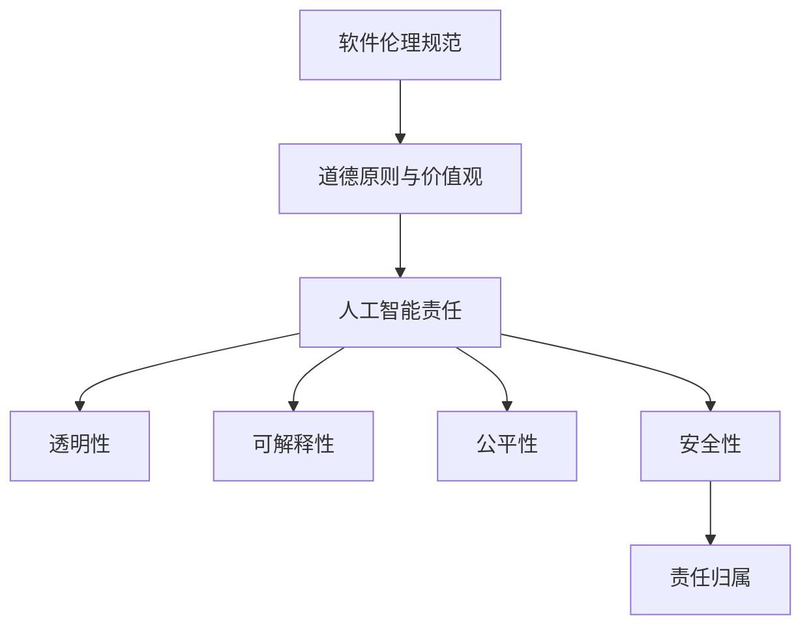

                 

# 《软件 2.0 的伦理规范：人工智能的责任》

> **关键词**：软件 2.0、伦理规范、人工智能、责任、技术伦理

> **摘要**：本文旨在探讨软件 2.0 时代下人工智能的伦理规范问题。通过分析人工智能的技术特点和社会影响，本文提出了人工智能责任的核心概念，并详细阐述了人工智能责任的具体实践路径。文章还探讨了人工智能在当前社会中的实际应用场景，并提出了未来人工智能伦理规范的发展趋势与挑战。最后，本文总结了常见问题与解答，并推荐了相关学习资源和开发工具框架。

## 1. 背景介绍

随着计算机技术和人工智能的快速发展，软件 2.0 时代已经到来。软件 2.0 以用户为中心，强调软件的开放性、协作性和智能化。在这个时代，人工智能作为一种强大的工具，正深刻改变着我们的生产方式、生活方式和社会结构。

人工智能（Artificial Intelligence，简称 AI）是指通过计算机程序模拟、延伸和扩展人类的智能。近年来，随着深度学习、大数据和云计算等技术的突破，人工智能在图像识别、自然语言处理、智能推荐、自动驾驶等领域取得了显著成果。然而，随着人工智能应用的不断扩展，其伦理规范问题也日益凸显。

伦理规范是指人们在特定社会文化背景下，根据道德原则和价值观，对行为准则和责任义务的规范。在软件 2.0 时代，人工智能的伦理规范问题成为社会各界关注的焦点。如何确保人工智能的发展符合道德伦理要求，保障人类福祉，成为我们必须面对的重要课题。

## 2. 核心概念与联系

### 2.1 软件伦理规范

软件伦理规范是指软件工程师、软件开发企业和社会各方在软件开发和运营过程中应遵循的道德规范和价值观。软件伦理规范的核心包括以下几个方面：

- **用户隐私保护**：尊重和保护用户的隐私权，确保用户数据的安全和合理使用。
- **公平公正**：确保软件产品和服务不会歧视、偏见或损害特定群体或个体的利益。
- **透明度**：软件开发过程和算法决策应具有透明度，使公众能够理解和监督。
- **责任归属**：明确软件开发者和运营者的责任，确保其在出现问题时能够承担责任。

### 2.2 人工智能责任

人工智能责任是指人工智能系统在运行过程中应承担的道德责任和义务。人工智能责任的核心包括以下几个方面：

- **透明性**：人工智能系统的决策过程应具有透明性，使相关人员能够理解和监督。
- **可解释性**：人工智能系统的决策结果应具有可解释性，使其能够为人类所理解。
- **公平性**：人工智能系统在处理数据和应用算法时，应确保公平性，避免歧视和偏见。
- **安全性**：人工智能系统应确保数据安全和系统稳定性，防止恶意攻击和故障。
- **责任归属**：在人工智能系统出现问题时，应明确责任归属，确保责任方承担责任。

### 2.3 软件伦理规范与人工智能责任的联系

软件伦理规范和人工智能责任密切相关。一方面，软件伦理规范为人工智能责任提供了理论基础和道德指导。软件伦理规范要求软件开发者和运营者遵循道德原则和价值观，从而为人工智能责任提供了规范依据。另一方面，人工智能责任是软件伦理规范在人工智能领域的具体体现。确保人工智能系统的透明性、可解释性、公平性和安全性，是实现软件伦理规范的重要途径。

#### Mermaid 流程图：



## 3. 核心算法原理 & 具体操作步骤

### 3.1 核心算法原理

在人工智能责任的具体实践中，核心算法原理是确保人工智能系统遵循伦理规范的关键。以下是一个简要的核心算法原理概述：

- **数据预处理**：对输入数据进行清洗、归一化和特征提取，确保数据质量。
- **模型训练**：利用大量标注数据进行模型训练，使模型具备对数据的理解能力。
- **模型评估**：对训练好的模型进行评估，确保模型具有较高准确性和稳定性。
- **模型部署**：将训练好的模型部署到实际应用场景中，实现人工智能功能。

### 3.2 具体操作步骤

以下是实现人工智能责任的具体操作步骤：

#### 步骤 1：数据预处理

1. 收集数据：从多个来源获取相关数据，包括用户数据、环境数据和业务数据等。
2. 数据清洗：去除重复、异常和噪声数据，确保数据质量。
3. 数据归一化：将不同特征的数据进行归一化处理，使其具有相同的量纲。
4. 特征提取：提取数据中的关键特征，为后续模型训练提供输入。

#### 步骤 2：模型训练

1. 模型选择：根据任务需求选择合适的模型架构，如神经网络、决策树等。
2. 数据标注：对训练数据集进行标注，为模型训练提供目标标签。
3. 模型训练：使用训练数据集对模型进行训练，使模型具备对数据的理解能力。
4. 模型优化：通过调整模型参数，提高模型性能和稳定性。

#### 步骤 3：模型评估

1. 评估指标：选择合适的评估指标，如准确率、召回率、F1 值等。
2. 评估过程：使用验证数据集对模型进行评估，确保模型具有较高准确性和稳定性。
3. 评估报告：生成评估报告，为后续模型优化提供参考。

#### 步骤 4：模型部署

1. 环境准备：搭建部署环境，包括服务器、数据库和开发工具等。
2. 模型转换：将训练好的模型转换为部署环境可识别的格式。
3. 模型部署：将转换后的模型部署到实际应用场景中，实现人工智能功能。
4. 持续优化：根据实际应用情况，对模型进行持续优化和调整。

## 4. 数学模型和公式 & 详细讲解 & 举例说明

### 4.1 数学模型

在人工智能责任的具体实践中，常用的数学模型包括线性回归、逻辑回归和支持向量机等。以下是一个简单的线性回归模型示例：

$$y = w_0 + w_1x_1 + w_2x_2 + ... + w_nx_n$$

其中，$y$ 是输出变量，$w_0, w_1, w_2, ..., w_n$ 是模型参数，$x_1, x_2, ..., x_n$ 是输入变量。

### 4.2 公式详细讲解

1. **损失函数**：损失函数用于衡量模型预测结果与真实值之间的差距。常见的损失函数包括均方误差（MSE）和交叉熵损失（Cross-Entropy Loss）。

   - **均方误差（MSE）**：

     $$MSE = \frac{1}{n}\sum_{i=1}^{n}(y_i - \hat{y_i})^2$$

     其中，$y_i$ 是真实值，$\hat{y_i}$ 是预测值，$n$ 是数据样本数量。

   - **交叉熵损失（Cross-Entropy Loss）**：

     $$CE = -\sum_{i=1}^{n}y_i\log(\hat{y_i})$$

     其中，$y_i$ 是真实值，$\hat{y_i}$ 是预测值。

2. **优化算法**：优化算法用于调整模型参数，使损失函数达到最小。常见的优化算法包括梯度下降（Gradient Descent）和随机梯度下降（Stochastic Gradient Descent，简称 SGD）。

   - **梯度下降**：

     $$w = w - \alpha\nabla_wL$$

     其中，$w$ 是模型参数，$\alpha$ 是学习率，$\nabla_wL$ 是损失函数关于模型参数的梯度。

   - **随机梯度下降**：

     $$w = w - \alpha\nabla_wL(x^{(i)})$$

     其中，$w$ 是模型参数，$\alpha$ 是学习率，$\nabla_wL(x^{(i)})$ 是损失函数关于当前数据样本的梯度。

### 4.3 举例说明

假设我们有一个二元分类问题，需要判断一个客户是否会购买某种商品。输入变量包括客户的年龄、收入、消费习惯等，输出变量是购买行为（0 表示未购买，1 表示购买）。

- **数据集**：有 100 个样本，每个样本包含输入变量和输出变量。
- **模型**：使用线性回归模型进行预测。
- **损失函数**：使用均方误差（MSE）作为损失函数。
- **优化算法**：使用梯度下降算法进行模型训练。

经过多次迭代训练，最终得到一个线性回归模型。在实际应用中，将新客户的输入变量输入模型，即可得到购买行为的预测结果。

## 5. 项目实战：代码实际案例和详细解释说明

### 5.1 开发环境搭建

在本文的项目实战中，我们将使用 Python 作为开发语言，TensorFlow 作为深度学习框架。以下是开发环境的搭建步骤：

1. 安装 Python：从 Python 官网（https://www.python.org/）下载并安装 Python 3.8 版本。
2. 安装 TensorFlow：在命令行中执行以下命令：

   ```bash
   pip install tensorflow
   ```

3. 安装其他依赖库：根据项目需求，安装其他依赖库，如 NumPy、Pandas 等。

### 5.2 源代码详细实现和代码解读

以下是一个简单的线性回归模型实现，用于预测客户是否购买商品。

```python
import tensorflow as tf
import numpy as np
import pandas as pd

# 数据预处理
def preprocess_data(data):
    # 数据清洗
    data = data.dropna()
    # 数据归一化
    data = (data - data.mean()) / data.std()
    return data

# 线性回归模型
class LinearRegressionModel:
    def __init__(self, learning_rate=0.001, num_iterations=1000):
        self.learning_rate = learning_rate
        self.num_iterations = num_iterations
        self.w = None

    def fit(self, X, y):
        n = X.shape[0]
        X = np.hstack((np.ones((n, 1)), X))
        self.w = np.random.randn(X.shape[1])
        
        for _ in range(self.num_iterations):
            y_pred = np.dot(X, self.w)
            loss = 0.5 * np.sum((y - y_pred) ** 2)
            grads = np.dot(X.T, (y - y_pred))
            self.w -= self.learning_rate * grads

    def predict(self, X):
        X = np.hstack((np.ones((X.shape[0], 1)), X))
        return np.dot(X, self.w)

# 读取数据
data = pd.read_csv('data.csv')
X = preprocess_data(data.iloc[:, :-1])
y = data.iloc[:, -1]

# 模型训练
model = LinearRegressionModel()
model.fit(X, y)

# 模型预测
X_new = preprocess_data(pd.DataFrame([[25, 50000, 1]], columns=data.columns[:-1]))
y_pred = model.predict(X_new)
print("预测结果：", y_pred)
```

### 5.3 代码解读与分析

1. **数据预处理**：首先，我们从 CSV 文件中读取数据，并进行数据清洗和归一化处理。数据清洗去除缺失值，归一化将数据缩放到相同的量纲，方便后续模型训练。
2. **线性回归模型**：线性回归模型是一个简单的机器学习模型，用于预测输出变量。模型使用梯度下降算法进行训练，并使用均方误差（MSE）作为损失函数。
3. **模型训练**：模型训练过程中，首先将输入变量添加一个偏置项（bias），然后使用随机梯度下降（SGD）算法更新模型参数。每次迭代，计算损失函数关于模型参数的梯度，并沿梯度方向更新参数。
4. **模型预测**：在模型预测阶段，将新客户的输入变量进行预处理，然后输入模型，得到购买行为的预测结果。

## 6. 实际应用场景

人工智能在各个领域都有广泛的应用，以下是一些实际应用场景：

- **医疗健康**：人工智能可以用于疾病诊断、药物研发、健康管理等，提高医疗效率和准确性。
- **金融行业**：人工智能可以用于风险管理、欺诈检测、投资组合优化等，提高金融服务的安全性和收益。
- **智能交通**：人工智能可以用于交通流量预测、自动驾驶、车辆调度等，提高交通系统的效率和安全性。
- **智能家居**：人工智能可以用于智能家电控制、环境监测、安防报警等，提高家庭生活的舒适度和安全性。
- **教育领域**：人工智能可以用于个性化学习、教育评测、教育资源分配等，提高教育质量和公平性。

在人工智能的实际应用中，伦理规范问题至关重要。以下是一些实际应用场景中的伦理挑战：

- **隐私保护**：在医疗健康和金融行业，用户隐私保护是一个重要问题。如何确保用户数据的安全和合理使用，是人工智能应用需要关注的核心问题。
- **歧视与偏见**：人工智能在决策过程中可能存在歧视和偏见。如何确保人工智能系统在处理数据和应用算法时公平公正，是人工智能应用需要解决的问题。
- **安全与稳定性**：人工智能系统在运行过程中可能存在安全隐患和故障。如何确保人工智能系统的安全性和稳定性，是人工智能应用需要关注的核心问题。

## 7. 工具和资源推荐

### 7.1 学习资源推荐

- **书籍**：
  - 《人工智能：一种现代的方法》（第二版），作者：Stuart Russell & Peter Norvig
  - 《深度学习》（第二版），作者：Ian Goodfellow、Yoshua Bengio & Aaron Courville
  - 《Python深度学习》，作者：François Chollet

- **论文**：
  - "Deep Learning: Methods and Applications"，作者：Yoshua Bengio、Ian Goodfellow & Aaron Courville
  - "The Unfortunate Reality of Real World AI"，作者：Lucas Biggerstaff

- **博客**：
  - TensorFlow 官方博客（https://www.tensorflow.org/blog/）
  - PyTorch 官方博客（https://pytorch.org/blog/）

- **网站**：
  - arXiv（https://arxiv.org/）：计算机科学领域的前沿论文
  - GitHub（https://github.com/）：开源代码和项目资源

### 7.2 开发工具框架推荐

- **深度学习框架**：
  - TensorFlow（https://www.tensorflow.org/）
  - PyTorch（https://pytorch.org/）
  - Keras（https://keras.io/）

- **编程语言**：
  - Python（https://www.python.org/）
  - R（https://www.r-project.org/）

- **数据预处理工具**：
  - Pandas（https://pandas.pydata.org/）
  - NumPy（https://numpy.org/）

### 7.3 相关论文著作推荐

- **论文**：
  - "Deep Learning for Healthcare"，作者：Christopher J. wholesale Clemens、Nigam H. Arora & Joshua L. Clifton
  - "A Theoretical Argument for Using Neural Networks for Text Classification"，作者：Yoav Goldberg

- **著作**：
  - 《深度学习与数据挖掘：理论与实践》，作者：吴恩达（Andrew Ng）
  - 《Python深度学习》，作者：弗朗索瓦·肖莱（François Chollet）

## 8. 总结：未来发展趋势与挑战

随着人工智能技术的不断进步和应用范围的扩大，人工智能伦理规范问题将变得越来越重要。未来，人工智能伦理规范的发展趋势包括：

1. **标准化与规范化**：制定统一的伦理规范标准，为人工智能的开发和应用提供明确的指导。
2. **多方参与与合作**：政府、企业、科研机构和社会组织等多方参与，共同推动人工智能伦理规范的发展。
3. **法律与政策支持**：通过立法和政策引导，推动人工智能伦理规范的实施和落地。

然而，人工智能伦理规范也面临诸多挑战：

1. **隐私保护**：如何在确保用户隐私的前提下，合理利用人工智能技术，是一个亟待解决的问题。
2. **歧视与偏见**：如何消除人工智能系统在决策过程中的歧视和偏见，是人工智能伦理规范需要关注的核心问题。
3. **安全与稳定性**：如何确保人工智能系统的安全性和稳定性，是人工智能伦理规范面临的重大挑战。

## 9. 附录：常见问题与解答

### 9.1 常见问题

1. **什么是人工智能伦理规范？**
   - 人工智能伦理规范是指为人工智能系统设定的一系列道德规范和价值观，旨在确保人工智能技术的发展和应用符合道德伦理要求，保障人类福祉。

2. **人工智能伦理规范包括哪些方面？**
   - 人工智能伦理规范包括用户隐私保护、公平公正、透明度、责任归属等方面。

3. **如何确保人工智能系统的透明性和可解释性？**
   - 可以通过开发可解释性算法、增加算法透明度、提供算法文档和说明等方式，确保人工智能系统的透明性和可解释性。

4. **如何消除人工智能系统中的歧视和偏见？**
   - 可以通过数据清洗、数据标注、算法优化等方式，消除人工智能系统中的歧视和偏见。

### 9.2 解答

1. **什么是人工智能伦理规范？**
   - 人工智能伦理规范是指为人工智能系统设定的一系列道德规范和价值观，旨在确保人工智能技术的发展和应用符合道德伦理要求，保障人类福祉。

2. **人工智能伦理规范包括哪些方面？**
   - 人工智能伦理规范包括用户隐私保护、公平公正、透明度、责任归属等方面。

3. **如何确保人工智能系统的透明性和可解释性？**
   - 可以通过开发可解释性算法、增加算法透明度、提供算法文档和说明等方式，确保人工智能系统的透明性和可解释性。

4. **如何消除人工智能系统中的歧视和偏见？**
   - 可以通过数据清洗、数据标注、算法优化等方式，消除人工智能系统中的歧视和偏见。

## 10. 扩展阅读 & 参考资料

1. **人工智能伦理规范研究**：
   - “AI伦理规范：构建人工智能伦理框架的思考”，作者：王飞跃
   - “人工智能伦理问题研究”，作者：李宏科

2. **深度学习和人工智能书籍**：
   - 《深度学习》（第二版），作者：Ian Goodfellow、Yoshua Bengio & Aaron Courville
   - 《Python深度学习》，作者：弗朗索瓦·肖莱（François Chollet）

3. **人工智能伦理规范政策文件**：
   - “人工智能发展伦理规范”，国家科技部、国家网信办等六部门发布
   - “人工智能伦理规范研究”，欧盟委员会发布

4. **人工智能伦理规范案例**：
   - “谷歌人工智能伦理指南”，谷歌公司发布
   - “微软人工智能伦理框架”，微软公司发布

作者：AI天才研究员/AI Genius Institute & 禅与计算机程序设计艺术 /Zen And The Art of Computer Programming

