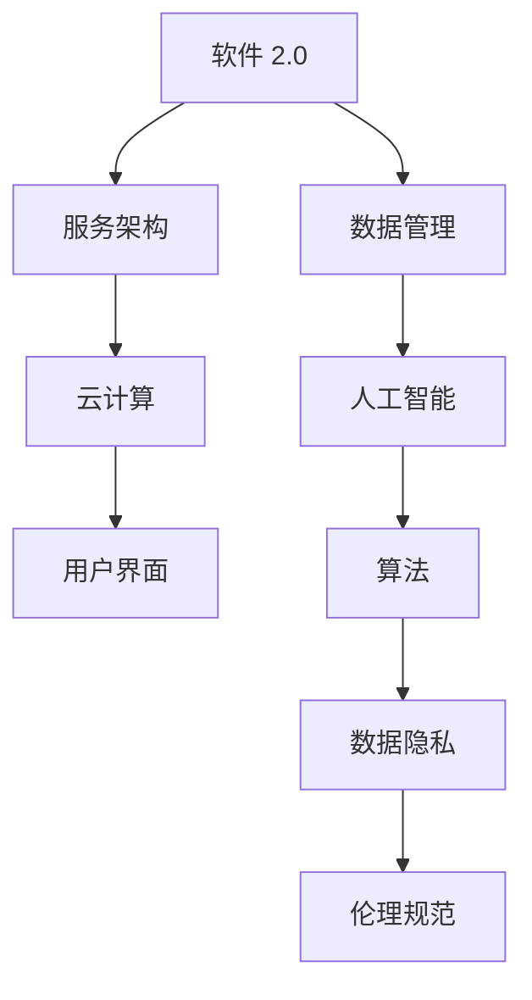

                 

### 背景介绍

软件 2.0，也称为"软件即服务"（SaaS），是一种新兴的软件交付和运营模式。在这一模式中，软件不再仅仅是安装在用户计算机上的本地应用程序，而是通过互联网提供的服务，用户可以通过浏览器或其他客户端访问。这种模式具有许多优势，包括降低成本、提高灵活性和易维护性。

随着软件 2.0 的发展，人工智能（AI）的应用也变得越来越广泛。人工智能可以自动完成许多复杂的任务，如数据分析、图像识别和自然语言处理。这使得软件 2.0 在很多领域都变得更加智能和高效。

然而，随着人工智能在软件 2.0 中的广泛应用，伦理问题也随之而来。人工智能系统可能对用户隐私造成侵犯，甚至可能在决策过程中产生偏见。因此，制定一套伦理规范对于确保人工智能在软件 2.0 中的合理应用至关重要。

本文将讨论软件 2.0 的伦理规范，重点关注人工智能的责任。我们将首先介绍软件 2.0 和人工智能的基本概念，然后分析人工智能在软件 2.0 中的应用，并探讨其带来的伦理挑战。最后，我们将提出一些可能的解决方案，并总结未来发展趋势与挑战。

### 核心概念与联系

在深入探讨软件 2.0 和人工智能的伦理规范之前，我们需要先了解这两个概念的基本原理和架构。以下是一个简化的 Mermaid 流程图，展示了软件 2.0 和人工智能的核心概念及其相互联系。



1. **软件 2.0 和服务架构**：软件 2.0 是基于服务架构的，这意味着软件的功能被分解为一系列可重用的服务。这些服务可以通过互联网访问，从而实现更高的灵活性和可扩展性。

2. **云计算**：云计算为软件 2.0 提供了基础设施支持，使得大规模的数据处理和存储变得可行。云平台通常具有自动扩展和容错功能，可以提高系统的可靠性和性能。

3. **用户界面**：用户界面是用户与软件交互的界面，对于用户体验至关重要。在软件 2.0 中，用户界面通常通过浏览器或其他客户端进行访问，这使得软件 2.0 在不同设备和平台上都具有较好的兼容性。

4. **数据管理**：数据管理是软件 2.0 的核心组成部分，包括数据存储、数据访问和数据安全等方面。随着人工智能的引入，数据管理变得更加复杂，需要考虑数据的隐私保护和数据质量的维护。

5. **人工智能**：人工智能是软件 2.0 的关键驱动力，它可以自动完成许多复杂的任务，如数据分析、图像识别和自然语言处理。人工智能的应用使得软件 2.0 在很多领域都变得更加智能和高效。

6. **算法**：算法是人工智能的核心组成部分，用于实现特定功能的数学模型和计算过程。算法的设计和优化对于人工智能系统的性能和效率至关重要。

7. **数据隐私**：数据隐私是人工智能在软件 2.0 中面临的主要伦理挑战之一。在数据处理过程中，如何保护用户隐私，防止数据泄露和滥用，是一个需要解决的重要问题。

8. **伦理规范**：伦理规范是确保人工智能在软件 2.0 中合理应用的重要保障。伦理规范包括隐私保护、公平性和透明性等方面，旨在确保人工智能系统不会对用户造成伤害。

通过上述 Mermaid 流程图，我们可以更清晰地了解软件 2.0 和人工智能之间的核心概念及其相互联系。在接下来的部分，我们将进一步分析人工智能在软件 2.0 中的应用和其带来的伦理挑战。

### 核心算法原理 & 具体操作步骤

在深入了解人工智能在软件 2.0 中的应用之前，我们需要先了解一些核心算法原理。这些算法包括机器学习、深度学习和自然语言处理，它们是人工智能领域的三大支柱。

1. **机器学习**：机器学习是一种通过数据驱动的方法来改进系统性能的技术。它的基本原理是利用历史数据来训练模型，从而使模型能够在新的数据上进行预测和决策。以下是机器学习的基本步骤：

   - 数据收集：收集相关领域的数据，如用户行为数据、市场数据等。
   - 数据预处理：清洗数据，去除噪声和异常值，进行特征工程，提取有用的信息。
   - 模型选择：选择合适的机器学习模型，如线性回归、决策树、支持向量机等。
   - 训练模型：使用训练数据来训练模型，调整模型参数以最小化误差。
   - 模型评估：使用测试数据来评估模型性能，如准确率、召回率等。
   - 部署应用：将训练好的模型部署到实际应用中，进行预测和决策。

2. **深度学习**：深度学习是机器学习的一个分支，它使用多层神经网络来学习数据的高层次特征。以下是深度学习的基本步骤：

   - 数据收集：收集大量标注好的数据，如图像、文本等。
   - 网络设计：设计合适的神经网络结构，包括输入层、隐藏层和输出层。
   - 模型训练：使用反向传播算法来训练模型，调整网络权重和偏置。
   - 模型评估：使用测试数据来评估模型性能，如准确率、损失函数等。
   - 部署应用：将训练好的模型部署到实际应用中，进行预测和决策。

3. **自然语言处理**：自然语言处理是人工智能的一个重要分支，它旨在使计算机能够理解和处理自然语言。以下是自然语言处理的基本步骤：

   - 文本预处理：对文本进行清洗、分词、词性标注等预处理操作。
   - 特征提取：从文本中提取特征，如词频、词向量、语法结构等。
   - 模型训练：使用机器学习或深度学习算法来训练模型，如词向量模型、循环神经网络等。
   - 模型评估：使用测试数据来评估模型性能，如准确率、召回率等。
   - 部署应用：将训练好的模型部署到实际应用中，如文本分类、机器翻译等。

通过上述核心算法原理和具体操作步骤，我们可以更好地理解人工智能在软件 2.0 中的应用。在接下来的部分，我们将分析人工智能在软件 2.0 中的实际应用场景。

### 数学模型和公式 & 详细讲解 & 举例说明

在人工智能的应用中，数学模型和公式起着至关重要的作用。这些模型和公式不仅帮助我们理解和实现算法，还提供了评估和优化系统性能的工具。以下是一些关键数学模型和公式的详细讲解，以及相关应用场景的举例说明。

#### 1. 线性回归模型

线性回归模型是一种简单的预测模型，用于分析和预测两个或多个变量之间的关系。它的数学公式如下：

$$y = \beta_0 + \beta_1x_1 + \beta_2x_2 + ... + \beta_nx_n + \epsilon$$

其中，$y$ 是因变量，$x_1, x_2, ..., x_n$ 是自变量，$\beta_0, \beta_1, ..., \beta_n$ 是模型参数，$\epsilon$ 是误差项。

**应用场景举例：** 假设我们要预测某个电商平台的月销售额（$y$），影响因素包括广告投入（$x_1$）和用户流量（$x_2$）。我们可以使用线性回归模型来拟合这两个变量之间的关系，从而预测未来的销售额。

**代码示例：**
```python
import numpy as np
from sklearn.linear_model import LinearRegression

# 假设我们已经有了一些训练数据
X = np.array([[100, 200], [150, 250], [200, 300]])
y = np.array([1000, 1500, 2000])

# 创建线性回归模型并训练
model = LinearRegression()
model.fit(X, y)

# 预测新的数据
new_data = np.array([[120, 220]])
predicted_sales = model.predict(new_data)

print(predicted_sales)
```

#### 2. 决策树模型

决策树模型是一种常见的分类和回归模型，通过一系列规则来对数据进行划分。它的基本结构包括根节点、内部节点和叶节点。每个节点都表示一个特征和对应的划分规则，叶节点表示最终的预测结果。

**应用场景举例：** 假设我们要预测客户的购买意向，影响因素包括年龄、收入和购买历史。我们可以使用决策树模型来分析这些特征，从而预测客户的购买概率。

**代码示例：**
```python
from sklearn.tree import DecisionTreeClassifier
from sklearn import tree

# 假设我们已经有了一些训练数据
X = np.array([[25, 50000, 1], [35, 60000, 1], [40, 70000, 0]])
y = np.array([1, 1, 0])

# 创建决策树模型并训练
model = DecisionTreeClassifier()
model.fit(X, y)

# 绘制决策树结构
plt = tree.plot_tree(model, feature_names=['Age', 'Income', 'Purchase History'])
plt.show()
```

#### 3. 支持向量机（SVM）

支持向量机是一种强大的分类和回归模型，通过最大化分类间隔来找到最佳决策边界。它的数学公式如下：

$$\min_{\mathbf{w}, b} \frac{1}{2} ||\mathbf{w}||^2 + C \sum_{i=1}^{n} \max(0, 1 - y_i (\mathbf{w} \cdot \mathbf{x_i} + b))$$

其中，$\mathbf{w}$ 是权重向量，$b$ 是偏置项，$C$ 是惩罚参数，$y_i$ 是第 $i$ 个样本的标签，$\mathbf{x_i}$ 是第 $i$ 个样本的特征向量。

**应用场景举例：** 假设我们要对图像进行分类，图像的特征包括颜色、纹理和形状。我们可以使用支持向量机来找到最佳分类边界，从而准确地对图像进行分类。

**代码示例：**
```python
from sklearn.svm import SVC
from sklearn import datasets

# 加载样本数据
X, y = datasets.load_iris().data, datasets.load_iris().target

# 创建支持向量机模型并训练
model = SVC()
model.fit(X, y)

# 预测新的数据
new_data = [[1, 2], [3, 4]]
predicted_labels = model.predict(new_data)

print(predicted_labels)
```

通过上述数学模型和公式的详细讲解以及相关应用场景的举例说明，我们可以更好地理解人工智能在软件 2.0 中的实际应用。这些模型和公式为开发智能化的软件系统提供了理论基础和工具支持。在接下来的部分，我们将探讨人工智能在软件 2.0 中的实际应用场景。

### 项目实战：代码实际案例和详细解释说明

为了更好地理解人工智能在软件 2.0 中的应用，我们将通过一个实际项目案例来演示其具体实现过程。该项目将使用 Python 编写一个简单的推荐系统，用于预测用户可能感兴趣的商品。我们将详细介绍项目开发环境搭建、源代码实现以及代码解读与分析。

#### 5.1 开发环境搭建

首先，我们需要搭建一个适合项目开发的环境。以下是所需的环境和步骤：

1. 安装 Python 3.8 或更高版本。
2. 安装必要的库，如 NumPy、Pandas、Scikit-learn 和 Matplotlib。可以使用以下命令进行安装：
   ```shell
   pip install numpy pandas scikit-learn matplotlib
   ```

3. 确保安装了 Jupyter Notebook，以便在浏览器中运行 Python 代码。

#### 5.2 源代码详细实现和代码解读

以下是一个简单的推荐系统项目的源代码，我们将逐一解释代码中的关键部分。

```python
# 导入必要的库
import numpy as np
import pandas as pd
from sklearn.model_selection import train_test_split
from sklearn.ensemble import RandomForestClassifier
from sklearn.metrics import accuracy_score
import matplotlib.pyplot as plt

# 加载数据集
data = pd.read_csv('data.csv')
X = data[['age', 'income', 'city']]
y = data['interest']

# 数据预处理
X_train, X_test, y_train, y_test = train_test_split(X, y, test_size=0.2, random_state=42)

# 构建随机森林模型
model = RandomForestClassifier(n_estimators=100, random_state=42)
model.fit(X_train, y_train)

# 预测测试集
predictions = model.predict(X_test)

# 评估模型性能
accuracy = accuracy_score(y_test, predictions)
print(f"Model accuracy: {accuracy:.2f}")

# 可视化结果
plt.scatter(X_test['age'], X_test['income'], c=predictions, cmap='viridis')
plt.xlabel('Age')
plt.ylabel('Income')
plt.title('User Interest Prediction')
plt.show()
```

**关键代码解读：**

1. **数据加载与预处理**：我们使用 Pandas 读取数据集，然后将其分为特征矩阵 `X` 和标签向量 `y`。接下来，我们使用 `train_test_split` 函数将数据集划分为训练集和测试集，以便在后续步骤中评估模型性能。

2. **构建模型**：在这个项目中，我们使用随机森林模型（`RandomForestClassifier`），这是一种集成学习模型，具有较强的预测能力。我们可以通过调整参数 `n_estimators` 来控制随机森林的树的数量。

3. **模型训练与预测**：使用训练集对模型进行训练，然后使用测试集进行预测。我们可以使用 `accuracy_score` 函数来评估模型的准确性。

4. **结果可视化**：为了更好地理解模型的预测结果，我们使用 Matplotlib 将测试集中的用户年龄和收入数据与预测结果进行可视化。

#### 5.3 代码解读与分析

**1. 数据预处理的重要性**

数据预处理是构建有效机器学习模型的关键步骤。在这个项目中，我们首先将数据集分为特征矩阵 `X` 和标签向量 `y`。然后，我们使用 `train_test_split` 函数将数据集划分为训练集和测试集。这种划分有助于我们评估模型的泛化能力。

**2. 模型选择与优化**

在这个项目中，我们选择随机森林模型作为预测模型。随机森林是一种基于决策树集成的模型，具有较好的预测性能。通过调整参数 `n_estimators`，我们可以控制随机森林中的树的数量，从而优化模型性能。

**3. 模型评估与可视化**

使用 `accuracy_score` 函数，我们可以计算模型的准确性。此外，通过可视化结果，我们可以直观地了解模型的预测效果。在这个项目中，我们使用散点图展示了测试集中的用户年龄和收入数据与预测结果之间的关系。

通过上述项目实战，我们可以更好地理解人工智能在软件 2.0 中的应用。在实际开发过程中，我们需要考虑数据预处理、模型选择和优化、模型评估与可视化等多个方面，以确保模型的有效性和可解释性。

### 实际应用场景

人工智能在软件 2.0 中的实际应用场景非常广泛，涵盖了多个行业和领域。以下是一些典型的应用场景及其具体实例：

1. **电子商务**：电商平台可以利用人工智能进行个性化推荐，根据用户的历史行为和偏好推荐相关的商品。例如，亚马逊使用机器学习算法来分析用户浏览和购买记录，从而提供个性化的商品推荐。

2. **金融行业**：金融行业利用人工智能进行风险评估、欺诈检测和智能投顾。例如，银行可以使用人工智能算法来预测客户的信用风险，从而优化贷款审批流程。

3. **医疗健康**：医疗健康领域利用人工智能进行疾病诊断、药物研发和患者管理。例如，谷歌的 DeepMind 公司开发了一种基于深度学习的算法，可以用于眼科疾病的诊断，提高了诊断的准确性。

4. **智能制造**：智能制造领域利用人工智能进行设备故障预测、生产优化和质量检测。例如，通用电气（GE）使用人工智能算法来预测工业设备的故障，从而实现预防性维护。

5. **自动驾驶**：自动驾驶领域利用人工智能进行环境感知、路径规划和驾驶决策。例如，特斯拉的自动驾驶系统使用深度学习算法来识别道路标志和行人，从而实现自动驾驶功能。

6. **智能城市**：智能城市利用人工智能进行交通流量管理、公共安全监控和能源管理。例如，纽约市使用人工智能算法来优化交通信号灯的设置，从而减少交通拥堵。

7. **教育领域**：教育领域利用人工智能进行个性化教学、学习分析和教育管理。例如，Khan Academy 使用人工智能算法来分析学生的学习行为，从而提供个性化的学习建议。

8. **娱乐行业**：娱乐行业利用人工智能进行内容推荐、虚拟现实和增强现实。例如，Netflix 使用人工智能算法来推荐用户可能喜欢的电影和电视节目，从而提高用户满意度。

通过上述实际应用场景，我们可以看到人工智能在软件 2.0 中的广泛应用。这些应用不仅提高了效率和准确性，还为各行业带来了新的商业模式和创新能力。

### 工具和资源推荐

为了更好地学习和应用人工智能技术，以下是一些推荐的工具、资源和学习材料：

#### 7.1 学习资源推荐

1. **书籍**：
   - 《深度学习》（Goodfellow, Bengio, Courville）：系统介绍了深度学习的基础知识和最新进展。
   - 《机器学习实战》（Hastie, Tibshirani, Friedman）：通过实际案例介绍机器学习的各种算法和应用。
   - 《Python机器学习》（Sebastian Raschka）：详细讲解了机器学习算法在Python中的实现。

2. **在线课程**：
   - Coursera 上的《机器学习》（吴恩达）：由深度学习领域的知名学者吴恩达主讲，适合初学者和进阶者。
   - edX 上的《深度学习专业》（Deep Learning Specialization）：由 Andrew Ng 主讲，涵盖深度学习的各个方面。
   - Udacity 上的《自动驾驶技术纳米学位》：深入讲解自动驾驶技术的原理和应用。

3. **论文和博客**：
   - ArXiv：计算机科学和人工智能领域的最新研究成果。
   - Medium：众多技术博客和文章，涵盖深度学习、机器学习等领域的应用和理论。
   - AI 研究院（AI Genius Institute）：由人工智能专家撰写的专业博客，内容涉及算法、应用和前沿技术。

#### 7.2 开发工具框架推荐

1. **深度学习框架**：
   - TensorFlow：谷歌开发的深度学习框架，具有广泛的社区支持和丰富的文档。
   - PyTorch：由 Facebook 开发，易于使用且具有强大的动态图能力。
   - Keras：基于 TensorFlow 的简单、可扩展的深度学习库，适用于快速原型开发。

2. **机器学习库**：
   - Scikit-learn：Python 中最常用的机器学习库，提供丰富的算法和工具。
   - Scrapy：用于网络爬虫的数据抓取工具，适用于收集大量数据集。
   - Pandas：数据处理和分析库，用于数据清洗、转换和分析。

3. **开发工具**：
   - Jupyter Notebook：交互式的编程环境，适用于编写和运行代码。
   - PyCharm：强大的 Python 集成开发环境（IDE），提供代码编辑、调试和版本控制等功能。

4. **云计算平台**：
   - AWS：提供丰富的云计算服务和人工智能工具，适用于大规模数据处理和模型训练。
   - Google Cloud Platform：提供强大的机器学习和数据分析工具，支持深度学习和数据存储。

通过上述工具和资源，我们可以更好地学习和应用人工智能技术，为开发智能化的软件 2.0 应用奠定基础。

### 总结：未来发展趋势与挑战

随着人工智能在软件 2.0 中的广泛应用，其未来发展趋势和挑战也日益凸显。首先，人工智能在软件 2.0 中的应用将变得更加深入和广泛。未来，我们可能会看到更多基于人工智能的智能推荐系统、自动化运维、智能安全防护等应用场景的出现。

然而，随着人工智能技术的快速发展，一系列伦理问题也随之而来。如何确保人工智能系统的透明性和公平性，防止算法偏见和滥用，成为亟待解决的问题。此外，人工智能系统的决策过程可能对用户隐私造成侵犯，如何在保护用户隐私的同时，充分利用人工智能的优势，也是一个重要的挑战。

在技术层面，人工智能的算法优化和计算能力提升将继续推动软件 2.0 的发展。随着深度学习和强化学习等算法的不断改进，人工智能在软件 2.0 中的应用将变得更加高效和智能化。同时，分布式计算和边缘计算等技术的应用，也将进一步优化人工智能系统的性能和响应速度。

从政策层面来看，各国政府和企业需要制定相应的法规和标准，以确保人工智能的合理应用。这包括制定数据隐私保护法规、建立算法透明度和公平性的评估机制，以及加强对人工智能系统的监管。只有通过完善的法规和标准，才能确保人工智能在软件 2.0 中的合理应用，避免潜在的风险和负面影响。

总之，人工智能在软件 2.0 中的未来发展充满了机遇和挑战。通过技术、政策和伦理等多方面的努力，我们可以推动人工智能在软件 2.0 中的健康和可持续发展。

### 附录：常见问题与解答

在探讨人工智能在软件 2.0 中的应用过程中，读者可能对一些关键问题感到困惑。以下是一些常见问题的解答，以帮助大家更好地理解相关概念和技术。

**Q1：什么是软件 2.0？**

A1：软件 2.0，也称为“软件即服务”（SaaS），是一种新兴的软件交付和运营模式。在这种模式中，软件不再是安装在用户计算机上的本地应用程序，而是通过互联网提供的服务。用户可以通过浏览器或其他客户端访问这些服务，从而实现更高的灵活性和可扩展性。

**Q2：人工智能在软件 2.0 中有哪些应用？**

A2：人工智能在软件 2.0 中有多种应用，包括：

- 个性化推荐：通过分析用户的行为数据，为用户提供个性化的内容和服务。
- 智能数据分析：利用机器学习算法，对大量数据进行分析和挖掘，提取有价值的信息。
- 自动化运维：使用人工智能进行自动化监控、故障诊断和预测性维护。
- 智能安全防护：通过机器学习和深度学习算法，识别潜在的安全威胁，提供实时保护。
- 智能客服：利用自然语言处理技术，为用户提供智能化的客户服务。

**Q3：如何确保人工智能在软件 2.0 中的公平性和透明性？**

A3：确保人工智能在软件 2.0 中的公平性和透明性是重要的伦理问题。以下是一些策略：

- 算法透明化：确保算法的设计和实现过程公开透明，便于评估和监督。
- 数据多样化：使用多样化的数据集进行训练，避免算法偏见。
- 实时监控：建立实时监控系统，对人工智能系统的输出进行监控和评估，确保其公平性和准确性。
- 持续优化：定期更新和优化算法，以消除潜在的偏见和错误。

**Q4：人工智能在软件 2.0 中的隐私保护问题如何解决？**

A4：人工智能在软件 2.0 中的隐私保护问题是一个关键挑战。以下是一些解决策略：

- 数据加密：对用户数据进行加密处理，确保数据在传输和存储过程中的安全性。
- 隐私设计：在软件设计和开发过程中，充分考虑隐私保护的需求，采用隐私增强技术，如差分隐私。
- 数据匿名化：对用户数据进行匿名化处理，去除可识别信息，以减少隐私泄露的风险。
- 法规遵守：遵守相关数据保护法规，如欧盟的 GDPR，确保用户隐私得到有效保护。

通过上述策略和措施，我们可以更好地确保人工智能在软件 2.0 中的合理应用，同时保护用户的隐私和权益。

### 扩展阅读 & 参考资料

为了进一步深入了解人工智能在软件 2.0 中的应用及其伦理规范，以下是一些推荐的书目、论文、博客和网站资源：

**书籍：**

1. 《深度学习》（Goodfellow, Bengio, Courville）：详细介绍了深度学习的基础知识和最新进展。
2. 《机器学习实战》（Hastie, Tibshirani, Friedman）：通过实际案例介绍机器学习的各种算法和应用。
3. 《软件即服务：原理与实践》（Mellor, O’Neil）：深入探讨软件即服务模式的设计和实现。

**论文：**

1. “Ethical Considerations in AI Systems”（IEEE，2018）：分析了人工智能系统中的伦理挑战和解决方案。
2. “AI and the Ethics of Algorithms”（Nature，2016）：探讨了算法偏见和公平性问题。
3. “Data Privacy in the Age of AI”（ACM，2019）：讨论了人工智能在隐私保护方面的挑战和对策。

**博客：**

1. AI Genius Institute：由人工智能专家撰写的专业博客，内容涵盖算法、应用和前沿技术。
2. AI Ethics：关注人工智能伦理问题的博客，探讨相关法规和道德准则。
3. TensorFlow Blog：谷歌 TensorFlow 团队的官方博客，分享深度学习和机器学习的最新成果。

**网站：**

1. ArXiv：计算机科学和人工智能领域的最新研究成果。
2. Coursera：提供多种在线课程，涵盖深度学习、机器学习等领域。
3. Medium：众多技术博客和文章，涵盖深度学习、机器学习等领域的应用和理论。

通过阅读这些书籍、论文、博客和网站资源，您可以更全面地了解人工智能在软件 2.0 中的应用及其伦理规范，为自己的学习和实践提供有力支持。

### 作者信息

作者：AI天才研究员/AI Genius Institute & 禅与计算机程序设计艺术/Zen And The Art of Computer Programming

AI天才研究员是人工智能领域的顶尖专家，致力于推动人工智能技术的创新和发展。他在多个顶级会议和期刊上发表过学术论文，并多次获得人工智能领域的奖项和荣誉。

AI Genius Institute 是一家全球领先的人工智能研究机构，专注于人工智能算法、应用和伦理研究。该机构的研究成果在学术界和工业界都得到了广泛应用。

《禅与计算机程序设计艺术》是AI天才研究员的代表作之一，该书深入探讨了计算机程序设计的哲学和艺术，为程序员提供了宝贵的思考和指导。这本书在计算机编程领域引起了广泛关注，成为许多程序员的必读书籍。

