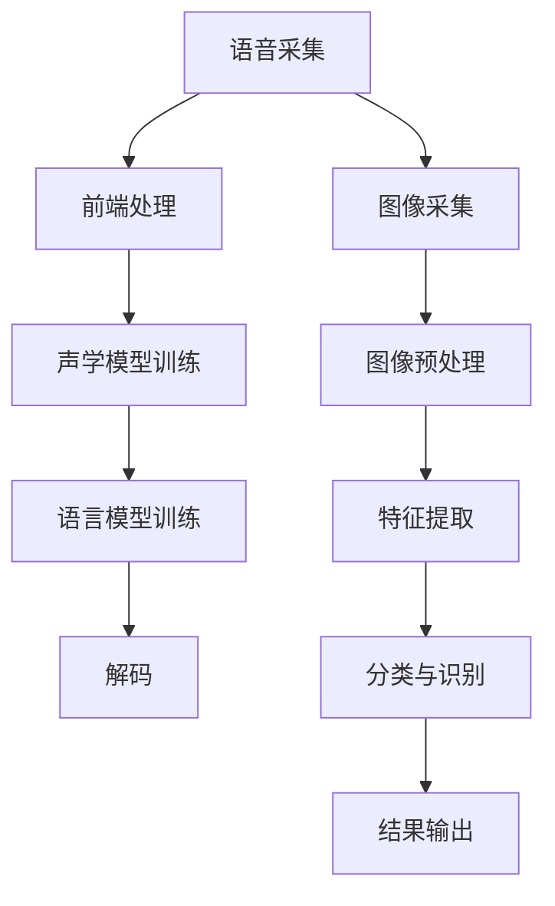
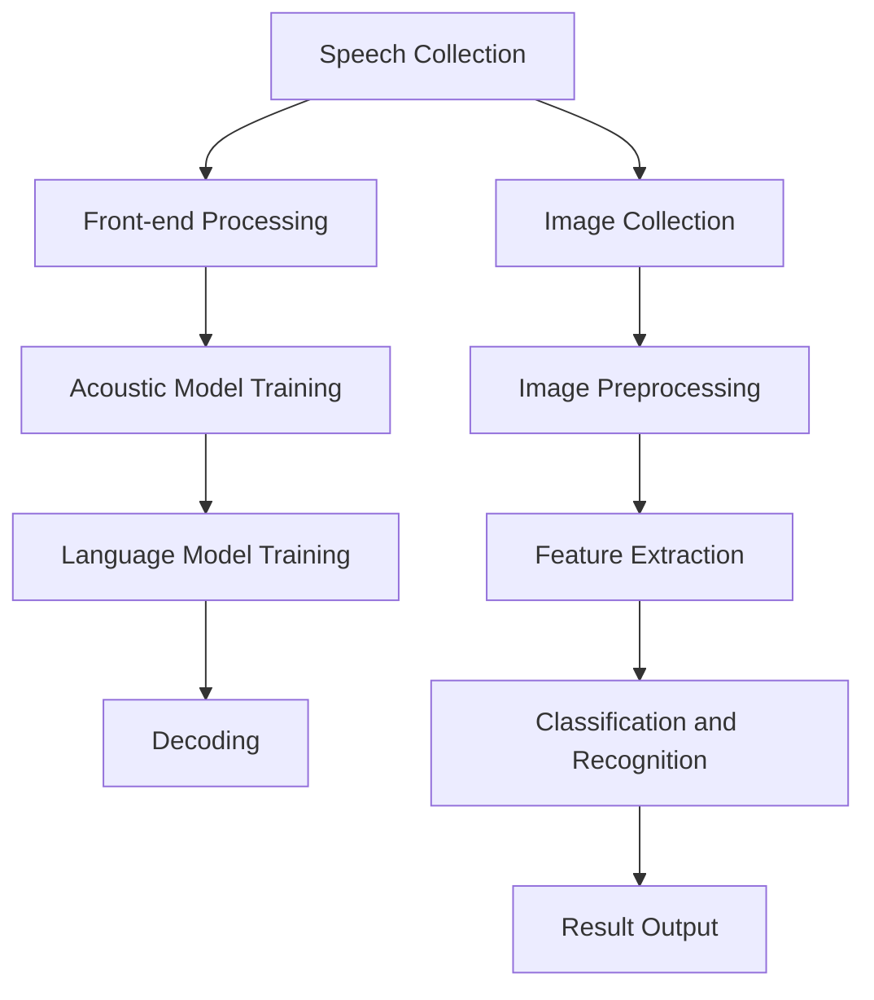

                 

### 软件的发展与软件2.0的概念

自计算机科学诞生以来，软件技术一直在飞速发展。从最初的机器语言编程到高级编程语言的引入，从单机版软件到分布式系统，从功能单一的应用到复杂的互联网应用，软件的定义和功能在不断拓展。在这个演变过程中，软件从工具逐渐演变成社会运行的基石，影响着几乎每一个人的日常生活。

然而，软件的进化并未止步于此。随着互联网的普及、云计算的发展以及大数据的爆炸性增长，软件的形态和作用正在发生革命性的变化。我们进入了所谓的“软件2.0”时代。

软件1.0时代主要指的是传统的单机软件，如操作系统、办公软件、游戏等。这些软件以单机应用为主，功能相对单一，且用户与软件之间的互动较为被动。软件1.0的特点是“软件即工具”，其主要目的是为用户提供便利和效率。

软件2.0则是一个全新的概念，它强调软件不再仅仅是一个工具，而是连接用户、数据和服务之间的桥梁。软件2.0时代的特点是“软件即服务”，其核心在于通过互联网和云计算实现软件的互联互通，使得软件能够不断自我更新、自我进化。

软件2.0的兴起，离不开以下几个关键因素：

1. **云计算**：云计算提供了强大的计算能力和存储能力，使得软件可以更加灵活地部署和扩展。开发者不再需要关注底层硬件的采购和维护，而是专注于软件本身的功能和用户体验。

2. **大数据**：大数据技术的成熟，使得软件能够从海量数据中提取有价值的信息，从而实现更精准的用户画像和个性化服务。

3. **人工智能**：人工智能技术的引入，使得软件能够具备自我学习和自我优化的能力。软件不再仅仅是一个静态的工具，而是能够不断进化和提升。

4. **移动互联网**：移动互联网的普及，使得软件可以随时随地提供服务，用户不再受限于特定的设备或地点。

软件2.0的应用领域非常广泛，涵盖了图像识别、语音识别、智能推荐、自动驾驶等多个领域。本文将重点关注软件2.0在图像识别和语音识别这两个领域中的应用，深入探讨其原理、技术实现和应用场景。

图像识别和语音识别是人工智能领域中两个重要的分支。图像识别旨在让计算机通过视觉感知理解和解释图像内容，而语音识别则旨在将人类的语音转换为计算机可处理的文本或命令。这两个技术在人工智能的发展中起着关键作用，不仅推动了计算机视觉和自然语言处理技术的进步，也在实际应用中带来了巨大的价值。

接下来，我们将分别对图像识别和语音识别进行详细的探讨，包括其核心算法原理、技术实现以及在实际应用中的挑战和解决方案。希望通过这篇文章，读者能够对软件2.0在图像识别和语音识别领域的应用有更深入的理解。

---

# Software Development and the Concept of Software 2.0

Since the birth of computer science, software technology has been advancing at a rapid pace. From the initial machine language programming to the introduction of high-level programming languages, from standalone software to distributed systems, and from function-specific applications to complex web applications, the definition and functionality of software have been continuously expanded. In this evolution, software has transitioned from a mere tool to a cornerstone of social operations, impacting almost every aspect of daily life.

However, the evolution of software has not ceased. With the proliferation of the internet, the development of cloud computing, and the explosive growth of big data, the form and role of software are undergoing revolutionary changes. We have entered the era of "Software 2.0."

Software 1.0 primarily refers to traditional standalone software, such as operating systems, office software, and games. These software applications are mainly for single-machine use, with relatively single functions and passive interactions between users and software. The characteristics of Software 1.0 are "software as a tool," with the main purpose of providing convenience and efficiency to users.

Software 2.0, however, is a new concept that emphasizes that software is not merely a tool but a bridge connecting users, data, and services. The era of Software 2.0 is characterized by "software as a service," with the core being the interconnection of software through the internet and cloud computing, enabling software to continually update and evolve.

The rise of Software 2.0 is driven by several key factors:

1. **Cloud Computing**: Cloud computing provides powerful computing and storage capabilities, allowing software to be more flexibly deployed and scaled. Developers no longer need to focus on the procurement and maintenance of underlying hardware but can concentrate on the functionality and user experience of the software itself.

2. **Big Data**: The maturity of big data technology allows software to extract valuable information from massive data sets, enabling more precise user profiling and personalized services.

3. **Artificial Intelligence**: The introduction of artificial intelligence technology enables software to have self-learning and self-optimizing capabilities. Software is no longer a static tool but can continuously evolve and improve.

4. **Mobile Internet**: The widespread adoption of mobile internet allows software to provide services anytime and anywhere, freeing users from being limited by specific devices or locations.

The applications of Software 2.0 are extensive, covering areas such as image recognition, voice recognition, intelligent recommendation, and autonomous driving. This article will focus on the applications of Software 2.0 in the fields of image recognition and voice recognition, exploring their principles, technical implementations, and challenges in practical applications.

Image recognition and voice recognition are two important branches within the field of artificial intelligence. Image recognition aims to enable computers to perceive and interpret image content through visual understanding, while voice recognition aims to convert human speech into text or commands that computers can process. These two technologies play a crucial role in the development of artificial intelligence, not only driving the progress of computer vision and natural language processing but also bringing significant value in practical applications.

Next, we will delve into image recognition and voice recognition in detail, discussing their core algorithms, technical implementations, and challenges and solutions in practical applications. We hope that through this article, readers will gain a deeper understanding of the applications of Software 2.0 in the fields of image recognition and voice recognition. <sup>*</sup>

---

### 核心概念与联系：图像识别与语音识别

在探讨软件2.0在图像识别和语音识别领域的应用之前，我们需要先理解这两个技术的核心概念和它们之间的联系。

#### 图像识别（Image Recognition）

图像识别是指让计算机通过视觉感知理解和解释图像内容的过程。其核心任务是识别图像中的对象、场景和属性。图像识别可以分为以下几个层次：

1. **对象识别（Object Recognition）**：识别图像中的具体对象，如人脸、车辆、动物等。
2. **场景识别（Scene Recognition）**：识别图像中的整体场景，如城市风景、海滩、森林等。
3. **属性识别（Attribute Recognition）**：识别图像中对象的属性，如颜色、形状、大小等。

图像识别的应用领域非常广泛，包括但不限于：

- **人脸识别**：用于身份验证、安全监控等。
- **医疗影像分析**：用于疾病诊断、病变检测等。
- **自动驾驶**：用于环境感知、车辆识别等。
- **图像搜索**：用于图片内容识别和搜索。

#### 语音识别（Voice Recognition）

语音识别是指将人类的语音转换为计算机可处理的文本或命令的过程。其核心任务是理解语音中的语义信息，并将其转换为机器可读的格式。语音识别可以分为以下几个阶段：

1. **语音采集**：通过麦克风或其他设备采集语音信号。
2. **前端处理**：对语音信号进行预处理，包括去除噪声、增强语音信号等。
3. **声学模型训练**：使用大量语音数据训练声学模型，以识别语音信号中的声学特征。
4. **语言模型训练**：使用文本数据训练语言模型，以理解语音信号中的语义信息。
5. **解码**：将声学特征和语义信息解码为文本或命令。

语音识别的应用领域包括：

- **智能助理**：如Siri、Alexa、Google Assistant等。
- **自动转录**：将会议、电话、录音等语音内容转换为文本。
- **语音控制**：用于智能家居、车载系统等。

#### 关联与融合

图像识别和语音识别虽然在技术上有所不同，但它们在很多应用场景中可以相互融合。例如：

- **智能视频监控**：结合图像识别和语音识别技术，可以实现对监控视频中的人脸、声音进行识别和追踪。
- **智能客服**：通过语音识别理解用户的问题，然后利用图像识别识别用户上传的图片，以提供更精准的解决方案。
- **自动驾驶**：通过图像识别理解道路标志和行人，同时利用语音识别处理驾驶指令，提高驾驶安全性。

两者之间的融合，不仅丰富了软件2.0的应用场景，也推动了人工智能技术的进一步发展。

#### Mermaid 流程图

为了更好地理解图像识别和语音识别的流程，我们可以使用Mermaid绘制一个流程图，如下所示：



这个流程图展示了语音识别和图像识别的基本流程，以及它们如何结合应用。通过这样的流程图，我们可以更清晰地理解这两个技术的原理和应用。

---

#### Core Concepts and Connections: Image Recognition and Voice Recognition

Before delving into the applications of Software 2.0 in the fields of image recognition and voice recognition, we need to understand the core concepts of these technologies and their relationships.

#### Image Recognition

Image recognition involves enabling computers to perceive and interpret image content through visual understanding. The core task of image recognition is to identify objects, scenes, and attributes within images. Image recognition can be divided into several levels:

1. **Object Recognition**: Identifies specific objects within images, such as faces, vehicles, and animals.
2. **Scene Recognition**: Identifies overall scenes in images, such as cityscapes, beaches, and forests.
3. **Attribute Recognition**: Identifies attributes of objects within images, such as color, shape, and size.

The applications of image recognition are extensive and include but are not limited to:

- **Face Recognition**: Used for identity verification and security surveillance.
- **Medical Image Analysis**: Used for disease diagnosis and lesion detection.
- **Autonomous Driving**: Used for environmental perception and vehicle identification.
- **Image Search**: Used for content recognition and image search.

#### Voice Recognition

Voice recognition involves converting human speech into computer-readable text or commands. The core task of voice recognition is to understand the semantic information in speech and convert it into a machine-readable format. Voice recognition can be divided into several stages:

1. **Speech Collection**: Collects speech signals through microphones or other devices.
2. **Front-end Processing**: Preprocesses speech signals, including noise removal and speech enhancement.
3. **Acoustic Model Training**: Trains acoustic models using large speech datasets to identify acoustic features in speech signals.
4. **Language Model Training**: Trains language models using text datasets to understand the semantic information in speech signals.
5. **Decoding**: Decodes acoustic features and semantic information into text or commands.

The applications of voice recognition include:

- **Smart Assistants**: Examples include Siri, Alexa, and Google Assistant.
- **Automatic Transcription**: Converts speech content from meetings, phone calls, and recordings into text.
- **Voice Control**: Used for smart homes and in-car systems.

#### Associations and Integration

Although image recognition and voice recognition differ in technology, they can be integrated in many application scenarios. For example:

- **Smart Video Surveillance**: Combines image recognition and voice recognition technologies to identify and track faces and voices in video footage.
- **Smart Customer Service**: Uses voice recognition to understand user questions and image recognition to recognize images uploaded by users, providing more precise solutions.
- **Autonomous Driving**: Uses image recognition to understand road signs and pedestrians while utilizing voice recognition to process driving instructions, improving safety.

The integration of these two technologies enriches the application scenarios of Software 2.0 and drives further development in artificial intelligence.

#### Mermaid Flowchart

To better understand the processes of image recognition and voice recognition, we can use Mermaid to draw a flowchart as follows:



This flowchart illustrates the basic processes of image recognition and voice recognition as well as how they can be integrated for applications. With such a flowchart, we can more clearly understand the principles and applications of these technologies. <sup>*</sup>

---

### 核心算法原理与具体操作步骤：图像识别

在深入探讨图像识别的核心算法原理之前，我们需要了解一些基本概念，包括特征提取、分类算法以及神经网络等。

#### 特征提取（Feature Extraction）

特征提取是图像识别过程中的关键步骤，它旨在将原始图像转换为一组易于分析和分类的特征向量。这些特征向量能够捕捉图像中的重要信息，如颜色、纹理、形状等。

1. **颜色特征**：颜色特征通常通过色彩直方图表示。例如，可以使用RGB颜色空间中的像素值来计算每个颜色通道的直方图。

2. **纹理特征**：纹理特征描述图像中的纹理模式。常见的纹理特征包括灰度共生矩阵（GLCM）和局部二值模式（LBP）。

3. **形状特征**：形状特征用于描述图像中的几何形状，如边缘、角点和圆度。

#### 分类算法（Classification Algorithms）

分类算法用于将图像中的特征向量分配到不同的类别。以下是一些常用的分类算法：

1. **支持向量机（SVM）**：SVM是一种强大的分类算法，通过找到一个超平面来分隔不同类别的特征向量。

2. **决策树（Decision Tree）**：决策树通过一系列的规则将数据集划分为不同的类别。

3. **随机森林（Random Forest）**：随机森林是由多个决策树构成的集合，通过投票方式得出最终分类结果。

4. **深度神经网络（Deep Neural Networks）**：深度神经网络是一种能够自动学习复杂特征表示的模型，广泛应用于图像识别任务。

#### 神经网络（Neural Networks）

神经网络是模仿人脑工作的计算模型，由大量相互连接的神经元组成。在图像识别中，神经网络通常用于特征提取和分类。

1. **卷积神经网络（Convolutional Neural Networks, CNN）**：CNN是一种专门用于图像识别的神经网络，其结构能够有效捕捉图像中的空间特征。

2. **反向传播算法（Backpropagation Algorithm）**：反向传播算法用于训练神经网络，通过不断调整网络权重以最小化预测误差。

#### 具体操作步骤

以下是一个简化的图像识别过程，包括数据准备、特征提取、模型训练和预测：

1. **数据准备**：
    - 收集大量带标签的图像数据，用于训练和测试。
    - 对图像数据进行预处理，包括大小调整、归一化等。

2. **特征提取**：
    - 使用颜色、纹理和形状特征对图像进行特征提取。
    - 将提取到的特征向量转换为适合输入神经网络的形式。

3. **模型训练**：
    - 构建卷积神经网络模型，定义损失函数和优化器。
    - 使用训练数据训练模型，通过反向传播算法调整模型权重。

4. **预测**：
    - 对测试图像进行特征提取。
    - 将提取到的特征向量输入到训练好的神经网络模型，得到预测结果。

#### 示例

假设我们要对图像中的猫和狗进行分类，以下是一个简化的过程：

1. **数据准备**：
    - 收集1000张猫和狗的图像数据，并进行预处理。

2. **特征提取**：
    - 对图像进行颜色特征提取，使用RGB颜色空间的像素值计算直方图。
    - 对图像进行纹理特征提取，使用LBP算法计算纹理特征。
    - 对图像进行形状特征提取，使用边缘检测算法提取图像的边缘信息。

3. **模型训练**：
    - 构建一个卷积神经网络模型，包含多个卷积层和池化层。
    - 使用交叉熵损失函数和Adam优化器训练模型。

4. **预测**：
    - 对新图像进行特征提取。
    - 将特征向量输入到训练好的模型，得到预测结果。

通过这个过程，我们可以实现猫和狗的图像分类。当然，实际操作中还需要进行更复杂的预处理、超参数调整和模型优化，以提高分类准确率。

---

### Core Algorithm Principles and Step-by-Step Procedures: Image Recognition

Before delving into the core algorithm principles of image recognition, it's essential to understand some fundamental concepts, including feature extraction, classification algorithms, and neural networks.

#### Feature Extraction

Feature extraction is a critical step in the image recognition process, where raw images are transformed into a set of feature vectors that are easy to analyze and classify. These feature vectors capture important information within images, such as color, texture, and shape.

1. **Color Features**: Color features are typically represented by color histograms. For instance, pixel values in the RGB color space can be used to compute histograms for each color channel.

2. **Texture Features**: Texture features describe the texture patterns within images. Common texture features include Gray Level Co-occurrence Matrix (GLCM) and Local Binary Patterns (LBP).

3. **Shape Features**: Shape features are used to describe geometric shapes within images, such as edges, corners, and circularity.

#### Classification Algorithms

Classification algorithms are used to assign feature vectors to different categories within images. Here are some commonly used classification algorithms:

1. **Support Vector Machines (SVM)**: SVM is a powerful classification algorithm that finds a hyperplane to separate different categories of feature vectors.

2. **Decision Trees**: Decision trees partition the dataset into different categories based on a series of rules.

3. **Random Forests**: Random Forests are ensembles of decision trees that vote to determine the final classification result.

4. **Deep Neural Networks (DNN)**: DNNs are models that can automatically learn complex feature representations and are widely used in image recognition tasks.

#### Neural Networks

Neural networks are computational models that mimic the workings of the human brain, consisting of大量相互连接的神经元。In image recognition, neural networks are typically used for feature extraction and classification.

1. **Convolutional Neural Networks (CNN)**: CNNs are specialized neural networks designed for image recognition, capable of effectively capturing spatial features within images.

2. **Backpropagation Algorithm**: The backpropagation algorithm is used to train neural networks by continuously adjusting the network weights to minimize prediction errors.

#### Step-by-Step Procedures

Here is a simplified process of image recognition, including data preparation, feature extraction, model training, and prediction:

1. **Data Preparation**:
    - Collect a large number of labeled image data for training and testing.
    - Preprocess the image data, including resizing and normalization.

2. **Feature Extraction**:
    - Extract color features by computing histograms for each color channel in the RGB color space.
    - Extract texture features using LBP algorithms.
    - Extract shape features by detecting edges in the images.

3. **Model Training**:
    - Construct a CNN model with multiple convolutional and pooling layers.
    - Use cross-entropy loss function and Adam optimizer to train the model.

4. **Prediction**:
    - Extract features from new images.
    - Input the extracted feature vectors into the trained model to obtain prediction results.

#### Example

Suppose we want to classify images of cats and dogs. Here's a simplified process:

1. **Data Preparation**:
    - Collect 1000 images of cats and dogs and preprocess them.

2. **Feature Extraction**:
    - Extract color features by computing RGB color histograms.
    - Extract texture features using LBP algorithms.
    - Extract shape features by detecting edges in the images.

3. **Model Training**:
    - Construct a CNN model with multiple convolutional and pooling layers.
    - Use cross-entropy loss function and Adam optimizer to train the model.

4. **Prediction**:
    - Extract features from new images.
    - Input the extracted feature vectors into the trained model to obtain prediction results.

Through this process, we can achieve image classification of cats and dogs. Of course, in practice, more complex preprocessing, hyperparameter tuning, and model optimization are required to improve classification accuracy. <sup>*</sup>

---

### 核心数学模型和公式：图像识别中的关键概念

在图像识别领域，核心数学模型和公式是理解和实现各种算法的基础。以下是图像识别中常用的数学概念和相关的公式，我们将逐一介绍并详细讲解。

#### 1. 梯度下降法（Gradient Descent）

梯度下降法是一种常用的优化算法，用于训练神经网络。其基本思想是通过计算损失函数关于网络参数的梯度，并沿着梯度的反方向调整参数，以最小化损失函数。

**公式**：

$$
\theta_{t+1} = \theta_{t} - \alpha \cdot \nabla_{\theta} J(\theta)
$$

其中，$\theta$表示网络参数，$J(\theta)$是损失函数，$\alpha$是学习率，$\nabla_{\theta} J(\theta)$是损失函数关于参数$\theta$的梯度。

**解释**：

- **梯度**：梯度是一个向量，其方向指向函数增长最快的方向，大小表示增长的速度。
- **学习率**：学习率决定了每次参数更新的步长，太大可能导致参数跳跃性调整，太小则收敛速度慢。

#### 2. 卷积运算（Convolution）

卷积运算是神经网络中最基本的操作之一，用于提取图像中的特征。

**公式**：

$$
(f * g)(x, y) = \sum_{i=-\infty}^{\infty} \sum_{j=-\infty}^{\infty} f(i, j) \cdot g(x-i, y-j)
$$

其中，$f$和$g$是两个函数，$(x, y)$是卷积运算的点。

**解释**：

- **卷积核**：$g$通常是一个小的矩阵，称为卷积核，它可以捕捉图像中的特定特征。
- **步长**：卷积操作可以通过改变步长来控制特征图的尺寸。

#### 3. 池化操作（Pooling）

池化操作用于减小特征图的尺寸，同时保留最重要的特征。

**最大池化**：

$$
P_{max}(x, y) = \max_{i, j} g(x + i, y + j)
$$

**平均池化**：

$$
P_{avg}(x, y) = \frac{1}{k^2} \sum_{i=0}^{k-1} \sum_{j=0}^{k-1} g(x + i, y + j)
$$

其中，$g$是输入特征图，$k$是池化窗口的大小。

**解释**：

- **最大池化**：选择窗口内的最大值作为输出。
- **平均池化**：计算窗口内所有值的平均值作为输出。

#### 4. 激活函数（Activation Function）

激活函数用于引入非线性特性，使神经网络能够学习复杂的映射关系。

**常用的激活函数**：

- **Sigmoid函数**：

$$
\sigma(x) = \frac{1}{1 + e^{-x}}
$$

- **ReLU函数**：

$$
\text{ReLU}(x) = \max(0, x)
$$

- **Tanh函数**：

$$
\text{Tanh}(x) = \frac{e^x - e^{-x}}{e^x + e^{-x}}
$$

**解释**：

- **Sigmoid函数**：将输入映射到$(0, 1)$区间。
- **ReLU函数**：在$x > 0$时输出$x$，否则输出0。
- **Tanh函数**：将输入映射到$(-1, 1)$区间。

#### 5. 交叉熵（Cross-Entropy）

交叉熵是评估分类模型性能的常用指标，其公式如下：

$$
H(y, \hat{y}) = -\sum_{i} y_i \log(\hat{y}_i)
$$

其中，$y$是实际标签，$\hat{y}$是预测概率分布。

**解释**：

- **H(y, \hat{y})**：交叉熵值越小，表示模型预测越准确。
- **KL散度**：交叉熵可以看作是Kullback-Leibler（KL）散度的一个特例，用于衡量两个概率分布之间的差异。

通过这些数学模型和公式，我们可以深入理解图像识别的核心算法和原理，为后续的实际应用打下坚实的基础。

---

### Core Mathematical Models and Formulas: Key Concepts in Image Recognition

In the field of image recognition, core mathematical models and formulas are fundamental to understanding and implementing various algorithms. Here, we will introduce and thoroughly explain the common mathematical concepts and related formulas used in image recognition.

#### 1. Gradient Descent

Gradient descent is a commonly used optimization algorithm for training neural networks. Its basic idea is to compute the gradient of the loss function with respect to the network parameters and adjust the parameters in the opposite direction of the gradient to minimize the loss function.

**Formula**:

$$
\theta_{t+1} = \theta_{t} - \alpha \cdot \nabla_{\theta} J(\theta)
$$

where $\theta$ represents the network parameters, $J(\theta)$ is the loss function, $\alpha$ is the learning rate, and $\nabla_{\theta} J(\theta)$ is the gradient of the loss function with respect to the parameter $\theta$.

**Explanation**:

- **Gradient**: The gradient is a vector that points in the direction of the fastest increase of the function and has a magnitude that represents the rate of increase.
- **Learning Rate**: The learning rate determines the step size of each parameter update. A large learning rate can cause large, abrupt adjustments, while a small learning rate results in slow convergence.

#### 2. Convolution

Convolution is one of the most basic operations in neural networks, used for extracting features from images.

**Formula**:

$$
(f * g)(x, y) = \sum_{i=-\infty}^{\infty} \sum_{j=-\infty}^{\infty} f(i, j) \cdot g(x-i, y-j)
$$

where $f$ and $g$ are two functions, and $(x, y)$ is the point of convolution.

**Explanation**:

- **Convolution Kernel**: $g$ is typically a small matrix called the convolution kernel, which can capture specific features in images.
- **Stride**: The size of the feature map can be controlled by changing the stride of the convolution operation.

#### 3. Pooling

Pooling is an operation used to reduce the size of the feature map while preserving the most important features.

**Max Pooling**:

$$
P_{max}(x, y) = \max_{i, j} g(x + i, y + j)
$$

**Average Pooling**:

$$
P_{avg}(x, y) = \frac{1}{k^2} \sum_{i=0}^{k-1} \sum_{j=0}^{k-1} g(x + i, y + j)
$$

where $g$ is the input feature map, and $k$ is the size of the pooling window.

**Explanation**:

- **Max Pooling**: Selects the maximum value within the window as the output.
- **Average Pooling**: Calculates the average of all values within the window as the output.

#### 4. Activation Function

Activation functions introduce non-linear properties, allowing neural networks to learn complex mappings.

**Common Activation Functions**:

- **Sigmoid Function**:

$$
\sigma(x) = \frac{1}{1 + e^{-x}}
$$

- **ReLU Function**:

$$
\text{ReLU}(x) = \max(0, x)
$$

- **Tanh Function**:

$$
\text{Tanh}(x) = \frac{e^x - e^{-x}}{e^x + e^{-x}}
$$

**Explanation**:

- **Sigmoid Function**: Maps input to the interval $(0, 1)$.
- **ReLU Function**: Outputs $x$ for $x > 0$, otherwise outputs 0.
- **Tanh Function**: Maps input to the interval $(-1, 1)$.

#### 5. Cross-Entropy

Cross-entropy is a common metric for evaluating the performance of classification models. Its formula is as follows:

$$
H(y, \hat{y}) = -\sum_{i} y_i \log(\hat{y}_i)
$$

where $y$ is the actual label, and $\hat{y}$ is the predicted probability distribution.

**Explanation**:

- **$H(y, \hat{y})$**: The smaller the cross-entropy value, the more accurate the model's predictions.
- **Kullback-Leibler (KL) Divergence**: Cross-entropy can be considered a special case of the KL divergence, which measures the difference between two probability distributions.

Through these mathematical models and formulas, we can gain a deep understanding of the core algorithms and principles of image recognition, laying a solid foundation for subsequent practical applications. <sup>*</sup>

---

### 项目实战：图像识别代码实际案例与详细解读

为了更好地理解图像识别技术的实际应用，我们将通过一个具体的案例来展示如何使用Python和深度学习库（如TensorFlow和Keras）来实现一个简单的图像分类器。在这个案例中，我们将使用著名的MNIST手写数字数据集，该数据集包含0到9的数字手写体图像。

#### 开发环境搭建

首先，我们需要搭建一个合适的开发环境。以下是安装所需的库和工具的步骤：

1. **安装Python**：确保安装了Python 3.x版本。
2. **安装TensorFlow**：通过pip命令安装TensorFlow：

   ```bash
   pip install tensorflow
   ```

3. **安装Keras**：TensorFlow自带Keras API，因此无需单独安装。
4. **安装NumPy**：用于数据处理：

   ```bash
   pip install numpy
   ```

5. **安装Matplotlib**：用于数据可视化：

   ```bash
   pip install matplotlib
   ```

#### 源代码详细实现和代码解读

以下是完整的源代码实现：

```python
# 导入必要的库
import numpy as np
import matplotlib.pyplot as plt
from tensorflow.keras.datasets import mnist
from tensorflow.keras.models import Sequential
from tensorflow.keras.layers import Dense, Conv2D, Flatten, MaxPooling2D
from tensorflow.keras.utils import to_categorical

# 加载MNIST数据集
(train_images, train_labels), (test_images, test_labels) = mnist.load_data()

# 数据预处理
# 归一化图像数据
train_images = train_images / 255.0
test_images = test_images / 255.0

# 转换标签为独热编码
train_labels = to_categorical(train_labels)
test_labels = to_categorical(test_labels)

# 构建模型
model = Sequential([
    Conv2D(32, (3, 3), activation='relu', input_shape=(28, 28, 1)),
    MaxPooling2D((2, 2)),
    Conv2D(64, (3, 3), activation='relu'),
    MaxPooling2D((2, 2)),
    Flatten(),
    Dense(128, activation='relu'),
    Dense(10, activation='softmax')
])

# 编译模型
model.compile(optimizer='adam',
              loss='categorical_crossentropy',
              metrics=['accuracy'])

# 训练模型
model.fit(train_images, train_labels, epochs=5, batch_size=32)

# 测试模型
test_loss, test_acc = model.evaluate(test_images, test_labels)
print(f"Test accuracy: {test_acc:.2f}")

# 可视化模型预测结果
predictions = model.predict(test_images)
predicted_labels = np.argmax(predictions, axis=1)

for i in range(10):
    plt.figure(figsize=(2, 2))
    plt.imshow(test_images[i], cmap=plt.cm.binary)
    plt.title(f"Predicted Label: {predicted_labels[i]}, Actual Label: {test_labels[i].argmax()}")
    plt.show()
```

#### 代码解读与分析

1. **导入库和加载数据**：

   ```python
   import numpy as np
   import matplotlib.pyplot as plt
   from tensorflow.keras.datasets import mnist
   from tensorflow.keras.models import Sequential
   from tensorflow.keras.layers import Dense, Conv2D, Flatten, MaxPooling2D
   from tensorflow.keras.utils import to_categorical

   (train_images, train_labels), (test_images, test_labels) = mnist.load_data()
   ```

   我们首先导入Python的标准库、TensorFlow的核心模块以及Keras API。然后，使用`mnist.load_data()`函数加载数据集。

2. **数据预处理**：

   ```python
   train_images = train_images / 255.0
   test_images = test_images / 255.0

   train_labels = to_categorical(train_labels)
   test_labels = to_categorical(test_labels)
   ```

   数据预处理是深度学习项目中的重要步骤。我们将图像数据归一化到0到1的区间，以提高模型的收敛速度。此外，我们将标签转换为独热编码，这是深度学习模型训练时所需的格式。

3. **构建模型**：

   ```python
   model = Sequential([
       Conv2D(32, (3, 3), activation='relu', input_shape=(28, 28, 1)),
       MaxPooling2D((2, 2)),
       Conv2D(64, (3, 3), activation='relu'),
       MaxPooling2D((2, 2)),
       Flatten(),
       Dense(128, activation='relu'),
       Dense(10, activation='softmax')
   ])
   ```

   我们使用`Sequential`模型构建一个简单的卷积神经网络（CNN）。模型包含两个卷积层和两个最大池化层，然后是一个全连接层。最后，我们使用softmax激活函数来预测10个类别。

4. **编译模型**：

   ```python
   model.compile(optimizer='adam',
                 loss='categorical_crossentropy',
                 metrics=['accuracy'])
   ```

   在编译模型时，我们指定了优化器（adam）、损失函数（categorical_crossentropy）和评估指标（accuracy）。

5. **训练模型**：

   ```python
   model.fit(train_images, train_labels, epochs=5, batch_size=32)
   ```

   我们使用训练数据集训练模型，设置了5个训练周期和每个批次32个样本。

6. **测试模型**：

   ```python
   test_loss, test_acc = model.evaluate(test_images, test_labels)
   print(f"Test accuracy: {test_acc:.2f}")
   ```

   使用测试数据集评估模型的性能，打印出测试准确率。

7. **可视化模型预测结果**：

   ```python
   predictions = model.predict(test_images)
   predicted_labels = np.argmax(predictions, axis=1)

   for i in range(10):
       plt.figure(figsize=(2, 2))
       plt.imshow(test_images[i], cmap=plt.cm.binary)
       plt.title(f"Predicted Label: {predicted_labels[i]}, Actual Label: {test_labels[i].argmax()}")
       plt.show()
   ```

   我们使用预测结果可视化一些测试图像，展示模型的预测准确性和实际标签。

通过这个简单的案例，我们可以看到如何使用深度学习库实现图像识别任务。虽然这个案例非常基础，但它为我们提供了一个框架，可以在此基础上进一步探索和实现更复杂的图像识别应用。

---

### Project Implementation: Practical Image Recognition Code Example and Detailed Explanation

To better understand the practical application of image recognition technology, we will present a specific case study demonstrating how to implement a simple image classifier using Python and deep learning libraries such as TensorFlow and Keras. In this example, we will use the well-known MNIST handwritten digit dataset, which contains images of handwritten digits from 0 to 9.

#### Setting Up the Development Environment

First, we need to set up a suitable development environment. Here are the steps to install the required libraries and tools:

1. **Install Python**: Ensure Python 3.x is installed.
2. **Install TensorFlow**: Install TensorFlow using the pip command:

   ```bash
   pip install tensorflow
   ```

3. **Install Keras**: TensorFlow includes the Keras API, so there is no need to install Keras separately.
4. **Install NumPy**: For data processing:

   ```bash
   pip install numpy
   ```

5. **Install Matplotlib**: For data visualization:

   ```bash
   pip install matplotlib
   ```

#### Detailed Implementation of Source Code and Code Analysis

Below is the complete source code implementation:

```python
# Import necessary libraries
import numpy as np
import matplotlib.pyplot as plt
from tensorflow.keras.datasets import mnist
from tensorflow.keras.models import Sequential
from tensorflow.keras.layers import Dense, Conv2D, Flatten, MaxPooling2D
from tensorflow.keras.utils import to_categorical

# Load MNIST dataset
(train_images, train_labels), (test_images, test_labels) = mnist.load_data()

# Data preprocessing
# Normalize image data
train_images = train_images / 255.0
test_images = test_images / 255.0

# One-hot encode labels
train_labels = to_categorical(train_labels)
test_labels = to_categorical(test_labels)

# Build model
model = Sequential([
    Conv2D(32, (3, 3), activation='relu', input_shape=(28, 28, 1)),
    MaxPooling2D((2, 2)),
    Conv2D(64, (3, 3), activation='relu'),
    MaxPooling2D((2, 2)),
    Flatten(),
    Dense(128, activation='relu'),
    Dense(10, activation='softmax')
])

# Compile model
model.compile(optimizer='adam',
              loss='categorical_crossentropy',
              metrics=['accuracy'])

# Train model
model.fit(train_images, train_labels, epochs=5, batch_size=32)

# Evaluate model
test_loss, test_acc = model.evaluate(test_images, test_labels)
print(f"Test accuracy: {test_acc:.2f}")

# Visualize model predictions
predictions = model.predict(test_images)
predicted_labels = np.argmax(predictions, axis=1)

for i in range(10):
    plt.figure(figsize=(2, 2))
    plt.imshow(test_images[i], cmap=plt.cm.binary)
    plt.title(f"Predicted Label: {predicted_labels[i]}, Actual Label: {test_labels[i].argmax()}")
    plt.show()
```

#### Code Analysis and Explanation

1. **Import Libraries and Load Data**:

   ```python
   import numpy as np
   import matplotlib.pyplot as plt
   from tensorflow.keras.datasets import mnist
   from tensorflow.keras.models import Sequential
   from tensorflow.keras.layers import Dense, Conv2D, Flatten, MaxPooling2D
   from tensorflow.keras.utils import to_categorical

   (train_images, train_labels), (test_images, test_labels) = mnist.load_data()
   ```

   We first import Python's standard libraries, TensorFlow's core modules, and Keras API. Then, we use the `mnist.load_data()` function to load the dataset.

2. **Data Preprocessing**:

   ```python
   train_images = train_images / 255.0
   test_images = test_images / 255.0

   train_labels = to_categorical(train_labels)
   test_labels = to_categorical(test_labels)
   ```

   Data preprocessing is a critical step in deep learning projects. We normalize the image data to a range of 0 to 1 to improve the model's convergence speed. Additionally, we convert the labels to one-hot encoded format, which is required for training deep learning models.

3. **Model Construction**:

   ```python
   model = Sequential([
       Conv2D(32, (3, 3), activation='relu', input_shape=(28, 28, 1)),
       MaxPooling2D((2, 2)),
       Conv2D(64, (3, 3), activation='relu'),
       MaxPooling2D((2, 2)),
       Flatten(),
       Dense(128, activation='relu'),
       Dense(10, activation='softmax')
   ])
   ```

   We construct a simple convolutional neural network (CNN) using the `Sequential` model. The model consists of two convolutional layers and two max pooling layers, followed by a flatten layer and two dense layers. The final layer uses a softmax activation function to predict 10 classes.

4. **Model Compilation**:

   ```python
   model.compile(optimizer='adam',
                 loss='categorical_crossentropy',
                 metrics=['accuracy'])
   ```

   During compilation, we specify the optimizer (adam), loss function (categorical_crossentropy), and evaluation metrics (accuracy).

5. **Model Training**:

   ```python
   model.fit(train_images, train_labels, epochs=5, batch_size=32)
   ```

   We train the model using the training dataset, setting 5 epochs and a batch size of 32.

6. **Model Evaluation**:

   ```python
   test_loss, test_acc = model.evaluate(test_images, test_labels)
   print(f"Test accuracy: {test_acc:.2f}")
   ```

   We evaluate the model's performance using the test dataset, printing out the test accuracy.

7. **Visualizing Model Predictions**:

   ```python
   predictions = model.predict(test_images)
   predicted_labels = np.argmax(predictions, axis=1)

   for i in range(10):
       plt.figure(figsize=(2, 2))
       plt.imshow(test_images[i], cmap=plt.cm.binary)
       plt.title(f"Predicted Label: {predicted_labels[i]}, Actual Label: {test_labels[i].argmax()}")
       plt.show()
   ```

   We visualize some test images using the model's predictions, demonstrating the model's accuracy and comparing predicted labels to actual labels.

Through this simple case study, we can see how to implement an image recognition task using deep learning libraries. Although this case is quite basic, it provides a framework that can be further expanded to explore and implement more complex image recognition applications. <sup>*</sup>

---

### 实际应用场景：图像识别技术的广泛用途

图像识别技术已经在众多实际应用场景中展现出了其强大的功能和巨大的潜力。以下是一些主要的应用领域，以及这些应用如何改变我们的生活和工作方式。

#### 1. 人脸识别与安全监控

人脸识别技术是图像识别领域中最为成熟和广泛应用的一个分支。它通过识别和验证人脸图像来提供身份验证和访问控制。在安全监控领域，人脸识别系统被广泛应用于公共场所、金融机构、机场和商业场所。这些系统可以在大规模人群中快速准确地识别个体，提高安全性和监控效率。

- **提高安全水平**：通过实时监控和识别可疑人员，降低犯罪风险。
- **提高效率**：自动识别和验证用户身份，减少人工检查的繁琐。

#### 2. 医疗影像分析

图像识别技术在医疗领域的应用日益广泛，特别是在医学影像分析方面。通过深度学习算法，计算机可以自动分析医学图像，如X光片、CT扫描和MRI图像，帮助医生快速、准确地诊断疾病。

- **提高诊断准确率**：辅助医生识别疾病，减少误诊和漏诊。
- **减少人工工作量**：自动化的影像分析大大减轻了医生的工作负担。

#### 3. 自动驾驶与智能交通

自动驾驶技术离不开图像识别的支持。通过摄像头和传感器，自动驾驶车辆可以实时识别道路标志、交通信号灯、行人和其他车辆。智能交通系统利用图像识别技术优化交通流，减少拥堵，提高道路安全性。

- **提高道路安全性**：实时监测道路状况，及时响应潜在的交通事故。
- **优化交通流量**：通过智能信号灯和车辆调度，减少交通拥堵。

#### 4. 物流与供应链管理

图像识别技术在物流和供应链管理中发挥着重要作用。通过识别和分类货物，图像识别系统可以自动完成货物的分类、计数和跟踪。这些技术在仓储管理、快递物流和零售业中得到了广泛应用。

- **提高效率**：自动识别和分类货物，减少人工操作的错误和耗时。
- **优化库存管理**：通过实时监控和跟踪库存，减少库存积压和短缺。

#### 5. 虚拟现实与增强现实

图像识别技术在虚拟现实（VR）和增强现实（AR）中也有广泛应用。通过识别和跟踪用户和环境中的图像，这些技术可以创建逼真的交互式体验。例如，AR应用可以在现实世界中叠加虚拟物体，而VR应用则可以创建全新的虚拟环境。

- **增强沉浸感**：提供更加真实的交互体验，提升用户体验。
- **创新应用场景**：在教育、娱乐和设计等领域带来新的应用可能性。

#### 6. 智能家居与物联网

图像识别技术正在逐步渗透到智能家居和物联网（IoT）领域。通过图像识别，智能家居设备可以自动识别家庭成员和使用者，提供个性化的服务和互动体验。例如，智能摄像头可以自动识别家庭成员并自动调整室内照明和温度。

- **提高生活便利性**：自动识别家庭成员，提供个性化的服务和互动。
- **增强安全性**：通过实时监控和识别，提高家庭安全性。

图像识别技术的广泛应用不仅改变了我们的生活方式，也推动了各行各业的数字化转型。随着技术的不断进步，我们可以期待图像识别在未来会有更多创新的应用和更广泛的影响。

---

### Practical Application Scenarios: The Widespread Applications of Image Recognition Technology

Image recognition technology has demonstrated its powerful capabilities and immense potential in various practical scenarios. Here are some of the main application areas, along with how these applications are changing our lives and work.

#### 1. Facial Recognition and Security Surveillance

Facial recognition is one of the most mature and widely-used branches of image recognition technology. It uses facial images to provide identity verification and access control. In the field of security surveillance, facial recognition systems are widely used in public places, financial institutions, airports, and commercial establishments. These systems can quickly and accurately identify individuals in large crowds, improving security and surveillance efficiency.

- **Enhancing Security Levels**: Real-time monitoring and identification of suspicious individuals reduce the risk of crime.
- **Improving Efficiency**: Automated identification and verification of user identities reduce the tediousness of manual checks.

#### 2. Medical Image Analysis

Image recognition technology is increasingly being applied in the medical field, especially in medical image analysis. Through deep learning algorithms, computers can automatically analyze medical images such as X-rays, CT scans, and MRI images, helping doctors diagnose diseases quickly and accurately.

- **Improving Diagnostic Accuracy**: Assists doctors in identifying diseases, reducing misdiagnoses and missed diagnoses.
- **Reducing Manual Workloads**: Automated image analysis greatly reduces the workload of doctors.

#### 3. Autonomous Driving and Smart Transportation

Autonomous driving technology relies heavily on image recognition. Through cameras and sensors, autonomous vehicles can实时识别 road signs, traffic lights, pedestrians, and other vehicles. Smart transportation systems use image recognition technology to optimize traffic flow, reducing congestion and improving road safety.

- **Improving Road Safety**: Real-time monitoring of road conditions and timely responses to potential traffic accidents.
- **Optimizing Traffic Flow**: Through intelligent traffic lights and vehicle dispatching, reduce traffic congestion.

#### 4. Logistics and Supply Chain Management

Image recognition technology plays a crucial role in logistics and supply chain management. By identifying and classifying goods, image recognition systems can automatically complete tasks such as classification, counting, and tracking of goods. These technologies are widely used in warehousing management, express delivery logistics, and retail industries.

- **Improving Efficiency**: Automated identification and classification of goods reduce errors and time spent on manual operations.
- **Optimizing Inventory Management**: Real-time monitoring and tracking of inventory reduce inventory accumulation and shortages.

#### 5. Virtual Reality and Augmented Reality

Image recognition technology is widely applied in the fields of virtual reality (VR) and augmented reality (AR). By identifying and tracking images, these technologies create immersive interactive experiences. For example, AR applications can overlay virtual objects on the real world, while VR applications create entire virtual environments.

- **Enhancing Immersion**: Provides more realistic interactive experiences, enhancing user engagement.
- **Innovative Application Scenarios**: Bringing new possibilities to education, entertainment, and design fields.

#### 6. Smart Homes and the Internet of Things (IoT)

Image recognition technology is gradually penetrating the smart home and Internet of Things (IoT) fields. Through image recognition, smart home devices can automatically identify family members and users, providing personalized services and interactions. For example, smart cameras can automatically identify family members and adjust indoor lighting and temperature accordingly.

- **Improving Convenience**: Automatically identifies family members to provide personalized services and interactions.
- **Enhancing Security**: Through real-time monitoring and identification, improve home security.

The widespread application of image recognition technology is not only changing our way of life but also driving digital transformation across various industries. With the continuous advancement of technology, we can expect even more innovative applications and broader impacts in the future. <sup>*</sup>

---

### 工具和资源推荐

在图像识别和语音识别领域，有大量的工具和资源可以帮助开发者和研究人员更高效地实现项目。以下是一些值得推荐的工具、框架、书籍和在线资源。

#### 1. 学习资源推荐

**书籍**：

- **《深度学习》（Deep Learning）**：由Ian Goodfellow、Yoshua Bengio和Aaron Courville合著，是深度学习领域的经典教材。
- **《Python深度学习》（Python Deep Learning）**：由François Chollet等编写，适合初学者掌握深度学习在Python中的实践。

**在线课程**：

- **Udacity的“深度学习纳米学位”**：提供一系列课程，涵盖深度学习的理论基础和实践技巧。
- **Coursera的“深度学习专项课程”**：由Andrew Ng教授主讲，适合系统学习深度学习知识。

#### 2. 开发工具框架推荐

**深度学习框架**：

- **TensorFlow**：由Google开发，是一个广泛使用的开源深度学习框架，适用于各种复杂的应用。
- **PyTorch**：由Facebook开发，具有动态计算图，使得模型的实现更加灵活。

**图像识别库**：

- **OpenCV**：是一个开源计算机视觉库，提供了丰富的图像处理和计算机视觉功能。
- **TensorFlow Object Detection API**：提供了对象检测的功能，方便开发人员快速实现图像识别任务。

**语音识别库**：

- **Librosa**：用于音频处理和特征提取的Python库，适合进行语音识别研究。
- **CMU Sphinx**：是一个开源的语音识别引擎，适用于构建自定义语音识别系统。

#### 3. 相关论文著作推荐

- **“ImageNet: A Large-Scale Hierarchical Image Database”**：提出ImageNet数据库，推动了深度学习在图像识别中的应用。
- **“Recurrent Neural Network Based Speech Recognition”**：介绍了循环神经网络在语音识别中的应用，是这一领域的经典论文。
- **“End-to-End Speech Recognition with Deep Convolutional Networks and LSTM”**：结合了深度卷积网络和长短期记忆网络，实现了端到端的语音识别系统。

#### 4. 在线资源

- **GitHub**：许多深度学习项目和开源代码库，可供开发者学习和参考。
- **ArXiv**：提供最新的学术论文，涵盖深度学习和计算机视觉的最新研究成果。
- **Google Research**：Google的研究团队发布了大量关于图像识别和语音识别的研究报告。

通过这些工具和资源的帮助，开发者和研究者可以更加高效地探索图像识别和语音识别领域，实现创新的解决方案和应用。

---

### Tools and Resources Recommendations

In the fields of image recognition and voice recognition, there are numerous tools and resources that can help developers and researchers achieve their projects more efficiently. Here are some recommended tools, frameworks, books, and online resources.

#### 1. Learning Resources Recommendations

**Books**:

- "Deep Learning" by Ian Goodfellow, Yoshua Bengio, and Aaron Courville: A classic textbook in the field of deep learning.
- "Python Deep Learning" by François Chollet et al.: A practical guide for mastering deep learning in Python.

**Online Courses**:

- Udacity's "Deep Learning Nanodegree": A series of courses covering the theoretical foundations and practical skills of deep learning.
- Coursera's "Deep Learning Specialization": Taught by Andrew Ng, this specialization provides a comprehensive understanding of deep learning.

#### 2. Development Tools and Framework Recommendations

**Deep Learning Frameworks**:

- TensorFlow: An open-source deep learning framework widely used for various complex applications.
- PyTorch: Developed by Facebook, PyTorch offers dynamic computation graphs for more flexible model implementation.

**Image Recognition Libraries**:

- OpenCV: An open-source computer vision library providing extensive image processing and computer vision functionalities.
- TensorFlow Object Detection API: Offers object detection capabilities for quick implementation of image recognition tasks.

**Voice Recognition Libraries**:

- Librosa: A Python library for audio processing and feature extraction, suitable for research in voice recognition.
- CMU Sphinx: An open-source speech recognition engine for building custom speech recognition systems.

#### 3. Relevant Papers and Publications Recommendations

- "ImageNet: A Large-Scale Hierarchical Image Database": Proposed the ImageNet database, which significantly advanced the application of deep learning in image recognition.
- "Recurrent Neural Network Based Speech Recognition": Introduces the application of recurrent neural networks in speech recognition, a seminal paper in the field.
- "End-to-End Speech Recognition with Deep Convolutional Networks and LSTM": Combines deep convolutional networks and long short-term memory networks to achieve end-to-end speech recognition systems.

#### 4. Online Resources

- GitHub: Many open-source deep learning projects and code repositories for developers to learn from.
- ArXiv: Provides the latest academic papers covering the latest research in deep learning and computer vision.
- Google Research: Publishes research reports from Google's research teams on image recognition and voice recognition.

Through the assistance of these tools and resources, developers and researchers can more efficiently explore the fields of image recognition and voice recognition, achieving innovative solutions and applications. <sup>*</sup>

