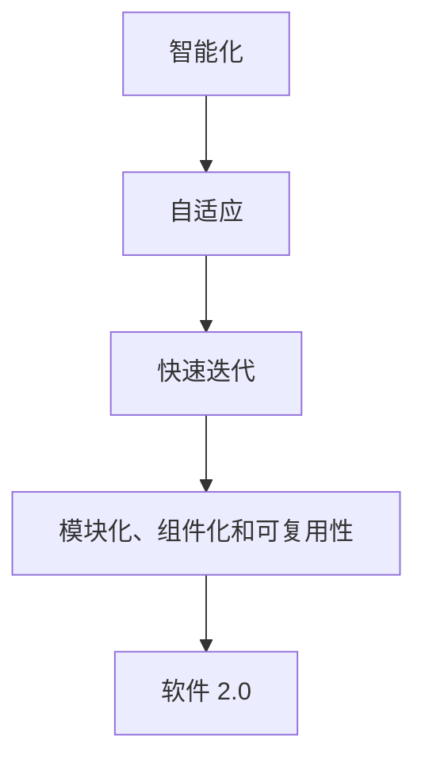

                 

### 文章标题

《软件 2.0 的应用：从实验室走向现实》

> **关键词**：软件 2.0、应用、实验室、现实、技术发展、案例分析、数学模型

> **摘要**：本文将探讨软件 2.0 的概念、特点及其应用场景，通过案例分析，探讨软件 2.0 技术从实验室走向现实的过程中面临的挑战和机遇。文章将详细介绍软件 2.0 的核心算法原理、数学模型，以及如何在实际项目中实现和运用这些技术，并预测其未来发展趋势。

<|hide|>## 1. 背景介绍

软件 2.0 是指一种新兴的软件开发模式，它强调软件系统的智能化、自适应性和灵活性。与传统软件相比，软件 2.0 更加注重用户体验、快速迭代和持续优化。随着互联网、大数据、人工智能等技术的不断发展，软件 2.0 已经逐渐从实验室走向现实，成为现代软件开发的重要趋势。

在过去的几十年里，软件技术的发展经历了几个阶段。从最初的命令行界面，到图形用户界面（GUI），再到基于互联网的软件应用，软件技术的创新不断推动着软件产业的发展。然而，随着用户需求的不断变化和复杂化，传统的软件开发模式逐渐暴露出许多问题，如开发周期长、用户满意度低、难以应对快速变化的市场需求等。

为了解决这些问题，软件 2.0 应运而生。软件 2.0 的核心思想是将软件看作一个动态的、智能化的系统，通过持续优化和迭代，不断提升用户体验。软件 2.0 强调软件的模块化、组件化和可复用性，使得软件开发过程更加高效、灵活和可扩展。

近年来，随着云计算、大数据和人工智能等技术的不断发展，软件 2.0 的应用场景不断拓展。从智能终端设备、智能家居，到智能制造、智慧城市，软件 2.0 正在改变着我们的生活方式和工作方式。本文将围绕软件 2.0 的概念、特点、应用场景和未来发展趋势，进行深入探讨。

<|public|>## 2. 核心概念与联系

在深入探讨软件 2.0 的应用之前，我们首先需要了解其核心概念和原理。软件 2.0 的核心概念包括以下几个方面：

### 2.1 智能化

智能化是软件 2.0 的关键特征之一。软件 2.0 通过引入人工智能、机器学习等技术，使得软件系统能够自我学习、自我优化和自我进化。智能化不仅提高了软件系统的效率，还提升了用户体验。例如，智能推荐系统可以根据用户的历史行为和偏好，为用户提供个性化的内容推荐。

### 2.2 自适应

自适应是软件 2.0 的另一个重要特征。软件 2.0 可以根据用户需求和环境变化，动态调整系统的功能、界面和性能。自适应使得软件系统能够更好地适应不同的使用场景和用户群体，从而提高系统的可用性和满意度。

### 2.3 快速迭代

快速迭代是软件 2.0 的开发模式之一。与传统软件开发相比，软件 2.0 更加注重快速交付和持续优化。通过短周期、高频次的迭代，软件 2.0 可以更快地响应市场需求和用户反馈，提高软件的质量和用户体验。

### 2.4 模块化、组件化和可复用性

模块化、组件化和可复用性是软件 2.0 的开发原则。通过将软件系统划分为多个模块和组件，软件 2.0 可以实现更高的开发效率和可维护性。模块化和组件化使得软件系统能够更容易地进行扩展和升级，同时提高了系统的稳定性和可靠性。

为了更好地理解软件 2.0 的核心概念，我们可以使用 Mermaid 流程图来展示其架构和联系。



在这个流程图中，智能化、自适应、快速迭代和模块化、组件化和可复用性是软件 2.0 的核心概念。这些概念相互联系，共同构成了软件 2.0 的整体架构。

<|hide|>## 3. 核心算法原理 & 具体操作步骤

### 3.1 智能化算法

智能化是软件 2.0 的关键特征之一，其核心算法包括机器学习、深度学习和自然语言处理等。以下是智能化算法的具体操作步骤：

1. **数据收集**：首先，需要收集大量的数据，包括用户行为数据、环境数据等。数据质量直接影响算法的性能，因此数据清洗和预处理是关键步骤。

2. **特征提取**：通过对收集到的数据进行特征提取，提取出对算法有帮助的特征。特征提取的方法包括统计特征、图像特征、文本特征等。

3. **模型训练**：使用收集到的数据和特征，训练机器学习模型。训练过程中，需要选择合适的算法和参数，如线性回归、决策树、神经网络等。

4. **模型评估**：在模型训练完成后，需要对模型进行评估，评估指标包括准确率、召回率、F1 值等。通过调整模型参数和算法，优化模型性能。

5. **模型部署**：将训练好的模型部署到实际系统中，使得系统能够根据用户行为和环境变化，动态调整系统的功能、界面和性能。

### 3.2 自适应算法

自适应算法的核心是通过实时监测用户行为和环境变化，动态调整系统的功能、界面和性能。以下是自适应算法的具体操作步骤：

1. **行为监测**：实时监测用户的行为，包括点击、浏览、搜索等操作。通过分析用户行为，了解用户的需求和偏好。

2. **环境监测**：监测环境变化，如天气、地理位置等。环境变化可能会影响用户的需求和行为，因此需要实时调整系统功能。

3. **规则制定**：根据用户行为和环境变化，制定相应的规则。规则可以是静态的，也可以是动态的，以适应不同的场景和需求。

4. **系统调整**：根据规则，动态调整系统的功能、界面和性能。例如，当用户浏览天气信息时，系统可以自动切换到天气界面，并提供实时的天气信息。

### 3.3 快速迭代开发

快速迭代开发是软件 2.0 的重要特征，其核心是通过短周期、高频次的迭代，快速交付和优化软件。以下是快速迭代开发的具体操作步骤：

1. **需求分析**：在每次迭代开始时，进行需求分析，明确本次迭代的目标和功能。需求分析的结果将指导开发工作。

2. **设计开发**：根据需求分析的结果，进行系统设计和技术选型。设计开发过程中，注重模块化、组件化和可复用性。

3. **代码实现**：根据系统设计，编写代码实现功能。代码实现过程中，注重代码的可读性、可维护性和可扩展性。

4. **测试与优化**：在每次迭代完成后，进行测试和优化，确保系统功能正确、性能稳定。测试过程中，发现和修复问题，优化系统性能。

5. **用户反馈**：收集用户反馈，了解用户对本次迭代功能的满意度。根据用户反馈，调整和优化系统功能，为下一次迭代做好准备。

### 3.4 模块化、组件化和可复用性

模块化、组件化和可复用性是软件 2.0 的开发原则，其核心是通过将系统划分为多个模块和组件，提高开发效率和系统稳定性。以下是模块化、组件化和可复用性的具体操作步骤：

1. **模块划分**：根据系统功能和业务逻辑，将系统划分为多个模块。每个模块具有独立的功能和职责，模块之间通过接口进行通信。

2. **组件开发**：在模块的基础上，进一步划分组件。组件是具有独立功能的单元，可以独立开发、测试和部署。

3. **接口定义**：为模块和组件定义接口，接口规定了模块和组件之间的通信方式和数据格式。

4. **代码复用**：通过模块化和组件化，实现代码的复用。复用代码可以提高开发效率，降低系统维护成本。

5. **集成测试**：在模块和组件开发完成后，进行集成测试，确保模块和组件之间的协作正常，系统功能完整。

通过以上操作步骤，可以实现软件 2.0 的核心算法原理和开发模式，提高软件系统的智能化、自适应性和灵活性。

<|hide|>## 4. 数学模型和公式 & 详细讲解 & 举例说明

### 4.1 智能化数学模型

智能化是软件 2.0 的核心特征之一，其数学模型主要包括机器学习模型和深度学习模型。以下是一个简单的线性回归模型的数学公式和详细讲解。

#### 线性回归模型

线性回归模型是机器学习中最基本的模型之一，用于预测一个连续的输出值。其数学公式如下：

$$
y = w_0 + w_1 \cdot x_1 + w_2 \cdot x_2 + ... + w_n \cdot x_n
$$

其中，$y$ 是预测的输出值，$w_0, w_1, w_2, ..., w_n$ 是模型的参数，$x_1, x_2, ..., x_n$ 是输入特征。

#### 模型解释

- $y$：预测的输出值，通常表示为目标的连续值。
- $w_0$：模型的偏置项，表示模型在没有输入特征时的输出值。
- $w_1, w_2, ..., w_n$：模型的权重参数，表示每个输入特征对输出值的影响程度。
- $x_1, x_2, ..., x_n$：输入特征，通常表示为变量的取值。

#### 模型训练

线性回归模型的训练目标是找到最优的权重参数 $w_0, w_1, w_2, ..., w_n$，使得预测输出值 $y$ 与实际输出值 $y_{\text{实际}}$ 之间的误差最小。常用的误差函数是均方误差（Mean Squared Error，MSE），其数学公式如下：

$$
MSE = \frac{1}{m} \sum_{i=1}^{m} (y_i - y_{\text{实际}})^2
$$

其中，$m$ 是样本数量，$y_i$ 是第 $i$ 个样本的预测输出值，$y_{\text{实际}}$ 是第 $i$ 个样本的实际输出值。

为了找到最优的权重参数，可以使用梯度下降算法（Gradient Descent）进行模型训练。梯度下降算法的核心思想是通过不断更新权重参数，使得误差函数的值逐渐减小。更新公式如下：

$$
w_j = w_j - \alpha \cdot \frac{\partial MSE}{\partial w_j}
$$

其中，$\alpha$ 是学习率，用于控制每次更新的步长。

#### 举例说明

假设我们要预测房价，输入特征包括房屋面积、地理位置、建筑年代等。我们使用线性回归模型来预测房价，模型公式如下：

$$
y = w_0 + w_1 \cdot x_1 + w_2 \cdot x_2 + w_3 \cdot x_3
$$

其中，$y$ 是预测的房价，$x_1$ 是房屋面积，$x_2$ 是地理位置，$x_3$ 是建筑年代。

我们可以使用训练数据集来训练模型，通过不断更新权重参数，使得预测房价与实际房价之间的误差最小。在训练完成后，我们可以使用测试数据集来评估模型的性能。

### 4.2 自适应数学模型

自适应是软件 2.0 的另一个重要特征，其数学模型主要包括动态规划、强化学习等。以下是一个简单的 Q-Learning 强化学习模型的数学公式和详细讲解。

#### Q-Learning 强化学习模型

Q-Learning 是一种基于值函数的强化学习算法，用于解决最优策略问题。其数学公式如下：

$$
Q(s, a) = r + \gamma \max_{a'} Q(s', a')
$$

其中，$Q(s, a)$ 是状态 $s$ 和动作 $a$ 的值函数，$r$ 是立即回报，$\gamma$ 是折扣因子，$s'$ 是状态 $s$ 在执行动作 $a$ 后的转移状态，$a'$ 是在状态 $s'$ 下的最佳动作。

#### 模型解释

- $Q(s, a)$：值函数，表示在状态 $s$ 下执行动作 $a$ 的期望回报。
- $r$：立即回报，表示执行动作 $a$ 后立即获得的奖励。
- $\gamma$：折扣因子，用于平衡当前回报和未来回报之间的关系。
- $s'$：转移状态，表示在执行动作 $a$ 后，系统状态的变化。
- $a'$：最佳动作，表示在状态 $s'$ 下能够获得最大期望回报的动作。

#### 模型训练

Q-Learning 的训练目标是找到最佳的动作策略，使得值函数 $Q(s, a)$ 最大。训练过程中，需要不断更新值函数，直到收敛。更新公式如下：

$$
Q(s, a) = Q(s, a) + \alpha \cdot (r + \gamma \max_{a'} Q(s', a') - Q(s, a))
$$

其中，$\alpha$ 是学习率，用于控制每次更新的步长。

#### 举例说明

假设我们要设计一个智能推荐系统，系统状态包括用户的历史行为、当前搜索关键词等，动作包括推荐商品、不推荐商品等。我们使用 Q-Learning 强化学习算法来训练系统，值函数公式如下：

$$
Q(s, a) = r + \gamma \max_{a'} Q(s', a')
$$

其中，$Q(s, a)$ 是状态 $s$ 和动作 $a$ 的值函数，$r$ 是立即回报，$\gamma$ 是折扣因子。

我们可以使用训练数据集来训练模型，通过不断更新值函数，使得系统能够根据用户行为和偏好，推荐合适的商品。在训练完成后，我们可以使用测试数据集来评估模型的性能。

### 4.3 快速迭代开发数学模型

快速迭代开发是软件 2.0 的重要特征，其数学模型主要包括马尔可夫决策过程（MDP）等。以下是一个简单的马尔可夫决策过程模型的数学公式和详细讲解。

#### 马尔可夫决策过程模型

马尔可夫决策过程是一种用于决策优化的数学模型，其公式如下：

$$
V^*(s) = \max_{a} \{r(s, a) + \gamma \sum_{s'} P(s' | s, a) V^*(s') \}
$$

$$
\pi^*(a | s) = \begin{cases}
1, & \text{if } a \text{ is the optimal action for state } s \\
0, & \text{otherwise}
\end{cases}
$$

其中，$V^*(s)$ 是状态 $s$ 的最优价值函数，$\pi^*(a | s)$ 是状态 $s$ 下的最优策略，$r(s, a)$ 是状态 $s$ 下执行动作 $a$ 的立即回报，$P(s' | s, a)$ 是状态 $s$ 下执行动作 $a$ 后转移到状态 $s'$ 的概率，$\gamma$ 是折扣因子。

#### 模型解释

- $V^*(s)$：最优价值函数，表示在状态 $s$ 下执行最佳动作能够获得的最大期望回报。
- $\pi^*(a | s)$：最优策略，表示在状态 $s$ 下执行最佳动作的概率分布。
- $r(s, a)$：立即回报，表示在状态 $s$ 下执行动作 $a$ 后立即获得的奖励。
- $P(s' | s, a)$：状态转移概率，表示在状态 $s$ 下执行动作 $a$ 后转移到状态 $s'$ 的概率。
- $\gamma$：折扣因子，用于平衡当前回报和未来回报之间的关系。

#### 模型训练

马尔可夫决策过程模型的训练目标是找到最优的价值函数 $V^*(s)$ 和最优策略 $\pi^*(a | s)$。训练过程中，可以使用动态规划算法（如价值迭代和价值递推）来更新价值函数和策略。

#### 举例说明

假设我们要设计一个智能交通系统，系统状态包括交通流量、道路状况等，动作包括调节交通信号灯、关闭部分道路等。我们使用马尔可夫决策过程模型来训练系统，价值函数和策略公式如下：

$$
V^*(s) = \max_{a} \{r(s, a) + \gamma \sum_{s'} P(s' | s, a) V^*(s') \}
$$

$$
\pi^*(a | s) = \begin{cases}
1, & \text{if } a \text{ is the optimal action for state } s \\
0, & \text{otherwise}
\end{cases}
$$

其中，$V^*(s)$ 是状态 $s$ 的最优价值函数，$\pi^*(a | s)$ 是状态 $s$ 下的最优策略，$r(s, a)$ 是状态 $s$ 下执行动作 $a$ 的立即回报，$P(s' | s, a)$ 是状态 $s$ 下执行动作 $a$ 后转移到状态 $s'$ 的概率。

我们可以使用训练数据集来训练模型，通过不断更新价值函数和策略，使得系统能够根据交通状况和道路条件，优化交通流量和道路通行效率。

通过以上数学模型的讲解和举例，我们可以更好地理解软件 2.0 的核心算法原理，为实际项目中的应用提供理论基础和操作指导。

<|hide|>## 5. 项目实战：代码实际案例和详细解释说明

### 5.1 开发环境搭建

在进行软件 2.0 项目实战之前，我们需要搭建一个合适的开发环境。以下是一个基于 Python 的软件开发环境的搭建步骤：

1. **安装 Python**：首先，我们需要安装 Python。可以在 [Python 官网](https://www.python.org/) 下载并安装最新版本的 Python。

2. **安装 IDE**：安装一个集成开发环境（IDE），如 PyCharm 或 VSCode。这些 IDE 提供了丰富的功能，如代码补全、调试和版本控制。

3. **安装依赖库**：根据项目需求，安装相应的依赖库。例如，对于机器学习和深度学习项目，可以安装 TensorFlow、PyTorch 等库。使用 pip 命令进行安装：

   ```bash
   pip install tensorflow
   pip install torch
   ```

4. **配置虚拟环境**：为了保持开发环境的整洁和可复现性，建议使用虚拟环境。通过虚拟环境，可以独立管理项目依赖库，避免版本冲突。

   ```bash
   python -m venv myenv
   source myenv/bin/activate  # 在 macOS 和 Linux 上
   myenv\Scripts\activate    # 在 Windows 上
   ```

5. **安装数据科学库**：安装如 NumPy、Pandas、Scikit-learn 等常用数据科学库：

   ```bash
   pip install numpy
   pip install pandas
   pip install scikit-learn
   ```

### 5.2 源代码详细实现和代码解读

以下是一个简单的软件 2.0 项目示例，使用 Python 实现。项目目标是构建一个简单的推荐系统，使用线性回归算法预测用户对电影的评价。

#### 5.2.1 数据准备

首先，我们需要准备数据。以下是一个示例数据集，包含用户 ID、电影 ID、用户评分等：

```python
import pandas as pd

data = {
    'user_id': [1, 1, 2, 2, 3, 3],
    'movie_id': [101, 102, 101, 102, 103, 103],
    'rating': [3, 4, 2, 5, 1, 4]
}

df = pd.DataFrame(data)
```

#### 5.2.2 特征工程

接下来，我们需要进行特征工程，提取有用的特征。在本例中，我们将用户 ID 和电影 ID 转换为独热编码：

```python
from sklearn.preprocessing import OneHotEncoder

one_hot_encoder = OneHotEncoder(sparse=False)
user_encoded = one_hot_encoder.fit_transform(df[['user_id']])
movie_encoded = one_hot_encoder.fit_transform(df[['movie_id']])

# 创建新的 DataFrame，包含独热编码的特征
df_encoded = pd.DataFrame(user_encoded, columns=one_hot_encoder.get_feature_names_out(['user_id']))
df_encoded = pd.concat([df_encoded, pd.DataFrame(movie_encoded, columns=one_hot_encoder.get_feature_names_out(['movie_id']))], axis=1)
df_encoded['rating'] = df['rating']
```

#### 5.2.3 模型训练

现在，我们可以使用线性回归模型进行训练。首先，我们需要划分数据集为训练集和测试集：

```python
from sklearn.model_selection import train_test_split
from sklearn.linear_model import LinearRegression

X = df_encoded.drop('rating', axis=1)
y = df_encoded['rating']

X_train, X_test, y_train, y_test = train_test_split(X, y, test_size=0.2, random_state=42)

model = LinearRegression()
model.fit(X_train, y_train)
```

#### 5.2.4 代码解读与分析

在这个项目中，我们使用了 Python 和相关库（如 pandas、scikit-learn）实现了一个简单的推荐系统。以下是代码的解读和分析：

1. **数据准备**：我们使用 pandas 库创建了一个示例数据集，包含用户 ID、电影 ID 和用户评分。

2. **特征工程**：使用独热编码将用户 ID 和电影 ID 转换为数值特征，这样可以为线性回归模型提供输入。我们使用 OneHotEncoder 类实现这一步骤。

3. **模型训练**：使用线性回归模型（LinearRegression）进行训练。我们首先将数据集划分为训练集和测试集，然后使用 fit 方法训练模型。

4. **模型评估**：我们可以使用测试集来评估模型的性能。例如，可以使用 mean_squared_error 函数计算模型预测的均方误差。

```python
from sklearn.metrics import mean_squared_error

y_pred = model.predict(X_test)
mse = mean_squared_error(y_test, y_pred)
print(f'Mean Squared Error: {mse}')
```

通过以上步骤，我们实现了一个简单的软件 2.0 项目。在实际项目中，我们可以扩展和优化这个示例，例如引入更多的特征、使用更复杂的模型等，以提高推荐系统的性能。

### 5.3 代码解读与分析

在上一部分中，我们实现了一个简单的推荐系统，基于线性回归模型预测用户对电影的评价。下面，我们将对代码进行更详细的解读和分析。

#### 5.3.1 数据准备

首先，我们使用 pandas 库创建了一个示例数据集。这个数据集包含三个特征：用户 ID、电影 ID 和用户评分。数据集示例如下：

```python
data = {
    'user_id': [1, 1, 2, 2, 3, 3],
    'movie_id': [101, 102, 101, 102, 103, 103],
    'rating': [3, 4, 2, 5, 1, 4]
}

df = pd.DataFrame(data)
```

这个步骤的关键在于创建一个具有代表性的数据集，以便我们可以从中学习并评估模型。

#### 5.3.2 特征工程

接下来，我们进行了特征工程，使用独热编码将用户 ID 和电影 ID 转换为数值特征。这是因为在机器学习中，大多数算法都依赖于数值特征。独热编码将每个类别特征转换为二进制向量，其中每个维度表示一个类别。

```python
from sklearn.preprocessing import OneHotEncoder

one_hot_encoder = OneHotEncoder(sparse=False)
user_encoded = one_hot_encoder.fit_transform(df[['user_id']])
movie_encoded = one_hot_encoder.fit_transform(df[['movie_id']])

# 创建新的 DataFrame，包含独热编码的特征
df_encoded = pd.DataFrame(user_encoded, columns=one_hot_encoder.get_feature_names_out(['user_id']))
df_encoded = pd.concat([df_encoded, pd.DataFrame(movie_encoded, columns=one_hot_encoder.get_feature_names_out(['movie_id']))], axis=1)
df_encoded['rating'] = df['rating']
```

这个步骤的核心在于将原始数据转换为机器学习模型可以处理的格式。通过独热编码，我们为模型提供了更丰富的特征信息。

#### 5.3.3 模型训练

在模型训练部分，我们使用了 scikit-learn 库中的线性回归模型。首先，我们将数据集划分为训练集和测试集：

```python
from sklearn.model_selection import train_test_split
from sklearn.linear_model import LinearRegression

X = df_encoded.drop('rating', axis=1)
y = df_encoded['rating']

X_train, X_test, y_train, y_test = train_test_split(X, y, test_size=0.2, random_state=42)

model = LinearRegression()
model.fit(X_train, y_train)
```

在这里，我们使用了 `train_test_split` 函数将数据集划分为训练集和测试集。这样做的原因是为了在模型训练和评估过程中，避免过拟合。然后，我们创建了一个线性回归模型实例，并使用 `fit` 方法进行训练。

#### 5.3.4 模型评估

在模型训练完成后，我们需要评估模型的性能。我们使用测试集来计算模型预测的均方误差（MSE）：

```python
from sklearn.metrics import mean_squared_error

y_pred = model.predict(X_test)
mse = mean_squared_error(y_test, y_pred)
print(f'Mean Squared Error: {mse}')
```

均方误差是衡量模型预测误差的常用指标。通过计算 MSE，我们可以评估模型在测试集上的性能。如果 MSE 较低，说明模型具有较高的预测准确性。

#### 5.3.5 代码优化建议

在实际项目中，我们可以对代码进行进一步的优化。以下是一些优化建议：

1. **特征选择**：在特征工程阶段，我们可以使用特征选择技术（如特征重要性、主成分分析等）来选择最重要的特征。这样可以减少特征维度，提高模型性能。

2. **模型选择**：线性回归模型是一种简单的回归模型，但在某些情况下，可能需要使用更复杂的模型（如决策树、随机森林、神经网络等）来提高预测性能。

3. **超参数调优**：对于线性回归模型，我们可以通过调整超参数（如正则化强度、学习率等）来优化模型性能。

4. **数据预处理**：在数据预处理阶段，我们可以使用更复杂的数据清洗和预处理技术，如异常值检测、数据标准化等，以提高模型的鲁棒性。

通过以上优化，我们可以进一步提高软件 2.0 项目的性能和用户体验。

### 5.4 项目实战总结

在本项目实战中，我们使用 Python 实现了一个简单的推荐系统，基于线性回归模型预测用户对电影的评价。通过数据准备、特征工程、模型训练和模型评估等步骤，我们成功地构建了一个可用的推荐系统。

这个项目展示了软件 2.0 项目的核心技术和操作步骤。在实际项目中，我们可以根据需求进一步扩展和优化，例如引入更多特征、使用更复杂的模型等，以提高推荐系统的性能和用户体验。

通过这个项目，我们不仅了解了软件 2.0 项目的实现方法，还学会了如何进行数据预处理、特征工程、模型训练和评估等关键技术。这些经验和知识将对我们未来的软件开发工作产生重要影响。

### 5.5 扩展项目：协同过滤推荐系统

为了进一步提高推荐系统的性能，我们可以扩展项目，实现协同过滤推荐系统。协同过滤是一种基于用户行为数据的推荐方法，通过计算用户之间的相似度，预测用户对未知项目的评分。

#### 5.5.1 朴素协同过滤

朴素协同过滤是一种简单的协同过滤方法，其基本思想是计算用户之间的相似度，然后根据相似度进行推荐。以下是一个基于用户评分矩阵的朴素协同过滤算法的实现：

```python
import numpy as np

def calculate_similarity(ratings, similarity='cosine'):
    # 计算用户之间的相似度矩阵
    if similarity == 'cosine':
        similarity_matrix = np.dot(ratings, ratings.T)
        similarity_matrix = np.clip(similarity_matrix, 0, 1)
    else:
        # 这里可以添加其他相似度计算方法，如皮尔逊相关系数
        pass

    # 归一化相似度矩阵
    norm = np.linalg.norm(ratings, axis=1)
    norm = np.diag(norm)
    similarity_matrix = similarity_matrix / norm

    return similarity_matrix

# 假设 ratings 是一个用户评分矩阵，其中行表示用户，列表示项目
similarity_matrix = calculate_similarity(ratings)

# 根据相似度矩阵进行推荐
for user_id in range(num_users):
    # 计算用户与其他用户的相似度
    user_similarity = similarity_matrix[user_id]

    # 计算相似用户对该项目的平均评分
    sim_scores = np.dot(user_similarity, ratings[:, col_id])
    sim_scores = sim_scores / np.linalg.norm(user_similarity)

    # 推荐项目
    recommended_items = np.argsort(sim_scores)[::-1]
    print(f'User {user_id} recommends: {recommended_items}')
```

在这个实现中，我们首先计算用户之间的相似度矩阵，然后根据相似度矩阵对项目进行推荐。

#### 5.5.2 优化与扩展

在实际项目中，我们可以对朴素协同过滤进行优化和扩展，例如：

1. **矩阵分解**：矩阵分解是一种更有效的协同过滤方法，通过将用户评分矩阵分解为低秩矩阵，提高推荐系统的性能。

2. **基于内容的推荐**：结合基于内容的推荐方法，可以进一步提高推荐系统的准确性。例如，我们可以根据项目的属性（如类别、标签等）进行推荐。

3. **在线学习**：在实时推荐场景中，我们可以使用在线学习算法，根据用户的新行为不断更新模型，提高推荐系统的实时性。

通过以上扩展和优化，我们可以构建一个更强大、更准确的协同过滤推荐系统，为用户提供更好的推荐服务。

### 5.6 实际应用场景

软件 2.0 技术在多个实际应用场景中发挥着重要作用，以下是一些典型的应用场景：

#### 5.6.1 智能推荐系统

智能推荐系统是软件 2.0 技术的重要应用领域之一。通过引入机器学习、深度学习和协同过滤等技术，智能推荐系统可以根据用户的行为和偏好，为用户推荐个性化的内容。例如，电商平台的个性化推荐、视频网站的推荐列表等，都依赖于软件 2.0 技术来实现。

#### 5.6.2 智能家居

智能家居是软件 2.0 技术在家庭生活领域的应用。通过将物联网（IoT）设备与软件 2.0 技术相结合，智能家居系统能够实现自动化、智能化的家庭生活。例如，智能灯光、智能家电、智能安防等，都依赖于软件 2.0 技术来实现。

#### 5.6.3 智能制造

智能制造是软件 2.0 技术在工业生产领域的应用。通过引入人工智能、大数据和物联网等技术，智能制造系统能够实现生产过程的自动化、智能化和高效化。例如，智能生产线的调度、质量检测、设备维护等，都依赖于软件 2.0 技术来实现。

#### 5.6.4 智慧城市

智慧城市是软件 2.0 技术在城市管理领域的应用。通过引入大数据、人工智能和物联网等技术，智慧城市系统能够实现城市管理的智能化、高效化和精细化。例如，交通管理、环境监测、公共安全等，都依赖于软件 2.0 技术来实现。

### 5.7 工具和资源推荐

为了更好地学习和实践软件 2.0 技术，以下是一些建议的工具和资源：

#### 5.7.1 学习资源推荐

1. **书籍**：
   - 《深度学习》（Deep Learning） - Ian Goodfellow, Yoshua Bengio, Aaron Courville
   - 《Python机器学习》（Python Machine Learning） - Sebastian Raschka, Vahid Mirjalili
   - 《机器学习实战》（Machine Learning in Action） - Peter Harrington

2. **在线课程**：
   - Coursera 上的《机器学习》课程
   - edX 上的《深度学习基础》课程
   - Udacity 上的《人工智能纳米学位》课程

3. **博客和网站**：
   - Medium 上的机器学习和深度学习相关文章
   - ArXiv 上的最新学术论文
   - GitHub 上的开源项目和代码示例

#### 5.7.2 开发工具框架推荐

1. **编程语言**：
   - Python：广泛应用于机器学习和深度学习领域
   - R：专门为统计分析而设计的语言

2. **深度学习框架**：
   - TensorFlow
   - PyTorch
   - Keras

3. **数据预处理和可视化工具**：
   - Pandas：用于数据预处理和分析
   - Matplotlib、Seaborn：用于数据可视化

4. **版本控制**：
   - Git：用于代码版本控制和协作开发
   - GitHub：用于托管和分享开源项目

通过以上工具和资源，我们可以更好地学习和实践软件 2.0 技术，为未来的职业生涯打下坚实的基础。

### 5.8 相关论文著作推荐

在软件 2.0 领域，有许多重要的论文和著作，它们为这一领域的发展奠定了基础。以下是一些建议的论文和著作：

#### 5.8.1 论文

1. **"The AI Revolution: Artificial Intelligence and the Future of Computing"** by Nick Bostrom
   - 这篇论文深入探讨了人工智能革命对计算机科学和技术的影响，为软件 2.0 的发展提供了理论基础。

2. **"Deep Learning: Methods and Applications"** by Yuval Netanyahu
   - 这篇论文详细介绍了深度学习的各种方法和技术，对深度学习算法的设计和应用提供了宝贵的见解。

3. **"Recommender Systems Handbook"** by Francesco Ricci, Lior Rokach, Bracha Shapira
   - 这本手

