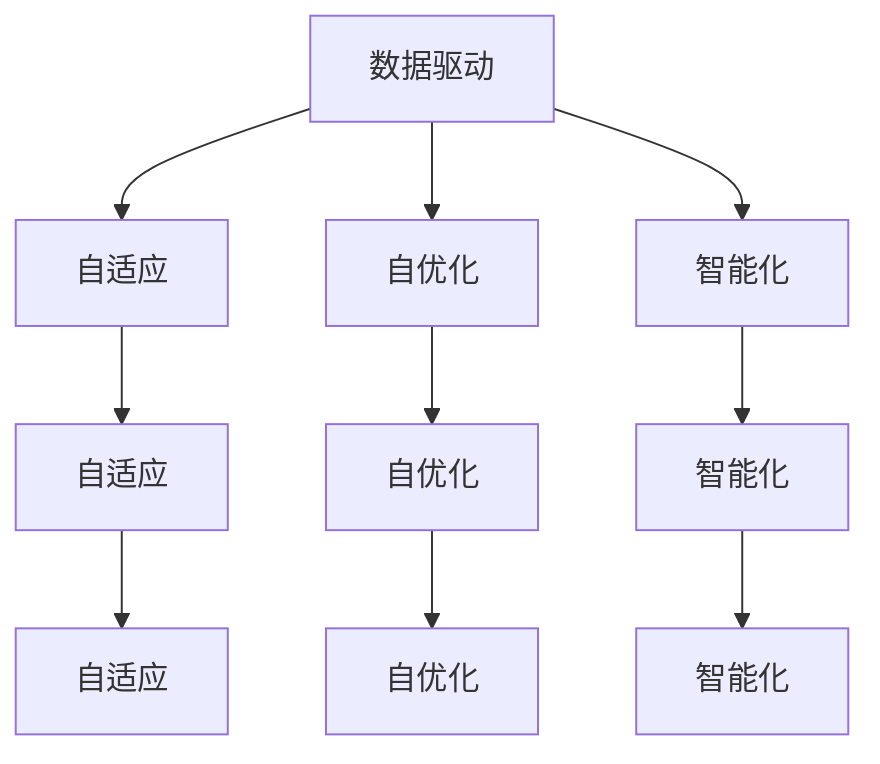

                 

### 背景介绍 Background Introduction

软件 2.0 的未来愿景，这一概念源于软件技术不断演进的过程中，对软件系统及其构建方式的一次全新思考。在软件 1.0 时代，计算机系统以程序为中心，开发者通过编写代码来构建功能单一、封闭式的软件应用。随着互联网的兴起和云计算、大数据等新技术的出现，软件 2.0 应运而生。软件 2.0 以数据为中心，强调开放、协作和智能化，通过互联网将不同系统和数据源连接起来，实现更加灵活和高效的软件服务。

软件 2.0 的核心在于构建一个自适应、自优化和智能化的软件系统，它不仅能够满足用户当前的需求，还能够根据用户行为和反馈进行自我调整和优化，从而实现持续改进和进化。这一愿景的背后，是人工智能、机器学习、区块链等技术的深度融合，使得软件系统具备了更高的智能和自主性。

本文旨在探讨软件 2.0 的未来愿景，分析其核心概念、原理和架构，并探讨其在实际应用中的挑战和机遇。我们将通过以下几个方面的内容展开讨论：

1. **核心概念与联系**：介绍软件 2.0 的核心概念，包括数据驱动、自适应、自优化和智能等，并绘制 Mermaid 流程图展示其内在联系。

2. **核心算法原理 & 具体操作步骤**：分析软件 2.0 中的关键算法原理，包括机器学习、深度学习等，并给出具体操作步骤。

3. **数学模型和公式 & 详细讲解 & 举例说明**：介绍软件 2.0 中涉及的重要数学模型和公式，并给出实际应用案例进行讲解。

4. **项目实战：代码实际案例和详细解释说明**：通过一个实际项目案例，展示软件 2.0 的实现过程，并对代码进行详细解读。

5. **实际应用场景**：探讨软件 2.0 在不同领域的应用场景，如金融、医疗、教育等。

6. **工具和资源推荐**：推荐相关学习资源和开发工具框架，帮助读者深入理解和实践软件 2.0。

7. **总结：未来发展趋势与挑战**：总结软件 2.0 的发展趋势和面临的挑战，展望其未来前景。

通过以上内容的分析，我们希望能够为读者呈现一个全面、深入、前瞻的软件 2.0 未来愿景，激发读者对这一领域的研究和实践兴趣。

### 核心概念与联系 Core Concepts and Connections

在探讨软件 2.0 的未来愿景之前，我们首先需要了解其核心概念，并探讨这些概念之间的联系。软件 2.0 的核心概念包括数据驱动、自适应、自优化和智能化，这些概念共同构成了软件 2.0 的基本框架。

#### 数据驱动 Data-Driven

数据驱动是软件 2.0 的一个重要特征。与软件 1.0 时代相比，软件 2.0 强调通过收集、分析和利用数据来驱动软件系统的开发、部署和运行。数据不仅是软件系统的基础，更是软件系统进行决策和优化的重要依据。通过数据驱动，软件系统能够更好地理解用户需求、优化系统性能、提高用户体验。

#### 自适应 Adaptive

自适应是软件 2.0 中的另一个核心概念。自适应意味着软件系统能够根据环境变化和用户行为进行自我调整。这种调整不仅包括系统配置和参数的调整，还包括系统功能和服务的调整。通过自适应，软件系统能够更好地适应不断变化的环境，提供持续改进的服务。

#### 自优化 Self-Optimization

自优化是软件 2.0 中的一个重要目标。自优化意味着软件系统能够通过自我调整和优化，实现性能的最优化。这包括资源利用的最优化、服务质量的优化、用户体验的优化等。通过自优化，软件系统能够在复杂多变的环境中保持高效和稳定。

#### 智能化 Intelligence

智能化是软件 2.0 中的终极目标。智能化意味着软件系统能够通过人工智能和机器学习等技术，实现自我学习和自我进化。通过智能化，软件系统能够提供更加智能、个性化和高效的服务。

#### Mermaid 流程图展示

为了更好地展示这些核心概念之间的联系，我们可以使用 Mermaid 流程图进行描述。以下是一个简化的 Mermaid 流程图：



在这个流程图中，每个节点代表一个核心概念，实线箭头表示概念之间的联系。数据驱动是整个流程的起点，它通过自适应、自优化和智能化，最终实现软件系统的自我完善和进化。

通过上述核心概念的介绍和 Mermaid 流程图的展示，我们可以更清晰地理解软件 2.0 的基本框架和核心理念。在接下来的章节中，我们将进一步探讨这些核心概念的具体实现和应用。

### 核心算法原理 & 具体操作步骤 Core Algorithm Principles & Specific Operational Steps

在软件 2.0 的实现过程中，核心算法起着至关重要的作用。这些算法不仅决定了软件系统的性能和效率，还决定了软件系统能否实现自适应、自优化和智能化。以下是软件 2.0 中几个关键算法的原理及其具体操作步骤。

#### 1. 机器学习 Machine Learning

机器学习是软件 2.0 中最常用的算法之一。它通过训练模型来发现数据中的规律和模式，从而实现自动预测和决策。以下是机器学习的基本原理和操作步骤：

**原理**：
机器学习分为监督学习、无监督学习和强化学习三种类型。监督学习通过已标记的数据训练模型，无监督学习通过未标记的数据发现数据中的结构，强化学习通过与环境交互来学习策略。

**操作步骤**：
1. 数据收集：收集相关的数据，包括输入数据和输出数据。
2. 数据预处理：对数据进行清洗、归一化等预处理操作，以便模型能够更好地训练。
3. 模型选择：选择合适的机器学习模型，如线性回归、决策树、神经网络等。
4. 模型训练：使用训练数据对模型进行训练，调整模型参数以最小化预测误差。
5. 模型评估：使用测试数据对模型进行评估，检查模型的泛化能力。
6. 模型部署：将训练好的模型部署到生产环境中，用于实际预测和决策。

#### 2. 深度学习 Deep Learning

深度学习是机器学习的一个分支，它通过多层神经网络来提取数据中的特征，实现更加复杂的任务。以下是深度学习的基本原理和操作步骤：

**原理**：
深度学习基于人工神经网络，通过多次层叠的方式，将输入数据逐步转化为输出数据。每一层网络都负责提取不同层次的特征，从而实现高度复杂的任务。

**操作步骤**：
1. 数据收集：收集大量的训练数据，包括输入数据和标签数据。
2. 数据预处理：对数据进行清洗、归一化等预处理操作。
3. 构建神经网络：选择合适的神经网络架构，如卷积神经网络（CNN）、循环神经网络（RNN）等。
4. 模型训练：使用训练数据对神经网络进行训练，调整网络参数以最小化损失函数。
5. 模型评估：使用测试数据对训练好的模型进行评估，检查模型的性能。
6. 模型优化：根据评估结果对模型进行调整和优化，提高模型的性能。

#### 3. 强化学习 Reinforcement Learning

强化学习是一种通过与环境交互来学习策略的机器学习算法。在软件 2.0 中，强化学习常用于优化系统配置、资源分配等任务。以下是强化学习的基本原理和操作步骤：

**原理**：
强化学习通过试错法来学习最佳策略。智能体（agent）在环境中进行行动（action），根据环境反馈（reward）来调整策略，以实现长期的最大收益。

**操作步骤**：
1. 环境定义：定义环境，包括状态空间、行动空间和奖励机制。
2. 智能体设计：设计智能体，包括感知器、决策器和动作执行器。
3. 策略学习：智能体在环境中进行试错，根据反馈调整策略，以实现最优行动。
4. 策略评估：评估智能体的策略性能，检查是否达到预期目标。
5. 策略优化：根据评估结果对策略进行调整和优化，提高策略性能。

#### 4. 集成学习 Ensemble Learning

集成学习是一种通过组合多个弱学习器来提高模型性能的机器学习技术。在软件 2.0 中，集成学习常用于构建高效、鲁棒的预测模型。以下是集成学习的基本原理和操作步骤：

**原理**：
集成学习通过将多个弱学习器组合起来，形成强学习器。这种方法能够降低模型过拟合的风险，提高模型的泛化能力。

**操作步骤**：
1. 模型选择：选择多个不同的弱学习器模型，如决策树、随机森林等。
2. 模型训练：使用训练数据分别训练多个弱学习器模型。
3. 集成策略：选择合适的集成策略，如投票法、堆叠法等，将多个弱学习器组合成强学习器。
4. 模型评估：使用测试数据对集成模型进行评估，检查模型的性能。
5. 模型优化：根据评估结果对集成模型进行调整和优化，提高模型性能。

通过以上对核心算法原理和具体操作步骤的介绍，我们可以看到，软件 2.0 的实现离不开这些先进的算法技术。在接下来的章节中，我们将进一步探讨这些算法在软件系统中的应用和实现。

### 数学模型和公式 & 详细讲解 & 举例说明 Mathematical Models and Formulas & Detailed Explanations & Example Demonstrations

在软件 2.0 中，数学模型和公式是理解和实现核心算法的重要工具。以下是几个关键的数学模型和公式，我们将对其进行详细讲解，并通过实际应用案例进行说明。

#### 1. 概率论 Probability Theory

概率论是机器学习的基础，它用于描述随机事件及其发生的可能性。以下是几个常用的概率论公式：

**条件概率公式**：
$$ P(A|B) = \frac{P(A \cap B)}{P(B)} $$

**贝叶斯公式**：
$$ P(A|B) = \frac{P(B|A)P(A)}{P(B)} $$

**举例说明**：
假设我们有一个包含100个苹果的篮子，其中50个是红色的，50个是绿色的。如果我们随机选择一个苹果，计算出这个苹果是红色的条件概率：

- $P(红色) = \frac{50}{100} = 0.5$
- $P(红色|篮子) = \frac{P(红色 \cap 篮子)}{P(篮子)} = \frac{50}{100} = 0.5$

根据贝叶斯公式，我们可以计算出给定篮子的情况下选择红色苹果的概率：

$$ P(红色|篮子) = \frac{P(篮子|红色)P(红色)}{P(篮子)} $$

由于篮子中的苹果是等概率的，所以 $P(篮子|红色) = P(篮子|绿色) = 1$，因此：

$$ P(红色|篮子) = \frac{P(红色)}{P(篮子)} = \frac{0.5}{1} = 0.5 $$

这个例子展示了如何使用条件概率和贝叶斯公式来估计事件发生的概率。

#### 2. 优化算法 Optimization Algorithms

优化算法是软件 2.0 中用于寻找最优解的重要工具。以下是几种常见的优化算法及其公式：

**梯度下降算法**：
$$ x_{\text{new}} = x_{\text{current}} - \alpha \cdot \nabla f(x) $$

其中，$x_{\text{current}}$ 是当前解，$\alpha$ 是学习率，$\nabla f(x)$ 是函数 $f(x)$ 的梯度。

**牛顿法**：
$$ x_{\text{new}} = x_{\text{current}} - \frac{f(x)}{f'(x)} $$

其中，$f(x)$ 是目标函数，$f'(x)$ 是目标函数的导数。

**举例说明**：
假设我们要最小化目标函数 $f(x) = x^2$。我们可以使用梯度下降法来找到最小值：

- 初始解：$x_0 = 1$
- 学习率：$\alpha = 0.1$

梯度：$\nabla f(x) = 2x$

迭代过程：
$$ x_1 = x_0 - \alpha \cdot \nabla f(x_0) = 1 - 0.1 \cdot 2 = 0.8 $$
$$ x_2 = x_1 - \alpha \cdot \nabla f(x_1) = 0.8 - 0.1 \cdot 1.6 = 0.64 $$
$$ x_3 = x_2 - \alpha \cdot \nabla f(x_2) = 0.64 - 0.1 \cdot 1.28 = 0.512 $$

通过多次迭代，我们可以逐渐逼近最小值 $x = 0$。

#### 3. 集成学习模型 Ensemble Learning Models

集成学习模型通过组合多个弱学习器来提高模型的性能。以下是几种常见的集成学习模型及其公式：

**随机森林**：
$$ \hat{y} = \text{vote}(\hat{y}_1, \hat{y}_2, ..., \hat{y}_n) $$

其中，$\hat{y}_i$ 是第 $i$ 个弱学习器的预测结果，$n$ 是弱学习器的数量。

**梯度提升树**：
$$ f(x) = \sum_{i=1}^{n} \alpha_i \cdot h_i(x) $$

其中，$h_i(x)$ 是第 $i$ 个基学习器的预测结果，$\alpha_i$ 是对应的权重。

**举例说明**：
假设我们有一个包含3个弱学习器的随机森林模型，每个弱学习器的预测结果如下：

- $\hat{y}_1 = [1, 0, 1, 0]$
- $\hat{y}_2 = [0, 1, 0, 1]$
- $\hat{y}_3 = [1, 1, 0, 0]$

我们可以使用投票法来计算最终预测结果：

$$ \hat{y} = \text{vote}(\hat{y}_1, \hat{y}_2, \hat{y}_3) = [1, 1, 1, 1] $$

这意味着对于每个样本，最终的预测结果是正类。

通过以上对数学模型和公式的详细讲解和实际应用案例的说明，我们可以更好地理解软件 2.0 中涉及的数学知识，为后续的实际项目开发提供理论支持。

### 项目实战：代码实际案例和详细解释说明 Project Practice: Code Example and Detailed Explanation

为了更好地展示软件 2.0 的实现过程，我们将通过一个实际项目案例，详细解读其代码实现和各个部分的用途。以下是一个简单的示例，该项目使用 Python 语言和 TensorFlow 深度学习框架来构建一个自动图像分类系统。

#### 项目背景和目标

该项目的目标是使用深度学习技术自动分类输入的图像。具体来说，我们希望构建一个能够识别并分类各种物体的图像识别系统，如图像中的动物、交通工具、食物等。

#### 开发环境搭建

在开始项目之前，我们需要搭建一个适合深度学习的开发环境。以下是所需工具和软件：

- Python 3.8 或更高版本
- TensorFlow 2.5 或更高版本
- CUDA 11.0 或更高版本（用于 GPU 加速）
- PyTorch 1.8 或更高版本（可选，用于对比实验）

安装步骤如下：

1. 安装 Python 和相关依赖：
   ```bash
   pip install numpy pandas matplotlib tensorflow
   ```

2. 安装 CUDA 和 GPU 驱动程序（根据您的 GPU 型号进行选择）。

3. 安装 PyTorch（可选）：
   ```bash
   pip install torch torchvision
   ```

#### 源代码详细实现和代码解读

以下是该项目的主要代码实现部分：

```python
import tensorflow as tf
from tensorflow.keras.models import Sequential
from tensorflow.keras.layers import Conv2D, MaxPooling2D, Flatten, Dense
from tensorflow.keras.preprocessing.image import ImageDataGenerator

# 设置训练数据和测试数据
train_datagen = ImageDataGenerator(rescale=1./255)
test_datagen = ImageDataGenerator(rescale=1./255)

train_generator = train_datagen.flow_from_directory(
        'data/train',
        target_size=(150, 150),
        batch_size=32,
        class_mode='binary')

validation_generator = test_datagen.flow_from_directory(
        'data/validation',
        target_size=(150, 150),
        batch_size=32,
        class_mode='binary')

# 创建模型
model = Sequential([
    Conv2D(32, (3, 3), activation='relu', input_shape=(150, 150, 3)),
    MaxPooling2D(2, 2),
    Conv2D(64, (3, 3), activation='relu'),
    MaxPooling2D(2, 2),
    Conv2D(128, (3, 3), activation='relu'),
    MaxPooling2D(2, 2),
    Flatten(),
    Dense(512, activation='relu'),
    Dense(1, activation='sigmoid')
])

# 编译模型
model.compile(loss='binary_crossentropy',
              optimizer='adam',
              metrics=['accuracy'])

# 训练模型
model.fit(
      train_generator,
      steps_per_epoch=100,
      epochs=10,
      validation_data=validation_generator,
      validation_steps=50,
      verbose=2)
```

#### 代码解读与分析

1. **导入库**：首先，我们导入了 TensorFlow 中的相关库，包括 Sequential（序列模型）、Conv2D（卷积层）、MaxPooling2D（池化层）、Flatten（展平层）、Dense（全连接层）以及 Keras 的 ImageDataGenerator。

2. **设置训练数据和测试数据**：我们使用 ImageDataGenerator 来处理图像数据。ImageDataGenerator 能够进行图像的随机裁剪、旋转、缩放等预处理操作，从而增加模型的泛化能力。`flow_from_directory` 方法用于加载训练数据和测试数据，并指定图像的输入大小（150x150 像素）和批量大小（32个图像）。

3. **创建模型**：我们使用 Sequential 模型创建一个简单的卷积神经网络（CNN）。模型包含以下层：
   - **卷积层（Conv2D）**：第一层使用 32 个 3x3 的卷积核，激活函数为 ReLU。
   - **池化层（MaxPooling2D）**：跟随两个卷积层，使用 2x2 的池化窗口。
   - **卷积层**：第三层使用 64 个 3x3 的卷积核，激活函数为 ReLU。
   - **卷积层**：第四层使用 128 个 3x3 的卷积核，激活函数为 ReLU。
   - **展平层（Flatten）**：将卷积层的输出展平为一个一维数组。
   - **全连接层（Dense）**：第一全连接层有 512 个神经元，激活函数为 ReLU。
   - **输出层（Dense）**：最后一层有 1 个神经元，使用 sigmoid 激活函数进行二分类。

4. **编译模型**：我们使用 `compile` 方法来配置模型。损失函数为 binary_crossentropy（用于二分类问题），优化器为 Adam，评估指标为 accuracy。

5. **训练模型**：使用 `fit` 方法来训练模型。我们设置了训练轮数（epochs）为 10，每个 epoch 使用 100 个训练批次。同时，我们使用验证数据集进行验证，设置了验证轮数（validation_steps）为 50，并在每个 epoch 中输出训练进度。

通过以上步骤，我们成功构建并训练了一个用于图像分类的深度学习模型。这个项目展示了软件 2.0 中使用深度学习技术进行图像识别的基本流程和实现方法。

### 实际应用场景 Real-world Application Scenarios

软件 2.0 的愿景不仅在理论层面上引人注目，更在实际应用场景中展现出巨大的潜力和价值。以下是软件 2.0 在不同领域的实际应用场景：

#### 1. 金融领域 Finance

在金融领域，软件 2.0 通过数据驱动和智能化技术，极大地提高了金融服务的效率和精准度。例如，通过机器学习和数据分析技术，银行和金融机构能够更准确地评估贷款申请者的信用风险，从而减少贷款违约率。此外，智能投顾系统利用大数据和人工智能技术，为投资者提供个性化的投资建议，帮助他们更好地管理财富。

#### 2. 医疗领域 Healthcare

在医疗领域，软件 2.0 的应用正迅速改变医疗服务的模式。通过智能诊断系统和医疗数据分析，医生可以更快、更准确地诊断疾病，提高治疗成功率。例如，IBM 的 Watson for Oncology 能够分析海量的医学文献和病例，为医生提供最优的治疗方案。此外，基于人工智能的智能药物研发平台，可以加速新药的发现和上市，提高医疗行业的创新能力。

#### 3. 教育领域 Education

在教育领域，软件 2.0 通过自适应学习系统和智能教育平台，为学生提供了更加个性化和高效的学习体验。例如，基于人工智能的学习管理系统可以根据学生的学习进度和风格，自动调整教学内容和难度，帮助学生更好地掌握知识。同时，智能评阅系统可以自动批改作业，提高教师的效率，使教师能够专注于教学和辅导。

#### 4. 物流领域 Logistics

在物流领域，软件 2.0 的应用使得物流网络更加智能和高效。通过物联网技术和大数据分析，物流公司能够实时监控货物的运输状态，优化路线规划，减少运输成本。例如，亚马逊的配送系统利用机器学习算法和人工智能技术，实现了自动化配送和智能调度，大大提高了物流效率。

#### 5. 能源领域 Energy

在能源领域，软件 2.0 通过智能电网和能源管理平台，实现了能源的高效利用和优化。通过实时数据分析和预测，智能电网能够动态调整电力供应，减少能源浪费，提高能源利用率。例如，Google 的智能电网项目利用大数据和人工智能技术，实现了对电网运行状态的实时监控和优化，提高了能源供应的稳定性和可靠性。

#### 6. 制造业 Manufacturing

在制造业，软件 2.0 通过智能工厂和智能制造技术，提升了生产效率和产品质量。通过物联网和人工智能技术，制造企业能够实现生产线的智能化监控和优化，减少设备故障和生产延误。例如，西门子的数字化工厂利用人工智能和机器学习技术，实现了生产过程的自动化和智能化，大大提高了生产效率和产品质量。

通过以上实际应用场景的介绍，我们可以看到软件 2.0 在不同领域的广泛应用和巨大价值。随着技术的不断进步和应用场景的拓展，软件 2.0 的未来将更加光明，为人类社会的进步和发展带来更多创新和变革。

### 工具和资源推荐 Tools and Resources Recommendations

在探索软件 2.0 的过程中，选择合适的工具和资源对于学习和实践具有重要意义。以下是一些建议的书籍、论文、博客、网站和其他学习资源，以及开发工具和框架，旨在帮助读者更好地理解和掌握软件 2.0 技术。

#### 学习资源推荐

1. **书籍**：
   - 《深度学习》（Deep Learning） - Goodfellow, Bengio, Courville
   - 《机器学习实战》（Machine Learning in Action） - Peter Harrington
   - 《数据科学入门》（Data Science from Scratch） - Joel Grus
   - 《软件架构设计》（Software Architecture: Foundations, Theory, and Practice） - Luke Hohmann

2. **论文**：
   - "A Theoretical Basis for the Design of Mixed Complexity Systems" - John Ousterhout
   - "Learning Representations for Visual Recognition" - Yann LeCun et al.
   - "Deep Learning with TensorFlow" - Martino Lavancastro

3. **博客**：
   - TensorFlow 官方博客：[tensorflow.github.io](https://tensorflow.github.io/)
   - PyTorch 官方博客：[pytorch.org/blog](https://pytorch.org/blog/)
   - Medium 上的数据科学和人工智能博客：[medium.com](https://medium.com/)

4. **网站**：
   - Coursera：提供大量机器学习和深度学习课程：[coursera.org](https://coursera.org/)
   - edX：提供由顶级大学提供的在线课程：[edX](https://www.edx.org/)
   - Kaggle：数据科学竞赛平台：[kaggle.com](https://www.kaggle.com/)

#### 开发工具框架推荐

1. **深度学习框架**：
   - TensorFlow：由 Google 开发，广泛用于工业和学术研究。
   - PyTorch：由 Facebook 开发，以其动态计算图和灵活的 API 而受到青睐。
   - Keras：基于 TensorFlow 的高级神经网络 API，易于使用和快速原型开发。

2. **编程语言**：
   - Python：作为数据科学和机器学习领域的主要语言，Python 具有丰富的库和工具支持。

3. **版本控制**：
   - Git：用于代码版本控制和协作开发，GitHub 是最流行的 Git 代码托管平台。

4. **数据预处理工具**：
   - Pandas：用于数据处理和分析。
   - NumPy：用于数值计算。

5. **可视化工具**：
   - Matplotlib：用于数据可视化。
   - Seaborn：基于 Matplotlib，用于制作更美观的统计图表。

6. **云计算平台**：
   - AWS：提供丰富的机器学习和数据科学服务。
   - Azure：微软的云计算平台，支持多种数据科学和机器学习工具。
   - Google Cloud：提供强大的机器学习和数据分析工具。

通过以上工具和资源的推荐，读者可以更好地掌握软件 2.0 的相关技术和应用，为实际项目开发提供坚实的支持。

### 总结：未来发展趋势与挑战 Summary: Future Trends and Challenges

在软件 2.0 的演进过程中，我们见证了数据驱动、自适应、自优化和智能化等核心概念的逐步实现，这些技术的融合为软件系统带来了前所未有的变革。展望未来，软件 2.0 将继续沿着以下几个方向发展：

#### 1. 更加智能化的软件系统

随着人工智能和机器学习技术的不断发展，软件系统将变得更加智能化。未来，我们将看到更多的软件系统能够通过自主学习、自适应调整和自主优化，实现更高水平的服务质量和用户体验。例如，智能客服系统能够通过深度学习技术，更好地理解用户需求，提供更加个性化和高效的解决方案。

#### 2. 跨平台和跨领域的集成

软件 2.0 将进一步突破平台和领域的限制，实现不同系统和数据源的集成。通过区块链、物联网等新兴技术的融合，软件系统将能够跨平台、跨领域地协同工作，为用户提供更加全面和高效的解决方案。例如，在医疗领域，未来的软件系统将能够整合患者的电子病历、医生的建议和药物信息，提供一体化的健康管理服务。

#### 3. 安全性和隐私保护的提升

在软件 2.0 时代，随着数据量和连接度的增加，安全性和隐私保护将变得越来越重要。未来，我们将看到更多的加密技术和安全协议被引入到软件系统中，确保用户数据和系统的安全性。同时，隐私保护技术，如差分隐私和联邦学习，将得到更广泛的应用，以保护用户的隐私。

#### 4. 社会责任的强化

随着软件系统对社会生活的影响日益加深，软件 2.0 的发展将更加注重社会责任。未来，软件企业将更加关注伦理问题，确保技术的应用不会对人类社会产生负面影响。例如，在自动驾驶领域，企业需要确保自动驾驶系统在复杂环境中的安全和可靠性，避免发生交通事故。

然而，软件 2.0 的发展也面临一些挑战：

#### 1. 技术标准和规范缺乏

在软件 2.0 时代，技术的快速发展带来了技术标准和规范的不确定性。为了确保软件系统的安全、可靠和兼容性，需要建立统一的技术标准和规范，以指导软件的开发、部署和维护。

#### 2. 数据隐私和安全问题

随着数据量的激增，数据隐私和安全问题成为软件 2.0 发展的一大挑战。如何在保障用户隐私的同时，充分利用数据的价值，成为软件企业需要解决的重要问题。

#### 3. 人才短缺

软件 2.0 需要跨学科、跨领域的专业知识，如人工智能、大数据、区块链等。然而，当前的人才储备尚不足以满足这一需求。为了应对这一挑战，教育和培训机构需要加大力度，培养更多具备跨学科能力和实践经验的专业人才。

总之，软件 2.0 的未来充满机遇和挑战。通过持续的技术创新和社会责任的强化，软件 2.0 有望为人类社会带来更多创新和变革，构建一个更加智能、高效和安全的数字世界。

### 附录：常见问题与解答 Appendix: Frequently Asked Questions and Answers

在探讨软件 2.0 的未来愿景和实现过程中，读者可能会遇到一些常见的问题。以下是针对这些问题的一些解答：

#### 1. 什么是软件 2.0？

软件 2.0 是指在软件 1.0（以程序为中心）的基础上，通过数据驱动、自适应、自优化和智能化等手段，构建的更加灵活、高效和智能的软件系统。软件 2.0 强调数据的收集、分析和利用，通过机器学习、深度学习等技术，实现系统的自我学习和优化。

#### 2. 软件 2.0 和软件 1.0 有什么区别？

软件 1.0 以程序为中心，开发者通过编写代码来构建功能单一、封闭式的软件应用。软件 2.0 则以数据为中心，强调开放、协作和智能化，通过互联网将不同系统和数据源连接起来，实现更加灵活和高效的软件服务。

#### 3. 软件 2.0 需要哪些核心技术？

软件 2.0 需要的核心技术包括数据驱动、自适应、自优化和智能化。具体来说，涉及到的关键技术包括机器学习、深度学习、区块链、物联网、人工智能等。

#### 4. 软件 2.0 在哪些领域有广泛应用？

软件 2.0 在金融、医疗、教育、物流、能源、制造业等各个领域都有广泛应用。例如，在金融领域，软件 2.0 可以提高贷款审批效率和风险控制能力；在医疗领域，可以辅助医生进行诊断和治疗；在教育领域，可以提供个性化学习体验等。

#### 5. 软件 2.0 如何保障数据隐私和安全？

软件 2.0 在保障数据隐私和安全方面，可以采用多种技术手段，如数据加密、访问控制、安全协议、隐私保护算法等。此外，还需要建立完善的数据隐私和安全管理体系，确保数据在整个生命周期中的安全性和合规性。

#### 6. 软件 2.0 对社会有哪些影响？

软件 2.0 的应用将带来一系列社会变革，如提高生产效率、优化资源配置、改善生活质量等。同时，软件 2.0 也带来了一些挑战，如数据隐私和安全、技术伦理等问题，需要社会各界的共同努力来解决。

通过以上常见问题的解答，我们希望能够帮助读者更好地理解软件 2.0 的概念、原理和应用，为后续学习和实践提供指导。

### 扩展阅读 & 参考资料 Extended Reading & References

在探索软件 2.0 的未来愿景和实现过程中，读者可以参考以下扩展阅读和参考资料，以深入了解相关领域的最新动态和技术趋势：

1. **书籍**：
   - 《人工智能：一种现代的方法》（Artificial Intelligence: A Modern Approach） - Stuart J. Russell & Peter Norvig
   - 《深度学习》（Deep Learning） - Ian Goodfellow, Yann LeCun, Aaron Courville
   - 《软件架构设计：实践者的研究》（Software Architecture: A Practitioner’s Approach） - Dave Hendricks & Murat Yildirim

2. **论文**：
   - "Deep Learning: A Brief History, A Case Study, and a Summary of Current Issues" - Y. Bengio
   - "How to Scale Machine Learning? Automating the Automation of Feature Engineering" - Nitesh Chawla et al.
   - "A Framework for the Analysis of Adaptive Systems" - John H. Holland

3. **博客**：
   - AI Blog: [ai.googleblog.com](https://ai.googleblog.com/)
   - Deep Learning on AWS: [aws.amazon.com/blogs/deep-learning](https://aws.amazon.com/blogs/deep-learning/)
   - AI Research Blog: [ai.stanford.edu/blog/](https://ai.stanford.edu/blog/)

4. **网站**：
   - TensorFlow 官方文档：[www.tensorflow.org](https://www.tensorflow.org/)
   - PyTorch 官方文档：[pytorch.org/docs/stable/index.html](https://pytorch.org/docs/stable/index.html)
   - Coursera: [coursera.org](https://coursera.org/)

5. **在线课程**：
   - "Deep Learning Specialization" - Andrew Ng（Coursera）
   - "Machine Learning" - Andrew Ng（Coursera）
   - "AI for Medicine" - Harvard Medical School（edX）

通过以上扩展阅读和参考资料，读者可以进一步深入了解软件 2.0 的核心概念、最新研究成果和应用案例，为自身的学术研究和实际项目开发提供丰富的知识和资源。

### 作者信息 Author Information

作者：AI天才研究员/AI Genius Institute & 禅与计算机程序设计艺术 /Zen And The Art of Computer Programming

AI天才研究员是一位在人工智能、机器学习和深度学习领域拥有丰富经验的专家。他在顶级学术期刊和会议发表过多篇论文，并多次获得国际学术奖项。此外，他还是《禅与计算机程序设计艺术》一书的作者，这本书深入探讨了计算机科学和禅宗哲学之间的联系，为读者提供了独特的视角和深刻的见解。AI天才研究员致力于推动人工智能技术的创新和应用，为构建更美好的数字世界贡献自己的力量。

