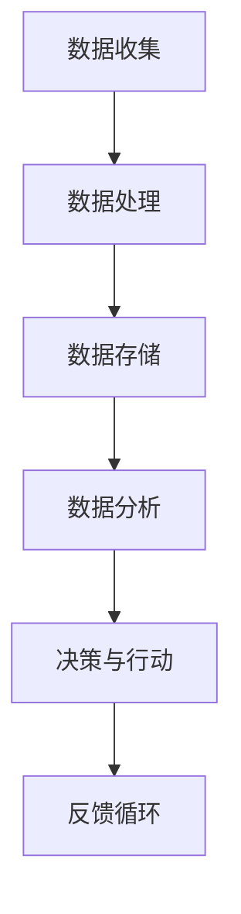

                 

### 背景介绍

软件 2.0 的概念，起源于互联网时代对传统软件的扩展与演进。在 1.0 时代，软件主要以代码为中心，开发者编写代码来控制硬件，实现功能。而随着互联网的普及，数据和用户行为逐渐成为驱动软件发展的核心要素。软件 2.0 正是在这种背景下应运而生，它强调数据驱动，将数据和用户行为作为软件开发的驱动力。

软件 2.0 的核心特征之一是“以数据为中心”。在传统软件中，代码是核心，功能实现依赖于代码的编写。而在软件 2.0 中，数据成为了核心，功能实现依赖于数据的处理和分析。这不仅要求开发者具备处理大量数据的能力，还需要他们具备从数据中提取价值的能力。

另一个核心特征是“自动化与智能化”。软件 2.0 强调通过自动化和智能化手段，减少人工干预，提高开发效率和软件质量。例如，自动化测试和持续集成工具的广泛应用，使得软件的迭代速度大幅提升。此外，人工智能技术的引入，使得软件能够根据用户行为和数据进行自我学习和优化，进一步提高用户体验。

软件 2.0 的出现，不仅改变了软件开发的方式，也对软件开发者提出了更高的要求。开发者需要具备更强的数据处理能力、算法能力以及跨领域知识。同时，软件 2.0 也为开发者提供了更多的机会，例如通过数据驱动的方式，开发出更具创新性和市场价值的产品。

在接下来的内容中，我们将深入探讨软件 2.0 的本质——数据驱动编程，并详细分析其核心概念、算法原理、数学模型、实际应用场景以及未来发展。

#### 什么是数据驱动编程？

数据驱动编程是一种以数据为中心的软件开发方法，它强调通过数据的收集、处理和分析来驱动软件的开发、测试和部署。与传统的命令式编程不同，数据驱动编程更注重于如何从数据中提取价值，并通过自动化和智能化手段来优化软件的运行。

首先，我们需要了解数据驱动编程的基本原理。数据驱动编程的核心是数据流，它代表了数据从收集到处理再到分析的过程。在这个过程中，数据是驱动软件运行的“燃料”，而算法和模型则是处理和转换数据的方法。通过不断收集用户行为数据，软件可以不断优化自身的功能和行为，提高用户体验。

数据驱动编程的关键步骤包括：

1. **数据收集**：通过各种方式收集用户行为数据，包括日志、API 调用、传感器数据等。
2. **数据处理**：对收集到的数据进行清洗、转换和预处理，使其适合进行分析。
3. **数据存储**：将处理后的数据存储到数据库或数据湖中，以便后续分析和查询。
4. **数据分析**：使用统计方法、机器学习和深度学习等技术，对存储的数据进行深入分析，提取有价值的信息。
5. **决策与行动**：根据分析结果，软件可以做出相应的决策，例如调整功能、优化界面、推送个性化内容等。

数据驱动编程的优势在于其灵活性和适应性。由于数据是软件的核心驱动力，因此软件可以更加灵活地适应不同的业务场景和用户需求。例如，在电子商务平台上，数据驱动编程可以帮助平台根据用户的购买行为和偏好，推荐相关的商品和内容，从而提高用户的满意度和销售额。

此外，数据驱动编程还大大提高了软件的开发效率和可维护性。通过自动化和智能化的手段，开发者可以减少手动编码的工作量，同时降低错误率。例如，自动化测试工具可以实时检测软件的运行状态，发现问题并及时修复，从而提高软件的质量和稳定性。

总的来说，数据驱动编程是软件 2.0 时代的重要特征，它不仅改变了软件开发的方式，也为开发者提供了更多的机会和挑战。在接下来的内容中，我们将进一步探讨数据驱动编程的核心概念、算法原理和数学模型，帮助读者更好地理解和应用这一先进的技术。

#### 数据驱动编程与软件 2.0 的关系

数据驱动编程是软件 2.0 的核心，它深刻地改变了软件开发的方法和理念。要理解数据驱动编程与软件 2.0 的关系，我们首先需要明确软件 2.0 的本质。

软件 2.0 是指在互联网时代，以数据和用户为中心，通过数据驱动和自动化技术，实现软件的持续迭代和优化。软件 2.0 强调数据的收集、处理和分析，将其视为软件开发的驱动力。这与传统的命令式编程有本质的区别，后者更注重代码的编写和功能的实现，而前者更关注数据的价值挖掘和软件的自我优化。

数据驱动编程正是软件 2.0 的具体实现方式。它通过以下三个方面，与软件 2.0 密切相关：

1. **以数据为中心**：数据驱动编程将数据视为软件的核心，强调从数据中提取价值。这与软件 2.0 的“以数据为中心”理念高度契合。在软件 2.0 中，数据不仅是软件的输入，更是软件的驱动力和决策依据。

2. **自动化与智能化**：数据驱动编程通过自动化和智能化手段，减少人工干预，提高开发效率和软件质量。这与软件 2.0 的“自动化与智能化”理念相一致。在软件 2.0 中，自动化测试、持续集成和人工智能技术的广泛应用，使得软件的迭代速度和稳定性大大提升。

3. **持续迭代与优化**：数据驱动编程强调通过数据的不断收集和分析，实现软件的持续迭代和优化。这与软件 2.0 的“持续迭代与优化”理念密切相关。在软件 2.0 中，软件不再是静态的产品，而是一个持续演进的系统，其功能和行为可以根据用户需求和数据进行动态调整。

具体来说，数据驱动编程与软件 2.0 的关系体现在以下几个方面：

- **需求分析**：在软件 2.0 中，需求分析不再仅依赖于业务逻辑和用户访谈，而是通过数据分析，深入了解用户行为和需求。这有助于开发者更准确地把握用户需求，从而设计出更符合用户期望的产品。

- **功能实现**：在软件 2.0 中，功能实现不再仅仅依赖于代码编写，而是通过数据驱动的方式，实现功能的动态调整和优化。例如，电商平台可以根据用户的购买行为，动态调整推荐算法，提高用户的满意度和销售额。

- **测试与部署**：在软件 2.0 中，测试与部署过程高度自动化，通过数据驱动的方式，实现实时监测和反馈。例如，自动化测试工具可以实时检测软件的运行状态，发现问题并及时修复，从而提高软件的质量和稳定性。

- **持续优化**：在软件 2.0 中，软件的持续优化是通过对用户数据的持续分析和反馈实现的。例如，通过分析用户的行为数据，开发者可以不断优化用户界面、功能模块和推荐算法，提高用户的体验。

总之，数据驱动编程是软件 2.0 的核心实现方式，它改变了软件开发的方法和理念，推动了软件的不断迭代和优化。在软件 2.0 时代，数据驱动编程将发挥越来越重要的作用，为开发者提供更多的机会和挑战。

### 核心概念与联系

要深入理解数据驱动编程，我们首先需要明确几个核心概念，这些概念相互关联，构成了数据驱动编程的基础框架。

#### 数据收集与处理

数据收集是数据驱动编程的第一步，它涉及到从各种来源收集数据，包括用户行为数据、传感器数据、日志数据等。数据收集的关键在于确保数据的完整性和准确性，以便后续处理和分析。

数据处理则是将收集到的原始数据进行清洗、转换和预处理，使其适合进行分析。这一过程通常包括数据去重、数据格式转换、缺失值处理和数据归一化等步骤。

#### 数据存储

数据存储是将处理后的数据存储到数据库或数据湖中，以便后续分析和查询。数据存储的选择取决于数据的规模、查询需求以及系统的性能要求。常见的数据存储技术包括关系型数据库（如 MySQL、PostgreSQL）、NoSQL 数据库（如 MongoDB、Cassandra）和数据湖技术（如 Hadoop、Spark）。

#### 数据分析

数据分析是数据驱动编程的核心环节，它涉及到使用统计方法、机器学习和深度学习等技术，对存储的数据进行深入分析，提取有价值的信息。数据分析的方法和工具多种多样，包括描述性统计分析、回归分析、聚类分析、分类和预测等。

#### 决策与行动

数据分析的结果可以用于指导软件的决策和行动。例如，通过分析用户行为数据，软件可以推荐个性化内容、优化用户体验或调整业务策略。决策与行动的自动化和智能化，是数据驱动编程的重要特征，它减少了人工干预，提高了系统的响应速度和准确性。

#### Mermaid 流程图

为了更清晰地展示数据驱动编程的各个环节及其相互关系，我们可以使用 Mermaid 流程图进行描述。以下是一个简化的 Mermaid 流程图，展示了数据驱动编程的主要环节：



在这个流程图中，数据收集（A）是数据驱动编程的起点，随后进入数据处理（B），处理后的数据被存储（C），存储后的数据被用于数据分析（D）。数据分析的结果用于指导决策和行动（E），这些决策和行动的反馈（F）又会回到数据收集环节，形成闭环。

#### 流程图详细解释

1. **数据收集（A）**：这一步骤包括从各种来源收集数据，如用户行为数据、传感器数据、日志数据等。数据收集的关键在于确保数据的完整性和准确性。

2. **数据处理（B）**：数据收集后，需要进行清洗、转换和预处理，使其适合进行分析。这一过程通常包括数据去重、数据格式转换、缺失值处理和数据归一化等步骤。

3. **数据存储（C）**：处理后的数据被存储到数据库或数据湖中，以便后续分析和查询。数据存储的选择取决于数据的规模、查询需求以及系统的性能要求。

4. **数据分析（D）**：使用统计方法、机器学习和深度学习等技术，对存储的数据进行深入分析，提取有价值的信息。数据分析的方法和工具多种多样，包括描述性统计分析、回归分析、聚类分析、分类和预测等。

5. **决策与行动（E）**：数据分析的结果用于指导软件的决策和行动。例如，通过分析用户行为数据，软件可以推荐个性化内容、优化用户体验或调整业务策略。

6. **反馈循环（F）**：决策和行动的结果会形成反馈，这些反馈会回到数据收集环节，形成闭环。通过反馈循环，软件可以不断优化和调整，以适应不断变化的环境和需求。

通过上述核心概念及其相互关系的阐述，我们可以更深入地理解数据驱动编程的本质和运作机制。在接下来的内容中，我们将进一步探讨数据驱动编程的核心算法原理、数学模型以及实际应用场景。

## 3. 核心算法原理 & 具体操作步骤

在数据驱动编程中，核心算法原理是数据分析和决策的基础。以下是一些常见的数据驱动算法及其具体操作步骤：

### 1. 决策树算法

决策树是一种常用的分类算法，通过一系列规则对数据进行分类。其核心原理是根据特征的重要性和阈值，将数据划分为不同的子集，直到满足分类结束条件。

#### 操作步骤：

1. **特征选择**：选择影响目标变量（分类或回归目标）的特征。
2. **划分阈值**：根据特征值的不同，设置阈值，将数据划分为不同的子集。
3. **计算信息增益或增益率**：计算每个划分的熵或信息增益，选择增益最大的特征作为划分依据。
4. **递归构建决策树**：重复上述步骤，构建多层的决策树，直到满足分类结束条件（如最大深度、最小样本量等）。

### 2. 随机森林算法

随机森林是一种基于决策树的集成学习方法，通过构建多棵决策树，并综合它们的预测结果，提高分类或回归的准确性。

#### 操作步骤：

1. **随机选择特征**：每次划分时，从所有特征中随机选择一部分特征。
2. **构建决策树**：使用上述决策树算法构建多棵决策树。
3. **集成预测**：对每棵决策树的预测结果进行投票或平均，得出最终预测结果。

### 3. 支持向量机算法

支持向量机是一种常用的分类和回归算法，通过找到最佳的超平面，将不同类别的数据分隔开。

#### 操作步骤：

1. **特征选择**：选择对目标变量有影响的特征。
2. **构建优化问题**：根据损失函数和约束条件，构建优化问题。
3. **求解优化问题**：使用求解算法（如SMO、 Sequential Minimal Optimization）求解优化问题，得到最佳超平面。

### 4. 贝叶斯分类算法

贝叶斯分类是一种基于贝叶斯概率理论的分类方法，通过计算类别的条件概率，选择概率最大的类别作为预测结果。

#### 操作步骤：

1. **计算先验概率**：根据训练数据计算每个类别的先验概率。
2. **计算条件概率**：对于每个特征，计算其在每个类别下的条件概率。
3. **计算后验概率**：根据贝叶斯公式，计算每个类别的后验概率。
4. **选择概率最大的类别**：选择后验概率最大的类别作为预测结果。

### 5. 神经网络算法

神经网络是一种基于人工神经元的计算模型，通过学习输入和输出之间的映射关系，实现分类、回归和其他任务。

#### 操作步骤：

1. **初始化网络结构**：定义网络的层数、节点数和激活函数。
2. **前向传播**：计算输入数据在神经网络中的传播过程，得到输出。
3. **反向传播**：计算输出误差，并通过反向传播算法更新网络的权重。
4. **迭代训练**：重复前向传播和反向传播，直至满足训练结束条件（如达到预设的训练次数或误差阈值）。

以上是几种常见的数据驱动算法及其操作步骤。在实际应用中，可以根据具体问题和数据特点选择合适的算法，并通过优化和调整参数，提高模型的性能和预测准确性。在接下来的内容中，我们将进一步探讨数据驱动编程中的数学模型和公式，帮助读者更好地理解和应用这些算法。

## 4. 数学模型和公式 & 详细讲解 & 举例说明

在数据驱动编程中，数学模型和公式扮演着至关重要的角色。它们不仅帮助我们理解算法的工作原理，还提供了量化的工具来评估和优化算法的性能。以下是一些核心的数学模型和公式，我们将详细讲解并举例说明。

### 1. 熵与信息增益

在决策树算法中，熵和信息增益是评估特征重要性的关键指标。

#### 熵（Entropy）

熵是一个概率分布的混乱程度的度量，通常用于描述随机变量的不确定性。对于离散随机变量X，其熵定义为：

$$
H(X) = -\sum_{i} p_i \log_2 p_i
$$

其中，$p_i$ 是X取值为$i$的概率。

#### 信息增益（Information Gain）

信息增益用于评估一个特征对目标变量的分类能力。给定一个特征A和目标变量Y，信息增益定义为：

$$
IG(A, Y) = H(Y) - H(Y|A)
$$

其中，$H(Y)$ 是目标变量Y的熵，$H(Y|A)$ 是在给定特征A的情况下，目标变量Y的条件熵。

#### 举例说明

假设我们有一个包含四个特征的训练集，其中每个特征有三种可能的取值。目标变量Y有两个类别：0和1。表1展示了部分训练数据及其概率分布。

| 特征A | 特征B | 特征C | 特征D | Y |
|-------|-------|-------|-------|---|
| 0     | 0     | 0     | 0     | 0 |
| 0     | 0     | 0     | 1     | 0 |
| 0     | 1     | 0     | 1     | 1 |
| 1     | 0     | 1     | 0     | 1 |
| ...   | ...   | ...   | ...   | ... |

首先，我们计算每个特征的熵：

$$
H(A) = H(B) = H(C) = H(D) = 1.5
$$

然后，我们计算每个特征的条件熵：

$$
H(Y|A) = 0.5
$$
$$
H(Y|B) = 0.5
$$
$$
H(Y|C) = 0.75
$$
$$
H(Y|D) = 0.25
$$

最后，我们计算每个特征的信息增益：

$$
IG(A, Y) = 1.5 - 0.5 = 1
$$
$$
IG(B, Y) = 1.5 - 0.5 = 1
$$
$$
IG(C, Y) = 1.5 - 0.75 = 0.75
$$
$$
IG(D, Y) = 1.5 - 0.25 = 1.25
$$

根据信息增益，特征D最具分类能力。

### 2. 决策树剪枝

决策树剪枝是防止过拟合的重要手段。剪枝方法包括预剪枝和后剪枝。

#### 预剪枝（Pre-pruning）

预剪枝在构建决策树时提前停止某些分支的扩展。常见的方法包括：

- 设置最大深度。
- 设定最小样本量。
- 使用统计测试（如Gini指数或信息增益率）来评估分支是否值得扩展。

#### 后剪枝（Post-pruning）

后剪枝在构建完整的决策树后，删除无用的分支。常见的方法包括：

- 测试删除每个内部节点及其子节点，评估模型的性能下降。
- 使用交叉验证或验证集来评估剪枝后的模型。

#### 举例说明

假设我们构建了一个深度为5的决策树，然后对其进行后剪枝。在剪枝过程中，我们发现在删除深度为3的节点后，模型在验证集上的性能没有显著下降。因此，我们删除了该节点，得到一个深度为3的简化决策树。

### 3. 支持向量机（SVM）

支持向量机是一种高效的分类和回归算法。其核心公式为：

$$
\min_{\beta, \beta_0} \frac{1}{2} \sum_{i=1}^{n} (\beta^T x_i - y_i)^2 + C \sum_{i=1}^{n} \xi_i
$$

其中，$x_i$ 是特征向量，$y_i$ 是标签，$C$ 是正则化参数，$\xi_i$ 是松弛变量。

#### 举例说明

考虑一个简单的二分类问题，数据点在二维平面上分布。我们希望找到一个超平面来分隔两个类别。假设数据点如下：

| x1 | x2 | y |
|----|----|---|
| 1  | 1  | 1 |
| 1  | 2  | 1 |
| 2  | 1  | 1 |
| 2  | 2  | 0 |

我们可以使用SVM求解器（如libsvm）来求解最优超平面。在求解过程中，我们得到如下公式：

$$
w^T x_i - \beta_0 = y_i
$$

其中，$w$ 是权重向量，$\beta_0$ 是偏置项。求解后，我们得到最优超平面：

$$
w^T x - \beta_0 = 0
$$

其中，$w = [1, 1]^T$，$\beta_0 = 1$。该超平面将数据点正确分隔为两个类别。

### 4. 神经网络

神经网络是一种模拟生物神经元的计算模型。其基本公式为：

$$
z_i = \sigma(\beta_0 + \sum_{j=1}^{n} \beta_j x_j)
$$

其中，$z_i$ 是神经元的输出，$\sigma$ 是激活函数，$\beta_0$ 是偏置项，$\beta_j$ 是权重。

#### 举例说明

考虑一个简单的单层神经网络，包含一个输入层、一个隐藏层和一个输出层。假设输入层有2个神经元，隐藏层有3个神经元，输出层有1个神经元。我们使用ReLU作为激活函数。数据点如下：

| x1 | x2 |
|----|----|
| 1  | 1  |
| 2  | 2  |

首先，我们初始化权重和偏置项。然后，通过前向传播计算隐藏层和输出层的输出：

$$
z_1 = \max(0, \beta_{01} + \beta_{11} x_1 + \beta_{12} x_2)
$$
$$
z_2 = \max(0, \beta_{02} + \beta_{21} x_1 + \beta_{22} x_2)
$$
$$
z_3 = \max(0, \beta_{03} + \beta_{31} z_1 + \beta_{32} z_2)
$$
$$
y = \max(0, \beta_{04} + \beta_{41} z_1 + \beta_{42} z_2 + \beta_{43} z_3)
$$

在实际应用中，我们通过反向传播算法更新权重和偏置项，以最小化损失函数。

通过上述数学模型和公式的详细讲解和举例说明，我们可以更好地理解数据驱动编程中的算法原理和操作步骤。这些模型和公式不仅为数据分析和决策提供了理论支持，还为开发高效、准确的软件系统奠定了基础。

## 5. 项目实战：代码实际案例和详细解释说明

在本节中，我们将通过一个具体的项目实战案例，展示如何实现一个数据驱动的软件系统，并详细解释代码的实现过程和关键点。

### 5.1 开发环境搭建

首先，我们需要搭建一个适合数据驱动编程的开发环境。以下是一个基本的开发环境搭建步骤：

1. **安装Python环境**：Python是一个广泛使用的编程语言，适合进行数据分析和机器学习任务。可以从Python的官方网站下载并安装Python。

2. **安装Jupyter Notebook**：Jupyter Notebook是一个交互式的开发环境，适合进行数据分析和代码调试。在安装完Python后，使用pip命令安装Jupyter Notebook：

   ```
   pip install notebook
   ```

3. **安装必要的库**：安装用于数据分析和机器学习的库，如NumPy、Pandas、Scikit-learn、Matplotlib等。可以使用以下命令安装：

   ```
   pip install numpy pandas scikit-learn matplotlib
   ```

4. **安装数据库和存储系统**：选择一个合适的数据库和存储系统，如MySQL、MongoDB或Hadoop。这里我们选择MongoDB，因为其易于使用且适合处理大规模数据。可以从MongoDB的官方网站下载并安装MongoDB。

### 5.2 源代码详细实现和代码解读

以下是一个简单的数据驱动项目的示例，该项目的目标是使用决策树算法进行分类任务。我们将使用Python和Scikit-learn库来实现这个项目。

```python
import numpy as np
import pandas as pd
from sklearn.datasets import load_iris
from sklearn.model_selection import train_test_split
from sklearn.tree import DecisionTreeClassifier
from sklearn.metrics import accuracy_score

# 加载数据集
iris = load_iris()
X = iris.data
y = iris.target

# 数据预处理
X_train, X_test, y_train, y_test = train_test_split(X, y, test_size=0.2, random_state=42)

# 构建决策树模型
clf = DecisionTreeClassifier(max_depth=3)
clf.fit(X_train, y_train)

# 预测和评估
y_pred = clf.predict(X_test)
accuracy = accuracy_score(y_test, y_pred)
print(f"Accuracy: {accuracy:.2f}")
```

#### 代码解读

1. **导入库**：首先，我们导入Python的标准库（如NumPy和Pandas）和用于数据分析和机器学习的库（如Scikit-learn和Matplotlib）。

2. **加载数据集**：我们使用Scikit-learn内置的Iris数据集，这是一个常用的多类分类问题数据集。数据集包括4个特征（花萼长度、花萼宽度、花瓣长度和花瓣宽度）和3个类别。

3. **数据预处理**：我们使用`train_test_split`函数将数据集分为训练集和测试集，这里我们选择测试集大小为20%。

4. **构建决策树模型**：我们创建一个`DecisionTreeClassifier`对象，并设置最大树深度为3。然后使用`fit`方法对训练数据进行拟合。

5. **预测和评估**：使用`predict`方法对测试集进行预测，并使用`accuracy_score`函数计算预测的准确率。

### 5.3 代码解读与分析

1. **导入库**：导入必要的库，如NumPy用于数值计算，Pandas用于数据操作，Scikit-learn用于机器学习算法。

2. **加载数据集**：使用`load_iris`函数加载数据集，数据集被分为特征和标签两部分。

3. **数据预处理**：使用`train_test_split`函数将数据集分为训练集和测试集。这里我们使用随机划分，并设置随机种子以确保可重复性。

4. **构建决策树模型**：创建一个决策树分类器对象，并设置最大树深度为3。这种限制有助于防止过拟合。

5. **模型拟合**：使用`fit`方法将训练数据拟合到决策树模型中。

6. **模型预测**：使用`predict`方法对测试数据进行预测。

7. **评估模型**：使用`accuracy_score`函数计算预测的准确率。

通过这个简单的案例，我们可以看到数据驱动编程的核心步骤：数据收集、数据预处理、模型构建、模型训练和模型评估。在实际项目中，这些步骤可能会更加复杂，涉及更多的数据处理和分析技术。

### 5.4 关键点总结

在实现数据驱动项目时，以下关键点值得注意：

- **数据质量**：确保数据集的完整性和准确性，这对模型的性能至关重要。
- **特征选择**：选择对目标变量有显著影响的关键特征。
- **模型选择**：根据任务需求选择合适的机器学习算法。
- **模型调优**：通过调整模型参数和正则化方法，优化模型性能。
- **模型评估**：使用多种评估指标和方法，全面评估模型性能。

通过遵循这些关键点，我们可以开发出高效、准确的数据驱动软件系统，为实际应用提供有力支持。

## 6. 实际应用场景

数据驱动编程在多个实际应用场景中展现了其强大的潜力和优势。以下是一些关键的应用场景：

### 1. 智能推荐系统

智能推荐系统是数据驱动编程的重要应用之一。通过收集和分析用户的历史行为数据，如浏览记录、购买记录和点击行为，推荐系统可以实时推送个性化推荐内容。例如，电商平台的推荐算法可以根据用户的购买偏好和历史行为，推荐相关的商品和优惠券。这类系统的成功依赖于数据收集、用户行为分析、推荐算法优化以及实时响应能力。

### 2. 金融风控

金融风控是另一个关键应用场景。通过分析用户的交易数据、信用记录和市场信息，金融风控系统可以实时监控和识别潜在的风险。例如，银行可以使用数据驱动的方法来预测客户的违约风险，从而采取相应的措施，如调整贷款利率或提供风险警示。数据驱动编程在金融风控中的优势在于其自动化和智能化，能够快速响应市场变化，提高风险识别的准确性。

### 3. 医疗健康

在医疗健康领域，数据驱动编程用于疾病预测、患者管理、药物研发等方面。通过分析大量的医疗数据，如患者病史、基因信息、体检结果等，数据驱动算法可以预测疾病风险，提供个性化的治疗方案。例如，某些慢性病如糖尿病的监控和管理，可以通过数据驱动的方法，实时监测患者的血糖水平，提供健康建议和预警。这有助于提高医疗服务的质量和效率。

### 4. 交通运输

数据驱动编程在交通运输领域也有广泛的应用。例如，智能交通系统（ITS）通过收集和分析交通流量数据、交通事故数据和环境数据，可以实时优化交通信号灯控制、路线规划和服务水平。此外，无人驾驶技术也依赖于数据驱动的方法，通过传感器数据、高精度地图和实时交通信息，无人驾驶车辆能够实现自主导航和行驶。这些应用不仅提高了交通运输的效率，还降低了交通事故的风险。

### 5. 电子商务

在电子商务领域，数据驱动编程用于用户行为分析、市场推广和库存管理。通过分析用户的浏览和购买行为，电商平台可以优化商品展示和推荐策略，提高用户转化率和满意度。例如，某些电商平台会根据用户的浏览历史和购买偏好，推荐相关的商品和促销信息。此外，数据驱动编程还可以用于库存管理，通过预测商品的销售趋势，优化库存水平和补货计划，减少库存成本和商品缺货的风险。

### 6. 能源管理

在能源管理领域，数据驱动编程用于电力负荷预测、能源消耗分析和可再生能源优化。通过收集和分析电力消耗数据、天气数据和其他相关数据，能源管理系统可以预测电力需求，优化电力供应和分配，降低能源成本。此外，对于可再生能源系统（如太阳能和风能），数据驱动编程可以优化设备的运行和调度，提高能源利用效率。

综上所述，数据驱动编程在多个实际应用场景中发挥了重要作用，通过自动化和智能化的方法，提高了系统的效率、准确性和用户体验。随着数据量的增加和计算能力的提升，数据驱动编程将在未来发挥越来越重要的作用，推动各行各业的数字化转型和创新发展。

## 7. 工具和资源推荐

### 7.1 学习资源推荐

对于希望深入学习和掌握数据驱动编程的读者，以下是一些推荐的学习资源：

1. **书籍**：
   - 《Python数据科学手册》（"Python Data Science Handbook"）：详细介绍了Python在数据科学和数据分析中的应用。
   - 《数据科学基础教程》（"Introduction to Data Science"）：覆盖了数据科学的基本概念、技术和工具。
   - 《机器学习》（"Machine Learning"）：由Tom M. Mitchell编写的经典教材，介绍了机器学习的基本理论和方法。

2. **在线课程**：
   - Coursera上的“数据科学专业”（"Data Science Specialization"）课程：提供了一系列关于数据科学的课程，涵盖数据收集、处理、分析和机器学习。
   - edX上的“人工智能基础”（"Introduction to Artificial Intelligence"）课程：介绍了人工智能的基本概念和技术。

3. **博客和网站**：
   - Kaggle（[kaggle.com](https://www.kaggle.com)）：提供丰富的数据集和竞赛，是学习和实践数据科学的好去处。
   - Medium上的数据科学专栏：许多数据科学领域的专家和机构会在这里分享他们的见解和经验。

### 7.2 开发工具框架推荐

以下是几种常用的数据驱动编程开发工具和框架：

1. **Jupyter Notebook**：一个交互式的开发环境，适合进行数据分析和机器学习实验。

2. **Scikit-learn**：一个强大的Python库，提供了广泛的数据预处理、模型训练和评估工具。

3. **TensorFlow**：一个开源的机器学习框架，适用于构建和训练复杂的神经网络模型。

4. **PyTorch**：另一个流行的开源机器学习库，其动态计算图提供了更大的灵活性和可扩展性。

5. **Apache Spark**：一个分布式数据处理框架，适用于大规模数据集的处理和分析。

6. **SQLAlchemy**：一个Python SQL工具包和对象关系映射（ORM）系统，适用于数据库操作和数据处理。

### 7.3 相关论文著作推荐

以下是一些值得阅读的论文和著作，它们涵盖了数据驱动编程和相关领域的最新研究成果：

1. **"Deep Learning" by Ian Goodfellow, Yoshua Bengio, and Aaron Courville**：深度学习的经典教材，详细介绍了深度学习的基础理论和应用。

2. **"Recommender Systems Handbook" by Francesco Ricci, Lior Rokach, and Bracha Shapira**：关于推荐系统领域的全面综述，涵盖了推荐算法的理论和实践。

3. **"Big Data: A Revolution That Will Transform How We Live, Work, and Think" by Viktor Mayer-Schönberger and Kenneth Cukier**：探讨大数据对社会和商业影响的书籍，提供了对数据驱动时代的深刻洞察。

通过利用这些学习和资源工具，开发者可以不断提升自己在数据驱动编程领域的技能和知识，为未来的创新和挑战做好准备。

## 8. 总结：未来发展趋势与挑战

数据驱动编程作为一种新兴的软件开发方法，正在迅速改变传统软件开发的格局。随着数据量和计算能力的持续增长，数据驱动编程在未来将呈现出以下几个发展趋势：

### 1. 更广泛的应用领域

数据驱动编程已经广泛应用于电商、金融、医疗、交通运输等行业，未来它将在更多领域得到应用，如智能城市、智能制造、智慧农业等。这些领域的复杂性要求更高的数据处理和分析能力，而数据驱动编程提供了一种灵活、高效的解决方案。

### 2. 深度学习与数据驱动的融合

深度学习是人工智能领域的重要分支，其强大的数据处理和模式识别能力与数据驱动编程的理念相辅相成。未来，深度学习与数据驱动编程将更加紧密地融合，共同推动软件系统的智能化和自动化。

### 3. 实时性与动态优化

在实时性要求较高的应用场景中，如智能交通系统、实时金融交易等，数据驱动编程将通过更高效的数据处理和实时算法，实现系统的动态优化和自我调整，提高系统的响应速度和决策准确性。

### 4. 数据隐私与安全

随着数据驱动编程的广泛应用，数据隐私和安全问题变得日益突出。未来，如何在确保数据隐私和安全的前提下，充分利用数据的价值，将是一个重要的研究方向。隐私保护技术、数据加密和访问控制等将在数据驱动编程中得到更深入的应用。

### 5. 多模态数据处理

多模态数据处理是指同时处理多种类型的数据，如文本、图像、音频和传感器数据。未来，随着数据类型的多样化，多模态数据处理将成为数据驱动编程的一个重要发展方向。如何有效地整合不同类型的数据，提取有价值的信息，将是关键挑战。

### 挑战

尽管数据驱动编程具有巨大的潜力和优势，但其在实际应用中仍然面临一些挑战：

1. **数据质量与准确性**：数据驱动编程依赖于高质量的数据。然而，数据的质量和准确性往往难以保障，特别是在非结构化和半结构化数据中，错误和噪声会严重影响模型的性能。

2. **数据处理和分析的复杂性**：随着数据量的增加，数据处理和分析的复杂性也随之增加。如何在海量数据中提取有价值的信息，是一个巨大的挑战。

3. **算法的可解释性**：深度学习等复杂算法在数据驱动编程中发挥着重要作用，但其内部机制通常难以解释。如何提高算法的可解释性，使开发者能够理解和信任模型，是一个重要的研究课题。

4. **数据隐私和安全**：在数据驱动编程中，如何确保数据隐私和安全，避免数据泄露和滥用，是一个迫切需要解决的问题。

5. **跨领域协作**：数据驱动编程涉及多个领域的技术，如计算机科学、统计学、生物学、物理学等。跨领域的协作和知识整合，将有助于克服单一领域难以解决的问题。

总的来说，数据驱动编程的未来充满机遇和挑战。随着技术的不断进步和应用的深入，数据驱动编程将在软件开发的各个方面发挥越来越重要的作用，推动软件产业的持续创新和变革。

## 9. 附录：常见问题与解答

在学习和应用数据驱动编程的过程中，开发者可能会遇到各种问题。以下是一些常见的问题及其解答：

### 问题 1：数据质量对模型性能的影响是什么？

**解答**：数据质量对模型性能有直接且显著的影响。高质量的数据具有准确性高、完整性好、无噪声等特点，这有助于模型准确地学习和预测。相反，低质量的数据包含错误、噪声、缺失值等问题，会导致模型过拟合或欠拟合，从而影响其性能。因此，在数据预处理阶段，确保数据的质量是至关重要的。

### 问题 2：如何处理缺失值？

**解答**：处理缺失值的方法有多种，具体取决于数据的特点和业务需求。常见的方法包括：

- **删除缺失值**：适用于缺失值较多的数据集，通过删除缺失值来减少数据量。
- **均值填充**：将缺失值替换为该特征的均值，适用于特征分布较为均匀的情况。
- **中位数填充**：将缺失值替换为该特征的中位数，适用于特征分布具有偏斜的情况。
- **前向填充或后向填充**：对于时间序列数据，可以使用前一个或后一个观测值来填充缺失值。
- **多重插补**：生成多个插补值，然后对每个插补值进行建模，取平均结果作为最终结果。

### 问题 3：如何选择特征？

**解答**：选择特征是数据驱动编程中的重要步骤，以下是几种常用的方法：

- **业务知识**：根据业务背景和需求，选择对目标变量有显著影响的特征。
- **统计方法**：使用相关系数、方差膨胀因子（VIF）、互信息等统计方法筛选特征。
- **过滤方法**：使用过滤方法（如单变量筛选、逐步回归等）筛选特征。
- **包装方法**：使用包装方法（如向前选择、向后删除、LASSO回归等）选择特征。

### 问题 4：如何防止过拟合？

**解答**：过拟合是机器学习模型常见的问题，以下几种方法可以帮助防止过拟合：

- **简化模型**：选择简单的模型结构，如减少树深度、减少参数数量。
- **交叉验证**：使用交叉验证方法，通过验证集评估模型性能，避免过拟合。
- **正则化**：使用L1或L2正则化方法，增加模型的复杂性，防止过拟合。
- **集成方法**：使用集成方法（如随机森林、梯度提升树等），通过组合多个模型来提高性能，同时减少过拟合的风险。

### 问题 5：如何评估模型性能？

**解答**：评估模型性能的方法有多种，以下是几种常用的评估指标：

- **准确率**：模型正确预测的样本数占总样本数的比例。
- **精确率与召回率**：精确率是指预测为正类的实际正类样本数与预测为正类的样本总数之比；召回率是指实际正类样本中被预测为正类的比例。
- **F1分数**：精确率和召回率的调和平均值。
- **ROC曲线和AUC值**：ROC曲线用于评估分类模型的性能，AUC值是ROC曲线下的面积，数值越大，模型性能越好。
- **均方误差（MSE）和均方根误差（RMSE）**：用于回归任务，衡量预测值与实际值之间的差异。

通过以上方法，开发者可以更好地处理常见问题，提高数据驱动编程的模型性能和应用效果。

## 10. 扩展阅读 & 参考资料

为了帮助读者更深入地了解数据驱动编程及其相关领域，以下是扩展阅读和参考资料的建议：

### 1. 关键文献

- **"Deep Learning" by Ian Goodfellow, Yoshua Bengio, and Aaron Courville**：深度学习的经典教材，详细介绍了深度学习的基础理论和应用。

- **"Recommender Systems Handbook" by Francesco Ricci, Lior Rokach, and Bracha Shapira**：关于推荐系统领域的全面综述，涵盖了推荐算法的理论和实践。

- **"Big Data: A Revolution That Will Transform How We Live, Work, and Think" by Viktor Mayer-Schönberger and Kenneth Cukier**：探讨大数据对社会和商业影响的书籍，提供了对数据驱动时代的深刻洞察。

### 2. 开源工具和框架

- **Scikit-learn**：[scikit-learn.org](https://scikit-learn.org)：一个强大的Python库，提供了广泛的数据预处理、模型训练和评估工具。

- **TensorFlow**：[tensorflow.org]：一个开源的机器学习框架，适用于构建和训练复杂的神经网络模型。

- **PyTorch**：[pytorch.org]：另一个流行的开源机器学习库，其动态计算图提供了更大的灵活性和可扩展性。

- **Apache Spark**：[spark.apache.org]：一个分布式数据处理框架，适用于大规模数据集的处理和分析。

### 3. 在线课程和教程

- **Coursera**：[coursera.org]：提供丰富的数据科学、机器学习和深度学习课程。

- **edX**：[edX.org]：提供由顶尖大学和机构开设的数据科学和人工智能课程。

- **Kaggle**：[kaggle.com]：提供大量的数据集和竞赛，是学习和实践数据科学的好去处。

### 4. 博客和论文

- **Medium**：[medium.com]：许多数据科学和机器学习领域的专家会在这里分享他们的见解和经验。

- **arXiv**：[arxiv.org]：提供最新的学术论文和研究成果，是了解前沿研究的好地方。

通过阅读这些文献、使用这些工具和框架，以及参加在线课程和教程，读者可以系统地提升自己在数据驱动编程领域的知识和技能。这些资源将为读者提供宝贵的知识支持和实践经验，助力他们在数据驱动编程的道路上不断前行。

