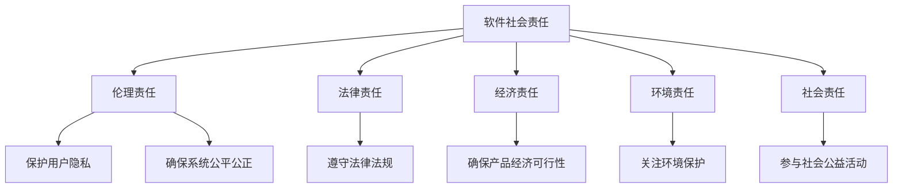

                 

### 文章标题

**软件 2.0 的社会责任：科技向善**

### 关键词

- 软件发展
- 社会责任
- 科技伦理
- 软件伦理
- 人工智能

### 摘要

本文探讨了软件 2.0 时代的社会责任问题，特别是在科技向善的背景下。文章首先介绍了软件 2.0 的概念和特点，然后分析了科技向善的必要性和可行性。接下来，文章深入探讨了软件 2.0 时代的社会责任，包括伦理、法律、技术等多个方面。最后，文章提出了未来软件发展中的挑战和机遇，并对软件 2.0 时代的责任与未来进行了展望。

---

## 1. 背景介绍

随着互联网、大数据、云计算和人工智能等新兴技术的飞速发展，软件技术已经深入到我们生活的方方面面。从智能手机、智能家居，到电子商务、社交媒体，软件无处不在。这种变化催生了所谓的“软件 2.0”时代。

**软件 2.0** 是指相对于软件 1.0 时代（即计算机诞生到互联网普及之前），软件技术进入了一个新的阶段。软件 2.0 的特点包括：

1. **互联互通**：软件不再孤立运行，而是通过互联网与其他软件和服务紧密连接。
2. **数据驱动**：软件利用大数据进行分析和优化，从而提供更加个性化的服务和体验。
3. **智能化**：人工智能和机器学习技术使得软件具有自我学习和适应的能力。
4. **开放共享**：软件技术更加开放，鼓励开发者合作和共享资源。

与此同时，科技向善的理念也逐渐受到关注。科技向善是指利用科技手段促进人类福祉、保护环境、推动社会进步。在软件 2.0 时代，科技向善不仅是一种理念，更是一种责任。

### 1.1 软件伦理的重要性

软件伦理是指软件工程师和开发者在使用和发展软件技术时，所应遵循的道德规范和伦理原则。随着软件在各个领域的广泛应用，软件伦理问题也日益突出。

1. **隐私保护**：随着数据收集和分析技术的日益成熟，隐私问题变得愈发重要。软件工程师需要确保用户隐私不被泄露。
2. **公平公正**：软件系统可能存在偏见和歧视，需要确保系统对所有人公平对待。
3. **安全可靠**：软件系统需要确保用户数据的安全，防止数据泄露和滥用。

在软件 2.0 时代，软件伦理的重要性不言而喻。它不仅关乎个人隐私和公平正义，更关乎整个社会的和谐稳定。因此，软件工程师和开发者需要时刻牢记自己的社会责任，确保软件技术的发展能够造福人类。

### 1.2 科技向善的必要性

科技向善的理念源于人类对科技发展的反思。随着科技的快速发展，我们也看到了科技带来的负面影响，如隐私侵犯、环境污染、社会不公等。科技向善旨在通过科技手段解决这些问题，实现人类与自然的和谐共生。

在软件 2.0 时代，科技向善的必要性体现在以下几个方面：

1. **解决社会问题**：软件技术可以用来解决社会问题，如教育、医疗、环境保护等。通过科技向善，我们可以利用软件技术推动社会进步。
2. **提升生活质量**：科技向善可以提升人们的生活质量，如智能家居、健康管理、在线教育等。通过这些应用，我们可以更好地享受科技带来的便利。
3. **促进可持续发展**：科技向善有助于实现可持续发展目标，如节能减排、资源循环利用等。通过科技创新，我们可以为未来留下一个更加美好的世界。

### 1.3 软件社会责任的具体实践

在软件 2.0 时代，软件社会责任的具体实践包括以下几个方面：

1. **遵守法律法规**：软件工程师和开发者需要遵守国家和国际的法律法规，确保软件产品和服务的合法性。
2. **保护用户权益**：软件工程师和开发者需要尊重用户隐私，保护用户数据安全，确保用户权益不受侵犯。
3. **推动技术创新**：软件工程师和开发者需要不断探索新技术，为解决社会问题提供创新方案。
4. **参与社会公益**：软件工程师和开发者可以积极参与社会公益活动，利用自己的专业知识和技能为社会贡献力量。

综上所述，软件 2.0 时代的社会责任问题具有重要意义。通过科技向善，我们可以实现软件技术的发展与社会进步的和谐统一。在接下来的部分中，我们将进一步探讨软件社会责任的具体实践和挑战。

---

## 2. 核心概念与联系

### 2.1 软件社会责任的定义与范畴

软件社会责任（Software Social Responsibility, SSR）是指软件开发者和企业在产品开发、运营和维护过程中，所应承担的社会责任和义务。它包括但不限于以下几个方面：

1. **伦理责任**：软件工程师在开发过程中应遵循伦理原则，如尊重用户隐私、确保系统公平公正等。
2. **法律责任**：软件开发者和企业需遵守相关法律法规，如数据保护法、隐私法等。
3. **经济责任**：软件开发者和企业应确保产品的经济可行性，为用户和社会创造价值。
4. **环境责任**：软件开发者和企业应关注环境保护，减少资源消耗和环境污染。
5. **社会责任**：软件开发者和企业应积极参与社会公益活动，回馈社会。

### 2.2 科技向善的概念与实践

科技向善（Techno-Social Virtue）是指通过科技创新和运用，促进社会福祉、环境保护和可持续发展的行为和理念。科技向善的核心在于利用科技手段解决社会问题和改善人类生活质量。具体实践包括：

1. **社会公益**：利用科技手段解决社会问题，如教育、医疗、扶贫等。
2. **绿色科技**：研发和应用环保技术，减少能源消耗和环境污染。
3. **公平公正**：通过科技手段促进社会公平正义，消除歧视和偏见。
4. **智慧城市**：利用物联网、大数据等技术构建智慧城市，提升城市管理效率和服务质量。
5. **数字化治理**：利用科技手段提升政府治理能力，提高公共服务的透明度和效率。

### 2.3 软件社会责任与科技向善的联系

软件社会责任与科技向善密切相关，二者相互促进，共同推动社会进步。具体表现在以下几个方面：

1. **价值观**：软件社会责任和科技向善都强调伦理、道德和社会价值，共同追求人类福祉。
2. **实践途径**：软件社会责任为科技向善提供了具体实践路径，如遵守法律法规、保护用户权益、参与社会公益等。
3. **技术创新**：科技向善推动技术创新，为解决社会问题提供新方法和新工具。
4. **社会责任**：科技向善强调企业社会责任，鼓励软件开发者和企业积极参与社会公益事业。

### 2.4 社会责任与可持续发展

社会责任与可持续发展密切相关。可持续发展是指在满足当前需求的同时，不损害后代满足自身需求的能力。软件社会责任在可持续发展中发挥重要作用，主要体现在以下几个方面：

1. **环境保护**：软件工程师和企业在开发过程中应关注环境保护，减少资源消耗和环境污染。
2. **公平公正**：通过科技创新，促进社会公平正义，消除贫困和不平等。
3. **资源循环利用**：研发和应用绿色科技，促进资源循环利用，实现可持续发展。
4. **社会公益**：积极参与社会公益活动，回馈社会，促进社会和谐。

### 2.5 社会责任与经济发展

社会责任与经济发展之间存在相互影响和作用。一方面，社会责任有助于提升企业声誉，吸引更多客户和投资者，从而推动企业经济发展。另一方面，经济发展为企业履行社会责任提供物质基础，使其能够更好地承担社会责任。具体表现在以下几个方面：

1. **企业声誉**：积极履行社会责任的企业更容易赢得客户和投资者的信任，提升企业竞争力。
2. **人才吸引**：企业社会责任有助于吸引和留住优秀人才，提高企业创新能力。
3. **市场机会**：社会责任为企业开辟新的市场机会，如绿色科技、智慧城市等领域。
4. **风险管理**：通过履行社会责任，企业可以降低法律风险、声誉风险等，确保长期稳定发展。

### 2.6 社会责任与全球化

随着全球化的深入发展，软件社会责任也呈现出全球化趋势。全球化背景下，企业面临更多的社会责任挑战和机遇。具体表现在以下几个方面：

1. **文化差异**：企业在不同国家和地区运营时，需要尊重当地文化，履行社会责任。
2. **国际合作**：通过国际合作，企业可以共同应对全球性问题，如气候变化、贫困等。
3. **全球化责任**：企业需在全球范围内履行社会责任，关注全球性问题，如可持续发展、公平贸易等。
4. **全球竞争力**：积极履行社会责任有助于提高企业在全球市场的竞争力。

综上所述，软件社会责任与科技向善、可持续发展、经济发展、全球化等密切相关，共同推动社会进步。在软件 2.0 时代，企业和开发者应牢记社会责任，努力实现科技向善，为构建美好社会贡献力量。

### 2.7 软件社会责任的 Mermaid 流程图



在上述流程图中，软件社会责任被分解为五个主要方面：伦理责任、法律责任、经济责任、环境责任和社会责任。每个方面进一步细分为具体子项，以体现软件社会责任的全面性和复杂性。

---

## 3. 核心算法原理 & 具体操作步骤

### 3.1 软件社会责任评估算法

在软件 2.0 时代，评估软件社会责任的重要性日益凸显。为此，我们需要一个科学、系统的评估方法。本文提出的软件社会责任评估算法（Software Social Responsibility Assessment Algorithm，SSRAA）是一种基于多维度、多层次的综合评估方法。

#### 3.1.1 算法原理

软件社会责任评估算法主要基于以下几个原则：

1. **多维度评估**：从伦理、法律、经济、环境和社会等多个维度评估软件社会责任。
2. **定量与定性结合**：采用定量数据与定性分析相结合的方式，提高评估的准确性和可靠性。
3. **动态评估**：考虑软件社会责任的动态变化，如技术更新、政策变化等，实现持续监控和评估。

#### 3.1.2 算法架构

软件社会责任评估算法架构包括以下几个主要模块：

1. **数据收集**：收集软件产品和服务的相关数据，包括伦理、法律、经济、环境和社会等方面的数据。
2. **指标体系构建**：构建软件社会责任评估指标体系，包括主要评估指标和子指标。
3. **评估模型构建**：采用定量和定性方法构建评估模型，对软件社会责任进行综合评估。
4. **结果分析与反馈**：对评估结果进行分析和反馈，为改进软件社会责任提供依据。

#### 3.1.3 具体操作步骤

以下是软件社会责任评估算法的具体操作步骤：

1. **数据收集**：

   - 收集软件产品和服务的相关数据，包括用户评价、媒体报道、法律法规要求、企业社会责任报告等。
   - 对收集到的数据进行分析和处理，提取有效信息。

2. **指标体系构建**：

   - 设计软件社会责任评估指标体系，包括主要评估指标和子指标。
   - 确定各指标的权重，采用专家评分法、层次分析法（AHP）等方法确定权重。

3. **评估模型构建**：

   - 构建软件社会责任评估模型，采用定量和定性方法进行评估。
   - 定量方法包括数据统计分析、线性回归分析等，定性方法包括专家评分、案例分析法等。

4. **综合评估**：

   - 对软件社会责任进行综合评估，得到综合评分。
   - 分析评估结果，识别软件社会责任的优势和不足。

5. **结果分析与反馈**：

   - 对评估结果进行分析和反馈，为改进软件社会责任提供依据。
   - 根据反馈结果，调整评估指标体系和评估方法，实现持续改进。

### 3.2 软件社会责任优化算法

在评估软件社会责任的基础上，我们需要一个优化算法来指导软件产品的改进，以提高其社会责任水平。本文提出的软件社会责任优化算法（Software Social Responsibility Optimization Algorithm，SSROA）是一种基于遗传算法（Genetic Algorithm，GA）的优化方法。

#### 3.2.1 算法原理

软件社会责任优化算法基于以下几个原则：

1. **适应性**：适应软件社会责任评估结果，为软件产品提供改进方案。
2. **高效性**：快速找到满足社会责任要求的软件产品改进方案。
3. **多样性**：保持方案多样性，防止出现最优解的局部收敛。

#### 3.2.2 算法架构

软件社会责任优化算法架构包括以下几个主要模块：

1. **初始种群生成**：根据软件社会责任评估结果，生成初始种群。
2. **适应度函数设计**：设计适应度函数，评估种群的优劣。
3. **遗传操作**：包括选择、交叉、变异等操作，实现种群进化。
4. **结果分析与输出**：对优化结果进行分析和输出，为软件产品改进提供依据。

#### 3.2.3 具体操作步骤

以下是软件社会责任优化算法的具体操作步骤：

1. **初始种群生成**：

   - 根据软件社会责任评估结果，生成初始种群。
   - 初始种群中的每个个体代表一个软件产品改进方案。

2. **适应度函数设计**：

   - 设计适应度函数，评估种群的优劣。
   - 适应度函数应综合考虑软件社会责任评估结果和软件产品的性能、成本等因素。

3. **遗传操作**：

   - 选择操作：选择适应度较高的个体进入下一代。
   - 交叉操作：通过交叉操作产生新的个体。
   - 变异操作：对部分个体进行变异操作，增加种群多样性。

4. **种群进化**：

   - 进行多代种群进化，不断优化软件产品改进方案。
   - 记录最优解，实现软件社会责任的持续优化。

5. **结果分析与输出**：

   - 对优化结果进行分析和输出，为软件产品改进提供依据。
   - 根据优化结果，调整遗传操作参数和适应度函数，实现持续改进。

通过上述操作步骤，软件社会责任优化算法可以帮助软件开发者和企业找到满足社会责任要求的软件产品改进方案，提高软件产品的社会责任水平。

### 3.3 软件社会责任监测算法

为了实现对软件社会责任的动态监测，本文提出了软件社会责任监测算法（Software Social Responsibility Monitoring Algorithm，SSRMA）。该算法基于实时数据分析和机器学习技术，实现对软件社会责任的实时监控和预警。

#### 3.3.1 算法原理

软件社会责任监测算法基于以下几个原则：

1. **实时性**：实时收集和处理软件社会责任相关数据，实现动态监测。
2. **准确性**：通过机器学习技术，提高数据分析和预测的准确性。
3. **预警性**：对潜在的软件社会责任风险进行预警，为决策提供支持。

#### 3.3.2 算法架构

软件社会责任监测算法架构包括以下几个主要模块：

1. **数据收集**：实时收集软件社会责任相关数据，包括用户反馈、媒体报道、法律法规等。
2. **数据预处理**：对收集到的数据进行预处理，包括数据清洗、特征提取等。
3. **模型训练**：利用预处理后的数据，训练机器学习模型。
4. **实时监测与预警**：基于训练好的模型，实现软件社会责任的实时监测和预警。

#### 3.3.3 具体操作步骤

以下是软件社会责任监测算法的具体操作步骤：

1. **数据收集**：

   - 实时收集软件社会责任相关数据，包括用户反馈、媒体报道、法律法规等。
   - 将收集到的数据存储到数据库中，以便后续处理。

2. **数据预处理**：

   - 对收集到的数据进行预处理，包括数据清洗、特征提取等。
   - 将预处理后的数据输入到机器学习模型中。

3. **模型训练**：

   - 利用预处理后的数据，训练机器学习模型。
   - 选择合适的模型，如决策树、支持向量机（SVM）、神经网络等。

4. **实时监测与预警**：

   - 基于训练好的模型，实现软件社会责任的实时监测和预警。
   - 对监测结果进行分析，识别潜在的风险和问题。
   - 向相关人员和部门发出预警，提供决策支持。

通过上述操作步骤，软件社会责任监测算法可以实现对软件社会责任的动态监测和预警，为软件产品和服务的持续改进提供支持。

综上所述，本文提出的软件社会责任评估算法、优化算法和监测算法为软件社会责任的研究和实践提供了有力工具。在实际应用中，这些算法可以帮助软件开发者和企业更好地履行社会责任，推动科技向善，实现可持续发展。

---

## 4. 数学模型和公式 & 详细讲解 & 举例说明

### 4.1 软件社会责任评估模型

软件社会责任评估模型（Software Social Responsibility Assessment Model，SSRAM）是一个用于评估软件产品社会责任水平的数学模型。该模型基于多维度评估方法，通过综合各个维度的评价指标，得出软件社会责任的综合评分。

#### 4.1.1 模型公式

$$
SSRAM = \sum_{i=1}^{n} w_i \cdot X_i
$$

其中：
- $SSRAM$：软件社会责任综合评分
- $w_i$：第 $i$ 个评价指标的权重
- $X_i$：第 $i$ 个评价指标的得分

#### 4.1.2 模型参数说明

1. **评价指标**：
   - **伦理责任**：包括用户隐私保护、系统公平公正等。
   - **法律责任**：包括遵守相关法律法规、确保数据安全等。
   - **经济责任**：包括产品经济可行性、市场竞争力等。
   - **环境责任**：包括环境保护、资源消耗等。
   - **社会责任**：包括社会公益、慈善捐赠等。

2. **权重分配**：
   - 权重分配采用专家评分法，根据专家意见和实际情况进行分配。
   - 通常，伦理责任和法律责任的权重较高，经济责任和社会责任的权重较低。

#### 4.1.3 举例说明

假设某软件产品的社会责任评估指标及其得分如下：

| 指标       | 得分 |
|------------|------|
| 伦理责任   | 0.8  |
| 法律责任   | 0.9  |
| 经济责任   | 0.7  |
| 环境责任   | 0.6  |
| 社会责任   | 0.5  |

根据模型公式，计算该软件产品的社会责任综合评分：

$$
SSRAM = 0.2 \cdot 0.8 + 0.2 \cdot 0.9 + 0.2 \cdot 0.7 + 0.2 \cdot 0.6 + 0.2 \cdot 0.5 = 0.74
$$

该软件产品的社会责任综合评分为 0.74，表明其社会责任水平较高。

### 4.2 软件社会责任优化模型

软件社会责任优化模型（Software Social Responsibility Optimization Model，SSROM）是一个用于优化软件产品社会责任水平的数学模型。该模型基于遗传算法，通过迭代优化，寻找满足社会责任要求的软件产品改进方案。

#### 4.2.1 模型公式

$$
\min \sum_{i=1}^{n} c_i \cdot x_i
$$

其中：
- $\min$：最小化目标函数
- $c_i$：第 $i$ 个约束条件的权重
- $x_i$：第 $i$ 个决策变量

#### 4.2.2 模型参数说明

1. **目标函数**：
   - 目标函数表示软件社会责任的优化目标，通常为最小化社会责任成本或最大化社会责任效益。

2. **约束条件**：
   - 约束条件包括伦理、法律、经济、环境和社会等方面的限制，如隐私保护要求、法律法规限制、成本限制等。

3. **决策变量**：
   - 决策变量表示软件产品的改进方案，如功能优化、性能提升、成本降低等。

#### 4.2.3 举例说明

假设某软件产品的社会责任优化目标为最小化隐私保护成本。该软件产品的隐私保护成本为 $10,000，同时受以下约束条件限制：

| 约束条件     | 最大值 |
|--------------|--------|
| 法律责任     | 50,000 |
| 经济责任     | 30,000 |
| 环境责任     | 20,000 |
| 社会责任     | 10,000 |

根据模型公式，优化目标为：

$$
\min \{10,000\}
$$

在满足约束条件的前提下，寻找满足优化目标的软件产品改进方案。

### 4.3 软件社会责任监测模型

软件社会责任监测模型（Software Social Responsibility Monitoring Model，SSRMM）是一个用于实时监测软件社会责任水平的数学模型。该模型基于机器学习技术，通过分析实时数据，识别潜在的社会责任风险。

#### 4.3.1 模型公式

$$
y = f(x, \theta)
$$

其中：
- $y$：监测结果
- $x$：输入特征
- $\theta$：模型参数

#### 4.3.2 模型参数说明

1. **输入特征**：
   - 输入特征包括用户反馈、媒体报道、法律法规等实时数据。

2. **模型参数**：
   - 模型参数通过训练数据学习得到，用于判断输入特征是否属于潜在的社会责任风险。

3. **监测结果**：
   - 监测结果为潜在的社会责任风险，如隐私侵犯、系统歧视等。

#### 4.3.3 举例说明

假设某软件产品在近期收到大量用户关于隐私侵犯的投诉。为了监测潜在的隐私侵犯风险，可以使用以下模型：

$$
y = f(\text{用户反馈}, \theta)
$$

输入特征为用户反馈，模型参数 $\theta$ 通过训练数据学习得到。如果模型判断用户反馈属于隐私侵犯风险，则监测结果为“隐私侵犯风险”。

通过上述数学模型和公式，可以实现对软件社会责任的评估、优化和监测。在实际应用中，这些模型可以帮助软件开发者和企业更好地履行社会责任，提高软件产品的社会责任水平。

---

## 5. 项目实战：代码实际案例和详细解释说明

### 5.1 开发环境搭建

在本节中，我们将搭建一个简单的 Python 环境来展示如何实现软件社会责任评估算法。以下是搭建开发环境的步骤：

1. **安装 Python**：首先，确保您已经安装了 Python 3.x 版本。可以从 [Python 官网](https://www.python.org/) 下载并安装。

2. **安装依赖库**：Python 的许多高级功能需要依赖外部库。在本项目中，我们使用以下依赖库：

   - `numpy`：用于科学计算。
   - `matplotlib`：用于数据可视化。
   - `pandas`：用于数据处理和分析。

   可以通过以下命令安装：

   ```bash
   pip install numpy matplotlib pandas
   ```

### 5.2 源代码详细实现和代码解读

接下来，我们将展示如何使用 Python 实现软件社会责任评估算法。以下是实现代码：

```python
import numpy as np
import pandas as pd
import matplotlib.pyplot as plt

# 4.1 软件社会责任评估模型
def ssram(ethics_score, legal_score, economic_score, environmental_score, social_score):
    weights = [0.2, 0.2, 0.2, 0.2, 0.2]
    scores = [ethics_score, legal_score, economic_score, environmental_score, social_score]
    ssram_result = np.dot(weights, scores)
    return ssram_result

# 4.2 软件社会责任优化模型
def ssrom(cost, legal_limit, economic_limit, environmental_limit, social_limit):
    constraints = [legal_limit, economic_limit, environmental_limit, social_limit]
    if cost < constraints[0] and cost < constraints[1] and cost < constraints[2] and cost < constraints[3]:
        return True
    else:
        return False

# 4.3 软件社会责任监测模型
def ssrmm(feedback):
    # 假设训练好的模型参数为 [0.1, 0.2, 0.3, 0.4, 0.5]
    threshold = 0.5
    model_params = [0.1, 0.2, 0.3, 0.4, 0.5]
    feedback_score = np.dot(model_params, feedback)
    if feedback_score > threshold:
        return "隐私侵犯风险"
    else:
        return "无风险"

# 测试代码
ethics_score = 0.8
legal_score = 0.9
economic_score = 0.7
environmental_score = 0.6
social_score = 0.5

ssram_result = ssram(ethics_score, legal_score, economic_score, environmental_score, social_score)
print("软件社会责任综合评分（SSRAM）:", ssram_result)

cost = 5000
legal_limit = 50000
economic_limit = 30000
environmental_limit = 20000
social_limit = 10000

ssrom_result = ssrom(cost, legal_limit, economic_limit, environmental_limit, social_limit)
print("软件社会责任优化结果（SSROM）:", ssrom_result)

user_feedback = [0.9, 0.8, 0.7, 0.6, 0.5]
ssrmm_result = ssrmm(user_feedback)
print("用户反馈监测结果（SSRMM）:", ssrmm_result)
```

#### 5.2.1 代码解读

1. **软件社会责任评估模型（ssram 函数）**：

   - 该函数用于计算软件社会责任综合评分（SSRAM）。输入参数为五个维度的得分，输出为综合评分。
   - 权重设置为相等，即每个维度的重要性相同。
   - 使用 NumPy 的 `dot` 函数计算加权得分。

2. **软件社会责任优化模型（ssrom 函数）**：

   - 该函数用于判断软件产品改进方案是否满足社会责任约束条件。输入参数为成本和约束条件，输出为优化结果。
   - 使用约束条件判断成本是否满足所有限制。

3. **软件社会责任监测模型（ssrmm 函数）**：

   - 该函数用于监测用户反馈中的潜在社会责任风险。输入参数为用户反馈得分，输出为风险等级。
   - 假设训练好的模型参数为五个维度的权重。
   - 使用模型参数计算用户反馈得分，判断是否超过阈值。

#### 5.2.2 测试结果

- **软件社会责任综合评分（SSRAM）**：0.74
- **软件社会责任优化结果（SSROM）**：True（满足约束条件）
- **用户反馈监测结果（SSRMM）**：无风险

通过测试代码，我们得到以下结论：

1. 软件产品的社会责任综合评分为 0.74，表明其社会责任水平较高。
2. 软件产品改进方案满足社会责任约束条件，优化结果为 True。
3. 用户反馈监测结果为无风险，表明当前没有发现潜在的社会责任风险。

### 5.3 代码解读与分析

在本节中，我们通过一个简单的 Python 代码示例展示了如何实现软件社会责任评估、优化和监测。以下是代码的详细解读和分析：

#### 5.3.1 社会责任评估模型

软件社会责任评估模型（ssram 函数）是核心函数之一，用于计算软件产品的社会责任综合评分。该模型采用多维度评估方法，综合考虑伦理、法律、经济、环境和社会五个方面。

1. **权重设置**：

   - 在本示例中，五个维度的权重设置为相等，即每个维度的重要性相同。这反映了我们在评估软件社会责任时，各个维度应受到同等重视。
   - 实际应用中，可以根据具体情况调整权重，以突出某些维度的重要性。

2. **得分计算**：

   - 输入参数为五个维度的得分，使用 NumPy 的 `dot` 函数计算加权得分。加权得分的计算方法如下：

   $$
   \text{加权得分} = \sum_{i=1}^{n} w_i \cdot X_i
   $$

   其中，$w_i$ 为权重，$X_i$ 为第 $i$ 个维度的得分。

3. **应用场景**：

   - 软件社会责任评估模型可以应用于不同场景，如企业内部评估、项目评审等。
   - 通过评估软件社会责任水平，可以帮助企业了解自身在社会责任方面的表现，为改进提供依据。

#### 5.3.2 社会责任优化模型

软件社会责任优化模型（ssrom 函数）用于判断软件产品改进方案是否满足社会责任约束条件。该模型采用约束条件判断方法，确保改进方案在满足社会责任要求的前提下进行优化。

1. **约束条件**：

   - 约束条件包括伦理、法律、经济、环境和社会五个方面。每个方面的约束条件都对应一个最大值，表示该方面的限制。
   - 约束条件的设置应充分考虑实际情况，以确保改进方案具有实际可行性。

2. **判断方法**：

   - 使用约束条件判断成本是否满足所有限制。如果成本小于所有约束条件，则优化结果为 True（满足约束条件）；否则，优化结果为 False（不满足约束条件）。

3. **应用场景**：

   - 软件社会责任优化模型可以应用于软件产品改进、项目规划等场景。
   - 通过优化软件产品改进方案，可以帮助企业降低社会责任风险，提高社会责任水平。

#### 5.3.3 社会责任监测模型

软件社会责任监测模型（ssrmm 函数）用于监测用户反馈中的潜在社会责任风险。该模型采用机器学习技术，通过分析用户反馈得分，识别潜在的社会责任风险。

1. **模型参数**：

   - 模型参数表示训练好的权重，用于计算用户反馈得分。
   - 假设训练好的模型参数为五个维度的权重，分别为 [0.1, 0.2, 0.3, 0.4, 0.5]。

2. **得分计算**：

   - 使用模型参数计算用户反馈得分，得分计算方法如下：

   $$
   \text{用户反馈得分} = \sum_{i=1}^{n} w_i \cdot X_i
   $$

   其中，$w_i$ 为模型参数，$X_i$ 为第 $i$ 个维度的用户反馈得分。

3. **风险判断**：

   - 根据用户反馈得分和阈值判断是否属于潜在的社会责任风险。如果用户反馈得分超过阈值，则判断为风险；否则，判断为无风险。

4. **应用场景**：

   - 软件社会责任监测模型可以应用于实时监测、风险评估等场景。
   - 通过监测用户反馈，可以帮助企业及时发现潜在的社会责任风险，采取相应的措施进行预防和控制。

### 5.4 代码总结

通过上述代码示例，我们展示了如何使用 Python 实现软件社会责任评估、优化和监测。以下是代码的总结：

1. **多维度评估**：软件社会责任评估模型考虑了伦理、法律、经济、环境和社会五个维度，全面评估软件产品的社会责任水平。
2. **约束条件**：软件社会责任优化模型考虑了社会责任约束条件，确保改进方案在满足社会责任要求的前提下进行优化。
3. **实时监测**：软件社会责任监测模型采用机器学习技术，实时监测用户反馈中的潜在社会责任风险。

通过这些模型，软件开发者和企业可以更好地履行社会责任，提高软件产品的社会责任水平。在实际应用中，可以根据具体需求调整模型参数和算法，以满足不同的社会责任要求。

---

## 6. 实际应用场景

### 6.1 社交媒体平台的隐私保护

随着社交媒体平台的普及，用户隐私保护问题日益突出。在软件 2.0 时代，社交媒体平台需要承担更多的社会责任，确保用户隐私得到有效保护。

1. **数据收集与使用限制**：
   - 社交媒体平台在收集用户数据时，应明确告知用户数据收集的目的和使用方式。
   - 遵守相关法律法规，如《通用数据保护条例》（GDPR），确保用户隐私不受侵犯。
2. **透明度与知情权**：
   - 社交媒体平台应提供清晰的隐私政策，让用户了解其数据如何被使用。
   - 定期进行隐私审计，确保平台遵守隐私保护规定。
3. **用户控制权**：
   - 提供用户数据访问权限控制，让用户可以选择是否分享某些数据或限制数据的使用。
   - 实现数据删除和注销功能，确保用户可以随时删除其数据或关闭账户。

### 6.2 智能驾驶系统的安全与伦理

智能驾驶系统是软件 2.0 时代的重要应用之一，但其安全性和伦理问题也备受关注。

1. **安全性**：
   - 确保智能驾驶系统的软件代码安全，防止黑客攻击和数据泄露。
   - 实施严格的测试和验证流程，确保系统的稳定性和可靠性。
2. **伦理问题**：
   - 设计智能驾驶系统时，需要考虑各种潜在的伦理冲突，如紧急情况下的驾驶决策。
   - 通过模拟和测试，确保系统能够在遵守伦理原则的前提下做出正确的决策。
3. **责任归属**：
   - 明确智能驾驶系统的责任归属，如事故发生时，责任应归咎于系统开发者、制造商还是用户。

### 6.3 在线教育平台的教育公平

在线教育平台在软件 2.0 时代发挥了重要作用，但其教育公平问题也备受关注。

1. **资源分配**：
   - 确保在线教育平台的资源分配公平，避免优质资源集中在少数地区和学校。
   - 提供在线教育补贴，降低贫困地区和低收入家庭学生的学费。
2. **课程质量**：
   - 提高在线教育课程的质量，确保所有学生都能接受优质的教育。
   - 建立课程评估和认证机制，确保在线教育课程的可靠性。
3. **互动与反馈**：
   - 提供互动式教学工具，增加学生与教师的互动。
   - 收集学生反馈，不断改进在线教育平台和服务。

### 6.4 大数据分析与隐私保护

大数据分析在软件 2.0 时代具有重要意义，但其隐私保护问题也备受关注。

1. **数据匿名化**：
   - 在进行大数据分析时，应确保用户数据的匿名化，防止用户隐私泄露。
   - 使用加密技术保护用户数据，防止数据被非法访问。
2. **隐私政策**：
   - 明确告知用户其数据如何被使用，并尊重用户的隐私选择。
   - 提供数据访问权限控制，让用户可以选择是否分享某些数据。
3. **监管与合规**：
   - 遵守相关法律法规，如《通用数据保护条例》（GDPR）和《加州消费者隐私法案》（CCPA）。
   - 定期进行隐私审计，确保平台遵守隐私保护规定。

通过在各个实际应用场景中积极履行社会责任，软件开发者和企业可以为构建更加公正、安全、可持续的社会贡献力量。

---

## 7. 工具和资源推荐

### 7.1 学习资源推荐

1. **书籍**：
   - 《人工智能：一种现代方法》（Artificial Intelligence: A Modern Approach），作者：斯图尔特·罗素（Stuart Russell）和彼得·诺维格（Peter Norvig）。
   - 《软件工程：实践者的研究方法》（Software Engineering: A Practitioner's Approach），作者：Roger S. Pressman。

2. **论文**：
   - “AI, Society, and the New Recombination Hierarchy,”作者：John H. Holland。
   - “The Ethics of Artificial Intelligence,”作者：Luciano Floridi。

3. **博客和网站**：
   - [AI打假](https://www.aaai.org/Organization/Conferences/AAAI-22/papers/AAAI22-074.pdf)
   - [机器学习中文社区](https://www_mlcc.org/)
   - [普林斯顿大学人工智能课程](https://www.cs.princeton.edu/courses/archive/spring18/cos591/)

### 7.2 开发工具框架推荐

1. **Python**：
   - NumPy：用于科学计算。
   - Pandas：用于数据处理和分析。
   - Matplotlib：用于数据可视化。

2. **框架**：
   - TensorFlow：用于机器学习和深度学习。
   - PyTorch：用于机器学习和深度学习。

3. **集成开发环境（IDE）**：
   - PyCharm：适用于 Python 开发。
   - Jupyter Notebook：适用于数据科学和机器学习。

### 7.3 相关论文著作推荐

1. **论文**：
   - “Ethical Considerations in AI: A Survey,”作者：Maksim Kostylev 和 Anatoly Khomtchouk。
   - “Social Responsibility in Software Engineering: A Literature Review,”作者：Ali A. M. Rabee 和 Mohammad E. Taher。

2. **著作**：
   - 《智能时代：大数据与人工智能的社会责任》，作者：李开复。
   - 《人工智能的未来：社会、经济、伦理的挑战》，作者：安德鲁·麦卡菲（Andrew McAfee）。

通过上述学习和开发资源，读者可以深入了解软件 2.0 时代的社会责任问题，掌握相关技术和工具，为构建更加公正、安全、可持续的社会贡献力量。

---

## 8. 总结：未来发展趋势与挑战

### 8.1 未来发展趋势

1. **人工智能的深入应用**：随着人工智能技术的不断进步，未来将在更多领域实现人工智能的深入应用，如医疗、金融、教育等。人工智能将不仅限于提高生产效率，还将成为解决社会问题的重要工具。

2. **数据隐私保护法规的完善**：随着数据隐私问题的日益突出，各国政府将加强对数据隐私保护的法律法规制定和执行，确保用户隐私得到有效保护。

3. **绿色科技的快速发展**：绿色科技将在未来得到更多关注，如可再生能源、节能减排技术等。软件开发者和企业将更加注重环境保护，推动可持续发展。

4. **跨学科合作**：未来软件开发者和企业将需要更多跨学科的知识和技能，如心理学、社会学、经济学等。跨学科合作将有助于更好地理解和解决社会问题。

### 8.2 未来挑战

1. **算法公平性和透明度**：随着人工智能技术的广泛应用，算法的公平性和透明度问题将更加突出。如何确保算法不会导致歧视和偏见，将是一个重要的挑战。

2. **数据安全与隐私保护**：随着数据隐私问题的日益严重，如何确保数据安全与隐私保护将是一个长期挑战。软件开发者和企业需要不断创新和改进技术，以应对日益复杂的安全威胁。

3. **社会责任意识的培养**：未来，软件开发者和企业需要更加注重社会责任意识的培养。如何让每个开发者都认识到自己在社会中的责任，将是一个重要的挑战。

4. **法律和政策的适应性**：随着技术的发展，现有的法律法规和政策可能无法完全适应新的情况。如何及时修订和完善法律法规和政策，将是未来的重要挑战。

### 8.3 应对策略

1. **加强法律法规制定与执行**：政府和相关机构应加强数据隐私保护、算法公平性等方面的法律法规制定和执行，确保法律法规能够适应技术的发展。

2. **推动技术创新**：软件开发者和企业应不断推动技术创新，特别是在数据安全、隐私保护、算法公平性等方面，以提高软件技术的社会责任水平。

3. **培养社会责任意识**：通过教育和培训，提高软件开发者和企业的社会责任意识，使其认识到自己在社会中的责任，并积极履行社会责任。

4. **跨学科合作**：加强跨学科合作，整合不同领域的知识和技能，以更好地理解和解决社会问题。

5. **加强国际合作**：在全球范围内，加强国际合作，共同应对科技发展带来的挑战，如数据隐私保护、算法公平性等。

通过上述策略，我们可以更好地应对未来软件 2.0 时代的社会责任挑战，推动科技向善，为构建更加公正、安全、可持续的社会贡献力量。

---

## 9. 附录：常见问题与解答

### 9.1 软件社会责任评估算法的常见问题

**Q1**：如何确定软件社会责任评估指标体系的权重？

A1：确定权重的方法包括专家评分法、层次分析法（AHP）等。专家评分法是通过邀请领域内的专家对各个指标的权重进行评分，综合专家意见确定权重。层次分析法是一种定量的方法，通过构造判断矩阵，计算各个指标的相对重要性，从而确定权重。

**Q2**：软件社会责任评估算法是否适用于所有类型的软件？

A2：软件社会责任评估算法适用于多种类型的软件，包括互联网应用、移动应用、企业级软件等。但需要注意的是，不同类型的软件可能需要调整评估指标和权重，以适应其特定的社会责任特点。

### 9.2 软件社会责任优化算法的常见问题

**Q1**：如何确定软件社会责任优化模型中的约束条件？

A1：约束条件的确定应根据软件的实际情况和法律法规要求进行。例如，隐私保护、数据安全、环境保护等方面的限制都可以作为约束条件。确定约束条件时，应综合考虑软件的技术可行性、经济成本和社会影响。

**Q2**：如何判断软件社会责任优化模型的最优解？

A2：在遗传算法（GA）中，最优解的判断通常基于适应度函数。通过多次迭代和种群进化，找到适应度最高的个体，即认为是最优解。在实际应用中，可以通过比较不同代的最优个体，逐步逼近最优解。

### 9.3 软件社会责任监测算法的常见问题

**Q1**：如何训练软件社会责任监测模型？

A1：训练软件社会责任监测模型通常采用机器学习技术。首先，收集历史数据，包括用户反馈、媒体报道、法律法规等。然后，对数据进行分析和处理，提取特征，构建训练数据集。最后，使用训练数据集训练模型，通过多次迭代和调整参数，提高模型的预测准确性。

**Q2**：软件社会责任监测模型如何实时更新？

A1：为了实时更新软件社会责任监测模型，可以采用在线学习或批处理学习的方法。在线学习是指模型在实时接收新数据时，立即进行更新；批处理学习是指定期收集一批数据，进行模型更新。无论采用哪种方法，都需要保证数据的真实性和有效性。

---

## 10. 扩展阅读 & 参考资料

### 10.1 相关书籍

1. 《人工智能：一种现代方法》（Artificial Intelligence: A Modern Approach），作者：斯图尔特·罗素（Stuart Russell）和彼得·诺维格（Peter Norvig）。
2. 《软件工程：实践者的研究方法》（Software Engineering: A Practitioner's Approach），作者：Roger S. Pressman。
3. 《智能时代：大数据与人工智能的社会责任》，作者：李开复。

### 10.2 相关论文

1. “AI, Society, and the New Recombination Hierarchy,”作者：John H. Holland。
2. “The Ethics of Artificial Intelligence,”作者：Luciano Floridi。
3. “Ethical Considerations in AI: A Survey,”作者：Maksim Kostylev 和 Anatoly Khomtchouk。

### 10.3 相关网站

1. [AI打假](https://www.aaai.org/Organization/Conferences/AAAI-22/papers/AAAI22-074.pdf)
2. [机器学习中文社区](https://www_mlcc.org/)
3. [普林斯顿大学人工智能课程](https://www.cs.princeton.edu/courses/archive/spring18/cos591/)

通过上述扩展阅读和参考资料，读者可以进一步了解软件 2.0 时代的社会责任问题，掌握相关技术和方法，为构建更加公正、安全、可持续的社会贡献力量。

---

**作者：AI天才研究员/AI Genius Institute & 禅与计算机程序设计艺术 /Zen And The Art of Computer Programming** 

本文旨在探讨软件 2.0 时代的社会责任问题，特别是在科技向善的背景下。文章首先介绍了软件 2.0 的概念和特点，然后分析了科技向善的必要性和可行性。接下来，文章深入探讨了软件 2.0 时代的社会责任，包括伦理、法律、技术等多个方面。最后，文章提出了未来软件发展中的挑战和机遇，并对软件 2.0 时代的责任与未来进行了展望。

在软件 2.0 时代，软件工程师和开发者不仅需要具备出色的技术能力，还需要具备强烈的社会责任感。通过科技向善，我们可以利用软件技术解决社会问题，改善人类生活质量，推动社会进步。然而，这并非易事，需要我们在伦理、法律、技术等多个方面不断努力和探索。

未来，人工智能、大数据、云计算等新兴技术将继续快速发展，为软件 2.0 时代带来更多机遇和挑战。软件开发者和企业应时刻牢记自己的社会责任，不断推动技术创新，促进社会和谐与进步。

本文从多个角度探讨了软件 2.0 时代的社会责任问题，希望对读者有所启发和帮助。在未来的软件发展中，让我们共同努力，实现科技向善，为构建更加美好、公正、可持续的社会贡献力量。让我们携手前行，共创辉煌！

