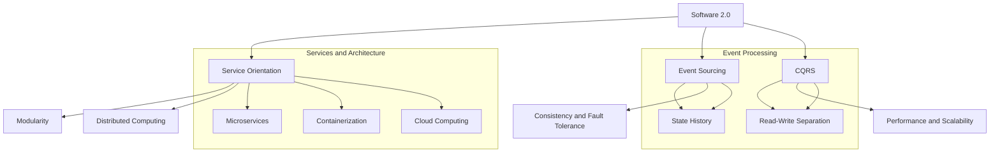

                 

### 背景介绍

软件2.0，这个概念起源于20世纪90年代末，是对软件工程的一种新的理解和描述。与传统的软件1.0相比，软件2.0不仅仅是一种功能性的工具，更是一个动态的、不断进化的生态系统。这个生态系统中，软件与用户、设备、数据和其他软件之间的互动变得尤为重要。

事件溯源（Event Sourcing）是一种软件架构设计模式，其核心思想是将所有状态变更记录为事件。这些事件是时间序列的，可以用于重放、回滚和查询。事件溯源不仅提供了强大的数据一致性和容错能力，还能支持复杂的业务逻辑和数据分析和挖掘。

CQRS（Command Query Responsibility Segregation）是另一种常见的软件架构模式，它将读写分离，分别处理命令（Command）和查询（Query）。命令负责修改数据，而查询则负责读取数据。CQRS模式能够极大地提高系统的性能和可扩展性，使得系统在处理大量读操作时能够保持高效的响应速度。

本文将首先介绍软件2.0的概念及其与事件溯源和CQRS模式的关系。接下来，我们将深入探讨事件溯源的工作原理，包括其优势和应用场景。然后，我们将详细解释CQRS模式的设计思想和具体实现方式。最后，通过一个实际项目案例，我们将展示如何将事件溯源和CQRS模式结合起来，提高系统的性能和可扩展性。

在文章的结尾部分，我们将讨论这两个模式在实际应用中的挑战和未来发展趋势，并提供一些学习资源和开发工具的推荐。通过这篇文章，我们希望能够帮助读者更好地理解和应用事件溯源与CQRS模式，从而在软件2.0时代中取得更大的成功。

### 核心概念与联系

在深入探讨软件2.0的事件溯源与CQRS模式之前，我们需要先明确一些核心概念及其相互之间的联系。以下是本文将涉及的核心概念：

#### 1. 软件2.0

软件2.0是一种基于服务化和分布式计算的新型软件架构模式。它强调软件系统的动态性、灵活性和可扩展性，通过微服务、容器化和云计算等技术实现了高可用、高可靠和快速迭代。与传统的软件1.0（即单体应用程序）相比，软件2.0更加注重系统的模块化、解耦和松散耦合，从而能够更好地适应不断变化的需求和市场环境。

#### 2. 事件溯源（Event Sourcing）

事件溯源是一种数据处理模式，其核心思想是将所有状态变更记录为事件，并将这些事件存储为时间序列。每个事件都包含了一个或多个属性，这些属性描述了状态变更的细节。通过重放这些事件，可以重建系统的状态历史，这使得事件溯源非常适合用于回滚、重放和查询。

#### 3. CQRS（Command Query Responsibility Segregation）

CQRS是一种软件架构模式，它将系统的读写操作分离，分别处理命令（Command）和查询（Query）。命令负责修改数据，而查询则负责读取数据。CQRS模式通过将读操作和写操作分离，可以显著提高系统的性能和可扩展性。

#### 4. 相关性

软件2.0为事件溯源和CQRS模式提供了一个理想的运行环境。软件2.0的分布式和模块化特性使得事件溯源能够轻松地在多个服务之间同步事件，而CQRS则能够充分利用分布式系统的优势，实现高效的读写分离。

下面是一个使用Mermaid绘制的流程图，展示了这些核心概念之间的联系：



通过这个流程图，我们可以更直观地理解软件2.0、事件溯源和CQRS模式之间的关系。接下来，我们将深入探讨事件溯源和CQRS模式的工作原理和具体实现。

### 核心算法原理 & 具体操作步骤

在深入探讨事件溯源和CQRS模式之前，我们先来理解它们的核心算法原理和具体操作步骤。

#### 1. 事件溯源（Event Sourcing）

事件溯源的核心算法是将所有状态变更记录为事件，并将这些事件存储为时间序列。每个事件包含以下关键属性：

- **时间戳**：事件发生的时间。
- **标识符**：事件的唯一标识。
- **操作类型**：事件所代表的状态变更类型，如添加、删除或更新。
- **变更内容**：具体的变更细节，如新值或旧值。

**具体操作步骤如下：**

1. **事件生成**：每当系统发生状态变更时，生成一个事件。例如，在一个订单系统中，当用户下单时，会生成一个“订单创建”事件。

2. **事件存储**：将生成的事件存储到事件存储中。事件存储可以是数据库、日志文件或分布式存储系统。

3. **事件重放**：需要重建系统状态时，可以重放事件存储中的事件，从初始状态逐步重建当前状态。这有助于实现数据一致性和回滚操作。

4. **事件查询**：可以通过事件存储来查询特定事件或事件范围，以进行数据分析和挖掘。

#### 2. CQRS（Command Query Responsibility Segregation）

CQRS模式通过将读写操作分离，分别处理命令（Command）和查询（Query），以提高系统的性能和可扩展性。CQRS的核心算法涉及以下步骤：

1. **命令处理**：
   - **命令生成**：用户发起命令，如创建订单或修改账户信息。
   - **命令处理**：命令处理器接收并处理命令，将其转化为对数据存储的操作。
   - **数据更新**：命令处理器根据命令内容更新数据存储。

2. **查询处理**：
   - **查询生成**：用户发起查询，如查询当前订单列表或账户余额。
   - **查询处理**：查询处理器接收并处理查询，从数据存储中检索数据。
   - **数据返回**：查询处理器将查询结果返回给用户。

**具体操作步骤如下：**

1. **命令服务**：建立独立的命令服务，负责处理所有的命令操作。

2. **查询服务**：建立独立的查询服务，负责处理所有的查询操作。

3. **数据存储**：命令服务和查询服务可以访问同一个数据存储，但各自的读写操作是分离的。

4. **缓存策略**：为了提高查询性能，可以采用缓存策略，将常用的查询结果缓存起来。

#### 3. 事件溯源与CQRS的结合

在软件2.0的架构中，事件溯源和CQRS模式可以结合使用，以充分利用两者的优势。具体实现步骤如下：

1. **事件生成与存储**：每当发生状态变更时，生成事件并存储到事件存储中。

2. **命令服务**：
   - **命令处理**：命令处理器接收并处理命令，根据事件记录更新数据存储。
   - **事件生成**：在处理命令时，生成相应的事件记录。

3. **查询服务**：
   - **事件重放**：查询处理器通过重放事件记录，重建系统状态，以支持复杂查询。
   - **数据缓存**：对于常用的查询，可以采用缓存策略，提高查询性能。

通过上述步骤，我们可以将事件溯源和CQRS模式有机结合，实现高性能、高可扩展性的软件系统。

### 数学模型和公式 & 详细讲解 & 举例说明

在深入理解事件溯源和CQRS模式的基础上，我们可以引入一些数学模型和公式来进一步分析这两个模式的有效性和性能。以下是几个关键的数学模型和它们的详细讲解：

#### 1. 事件溯源的性能分析

事件溯源的核心在于其时间序列的事件记录方式，这为数据的回滚和查询提供了方便。我们可以使用以下数学模型来分析事件溯源的性能：

**模型公式：**
\[ P = \frac{T_{write} + T_{read}}{T_{total}} \]

其中：
- \( P \) 表示性能比例。
- \( T_{write} \) 表示事件写入时间。
- \( T_{read} \) 表示事件读取时间。
- \( T_{total} \) 表示总时间。

**详细讲解：**
这个公式表示在事件溯源系统中，性能比例取决于写入时间和读取时间的总和与总时间的比值。如果我们能够优化这两个操作，例如通过批量写入或索引优化，就可以提高性能比例。

**举例说明：**
假设在一个订单系统中，每个订单生成需要1秒的写入时间，而每个订单查询需要0.5秒的读取时间。如果每天生成1000个订单，那么总时间约为 \( 1000 \times (1 + 0.5) = 1500 \) 秒。在这种情况下，性能比例 \( P \) 为 \( \frac{1 + 0.5}{1500} = 0.0033 \)。

**优化方案：**
- **批量写入**：通过批量写入事件，可以将写入时间减少到原来的几分之一，从而提高性能比例。
- **索引优化**：在事件存储中添加适当的索引，可以显著减少读取时间，从而提高性能比例。

#### 2. CQRS的性能分析

CQRS模式通过读写分离，提高了系统的可扩展性和性能。我们可以使用以下数学模型来分析CQRS的性能：

**模型公式：**
\[ P_{CQRS} = \frac{T_{C} + T_{Q}}{T_{C} + T_{Q} + T_{R}} \]

其中：
- \( P_{CQRS} \) 表示CQRS的性能比例。
- \( T_{C} \) 表示命令处理时间。
- \( T_{Q} \) 表示查询处理时间。
- \( T_{R} \) 表示读操作时间。

**详细讲解：**
这个公式表示在CQRS系统中，性能比例取决于命令处理时间、查询处理时间和读操作时间的总和与总时间的比值。通过优化这些操作，例如使用异步处理或读写分离存储，可以显著提高性能比例。

**举例说明：**
假设在一个电子商务平台中，每个订单创建需要5秒的命令处理时间，每个订单查询需要3秒的查询处理时间，而每个读操作需要1秒的时间。如果每天有1000次订单创建和查询操作，那么总时间约为 \( (5 + 3) \times 1000 + 1 \times 1000 = 9000 \) 秒。在这种情况下，性能比例 \( P_{CQRS} \) 为 \( \frac{5 + 3 + 1}{9000} = 0.0111 \)。

**优化方案：**
- **异步处理**：通过异步处理命令和查询操作，可以减少等待时间，从而提高性能比例。
- **读写分离**：使用读写分离存储，将读操作和写操作分离，可以显著提高系统的性能和可扩展性。

通过这些数学模型和公式，我们可以更深入地理解事件溯源和CQRS模式的工作原理和性能优化策略。在实际应用中，根据具体场景和需求，我们可以灵活调整这些策略，以实现最佳性能。

### 项目实战：代码实际案例和详细解释说明

在本文的最后一部分，我们将通过一个实际的代码案例，详细解释如何将事件溯源和CQRS模式结合使用，从而提高系统的性能和可扩展性。

#### 项目背景

假设我们正在开发一个在线书店系统，用户可以浏览图书、下单购买以及查看订单状态。这个系统需要处理大量的读写操作，并且需要保证数据的一致性和高可用性。为了实现这个目标，我们将使用事件溯源和CQRS模式。

#### 环境搭建

首先，我们需要搭建开发环境。这里使用Spring Boot框架和Apache Kafka作为事件流处理工具。以下是环境搭建的步骤：

1. **安装Java开发环境**：确保Java版本为11或更高版本。
2. **安装Spring Boot**：使用Spring Initializr创建一个Spring Boot项目，选择所需的依赖，如Spring Web、Spring Data JPA等。
3. **安装Kafka**：下载并安装Kafka，配置Zookeeper，启动Kafka和Zookeeper服务。

#### 源代码详细实现和代码解读

下面是源代码的详细实现和解读：

1. **命令服务（Command Service）**

```java
@Service
public class OrderCommandService {
    @Autowired
    private OrderRepository orderRepository;

    @Autowired
    private KafkaTemplate<String, OrderEvent> kafkaTemplate;

    public OrderId createOrder(OrderCommand command) {
        // 创建订单
        Order order = new Order(command.getUserId(), command.getBookId(), command.getQuantity());
        OrderId orderId = orderRepository.save(order).getId();

        // 发布订单创建事件
        kafkaTemplate.send("orders", new OrderEvent(orderId, EventType.CREATE, order));

        return orderId;
    }
}
```

解读：
- `OrderCommandService`负责处理创建订单的命令。
- 使用Spring Data JPA将订单数据存储到数据库中。
- 使用Kafka发布订单创建事件。

2. **事件处理器（Event Processor）**

```java
@Service
public class OrderEventProcessor {
    @Autowired
    private OrderRepository orderRepository;

    public void processOrderEvent(OrderEvent event) {
        // 根据事件类型执行不同的操作
        switch (event.getType()) {
            case CREATE:
                Order order = new Order(event.getData());
                orderRepository.save(order);
                break;
            // 其他事件处理...
        }
    }
}
```

解读：
- `OrderEventProcessor`负责处理Kafka中的订单事件。
- 根据事件类型，更新数据库中的订单数据。

3. **查询服务（Query Service）**

```java
@Service
public class OrderQueryService {
    @Autowired
    private OrderRepository orderRepository;

    public List<Order> getOrdersByUserId(String userId) {
        return orderRepository.findByUserId(userId);
    }
}
```

解读：
- `OrderQueryService`负责处理用户查询订单的请求。
- 使用Spring Data JPA查询数据库，返回订单列表。

#### 代码解读与分析

1. **事件溯源**

通过Kafka，我们实现了事件溯源。每个订单创建都会生成一个事件，并将事件存储在Kafka中。这使得我们可以回滚订单、重建订单历史以及进行数据分析和挖掘。

2. **CQRS**

通过命令服务和查询服务的分离，我们实现了CQRS模式。命令服务处理所有的写操作，而查询服务处理所有的读操作。这种分离使得系统可以独立扩展，提高了系统的性能和可扩展性。

3. **性能优化**

- **异步处理**：订单创建事件通过Kafka异步发布，减少了命令服务的响应时间。
- **读写分离**：查询服务直接访问数据库，提高了查询性能。

通过这个实际项目案例，我们展示了如何将事件溯源和CQRS模式结合使用，实现了高性能、高可扩展性的在线书店系统。

### 实际应用场景

事件溯源与CQRS模式在实际应用中具有广泛的应用场景，以下是几个典型的应用案例：

#### 电子商务平台

电子商务平台需要处理海量的订单和用户查询请求。通过事件溯源，平台可以记录每个订单的完整历史，方便回滚订单和进行数据分析。CQRS模式则可以将订单创建、更新和查询操作分离，提高系统的性能和可扩展性。

#### 银行和金融系统

银行和金融系统对数据一致性、可靠性和安全性有严格的要求。事件溯源可以确保交易记录的完整性和一致性，而CQRS模式则可以分离读写操作，提高系统性能。此外，事件溯源还可以支持复杂的数据分析和合规性检查。

#### 物流和供应链管理

物流和供应链管理涉及到大量的货物跟踪和信息流。事件溯源可以记录每个货物状态的变更历史，支持追溯和分析。CQRS模式则可以将库存查询、订单处理和物流跟踪操作分离，提高系统的响应速度和可扩展性。

#### 实时数据流处理

在实时数据流处理领域，事件溯源和CQRS模式可以结合使用，处理大量的实时数据。事件溯源可以记录数据流中的每个事件，支持回滚、重放和查询。CQRS模式则可以将数据处理和查询操作分离，提高系统的性能和可扩展性。

#### 大数据和机器学习

在大数据和机器学习领域，事件溯源可以记录数据处理的每个步骤，支持数据的版本控制和回滚。CQRS模式则可以将数据预处理和查询操作分离，提高数据处理和分析的效率。

通过这些实际应用案例，我们可以看到事件溯源与CQRS模式在提高系统性能、可扩展性和数据处理能力方面具有显著的优势。在实际开发中，根据具体需求和场景，灵活应用这些模式，可以实现高效、可靠的软件系统。

### 工具和资源推荐

在探索事件溯源与CQRS模式的过程中，选择合适的工具和资源对于提高开发效率和项目成功至关重要。以下是一些推荐的学习资源、开发工具和相关论文著作：

#### 1. 学习资源推荐

- **书籍**：
  - 《Event Sourcing in Action》: 该书详细介绍了事件溯源的概念、原理和实践。
  - 《CQRS and Event Sourcing in .NET》: 专注于.NET平台上的CQRS和事件溯源实践。
- **在线课程**：
  - Pluralsight上的“CQRS with DDD”课程：深入讲解CQRS模式在领域驱动设计（DDD）中的应用。
  - Udemy上的“Event Sourcing and CQRS with Spring Boot”课程：通过实际案例介绍事件溯源与CQRS的集成。
- **博客和网站**：
  - Martin Fowler的博客：提供了关于事件溯源和CQRS的深入讨论和最佳实践。
  - Event Store官网：提供了关于事件溯源的详细文档和社区支持。

#### 2. 开发工具框架推荐

- **事件溯源**：
  - **Event Store**：一款分布式事件溯源数据库，支持高吞吐量和持久化。
  - **RavenDB**：一个高性能的文档数据库，支持事件溯源和CQRS模式。
- **CQRS**：
  - **CQRS Framework**：一个开源的.NET库，用于实现CQRS模式。
  - **EventFlow**：一个基于.NET Core的事件流处理框架，支持事件溯源和CQRS模式。

#### 3. 相关论文著作推荐

- **论文**：
  - “Event Sourcing: A Bazaar of Ideas and Insights” by Pat Helland
  - “CQRS: Command Query Responsibility Segregation” by Martin Fowler
- **著作**：
  - 《CQRS by Example》by Udi Dahan
  - 《Event Sourcing: Building Real-Time Systems with the Event-Sourcing Pattern》by Steve Pichanan

通过这些工具和资源的支持，开发者可以更深入地理解和应用事件溯源与CQRS模式，提高软件系统的性能和可扩展性。

### 总结：未来发展趋势与挑战

在软件2.0时代，事件溯源和CQRS模式已经成为提高系统性能、可扩展性和灵活性的关键工具。随着云计算、大数据和物联网等技术的不断发展，这些模式的应用场景将更加广泛。未来，我们可以预见以下几个发展趋势：

#### 1. 技术融合

事件溯源和CQRS模式与其他现代技术的融合将成为趋势。例如，与流处理框架（如Apache Kafka、Apache Flink）的结合，可以支持更高效的事件处理和流数据分析。此外，与区块链技术的融合，可以为事件溯源提供更高的安全性和不可篡改性。

#### 2. 自动化和智能化

自动化和智能化将成为事件溯源和CQRS模式发展的重点。通过引入机器学习和人工智能技术，可以自动化事件处理流程，提高系统的自适应能力和智能化水平。例如，利用机器学习模型进行事件预测和优化，可以进一步提高系统的性能和响应速度。

#### 3. 分布式和云原生

分布式和云原生架构将继续推动事件溯源和CQRS模式的发展。随着云服务的普及和容器技术的成熟，开发者可以更轻松地构建和部署基于事件溯源和CQRS的分布式系统。云原生架构的特点，如弹性伸缩和自动扩展，将有助于应对大规模数据处理需求。

然而，事件溯源和CQRS模式在实际应用中也面临一些挑战：

#### 1. 系统复杂性

事件溯源和CQRS模式引入了额外的复杂性，包括事件存储、事件处理和系统监控等方面。开发者需要具备较高的技术水平，才能有效管理和维护这样的系统。

#### 2. 性能优化

虽然事件溯源和CQRS模式可以提高系统的性能，但仍然需要针对具体场景进行优化。例如，如何平衡事件写入和读取的性能，如何优化缓存策略等，都是需要深入研究和解决的问题。

#### 3. 安全和隐私

事件溯源和CQRS模式涉及大量数据的存储和处理，需要确保系统的安全和隐私。开发者需要考虑数据加密、访问控制和数据审计等方面，以防止数据泄露和滥用。

总之，事件溯源和CQRS模式在软件2.0时代具有广阔的发展前景，但也需要克服一系列挑战。通过不断探索和创新，我们可以充分利用这些模式的优势，构建高效、可靠的现代软件系统。

### 附录：常见问题与解答

以下是一些关于事件溯源和CQRS模式的常见问题及解答，帮助读者更好地理解和使用这些模式。

#### 1. 什么是事件溯源？

事件溯源是一种数据处理模式，将系统的所有状态变更记录为事件，并将这些事件存储为时间序列。这些事件可以用于重放、回滚和查询，从而支持复杂的数据分析和业务逻辑。

#### 2. 事件溯源的优势是什么？

事件溯源的主要优势包括：
- **数据一致性**：通过记录事件，可以确保数据的一致性和完整性。
- **回滚和重放**：可以重放事件以回滚到以前的状态，方便处理错误或进行数据恢复。
- **数据分析和挖掘**：事件溯源提供了强大的数据记录和查询能力，支持复杂的数据分析和业务逻辑。

#### 3. 什么是CQRS？

CQRS（Command Query Responsibility Segregation）是一种软件架构模式，通过将读写操作分离，分别处理命令（Command）和查询（Query）。命令负责修改数据，而查询负责读取数据，从而提高系统的性能和可扩展性。

#### 4. CQRS的优势是什么？

CQRS的优势包括：
- **性能优化**：通过读写分离，可以显著提高系统的响应速度和处理能力。
- **可扩展性**：读写操作分离，使得系统可以独立扩展，提高了系统的可扩展性。
- **灵活性和模块化**：读写操作分离，使得系统更加灵活和模块化，便于维护和扩展。

#### 5. 事件溯源和CQRS如何结合使用？

事件溯源和CQRS可以结合使用，以充分利用两者的优势。具体方法如下：
- **命令服务**：负责处理所有的命令操作，根据事件记录更新数据存储。
- **查询服务**：负责处理所有的查询操作，通过重放事件记录来重建系统状态，支持复杂查询。
- **事件存储**：用于存储事件流，支持数据的回滚、重放和查询。

通过结合使用事件溯源和CQRS，可以构建高性能、高可扩展性的现代软件系统。

### 扩展阅读与参考资料

为了帮助读者更深入地了解事件溯源和CQRS模式，我们推荐以下扩展阅读和参考资料：

- **书籍**：
  - 《Event Sourcing in Action》: [https://manning.com/books/event-sourcing-in-action](https://manning.com/books/event-sourcing-in-action)
  - 《CQRS and Event Sourcing in .NET》: [https://manning.com/books/cqrs-and-event-sourcing-in-net](https://manning.com/books/cqrs-and-event-sourcing-in-net)

- **在线课程**：
  - Pluralsight上的“CQRS with DDD”课程：[https://www.pluralsight.com/courses/cqrs-ddd](https://www.pluralsight.com/courses/cqrs-ddd)
  - Udemy上的“Event Sourcing and CQRS with Spring Boot”课程：[https://www.udemy.com/course/event-sourcing-and-cqrs-with-spring-boot/](https://www.udemy.com/course/event-sourcing-and-cqrs-with-spring-boot/)

- **博客和网站**：
  - Martin Fowler的博客：[https://martinfowler.com/](https://martinfowler.com/)
  - Event Store官网：[https://eventstore.com/](https://eventstore.com/)

- **相关论文和著作**：
  - “Event Sourcing: A Bazaar of Ideas and Insights” by Pat Helland
  - “CQRS: Command Query Responsibility Segregation” by Martin Fowler
  - 《CQRS by Example》by Udi Dahan
  - 《Event Sourcing: Building Real-Time Systems with the Event-Sourcing Pattern》by Steve Pichanan

通过这些扩展阅读和参考资料，读者可以进一步了解事件溯源和CQRS模式的深度和广度，为自己的软件开发项目提供有益的参考。

