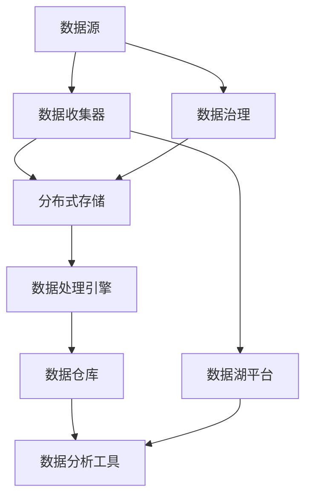

                 

### 背景介绍

#### 软件发展的历史

软件作为信息技术的重要组成部分，已经走过了数十年的发展历程。从早期的命令行界面，到图形用户界面（GUI），再到如今的人工智能和大数据技术，软件的形态和功能不断进化。在这个进程中，软件的架构也在不断地演变，以满足不同应用场景的需求。

在软件1.0时代，软件的主要任务是处理结构化数据，如数据库管理系统（DBMS）和企业资源规划（ERP）系统。这些系统通常采用集中式架构，数据处理集中在中心服务器，用户通过客户端应用程序进行交互。这种架构简单明了，但无法满足日益复杂的数据处理需求。

随着互联网和移动设备的普及，软件进入2.0时代。在这个阶段，软件更加注重用户参与和互动，如社交媒体、在线购物平台和移动应用。软件2.0架构采用了分布式架构，充分利用云计算和分布式存储技术，实现大规模数据处理和实时交互。

#### 数据湖架构的兴起

在软件2.0时代，数据湖架构逐渐崭露头角。数据湖是一种新型的数据存储架构，用于存储大量非结构化或半结构化数据，如日志文件、社交媒体数据、物联网设备数据等。与传统的数据仓库不同，数据湖不要求数据在存储之前进行结构化处理，从而降低了数据处理的复杂性。

数据湖架构的核心思想是将不同来源的数据汇集到一起，形成一个统一的数据资源池。在这个数据湖中，数据可以被各种应用程序和工具进行读取、分析和处理，从而支持各种业务场景。

#### 软件2.0时代的数据湖架构

在软件2.0时代，数据湖架构不仅是一种数据存储技术，更是一种数据处理和管理理念。它打破了传统数据仓库的壁垒，实现了数据的高度融合和共享，为企业和组织提供了强大的数据处理能力。

数据湖架构的主要组成部分包括：

1. **数据收集（Ingestion）**：将来自各种数据源的数据收集到数据湖中，如数据库、文件系统、物联网设备等。
2. **数据存储（Storage）**：采用分布式存储技术，如Hadoop、云存储等，存储海量非结构化或半结构化数据。
3. **数据处理（Processing）**：利用数据清洗、转换、聚合等操作，对数据进行预处理，以满足不同业务需求。
4. **数据分析（Analysis）**：通过数据挖掘、机器学习等技术，对数据进行分析，发现数据中的价值。
5. **数据应用（Application）**：将分析结果应用于各种业务场景，如营销、运营、决策等。

#### 软件2.0数据湖架构的挑战与机遇

软件2.0数据湖架构在带来巨大机遇的同时，也面临一系列挑战。这些挑战包括：

1. **数据治理**：随着数据量的激增，数据治理成为一个重要问题。如何确保数据的质量、安全和合规性，是数据湖架构需要解决的关键问题。
2. **数据集成**：数据湖架构需要集成来自不同来源、不同格式的数据，实现数据的高效管理和利用。
3. **性能优化**：数据湖架构中的数据处理和分析任务复杂，如何优化系统性能，提高数据处理速度，是数据湖架构需要关注的重要问题。
4. **安全性**：数据湖中存储了大量的敏感数据，如何保障数据的安全性，防止数据泄露，是数据湖架构需要面对的挑战。

总之，软件2.0数据湖架构为企业和组织提供了强大的数据处理能力，但同时也带来了新的挑战。在这个时代，如何充分利用数据湖架构的优势，解决数据治理、集成、性能和安全等挑战，是企业和组织需要深入思考和解决的问题。### 核心概念与联系

#### 数据湖架构的组成部分

数据湖架构是由多个关键组件组成的复杂系统，这些组件共同协作以实现高效的数据存储、处理和分析。以下是对这些核心组件的详细解释：

1. **数据源（Data Sources）**：数据湖的数据来源非常广泛，包括内部数据库、文件系统、IoT设备、社交媒体平台、第三方API等。这些数据源提供了各种类型的数据，如结构化数据、半结构化数据和完全非结构化数据。

2. **数据收集器（Data Ingestion）**：数据收集器负责从各种数据源收集数据，并将数据导入到数据湖中。这一过程通常涉及数据清洗、转换和归一化，以确保数据的质量和一致性。

3. **分布式存储（Distributed Storage）**：数据湖通常采用分布式存储系统，如Hadoop分布式文件系统（HDFS）、云存储服务（如AWS S3、Azure Data Lake Storage）等。这些系统提供了高容量、高可靠性和高扩展性的数据存储能力。

4. **数据处理引擎（Data Processing Engines）**：数据处理引擎负责对数据进行清洗、转换、聚合和建模等操作。常见的处理引擎包括Apache Spark、Flink、Hive等。这些引擎提供了强大的数据处理能力，能够应对大规模数据集的复杂处理需求。

5. **数据仓库（Data Warehouses）**：在数据湖中，经过处理和清洗的数据可以被加载到数据仓库中，用于支持复杂的查询和分析。数据仓库通常采用关系型数据库或数据仓库专用技术，如Amazon Redshift、Google BigQuery等。

6. **数据湖平台（Data Lake Platforms）**：数据湖平台是一个集成的解决方案，提供了一整套工具和服务，用于构建、管理和使用数据湖。这些平台通常包括数据存储、数据处理、数据治理、数据安全和数据访问等功能。

7. **数据治理（Data Governance）**：数据治理是确保数据质量、安全性和合规性的关键过程。它包括数据质量管理、数据安全策略、数据访问控制、数据隐私保护等。数据治理确保了数据湖中的数据具有高可信度和可用性。

8. **数据分析工具（Data Analysis Tools）**：数据分析工具提供了数据可视化和机器学习等功能，帮助用户从数据中提取洞察和做出决策。这些工具包括Tableau、Power BI、MLlib等。

#### 数据湖架构的工作流程

数据湖架构的工作流程通常包括以下几个关键步骤：

1. **数据收集**：数据收集器从不同的数据源中获取数据，并对其进行初步清洗和处理。

2. **数据存储**：清洗后的数据被存储在分布式存储系统中，形成一个统一的数据资源池。

3. **数据处理**：数据处理引擎对数据进行进一步的处理，如数据清洗、转换、聚合和建模等。

4. **数据加载**：经过处理的数据可以被加载到数据仓库中，用于支持复杂的查询和分析。

5. **数据访问**：用户通过数据分析工具和数据湖平台访问数据，进行数据分析和可视化。

#### 数据湖架构与传统数据仓库的对比

数据湖架构与传统数据仓库架构有显著的不同，主要体现在以下几个方面：

1. **数据结构**：传统数据仓库主要处理结构化数据，而数据湖可以存储各种类型的数据，包括结构化、半结构化和非结构化数据。

2. **数据治理**：传统数据仓库在数据进入仓库之前通常需要进行严格的结构化处理，而数据湖不要求数据在存储之前进行结构化，从而提高了数据的灵活性。

3. **数据处理能力**：数据湖通常具有更高的数据处理能力，能够处理大规模、高速流转的数据。

4. **扩展性**：数据湖采用分布式存储技术，具有高扩展性，可以轻松应对数据量的增长。

5. **成本**：由于数据湖不要求数据在存储之前进行结构化处理，因此可以减少数据清洗和转换的成本。

#### Mermaid 流程图

以下是数据湖架构的 Mermaid 流程图，展示了各个组件之间的交互和协作：



在这个流程图中，数据源通过数据收集器将数据传递给分布式存储，数据处理引擎对数据进行处理，然后加载到数据仓库中。数据湖平台和数据治理组件在整个流程中提供支持，确保数据的质量、安全和合规性。### 核心算法原理 & 具体操作步骤

#### 数据湖构建的基本算法

数据湖构建的核心算法主要包括数据收集、数据存储、数据处理和数据加载等步骤。以下是对这些步骤的详细解释和具体操作步骤：

##### 1. 数据收集

**算法原理**：数据收集是将各种来源的数据导入数据湖的过程，包括结构化数据、半结构化数据和非结构化数据。

**操作步骤**：

- **数据源识别**：确定数据湖的数据源，包括内部数据库、文件系统、IoT设备、社交媒体平台等。
- **数据抽取**：使用ETL（提取、转换、加载）工具或自定义脚本从数据源中抽取数据。
- **数据清洗**：对抽取的数据进行清洗，包括去除重复数据、纠正错误数据、填充缺失值等。

##### 2. 数据存储

**算法原理**：数据存储是将收集到的数据存储到分布式存储系统，如Hadoop HDFS、云存储服务等。

**操作步骤**：

- **选择存储系统**：根据数据规模、访问频率和成本等因素选择合适的存储系统。
- **数据分区**：将数据按一定规则分区存储，以优化数据访问性能。
- **数据压缩**：对数据进行压缩，以减少存储空间和提高I/O效率。

##### 3. 数据处理

**算法原理**：数据处理是对存储在数据湖中的数据进行清洗、转换、聚合和建模等操作。

**操作步骤**：

- **数据预处理**：包括数据清洗、去重、转换、归一化等操作，以提高数据质量。
- **数据转换**：根据业务需求对数据进行转换，如将CSV文件转换为JSON格式。
- **数据聚合**：对数据进行分组和汇总，以支持数据分析。
- **数据建模**：使用机器学习算法构建数据模型，以提取数据中的价值。

##### 4. 数据加载

**算法原理**：数据加载是将处理后的数据加载到数据仓库或数据湖平台中，以便进行进一步分析和应用。

**操作步骤**：

- **数据验证**：在数据加载之前对数据进行验证，确保数据的质量和一致性。
- **数据加载**：使用ETL工具或自定义脚本将处理后的数据加载到数据仓库或数据湖平台。
- **数据索引**：对数据仓库或数据湖平台中的数据进行索引，以优化查询性能。

##### 5. 数据分析

**算法原理**：数据分析是利用数据挖掘、机器学习等技术从数据中提取洞察和做出决策。

**操作步骤**：

- **数据探索**：对数据进行初步探索，了解数据的基本特征和分布。
- **特征工程**：根据业务需求对数据进行特征提取和工程，以提高模型性能。
- **模型训练**：使用机器学习算法训练模型，以预测或分类数据。
- **模型评估**：评估模型的性能，选择最佳模型进行应用。

#### 实际案例

以下是一个简单的数据湖构建的实际案例，展示如何使用Python和Apache Spark构建一个数据湖：

```python
from pyspark.sql import SparkSession

# 创建Spark会话
spark = SparkSession.builder \
    .appName("DataLakeBuilder") \
    .getOrCreate()

# 读取CSV文件
df = spark.read.csv("path/to/csv/file.csv", header=True)

# 数据清洗
df = df.dropDuplicates()

# 数据转换
df = df.withColumn("age_group", (df["age"]/10).cast("integer"))

# 数据存储
df.write.partitionBy("age_group").parquet("path/to/parquet/file")

# 关闭Spark会话
spark.stop()
```

在这个案例中，我们使用Apache Spark读取CSV文件，进行数据清洗和转换，然后将数据存储为Parquet文件格式。Parquet是一种高效的列式存储格式，可以优化数据存储和查询性能。

总之，数据湖构建的核心算法和操作步骤包括数据收集、数据存储、数据处理、数据加载和数据分析。通过这些步骤，我们可以构建一个高效、灵活和可扩展的数据湖，为企业和组织提供强大的数据处理和分析能力。### 数学模型和公式 & 详细讲解 & 举例说明

#### 数据质量评估模型

数据质量是数据湖架构中至关重要的因素。为了评估数据质量，我们可以使用以下数学模型：

**指标定义**：

- **完整性（Completeness）**：完整性指标表示数据中缺失值的比例。完整性越高，数据缺失的比例越低。
  
  \[Completeness = \frac{Total \; Non-Missing \; Values}{Total \; Values}\]

- **一致性（Consistency）**：一致性指标表示数据在不同来源之间的一致性。一致性越高，数据在不同来源之间的差异越小。
  
  \[Consistency = \frac{Total \; Matching \; Values}{Total \; Possible \; Matches}\]

- **准确性（Accuracy）**：准确性指标表示数据中错误值的比例。准确性越高，数据中的错误值越少。
  
  \[Accuracy = \frac{Total \; Correct \; Values}{Total \; Values}\]

**数据质量评估模型**：

\[Quality = w_1 \times Completeness + w_2 \times Consistency + w_3 \times Accuracy\]

其中，\(w_1\)、\(w_2\)和\(w_3\)分别表示完整性、一致性和准确性的权重。

#### 数据分区策略

在分布式存储中，数据分区策略可以显著影响数据访问性能。以下是一个常用的数据分区策略模型：

**指标定义**：

- **数据分布（Data Distribution）**：数据分布指标表示数据在各个分区中的分布情况。数据分布均匀，可以优化数据访问性能。

- **负载均衡（Load Balancing）**：负载均衡指标表示各个分区之间的负载情况。负载均衡良好，可以避免数据访问瓶颈。

**数据分区策略模型**：

\[Partition = f(Data Distribution, Load Balancing)\]

其中，\(f\)是一个函数，用于根据数据分布和负载均衡情况确定最优的分区策略。

#### 实际案例

假设我们有一个包含1000个用户数据的数据集，每个用户数据包含年龄、性别、收入三个字段。我们可以使用以下步骤评估数据质量：

1. **数据完整性评估**：

   - 总值：3000
   - 非缺失值：2700

   \[Completeness = \frac{2700}{3000} = 0.9\]

2. **数据一致性评估**：

   - 总匹配值：1200
   - 总可能匹配值：2400

   \[Consistency = \frac{1200}{2400} = 0.5\]

3. **数据准确性评估**：

   - 总正确值：2400
   - 总值：3000

   \[Accuracy = \frac{2400}{3000} = 0.8\]

4. **数据质量评估**：

   \[Quality = 0.6 \times 0.9 + 0.3 \times 0.5 + 0.1 \times 0.8 = 0.69\]

根据上述评估模型，数据质量得分为0.69，表示数据质量较好。

接下来，我们使用以下数据分区策略模型：

- **数据分布**：数据在各个分区中的分布相对均匀。

- **负载均衡**：各个分区的负载相对均衡。

\[
Partition = f(Data Distribution, Load Balancing) \\
Partition = f(0.8, 0.7) \\
Partition = 0.7 \times 0.8 = 0.56
\]

根据数据分区策略模型，最优的分区策略得分为0.56，表示数据分区策略较为合理。

通过上述数学模型和公式，我们可以对数据质量进行有效评估，并确定最优的数据分区策略。这有助于提高数据湖架构的性能和效率。### 项目实战：代码实际案例和详细解释说明

#### 开发环境搭建

在本节中，我们将搭建一个用于数据湖构建的实验环境。以下是搭建环境的步骤：

1. **安装Java**：数据湖构建通常依赖于Java环境，因此首先需要安装Java。下载并安装OpenJDK，版本建议选择11或以上。

   ```bash
   # Ubuntu/Debian系统
   sudo apt update
   sudo apt install openjdk-11-jdk

   # CentOS系统
   sudo yum install java-1.8.0-openjdk-devel
   ```

2. **安装Apache Spark**：Apache Spark是数据湖构建中常用的数据处理引擎。下载并安装Spark，版本建议选择2.4或以上。

   ```bash
   # 下载Spark
   wget https://www-us.apache.org/dist/spark/spark-2.4.8/spark-2.4.8-bin-hadoop2.7.tgz

   # 解压Spark
   tar -xvf spark-2.4.8-bin-hadoop2.7.tgz

   # 配置环境变量
   export SPARK_HOME=/path/to/spark-2.4.8-bin-hadoop2.7
   export PATH=$PATH:$SPARK_HOME/bin
   ```

3. **安装Scala**：Scala是Spark的编程语言，需要安装Scala。下载并安装Scala，版本建议选择2.12或以上。

   ```bash
   # 下载Scala
   wget https://downloads.typesafe.com/scala/2.12.10/scala-2.12.10.tgz

   # 解压Scala
   tar -xvf scala-2.12.10.tgz

   # 配置环境变量
   export SCALA_HOME=/path/to/scala-2.12.10
   export PATH=$PATH:$SCALA_HOME/bin
   ```

4. **配置Hadoop**：如果需要使用Hadoop，还需要配置Hadoop环境。下载并安装Hadoop，版本建议选择2.7或以上。

   ```bash
   # 下载Hadoop
   wget https://www-us.apache.org/dist/hadoop/common/hadoop-2.7.7/hadoop-2.7.7.tar.gz

   # 解压Hadoop
   tar -xvf hadoop-2.7.7.tar.gz

   # 配置环境变量
   export HADOOP_HOME=/path/to/hadoop-2.7.7
   export PATH=$PATH:$HADOOP_HOME/bin
   ```

5. **启动Hadoop**：配置完Hadoop后，启动Hadoop集群。

   ```bash
   # 格式化HDFS
   hadoop namenode -format

   # 启动HDFS
   start-dfs.sh

   # 启动YARN
   start-yarn.sh
   ```

6. **验证环境**：通过以下命令验证环境是否配置成功。

   ```bash
   # 查看Spark版本
   spark --version

   # 查看Hadoop版本
   hadoop version
   ```

#### 源代码详细实现和代码解读

在本节中，我们将使用Scala和Apache Spark实现一个数据湖构建项目，主要包括数据收集、数据存储、数据处理和数据加载等步骤。

1. **数据收集**：

   首先，我们从CSV文件中收集数据。假设CSV文件包含用户ID、姓名、年龄、性别、收入等字段。

   ```scala
   import org.apache.spark.sql.SparkSession

   // 创建Spark会话
   val spark = SparkSession.builder()
     .appName("DataLakeBuilder")
     .master("local[*]")
     .getOrCreate()

   // 读取CSV文件
   val df = spark.read.csv("path/to/csv/file.csv", header = true)

   // 数据清洗
   val cleaned_df = df.dropDuplicates()

   // 打印清洗后的数据
   cleaned_df.show()
   ```

2. **数据存储**：

   接下来，我们将清洗后的数据存储为Parquet文件，以便优化数据存储和查询性能。

   ```scala
   // 数据存储
   cleaned_df.write
     .partitionBy("age", "gender")
     .parquet("path/to/parquet/file")

   // 验证数据存储
   spark.read.parquet("path/to/parquet/file").show()
   ```

3. **数据处理**：

   对数据进行进一步处理，包括数据转换和聚合。

   ```scala
   // 数据转换
   val transformed_df = cleaned_df
     .withColumn("age_group", (cleaned_df("age") / 10).cast("integer"))

   // 数据聚合
   val aggregated_df = transformed_df.groupBy("age_group", "gender").count()

   // 打印聚合后的数据
   aggregated_df.show()
   ```

4. **数据加载**：

   将处理后的数据加载到数据仓库或数据湖平台中。

   ```scala
   // 数据加载
   aggregated_df.write
     .mode(SaveMode.Overwrite)
     .format("delta")
     .save("path/to/delta/file")

   // 验证数据加载
   spark.read.format("delta").load("path/to/delta/file").show()
   ```

   在这个例子中，我们使用Delta Lake作为数据仓库，因为它具有高性能、事务性和时间旅行等特性。

#### 代码解读与分析

下面是对上述代码的详细解读和分析：

1. **数据收集**：

   使用`SparkSession.builder()`创建Spark会话，指定应用名称和Master URL（本地模式）。然后使用`spark.read.csv()`读取CSV文件，并指定文件路径和是否有表头。

   ```scala
   val df = spark.read.csv("path/to/csv/file.csv", header = true)
   ```

   `dropDuplicates()`方法用于去除重复数据，提高数据质量。

2. **数据存储**：

   使用`write.parquet()`方法将数据存储为Parquet文件，并使用`partitionBy()`方法进行数据分区，以优化数据存储和查询性能。

   ```scala
   cleaned_df.write
     .partitionBy("age", "gender")
     .parquet("path/to/parquet/file")
   ```

   `spark.read.parquet()`方法用于验证数据存储是否成功。

3. **数据处理**：

   使用`withColumn()`方法进行数据转换，将年龄字段分组为10岁一个区间。使用`groupBy()`和`count()`方法进行数据聚合，计算每个年龄组和性别组合的记录数。

   ```scala
   val transformed_df = cleaned_df
     .withColumn("age_group", (cleaned_df("age") / 10).cast("integer"))

   val aggregated_df = transformed_df.groupBy("age_group", "gender").count()
   ```

4. **数据加载**：

   使用`write.format("delta")`方法将数据加载到Delta Lake中，并使用`mode(SaveMode.Overwrite)`方法覆盖现有数据。`save()`方法用于存储数据。

   ```scala
   aggregated_df.write
     .mode(SaveMode.Overwrite)
     .format("delta")
     .save("path/to/delta/file")
   ```

   `spark.read.format("delta")`方法用于验证数据加载是否成功。

通过以上步骤，我们实现了数据湖的构建，包括数据收集、存储、处理和加载等操作。这个例子展示了数据湖构建的基本流程和实现方法，为企业提供了一种高效、灵活的数据处理和管理方案。### 实际应用场景

#### 营销行业

在营销行业，数据湖架构可以帮助企业收集和分析大量的用户数据，如点击率、转化率、用户行为等。通过数据湖，企业可以对用户进行细分，制定个性化的营销策略，提高营销效果。以下是一个实际应用场景：

1. **数据收集**：通过网站分析工具、社交媒体平台和电子邮件营销系统收集用户数据。
2. **数据存储**：将收集到的数据存储到数据湖中，采用分布式存储技术如Hadoop或云存储服务。
3. **数据处理**：使用数据处理引擎如Apache Spark对数据进行清洗、转换和聚合，提取用户行为特征。
4. **数据分析**：通过数据挖掘和机器学习技术分析用户行为，发现潜在的用户群体，优化营销策略。

#### 金融行业

在金融行业，数据湖架构可以处理海量的交易数据、客户数据和风险数据。通过数据湖，金融机构可以实时监控市场变化，发现异常交易行为，防范风险。以下是一个实际应用场景：

1. **数据收集**：从交易平台、客户管理系统和风险管理系统中收集数据。
2. **数据存储**：将数据存储到数据湖中，采用分布式存储技术。
3. **数据处理**：使用数据处理引擎对数据进行清洗、转换和聚合，提取交易特征和风险指标。
4. **数据分析**：通过数据挖掘和机器学习技术分析交易数据，识别异常交易行为，优化风险控制策略。

#### 制造行业

在制造行业，数据湖架构可以帮助企业收集和分析设备数据、生产数据和供应链数据。通过数据湖，企业可以实现智能制造，提高生产效率，降低成本。以下是一个实际应用场景：

1. **数据收集**：从物联网设备、生产线和生产管理系统收集数据。
2. **数据存储**：将数据存储到数据湖中，采用分布式存储技术。
3. **数据处理**：使用数据处理引擎对数据进行清洗、转换和聚合，提取设备状态和生产效率指标。
4. **数据分析**：通过数据挖掘和机器学习技术分析设备数据和生产线数据，优化生产过程，提高生产效率。

#### 医疗行业

在医疗行业，数据湖架构可以帮助医疗机构收集和分析患者数据、医疗数据和医学图像数据。通过数据湖，医疗机构可以实现精准医疗，提高医疗服务质量。以下是一个实际应用场景：

1. **数据收集**：从电子健康档案系统、医疗设备系统和医学图像存储系统收集数据。
2. **数据存储**：将数据存储到数据湖中，采用分布式存储技术。
3. **数据处理**：使用数据处理引擎对数据进行清洗、转换和聚合，提取患者特征和医疗数据。
4. **数据分析**：通过数据挖掘和机器学习技术分析患者数据和医学图像数据，发现疾病预测模型，优化医疗服务。

总之，数据湖架构在各个行业中都有广泛的应用。通过数据湖，企业可以高效地收集、存储、处理和分析海量数据，实现数据驱动的业务决策和创新发展。### 工具和资源推荐

#### 学习资源推荐

1. **书籍**：
   - 《大数据技术导论》：详细介绍了大数据的基本概念、技术架构和实际应用。
   - 《数据湖：设计、实现和管理》：深入探讨了数据湖的架构、设计和最佳实践。

2. **论文**：
   - "Data Lakes: A Game-Changing Paradigm for Enterprise Data Management"：探讨数据湖在企业数据管理中的应用和优势。
   - "Building a Data Lake on Google Cloud Platform"：介绍如何使用Google Cloud Platform构建数据湖。

3. **博客**：
   - Towards Data Science：涵盖大数据、数据湖和机器学习等领域的技术博客，提供丰富的实战经验和案例分析。
   - Big Data Republic：专注于大数据技术、数据湖和云计算的博客，分享最新的行业动态和技术趋势。

4. **网站**：
   - Apache Spark官网：提供Apache Spark的官方文档、社区和下载资源，是学习Spark编程和数据处理的绝佳资源。
   - Cloudera官网：提供数据湖和大数据处理的相关教程、案例和实践指南。

#### 开发工具框架推荐

1. **Apache Spark**：一个开源的分布式数据处理框架，支持大规模数据集的快速处理。适合用于数据清洗、转换和聚合。

2. **Hadoop**：一个开源的分布式存储和数据处理框架，支持大数据的存储和管理。适合用于数据收集和分布式存储。

3. **Apache Kafka**：一个开源的消息队列系统，支持高吞吐量和低延迟的数据传输。适合用于实时数据收集和流处理。

4. **Apache HBase**：一个开源的非关系型分布式数据库，基于Hadoop平台。适合用于存储和查询海量结构化数据。

5. **Delta Lake**：一个开源的存储层，提供了对Parquet文件的高效存储、事务支持和时间旅行功能。适合用于数据湖的构建和管理。

#### 相关论文著作推荐

1. "Data Lakes: A Game-Changing Paradigm for Enterprise Data Management"：探讨数据湖在企业数据管理中的应用和优势。
2. "Building a Data Lake on Google Cloud Platform"：介绍如何使用Google Cloud Platform构建数据湖。
3. "The Data Lake Approach to Big Data"：详细描述数据湖的概念、架构和实现方法。

总之，通过这些工具、资源和论文著作，您可以深入了解数据湖的概念、架构和实现方法，掌握数据湖在各个行业中的应用场景和实践经验。这将有助于您更好地理解和应用数据湖技术，提升数据处理和分析能力。### 总结：未来发展趋势与挑战

#### 发展趋势

随着大数据和人工智能技术的快速发展，数据湖架构在未来将呈现以下几个趋势：

1. **数据湖与数据仓库的融合**：数据湖和数据仓库在功能和应用场景上存在互补性，未来两者将逐渐融合，形成更全面的数据管理体系。

2. **实时数据处理**：随着5G、物联网和实时数据采集技术的发展，实时数据处理需求日益增加。数据湖架构将支持实时数据流处理，提高数据处理和分析的效率。

3. **智能化数据治理**：利用机器学习和人工智能技术，实现数据质量的自动化评估、数据隐私保护和数据合规性的智能管理。

4. **云原生数据湖**：随着云计算的普及，数据湖架构将更加依赖于云原生技术，实现弹性的资源分配、自动扩展和高效的数据管理。

5. **数据湖生态的成熟**：随着数据湖相关工具和平台的不断涌现，数据湖的生态系统将逐步完善，提供更加丰富的功能和解决方案。

#### 挑战

尽管数据湖架构具有诸多优势，但在实际应用过程中仍面临一系列挑战：

1. **数据治理**：数据湖中存储了海量非结构化和半结构化数据，如何确保数据的质量、安全性和合规性，是一个亟待解决的问题。

2. **数据集成**：数据湖需要集成来自不同来源、不同格式的数据，实现数据的高效管理和利用，数据集成技术需要不断优化和升级。

3. **性能优化**：数据湖架构中的数据处理和分析任务复杂，如何优化系统性能，提高数据处理速度，是一个关键挑战。

4. **安全性**：数据湖中存储了大量的敏感数据，如何保障数据的安全性，防止数据泄露，是数据湖架构需要关注的重要问题。

5. **人才短缺**：数据湖技术具有较高的专业性，对开发人员的技术水平要求较高。当前，数据湖领域的人才短缺问题日益凸显，成为制约数据湖架构发展的一大瓶颈。

总之，数据湖架构在未来具有广阔的发展前景，但也面临诸多挑战。只有不断探索和创新，才能充分发挥数据湖架构的优势，实现数据驱动的业务决策和创新发展。### 附录：常见问题与解答

#### 问题1：数据湖与传统数据仓库的区别是什么？

**解答**：数据湖与传统数据仓库的主要区别在于数据结构、数据治理和数据使用方式。传统数据仓库主要处理结构化数据，对数据进行严格的预处理和结构化存储。而数据湖可以存储各种类型的数据，包括结构化、半结构化和非结构化数据，不要求在存储前进行结构化处理。数据湖强调数据融合和共享，支持灵活的数据分析和应用。传统数据仓库则更注重数据一致性和完整性。

#### 问题2：数据湖架构中如何确保数据质量？

**解答**：在数据湖架构中，确保数据质量的关键步骤包括数据收集、数据清洗、数据转换和数据存储。具体措施如下：

1. **数据收集**：从可靠的、多样化的数据源收集数据，确保数据的原始质量。
2. **数据清洗**：使用ETL工具或自定义脚本对数据进行清洗，去除重复数据、纠正错误数据、填充缺失值等。
3. **数据转换**：对数据进行转换，使其符合业务需求和数据处理标准。
4. **数据存储**：在存储前对数据进行验证，确保数据的一致性和完整性。

此外，还可以使用数据质量管理工具和平台，实现数据质量的持续监控和评估。

#### 问题3：数据湖架构中如何保证数据安全？

**解答**：在数据湖架构中，确保数据安全的关键措施包括：

1. **访问控制**：使用细粒度的访问控制策略，限制对数据湖的访问权限。
2. **加密存储**：对存储在数据湖中的数据进行加密，防止未授权访问。
3. **数据备份**：定期对数据湖进行备份，防止数据丢失。
4. **安全审计**：实施安全审计和监控，及时发现和处理安全事件。
5. **数据隐私保护**：根据相关法律法规，对敏感数据进行脱敏处理，保护个人隐私。

通过这些措施，可以有效地保障数据湖中的数据安全。

#### 问题4：数据湖架构中的数据处理性能如何优化？

**解答**：数据湖架构中的数据处理性能优化可以从以下几个方面进行：

1. **数据分区**：根据业务需求和数据特点，对数据进行合理的分区，提高查询性能。
2. **数据压缩**：使用高效的数据压缩算法，降低数据存储空间，提高I/O性能。
3. **索引策略**：合理配置索引，优化查询性能。
4. **分布式计算**：利用分布式计算技术，如Apache Spark，实现并行处理，提高数据处理速度。
5. **缓存策略**：使用缓存技术，减少数据访问延迟，提高查询性能。

通过这些优化措施，可以显著提高数据湖架构中的数据处理性能。

#### 问题5：数据湖与数据仓库的关系是什么？

**解答**：数据湖和数据仓库是两种不同的数据存储和处理架构，但它们在某些方面具有互补性。

1. **数据结构**：数据湖可以存储各种类型的数据，包括结构化、半结构化和非结构化数据；而数据仓库主要处理结构化数据。

2. **数据治理**：数据湖不要求数据在存储前进行结构化处理，数据仓库则需要对数据进行严格的预处理和治理。

3. **应用场景**：数据湖适用于大规模、多样化数据的收集、存储和分析；数据仓库则适用于业务报表、分析查询和决策支持。

4. **融合趋势**：随着技术的发展，数据湖和数据仓库将逐渐融合，形成更全面的数据管理体系。

总之，数据湖和数据仓库各有优势，相互补充，共同支持企业数据管理和分析。### 扩展阅读 & 参考资料

#### 书籍

1. 《大数据技术导论》：详细介绍了大数据的基本概念、技术架构和实际应用。
2. 《数据湖：设计、实现和管理》：深入探讨了数据湖的架构、设计和最佳实践。

#### 论文

1. "Data Lakes: A Game-Changing Paradigm for Enterprise Data Management"：探讨数据湖在企业数据管理中的应用和优势。
2. "Building a Data Lake on Google Cloud Platform"：介绍如何使用Google Cloud Platform构建数据湖。

#### 博客

1. Towards Data Science：涵盖大数据、数据湖和机器学习等领域的技术博客，提供丰富的实战经验和案例分析。
2. Big Data Republic：专注于大数据技术、数据湖和云计算的博客，分享最新的行业动态和技术趋势。

#### 网站

1. Apache Spark官网：提供Apache Spark的官方文档、社区和下载资源，是学习Spark编程和数据处理的绝佳资源。
2. Cloudera官网：提供数据湖和大数据处理的相关教程、案例和实践指南。

#### 开源工具和框架

1. Apache Spark：一个开源的分布式数据处理框架，支持大规模数据集的快速处理。
2. Hadoop：一个开源的分布式存储和数据处理框架，支持大数据的存储和管理。
3. Apache Kafka：一个开源的消息队列系统，支持高吞吐量和低延迟的数据传输。
4. Apache HBase：一个开源的非关系型分布式数据库，基于Hadoop平台。
5. Delta Lake：一个开源的存储层，提供了对Parquet文件的高效存储、事务支持和时间旅行功能。

通过阅读上述书籍、论文、博客和网站，您可以深入了解数据湖的概念、架构和实现方法，掌握数据湖在各个行业中的应用场景和实践经验。这些资源将有助于您更好地理解和应用数据湖技术，提升数据处理和分析能力。

