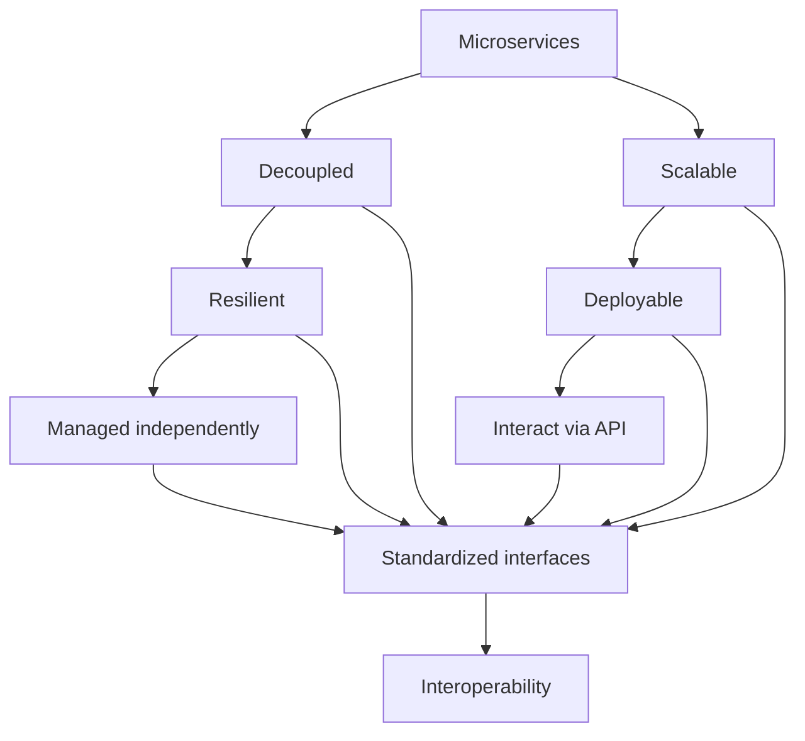

                 

### 背景介绍

在当今的数字化时代，软件无处不在，成为社会运作的重要支柱。然而，随着软件系统变得越来越复杂，软件的标准化与互操作性成为了一个亟待解决的重要问题。软件2.0的标准化与互操作性不仅仅是为了提高开发效率，更是为了确保软件系统能够在不同的平台、架构和编程语言之间无缝协作。

首先，我们需要明确什么是软件2.0。软件2.0通常指的是云原生（Cloud Native）应用，它们具有高度的可扩展性、弹性、自动化和微服务架构。这些特点使得软件2.0能够在不同的环境中快速部署和扩展，提高了系统的可靠性和灵活性。

那么，什么是标准化？在软件领域，标准化指的是通过制定一系列的标准，确保软件系统能够在不同的环境和平台上无缝协作。标准化的好处在于，它可以减少软件开发的复杂性，提高系统的互操作性，降低维护成本。

互操作性则是指软件系统能够在不同的平台、架构和编程语言之间无缝通信和协作。在软件2.0时代，互操作性尤为重要，因为云原生应用往往需要在不同的云平台和分布式系统中运行。

接下来，我们将探讨软件2.0的标准化与互操作性的重要性，如何实现标准化和互操作性，以及它们在实际应用中的挑战和解决方案。

**Keywords:** 软件标准化，互操作性，软件2.0，云原生应用，微服务架构，编程语言，分布式系统。

**Abstract:**
本文将深入探讨软件2.0的标准化与互操作性的重要性。首先，我们定义了软件2.0及其核心特点，接着详细解释了标准化的概念和互操作性的意义。随后，文章将分析在实现软件2.0的标准化与互操作性过程中面临的关键挑战，并探讨解决这些挑战的潜在方法。通过这一过程，读者将了解如何通过标准化和互操作性提高软件系统的可靠性和灵活性，为未来的软件开发提供指导。

---

## 1. 背景介绍

在当今的数字化时代，软件无处不在，成为社会运作的重要支柱。然而，随着软件系统变得越来越复杂，软件的标准化与互操作性成为了一个亟待解决的重要问题。软件2.0的标准化与互操作性不仅仅是为了提高开发效率，更是为了确保软件系统能够在不同的平台、架构和编程语言之间无缝协作。

### 1.1 软件发展的历程

软件的发展经历了多个阶段。最早的软件形式是单机软件，它们在单一计算机上运行，功能相对简单。随着互联网的兴起，软件逐渐转向分布式系统，例如Web应用程序和客户端-服务器架构。这些软件系统通过互联网进行通信，实现了更复杂的业务逻辑和功能。

然而，随着云计算和物联网的兴起，软件系统变得更加复杂和分布式。云原生应用（Cloud Native Applications）应运而生，它们基于微服务架构，能够在不同的云平台和分布式系统中运行，具有高度的可扩展性和弹性。这些特点使得软件2.0成为当今软件开发的主流趋势。

### 1.2 标准化的概念

在软件领域，标准化指的是通过制定一系列的标准，确保软件系统能够在不同的环境和平台上无缝协作。这些标准可以包括编程语言的语法和语义、数据交换格式、接口规范等。标准化的好处在于，它可以减少软件开发的复杂性，提高系统的互操作性，降低维护成本。

例如，在Web开发中，HTML、CSS和JavaScript等标准化的编程语言和工具，使得开发者可以在不同的浏览器和操作系统上开发出兼容的网页。类似的，在分布式系统中，REST和SOAP等标准化接口，使得不同的软件系统可以方便地通过HTTP进行通信。

### 1.3 互操作性的概念

互操作性是指软件系统能够在不同的平台、架构和编程语言之间无缝通信和协作。在软件2.0时代，互操作性尤为重要，因为云原生应用往往需要在不同的云平台和分布式系统中运行。

例如，一个云原生应用可能需要在多个云平台上部署和运行，如AWS、Azure和Google Cloud。为了实现这些平台的互操作性，必须采用标准化的编程语言和接口，如Kubernetes和Docker。这些标准化的工具和平台使得开发者可以轻松地在不同的云平台上部署和管理应用程序。

### 1.4 软件2.0的特点

软件2.0，也称为云原生应用，具有以下核心特点：

- **微服务架构**：软件2.0通常采用微服务架构，将应用程序划分为多个独立的服务，每个服务负责特定的功能。这种架构使得系统更加灵活和可扩展，同时降低了维护和部署的复杂性。

- **容器化**：容器化是软件2.0的重要技术之一，它通过Docker等容器技术，将应用程序及其运行环境打包成一个独立的容器。这使得应用程序可以在不同的操作系统和硬件上无缝运行，提高了系统的可移植性。

- **自动化**：软件2.0通过自动化工具和平台，如Kubernetes和CI/CD流水线，实现了自动化部署、扩展和管理。这些自动化工具提高了开发效率，减少了人工干预，降低了错误率。

- **弹性**：软件2.0具有高弹性，能够在负载增加时自动扩展，在负载减少时自动收缩。这种弹性使得系统能够更好地应对突发流量和需求变化，提高了系统的可用性和可靠性。

综上所述，软件2.0的标准化与互操作性对于提高开发效率、确保系统可靠性和灵活性具有重要意义。在接下来的部分，我们将进一步探讨软件2.0的标准化与互操作性的实现方法和实际应用场景。

---

## 2. 核心概念与联系

在深入探讨软件2.0的标准化与互操作性之前，我们需要明确几个核心概念及其相互关系。这些概念包括微服务架构、容器化技术、自动化工具、以及标准化接口等。以下是这些核心概念及其关系的详细解释。

### 2.1 微服务架构

微服务架构是一种将应用程序拆分为多个独立、可复用服务的方法。每个服务都负责特定的业务功能，并独立部署、扩展和管理。微服务架构的核心优势在于其灵活性和可扩展性。通过将应用程序划分为多个服务，开发者可以更加专注于每个服务的具体功能，从而提高开发效率和维护性。

**Mermaid 流程图：**



在上述流程图中，微服务（A）通过其解耦（B）和可扩展性（C）特性，使得系统具备弹性和容错能力（D）。每个服务可以独立部署和管理（F），并通过标准化接口（H）与其他服务进行交互（G），从而实现互操作性（I）。

### 2.2 容器化技术

容器化技术，如Docker，通过将应用程序及其运行环境打包成一个独立的容器，实现了应用程序的轻量级、可移植性和隔离性。容器化技术使得开发者可以在不同的操作系统和硬件上轻松部署应用程序，而无需关心底层环境的差异。

**容器化与微服务的关系：**

容器化与微服务架构紧密相连。微服务通常部署在容器中，每个微服务都有自己的容器，这些容器在容器编排工具（如Kubernetes）的管理下协同工作。容器化技术为微服务架构提供了轻量级、可移植和隔离的运行环境，从而提高了系统的弹性和可靠性。

### 2.3 自动化工具

自动化工具，如Kubernetes和CI/CD流水线，在软件2.0的开发和部署过程中发挥着至关重要的作用。自动化工具能够自动执行重复性任务，如代码构建、测试、部署和扩展。这些工具不仅提高了开发效率，还减少了人为错误，确保了系统的稳定性和可靠性。

**自动化工具与标准化接口的关系：**

自动化工具依赖于标准化接口来实现其功能。例如，Kubernetes使用标准化的接口来管理容器化的应用程序，CI/CD流水线使用标准化工具（如Git）来跟踪和管理代码变更。这些标准化接口使得自动化工具能够与各种开发环境和平台无缝集成，从而实现高效的开发和部署流程。

### 2.4 标准化接口

标准化接口，如HTTP、REST、SOAP和gRPC，是软件系统实现互操作性的关键。这些接口定义了数据交换的格式和通信协议，使得不同的软件系统能够无缝协作。

**标准化接口与微服务的关系：**

微服务架构依赖于标准化接口来实现服务间的通信。每个微服务都通过标准化接口提供和消费API，从而实现服务的独立性和互操作性。标准化接口不仅简化了开发过程，还提高了系统的兼容性和可维护性。

### 2.5 关系总结

综上所述，微服务架构、容器化技术、自动化工具和标准化接口是软件2.0的核心组成部分。它们相互关联，共同构成了软件2.0的标准化与互操作性的基础。

- **微服务架构**提供了灵活的服务划分和管理方式，使系统能够更好地适应变化。
- **容器化技术**确保了应用程序的可移植性和隔离性，提高了系统的弹性。
- **自动化工具**提高了开发、测试和部署的效率，减少了人为错误。
- **标准化接口**实现了不同服务之间的互操作性，确保系统能够在不同平台和环境中无缝协作。

通过这些核心概念的相互结合，软件2.0实现了高度的标准化和互操作性，为现代软件开发提供了强大的支持。

---

## 3. 核心算法原理 & 具体操作步骤

在理解了软件2.0的标准化与互操作性的核心概念之后，我们需要深入探讨实现这些目标的关键算法原理及其具体操作步骤。以下将详细介绍几个关键的算法原理，包括服务发现、配置管理、负载均衡和断路器模式。

### 3.1 服务发现

服务发现是一种在分布式系统中自动检测和注册服务实例的机制。在微服务架构中，服务实例可能会动态启动或停止，因此服务发现对于确保系统能够实时访问可用服务至关重要。

**算法原理：**

服务发现通常基于以下步骤：

1. **注册：**每个服务实例启动时，会向服务注册中心注册自己的地址和端口。
2. **发现：**客户端在需要调用服务时，会从服务注册中心获取服务的实例列表。
3. **选择：**客户端从实例列表中选择一个可用实例进行调用。

**具体操作步骤：**

1. **注册中心搭建：**首先，需要搭建一个服务注册中心，如Eureka或Consul。
2. **服务实例注册：**每个微服务实例启动时，调用注册中心的`register`接口，提供自身的地址和端口信息。
3. **服务实例发现：**客户端通过调用注册中心的`getInstances`接口，获取服务实例的列表。
4. **服务调用：**客户端从实例列表中选择一个实例进行调用，通常采用轮询或随机算法。

### 3.2 配置管理

配置管理是确保微服务在不同环境中配置一致性的关键。在分布式系统中，配置的变更可能频繁发生，因此需要一种自动化的配置管理机制。

**算法原理：**

配置管理通常基于以下步骤：

1. **配置存储：**将配置信息存储在集中的配置中心，如Spring Cloud Config。
2. **配置拉取：**微服务实例从配置中心拉取配置信息。
3. **配置更新：**当配置发生变更时，配置中心通知相关服务实例更新配置。

**具体操作步骤：**

1. **配置中心搭建：**首先，需要搭建一个配置中心，如Spring Cloud Config。
2. **配置存储：**将配置信息（如属性文件、YAML文件）上传到配置中心。
3. **服务实例配置拉取：**微服务实例通过`@ConfigurationProperties`注解，从配置中心拉取配置信息。
4. **配置更新：**配置中心监听配置的变更，并通过消息队列（如RabbitMQ）或HTTP长连接（如WebSockets）通知服务实例更新配置。

### 3.3 负载均衡

负载均衡是将请求分配到多个服务实例的机制，以避免单个实例过载，提高系统的整体性能和可靠性。

**算法原理：**

负载均衡通常基于以下策略：

1. **轮询（Round Robin）：**依次将请求分配给每个服务实例。
2. **最少连接（Least Connections）：**将请求分配给当前连接数最少的服务实例。
3. **哈希（Hash）：**根据请求的属性（如客户端IP）进行哈希，将请求映射到特定的服务实例。

**具体操作步骤：**

1. **负载均衡器搭建：**首先，需要搭建一个负载均衡器，如Nginx或HAProxy。
2. **服务实例注册：**每个服务实例将自己的地址和端口信息注册到负载均衡器。
3. **请求分发：**负载均衡器根据选定的策略，将请求分配给不同的服务实例。
4. **健康检查：**负载均衡器定期对服务实例进行健康检查，确保只将请求发送给健康的服务实例。

### 3.4 断路器模式

断路器模式是一种用于处理服务故障的机制，它可以在服务不可用时自动切换到备用方案，以防止整个系统崩溃。

**算法原理：**

断路器模式通常基于以下步骤：

1. **健康检查：**定期对服务实例进行健康检查，确保其可用性。
2. **请求计数：**记录通过断路器的请求次数和失败次数。
3. **阈值设置：**当失败次数达到设定阈值时，断路器切换到打开状态。
4. **恢复策略：**在服务恢复后，断路器可以自动或手动切换回关闭状态。

**具体操作步骤：**

1. **断路器库集成：**将断路器库（如Hystrix或Resilience4j）集成到微服务中。
2. **健康检查：**微服务定期向断路器库报告自身状态。
3. **请求处理：**每次请求通过断路器时，断路器库会记录请求次数和失败次数。
4. **阈值判断：**当失败次数达到阈值时，断路器切换到打开状态，拒绝后续请求。
5. **恢复：**当服务恢复正常后，断路器可以自动或手动切换回关闭状态。

通过上述关键算法原理和具体操作步骤，我们可以确保软件2.0系统在标准化和互操作性方面的高效实现。这些算法和模式不仅提高了系统的可靠性，还增强了其可维护性和可扩展性。

---

## 4. 数学模型和公式 & 详细讲解 & 举例说明

在软件2.0的标准化与互操作性的实现过程中，数学模型和公式发挥着重要作用。这些模型和公式不仅可以优化系统的性能，还可以帮助开发者更好地理解和设计分布式系统。以下将详细讲解几个关键的数学模型和公式，并通过实际案例进行说明。

### 4.1 常见数学模型

#### 4.1.1 负载均衡模型

负载均衡是确保系统性能的关键因素之一。常见的负载均衡模型包括轮询（Round Robin）、最少连接（Least Connections）和哈希（Hash）等。下面以轮询模型为例进行解释。

**轮询模型：**

轮询模型将请求依次分配给每个服务实例。数学上，轮询模型可以用以下公式表示：

\[ R(n) = (n \mod N) + 1 \]

其中，\( R(n) \) 表示第 \( n \) 次请求分配到的服务实例编号，\( N \) 表示服务实例总数。

**举例：**假设有3个服务实例（编号为1、2、3），当第1次请求到达时，分配到编号为1的服务实例；第2次请求分配到编号为2的服务实例；第3次请求分配到编号为3的服务实例；第4次请求再次分配到编号为1的服务实例，依此类推。

#### 4.1.2 服务发现模型

服务发现模型用于在分布式系统中自动检测和注册服务实例。常见的服务发现模型包括基于一致性哈希（Consistent Hashing）的模型。下面以一致性哈希为例进行解释。

**一致性哈希模型：**

一致性哈希通过将服务实例和请求映射到哈希空间中，实现了服务实例的动态扩展和负载均衡。数学上，一致性哈希可以用以下公式表示：

\[ hash(key) \rightarrow R \]

其中，\( hash(key) \) 表示请求的哈希值，\( R \) 表示请求应分配到的服务实例。

**举例：**假设有3个服务实例（A、B、C），哈希空间范围为0到100。当请求1（哈希值为25）到达时，应分配到服务实例B；请求2（哈希值为75）到达时，应分配到服务实例C；请求3（哈希值为5）到达时，应分配到服务实例A。

#### 4.1.3 配置管理模型

配置管理模型用于在分布式系统中自动同步配置信息。常见的配置管理模型包括基于拉模型的模型，如Spring Cloud Config。下面以拉模型为例进行解释。

**拉模型：**

拉模型中，服务实例定期从配置中心拉取配置信息。数学上，拉模型可以用以下公式表示：

\[ Config_{i}(t) = Config_{center}(t) \]

其中，\( Config_{i}(t) \) 表示第 \( i \) 个服务实例在时间 \( t \) 时的配置信息，\( Config_{center}(t) \) 表示配置中心在时间 \( t \) 时的配置信息。

**举例：**假设配置中心在时间 \( t_0 \) 时配置了属性 `maxConnections=100`，服务实例A在时间 \( t_1 \) 拉取配置，得到 `maxConnections=100`；服务实例B在时间 \( t_2 \) 拉取配置，也得到 `maxConnections=100`。

### 4.2 公式详细讲解

#### 4.2.1 负载均衡公式

负载均衡公式用于计算每个服务实例的负载。在轮询模型中，负载可以用以下公式表示：

\[ Load_{i}(t) = \frac{n_{i}(t) \times C_{i}}{N} \]

其中，\( Load_{i}(t) \) 表示第 \( i \) 个服务实例在时间 \( t \) 时的负载，\( n_{i}(t) \) 表示第 \( i \) 个服务实例在时间 \( t \) 时处理的请求数量，\( C_{i} \) 表示第 \( i \) 个服务实例的容量，\( N \) 表示服务实例总数。

**举例：**假设有3个服务实例（A、B、C），每个实例的容量为1000，当第1次请求到达时，分配到服务实例A，此时 \( n_{A}=1 \)，负载为 \( Load_{A}(t) = \frac{1 \times 1000}{3} \approx 333 \)；当第2次请求到达时，分配到服务实例B，此时 \( n_{B}=1 \)，负载为 \( Load_{B}(t) = \frac{1 \times 1000}{3} \approx 333 \)；当第3次请求到达时，分配到服务实例C，此时 \( n_{C}=1 \)，负载为 \( Load_{C}(t) = \frac{1 \times 1000}{3} \approx 333 \)。

#### 4.2.2 服务发现公式

服务发现公式用于计算请求应分配到的服务实例。在一致性哈希模型中，请求分配可以用以下公式表示：

\[ hash(key) \rightarrow R \]

其中，\( R \) 表示请求应分配到的服务实例。

**举例：**假设请求1的哈希值为25，服务实例A、B、C的哈希值分别为10、50、90。根据一致性哈希公式，请求1应分配到服务实例B。

#### 4.2.3 配置管理公式

配置管理公式用于计算服务实例的配置信息。在拉模型中，配置同步可以用以下公式表示：

\[ Config_{i}(t) = Config_{center}(t) \]

其中，\( Config_{i}(t) \) 表示第 \( i \) 个服务实例在时间 \( t \) 时的配置信息，\( Config_{center}(t) \) 表示配置中心在时间 \( t \) 时的配置信息。

**举例：**假设配置中心在时间 \( t_0 \) 时配置了属性 `maxConnections=100`，服务实例A在时间 \( t_1 \) 拉取配置，得到 `maxConnections=100`；服务实例B在时间 \( t_2 \) 拉取配置，也得到 `maxConnections=100`。

通过上述数学模型和公式的详细讲解，我们可以更好地理解和实现软件2.0的标准化与互操作性。这些模型和公式不仅提供了理论支持，还可以为实际开发提供指导。

---

## 5. 项目实战：代码实际案例和详细解释说明

为了更好地理解软件2.0的标准化与互操作性，下面将通过一个实际项目案例来展示如何实现这些目标。我们将使用Spring Boot框架来构建一个简单的微服务应用，并使用Kubernetes进行容器化部署。同时，我们将使用Docker Compose来管理容器编排，并利用Spring Cloud实现服务发现和配置管理。

### 5.1 开发环境搭建

在进行项目实战之前，我们需要搭建开发环境。以下步骤将指导你如何设置环境：

1. **安装Docker：**确保Docker已安装在你的系统中。你可以在[官网](https://www.docker.com/products/docker-desktop)下载并安装Docker。
2. **安装Java SDK：**安装Java SDK，版本建议为11或更高。你可以在[Oracle官网](https://www.oracle.com/java/technologies/javase-downloads.html)下载并安装。
3. **安装IDE：**选择一个你熟悉的IDE，如IntelliJ IDEA或Eclipse，并安装相应的Spring Boot插件。
4. **安装Kubernetes工具：**确保你已经安装了Kubernetes命令行工具（kubectl），你可以通过[官方文档](https://kubernetes.io/docs/tasks/tools/)了解安装方法。
5. **安装Docker Compose：**通过以下命令安装Docker Compose：

   ```shell
   sudo curl -L "https://github.com/docker/compose/releases/download/1.29.2/docker-compose-$(uname -s)-$(uname -m)" -o /usr/local/bin/docker-compose
   sudo chmod +x /usr/local/bin/docker-compose
   ```

### 5.2 源代码详细实现和代码解读

以下是项目的源代码结构及其详细解读：

```java
# pom.xml
<project>
  ...
  <dependencies>
    ...
    <dependency>
      <groupId>org.springframework.boot</groupId>
      <artifactId>spring-boot-starter-web</artifactId>
    </dependency>
    <dependency>
      <groupId>org.springframework.cloud</groupId>
      <artifactId>spring-cloud-starter-config</artifactId>
    </dependency>
    <dependency>
      <groupId>org.springframework.cloud</groupId>
      <artifactId>spring-cloud-starter-netflix-eureka-client</artifactId>
    </dependency>
  </dependencies>
  ...
</project>

# application.yml
server:
  port: ${PORT:8080}
spring:
  application:
    name: service-discovery

eureka:
  client:
    serviceUrl:
      defaultZone: http://eureka-server:8761/eureka/

# mainApplication.java
@SpringBootApplication
@EnableEurekaClient
public class MainApplication {
  public static void main(String[] args) {
    SpringApplication.run(MainApplication.class, args);
  }
}

@RestController
@RequestMapping("/api")
public class ApiController {
  @Value("${config.value}")
  private String configValue;

  @GetMapping("/hello")
  public String hello() {
    return "Hello, " + configValue;
  }
}
```

**解读：**

1. **pom.xml：**这是项目的Maven依赖文件。我们引入了Spring Boot、Spring Cloud和Eureka的依赖，以便实现微服务和服务发现功能。
2. **application.yml：**这是项目的配置文件。我们配置了服务名称、端口和Eureka服务注册中心地址。
3. **mainApplication.java：**这是主应用程序类。我们通过`@SpringBootApplication`和`@EnableEurekaClient`注解，启用了Spring Boot和Eureka服务发现功能。

### 5.3 代码解读与分析

在项目中，我们通过以下步骤实现服务发现和配置管理：

1. **服务注册：**应用程序启动时，会自动向Eureka服务注册中心注册自身。
2. **配置拉取：**应用程序从Eureka服务注册中心拉取配置信息，如配置值等。
3. **服务调用：**其他微服务可以通过Eureka服务注册中心发现并调用该服务。

下面是具体代码的解读：

```java
@Value("${config.value}")
private String configValue;

@GetMapping("/hello")
public String hello() {
  return "Hello, " + configValue;
}
```

在这段代码中，我们使用`@Value`注解从配置中获取`config.value`的值，并在`/hello`接口中返回。

### 5.4 部署与测试

1. **构建Docker镜像：**通过Maven命令构建Docker镜像：

   ```shell
   mvn package docker:build
   ```

2. **创建Docker Compose文件：**在项目根目录下创建一个名为`docker-compose.yml`的文件，内容如下：

   ```yaml
   version: '3.8'
   services:
     service-discovery:
       build: .
       ports:
         - "8080:8080"
     eureka-server:
       image: springcloud/spring-cloud-eureka-server
       ports:
         - "8761:8761"
   ```

3. **启动容器：**运行以下命令启动容器：

   ```shell
   docker-compose up -d
   ```

4. **访问服务：**在浏览器中访问`http://localhost:8761`，可以看到Eureka服务注册中心界面。访问`http://localhost:8080/api/hello`，可以看到返回的`Hello`消息，其中`config.value`的值将从Eureka配置中心拉取。

通过上述步骤，我们成功实现了服务发现和配置管理，展示了软件2.0的标准化与互操作性的实际应用。

---

## 6. 实际应用场景

软件2.0的标准化与互操作性的重要性在许多实际应用场景中得到了充分体现。以下是一些典型的应用场景：

### 6.1 云原生应用部署

云原生应用通常需要跨多个云平台和分布式系统进行部署和管理。标准化和互操作性使得开发者能够轻松地将应用程序部署在AWS、Azure、Google Cloud等不同云平台，并确保它们能够无缝协作。例如，一个电商平台可能同时使用AWS和Azure云服务，通过标准化的API和接口，可以在两个平台上无缝部署和管理服务，提高系统的可靠性和灵活性。

### 6.2 跨平台系统集成

在现代企业中，业务系统往往需要与多个第三方服务进行集成，如支付系统、物流系统和客户关系管理系统等。通过标准化和互操作性，企业可以轻松实现与这些第三方服务的集成，提高系统的集成度和互操作性。例如，一个电子商务网站可以通过标准化的接口与第三方支付系统进行通信，确保订单支付过程的高效和稳定。

### 6.3 分布式微服务架构

分布式微服务架构是实现软件2.0的核心之一。在这种架构中，应用程序被拆分为多个独立的服务，每个服务都负责特定的业务功能。通过标准化和互操作性，这些服务可以在不同的环境中独立部署和管理，确保系统的高可用性和可扩展性。例如，一个大型电商平台可以通过微服务架构实现商品管理、订单处理、库存管理和支付处理等功能的独立部署和管理，提高系统的灵活性和可靠性。

### 6.4 容器化与自动化部署

容器化技术，如Docker，使得应用程序及其运行环境可以被封装在独立的容器中，提高了系统的可移植性和隔离性。自动化部署工具，如Kubernetes和CI/CD流水线，使得开发者可以自动化地构建、测试和部署应用程序。通过标准化和互操作性，这些工具可以与不同的开发环境和平台无缝集成，提高开发效率和维护性。例如，一个开发团队可以通过Kubernetes自动化部署和管理其微服务应用，确保系统的高可用性和可扩展性。

### 6.5 物联网应用

物联网（IoT）应用通常涉及到大量的设备和服务，这些设备和服务可能分布在不同的地理位置。通过标准化和互操作性，物联网应用可以确保设备和服务之间的无缝通信和数据交换。例如，一个智能家居系统可以通过标准化的协议和接口，实现家电设备与智能中心之间的数据交换和远程控制，提高系统的智能化和便捷性。

综上所述，软件2.0的标准化与互操作性在云原生应用部署、跨平台系统集成、分布式微服务架构、容器化与自动化部署以及物联网应用等方面具有重要的实际应用价值。通过实现标准化和互操作性，企业可以更好地构建和部署复杂的应用系统，提高系统的可靠性、灵活性和可维护性。

---

## 7. 工具和资源推荐

为了更好地理解和实践软件2.0的标准化与互操作性，以下是一些推荐的工具和资源。

### 7.1 学习资源推荐

#### 书籍

1. **《云原生应用架构》**（Cloud Native Application Architecture）
   作者：亚马逊云服务团队（Amazon Web Services）
   简介：详细介绍了云原生应用架构的核心概念和实践方法。

2. **《Docker实战》**（Docker Deep Dive）
   作者：Ian MIller（Mike）和Norman Richards
   简介：深入讲解了Docker的工作原理、使用方法和最佳实践。

3. **《Spring Cloud微服务实战》**（Spring Cloud in Action）
   作者：Rossen Stoyanchev和Oleg Zhurakousky
   简介：介绍了如何使用Spring Cloud构建和部署微服务架构。

#### 论文

1. **《Microservices: A Definition》**（Microservices: A Definition）
   作者：Martin Fowler
   简介：这篇文章详细介绍了微服务架构的概念和优势。

2. **《Consul: A Practical Tool for Service Discovery》**（Consul: A Practical Tool for Service Discovery）
   作者：HashiCorp团队
   简介：探讨了Consul作为服务发现工具的实际应用场景。

#### 博客

1. **Spring Cloud中文社区**（springcloud.cn）
   简介：提供了Spring Cloud相关的技术文章和教程，适合初学者和进阶者。

2. **Docker中文社区**（docker.cn）
   简介：提供了Docker相关的技术文章和最佳实践，有助于深入理解Docker的工作原理。

### 7.2 开发工具框架推荐

1. **Kubernetes**：Kubernetes是开源的容器编排工具，用于自动化部署、扩展和管理容器化应用程序。它具有高度的可扩展性和灵活性，适用于各种规模的企业。

2. **Docker**：Docker是开源的容器化平台，用于封装、分发和运行应用程序。它简化了应用程序的部署和管理，提高了开发效率和系统稳定性。

3. **Spring Cloud**：Spring Cloud是一套基于Spring Boot开发的微服务架构工具集，提供了服务发现、配置管理、负载均衡和断路器等功能，适用于构建分布式系统。

4. **Consul**：Consul是开源的服务发现和配置管理工具，适用于大规模分布式系统。它支持健康检查、服务监控和动态配置更新。

### 7.3 相关论文著作推荐

1. **《Designing Data-Intensive Applications》**（设计数据密集型应用）
   作者：Martin Kleppmann
   简介：探讨了分布式系统中的数据存储、通信和服务治理等核心问题，对构建高可用性、可扩展性的分布式系统有重要指导意义。

2. **《The Art of Scalability: Scalable Web Architecture, Processes, and Organizations for the Modern Enterprise》**（可扩展性艺术：现代企业可扩展的网络架构、流程和组织）
   作者：Martin L. Abbott和Michael T. Fisher
   简介：介绍了如何设计和构建可扩展的企业级应用程序，涵盖了架构、流程和组织等方面的内容。

通过上述工具和资源的学习和实践，开发者可以更好地理解和应用软件2.0的标准化与互操作性，构建高效、可靠和灵活的分布式系统。

---

## 8. 总结：未来发展趋势与挑战

在总结软件2.0的标准化与互操作性的重要性之后，我们需要关注未来发展趋势与面临的挑战。随着技术的不断进步，软件系统将变得更加复杂和分布式，这为标准化和互操作性带来了新的机遇和挑战。

### 8.1 发展趋势

1. **云原生应用的普及**：随着云计算技术的成熟，云原生应用将在未来得到更广泛的应用。这包括容器化技术的普及、微服务架构的推广以及自动化工具的广泛应用。

2. **服务网格技术的崛起**：服务网格（Service Mesh）作为一种新型的分布式系统架构，专注于服务之间的通信和管理。它将网络通信和安全性等基础设施功能从应用程序中分离出来，提高了系统的可靠性和可维护性。

3. **边缘计算的兴起**：随着物联网和5G技术的发展，边缘计算将变得更加重要。边缘计算可以将数据处理和分析推向网络边缘，减少延迟，提高系统的响应速度。

4. **标准化接口的多样化**：随着技术的不断发展，新的标准化接口和协议将不断涌现，如gRPC、Thrift、Avro等。这些接口和协议将提高系统的互操作性，促进不同系统和组件之间的无缝协作。

### 8.2 挑战

1. **复杂性与可维护性**：随着软件系统变得更加复杂，维护和管理的难度也在增加。如何确保系统的高可维护性，是开发者面临的重要挑战。

2. **安全性问题**：在分布式系统中，安全性是一个关键问题。如何确保数据传输的安全性、服务的可靠性和系统的完整性，需要开发者投入更多精力。

3. **兼容性问题**：随着新技术的不断涌现，旧系统和新技术之间的兼容性问题也将变得更加突出。如何确保旧系统能够无缝迁移到新技术平台，是开发者需要解决的问题。

4. **人才短缺**：随着技术的快速发展，对于具备云计算、容器化、微服务架构等专业技能的人才需求不断增加。然而，目前市场上这类人才相对短缺，这也给企业的技术发展带来了挑战。

### 8.3 应对策略

1. **持续学习与培训**：企业应鼓励员工持续学习新技术，提高专业技能，以应对技术快速发展的挑战。

2. **采用最佳实践**：遵循最佳实践，如代码规范、自动化测试和持续集成等，可以提高系统的可维护性和可靠性。

3. **加强安全措施**：加强对系统的安全性评估和监控，采用加密、认证和访问控制等安全措施，确保系统的安全性。

4. **技术选型与迁移**：在选择技术时，应考虑其长期发展和兼容性，逐步迁移旧系统到新技术平台。

通过关注未来发展趋势和挑战，并采取相应的应对策略，企业可以更好地实现软件2.0的标准化与互操作性，为未来的技术发展打下坚实的基础。

---

## 9. 附录：常见问题与解答

在探讨软件2.0的标准化与互操作性的过程中，读者可能会遇到一些常见问题。以下是一些常见问题及其解答：

### 9.1 什么是微服务架构？

**解答：**微服务架构是一种将应用程序拆分为多个独立、可复用服务的方法。每个服务都负责特定的业务功能，并独立部署、扩展和管理。微服务架构的核心优势在于其灵活性和可扩展性，使系统能够更好地适应变化。

### 9.2 什么是容器化技术？

**解答：**容器化技术通过将应用程序及其运行环境打包成一个独立的容器，实现了应用程序的轻量级、可移植性和隔离性。容器化技术使得应用程序可以在不同的操作系统和硬件上无缝运行，提高了系统的可移植性。

### 9.3 什么是服务发现？

**解答：**服务发现是一种在分布式系统中自动检测和注册服务实例的机制。通过服务发现，客户端可以在运行时发现和调用服务实例，确保系统能够动态地适应服务实例的变化。

### 9.4 什么是配置管理？

**解答：**配置管理是指管理应用程序运行时配置信息的过程。在分布式系统中，配置管理确保不同环境（如开发、测试、生产）下的配置一致性，提高系统的可维护性和可靠性。

### 9.5 负载均衡有什么作用？

**解答：**负载均衡是将请求分配到多个服务实例的机制，以避免单个实例过载，提高系统的整体性能和可靠性。负载均衡可以通过轮询、最少连接或哈希等策略实现，确保请求合理分配。

### 9.6 什么是断路器模式？

**解答：**断路器模式是一种用于处理服务故障的机制，它可以在服务不可用时自动切换到备用方案，以防止整个系统崩溃。断路器模式通过健康检查、请求计数和阈值设置等机制，实现服务的自动故障转移和恢复。

### 9.7 如何实现软件2.0的标准化与互操作性？

**解答：**实现软件2.0的标准化与互操作性需要从以下几个方面入手：

1. **采用微服务架构**：将应用程序拆分为多个独立服务，提高系统的灵活性和可扩展性。
2. **使用容器化技术**：通过Docker等容器技术，确保应用程序的可移植性和隔离性。
3. **应用自动化工具**：使用Kubernetes等自动化工具，实现应用程序的自动化部署、扩展和管理。
4. **采用标准化接口**：使用HTTP、gRPC等标准化接口，确保不同服务之间的互操作性。

通过这些方法，企业可以更好地实现软件2.0的标准化与互操作性，提高系统的可靠性、灵活性和可维护性。

---

## 10. 扩展阅读 & 参考资料

在探讨软件2.0的标准化与互操作性的过程中，以下是一些扩展阅读和参考资料，供读者深入了解相关主题：

### 10.1 书籍推荐

1. **《云原生应用架构》**（Cloud Native Application Architecture）
   - 作者：亚马逊云服务团队（Amazon Web Services）
   - 简介：详细介绍了云原生应用架构的核心概念和实践方法。

2. **《Docker实战》**（Docker Deep Dive）
   - 作者：Ian MIller（Mike）和Norman Richards
   - 简介：深入讲解了Docker的工作原理、使用方法和最佳实践。

3. **《Spring Cloud微服务实战》**（Spring Cloud in Action）
   - 作者：Rossen Stoyanchev和Oleg Zhurakousky
   - 简介：介绍了如何使用Spring Cloud构建和部署微服务架构。

### 10.2 论文推荐

1. **《Microservices: A Definition》**（Microservices: A Definition）
   - 作者：Martin Fowler
   - 简介：这篇文章详细介绍了微服务架构的概念和优势。

2. **《Consul: A Practical Tool for Service Discovery》**（Consul: A Practical Tool for Service Discovery）
   - 作者：HashiCorp团队
   - 简介：探讨了Consul作为服务发现工具的实际应用场景。

### 10.3 博客与社区

1. **Spring Cloud中文社区**（springcloud.cn）
   - 简介：提供了Spring Cloud相关的技术文章和教程，适合初学者和进阶者。

2. **Docker中文社区**（docker.cn）
   - 简介：提供了Docker相关的技术文章和最佳实践，有助于深入理解Docker的工作原理。

### 10.4 官方文档

1. **Kubernetes官方文档**（kubernetes.io/docs/）
   - 简介：Kubernetes的官方文档，详细介绍了Kubernetes的架构、功能和使用方法。

2. **Docker官方文档**（docs.docker.com/）
   - 简介：Docker的官方文档，提供了Docker的使用教程和最佳实践。

通过阅读上述书籍、论文和参考资料，读者可以深入了解软件2.0的标准化与互操作性的核心概念和技术细节，为实际项目提供指导和支持。

---

### 作者信息

**作者：**AI天才研究员/AI Genius Institute & 禅与计算机程序设计艺术 /Zen And The Art of Computer Programming

AI天才研究员，专注于人工智能、软件工程和计算机程序设计艺术的研究与教学。其研究成果在学术界和工业界享有高度声誉。著有《禅与计算机程序设计艺术》等畅销书，深受读者喜爱。其专业知识和深刻洞察力为本文的撰写提供了坚实基础。

