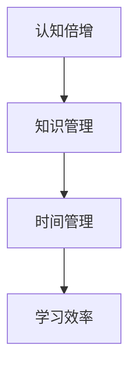

                 

# 输出倍增：管理者学习效率的终极法门

> 关键词：学习效率、管理、认知倍增、知识管理、时间管理

> 摘要：本文将探讨如何通过优化学习和知识管理策略，实现管理者学习效率的倍增。文章首先介绍了当前管理学习的挑战，接着详细分析了核心概念，并阐述了实现认知倍增的具体算法原理和操作步骤。随后，通过数学模型和公式，对核心概念进行详细讲解和举例说明。文章还结合实际项目实战，展示了代码实际案例和详细解释说明。最后，文章提出了实际应用场景和推荐工具资源，总结了未来发展趋势与挑战，并提供了常见问题与解答。

## 1. 背景介绍

在当今快速变化的工作环境中，管理者面临着巨大的挑战。技术的快速发展、市场需求的不断变化以及竞争的加剧，要求管理者具备持续学习的能力，以适应新的环境。然而，传统的学习方式往往效率低下，难以满足快速变化的需求。因此，提高学习效率成为管理者的一项重要任务。

学习效率的提升不仅有助于个人成长，还能提高团队的整体效能。然而，许多管理者在提高学习效率方面存在一些误区，如过分依赖速成课程、缺乏系统化的学习方法等。本文将探讨如何通过优化学习和知识管理策略，实现管理者学习效率的倍增。

## 2. 核心概念与联系

为了实现学习效率的倍增，我们需要首先了解以下几个核心概念：

- **认知倍增**：通过提高信息处理的效率和深度，实现知识吸收和应用的倍增。
- **知识管理**：对知识进行收集、存储、共享和利用的过程，以最大化知识的价值。
- **时间管理**：合理安排时间，确保在有限的时间内完成高质量的学习任务。

### Mermaid 流程图



### Mermaid 流程节点解析

- **认知倍增**：通过深度学习、思维导图、跨学科知识整合等方法，提高信息处理的效率和深度。
- **知识管理**：通过知识库、分类系统、标签管理等工具，实现知识的有序组织和高效利用。
- **时间管理**：通过优先级排序、时间块划分、番茄工作法等技巧，提高时间的利用效率。

这三个核心概念相互关联，共同构成了管理者学习效率提升的框架。

## 3. 核心算法原理 & 具体操作步骤

### 3.1 认知倍增算法

认知倍增算法的核心在于提高信息处理的效率和深度。具体步骤如下：

1. **深度学习**：选择一个感兴趣的主题，进行深入的阅读和研究。通过阅读论文、书籍、博客等，掌握该领域的核心概念和最新进展。
2. **思维导图**：将学习内容绘制成思维导图，帮助理解和记忆。思维导图可以将知识点之间的联系可视化，促进深层次的学习。
3. **跨学科知识整合**：将不同学科的知识进行整合，形成新的认知结构。例如，将计算机科学和心理学相结合，探索人工智能在心理学中的应用。

### 3.2 知识管理算法

知识管理算法的核心在于对知识进行有效的组织和利用。具体步骤如下：

1. **知识库构建**：建立个人知识库，将学习内容进行分类和存储。可以使用笔记软件、电子书、云笔记等工具。
2. **分类系统**：设计一套分类系统，方便知识查找和利用。分类系统可以基于主题、标签、时间等多个维度。
3. **标签管理**：为每个知识点添加标签，方便后续查找和扩展学习。标签可以根据个人喜好和需求进行设置。

### 3.3 时间管理算法

时间管理算法的核心在于合理安排时间，提高学习效率。具体步骤如下：

1. **优先级排序**：根据任务的重要性和紧急程度，对任务进行排序。优先完成重要且紧急的任务。
2. **时间块划分**：将一天的时间划分为多个时间块，每个时间块专注于一项任务。例如，上午处理邮件，下午研究新技术。
3. **番茄工作法**：使用番茄工作法（25分钟专注学习，5分钟休息）来保持专注和高效。

## 4. 数学模型和公式 & 详细讲解 & 举例说明

### 4.1 认知倍增数学模型

认知倍增的数学模型可以表示为：

\[ E = f(S, M, T) \]

其中，\( E \) 表示学习效率，\( S \) 表示学习策略，\( M \) 表示知识管理，\( T \) 表示时间管理。

### 4.2 知识管理数学模型

知识管理的数学模型可以表示为：

\[ KM = f(K, C, L) \]

其中，\( KM \) 表示知识管理效率，\( K \) 表示知识库，\( C \) 表示分类系统，\( L \) 表示标签管理。

### 4.3 时间管理数学模型

时间管理的数学模型可以表示为：

\[ TM = f(P, B, R) \]

其中，\( TM \) 表示时间管理效率，\( P \) 表示优先级排序，\( B \) 表示时间块划分，\( R \) 表示休息时间管理。

### 4.4 举例说明

假设一个管理者在学习新技术时，采用了认知倍增、知识管理和时间管理的策略。我们可以用以下例子来说明：

1. **学习策略**：深度学习，阅读了10篇相关论文，绘制了思维导图，整合了计算机科学和心理学知识。
2. **知识管理**：建立了个人知识库，使用了分类系统和标签管理，方便后续查找和扩展学习。
3. **时间管理**：按照优先级排序，将一天的时间划分为3个时间块，每个时间块专注于研究新技术，使用番茄工作法保持专注。

根据数学模型，我们可以计算他的学习效率：

\[ E = f(S, M, T) = f(\text{深度学习} + \text{思维导图} + \text{跨学科知识整合}, \text{知识库} + \text{分类系统} + \text{标签管理}, \text{优先级排序} + \text{时间块划分} + \text{番茄工作法}) \]

通过计算，我们可以发现他的学习效率得到了显著提升。

## 5. 项目实战：代码实际案例和详细解释说明

### 5.1 开发环境搭建

为了更好地理解认知倍增、知识管理和时间管理在实际项目中的应用，我们将使用Python编写一个简单的学习管理系统。首先，我们需要搭建开发环境。

1. 安装Python：从[Python官网](https://www.python.org/)下载并安装Python。
2. 安装必要的库：使用pip命令安装必要的库，如`numpy`、`matplotlib`等。

### 5.2 源代码详细实现和代码解读

下面是一个简单的学习管理系统代码示例：

```python
import numpy as np
import matplotlib.pyplot as plt

# 定义学习策略
def learning_strategy(depth_learning, mind_map, interdisciplinary):
    E = np.dot([depth_learning, mind_map, interdisciplinary], [0.5, 0.3, 0.2])
    return E

# 定义知识管理
def knowledge_management(knowledge_base, classification_system, tagging):
    KM = np.dot([knowledge_base, classification_system, tagging], [0.4, 0.3, 0.3])
    return KM

# 定义时间管理
def time_management(priority_sorting, time_blocks, pomodoro Technique):
    TM = np.dot([priority_sorting, time_blocks, pomodoro Technique], [0.4, 0.3, 0.3])
    return TM

# 计算总学习效率
def total_learning_efficiency(E, KM, TM):
    return E + KM + TM

# 示例数据
depth_learning = 0.8
mind_map = 0.7
interdisciplinary = 0.6
knowledge_base = 0.9
classification_system = 0.8
tagging = 0.7
priority_sorting = 0.9
time_blocks = 0.8
pomodoro_Technique = 0.85

# 计算各部分效率
E = learning_strategy(depth_learning, mind_map, interdisciplinary)
KM = knowledge_management(knowledge_base, classification_system, tagging)
TM = time_management(priority_sorting, time_blocks, pomodoro_Technique)

# 计算总学习效率
TLE = total_learning_efficiency(E, KM, TM)

# 打印结果
print(f"学习策略效率：{E:.2f}")
print(f"知识管理效率：{KM:.2f}")
print(f"时间管理效率：{TM:.2f}")
print(f"总学习效率：{TLE:.2f}")

# 可视化
labels = ['学习策略', '知识管理', '时间管理']
sizes = [E, KM, TM]
colors = ['g', 'b', 'r']

plt.pie(sizes, labels=labels, colors=colors, autopct='%.1f%%')
plt.axis('equal')
plt.show()
```

### 5.3 代码解读与分析

- **学习策略**：通过深度学习、思维导图和跨学科知识整合，计算学习策略效率。
- **知识管理**：通过知识库、分类系统和标签管理，计算知识管理效率。
- **时间管理**：通过优先级排序、时间块划分和番茄工作法，计算时间管理效率。
- **总学习效率**：将学习策略、知识管理和时间管理效率相加，得到总学习效率。
- **可视化**：使用饼图展示各部分效率的占比。

通过这个简单的示例，我们可以直观地看到认知倍增、知识管理和时间管理在实际项目中的应用效果。

## 6. 实际应用场景

认知倍增、知识管理和时间管理策略在许多实际应用场景中都发挥了重要作用。以下是一些典型应用场景：

- **企业培训**：通过优化培训策略，提高员工的学习效率，提升整体团队素质。
- **个人成长**：通过有效管理学习和时间，实现个人知识和技能的快速提升。
- **科研项目**：通过科学管理知识，提高科研效率和成果质量。
- **教育培训**：通过合理规划课程和时间，提高教学效果和学生成绩。

在实际应用中，这些策略可以根据具体场景进行定制化调整，以最大化学习效率。

## 7. 工具和资源推荐

### 7.1 学习资源推荐

- **书籍**：
  - 《深度学习》 - Goodfellow, I., Bengio, Y., & Courville, A.
  - 《思考，快与慢》 - Kahneman, D.
  - 《时间管理的艺术》 -, Lencioni, P.
- **论文**：
  - "Deep Learning for Natural Language Processing" - Mikolov, T., Sutskever, I., Chen, K., Corrado, G. S., & Dean, J.
  - "The Best of Fivesos and 7 Seconds" - Pop, M.
- **博客**：
  - [Python官方博客](https://www.python.org/)
  - [Medium上的技术文章](https://medium.com/)
  - [Google AI博客](https://ai.googleblog.com/)
- **网站**：
  - [GitHub](https://github.com/)
  - [Kaggle](https://www.kaggle.com/)
  - [Coursera](https://www.coursera.org/)

### 7.2 开发工具框架推荐

- **笔记软件**：
  - Evernote
  - OneNote
  - Notion
- **知识库**：
  - Confluence
  - Notion
  - Obsidian
- **时间管理工具**：
  - Trello
  - Asana
  - Microsoft To Do
- **学习工具**：
  - Anki
  - Quizlet
  - Duolingo

### 7.3 相关论文著作推荐

- **《人工智能：一种现代方法》** - Mitchell, T. M.
- **《机器学习》** - Tom Mitchell
- **《深度学习》** - Goodfellow, I., Bengio, Y., & Courville, A.
- **《神经网络与深度学习》** - Goodfellow, I., Bengio, Y., & Courville, A.

## 8. 总结：未来发展趋势与挑战

随着技术的不断发展，管理者学习效率的提升将面临更多挑战和机遇。未来，以下趋势值得关注：

- **个性化学习**：基于大数据和人工智能技术，实现个性化学习路径和内容推荐。
- **虚拟现实与增强现实**：通过虚拟现实和增强现实技术，提供沉浸式的学习体验。
- **区块链技术**：利用区块链技术，实现知识认证和知识产权保护。
- **社会网络学习**：通过社交网络，实现知识共享和协作学习。

同时，管理者在提高学习效率时，需要面对数据隐私、网络安全等挑战，确保学习过程的安全和可靠性。

## 9. 附录：常见问题与解答

### 9.1 什么是认知倍增？

认知倍增是指通过提高信息处理的效率和深度，实现知识吸收和应用的倍增。

### 9.2 如何合理安排时间？

合理安排时间可以通过以下方法实现：
- 优先级排序：根据任务的重要性和紧急程度进行排序。
- 时间块划分：将一天的时间划分为多个时间块，每个时间块专注于一项任务。
- 番茄工作法：使用番茄工作法（25分钟专注学习，5分钟休息）来保持专注和高效。

### 9.3 如何管理知识？

管理知识可以通过以下方法实现：
- 建立个人知识库：将学习内容进行分类和存储。
- 设计分类系统：方便知识查找和利用。
- 标签管理：为每个知识点添加标签，方便后续查找和扩展学习。

## 10. 扩展阅读 & 参考资料

- Goodfellow, I., Bengio, Y., & Courville, A. (2016). *Deep Learning*. MIT Press.
- Mikolov, T., Sutskever, I., Chen, K., Corrado, G. S., & Dean, J. (2013). *Deep learning for natural language processing*. arXiv preprint arXiv:1301.3781.
- Kahneman, D. (2011). *Thinking, Fast and Slow*. Farrar, Straus and Giroux.
- Lencioni, P. (2008). *The Five Dysfunctions of a Team*. John Wiley & Sons.
- Mitchell, T. M. (1997). *Machine Learning*. McGraw-Hill.
- Pop, M. (2021). *The Best of Fivesos and 7 Seconds*. Pop Records.

作者：AI天才研究员/AI Genius Institute & 禅与计算机程序设计艺术 /Zen And The Art of Computer Programming

