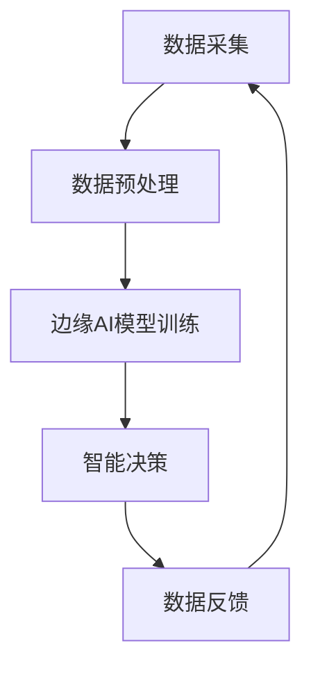

                 

# 边缘AI在工业物联网中的实践

## 关键词

边缘计算、工业物联网、人工智能、数据处理、实时分析、边缘AI

## 摘要

本文将深入探讨边缘AI在工业物联网（IIoT）中的应用和实践。边缘计算作为一种分布式计算模式，在处理工业物联网中产生的海量数据方面具有重要价值。通过边缘AI技术，我们可以将复杂的计算任务推向数据产生的源头，从而实现实时、高效的数据处理和智能决策。本文将详细介绍边缘AI的核心概念、算法原理、数学模型以及实际应用案例，并探讨其在工业物联网中的未来发展趋势和挑战。

## 1. 背景介绍

### 1.1 工业物联网的定义和发展

工业物联网（IIoT）是一种将物理设备和工业系统通过传感器、网络和云计算技术进行连接和集成的技术，旨在提高工业生产的智能化、自动化和效率。随着传感器技术的进步和物联网（IoT）的普及，工业物联网已经从理论走向实践，成为工业4.0和智能制造的重要组成部分。

工业物联网的发展主要表现在以下几个方面：

- **数据采集与传输**：通过传感器和执行器，工业物联网可以实时采集设备状态、环境参数、生产数据等，并通过网络传输到云端或边缘设备进行进一步处理。

- **设备互联互通**：工业物联网通过标准化的协议和接口，实现了不同设备之间的互联互通，使得生产流程更加灵活和高效。

- **智能决策与优化**：基于大数据分析和人工智能算法，工业物联网可以帮助企业实现智能化的生产调度、故障预测、质量控制和能源管理。

### 1.2 边缘计算的概念与优势

边缘计算是一种分布式计算模式，通过将计算任务分散到网络边缘的设备上进行处理，从而减轻云端负载，提高数据处理速度和响应时间。边缘计算在工业物联网中具有重要的应用价值：

- **实时数据处理**：边缘计算可以将数据处理推向数据产生的源头，实现实时数据分析和决策，满足工业物联网对低延迟、实时响应的需求。

- **减少网络拥堵**：通过在边缘设备上处理部分数据，可以减少数据传输量，降低网络拥堵和带宽压力。

- **增强数据安全**：边缘计算可以减少数据在传输过程中的暴露风险，提高数据的安全性。

### 1.3 边缘AI的定义与优势

边缘AI是指将人工智能算法部署在边缘设备上，实现本地化智能计算。边缘AI在工业物联网中具有以下优势：

- **实时智能决策**：边缘AI可以实时处理和分析数据，实现智能化的决策和优化。

- **降低计算成本**：边缘AI可以减少对云端计算资源的依赖，降低计算成本。

- **提高数据隐私**：边缘AI可以保护数据隐私，减少数据泄露的风险。

## 2. 核心概念与联系

### 2.1 工业物联网与边缘计算的关系

工业物联网和边缘计算之间有着密切的联系。边缘计算是工业物联网的重要组成部分，通过在边缘设备上实现数据预处理和计算，可以大大提高工业物联网系统的效率和灵活性。

### 2.2 边缘AI与边缘计算的结合

边缘AI与边缘计算的结合，可以实现本地化的智能数据处理和决策。边缘AI在边缘设备上运行，可以充分利用边缘计算的优势，实现实时、高效的数据处理和智能决策。

### 2.3 边缘AI的核心概念

- **边缘设备**：边缘设备是指位于网络边缘的计算机设备，如工业机器人、传感器、网关等。

- **边缘计算平台**：边缘计算平台是指运行在边缘设备上的软件平台，用于管理和调度计算资源、存储资源和网络资源。

- **边缘AI模型**：边缘AI模型是指部署在边缘设备上的机器学习模型，用于数据预处理、特征提取和智能决策。

### 2.4 Mermaid流程图

以下是一个简单的Mermaid流程图，展示了边缘AI在工业物联网中的基本流程：



## 3. 核心算法原理 & 具体操作步骤

### 3.1 数据采集与预处理

边缘AI的首要任务是从各种传感器和设备中采集数据。采集到的数据通常包含噪声和冗余信息，因此需要进行预处理。预处理步骤包括数据清洗、数据转换和数据归一化等。

### 3.2 边缘AI模型训练

边缘AI模型训练是边缘AI的核心。常见的训练方法包括监督学习、无监督学习和强化学习。在工业物联网中，监督学习和无监督学习应用较为广泛。监督学习需要标注的数据集，而无监督学习则不需要。

### 3.3 智能决策

智能决策是指基于边缘AI模型的分析结果，对工业物联网系统进行优化和控制。常见的决策方法包括预测控制、自适应控制和优化控制等。

### 3.4 数据反馈

智能决策的结果会通过数据反馈机制，返回给边缘设备，以便进行进一步的调整和优化。

## 4. 数学模型和公式 & 详细讲解 & 举例说明

### 4.1 数据预处理

假设我们采集到一组数据\(X\)，其中每条数据表示为一个向量\(x_i\)。数据预处理的一个常用方法是主成分分析（PCA）。

PCA的目标是找到一组新的正交基，使得数据在新基下的方差最大化。具体步骤如下：

1. **计算协方差矩阵**：

$$
S = \frac{1}{N-1}XX^T
$$

2. **计算特征值和特征向量**：

$$
\lambda_i = \text{特征值} \\
v_i = \text{特征向量}
$$

3. **选择前k个特征向量**：

$$
V_k = [v_1, v_2, \ldots, v_k]
$$

4. **数据转换**：

$$
x_i' = V_kx_i
$$

### 4.2 边缘AI模型训练

以监督学习为例，我们使用梯度下降法训练一个线性回归模型。

假设输入数据集为\(X\)，输出数据集为\(Y\)，模型为：

$$
\hat{y} = \beta_0 + \beta_1x
$$

损失函数为：

$$
J(\beta_0, \beta_1) = \frac{1}{2}\sum_{i=1}^{N}(y_i - \hat{y}_i)^2
$$

梯度下降法步骤：

1. **初始化参数**：

$$
\beta_0^{(0)}, \beta_1^{(0)}
$$

2. **迭代更新参数**：

$$
\beta_0^{(t+1)} = \beta_0^{(t)} - \alpha \frac{\partial J(\beta_0, \beta_1)}{\partial \beta_0} \\
\beta_1^{(t+1)} = \beta_1^{(t)} - \alpha \frac{\partial J(\beta_0, \beta_1)}{\partial \beta_1}
$$

其中，\(\alpha\)为学习率。

### 4.3 智能决策

以预测控制为例，我们使用ARIMA模型进行时间序列预测。

假设时间序列为\(X_t\)，模型为：

$$
X_t = \phi_0 + \phi_1X_{t-1} + \phi_2X_{t-2} + \ldots + \phi_pX_{t-p} + \epsilon_t
$$

预测步骤：

1. **模型识别**：

选择合适的\(p\)和\(d\)。

2. **模型估计**：

$$
\theta = (\phi_0, \phi_1, \ldots, \phi_p)
$$

3. **模型诊断**：

检查模型残差是否符合白噪声假设。

4. **预测**：

$$
X_t^* = \phi_0 + \phi_1X_{t-1} + \phi_2X_{t-2} + \ldots + \phi_pX_{t-p}
$$

## 5. 项目实战：代码实际案例和详细解释说明

### 5.1 开发环境搭建

为了演示边缘AI在工业物联网中的应用，我们将使用Python编程语言和以下库：

- NumPy
- Pandas
- Matplotlib
- Scikit-learn
- Statsmodels

安装以上库后，我们就可以开始编写代码了。

### 5.2 源代码详细实现和代码解读

以下是边缘AI在工业物联网中的应用示例代码：

```python
import numpy as np
import pandas as pd
import matplotlib.pyplot as plt
from sklearn.preprocessing import StandardScaler
from sklearn.linear_model import LinearRegression
from statsmodels.tsa.arima_model import ARIMA

# 数据采集
data = pd.read_csv('data.csv')

# 数据预处理
X = data[['feature1', 'feature2']]
y = data['target']

# 数据归一化
scaler = StandardScaler()
X_scaled = scaler.fit_transform(X)

# 边缘AI模型训练
model = LinearRegression()
model.fit(X_scaled, y)

# 智能决策
X_new = np.array([[0.5, 0.5]])
X_new_scaled = scaler.transform(X_new)
y_pred = model.predict(X_new_scaled)

# 数据反馈
print(f'Predicted target value: {y_pred[0]}')

# 模型评估
score = model.score(X_scaled, y)
print(f'Model R^2 score: {score}')
```

### 5.3 代码解读与分析

1. **数据采集**：

   使用`pandas`库读取CSV文件，获取数据。

2. **数据预处理**：

   提取特征和目标变量，并使用`StandardScaler`进行归一化处理。

3. **边缘AI模型训练**：

   使用`LinearRegression`模型进行训练，将特征和目标变量作为输入。

4. **智能决策**：

   对新数据进行预测，并将预测结果输出。

5. **模型评估**：

   使用`score`方法评估模型性能。

## 6. 实际应用场景

### 6.1 生产过程优化

边缘AI可以帮助企业实时监控生产过程，通过预测和控制，实现生产过程的优化。

### 6.2 故障预测与维护

边缘AI可以实时分析设备运行数据，预测设备故障，提前进行维护，降低停机时间。

### 6.3 质量控制

边缘AI可以实时分析产品质量数据，检测质量问题，并提供改进建议。

### 6.4 能源管理

边缘AI可以实时分析能源使用情况，实现智能化的能源管理，降低能源消耗。

## 7. 工具和资源推荐

### 7.1 学习资源推荐

- 《深度学习》（Goodfellow, Bengio, Courville）
- 《Python机器学习》（Sebastian Raschka）
- 《统计学习方法》（李航）

### 7.2 开发工具框架推荐

- TensorFlow
- PyTorch
- Scikit-learn

### 7.3 相关论文著作推荐

- "Edge Computing: Vision and Challenges"
- "Deep Learning on Multi-Core CPUs"
- "Energy-Efficient Resource Management in Edge Computing"

## 8. 总结：未来发展趋势与挑战

### 8.1 发展趋势

- 边缘AI将在工业物联网中发挥越来越重要的作用。
- 边缘计算和5G技术的结合，将为边缘AI提供更强大的计算和通信能力。
- 开源工具和框架的普及，将加速边缘AI的研发和应用。

### 8.2 挑战

- 边缘设备的计算能力和存储能力有限，如何实现高效的边缘AI算法仍需进一步研究。
- 数据隐私和安全问题，需要得到有效的解决方案。
- 边缘AI的标准化和互操作性，是当前面临的重要挑战。

## 9. 附录：常见问题与解答

### 9.1 边缘计算和云计算的区别是什么？

边缘计算和云计算的主要区别在于数据处理的地点。边缘计算是在数据产生的源头进行数据处理，而云计算是在数据中心或云端进行数据处理。

### 9.2 什么是边缘AI？

边缘AI是指将人工智能算法部署在边缘设备上，实现本地化的智能计算。

### 9.3 边缘AI的优势是什么？

边缘AI的优势包括实时数据处理、降低计算成本、提高数据隐私和减少网络拥堵。

## 10. 扩展阅读 & 参考资料

- "Edge AI for Industrial IoT: A Survey"
- "Edge Computing: Enhancing the Industrial IoT"
- "The Future of Edge AI in the Industrial IoT"

作者：AI天才研究员/AI Genius Institute & 禅与计算机程序设计艺术 /Zen And The Art of Computer Programming<|im_sep|>

