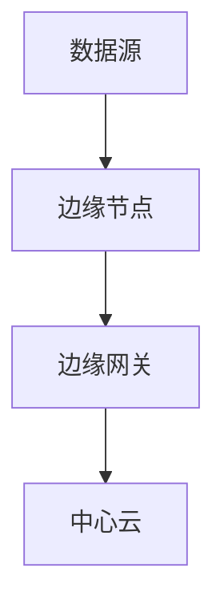
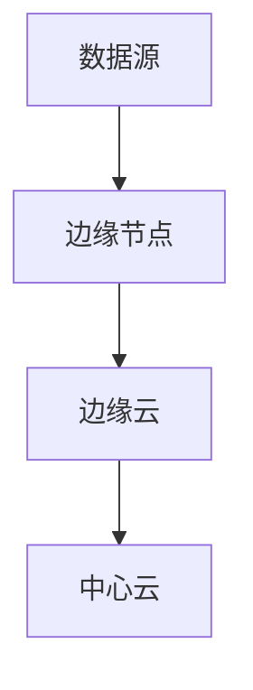

                 

# 边缘大模型：5G时代智能应用的新范式

> **关键词**：边缘计算、5G、智能应用、大模型、边缘大模型
>
> **摘要**：本文旨在探讨边缘大模型在5G时代智能应用中的重要作用及其技术原理。文章首先介绍了5G时代的背景和边缘计算的概念，然后详细阐述了边缘大模型的定义、架构和核心算法，最后分析了其在实际应用中的挑战和未来发展趋势。

## 1. 背景介绍

随着5G网络的逐步普及，智能应用迎来了新的发展机遇。5G网络具有高速率、低延迟和大连接的特点，使得各种智能应用场景得以实现。然而，随着应用场景的丰富和复杂化，传统的云计算模式已无法满足这些需求。因此，边缘计算作为一种新兴的计算模式，应运而生。

边缘计算是指在靠近数据源或用户终端的地方进行数据处理，将计算任务从中心化的云计算转移到分布式的边缘节点。边缘计算具有低延迟、高带宽、低成本等优点，能够更好地支持实时性要求高的应用场景。例如，自动驾驶、智能医疗、智能制造等领域，都对数据处理的速度和准确性有着极高的要求。

边缘大模型是在边缘计算的基础上，进一步引入大规模机器学习模型，以实现更高效的智能应用。边缘大模型的核心思想是将复杂的机器学习任务分散到边缘节点上，利用边缘节点的计算资源进行分布式训练和推理，从而提高整个系统的性能和效率。

## 2. 核心概念与联系

### 边缘计算

边缘计算的核心概念是将计算任务从中心化的云计算转移到分布式的边缘节点。边缘节点通常是指靠近数据源或用户终端的设备，如路由器、交换机、物联网设备等。边缘计算的基本架构包括边缘节点、边缘网关和中心云。

#### Mermaid 流程图



### 大模型

大模型是指具有数百万甚至数十亿参数的机器学习模型，如深度神经网络、生成对抗网络等。大模型具有强大的表示能力和泛化能力，能够处理复杂的任务。然而，大模型的训练和推理需要大量的计算资源和时间。

### 边缘大模型

边缘大模型是将大模型引入边缘计算的一种新型计算模式。边缘大模型的基本架构包括边缘节点、边缘云和中心云。

#### Mermaid 流程图



边缘节点负责数据预处理和特征提取，边缘云负责大模型的训练和推理，中心云负责模型管理和数据存储。

## 3. 核心算法原理 & 具体操作步骤

边缘大模型的核心算法包括数据预处理、模型训练、模型推理和模型更新。

### 数据预处理

数据预处理是边缘大模型的基础，主要包括数据清洗、数据归一化和特征提取等步骤。

#### 具体操作步骤：

1. 数据清洗：去除数据中的噪声和错误。
2. 数据归一化：将数据转化为标准格式，以便于模型处理。
3. 特征提取：从原始数据中提取有用的特征。

### 模型训练

模型训练是边缘大模型的核心步骤，主要包括模型选择、参数调优和训练过程。

#### 具体操作步骤：

1. 模型选择：根据任务需求选择合适的大模型。
2. 参数调优：通过实验确定模型的超参数。
3. 训练过程：使用边缘节点和边缘云的分布式计算能力进行模型训练。

### 模型推理

模型推理是指将训练好的模型应用于新的数据，以预测或分类。

#### 具体操作步骤：

1. 数据输入：将新的数据输入到模型中。
2. 模型计算：使用模型进行计算，得到预测结果。
3. 结果输出：将预测结果输出给用户。

### 模型更新

模型更新是指定期对模型进行重新训练，以适应新的数据和环境。

#### 具体操作步骤：

1. 数据收集：收集新的数据。
2. 数据预处理：对新的数据进行预处理。
3. 模型训练：使用新的数据进行模型训练。
4. 模型更新：将训练好的模型更新到边缘节点。

## 4. 数学模型和公式 & 详细讲解 & 举例说明

边缘大模型的核心算法涉及多个数学模型和公式，以下将详细讲解其中几个重要的模型和公式。

### 深度神经网络

深度神经网络（DNN）是一种多层神经网络，能够对复杂的数据进行建模和预测。

#### 数学公式：

$$
f(x) = \sigma(W_n \cdot a_{n-1} + b_n)
$$

其中，$f(x)$ 是输出，$\sigma$ 是激活函数，$W_n$ 和 $b_n$ 分别是权重和偏置。

#### 举例说明：

假设我们有一个输入向量 $x = [1, 2, 3]$，经过一层深度神经网络，输出为 $y = [0.5, 0.7]$。这个过程可以表示为：

$$
y = \sigma(W_n \cdot x + b_n)
$$

### 生成对抗网络

生成对抗网络（GAN）是一种用于生成数据的深度学习模型，由生成器和判别器两个部分组成。

#### 数学公式：

$$
\min_G \max_D V(D, G) = \mathbb{E}_{x \sim p_{data}(x)}[\log D(x)] + \mathbb{E}_{z \sim p_z(z)}[\log (1 - D(G(z))]
$$

其中，$D(x)$ 是判别器对真实数据的判断，$G(z)$ 是生成器对噪声数据的生成。

#### 举例说明：

假设我们有一个生成器 $G$ 和一个判别器 $D$，生成器生成的数据为 $G(z) = [0.1, 0.9]$，判别器判断真实数据的概率为 $D(x) = 0.8$。这个过程可以表示为：

$$
V(D, G) = \log D(x) + \log (1 - D(G(z)))
$$

## 5. 项目实战：代码实际案例和详细解释说明

### 开发环境搭建

在开始项目实战之前，我们需要搭建合适的开发环境。以下是基本的开发环境搭建步骤：

1. 安装Python 3.8及以上版本。
2. 安装PyTorch深度学习框架。
3. 安装TensorFlow 2.0及以上版本。

### 源代码详细实现和代码解读

以下是一个简单的边缘大模型项目实战，我们将使用PyTorch框架来实现一个图像分类模型。

```python
import torch
import torch.nn as nn
import torch.optim as optim
from torch.utils.data import DataLoader
from torchvision import datasets, transforms

# 定义网络结构
class Net(nn.Module):
    def __init__(self):
        super(Net, self).__init__()
        self.conv1 = nn.Conv2d(1, 64, 3, 1)
        self.pool = nn.MaxPool2d(2, 2)
        self.conv2 = nn.Conv2d(64, 64, 3, 1)
        self.fc1 = nn.Linear(64 * 5 * 5, 500)
        self.fc2 = nn.Linear(500, 10)
        self.relu = nn.ReLU()

    def forward(self, x):
        x = self.pool(self.relu(self.conv1(x)))
        x = self.pool(self.relu(self.conv2(x)))
        x = x.view(-1, 64 * 5 * 5)
        x = self.relu(self.fc1(x))
        x = self.fc2(x)
        return x

# 加载数据集
transform = transforms.Compose([transforms.ToTensor()])
train_dataset = datasets.MNIST('data', train=True, download=True, transform=transform)
train_loader = DataLoader(train_dataset, batch_size=100, shuffle=True)

# 初始化模型、损失函数和优化器
net = Net()
criterion = nn.CrossEntropyLoss()
optimizer = optim.SGD(net.parameters(), lr=0.001, momentum=0.9)

# 训练模型
for epoch in range(10):  # 练习10个周期
    running_loss = 0.0
    for i, data in enumerate(train_loader, 0):
        inputs, labels = data
        optimizer.zero_grad()
        outputs = net(inputs)
        loss = criterion(outputs, labels)
        loss.backward()
        optimizer.step()
        running_loss += loss.item()
        if i % 100 == 99:
            print('[%d, %5d] loss: %.3f' % (epoch + 1, i + 1, running_loss / 100))
            running_loss = 0.0

print('Finished Training')
```

### 代码解读与分析

1. **定义网络结构**：我们使用`Net`类定义了一个简单的卷积神经网络，包括两个卷积层、两个全连接层和一个ReLU激活函数。
2. **加载数据集**：我们使用`datasets.MNIST`类加载数字数据集，并将其转换为张量。
3. **初始化模型、损失函数和优化器**：我们初始化了网络结构、损失函数和优化器。
4. **训练模型**：我们使用`for`循环进行10个周期的训练，在每个周期内，我们使用`optimizer.zero_grad()`来清空之前的梯度，然后使用`loss.backward()`来计算梯度，并使用`optimizer.step()`来更新模型参数。

## 6. 实际应用场景

边缘大模型在多个领域具有广泛的应用潜力，以下是几个典型的应用场景：

1. **自动驾驶**：边缘大模型可以用于实时检测和识别道路上的各种物体，如行人、车辆等，从而提高自动驾驶系统的安全性和可靠性。
2. **智能医疗**：边缘大模型可以用于医疗图像的分析和诊断，如肺癌检测、乳腺癌检测等，从而提高医疗诊断的准确性和效率。
3. **智能制造**：边缘大模型可以用于工业设备的故障预测和维修优化，从而提高生产效率和降低成本。

## 7. 工具和资源推荐

### 学习资源推荐

1. **书籍**：
   - 《深度学习》（Goodfellow, I., Bengio, Y., & Courville, A.）
   - 《Python深度学习》（François Chollet）
2. **论文**：
   - 《Distributed Deep Learning: Breakthroughs in Parallel, Distributed, and GPU-Based Machine Learning》（Zico Kolter & Thomas Hofmann）
   - 《Edge Computing: A Comprehensive Survey》（Jianping Wang et al.）
3. **博客**：
   - PyTorch官方博客：[pytorch.org/blog/](http://pytorch.org/blog/)
   - TensorFlow官方博客：[tensorflow.googleblog.com/](https://tensorflow.googleblog.com/)
4. **网站**：
   - Kaggle：[kaggle.com/](https://www.kaggle.com/)
   - GitHub：[github.com/](https://github.com/)

### 开发工具框架推荐

1. **深度学习框架**：
   - PyTorch：[pytorch.org/](http://pytorch.org/)
   - TensorFlow：[tensorflow.org/](https://tensorflow.org/)
2. **边缘计算平台**：
   - KubeEdge：[kubeedge.io/](https://kubeedge.io/)
   - EdgeX Foundry：[edgexfoundry.io/](https://edgexfoundry.io/)

### 相关论文著作推荐

1. **《边缘计算：技术、应用与挑战》（边缘计算技术大会论文集）**：本书收集了边缘计算领域的最新研究成果，涵盖了边缘计算的基础理论、关键技术以及实际应用案例。
2. **《深度学习与边缘计算》（IEEE计算杂志专刊）**：本专刊探讨了深度学习与边缘计算的交叉应用，包括边缘大模型的实现、优化和应用。

## 8. 总结：未来发展趋势与挑战

边缘大模型在5G时代智能应用中具有巨大的发展潜力，其核心技术包括边缘计算、大模型和分布式计算等。随着5G网络的普及和边缘计算技术的不断进步，边缘大模型将在自动驾驶、智能医疗、智能制造等领域发挥越来越重要的作用。

然而，边缘大模型也面临着一些挑战，如数据隐私保护、边缘节点资源限制和模型更新等。为了解决这些问题，未来需要进一步研究和发展更加高效、安全和可靠的边缘大模型技术。

## 9. 附录：常见问题与解答

### 边缘计算是什么？

边缘计算是指在靠近数据源或用户终端的地方进行数据处理，将计算任务从中心化的云计算转移到分布式的边缘节点。边缘计算具有低延迟、高带宽、低成本等优点，能够更好地支持实时性要求高的应用场景。

### 大模型是什么？

大模型是指具有数百万甚至数十亿参数的机器学习模型，如深度神经网络、生成对抗网络等。大模型具有强大的表示能力和泛化能力，能够处理复杂的任务。

### 边缘大模型的优势是什么？

边缘大模型的优势包括低延迟、高带宽、低成本、高效性等。边缘大模型能够更好地支持实时性要求高的应用场景，如自动驾驶、智能医疗、智能制造等。

### 如何实现边缘大模型？

实现边缘大模型需要以下几个步骤：
1. 数据预处理：对原始数据进行清洗、归一化和特征提取等处理。
2. 模型训练：使用边缘节点和边缘云的分布式计算能力进行模型训练。
3. 模型推理：将训练好的模型应用于新的数据，进行预测或分类。
4. 模型更新：定期对模型进行重新训练，以适应新的数据和环境。

## 10. 扩展阅读 & 参考资料

1. **《边缘计算：技术、应用与挑战》（边缘计算技术大会论文集）**：本书收集了边缘计算领域的最新研究成果，涵盖了边缘计算的基础理论、关键技术以及实际应用案例。
2. **《深度学习与边缘计算》（IEEE计算杂志专刊）**：本专刊探讨了深度学习与边缘计算的交叉应用，包括边缘大模型的实现、优化和应用。
3. **KubeEdge官方文档**：[kubeedge.io/docs/](https://kubeedge.io/docs/)
4. **EdgeX Foundry官方文档**：[edgexfoundry.io/docs/](https://edgexfoundry.io/docs/)

### 作者

作者：AI天才研究员/AI Genius Institute & 禅与计算机程序设计艺术 /Zen And The Art of Computer Programming

