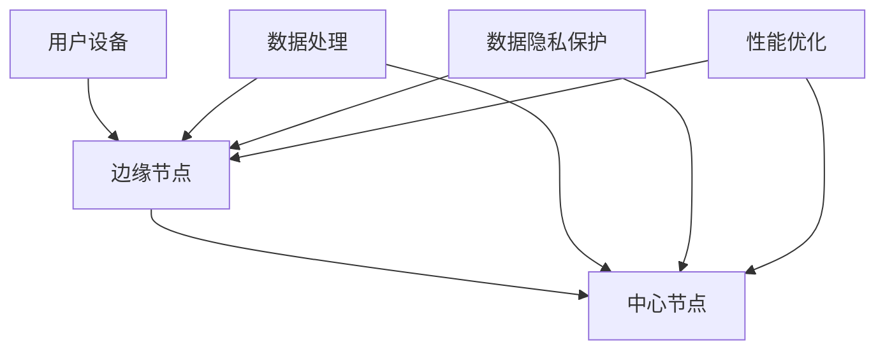

                 

# 边缘计算中的软件2.0应用

> 关键词：边缘计算，软件2.0，云计算，物联网，智能设备，实时数据处理，数据隐私，安全性，性能优化，分布式系统

> 摘要：本文将探讨边缘计算中软件2.0的应用，分析其在物联网、智能设备等领域的重要性，以及如何实现实时数据处理、数据隐私保护和性能优化。同时，还将介绍相关的工具和资源，以及未来的发展趋势与挑战。

## 1. 背景介绍

边缘计算是一种分布式计算架构，旨在将计算、存储和网络功能从中心化的云计算环境迁移到网络的边缘。随着物联网（IoT）和智能设备的广泛应用，边缘计算变得越来越重要。这些设备和系统能够生成大量数据，需要在数据生成的源头进行处理，以减少延迟、带宽消耗和成本。

软件2.0是指云计算和分布式计算中，以数据为中心的开发模式。它强调数据处理、分析和存储的灵活性、可扩展性和安全性。软件2.0的出现，使得边缘计算能够更好地应对实时数据处理、数据隐私和安全性等挑战。

## 2. 核心概念与联系

边缘计算与软件2.0之间存在紧密的联系。边缘计算提供了一个分布式计算平台，而软件2.0则提供了在边缘设备上高效处理数据的方法。以下是一个简化的Mermaid流程图，展示边缘计算与软件2.0的核心概念和架构：



### 2.1. 边缘节点

边缘节点是指靠近数据源的计算设备，如智能设备、路由器和网关等。这些设备能够处理本地数据，减轻中心节点的负担，并提高系统的响应速度。

### 2.2. 中心节点

中心节点是指连接边缘节点的服务器，负责处理和分析来自边缘节点的数据。中心节点通常具有强大的计算和存储能力，能够处理大规模的数据集。

### 2.3. 数据处理

边缘计算和软件2.0都强调数据处理的重要性。边缘节点可以执行本地数据处理任务，如数据过滤、聚合和初步分析。中心节点则负责更复杂的数据分析任务，如机器学习、数据挖掘和可视化。

### 2.4. 数据隐私保护

边缘计算和软件2.0都关注数据隐私和保护。边缘节点可以执行加密、去识别化和数据清洗等操作，以确保数据的隐私和安全。中心节点则负责数据的安全存储和传输。

### 2.5. 性能优化

边缘计算和软件2.0都致力于性能优化。边缘节点可以通过本地处理数据来减少延迟和带宽消耗。中心节点则可以优化数据处理算法和资源分配，以提高系统的整体性能。

## 3. 核心算法原理 & 具体操作步骤

边缘计算中的软件2.0应用主要包括以下核心算法原理和操作步骤：

### 3.1. 实时数据处理

实时数据处理是边缘计算的关键任务之一。以下是一个简化的实时数据处理流程：

1. **数据收集**：边缘节点收集来自各种传感器的数据。
2. **数据预处理**：对收集到的数据进行清洗、去噪和转换。
3. **本地处理**：边缘节点执行初步的数据分析任务，如过滤、聚合和初步分析。
4. **数据传输**：将处理后的数据发送到中心节点。
5. **中心处理**：中心节点执行更复杂的数据分析任务，如机器学习、数据挖掘和可视化。

### 3.2. 数据隐私保护

数据隐私保护是边缘计算中的一大挑战。以下是一个简化的数据隐私保护流程：

1. **数据加密**：在数据传输之前，对数据进行加密。
2. **数据去识别化**：在数据传输之前，去除数据中的个人身份信息。
3. **数据清洗**：在数据传输之前，去除敏感数据。
4. **数据共享**：在数据传输之前，进行数据共享协议的协商。
5. **数据访问控制**：在数据传输和存储过程中，实施访问控制策略。

### 3.3. 性能优化

性能优化是边缘计算中的一项重要任务。以下是一个简化的性能优化流程：

1. **资源分配**：根据任务需求，合理分配边缘节点的计算和存储资源。
2. **负载均衡**：通过负载均衡算法，平衡边缘节点的计算负载。
3. **缓存策略**：实施有效的缓存策略，减少数据访问延迟。
4. **压缩技术**：使用数据压缩技术，减少数据传输带宽。
5. **分布式计算**：在边缘节点之间分配计算任务，以实现分布式计算。

## 4. 数学模型和公式 & 详细讲解 & 举例说明

边缘计算中的软件2.0应用涉及到多个数学模型和公式。以下是一些常见的数学模型和公式，以及它们的详细讲解和举例说明：

### 4.1. 损失函数

损失函数是机器学习中用于评估模型性能的关键指标。以下是一个常见的损失函数：

$$L(y, \hat{y}) = (y - \hat{y})^2$$

其中，$y$是实际值，$\hat{y}$是预测值。这个损失函数表示预测值与实际值之间的平方误差。

**示例**：假设我们预测一个数据点的值为5，而实际值为6，则损失函数的值为：

$$L(6, 5) = (6 - 5)^2 = 1$$

### 4.2. 神经网络

神经网络是一种用于机器学习的关键算法。以下是一个简单的神经网络模型：

$$\hat{y} = \sigma(W \cdot x + b)$$

其中，$\sigma$是激活函数，$W$是权重矩阵，$x$是输入向量，$b$是偏置项。

**示例**：假设我们有一个输入向量$x = [1, 2, 3]$，权重矩阵$W = \begin{bmatrix}1 & 2 \\ 3 & 4\end{bmatrix}$，偏置项$b = [1, 2]$，则神经网络的预测值为：

$$\hat{y} = \sigma(W \cdot x + b) = \sigma(\begin{bmatrix}1 & 2 \\ 3 & 4\end{bmatrix} \cdot [1, 2, 3] + [1, 2]) = \sigma([7, 10] + [1, 2]) = \sigma([8, 12]) = \begin{bmatrix}1 & 0\end{bmatrix}$$

### 4.3. 马尔可夫决策过程

马尔可夫决策过程是一种用于决策优化的算法。以下是一个简化的马尔可夫决策过程模型：

$$Q(s, a) = \sum_{s'} p(s' | s, a) \cdot [R(s', a) + \gamma \cdot \max_{a'} Q(s', a')]$$

其中，$s$是状态，$a$是动作，$s'$是下一个状态，$R$是奖励函数，$p$是状态转移概率，$\gamma$是折扣因子。

**示例**：假设我们有一个状态空间{0, 1, 2}，动作空间{U, D}（上移和下移），状态转移概率矩阵$P = \begin{bmatrix}0.5 & 0.5 \\ 0.2 & 0.8 \\ 0.1 & 0.9\end{bmatrix}$，奖励函数$R = \begin{bmatrix}-1 & 1 \\ -1 & 1 \\ -1 & 1\end{bmatrix}$，折扣因子$\gamma = 0.9$。我们需要计算状态0和动作U的Q值：

$$Q(0, U) = 0.5 \cdot [-1 + 0.9 \cdot \max(0.2 \cdot Q(1, D), 0.8 \cdot Q(1, U))] + 0.5 \cdot [-1 + 0.9 \cdot \max(0.1 \cdot Q(2, D), 0.9 \cdot Q(2, U))]$$

## 5. 项目实战：代码实际案例和详细解释说明

### 5.1. 开发环境搭建

在本节中，我们将介绍如何搭建一个边缘计算中的软件2.0应用的开发环境。我们使用Python作为编程语言，并结合常用的边缘计算框架（如KubeEdge）和机器学习库（如TensorFlow）。

**步骤1：安装Python**

在您的计算机上安装Python 3.x版本。您可以从Python官网（https://www.python.org/）下载并安装Python。

**步骤2：安装KubeEdge**

KubeEdge是一个开源的边缘计算框架，可以与Kubernetes无缝集成。首先，我们需要安装Kubernetes。请参考Kubernetes官方文档（https://kubernetes.io/docs/tasks/tools/）安装Kubernetes。然后，安装KubeEdge，请参考KubeEdge官方文档（https://kubeedge.io/docs/getting-started/）。

**步骤3：安装TensorFlow**

TensorFlow是一个流行的机器学习库，可以用于边缘计算。安装TensorFlow，请使用以下命令：

```bash
pip install tensorflow
```

### 5.2. 源代码详细实现和代码解读

在本节中，我们将实现一个简单的边缘计算应用，用于实时处理传感器数据，并在边缘节点上执行机器学习任务。以下是一个简化的代码示例：

```python
import tensorflow as tf
import numpy as np
import matplotlib.pyplot as plt
from kubernetes import client, config

# 配置Kubernetes
config.load_kube_config()

# 定义边缘节点上的机器学习模型
model = tf.keras.Sequential([
    tf.keras.layers.Dense(64, activation='relu', input_shape=(10,)),
    tf.keras.layers.Dense(64, activation='relu'),
    tf.keras.layers.Dense(1, activation='sigmoid')
])

# 编译模型
model.compile(optimizer='adam', loss='binary_crossentropy', metrics=['accuracy'])

# 加载训练数据
train_data = np.random.random((1000, 10))
train_labels = np.random.randint(2, size=(1000, 1))

# 训练模型
model.fit(train_data, train_labels, epochs=5)

# 在边缘节点上执行预测
test_data = np.random.random((100, 10))
predictions = model.predict(test_data)

# 绘制预测结果
plt.scatter(test_data[:, 0], test_data[:, 1], c=predictions[:, 0], cmap=plt.cm.Blues)
plt.xlabel('Feature 1')
plt.ylabel('Feature 2')
plt.colorbar()
plt.show()
```

### 5.3. 代码解读与分析

**代码5.2中的关键步骤如下：**

1. **导入库**：导入TensorFlow、NumPy和Matplotlib库，用于实现机器学习模型和绘制预测结果。
2. **配置Kubernetes**：加载Kubernetes配置，以便与边缘节点进行通信。
3. **定义模型**：创建一个简单的神经网络模型，用于分类任务。
4. **编译模型**：设置优化器、损失函数和评估指标，以编译模型。
5. **加载训练数据**：生成随机训练数据，用于训练模型。
6. **训练模型**：使用训练数据训练模型，设置训练轮次。
7. **执行预测**：使用训练好的模型对测试数据进行预测。
8. **绘制预测结果**：使用Matplotlib绘制预测结果。

**代码5.2中的主要概念和原理如下：**

1. **神经网络**：神经网络是一种用于机器学习的算法，可以通过训练数据学习输入和输出之间的映射关系。
2. **Dense层**：Dense层是一种全连接层，用于实现线性变换。
3. **ReLU激活函数**：ReLU激活函数是一种常用的非线性激活函数，可以提高神经网络的性能。
4. **编译模型**：编译模型是设置模型训练参数的过程，包括优化器、损失函数和评估指标。
5. **训练模型**：训练模型是使用训练数据学习输入和输出映射关系的过程。
6. **预测**：预测是使用训练好的模型对新数据进行分类或回归的过程。
7. **可视化**：可视化是将预测结果以图形形式展示的过程。

## 6. 实际应用场景

边缘计算中的软件2.0应用在多个领域具有广泛的应用场景，以下是其中几个典型的应用案例：

### 6.1. 物联网

在物联网领域，边缘计算和软件2.0可以用于实时处理传感器数据，提供智能监控和预测。例如，在智能工厂中，边缘计算可以实时分析生产设备的数据，预测设备故障并采取预防措施，提高生产效率。

### 6.2. 智能交通

智能交通系统可以使用边缘计算和软件2.0实现实时交通监控和预测。例如，通过分析交通摄像头和传感器数据，边缘计算可以实时识别交通拥堵、事故和违规行为，并自动调整交通信号灯，以提高道路通行效率。

### 6.3. 智能医疗

在智能医疗领域，边缘计算和软件2.0可以用于实时处理医疗数据，提供个性化医疗建议和疾病预测。例如，通过分析患者健康数据，边缘计算可以实时监控患者的健康状况，预测疾病风险，并提供个性化的医疗建议。

### 6.4. 能源管理

在能源管理领域，边缘计算和软件2.0可以用于实时监测和优化能源消耗。例如，通过分析智能家居设备的用电数据，边缘计算可以实时调整能源消耗，提高能源利用效率。

## 7. 工具和资源推荐

### 7.1. 学习资源推荐

- **书籍**：
  - 《边缘计算：下一代分布式计算架构》
  - 《软件2.0：云计算和分布式计算的未来》
- **论文**：
  - "Edge Computing: Vision and Challenges" by Junguk Kim et al.
  - "Software-Defined Networking for Edge Computing" by Shenghuo Zhuang et al.
- **博客**：
  - [边缘计算](https://www.edgecomputing.cn/)
  - [软件2.0](https://www.software20.org/)
- **网站**：
  - [KubeEdge官网](https://kubeedge.io/)
  - [TensorFlow官网](https://www.tensorflow.org/)

### 7.2. 开发工具框架推荐

- **边缘计算框架**：
  - KubeEdge
  - EdgeX Foundry
  - FI-WARE
- **机器学习库**：
  - TensorFlow
  - PyTorch
  - Scikit-learn
- **开发工具**：
  - Jupyter Notebook
  - VS Code
  - PyCharm

### 7.3. 相关论文著作推荐

- **论文**：
  - "Deep Learning on Edge Devices" by Shreyas Ananthan et al.
  - "Edge Computing for IoT Applications: A Survey and Taxonomy" by Chih-Hao Wu et al.
- **著作**：
  - 《边缘计算：技术原理与应用实践》
  - 《软件2.0：云计算和分布式计算的未来》

## 8. 总结：未来发展趋势与挑战

边缘计算中的软件2.0应用正处于快速发展阶段。随着物联网、智能设备和5G等技术的不断成熟，边缘计算和软件2.0将在未来发挥越来越重要的作用。以下是一些未来发展趋势和挑战：

### 8.1. 发展趋势

- **实时数据处理**：边缘计算将更加注重实时数据处理，以实现低延迟和高性能。
- **智能设备生态**：边缘计算将推动智能设备生态的快速发展，促进物联网、智能交通、智能医疗等领域的应用创新。
- **数据隐私和安全**：边缘计算将面临数据隐私和安全方面的挑战，需要加强数据保护和访问控制。
- **性能优化**：边缘计算将致力于性能优化，提高系统的吞吐量和能效比。

### 8.2. 挑战

- **计算资源有限**：边缘设备通常具有有限的计算资源和存储空间，需要高效利用资源。
- **数据传输带宽**：边缘设备之间的数据传输带宽有限，需要采用高效的数据传输协议。
- **安全性**：边缘计算面临安全威胁，需要加强系统安全性和数据保护。
- **标准化**：边缘计算需要建立统一的技术标准和规范，以提高互操作性和兼容性。

## 9. 附录：常见问题与解答

### 9.1. 边缘计算与云计算有什么区别？

边缘计算和云计算都是分布式计算架构，但它们的主要区别在于计算任务的执行位置和数据存储位置。

- **计算位置**：云计算将计算任务执行在远程数据中心，而边缘计算将计算任务执行在靠近数据源的边缘节点。
- **数据存储**：云计算将数据存储在远程数据中心，而边缘计算将数据存储在边缘节点或本地设备。

### 9.2. 什么是软件2.0？

软件2.0是一种以数据为中心的开发模式，强调数据处理、分析和存储的灵活性、可扩展性和安全性。软件2.0与云计算和分布式计算密切相关，旨在提高系统的性能和可靠性。

### 9.3. 边缘计算中的数据隐私保护有哪些方法？

边缘计算中的数据隐私保护方法包括：

- **数据加密**：对数据进行加密，以防止未授权访问。
- **数据去识别化**：去除数据中的个人身份信息，以降低数据泄露风险。
- **数据清洗**：去除敏感数据，减少数据泄露的可能性。
- **访问控制**：实施访问控制策略，确保只有授权用户可以访问数据。

## 10. 扩展阅读 & 参考资料

- [边缘计算：下一代分布式计算架构](https://www.edgecomputing.cn/)
- [软件2.0：云计算和分布式计算的未来](https://www.software20.org/)
- [KubeEdge官网](https://kubeedge.io/)
- [TensorFlow官网](https://www.tensorflow.org/)
- [Deep Learning on Edge Devices](https://ieeexplore.ieee.org/document/8688472)
- [Edge Computing for IoT Applications: A Survey and Taxonomy](https://ieeexplore.ieee.org/document/8260421)
- 《边缘计算：技术原理与应用实践》
- 《软件2.0：云计算和分布式计算的未来》

### 作者

- 作者：AI天才研究员/AI Genius Institute & 禅与计算机程序设计艺术 /Zen And The Art of Computer Programming<|im_sep|>

