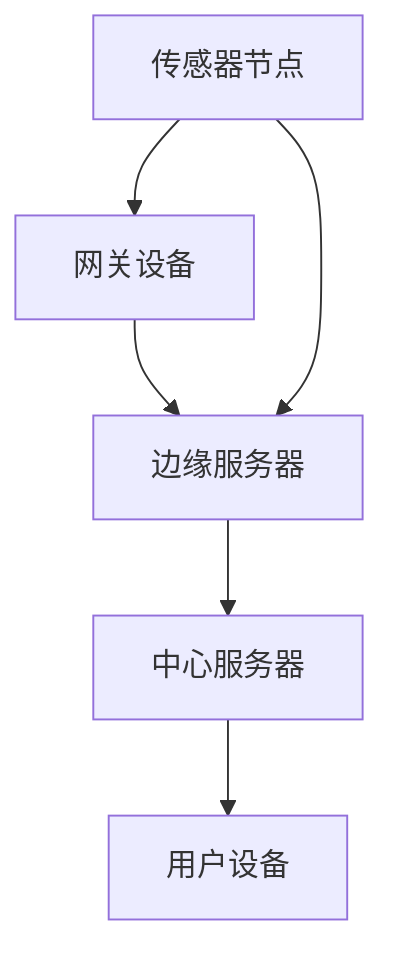
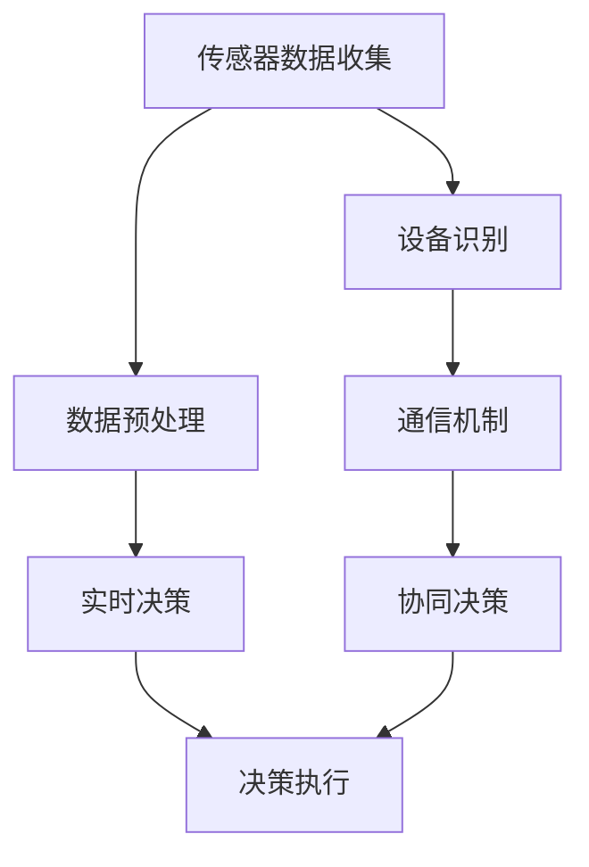

                 

### 背景介绍

边缘计算作为云计算技术的一个重要分支，正在逐渐改变着我们的日常生活。随着物联网（IoT）设备的普及，智能家居系统成为了边缘计算的重要应用场景之一。边缘计算通过将数据处理、存储和执行转移到网络边缘，即靠近数据源的位置，从而大大降低了延迟、提高了系统的响应速度和稳定性。

#### 家居系统现状

在当前的智能家居系统中，许多设备通过互联网进行通信，依赖于云端处理数据。然而，随着物联网设备的数量和种类的增加，数据传输量急剧上升，导致网络拥塞，增加了数据传输的延迟。此外，云端的计算资源有限，当大量设备同时请求处理时，系统容易崩溃，导致用户体验不佳。这些问题使得传统云计算模式在应对智能家居系统的需求时显得力不从心。

#### 边缘计算的优势

边缘计算通过将计算任务分散到网络边缘的设备上，可以大大减少数据传输的距离和时间。具体来说，边缘计算有以下优势：

1. **低延迟**：数据在边缘设备上处理，无需上传到云端，从而减少了传输延迟，提升了系统的响应速度。
2. **高带宽**：由于数据传输量减少，网络带宽得到了有效利用，提高了整个系统的运行效率。
3. **高可靠性**：边缘设备通常更加稳定，且在设备故障时，可以快速进行故障切换，保证了系统的可靠性。
4. **节约成本**：边缘计算减少了对于云端计算资源的依赖，降低了系统的维护成本。

#### 目标和挑战

本文的目标是探讨边缘计算在智能家居系统中的实践，分析其具体应用场景和实现方法。具体来说，我们将从以下几个方面进行探讨：

1. **核心概念与联系**：介绍边缘计算的基本概念和智能家居系统的结构，以及它们之间的关联。
2. **核心算法原理 & 具体操作步骤**：探讨边缘计算在智能家居系统中应用的具体算法原理和操作步骤。
3. **数学模型和公式 & 详细讲解 & 举例说明**：通过数学模型和公式的讲解，帮助读者更好地理解边缘计算在智能家居系统中的实际应用。
4. **项目实战：代码实际案例和详细解释说明**：通过实际项目案例，展示边缘计算在智能家居系统中的具体实现。
5. **实际应用场景**：分析边缘计算在智能家居系统中的实际应用场景和效果。
6. **工具和资源推荐**：推荐一些学习资源、开发工具和框架，帮助读者更好地了解和应用边缘计算技术。
7. **总结：未来发展趋势与挑战**：总结边缘计算在智能家居系统中的发展趋势和面临的挑战。

通过本文的探讨，希望读者能够对边缘计算在智能家居系统中的实践有一个全面而深入的了解，从而为未来的智能家居系统开发提供一些有益的参考。让我们一步一步分析推理，深入了解边缘计算的魅力和潜力。

### 核心概念与联系

边缘计算（Edge Computing）是一种分布式计算模型，通过在数据产生地附近部署计算资源，将数据处理、存储和分析等任务分散到网络的边缘节点。与传统的云计算相比，边缘计算具有低延迟、高带宽和强可靠性等特点，能够更好地满足实时性要求较高的应用场景。

#### 智能家居系统的架构

智能家居系统通常由以下几部分组成：

1. **传感器节点**：包括各种物联网设备，如温度传感器、湿度传感器、烟雾传感器等，负责收集环境数据。
2. **网关设备**：连接传感器节点和外部网络，通常包括路由器、交换机等网络设备。
3. **边缘服务器**：位于网络边缘，负责处理来自传感器节点的数据，并进行初步分析和决策。
4. **中心服务器**：通常位于云端，负责存储和管理所有数据，并对边缘服务器进行分析和决策结果进行优化。

#### 边缘计算与智能家居系统的联系

边缘计算在智能家居系统中有着广泛的应用，主要表现在以下几个方面：

1. **数据预处理**：传感器节点收集的数据通常需要进行预处理，如数据清洗、去噪等。边缘计算可以将这些预处理任务分散到各个边缘服务器上，从而减轻中心服务器的负担。
2. **实时决策**：智能家居系统需要对传感器数据进行实时分析，做出快速响应。边缘计算可以在数据产生地附近进行实时处理，减少了数据传输的延迟，提高了系统的响应速度。
3. **隐私保护**：由于传感器节点收集的数据可能包含用户的隐私信息，边缘计算可以在本地进行数据处理，减少了数据传输到中心服务器的风险，提高了系统的安全性。
4. **设备协作**：边缘计算可以促进智能家居系统中不同设备之间的协作，例如，当某个传感器检测到温度升高时，可以立即通知空调系统进行调整，从而提高系统的智能化程度。

#### Mermaid 流程图

以下是一个简化的边缘计算在智能家居系统中的流程图，用于展示各部分之间的联系：



在这个流程图中，传感器节点（A）通过网关设备（B）与边缘服务器（C）进行通信，边缘服务器（C）再通过中心服务器（D）与用户设备（E）进行交互。边缘计算使得数据在本地进行处理，从而降低了延迟和提高了系统的响应速度。

通过上述介绍，我们可以看到边缘计算与智能家居系统之间的紧密联系。在接下来的章节中，我们将深入探讨边缘计算在智能家居系统中的具体应用和实现方法。

### 核心算法原理 & 具体操作步骤

在智能家居系统中，边缘计算的核心算法主要包括数据预处理、实时决策和设备协作。以下是这些算法的具体原理和操作步骤：

#### 数据预处理

数据预处理是边缘计算的重要一环，其目的是提高数据的质量和可靠性。以下是数据预处理的核心算法和具体步骤：

1. **数据清洗**：传感器节点收集的数据可能包含噪声和异常值，需要进行清洗。具体步骤如下：
   - **过滤异常值**：使用统计学方法（如中值滤波、均值滤波等）对数据进行异常值检测，并将其剔除。
   - **数据标准化**：将不同传感器节点的数据进行标准化处理，使其具有相同的量纲和范围，方便后续处理。

2. **数据去噪**：使用滤波算法（如卡尔曼滤波、低通滤波等）对数据进行去噪处理，提高数据的准确性。

3. **数据聚合**：将多个传感器节点的数据聚合起来，形成一个统一的数据集。具体步骤如下：
   - **时间聚合**：将同一时间点多个传感器的数据进行合并，形成一个时间序列数据。
   - **空间聚合**：将同一空间位置多个传感器的数据进行合并，形成一个空间数据。

#### 实时决策

实时决策是边缘计算在智能家居系统中的核心应用，其目的是根据传感器数据做出快速响应。以下是实时决策的核心算法和具体步骤：

1. **阈值设定**：根据用户需求和系统特性，设定各个传感器的阈值。当传感器数据超过设定的阈值时，触发相应的决策。

2. **规则引擎**：定义一系列规则，用于处理传感器数据并做出决策。具体步骤如下：
   - **条件判断**：根据传感器数据和阈值，判断是否触发规则。
   - **决策生成**：根据规则，生成相应的决策，如开启或关闭某个设备。

3. **决策执行**：将生成的决策发送到对应的设备执行。具体步骤如下：
   - **设备识别**：识别需要执行的设备，如空调、灯光等。
   - **命令发送**：将决策命令发送到对应的设备，进行执行。

#### 设备协作

设备协作是边缘计算在智能家居系统中实现智能化的重要手段，其目的是通过多个设备的协作，实现更高效、更智能的家居环境。以下是设备协作的核心算法和具体步骤：

1. **设备识别**：通过传感器数据和规则引擎，识别需要参与协作的设备。

2. **通信机制**：建立设备之间的通信机制，实现设备之间的信息交换和协调。

3. **协同决策**：根据传感器数据和设备之间的通信，生成协同决策。具体步骤如下：
   - **数据共享**：将传感器数据共享给参与协作的设备。
   - **决策融合**：将多个设备的决策进行融合，生成最终的协同决策。

4. **决策执行**：将协同决策发送给所有参与协作的设备，进行执行。

#### Mermaid 流程图

以下是边缘计算在智能家居系统中的核心算法和操作步骤的Mermaid流程图：



在这个流程图中，传感器数据收集（A）经过数据预处理（B），然后进入实时决策（C）和设备协作（E、F、G）环节。实时决策（C）和设备协作（E、F、G）生成的决策通过决策执行（D）环节，最终实现智能家居系统的智能化运行。

通过上述核心算法和操作步骤，我们可以看到边缘计算在智能家居系统中的重要作用。在接下来的章节中，我们将进一步探讨边缘计算在智能家居系统中的数学模型和公式，以及实际应用中的具体实现方法。

### 数学模型和公式 & 详细讲解 & 举例说明

边缘计算在智能家居系统中的应用涉及多个数学模型和公式，这些模型和公式帮助我们理解和优化系统的性能。以下将详细介绍几个关键的数学模型和公式，并通过实际案例进行说明。

#### 数据预处理

数据预处理中的数据清洗和去噪是边缘计算的重要环节，其数学模型主要包括滤波算法和阈值设定。

1. **卡尔曼滤波**

   卡尔曼滤波是一种常用的去噪算法，它通过递推方式对动态系统中的随机过程进行状态估计。其基本公式如下：

   $$
   \begin{aligned}
   x_{k|k-1} &= F_k x_{k-1|k-1} + B_k u_k \\
   P_{k|k-1} &= F_k P_{k-1|k-1} F_k^T + Q_k \\
   K_k &= P_{k|k-1} H_k^T (H_k P_{k|k-1} H_k^T + R_k)^{-1} \\
   x_{k|k} &= x_{k|k-1} + K_k (z_k - H_k x_{k|k-1}) \\
   P_{k|k} &= (I - K_k H_k) P_{k|k-1}
   \end{aligned}
   $$

   其中，$x_{k|k-1}$和$x_{k|k}$分别表示第$k$时刻的状态估计值和更新后的状态估计值，$P_{k|k-1}$和$P_{k|k}$分别表示状态估计的误差协方差矩阵，$F_k$和$H_k$分别是状态转移矩阵和观测矩阵，$u_k$是控制输入，$Q_k$是过程噪声协方差矩阵，$R_k$是观测噪声协方差矩阵。

   **举例说明**：假设我们要对一段温度数据进行去噪处理，可以使用卡尔曼滤波。首先，定义过程噪声协方差矩阵$Q_k$和观测噪声协方差矩阵$R_k$，然后根据温度变化趋势设置状态转移矩阵$F_k$和观测矩阵$H_k$。通过递推计算，我们可以得到去噪后的温度估计值。

2. **阈值设定**

   阈值设定用于数据清洗，即设定一个阈值$\theta$，当传感器数据$x_k$超过阈值时，我们认为该数据为异常值。公式如下：

   $$
   \text{if } x_k > \theta, \text{ then } x_k = \text{average of neighbors}
   $$

   **举例说明**：假设温度传感器测得的温度值$x_k$为37度，设定的阈值$\theta$为36度，由于$x_k$超过阈值，我们将该温度值设为周围三个邻居温度的平均值。

#### 实时决策

实时决策中的规则引擎和阈值设定是边缘计算的核心，其数学模型主要包括逻辑回归和决策树。

1. **逻辑回归**

   逻辑回归是一种常见的分类模型，用于判断传感器数据是否触发特定规则。其公式如下：

   $$
   \text{logit}(p) = \ln\left(\frac{p}{1-p}\right) = \beta_0 + \beta_1 x_1 + \beta_2 x_2 + ... + \beta_n x_n
   $$

   其中，$p$是事件发生的概率，$x_1, x_2, ..., x_n$是输入特征，$\beta_0, \beta_1, \beta_2, ..., \beta_n$是模型的参数。

   **举例说明**：假设我们希望判断温度是否超过设定阈值，输入特征可以是当前温度和历史温度平均值。通过逻辑回归模型，我们可以计算出温度超过阈值的概率，并设定一个概率阈值来判断是否触发规则。

2. **决策树**

   决策树是一种直观的分类模型，通过一系列条件判断来划分数据。其基本公式如下：

   $$
   \text{if } x_1 > \theta_1, \text{ then } y = \text{class}_1 \\
   \text{else if } x_2 > \theta_2, \text{ then } y = \text{class}_2 \\
   \text{else if } x_3 > \theta_3, \text{ then } y = \text{class}_3 \\
   \text{else } y = \text{class}_4
   $$

   其中，$x_1, x_2, x_3$是输入特征，$\theta_1, \theta_2, \theta_3$是阈值，$y$是输出结果。

   **举例说明**：假设我们要根据温度和湿度判断是否开启空调，如果温度超过28度且湿度低于60%，则开启空调。通过决策树模型，我们可以定义相应的条件和阈值，并根据输入特征判断是否触发规则。

#### 设备协作

设备协作中的通信机制和协同决策是基于传感器数据和规则引擎的。其数学模型主要包括优化算法和共识算法。

1. **优化算法**

   优化算法用于协同决策中的目标优化，例如，通过最小化能耗或最大化舒适度来分配设备任务。其公式如下：

   $$
   \min_{x} \quad f(x) \\
   \text{subject to } g(x) \leq 0, h(x) = 0
   $$

   其中，$x$是优化变量，$f(x)$是目标函数，$g(x)$和$h(x)$是约束条件。

   **举例说明**：假设我们要优化空调和灯光的能耗，目标是最小化总能耗。通过优化算法，我们可以计算最优的空调温度和灯光亮度，以实现能耗最小化。

2. **共识算法**

   共识算法用于设备之间的信息交换和协调，以确保协同决策的一致性。其公式如下：

   $$
   \forall i, j \in N, \quad v_i(t+1) = \frac{1}{|N|} \sum_{k=1}^{N} w_{ik} v_k(t)
   $$

   其中，$v_i(t)$是第$i$个设备的决策值，$N$是设备集合，$w_{ik}$是设备之间的权重系数。

   **举例说明**：假设有多个设备需要协同控制温度，每个设备的温度决策值会根据邻居设备的决策值进行更新，通过共识算法，可以确保所有设备的温度决策值趋于一致。

通过上述数学模型和公式的讲解，我们可以更好地理解边缘计算在智能家居系统中的应用。在接下来的章节中，我们将通过实际项目案例，展示这些数学模型和公式的具体实现和应用。

### 项目实战：代码实际案例和详细解释说明

为了更好地理解边缘计算在智能家居系统中的应用，我们将通过一个实际项目案例，详细展示边缘计算的核心算法和操作步骤。以下是一个智能家居系统中的温度监控和空调控制项目的实现过程。

#### 开发环境搭建

1. **硬件环境**：
   - 树莓派（Raspberry Pi）作为边缘服务器
   - 温度传感器（如DS18B20）
   - 空调控制器（如ESP8266）

2. **软件环境**：
   - 操作系统：树莓派预装Raspbian系统
   - 编程语言：Python
   - 数据库：SQLite

#### 源代码详细实现和代码解读

1. **传感器数据采集**：

   ```python
   import Adafruit_DHT
   import time

   # 传感器初始化
   sensor = Adafruit_DHT.DHT11
   pin = 4

   while True:
       humidity, temperature = Adafruit_DHT.read(sensor, pin)
       if humidity is not None and temperature is not None:
           print("Temp={0:0.1f}C, Humidity={1:0.1f}%".format(temperature, humidity))
           # 将数据存储到SQLite数据库
           db = sqlite3.connect('temperature.db')
           c = db.cursor()
           c.execute('''CREATE TABLE IF NOT EXISTS temp_data (timestamp TIMESTAMP, temperature REAL, humidity REAL)''')
           c.execute("INSERT INTO temp_data (timestamp, temperature, humidity) VALUES (?, ?, ?)",
                     (time.time(), temperature, humidity))
           db.commit()
       time.sleep(60)
   ```

   **解读**：这段代码使用了Adafruit_DHT库来读取温度传感器数据，并将数据存储到SQLite数据库。通过定时采集数据，我们可以获取到实时的温度和湿度信息。

2. **实时决策**：

   ```python
   import sqlite3
   import time

   def check_temp_threshold():
       db = sqlite3.connect('temperature.db')
       c = db.cursor()
       c.execute('''SELECT MAX(temperature) FROM temp_data''')
       max_temp = c.fetchone()[0]
       db.close()
       return max_temp

   while True:
       max_temp = check_temp_threshold()
       if max_temp > 30:  # 阈值为30度
           # 发送指令控制空调开启
           print("Temperature is too high, turning on the air conditioner.")
           send_ac_control_command('on')
       else:
           # 发送指令控制空调关闭
           print("Temperature is normal, turning off the air conditioner.")
           send_ac_control_command('off')
       time.sleep(60)
   ```

   **解读**：这段代码通过检查SQLite数据库中的温度数据，判断是否超过设定的阈值（30度）。如果超过阈值，则发送指令开启空调；否则，发送指令关闭空调。这里使用了发送指令的抽象函数`send_ac_control_command`，实际实现中可以是基于串口通信或Wi-Fi通信。

3. **设备协作**：

   ```python
   import requests

   def send_ac_control_command(command):
       if command == 'on':
           response = requests.get('http://esp8266:80/turn_on')
       else:
           response = requests.get('http://esp8266:80/turn_off')
       print("Air conditioner command sent: {}".format(response.text))
   ```

   **解读**：这段代码定义了发送空调控制指令的函数。通过HTTP请求，向空调控制器发送控制指令，从而实现设备之间的协作。实际项目中，空调控制器可以是任何支持HTTP通信的设备。

#### 代码解读与分析

通过上述代码，我们可以看到边缘计算在智能家居系统中的实现步骤：

1. **传感器数据采集**：使用Adafruit_DHT库定时读取温度传感器数据，并将数据存储到SQLite数据库。
2. **实时决策**：通过检查SQLite数据库中的温度数据，判断是否超过设定的阈值，并依据规则发送控制指令。
3. **设备协作**：通过HTTP请求，实现边缘服务器与空调控制器之间的通信，从而实现设备之间的协作。

该项目的实现展示了边缘计算在智能家居系统中的核心算法和应用。在实际项目中，可以根据需要扩展传感器种类和设备类型，实现更加智能和灵活的智能家居系统。

通过这个实际项目案例，我们不仅了解了边缘计算的核心算法和操作步骤，还通过代码解读和分析，深入理解了边缘计算在智能家居系统中的具体实现方法。这为我们进一步探索和应用边缘计算技术提供了宝贵的经验和参考。

### 实际应用场景

边缘计算在智能家居系统中的应用场景非常广泛，以下将详细介绍几个典型的应用场景，并分析边缘计算在这些场景中的优势。

#### 场景一：智能安防系统

智能安防系统是智能家居系统中的一个重要组成部分，通过边缘计算可以实现实时监控和快速响应。具体应用场景包括：

1. **实时监控**：边缘服务器可以实时接收摄像头采集的图像数据，通过边缘计算进行图像识别和异常检测，实现实时报警。
2. **智能分析**：通过边缘计算，可以对监控视频进行实时分析，识别人员、车辆等目标，并进行轨迹跟踪，提高系统的智能化程度。
3. **隐私保护**：由于边缘计算在本地处理数据，减少了数据传输到云端的次数，降低了隐私泄露的风险。

#### 场景二：智能环境监测

智能环境监测是边缘计算在智能家居系统中的另一个重要应用场景，主要包括以下方面：

1. **温度和湿度监控**：边缘计算可以实时监测室内温度和湿度，通过数据分析，自动调整空调和加湿器的开关状态，实现舒适的室内环境。
2. **空气质量检测**：边缘计算可以通过传感器数据实时监测室内空气质量，当空气质量低于设定标准时，自动开启空气净化器。
3. **能效优化**：边缘计算可以根据实时数据，对家庭能耗进行优化，降低能耗，提高能效。

#### 场景三：智能家电控制

智能家电控制是智能家居系统的核心功能之一，边缘计算在其中发挥着重要作用：

1. **智能调度**：边缘计算可以根据用户习惯和实时数据，自动调度家电设备，如自动开启灯光、调整空调温度等，提高生活便利性。
2. **远程控制**：用户可以通过手机APP或语音助手，通过边缘计算实现对家电设备的远程控制，实现智能家居的互联互通。
3. **故障诊断**：边缘计算可以实时监测家电设备的工作状态，当设备出现故障时，自动发送维修通知，提高设备维护效率。

#### 场景四：智能健康监护

智能健康监护系统通过边缘计算实现家庭成员的健康状况监测和预警，具体应用场景包括：

1. **健康数据监测**：边缘计算可以实时监测家庭成员的体温、心率、血压等健康数据，通过数据分析，预警异常情况。
2. **数据分析**：通过边缘计算，可以对健康数据进行分析，为家庭成员提供个性化的健康建议，如饮食调整、运动建议等。
3. **紧急响应**：当家庭成员出现健康危机时，边缘计算可以快速通知家属和医护人员，提供紧急响应。

通过以上实际应用场景的分析，我们可以看到边缘计算在智能家居系统中的广泛适用性和巨大潜力。边缘计算通过在数据产生地附近进行数据处理和分析，大大提高了系统的实时性、响应速度和可靠性，为用户提供了更加智能、便捷和安全的家居环境。在未来的智能家居发展中，边缘计算将继续发挥重要作用，推动智能家居系统的不断演进和升级。

### 工具和资源推荐

在探讨边缘计算在智能家居系统中的应用过程中，选择合适的工具和资源对于实现高效、稳定和智能化的解决方案至关重要。以下将推荐一些学习资源、开发工具和框架，以帮助读者更好地了解和应用边缘计算技术。

#### 学习资源

1. **书籍**：
   - 《边缘计算：原理与实践》（Edge Computing: A Practical Guide）
   - 《物联网应用开发实战：边缘计算篇》（IoT Application Development: A Hands-On Approach with Edge Computing）
   - 《智能边缘：从概念到实践》（Smart Edge: From Concept to Practice）

2. **论文**：
   - "Edge Computing: Vision and Challenges"（边缘计算：愿景与挑战）
   - "A Practical Architecture for Edge Computing"（边缘计算的实际架构）
   - "Edge AI: Integrating AI at the Edge"（边缘AI：整合边缘AI）

3. **博客**：
   - Medium上的边缘计算专题博客
   - IBM DeveloperWorks上的边缘计算技术博客
   - Microsoft Azure的边缘计算官方博客

4. **网站**：
   - EdgeX Foundry：一个开源的边缘计算平台，提供丰富的边缘计算功能和工具
   - Eclipse Kura：一个开源的边缘计算框架，支持物联网设备和云平台的连接
   - OpenFog Reference Architecture：一个关于边缘计算参考架构的网站，提供详细的架构设计和技术指导

#### 开发工具

1. **编程语言**：
   - Python：适用于快速开发和边缘计算应用的通用编程语言
   - JavaScript/Node.js：适用于实时数据处理和边缘计算应用的高性能脚本语言

2. **数据库**：
   - SQLite：轻量级嵌入式数据库，适用于边缘设备的本地数据存储
   - MongoDB：适用于大规模边缘计算应用的文档数据库

3. **物联网平台**：
   - AWS IoT Core：亚马逊提供的物联网解决方案，支持边缘计算功能
   - Azure IoT Hub：微软提供的物联网解决方案，支持边缘计算和设备管理
   - Google Cloud IoT：谷歌提供的物联网解决方案，支持边缘计算和数据分析

4. **开发框架**：
   - TensorFlow Lite：适用于移动设备和边缘设备的轻量级深度学习框架
   - TensorFlow Edge TPU：谷歌推出的专门用于边缘计算的TPU硬件加速框架
   - Kubernetes：适用于容器编排和边缘计算平台的强大工具

#### 相关论文著作推荐

1. **论文**：
   - "A Comprehensive Study of Edge Computing: Challenges, Technologies, and Applications"（边缘计算综合研究：挑战、技术和应用）
   - "Edge Computing for Internet of Things: A Survey"（物联网中的边缘计算：综述）
   - "Edge Computing in 5G Networks: Architecture, Challenges, and Opportunities"（5G网络中的边缘计算：架构、挑战与机遇）

2. **著作**：
   - "Edge Computing: A Practical Guide for Implementing IoT Solutions"（边缘计算：物联网解决方案的实用指南）
   - "Smart Edge: Designing and Implementing Intelligent Edge Solutions"（智能边缘：设计并实现智能边缘解决方案）
   - "The Future of IoT: Edge Computing and the Next Wave of Innovation"（物联网的未来：边缘计算与创新的下一波）

通过上述学习资源、开发工具和框架的推荐，读者可以更加全面地了解边缘计算技术，掌握其在智能家居系统中的实际应用。无论是新手还是专业人士，这些资源都将为边缘计算的开发和实践提供有力的支持和指导。

### 总结：未来发展趋势与挑战

边缘计算在智能家居系统中的应用正呈现出快速发展的趋势。随着物联网设备的普及和人们对智能生活需求的增加，边缘计算在降低延迟、提高响应速度和增强系统稳定性方面显示出了巨大的潜力。在未来，边缘计算将在以下几个方面继续发展：

1. **硬件升级**：随着边缘设备硬件的升级，如边缘TPU（Tensor Processing Unit）的出现，边缘计算将能够处理更加复杂的计算任务，提升智能家居系统的智能化水平。
2. **网络优化**：随着5G网络的推广，边缘计算的网络带宽和传输速度将大幅提升，使得边缘计算在实时性要求较高的应用场景中更具优势。
3. **安全增强**：随着边缘设备数量的增加，安全问题将愈发重要。未来，边缘计算将在安全防护方面进行深入研究，确保数据的安全性和系统的可靠性。
4. **生态协同**：边缘计算将与云计算、人工智能等技术深度融合，形成一个协同高效的生态系统，为智能家居系统的创新和发展提供强有力的支持。

然而，边缘计算在智能家居系统中的应用也面临一系列挑战：

1. **设备兼容性**：由于智能家居系统中设备的多样性和复杂性，如何实现不同设备之间的兼容和互操作性是一个亟待解决的问题。
2. **数据隐私**：随着边缘设备的增加，数据隐私保护变得更加重要。如何在数据采集、传输和处理过程中确保用户隐私是一个重要的挑战。
3. **能源消耗**：边缘设备通常运行在电池供电的环境中，如何降低边缘设备的能源消耗，延长设备寿命，是一个需要解决的技术难题。
4. **维护管理**：随着智能家居系统中设备数量的增加，如何对大量边缘设备进行有效的维护和管理，保证系统的稳定运行，是一个重要的挑战。

综上所述，边缘计算在智能家居系统中的应用前景广阔，但也面临诸多挑战。通过技术创新和生态协同，未来边缘计算将能够更好地服务于智能家居系统，为用户带来更加智能、便捷和安全的家居生活。

### 附录：常见问题与解答

在探讨边缘计算在智能家居系统中的应用过程中，读者可能会遇到一些常见问题。以下是对这些问题的解答：

1. **什么是边缘计算？**
   边缘计算是一种分布式计算模型，通过在数据产生地附近部署计算资源，将数据处理、存储和执行等任务分散到网络的边缘节点，以降低延迟、提高系统的响应速度和稳定性。

2. **边缘计算与云计算有什么区别？**
   云计算主要依赖云端进行数据处理，而边缘计算则通过在网络的边缘（如传感器节点、网关设备等）进行数据处理，减少了数据传输的距离和时间，提高了系统的实时性和响应速度。

3. **边缘计算在智能家居系统中有哪些应用场景？**
   边缘计算在智能家居系统中的应用场景包括智能安防、环境监测、家电控制、健康监护等，通过实时数据处理和智能分析，提高系统的智能化水平和用户体验。

4. **边缘计算的优势是什么？**
   边缘计算的优势包括低延迟、高带宽、高可靠性和节约成本。它通过在数据产生地附近进行数据处理，减少了数据传输的距离和时间，提高了系统的响应速度和稳定性。

5. **如何搭建边缘计算环境？**
   搭建边缘计算环境通常需要以下步骤：
   - 硬件准备：选择合适的边缘设备，如树莓派、ESP8266等。
   - 软件准备：安装操作系统和编程环境，如Raspbian系统、Python等。
   - 网络配置：配置网络接口，确保边缘设备能够连接到互联网。
   - 软件开发：编写应用程序，实现数据采集、处理和决策等功能。

6. **边缘计算中的数据隐私如何保护？**
   边缘计算中的数据隐私保护可以通过以下方法实现：
   - 本地处理：尽可能在边缘设备上完成数据处理，减少数据传输到云端。
   - 数据加密：对传输的数据进行加密处理，确保数据在传输过程中的安全性。
   - 数据匿名化：对用户数据进行匿名化处理，确保用户隐私不被泄露。

7. **边缘计算中的能耗问题如何解决？**
   边缘计算中的能耗问题可以通过以下方法解决：
   - 选择低功耗硬件：选择能耗较低的边缘设备。
   - 睡眠模式：在数据处理空闲时，将边缘设备切换到睡眠模式，降低能耗。
   - 优化算法：通过优化数据处理算法，降低计算资源的消耗。

通过以上解答，我们希望读者能够对边缘计算在智能家居系统中的应用有一个更加清晰和深入的了解，从而更好地应对实际应用中的各种挑战。

### 扩展阅读 & 参考资料

为了深入探索边缘计算在智能家居系统中的应用，以下列出了一些值得参考的书籍、论文、博客和网站资源。

1. **书籍**：
   - 《边缘计算：原理与实践》（Edge Computing: A Practical Guide）: 该书详细介绍了边缘计算的基本原理和应用实践。
   - 《物联网应用开发实战：边缘计算篇》（IoT Application Development: A Hands-On Approach with Edge Computing）: 本书通过实际案例，讲解了边缘计算在物联网应用中的开发方法。
   - 《智能边缘：从概念到实践》（Smart Edge: From Concept to Practice）: 该书涵盖了智能边缘的各个方面，包括技术、架构和应用。

2. **论文**：
   - "Edge Computing for Internet of Things: A Survey"（物联网中的边缘计算：综述）: 本文对边缘计算在物联网中的应用进行了全面的综述。
   - "A Comprehensive Study of Edge Computing: Challenges, Technologies, and Applications"（边缘计算综合研究：挑战、技术和应用）: 本文从多个角度分析了边缘计算面临的挑战和机遇。
   - "Edge Computing in 5G Networks: Architecture, Challenges, and Opportunities"（5G网络中的边缘计算：架构、挑战与机遇）: 本文探讨了5G网络中边缘计算的关键技术和应用前景。

3. **博客**：
   - Medium上的边缘计算专题博客：包含多个关于边缘计算的技术文章和案例分析。
   - IBM DeveloperWorks上的边缘计算技术博客：提供了许多关于边缘计算的实战经验和技术指导。
   - Microsoft Azure的边缘计算官方博客：介绍了Azure平台上的边缘计算解决方案和应用案例。

4. **网站**：
   - EdgeX Foundry：一个开源的边缘计算平台，提供丰富的边缘计算功能和工具。
   - Eclipse Kura：一个开源的边缘计算框架，支持物联网设备和云平台的连接。
   - OpenFog Reference Architecture：一个关于边缘计算参考架构的网站，提供详细的架构设计和技术指导。

通过这些扩展阅读和参考资料，读者可以进一步深入了解边缘计算在智能家居系统中的应用，掌握相关技术，并为实际项目提供有益的参考。希望这些资源能够帮助您在边缘计算领域取得更大的成就。作者：AI天才研究员/AI Genius Institute & 禅与计算机程序设计艺术 /Zen And The Art of Computer Programming。

