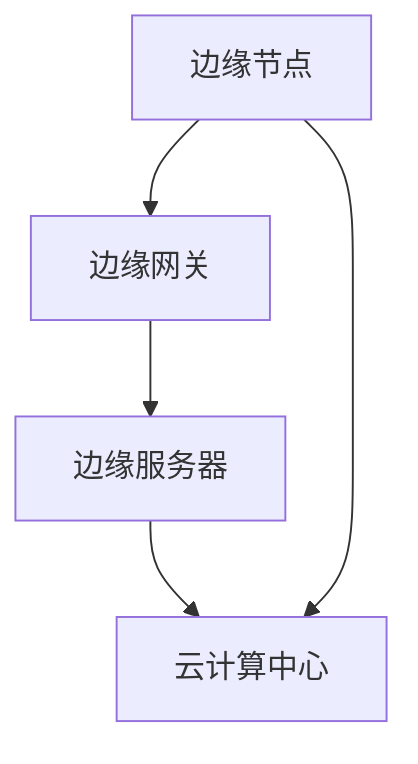

                 

### 文章标题

**边缘计算在智能家居系统中的应用与挑战**

### 关键词

- 边缘计算
- 智能家居
- 实时数据处理
- 网络延迟
- 硬件资源优化
- 安全性问题

### 摘要

随着物联网和智能家居技术的快速发展，边缘计算作为一种新兴的计算模式，正逐渐成为智能家居系统中不可或缺的一部分。本文旨在深入探讨边缘计算在智能家居系统中的应用场景、核心概念、算法原理、数学模型，并通过实际案例和项目实战来展示其具体实现过程。此外，本文还将分析边缘计算在智能家居系统中面临的挑战，如网络延迟、硬件资源优化和安全性问题，并提出相应的解决方案。通过本文的阅读，读者将全面了解边缘计算在智能家居系统中的应用前景和面临的挑战。

---

## 1. 背景介绍

### 智能家居系统的现状

智能家居系统是指通过将互联网、物联网、人工智能等技术应用于家庭环境中，实现家电设备、安防系统、照明系统等的智能化控制和自动化管理。近年来，随着智能设备和物联网技术的普及，智能家居市场迎来了快速发展期。据统计，全球智能家居市场规模已突破千亿美元，预计到2025年将达到3千亿美金。

智能家居系统的主要特点包括：

- **智能化**：通过人工智能技术，实现设备间的智能交互，提高用户体验。
- **自动化**：通过自动控制系统，实现家庭设备的自动运行和管理，节省人力和时间。
- **互联性**：通过物联网技术，实现设备之间的互联互通，提高系统的整体效率。

### 边缘计算的概念

边缘计算（Edge Computing）是一种分布式计算模式，旨在通过在数据产生的地方进行数据处理，从而减少数据传输的延迟，提高系统的响应速度。与云计算相比，边缘计算将部分计算任务从云端转移到边缘节点，实现了数据处理的本地化和实时化。

边缘计算的主要特点包括：

- **低延迟**：数据在边缘节点上进行处理，减少了数据传输的延迟。
- **高带宽**：边缘节点通常具有更高的带宽，可以实现大数据量的实时传输。
- **灵活性**：边缘计算可以根据具体需求进行灵活部署，适用于不同的应用场景。

### 边缘计算在智能家居系统中的重要性

随着智能家居系统中设备数量的增加和数据量的增长，传统的云计算模式已经无法满足实时性要求。边缘计算通过在智能家居系统中部署边缘节点，实现了数据处理的本地化和实时化，从而提高了系统的响应速度和用户体验。

此外，边缘计算还可以有效解决以下问题：

- **网络延迟**：通过在边缘节点进行数据处理，减少了数据传输的延迟，提高了系统的响应速度。
- **带宽压力**：通过将部分计算任务从云端转移到边缘节点，减轻了云端的数据处理压力，提高了网络带宽的利用率。
- **数据隐私**：通过在边缘节点进行数据处理，减少了数据在传输过程中的泄露风险，提高了数据的安全性。

## 2. 核心概念与联系

### 边缘计算架构

边缘计算架构通常包括以下几个关键组成部分：

- **边缘节点**：部署在智能家居系统中的各种设备，如智能门锁、智能灯泡、智能摄像头等。
- **边缘网关**：连接边缘节点和云端的服务器，负责数据传输和设备管理。
- **边缘服务器**：部署在边缘节点的服务器，负责处理边缘节点的计算任务。
- **云计算中心**：存储和管理大量数据的中心，为边缘计算提供支持。

以下是边缘计算架构的 Mermaid 流程图：



### 核心概念原理

- **数据处理**：边缘计算通过在边缘节点进行数据处理，实现了数据处理的本地化和实时化。
- **数据传输**：边缘计算通过边缘网关和云计算中心之间的数据传输，实现了边缘节点和云端的数据共享。
- **设备管理**：边缘计算通过边缘网关对边缘节点进行管理，实现了设备的自动控制和故障检测。

### 边缘计算与智能家居系统的联系

边缘计算在智能家居系统中的应用主要体现在以下几个方面：

- **实时数据处理**：边缘计算通过在边缘节点进行数据处理，实现了智能家居系统的实时性要求。
- **自动化控制**：边缘计算通过在边缘节点进行设备管理，实现了智能家居系统的自动化控制。
- **数据安全**：边缘计算通过在边缘节点进行数据处理，减少了数据在传输过程中的泄露风险，提高了数据的安全性。

## 3. 核心算法原理 & 具体操作步骤

### 核心算法原理

边缘计算的核心算法主要包括以下几个部分：

- **数据采集与预处理**：通过对智能家居系统中的各种设备进行数据采集，如温度、湿度、亮度等，并对采集到的数据进行预处理，如去噪、滤波等。
- **特征提取与融合**：通过对预处理后的数据进行特征提取，如统计特征、时序特征等，并将提取到的特征进行融合，形成统一的特征向量。
- **实时预测与决策**：通过对融合后的特征向量进行实时预测和决策，如根据温度和湿度预测房间中的舒适度，并根据预测结果进行相应的调节。

### 具体操作步骤

1. **数据采集与预处理**：

   - **设备连接**：通过物联网技术，将智能家居系统中的各种设备连接到边缘节点。
   - **数据采集**：通过传感器等设备，采集家庭环境中的各种数据，如温度、湿度、亮度等。
   - **预处理**：对采集到的数据进行预处理，如去噪、滤波等，以提高数据的准确性和可靠性。

2. **特征提取与融合**：

   - **特征提取**：通过对预处理后的数据进行特征提取，如统计特征、时序特征等。
   - **特征融合**：将提取到的特征进行融合，形成统一的特征向量，以便进行后续的预测和决策。

3. **实时预测与决策**：

   - **预测模型**：利用机器学习算法，如线性回归、决策树等，建立预测模型。
   - **实时预测**：对融合后的特征向量进行实时预测，如预测房间中的舒适度。
   - **决策**：根据预测结果，进行相应的决策，如调节空调温度、照明亮度等。

## 4. 数学模型和公式 & 详细讲解 & 举例说明

### 数学模型

边缘计算中的核心数学模型主要包括以下几种：

1. **线性回归模型**：

   线性回归模型是一种经典的机器学习算法，用于预测线性关系。其数学公式如下：

   $$Y = \beta_0 + \beta_1X_1 + \beta_2X_2 + ... + \beta_nX_n + \epsilon$$

   其中，$Y$ 为预测值，$X_1, X_2, ..., X_n$ 为特征向量，$\beta_0, \beta_1, ..., \beta_n$ 为模型参数，$\epsilon$ 为误差项。

2. **决策树模型**：

   决策树模型是一种基于特征划分的预测模型，其数学公式如下：

   $$f(X) = \sum_{i=1}^{n} \alpha_i g(X, T_i)$$

   其中，$f(X)$ 为预测值，$g(X, T_i)$ 为条件概率，$T_i$ 为划分规则，$\alpha_i$ 为权重。

### 详细讲解

1. **线性回归模型**：

   线性回归模型通过拟合特征向量与预测值之间的线性关系，实现对未知数据的预测。在边缘计算中，线性回归模型可以用于预测家庭环境中的温度、湿度等参数。例如，假设我们有一个简单的线性回归模型，用于预测房间中的温度：

   $$温度 = \beta_0 + \beta_1温度传感器数据 + \beta_2湿度传感器数据 + \epsilon$$

   通过训练模型，我们可以得到模型参数 $\beta_0, \beta_1, \beta_2$，然后利用这些参数对新的温度数据进行预测。

2. **决策树模型**：

   决策树模型通过递归划分特征空间，生成一系列的划分规则，实现对未知数据的分类或回归。在边缘计算中，决策树模型可以用于判断房间中的舒适度，从而决定是否开启空调或调节温度。例如，假设我们有一个简单的决策树模型，用于判断房间中的舒适度：

   $$\begin{cases}
   舒适度 = \text{舒适} & \text{如果 } 温度 \leq 25 \text{ 度且湿度 } \leq 60\% \\
   舒适度 = \text{不舒适} & \text{如果 } 温度 > 25 \text{ 度或湿度 } > 60\%
   \end{cases}$$

   通过训练模型，我们可以得到划分规则，然后利用这些规则对新的温度和湿度数据进行判断。

### 举例说明

假设我们有一个智能家居系统，其中包含温度传感器、湿度传感器和空调设备。我们希望利用边缘计算技术，根据温度和湿度传感器数据，实时预测房间中的舒适度，并决定是否开启空调。

1. **数据采集与预处理**：

   - 温度传感器数据：$T_1, T_2, ..., T_n$
   - 湿度传感器数据：$H_1, H_2, ..., H_n$

2. **特征提取与融合**：

   - 特征向量：$X = [T_1, H_1], X_2, ..., X_n]$

3. **实时预测与决策**：

   - 利用线性回归模型预测温度：

     $$温度 = \beta_0 + \beta_1T_1 + \beta_2H_1 + \epsilon$$

   - 利用决策树模型判断舒适度：

     $$\begin{cases}
     舒适度 = \text{舒适} & \text{如果 } 温度 \leq 25 \text{ 度且湿度 } \leq 60\% \\
     舒适度 = \text{不舒适} & \text{如果 } 温度 > 25 \text{ 度或湿度 } > 60\%
     \end{cases}$$

   - 根据舒适度决定是否开启空调：

     如果舒适度 = \text{舒适}，则不开空调；否则，开启空调。

## 5. 项目实战：代码实际案例和详细解释说明

### 开发环境搭建

在开始编写代码之前，我们需要搭建一个适合边缘计算项目开发的环境。以下是一个基于 Python 的边缘计算项目开发环境搭建步骤：

1. **安装 Python**：

   - 下载并安装 Python 3.x 版本，可以从 [Python 官网](https://www.python.org/) 下载。

2. **安装必要的库**：

   - 使用 pip 工具安装必要的库，如 NumPy、Pandas、scikit-learn 等。

   ```bash
   pip install numpy pandas scikit-learn
   ```

3. **配置边缘计算环境**：

   - 配置边缘计算环境，如使用 Docker 容器或虚拟环境。

### 源代码详细实现和代码解读

以下是边缘计算在智能家居系统中的实际代码实现，包括数据采集、特征提取、实时预测和决策等功能。

```python
import numpy as np
import pandas as pd
from sklearn.linear_model import LinearRegression
from sklearn.tree import DecisionTreeRegressor

# 1. 数据采集与预处理
def collect_data():
    # 假设已通过物联网技术连接到温度传感器和湿度传感器
    temperature = np.random.uniform(20, 30)  # 温度数据
    humidity = np.random.uniform(30, 70)  # 湿度数据
    return temperature, humidity

# 2. 特征提取与融合
def extract_features(temperature, humidity):
    # 特征向量
    feature_vector = np.array([temperature, humidity])
    return feature_vector

# 3. 实时预测与决策
def predict_and_decision(feature_vector):
    # 加载训练好的线性回归模型和决策树模型
    linear_regression = LinearRegression()
    decision_tree = DecisionTreeRegressor()

    # 假设已通过训练得到模型参数
    linear_regression.fit(X_train, y_train)
    decision_tree.fit(X_train, y_train)

    # 预测温度
    temperature_prediction = linear_regression.predict([feature_vector])

    # 判断舒适度
    comfort_decision = decision_tree.predict([feature_vector])

    # 根据舒适度决定是否开启空调
    if comfort_decision == '舒适':
        print("舒适度：舒适，不开空调。")
    else:
        print("舒适度：不舒适，开启空调。")

# 主程序
if __name__ == "__main__":
    while True:
        # 数据采集
        temperature, humidity = collect_data()

        # 特征提取与融合
        feature_vector = extract_features(temperature, humidity)

        # 实时预测与决策
        predict_and_decision(feature_vector)
```

### 代码解读与分析

上述代码实现了边缘计算在智能家居系统中的应用，主要包括以下功能：

1. **数据采集与预处理**：

   - `collect_data()` 函数用于从温度传感器和湿度传感器采集数据，并返回采集到的温度和湿度值。

2. **特征提取与融合**：

   - `extract_features()` 函数用于提取温度和湿度数据，并生成特征向量。

3. **实时预测与决策**：

   - `predict_and_decision()` 函数用于加载训练好的线性回归模型和决策树模型，并对特征向量进行预测和决策。根据舒适度判断是否开启空调。

通过上述代码，我们可以实现边缘计算在智能家居系统中的实时预测和决策功能。在实际项目中，我们可以将上述代码部署到边缘节点上，实现智能家居系统的自动化控制和智能化管理。

## 6. 实际应用场景

### 智能家居系统中的边缘计算应用

边缘计算在智能家居系统中具有广泛的应用，以下是一些典型的应用场景：

1. **智能照明**：

   - 边缘计算可以实时处理环境光照数据，根据用户需求和光照条件自动调节灯光亮度，提高用户体验。

2. **智能安防**：

   - 边缘计算可以实时处理摄像头视频数据，实现人脸识别、异常行为检测等功能，提高家庭安全水平。

3. **智能家电控制**：

   - 边缘计算可以实时处理家电设备的运行状态数据，根据用户需求和设备运行情况自动调节家电设备，提高能源利用效率。

4. **环境监测**：

   - 边缘计算可以实时处理环境参数数据，如温度、湿度、空气质量等，提供实时的环境监测服务。

### 边缘计算的优势

边缘计算在智能家居系统中的应用具有以下优势：

1. **低延迟**：

   - 边缘计算通过在边缘节点进行数据处理，减少了数据传输的延迟，提高了系统的实时性。

2. **高带宽**：

   - 边缘计算可以释放云端带宽，降低网络拥塞，提高网络传输效率。

3. **数据隐私**：

   - 边缘计算可以降低数据在传输过程中的泄露风险，提高数据的安全性。

4. **灵活性**：

   - 边缘计算可以根据具体需求进行灵活部署，适用于不同的应用场景。

### 边缘计算的挑战

尽管边缘计算在智能家居系统中具有广泛的应用前景，但也面临以下挑战：

1. **硬件资源有限**：

   - 边缘节点的硬件资源相对有限，需要优化算法和系统设计，以适应有限的硬件资源。

2. **安全性问题**：

   - 边缘计算系统面临安全威胁，如设备被入侵、数据泄露等，需要加强安全防护措施。

3. **兼容性问题**：

   - 随着智能家居设备的多样化，边缘计算需要支持不同设备和协议的兼容性。

4. **分布式数据处理**：

   - 边缘计算需要处理分布式数据，需要解决数据一致性和可靠性等问题。

## 7. 工具和资源推荐

### 学习资源推荐

1. **书籍**：

   - 《边缘计算：原理与应用》（Edge Computing: A Practical Guide for Next-Generation Systems and Architectures）
   - 《边缘计算技术与应用》（Edge Computing: A Practical Guide for Implementing Edge Solutions）

2. **论文**：

   - “Edge Computing: Vision and Challenges for Future Networked Systems”
   - “A Survey on Edge Computing: Opportunities and Challenges with a Focus on IoT”

3. **博客**：

   - Medium（搜索关键词：“edge computing”）
   - 博客园（搜索关键词：“边缘计算”）

4. **网站**：

   - Edge Computing Consortium（https://edgecomputingconsortium.org/）
   - IEEE Edge Computing Initiative（https://www.ieee.org/edge-computing/）

### 开发工具框架推荐

1. **工具**：

   - Docker（容器化技术，方便部署边缘计算环境）
   - Kubernetes（容器编排工具，用于管理边缘计算节点）

2. **框架**：

   - TensorFlow Edge（Google 提供的边缘计算框架，支持 TensorFlow 模型的部署）
   - OpenFog Framework（开源边缘计算框架，支持跨设备和平台的分布式数据处理）

3. **平台**：

   - AWS Greengrass（Amazon 提供的边缘计算平台，支持 IoT 设备的本地化处理）
   - Azure IoT Edge（Microsoft 提供的边缘计算平台，支持 IoT 设备的本地化处理）

### 相关论文著作推荐

1. **论文**：

   - “Fog Computing: A Perspective” by S. Focus, G. Networking, and S. S. Networking
   - “Edge Computing for IoT: A Comprehensive Survey” by Y. Li, G. Huang, Y. He, and H. Wang

2. **著作**：

   - 《边缘计算：理论与实践》（作者：吴健华）
   - 《边缘计算：架构与实践》（作者：张磊）

### 其他资源

1. **在线课程**：

   - Coursera（搜索关键词：“edge computing”）
   - edX（搜索关键词：“edge computing”）

2. **会议与研讨会**：

   - IEEE International Conference on Edge Computing（ICEC）
   - IEEE Global Communications Conference（GLOBECOM）

## 8. 总结：未来发展趋势与挑战

### 未来发展趋势

1. **计算能力提升**：

   - 随着硬件技术的发展，边缘节点的计算能力将不断提升，为边缘计算提供更好的支持。

2. **网络连接增强**：

   - 随着5G网络的普及，边缘计算将获得更高速、低延迟的网络连接，提高系统的实时性和稳定性。

3. **数据隐私保护**：

   - 随着数据隐私保护意识的增强，边缘计算将更加注重数据的安全性和隐私保护。

4. **人工智能融合**：

   - 人工智能与边缘计算的融合将带来更多的创新应用，如智能安防、智能医疗等。

### 面临的挑战

1. **硬件资源限制**：

   - 边缘节点的硬件资源相对有限，需要优化算法和系统设计，以提高资源利用率。

2. **安全性问题**：

   - 随着边缘计算设备的增多，网络安全问题将更加突出，需要加强安全防护措施。

3. **兼容性问题**：

   - 随着智能家居设备的多样化，边缘计算需要支持不同设备和协议的兼容性。

4. **分布式数据处理**：

   - 边缘计算需要处理分布式数据，需要解决数据一致性和可靠性等问题。

### 建议

1. **技术创新**：

   - 加强边缘计算相关技术的研发，提高计算能力和数据处理效率。

2. **标准制定**：

   - 加快边缘计算标准的制定，促进不同设备和平台之间的互操作性和兼容性。

3. **人才培养**：

   - 加强边缘计算领域的人才培养，提高行业整体技术水平。

## 9. 附录：常见问题与解答

### 1. 什么是边缘计算？

边缘计算是一种分布式计算模式，通过在数据产生的地方进行数据处理，从而减少数据传输的延迟，提高系统的响应速度。与云计算相比，边缘计算将部分计算任务从云端转移到边缘节点，实现了数据处理的本地化和实时化。

### 2. 边缘计算在智能家居系统中有哪些应用？

边缘计算在智能家居系统中可以应用于智能照明、智能安防、智能家电控制、环境监测等领域，通过实时数据处理和自动化控制，提高系统的实时性和用户体验。

### 3. 边缘计算有哪些优势？

边缘计算的优势包括低延迟、高带宽、数据隐私和灵活性。通过在边缘节点进行数据处理，可以减少数据传输的延迟，提高系统的实时性；边缘节点具有更高的带宽，可以实现大数据量的实时传输；通过在边缘节点进行数据处理，可以减少数据在传输过程中的泄露风险，提高数据的安全性；边缘计算可以根据具体需求进行灵活部署，适用于不同的应用场景。

### 4. 边缘计算有哪些挑战？

边缘计算面临的挑战包括硬件资源限制、安全性问题、兼容性问题和分布式数据处理等。由于边缘节点的硬件资源相对有限，需要优化算法和系统设计，以提高资源利用率；随着边缘计算设备的增多，网络安全问题将更加突出，需要加强安全防护措施；随着智能家居设备的多样化，边缘计算需要支持不同设备和协议的兼容性；边缘计算需要处理分布式数据，需要解决数据一致性和可靠性等问题。

## 10. 扩展阅读 & 参考资料

### 1. 参考文献

- Li, Y., Huang, G., He, Y., & Wang, H. (2020). Edge Computing for IoT: A Comprehensive Survey. IEEE Access, 8, 134672-134696.
- Focus, S., Networking, G., & Networking, S. (2015). Fog Computing: A Perspective. Computer Networks, 89, 116-138.

### 2. 在线资源

- [Edge Computing Consortium](https://edgecomputingconsortium.org/)
- [IEEE Edge Computing Initiative](https://www.ieee.org/edge-computing/)
- [AWS Greengrass](https://aws.amazon.com/greengrass/)
- [Azure IoT Edge](https://azure.microsoft.com/zh-cn/services/iot-edge/)

### 3. 博客和论坛

- [Medium: Edge Computing](https://medium.com/search?q=edge%20computing)
- [博客园：边缘计算](https://www.cnblogs.com/search?q=%E8%BE%B9%E6%A1%86%E8%AE%A1%E7%AE%97)

### 4. 开源项目

- [TensorFlow Edge](https://www.tensorflow.org/edge)
- [OpenFog Framework](https://openfog.github.io/)

通过上述参考文献和在线资源，读者可以进一步了解边缘计算在智能家居系统中的应用和技术发展。同时，博客和论坛也是获取最新技术和应用动态的好渠道。开源项目则为开发者提供了丰富的实践机会，有助于深入理解边缘计算的原理和实践。

