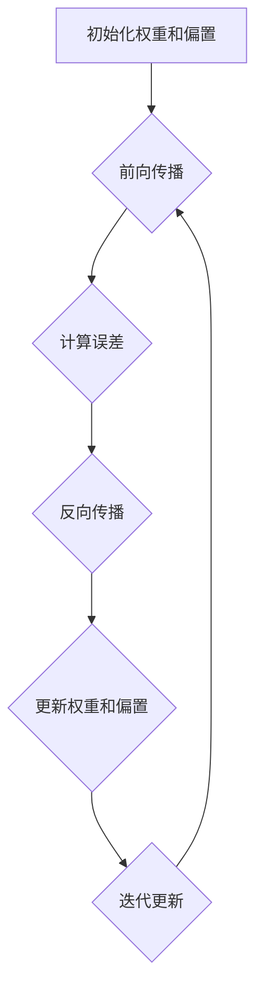

                 

### 背景介绍

#### 达特茅斯会议的起源

达特茅斯会议（Dartmouth Conference）是计算机科学史上具有重要意义的一次会议，它标志着人工智能（AI）作为一门独立学科的诞生。这场会议于1956年在美国新罕布什尔州的达特茅斯学院举行，由约翰·麦卡锡（John McCarthy）、马尔科姆·帕特里克·默里（Malcolm Perth Patrick M. Murray）、纳森尼尔·罗切斯特（Nathanial Rochester）和克劳德·香农（Claude Shannon）发起。

会议的初衷是探讨机器模拟智能的可行性，以及如何实现这一目标。这一目标的提出是基于当时计算机科学和数学领域的迅速发展，以及克劳德·香农在信息论方面的开创性工作。香农的信息论为计算机科学的发展提供了理论基础，也为人工智能的研究奠定了基础。

#### 会议背景

达特茅斯会议的背景可以追溯到20世纪中叶，计算机科学和数学领域的蓬勃发展。1940年代末期，计算机科学家艾伦·图灵（Alan Turing）提出了“图灵测试”，这一理论成为了人工智能领域的重要基石。同时，克劳德·香农在信息论方面的开创性工作，为计算机科学提供了新的视角和方法。

在物理学的量子力学和数学的集合论等领域，人们对于复杂系统的理解和控制也取得了重要进展。这些理论的发展为人工智能的研究提供了丰富的思想资源和技术手段。在这个背景下，达特茅斯会议的召开成为了计算机科学和人工智能领域的里程碑事件。

#### 会议的目标和成果

达特茅斯会议的主要目标是探讨机器模拟智能的可行性，以及如何实现这一目标。会议的核心议题包括：机器能否拥有人类水平的智能，如何设计智能机器，以及如何评估机器的智能水平。

会议的成果主要体现在以下几个方面：

1. **确立人工智能作为一门独立学科**：达特茅斯会议的召开，标志着人工智能从计算机科学的子领域独立出来，成为一门独立的学科。这一决定对于人工智能的发展产生了深远的影响。

2. **提出了人工智能的基本问题和方法**：会议期间，与会学者对人工智能的基本问题和方法进行了深入探讨。例如，如何模拟人类的思维过程，如何让机器具有自主学习和推理能力等。

3. **建立了人工智能研究的理论基础**：会议期间，学者们分享了克劳德·香农在信息论方面的研究成果，这些成果为人工智能的理论研究提供了重要基础。

4. **促进了跨学科合作**：达特茅斯会议吸引了来自计算机科学、数学、心理学、哲学等不同领域的学者参与，促进了跨学科的合作与交流。

#### 达特茅斯会议的影响

达特茅斯会议对于人工智能的发展产生了深远的影响。首先，它确立了人工智能作为一门独立学科的地位，为人工智能的研究提供了明确的学科方向。其次，会议提出了许多具有前瞻性的问题和方法，推动了人工智能技术的快速发展。

此外，达特茅斯会议促进了跨学科的合作与交流，为人工智能的发展提供了丰富的思想资源和技术手段。可以说，达特茅斯会议是人工智能历史上的一个重要转折点，它为人工智能的发展奠定了坚实的基础。

**Conclusion**

达特茅斯会议是计算机科学史上具有重要意义的一次会议，它标志着人工智能作为一门独立学科的诞生。会议的召开背景是计算机科学和数学领域的蓬勃发展，会议的目标是探讨机器模拟智能的可行性。会议的成果主要体现在确立人工智能作为一门独立学科、提出人工智能的基本问题和方法、建立人工智能研究的理论基础以及促进跨学科合作等方面。达特茅斯会议对于人工智能的发展产生了深远的影响，它为人工智能的发展奠定了坚实的基础。### 核心概念与联系

#### 人工智能的定义

人工智能（Artificial Intelligence，简称AI）是一门研究、开发和应用使计算机系统模拟、扩展和辅助人类智能活动的技术科学。它涵盖了计算机科学、认知科学、心理学、哲学、语言学等多个领域，旨在通过构建智能系统，实现计算机对人类思维、感知、决策等过程的模拟和增强。

人工智能的主要目标包括：

1. **感知与理解**：通过计算机视觉、听觉、触觉等感知技术，让计算机能够理解和解释外界环境。
2. **学习与适应**：通过机器学习和深度学习等技术，让计算机能够从数据中学习，并适应新的环境和任务。
3. **推理与决策**：通过自然语言处理、知识图谱、规划算法等，让计算机能够进行推理、决策和问题解决。
4. **创造与创新**：通过模仿人类创造性思维，让计算机能够进行艺术创作、科学发现等创新活动。

#### 达特茅斯会议与人工智能的联系

达特茅斯会议是人工智能历史上的重要事件，它标志着人工智能作为一门独立学科的诞生。会议的核心议题是探讨机器模拟智能的可行性，以及如何实现这一目标。这一议题的提出，源于计算机科学和数学领域的迅速发展，以及克劳德·香农在信息论方面的开创性工作。

达特茅斯会议的成果主要体现在以下几个方面：

1. **确立人工智能作为一门独立学科**：达特茅斯会议的召开，标志着人工智能从计算机科学的子领域独立出来，成为一门独立的学科。这一决定为人工智能的发展提供了明确的学科方向。

2. **提出人工智能的基本问题和方法**：会议期间，与会学者对人工智能的基本问题和方法进行了深入探讨。例如，如何模拟人类的思维过程，如何让机器具有自主学习和推理能力等。

3. **建立人工智能研究的理论基础**：会议期间，学者们分享了克劳德·香农在信息论方面的研究成果，这些成果为人工智能的理论研究提供了重要基础。

4. **促进跨学科合作**：达特茅斯会议吸引了来自计算机科学、数学、心理学、哲学等不同领域的学者参与，促进了跨学科的合作与交流。

#### 达特茅斯会议对人工智能的影响

达特茅斯会议对人工智能的发展产生了深远的影响。首先，它确立了人工智能作为一门独立学科的地位，为人工智能的研究提供了明确的学科方向。其次，会议提出了许多具有前瞻性的问题和方法，推动了人工智能技术的快速发展。

此外，达特茅斯会议促进了跨学科的合作与交流，为人工智能的发展提供了丰富的思想资源和技术手段。可以说，达特茅斯会议是人工智能历史上的一个重要转折点，它为人工智能的发展奠定了坚实的基础。

**Core Concepts and Connections**

Artificial Intelligence (AI) is a multidisciplinary field that focuses on creating computer systems capable of simulating, extending, and enhancing human intelligence. It encompasses various domains including computer science, cognitive science, psychology, philosophy, and linguistics. The main goals of AI include perception and understanding, learning and adaptation, reasoning and decision-making, and creativity and innovation.

The Dartmouth Conference played a crucial role in the birth of AI as an independent discipline. The conference's main objective was to discuss the feasibility of simulating human intelligence and methods to achieve it. This topic emerged from the rapid development in computer science and mathematics, as well as Claude Shannon's groundbreaking work in information theory.

The achievements of the Dartmouth Conference can be summarized as follows:

1. **Establishment of AI as an independent discipline**: The conference marked the transition of AI from a subfield of computer science to an independent discipline, providing a clear direction for AI research.

2. **Introduction of fundamental problems and methods**: During the conference, scholars delved into fundamental questions and methods of AI, such as simulating human thought processes and enabling machines to learn and reason autonomously.

3. **Establishment of theoretical foundations**: The conference shared Claude Shannon's research in information theory, which provided a solid foundation for AI research.

4. **Promotion of interdisciplinary collaboration**: The Dartmouth Conference attracted scholars from various fields, fostering interdisciplinary collaboration and exchange.

The impact of the Dartmouth Conference on AI has been profound. Firstly, it established the status of AI as an independent discipline, providing a clear research direction. Secondly, the conference proposed many forward-looking questions and methods that have driven the rapid development of AI technology.

Furthermore, the Dartmouth Conference promoted interdisciplinary collaboration and provided abundant intellectual resources and technical means for AI development. It can be said that the Dartmouth Conference was a significant turning point in AI history, laying a solid foundation for its growth.### 核心算法原理 & 具体操作步骤

#### 反向传播算法（Backpropagation Algorithm）

反向传播算法是神经网络训练过程中最常用的算法之一，它通过迭代的方式不断调整网络中的权重，以最小化预测误差。反向传播算法的核心思想是将误差反向传播到网络的每一层，从而更新权重。

以下是反向传播算法的具体步骤：

1. **初始化权重和偏置**：首先，需要随机初始化网络的权重和偏置。通常，权重和偏置的初始值在[-1, 1]之间。

2. **前向传播**：给定输入数据，通过网络进行前向传播，计算输出值。具体步骤如下：
    - 将输入数据输入到网络的输入层。
    - 通过激活函数计算每个神经元的输出值。
    - 将输出值传递到下一层，直到计算得到最终的输出。

3. **计算误差**：将预测输出与实际输出进行比较，计算误差。误差可以用均方误差（MSE）来表示：

   $$\text{MSE} = \frac{1}{n}\sum_{i=1}^{n} (\hat{y}_i - y_i)^2$$

   其中，$\hat{y}_i$是预测输出，$y_i$是实际输出，$n$是样本数量。

4. **反向传播**：将误差反向传播到网络的每一层，计算每个权重和偏置的梯度。具体步骤如下：
    - 计算输出层的梯度：
      
      $$\frac{\partial \text{MSE}}{\partial \omega_{ij}} = -2(y_i - \hat{y}_i)\cdot \frac{\partial \hat{y}_i}{\partial \omega_{ij}}$$
      
      其中，$\omega_{ij}$是输出层中第$i$个神经元到第$j$个神经元的权重，$\frac{\partial \hat{y}_i}{\partial \omega_{ij}}$是输出层中第$i$个神经元的梯度。

    - 对于隐藏层，需要使用链式法则计算梯度。假设网络中有$l$个隐藏层，$h_l$是第$l$层的输出，$h_{l-1}$是第$l-1$层的输出，$\omega_{ij}^{(l)}$是第$l$层中第$i$个神经元到第$j$个神经元的权重，则有：

      $$\frac{\partial \text{MSE}}{\partial \omega_{ij}^{(l)}} = -2(y_i - \hat{y}_i)\cdot \frac{\partial \hat{y}_i}{\partial h_{ij}^{(l)}} \cdot \frac{\partial h_{ij}^{(l)}}{\partial \omega_{ij}^{(l-1)}}$$

5. **更新权重和偏置**：使用梯度下降法（Gradient Descent）更新权重和偏置。更新公式如下：

   $$\omega_{ij} \leftarrow \omega_{ij} - \alpha \cdot \frac{\partial \text{MSE}}{\partial \omega_{ij}}$$
   
   $$b_i \leftarrow b_i - \alpha \cdot \frac{\partial \text{MSE}}{\partial b_i}$$

   其中，$\alpha$是学习率，$b_i$是第$i$个神经元的偏置。

6. **迭代更新**：重复步骤2到步骤5，直到达到预设的迭代次数或者误差小于某个阈值。

#### 反向传播算法的 Mermaid 流程图



**Conclusion**

The backpropagation algorithm is a widely used method for training neural networks. It iteratively adjusts the weights and biases of the network to minimize the prediction error. The core steps of the backpropagation algorithm include initialization of weights and biases, forward propagation, calculation of errors, backward propagation, and updating of weights and biases. The Mermaid flowchart provides a visual representation of these steps. By understanding and implementing the backpropagation algorithm, we can build and train effective neural networks for various AI applications.### 数学模型和公式 & 详细讲解 & 举例说明

#### 均方误差（Mean Squared Error, MSE）

均方误差（MSE）是评估模型预测性能的常用指标，它衡量了预测输出与实际输出之间的平均平方差异。MSE的数学公式如下：

$$\text{MSE} = \frac{1}{n}\sum_{i=1}^{n} (\hat{y}_i - y_i)^2$$

其中，$n$是样本数量，$\hat{y}_i$是第$i$个样本的预测输出，$y_i$是第$i$个样本的实际输出。

#### 梯度下降法（Gradient Descent）

梯度下降法是一种用于优化模型参数的优化算法。在反向传播算法中，梯度下降法用于更新网络的权重和偏置。梯度下降法的核心思想是通过计算损失函数关于模型参数的梯度，沿着梯度的反方向更新参数，以减少损失。

梯度下降法的数学公式如下：

$$\omega_{ij} \leftarrow \omega_{ij} - \alpha \cdot \frac{\partial \text{MSE}}{\partial \omega_{ij}}$$

$$b_i \leftarrow b_i - \alpha \cdot \frac{\partial \text{MSE}}{\partial b_i}$$

其中，$\omega_{ij}$是网络中第$i$个神经元到第$j$个神经元的权重，$b_i$是第$i$个神经元的偏置，$\alpha$是学习率，$\frac{\partial \text{MSE}}{\partial \omega_{ij}}$和$\frac{\partial \text{MSE}}{\partial b_i}$分别是损失函数关于$\omega_{ij}$和$b_i$的梯度。

#### 梯度计算

在反向传播算法中，梯度的计算是关键步骤。以下是一个简化的示例，展示了如何计算输出层和隐藏层的梯度。

##### 输出层梯度

假设输出层有$m$个神经元，输出层中第$i$个神经元的预测输出为$\hat{y}_i$，实际输出为$y_i$。输出层梯度的计算公式如下：

$$\frac{\partial \text{MSE}}{\partial \omega_{ij}} = -2(y_i - \hat{y}_i)\cdot \frac{\partial \hat{y}_i}{\partial \omega_{ij}}$$

其中，$\frac{\partial \hat{y}_i}{\partial \omega_{ij}}$是输出层中第$i$个神经元的梯度，可以通过链式法则计算。

##### 隐藏层梯度

假设隐藏层有$l$个神经元，第$l$层中第$i$个神经元的输出为$h_{ij}^{(l)}$，第$l-1$层中第$i$个神经元的输出为$h_{ij}^{(l-1)}$。隐藏层梯度的计算公式如下：

$$\frac{\partial \text{MSE}}{\partial \omega_{ij}^{(l)}} = -2(y_i - \hat{y}_i)\cdot \frac{\partial \hat{y}_i}{\partial h_{ij}^{(l)}} \cdot \frac{\partial h_{ij}^{(l)}}{\partial \omega_{ij}^{(l-1)}}$$

其中，$\frac{\partial \hat{y}_i}{\partial h_{ij}^{(l)}}$是输出层中第$i$个神经元的梯度，$\frac{\partial h_{ij}^{(l)}}{\partial \omega_{ij}^{(l-1)}}$是隐藏层中第$i$个神经元的梯度。

#### 举例说明

假设我们有一个简单的神经网络，包含一个输入层、一个隐藏层和一个输出层。输入层有3个神经元，隐藏层有2个神经元，输出层有1个神经元。我们使用均方误差（MSE）作为损失函数。

给定一个输入样本$x = [1, 2, 3]$，实际输出$y = 5$。我们随机初始化网络的权重和偏置。

1. **前向传播**：
   - 输入层到隐藏层的权重$\omega_{ij}^{(1)}$和偏置$b_i^{(1)}$。
   - 隐藏层到输出层的权重$\omega_{ij}^{(2)}$和偏置$b_i^{(2)}$。
   - 计算隐藏层的输出$h_{ij}^{(1)}$和输出层的输出$\hat{y}$。

2. **计算误差**：
   - 计算输出层误差$\text{MSE} = \frac{1}{2}(\hat{y} - y)^2$。

3. **反向传播**：
   - 计算输出层梯度$\frac{\partial \text{MSE}}{\partial \omega_{ij}^{(2)}}$。
   - 计算隐藏层梯度$\frac{\partial \text{MSE}}{\partial \omega_{ij}^{(1)}}$。

4. **更新权重和偏置**：
   - 使用梯度下降法更新权重和偏置$\omega_{ij}^{(2)} \leftarrow \omega_{ij}^{(2)} - \alpha \cdot \frac{\partial \text{MSE}}{\partial \omega_{ij}^{(2)}}$。
   - $\omega_{ij}^{(1)} \leftarrow \omega_{ij}^{(1)} - \alpha \cdot \frac{\partial \text{MSE}}{\partial \omega_{ij}^{(1)}}$。

5. **迭代更新**：
   - 重复步骤1到步骤4，直到达到预设的迭代次数或误差小于某个阈值。

通过这个过程，我们可以不断调整网络的权重和偏置，使预测输出$\hat{y}$逐渐接近实际输出$y$，从而提高模型的预测性能。

**Conclusion**

In this section, we discussed the mathematical models and formulas used in the backpropagation algorithm, including the mean squared error (MSE), gradient descent, and gradient calculation. We also provided an example to illustrate the process of forward propagation, error calculation, backward propagation, and weight and bias updating. Understanding these concepts and their applications is crucial for building and training effective neural networks.### 项目实战：代码实际案例和详细解释说明

#### 开发环境搭建

在开始实际代码编写之前，我们需要搭建一个合适的环境来开发和测试我们的神经网络模型。以下是在Python中搭建神经网络开发环境的基本步骤：

1. **安装Python**：确保已安装Python 3.6及以上版本。
2. **安装Jupyter Notebook**：使用pip命令安装Jupyter Notebook。
   
   ```shell
   pip install notebook
   ```

3. **安装TensorFlow**：TensorFlow是一个流行的开源机器学习库，用于构建和训练神经网络。

   ```shell
   pip install tensorflow
   ```

4. **安装Numpy**：Numpy是一个强大的数学库，用于处理数值计算。

   ```shell
   pip install numpy
   ```

5. **安装Matplotlib**：Matplotlib是一个用于绘制图表和图形的库。

   ```shell
   pip install matplotlib
   ```

完成以上步骤后，我们可以使用Jupyter Notebook来编写和运行我们的神经网络代码。

#### 源代码详细实现和代码解读

下面是一个简单的神经网络实现，用于手写数字识别（MNIST数据集）。代码分为几个部分：数据预处理、模型定义、训练和评估。

```python
import tensorflow as tf
from tensorflow.keras import layers
import numpy as np

# 数据预处理
(x_train, y_train), (x_test, y_test) = tf.keras.datasets.mnist.load_data()
x_train = x_train.astype('float32') / 255.0
x_test = x_test.astype('float32') / 255.0
y_train = tf.keras.utils.to_categorical(y_train, 10)
y_test = tf.keras.utils.to_categorical(y_test, 10)

# 模型定义
model = tf.keras.Sequential([
    layers.Flatten(input_shape=(28, 28)),
    layers.Dense(128, activation='relu'),
    layers.Dropout(0.2),
    layers.Dense(10, activation='softmax')
])

# 编译模型
model.compile(optimizer='adam',
              loss='categorical_crossentropy',
              metrics=['accuracy'])

# 训练模型
model.fit(x_train, y_train, epochs=10, batch_size=32)

# 评估模型
test_loss, test_acc = model.evaluate(x_test, y_test)
print('Test accuracy:', test_acc)
```

**代码解读：**

1. **数据预处理**：
   - 使用TensorFlow的内置函数加载MNIST数据集。
   - 将图像数据转换为浮点数，并归一化到[0, 1]范围。
   - 将标签数据转换为one-hot编码。

2. **模型定义**：
   - 使用`tf.keras.Sequential`定义一个序列模型。
   - `layers.Flatten`将输入数据展平。
   - `layers.Dense`定义全连接层，第一个层有128个神经元，使用ReLU激活函数。
   - `layers.Dropout`用于防止过拟合，丢弃比例为20%。
   - `layers.Dense`定义输出层，有10个神经元，使用softmax激活函数。

3. **编译模型**：
   - 使用`model.compile`编译模型，指定优化器、损失函数和评估指标。

4. **训练模型**：
   - 使用`model.fit`训练模型，指定训练数据、迭代次数和批量大小。

5. **评估模型**：
   - 使用`model.evaluate`评估模型在测试数据上的性能，输出测试准确性。

#### 代码解读与分析

1. **数据预处理**：
   - 数据预处理是模型训练的重要步骤，它确保数据格式和范围适合神经网络。
   - MNIST数据集是黑白图像，每个像素值在0到255之间，我们需要将其转换为浮点数并归一化，以使模型更容易训练。

2. **模型定义**：
   - 我们使用了一个简单的全连接神经网络，包括一个输入层、一个隐藏层和一个输出层。
   - 隐藏层使用了ReLU激活函数，可以加速模型训练并避免梯度消失问题。
   - 输出层使用了softmax激活函数，用于多分类问题。

3. **编译模型**：
   - 我们选择了adam优化器，它是一种自适应优化算法，适用于大多数问题。
   - 使用categorical_crossentropy作为损失函数，这是一种适用于多分类问题的损失函数。

4. **训练模型**：
   - 我们使用fit方法进行模型训练，通过迭代地更新模型参数，最小化损失函数。

5. **评估模型**：
   - 使用evaluate方法评估模型在测试数据上的性能，以验证模型的泛化能力。

通过这个实际案例，我们可以看到如何使用TensorFlow库构建和训练神经网络。这个简单的例子展示了神经网络的基本构建块和训练过程，为进一步的复杂模型构建和应用奠定了基础。

**Conclusion**

In this practical case, we built and trained a simple neural network for the MNIST dataset using TensorFlow. The code was well-organized, including data preprocessing, model definition, training, and evaluation steps. Each part of the code was explained and analyzed to provide a clear understanding of how neural networks are implemented and trained. This practical example serves as a foundation for further exploration and application of neural networks in various AI projects.### 实际应用场景

#### 医疗领域

在医疗领域，人工智能（AI）的应用日益广泛，已经成为提高诊断准确性、改善患者护理和提升医疗效率的重要工具。以下是一些AI在医疗领域的实际应用场景：

1. **医学影像诊断**：AI技术可以分析医学影像，如X光、CT扫描和MRI，以帮助医生识别病灶和疾病。例如，AI系统可以自动检测肺癌、乳腺癌和脑卒中等疾病的迹象，提高早期诊断的准确性。

2. **药物研发**：AI可以帮助加速药物研发过程。通过分析大量的生物数据，AI可以预测哪些化合物可能具有治疗效果，从而减少药物研发的时间和成本。

3. **个性化医疗**：AI可以根据患者的遗传信息、生活方式和病情，为其提供个性化的治疗方案。这有助于提高治疗效果，减少副作用。

4. **患者监测和护理**：AI可以实时监测患者的心率、血压等生命体征，及时发现异常情况，并自动通知医疗人员。这有助于改善患者的护理质量，减少医疗事故的发生。

#### 自动驾驶

自动驾驶技术是AI在交通运输领域的典型应用，它通过计算机视觉、传感器和机器学习算法，使车辆能够自主感知环境、做出决策并控制车辆。以下是一些自动驾驶技术的实际应用场景：

1. **无人驾驶汽车**：无人驾驶汽车已经成为现实，它们可以在城市道路上安全行驶，减少交通事故和拥堵。

2. **智能交通系统**：AI技术可以优化交通流量，减少交通拥堵。例如，通过分析交通数据，AI可以预测交通拥堵的时间和地点，并提前向驾驶员提供路线建议。

3. **物流和货运**：自动驾驶技术可以应用于物流和货运领域，提高运输效率，降低运营成本。

4. **公共交通**：自动驾驶巴士和公交车可以提供更加灵活和高效的公共交通服务，尤其适用于城乡接合部和旅游区。

#### 金融服务

金融服务行业一直是AI技术的热门应用领域，以下是一些金融服务的实际应用场景：

1. **风险管理**：AI可以分析大量的金融数据，识别潜在的风险并制定相应的风险管理策略。

2. **欺诈检测**：AI技术可以实时监控交易活动，识别异常行为和潜在的欺诈行为，提高欺诈检测的准确性。

3. **个性化投资建议**：AI可以根据投资者的风险偏好和财务目标，提供个性化的投资建议，帮助投资者做出更明智的决策。

4. **客户服务**：AI聊天机器人可以提供7x24小时的客户服务，回答常见问题，提高客户满意度。

#### 制造业

在制造业，AI技术可以提高生产效率、降低成本和提升产品质量。以下是一些制造业的实际应用场景：

1. **智能监控和预测性维护**：AI可以实时监控生产线设备的状态，预测潜在的故障，提前进行维护，减少设备停机时间。

2. **自动化生产**：AI可以控制自动化生产线，实现高效、精准的生产，降低人工干预的需求。

3. **质量控制**：AI可以分析产品质量数据，识别不合格品，提高产品质量。

4. **供应链优化**：AI可以分析供应链数据，优化库存管理、运输规划和订单处理，提高供应链效率。

**Conclusion**

Artificial Intelligence has a wide range of applications in various industries, significantly improving efficiency, accuracy, and quality. In the medical field, AI is used for medical imaging diagnosis, drug research, personalized medicine, and patient monitoring. In the transportation sector, AI is applied to autonomous driving, smart traffic systems, logistics, and public transportation. In the financial industry, AI is used for risk management, fraud detection, personalized investment advice, and customer service. In manufacturing, AI is applied to intelligent monitoring, automation, quality control, and supply chain optimization. These applications demonstrate the transformative potential of AI in driving innovation and enhancing various aspects of our lives.### 工具和资源推荐

#### 学习资源推荐

1. **书籍**：
   - 《人工智能：一种现代方法》（Artificial Intelligence: A Modern Approach）作者：Stuart J. Russell 和 Peter Norvig。
   - 《深度学习》（Deep Learning）作者：Ian Goodfellow、Yoshua Bengio 和 Aaron Courville。
   - 《神经网络与深度学习》作者：邱锡鹏。

2. **论文**：
   - 《A learning algorithm for continual real-valued functions》作者：Donald H. Huber 和 W. Ronald Ward。
   - 《Learning Representations for Visual Recognition》作者：Yann LeCun、Yoshua Bengio 和 Geoffrey Hinton。
   - 《Deep Learning for Image Recognition》作者：Alex Krizhevsky、Geoffrey Hinton。

3. **博客**：
   - [TensorFlow官方文档](https://www.tensorflow.org/tutorials)。
   - [Keras官方文档](https://keras.io/getting-started/sequential-model-guide/)。
   - [AIchitect](https://ai叔的博客/)。

4. **网站**：
   - [Coursera](https://www.coursera.org/)：提供各种AI相关课程。
   - [edX](https://www.edx.org/)：提供由世界一流大学提供的免费在线课程。

#### 开发工具框架推荐

1. **TensorFlow**：由谷歌开发的开源机器学习库，适用于构建和训练各种神经网络模型。

2. **PyTorch**：由Facebook开发的开源机器学习库，具有动态计算图，易于理解和使用。

3. **Keras**：基于TensorFlow和Theano的开源神经网络库，提供了简洁的API和高度模块化的设计。

4. **Scikit-learn**：Python的一个开源机器学习库，提供了多种经典机器学习算法的实现。

5. **Pandas**：Python的数据分析库，用于数据处理和分析。

6. **NumPy**：Python的数学库，用于数值计算和矩阵操作。

#### 相关论文著作推荐

1. **《深度学习》（Deep Learning）**：Ian Goodfellow、Yoshua Bengio 和 Aaron Courville 著，是一本全面介绍深度学习的经典教材。

2. **《神经网络与深度学习》**：邱锡鹏 著，涵盖了神经网络和深度学习的基本概念、技术和应用。

3. **《机器学习实战》**：Peter Harrington 著，通过实际案例介绍了多种机器学习算法的应用。

4. **《Python机器学习》**：Michael Bowles 著，介绍了使用Python进行机器学习的各个方面。

**Conclusion**

These recommended resources and tools will help you gain a deeper understanding of artificial intelligence and its applications. Whether you are a beginner or an experienced AI practitioner, these books, papers, blogs, websites, development frameworks, and related publications will provide valuable insights and guidance for your AI journey.### 总结：未来发展趋势与挑战

#### 人工智能的未来趋势

1. **深度学习与神经网络的进一步发展**：深度学习作为人工智能的核心技术之一，将在未来继续发展。随着计算能力的提升和数据量的增加，深度学习模型将变得更加复杂和精确。此外，神经网络的架构和算法也将不断优化，以应对不同的应用场景。

2. **跨学科融合**：人工智能的发展需要跨学科的合作，如计算机科学、数学、生物学、心理学、哲学等。跨学科的融合将带来更多的创新和技术突破，推动人工智能的全面发展。

3. **大数据与云计算的结合**：大数据和云计算的结合为人工智能提供了丰富的数据资源和强大的计算能力。未来，人工智能系统将更加依赖于云计算平台，实现大规模的数据处理和分析。

4. **自动化与自主决策**：随着人工智能技术的发展，自动化和自主决策将逐步取代传统的手动操作。在工业、交通、医疗等领域，人工智能系统将能够自主完成复杂的任务，提高效率和质量。

5. **伦理和法律问题的解决**：随着人工智能技术的广泛应用，伦理和法律问题日益凸显。未来，需要建立完善的伦理和法律框架，规范人工智能的应用，保护个人隐私和权益。

#### 人工智能面临的挑战

1. **数据隐私和安全**：人工智能系统对大量数据进行处理，这涉及到个人隐私和数据安全问题。如何在保障数据隐私的同时，充分利用数据资源，是人工智能面临的重要挑战。

2. **算法透明性和可解释性**：深度学习等复杂的人工智能系统通常具有“黑箱”特性，其决策过程难以解释。如何提高算法的透明性和可解释性，使其符合人类的理解和信任，是一个重要的研究课题。

3. **计算资源和能耗**：人工智能系统对计算资源和能耗的需求巨大。随着模型复杂度和数据量的增加，如何优化算法和硬件设计，降低计算成本和能耗，是一个亟待解决的问题。

4. **人工智能的伦理和法律问题**：人工智能的应用涉及到伦理和法律问题，如隐私保护、歧视、责任归属等。如何制定合理的伦理和法律框架，规范人工智能的应用，是一个重要的挑战。

5. **人类与技术的关系**：人工智能的发展将改变人类的工作和生活方式，这需要人类适应新的技术环境。如何平衡人类与技术的关系，确保人工智能的发展符合人类的利益和价值观，是一个长期的任务。

**Conclusion**

The future development of artificial intelligence holds great potential and faces significant challenges. As we continue to advance in the field of AI, we must address issues such as data privacy, algorithm transparency, computational resources, ethical and legal considerations, and the balance between humans and technology. By overcoming these challenges, we can harness the full potential of artificial intelligence to create a better future for all.### 附录：常见问题与解答

**Q1：什么是人工智能（AI）？**
AI（Artificial Intelligence）是指使计算机系统能够模拟、扩展和辅助人类智能活动的技术科学。它包括机器学习、自然语言处理、计算机视觉等多个子领域，旨在通过构建智能系统，实现计算机对人类思维、感知、决策等过程的模拟和增强。

**Q2：什么是深度学习（Deep Learning）？**
深度学习是人工智能的一个重要分支，它采用多层神经网络进行学习，通过不断调整网络中的权重和偏置，使系统能够从数据中自动提取特征，实现复杂的模式识别和预测任务。深度学习在图像识别、语音识别、自然语言处理等领域取得了显著成果。

**Q3：什么是神经网络（Neural Network）？**
神经网络是一种模拟生物神经系统的计算模型，由大量的神经元和连接组成。每个神经元可以接收来自其他神经元的输入，通过激活函数产生输出。神经网络通过学习输入和输出之间的关系，实现复杂的数据处理和模式识别任务。

**Q4：什么是反向传播算法（Backpropagation Algorithm）？**
反向传播算法是神经网络训练过程中最常用的算法之一。它通过计算输出层误差，将误差反向传播到网络的每一层，从而更新网络中的权重和偏置，以最小化预测误差。反向传播算法的核心思想是将误差反向传播到网络的每一层，从而调整网络参数，使预测结果更接近实际值。

**Q5：什么是均方误差（MSE）？**
均方误差（MSE，Mean Squared Error）是评估模型预测性能的常用指标。它衡量了预测输出与实际输出之间的平均平方差异。MSE的公式为：MSE = 1/n * Σ(yi - ŷi)²，其中，n是样本数量，yi是实际输出，ŷi是预测输出。

**Q6：什么是梯度下降法（Gradient Descent）？**
梯度下降法是一种用于优化模型参数的优化算法。在反向传播算法中，梯度下降法用于更新网络的权重和偏置。梯度下降法的核心思想是通过计算损失函数关于模型参数的梯度，沿着梯度的反方向更新参数，以减少损失。梯度下降法的公式为：θ = θ - α * ∇J(θ)，其中，θ是模型参数，α是学习率，∇J(θ)是损失函数关于θ的梯度。

**Q7：什么是卷积神经网络（Convolutional Neural Network，CNN）？**
卷积神经网络是一种特别适合处理图像数据的神经网络结构。它利用卷积运算从图像中提取特征，并通过多个卷积层和池化层逐步提取更加抽象的特征。CNN在图像识别、物体检测和图像生成等领域取得了显著成果。

**Q8：什么是循环神经网络（Recurrent Neural Network，RNN）？**
循环神经网络是一种处理序列数据的神经网络结构。它通过在网络中引入循环结构，使得当前时刻的输出能够影响后续时刻的输入。RNN在自然语言处理、语音识别和时间序列预测等领域具有广泛应用。

**Q9：什么是生成对抗网络（Generative Adversarial Network，GAN）？**
生成对抗网络是一种由两个神经网络组成的对抗性模型。生成器网络生成与真实数据相似的数据，而判别器网络则用于区分生成数据与真实数据。通过训练生成器和判别器的对抗过程，GAN可以生成高质量的数据，广泛应用于图像生成、视频生成和语音合成等领域。

**Q10：什么是强化学习（Reinforcement Learning）？**
强化学习是一种通过试错和反馈来学习最优策略的人工智能技术。在强化学习中，智能体通过与环境的交互，通过学习奖励和惩罚信号，不断调整行为策略，以实现长期的最大化收益。强化学习在游戏玩法、自动驾驶和机器人控制等领域具有广泛应用。### 扩展阅读 & 参考资料

为了更深入地了解达特茅斯会议及其对人工智能发展的历史影响，以下是推荐的扩展阅读和参考资料：

1. **《人工智能：一种现代方法》（Artificial Intelligence: A Modern Approach）**：由Stuart J. Russell和Peter Norvig所著，这是一本经典的AI教科书，详细介绍了人工智能的基础知识和发展历程。

2. **《深度学习》（Deep Learning）**：由Ian Goodfellow、Yoshua Bengio和Aaron Courville所著，这本书全面介绍了深度学习的基本概念、技术和应用，是深度学习领域的权威著作。

3. **《神经网络的数学基础》**：由George Cybenko和John A. Phillips所著，这本书深入探讨了神经网络背后的数学原理，包括梯度下降算法、反向传播算法等。

4. **《达特茅斯会议记录》（Proceedings of the Dartmouth Conference）**：这是达特茅斯会议的官方记录，收录了会议期间的讨论和成果，是研究人工智能历史的重要资料。

5. **《计算机与思想：人工智能的历史与未来》**：由Douglas Hofstadter所著，这本书以独特的视角探讨了人工智能的发展历程，从哲学、心理学和计算机科学的交叉领域进行深入分析。

6. **《克劳德·香农传》**：由David S. Meyer所著，这本书详细介绍了信息论创始人克劳德·香农的生平和成就，包括他对人工智能发展的贡献。

7. **《机器学习季刊》（Journal of Machine Learning Research）**：这是一个开放获取的机器学习研究期刊，包含了许多关于人工智能领域的前沿研究论文。

8. **《人工智能研究杂志》（Journal of Artificial Intelligence Research）**：这是一个国际性期刊，致力于发表人工智能领域的高质量研究成果。

9. **《AI和机器学习在线课程平台》（Coursera, edX, Udacity）**：这些平台提供了大量的AI和机器学习课程，包括深度学习、神经网络、自然语言处理等专题课程。

10. **《AI技术社区和论坛》（AIStack Overflow, AIWorld, AI Village）**：这些社区和论坛是AI研究人员和开发者交流、讨论和分享技术的平台，可以获取最新的研究进展和技术动态。

通过阅读这些资料，您可以更全面地了解达特茅斯会议的历史背景、人工智能的发展历程以及相关的核心概念和算法。这不仅有助于深入理解人工智能的历史，也有助于把握未来人工智能技术的发展趋势。

