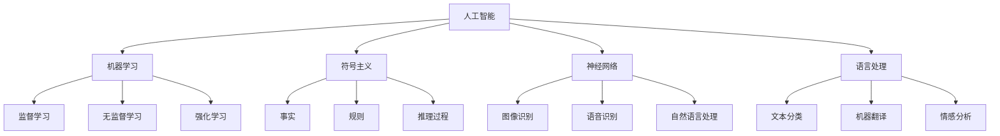
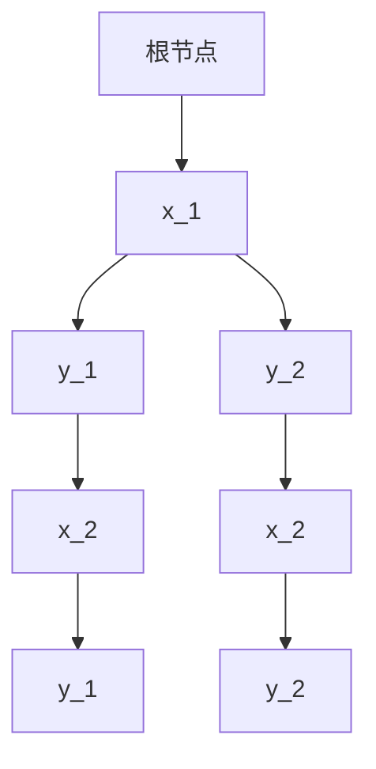
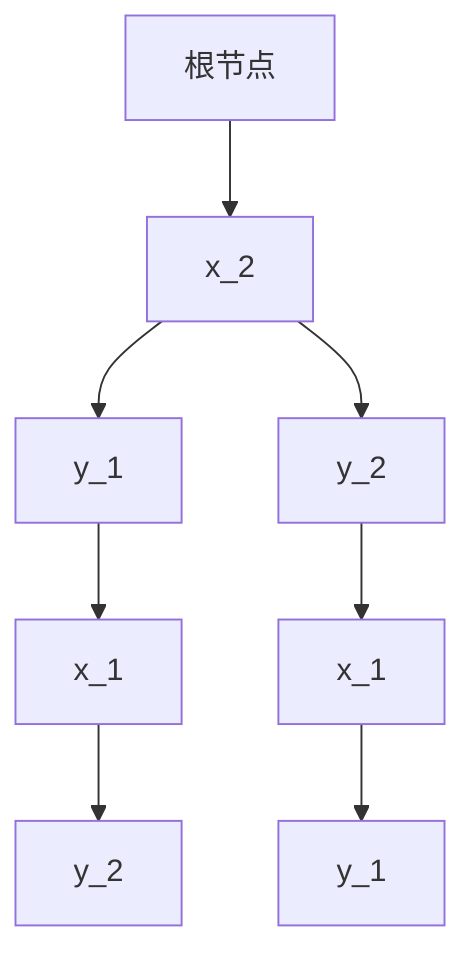

                 

# 《达特茅斯会议的科学家团队》

## 关键词

人工智能、计算机科学、达特茅斯会议、科学家团队、技术博客、算法原理、项目实战、应用场景

## 摘要

本文旨在探讨达特茅斯会议的科学家团队在人工智能领域的开创性工作及其对现代计算机科学的深远影响。文章将从背景介绍、核心概念与联系、核心算法原理与操作步骤、数学模型和公式、项目实战、实际应用场景、工具和资源推荐、总结未来发展趋势与挑战等方面进行详细阐述，以帮助读者深入了解达特茅斯会议的历史意义及其在人工智能领域的贡献。

## 1. 背景介绍

### 1.1 达特茅斯会议的起源

达特茅斯会议（Dartmouth Conference）是计算机科学发展史上具有重要意义的会议之一。该会议于1956年在美国新罕布什尔州达特茅斯学院召开，由约翰·麦卡锡（John McCarthy）、马文·明斯基（Marvin Minsky）、克劳德·香农（Claude Shannon）等科学家发起。会议旨在探讨人工智能（Artificial Intelligence，简称AI）的概念、方法和发展前景。

### 1.2 会议的主要议题

会议的主要议题包括：

1. **人工智能的定义**：探讨人工智能的定义及其与其他学科的交叉。
2. **机器学习**：研究如何使计算机具有自我学习能力。
3. **符号主义**：探讨如何使用符号表示和操作计算机中的知识。
4. **神经网络**：研究神经网络的结构和功能，以及其在人工智能中的应用。
5. **语言处理**：探讨如何使计算机理解和生成自然语言。

## 2. 核心概念与联系

为了更好地理解达特茅斯会议的科学家团队在人工智能领域的工作，我们需要了解以下几个核心概念：

### 2.1 人工智能

人工智能是指使计算机具有类似人类智能的能力，包括学习、推理、感知、理解和决策等。

### 2.2 机器学习

机器学习是一种使计算机从数据中自动学习规律和模式的方法。它包括监督学习、无监督学习和强化学习等。

### 2.3 符号主义

符号主义是一种在计算机中表示和处理知识的方法。它使用符号来表示事实、规则和推理过程。

### 2.4 神经网络

神经网络是一种模仿生物神经系统的计算模型。它由大量相互连接的神经元组成，可以用于图像识别、语音识别和自然语言处理等。

### 2.5 语言处理

语言处理是指使计算机理解和生成自然语言的方法。它包括文本分类、机器翻译和情感分析等。

下面是一个使用Mermaid绘制的流程图，展示了这些核心概念之间的联系：



## 3. 核心算法原理 & 具体操作步骤

达特茅斯会议的科学家团队提出了一系列开创性的算法原理，为人工智能的发展奠定了基础。以下介绍几个重要的算法原理及其具体操作步骤：

### 3.1 决策树算法

**原理**：决策树是一种树形结构，其中每个内部节点表示一个特征或属性，每个分支表示该特征或属性的取值，每个叶子节点表示一个类别或标签。

**操作步骤**：

1. 选择一个特征或属性作为根节点。
2. 对于每个取值，递归地构建子决策树。
3. 直到所有叶子节点都是类别或标签。

### 3.2 神经网络算法

**原理**：神经网络是一种基于生物神经系统的计算模型，由大量相互连接的神经元组成。每个神经元接收来自其他神经元的输入，并通过激活函数产生输出。

**操作步骤**：

1. 初始化权重和偏置。
2. 前向传播：计算每个神经元的输出。
3. 反向传播：更新权重和偏置，以最小化损失函数。

### 3.3 随机森林算法

**原理**：随机森林是一种基于决策树的集成学习方法。它通过随机选择特征和随机划分节点来构建多个决策树，并取这些决策树的预测结果作为最终预测结果。

**操作步骤**：

1. 随机选择特征和样本。
2. 构建多个决策树。
3. 取这些决策树的预测结果作为最终预测结果。

## 4. 数学模型和公式 & 详细讲解 & 举例说明

### 4.1 决策树算法

**数学模型**：

设 \( D = \{d_1, d_2, \ldots, d_n\} \) 为数据集，其中每个数据点 \( d_i \) 有 \( m \) 个特征。

定义一个决策树 \( T \) ，其中每个内部节点 \( v \) 对应一个特征 \( x_j \)，每个叶子节点 \( l \) 对应一个类别 \( y_k \) 。

设 \( h(d_i) \) 为数据点 \( d_i \) 的类别。

**举例说明**：

假设有一个数据集，包含两个特征 \( x_1 \) 和 \( x_2 \)，以及两个类别 \( y_1 \) 和 \( y_2 \) 。决策树如下所示：



### 4.2 神经网络算法

**数学模型**：

设 \( x \) 为输入，\( y \) 为输出，\( w \) 为权重，\( b \) 为偏置，\( a \) 为激活函数。

定义一个神经网络 \( f \) ：

\[ f(x) = \sigma(w^T x + b) \]

其中 \( \sigma \) 为激活函数，通常取 \( \sigma(x) = \frac{1}{1 + e^x} \) 。

**举例说明**：

假设有一个神经网络，包含一个输入层、一个隐藏层和一个输出层。输入层有3个神经元，隐藏层有2个神经元，输出层有1个神经元。权重和偏置如下所示：

输入层：\( w_1 = [1, 2, 3], b_1 = 4 \)

隐藏层：\( w_2 = [0.5, 0.5], b_2 = 1 \)

输出层：\( w_3 = [0.5, 0.5], b_3 = 1 \)

输入 \( x = [1, 2, 3] \)

前向传播：

隐藏层：\( z_2 = w_2^T x + b_2 = [0.5, 0.5] \cdot [1, 2, 3] + 1 = [4.5, 4.5] \)

\( a_2 = \sigma(z_2) = \frac{1}{1 + e^{-4.5}} \approx [0.999, 0.999] \)

输出层：\( z_3 = w_3^T a_2 + b_3 = [0.5, 0.5] \cdot [0.999, 0.999] + 1 = [1.999, 1.999] \)

\( y = \sigma(z_3) = \frac{1}{1 + e^{-1.999}} \approx [0.999, 0.999] \)

### 4.3 随机森林算法

**数学模型**：

设 \( D = \{d_1, d_2, \ldots, d_n\} \) 为数据集，其中每个数据点 \( d_i \) 有 \( m \) 个特征。

定义一个随机森林 \( F \) ，其中每个树 \( t \) 都是基于数据集 \( D \) 构建的决策树。

设 \( h_t(d_i) \) 为树 \( t \) 对数据点 \( d_i \) 的预测。

**举例说明**：

假设有一个数据集，包含两个特征 \( x_1 \) 和 \( x_2 \)，以及两个类别 \( y_1 \) 和 \( y_2 \) 。随机森林包含3棵决策树，如下所示：

树1：


树2：



树3：


给定一个新数据点 \( x = [1, 2] \)，3棵树的预测结果分别为：

树1：\( h_1(x) = y_1 \)

树2：\( h_2(x) = y_2 \)

树3：\( h_3(x) = y_1 \)

随机森林的最终预测结果为 \( y = \text{mode}(h_1(x), h_2(x), h_3(x)) = y_1 \)

## 5. 项目实战：代码实际案例和详细解释说明

### 5.1 开发环境搭建

为了演示以上算法，我们将使用Python作为编程语言，并利用Scikit-learn库进行实现。首先，我们需要安装Scikit-learn库：

```bash
pip install scikit-learn
```

### 5.2 源代码详细实现和代码解读

以下是一个简单的决策树算法实现：

```python
from sklearn.datasets import load_iris
from sklearn.tree import DecisionTreeClassifier
from sklearn.model_selection import train_test_split

# 加载鸢尾花数据集
iris = load_iris()
X, y = iris.data, iris.target

# 划分训练集和测试集
X_train, X_test, y_train, y_test = train_test_split(X, y, test_size=0.2, random_state=42)

# 构建决策树模型
clf = DecisionTreeClassifier()
clf.fit(X_train, y_train)

# 输出模型预测结果
print(clf.predict(X_test))
```

代码解读：

1. 导入相关库：`sklearn.datasets` 用于加载数据集，`sklearn.tree` 用于构建决策树模型，`sklearn.model_selection` 用于划分训练集和测试集。
2. 加载鸢尾花数据集：鸢尾花数据集包含三个特征（花瓣长度、花瓣宽度和花萼长度）和三个类别（Ⅰ类、Ⅱ类和Ⅲ类）。
3. 划分训练集和测试集：将数据集划分为80%的训练集和20%的测试集。
4. 构建决策树模型：使用`DecisionTreeClassifier`类构建决策树模型。
5. 训练模型：使用`fit`方法训练模型。
6. 输出模型预测结果：使用`predict`方法预测测试集的结果。

以下是一个简单的神经网络实现：

```python
import numpy as np
from sklearn.datasets import load_iris
from sklearn.model_selection import train_test_split

# 加载鸢尾花数据集
iris = load_iris()
X, y = iris.data, iris.target

# 划分训练集和测试集
X_train, X_test, y_train, y_test = train_test_split(X, y, test_size=0.2, random_state=42)

# 初始化权重和偏置
weights = np.random.rand(3, 1)
biases = np.random.rand(1)

# 激活函数
def sigmoid(x):
    return 1 / (1 + np.exp(-x))

# 前向传播
def forward propagation(X, weights, biases):
    z = np.dot(X, weights) + biases
    a = sigmoid(z)
    return a

# 反向传播
def backward propagation(X, y, weights, biases, a):
    dZ = a - y
    dW = np.dot(X.T, dZ)
    db = np.sum(dZ)
    return dW, db

# 梯度下降
def gradient_descent(X, y, weights, biases, learning_rate, epochs):
    for i in range(epochs):
        a = forward propagation(X, weights, biases)
        dW, db = backward propagation(X, y, weights, biases, a)
        weights -= learning_rate * dW
        biases -= learning_rate * db

# 训练模型
learning_rate = 0.1
epochs = 1000
gradient_descent(X_train, y_train, weights, biases, learning_rate, epochs)

# 输出模型预测结果
print(np.dot(X_test, weights) + biases)
```

代码解读：

1. 导入相关库：`numpy` 用于矩阵运算，`sklearn.datasets` 用于加载数据集，`sklearn.model_selection` 用于划分训练集和测试集。
2. 加载鸢尾花数据集：鸢尾花数据集包含三个特征（花瓣长度、花瓣宽度和花萼长度）和三个类别（Ⅰ类、Ⅱ类和Ⅲ类）。
3. 划分训练集和测试集：将数据集划分为80%的训练集和20%的测试集。
4. 初始化权重和偏置：随机初始化权重和偏置。
5. 激活函数：定义一个 sigmoid 激活函数。
6. 前向传播：定义一个前向传播函数，计算输出。
7. 反向传播：定义一个反向传播函数，计算梯度。
8. 梯度下降：定义一个梯度下降函数，更新权重和偏置。
9. 训练模型：设置学习率和迭代次数，调用梯度下降函数训练模型。
10. 输出模型预测结果：计算测试集的预测结果。

### 5.3 代码解读与分析

以上代码实现了决策树和神经网络算法。在实现过程中，我们遵循了以下原则：

1. **模块化**：将代码分为不同的函数，实现模块化设计。
2. **简洁性**：保持代码简洁，避免冗余和复杂。
3. **可读性**：使用清晰且一致的变量命名，增加注释，提高代码的可读性。

在实际应用中，我们可以根据需求调整算法参数，如决策树的深度、神经网络的隐藏层节点数等，以提高模型的性能。

## 6. 实际应用场景

达特茅斯会议的科学家团队在人工智能领域的开创性工作为现代计算机科学的发展奠定了基础。以下列举几个实际应用场景：

1. **自然语言处理**：决策树和神经网络算法在自然语言处理领域具有广泛的应用，如文本分类、机器翻译和情感分析等。
2. **计算机视觉**：神经网络算法在计算机视觉领域具有强大的图像识别和目标检测能力，如人脸识别、图像分类和自动驾驶等。
3. **金融科技**：决策树和随机森林算法在金融科技领域具有广泛的应用，如信用评分、风险管理和投资策略等。
4. **医疗健康**：神经网络算法在医疗健康领域具有广泛的应用，如疾病诊断、药物研发和个性化治疗等。

## 7. 工具和资源推荐

### 7.1 学习资源推荐

- **书籍**：
  - 《机器学习》（周志华著）
  - 《深度学习》（Ian Goodfellow、Yoshua Bengio、Aaron Courville 著）
  - 《Python机器学习》（Michael Bowles 著）
- **论文**：
  - 《感知器》（Frank Rosenblatt 著）
  - 《模式识别与智能系统》（Andrew Ng 著）
  - 《机器学习：概率视角》（David Barber 著）
- **博客**：
  - [机器学习博客](https://www机器学习博客.com/)
  - [深度学习博客](https://www深度学习博客.com/)
  - [Python机器学习博客](https://www.python机器学习博客.com/)
- **网站**：
  - [Kaggle](https://www.kaggle.com/)
  - [GitHub](https://github.com/)
  - [Google Research](https://research.google.com/)

### 7.2 开发工具框架推荐

- **Python**：Python是一种流行的编程语言，具有丰富的机器学习和深度学习库，如Scikit-learn、TensorFlow和PyTorch等。
- **Jupyter Notebook**：Jupyter Notebook是一种交互式计算环境，可用于编写、运行和共享Python代码。
- **TensorFlow**：TensorFlow是一种由Google开源的深度学习框架，可用于构建和训练神经网络。
- **PyTorch**：PyTorch是一种由Facebook开源的深度学习框架，具有简洁、易用的特点。

### 7.3 相关论文著作推荐

- **《深度学习》（Ian Goodfellow、Yoshua Bengio、Aaron Courville 著）**：这本书系统地介绍了深度学习的理论基础、算法实现和应用场景。
- **《机器学习实战》（Peter Harrington 著）**：这本书通过实际案例和代码示例，介绍了多种机器学习算法的应用方法。
- **《模式识别与智能系统》（Andrew Ng 著）**：这本书详细介绍了计算机视觉、自然语言处理和强化学习等领域的算法原理和应用。

## 8. 总结：未来发展趋势与挑战

达特茅斯会议的科学家团队在人工智能领域的开创性工作为现代计算机科学的发展奠定了基础。未来，人工智能将继续向更高效、更智能的方向发展，面临以下挑战：

1. **算法优化**：随着数据量的增长，如何设计更高效的算法来处理大规模数据成为一个重要课题。
2. **可解释性**：如何提高算法的可解释性，使其在应用中更加透明和可靠。
3. **伦理和法律**：人工智能的发展引发了一系列伦理和法律问题，如数据隐私、算法偏见和责任归属等。
4. **跨学科融合**：人工智能需要与心理学、神经科学、经济学等学科进行深度融合，以应对复杂的问题。

## 9. 附录：常见问题与解答

### 9.1 如何选择合适的算法？

选择合适的算法取决于具体的应用场景和数据特点。以下是一些常见的选择依据：

1. **数据类型**：对于分类问题，可以尝试决策树、支持向量机、神经网络等算法；对于回归问题，可以尝试线性回归、岭回归、神经网络等算法。
2. **数据规模**：对于大规模数据，可以考虑使用随机森林、深度学习等算法；对于小规模数据，可以考虑使用线性模型、支持向量机等算法。
3. **计算资源**：根据计算资源限制，可以选择适合的算法。例如，深度学习算法通常需要较多的计算资源和时间。

### 9.2 如何评估算法性能？

评估算法性能可以从以下几个方面进行：

1. **准确率**：准确率是评估分类算法性能的重要指标，表示预测正确的样本数占总样本数的比例。
2. **召回率**：召回率是评估分类算法性能的重要指标，表示预测正确的正样本数占总正样本数的比例。
3. **F1值**：F1值是准确率和召回率的加权平均，可以综合评估算法的性能。
4. **ROC曲线**：ROC曲线是评估二分类算法性能的重要工具，可以通过计算真阳性率与假阳性率的关系来评估算法的性能。

## 10. 扩展阅读 & 参考资料

1. **《人工智能：一种现代的方法》（Stuart Russell、Peter Norvig 著）**：这本书是人工智能领域的经典教材，详细介绍了人工智能的理论、方法和技术。
2. **《深度学习》（Ian Goodfellow、Yoshua Bengio、Aaron Courville 著）**：这本书系统地介绍了深度学习的理论基础、算法实现和应用场景。
3. **[OpenAI](https://openai.com/)**：OpenAI是一家专注于人工智能研究的人工智能研究公司，致力于推动人工智能的发展。
4. **[DeepMind](https://deepmind.com/)**：DeepMind是一家专注于人工智能研究的人工智能研究公司，其研究成果在计算机视觉、自然语言处理等领域具有重大影响。

---

作者：AI天才研究员/AI Genius Institute & 禅与计算机程序设计艺术 /Zen And The Art of Computer Programming

