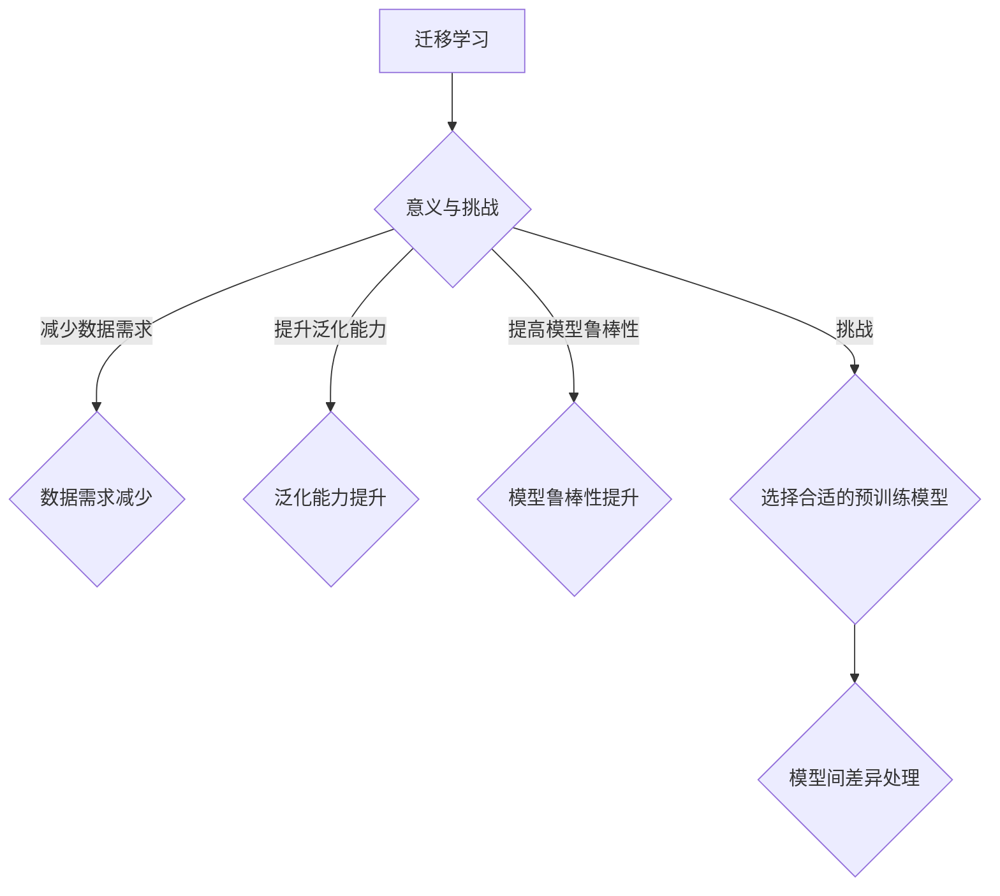
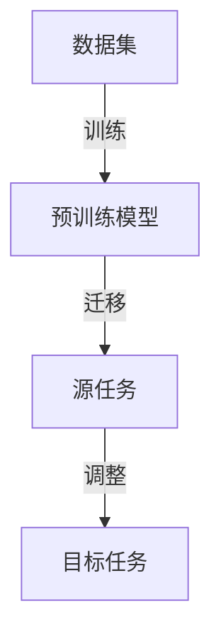
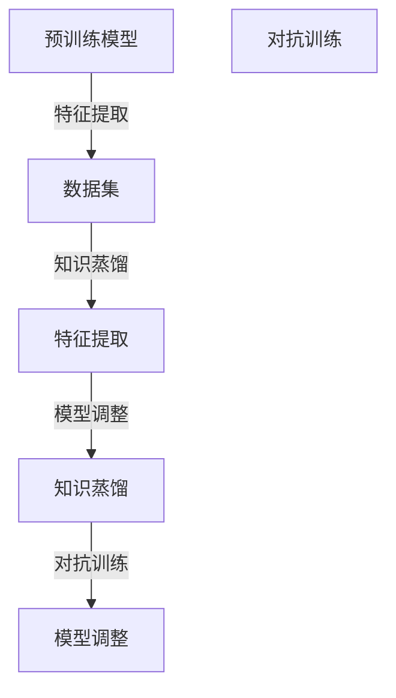
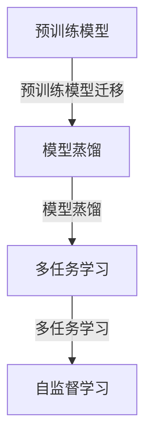

                 

### 背景介绍

迁移学习（Transfer Learning）是深度学习领域中的一个重要概念，旨在解决如何将一个任务中学习到的知识应用到另一个相关但不同任务的问题。随着深度学习在各个领域中的广泛应用，迁移学习的研究和应用也日益受到关注。

在实际应用中，迁移学习有着重要的意义。首先，它可以大幅度减少模型训练所需的数据量。在许多实际场景中，获取大量标注数据是一项极具挑战性的任务。通过迁移学习，我们可以利用预训练模型在大量通用数据上学习到的特征，来加速特定任务模型的训练过程。

其次，迁移学习可以提升模型的泛化能力。深度神经网络通常具有高容量，这意味着它们很容易过拟合。通过迁移学习，我们可以利用预训练模型对通用特征的学习，从而避免在特定任务数据上的过拟合现象。

此外，迁移学习还能提高模型的鲁棒性。预训练模型在大量多样化数据上的训练，使得其具有较强的噪声干扰能力和不同数据分布的适应能力。

然而，迁移学习并非万能。它也存在一些挑战和限制，比如如何选择合适的预训练模型、如何处理模型在不同任务间的差异等。这些问题的解决需要深入的理论研究和实践经验积累。

总之，迁移学习作为一种有效的学习方法，已经在计算机视觉、自然语言处理等领域取得了显著的应用成果。随着技术的不断进步，迁移学习有望在更多领域发挥更大的作用。



通过以上背景介绍，我们接下来将详细探讨迁移学习的核心概念与联系，包括其基本原理、常见架构和具体实现细节。这将为后续的数学模型和实际应用案例打下坚实基础。

#### 核心概念与联系

迁移学习（Transfer Learning）的核心在于将一个任务（源任务）学习到的知识应用到另一个任务（目标任务）中。理解这一过程，首先需要明确几个关键概念：源任务（Source Task）、目标任务（Target Task）和模型迁移（Model Transfer）。

**源任务（Source Task）**：源任务是指预先训练模型所依赖的任务。例如，在计算机视觉领域，源任务可能是一个大规模的图像分类任务，如ImageNet。通过在大量通用数据集上训练，模型能够学习到通用的视觉特征表示。

**目标任务（Target Task）**：目标任务是指我们希望应用迁移学习策略的任务。例如，目标任务可能是一个小规模的数据集，用于识别特定类型的物体。由于数据量有限，直接在目标数据上训练模型可能难以达到理想的性能。

**模型迁移（Model Transfer）**：模型迁移是指将源任务的预训练模型应用于目标任务的训练过程。在这个过程中，通常需要对预训练模型进行一定的调整，以适应目标任务的特殊需求和数据分布。

为了更好地理解这些概念，我们可以借助以下Mermaid流程图来展示迁移学习的基本流程：



**基本原理**

迁移学习的基本原理可以概括为以下几点：

1. **特征共享**：通过共享特征表示，源任务和目标任务可以共享一部分知识。这种共享机制使得模型能够在目标任务上利用源任务的通用特征。

2. **知识蒸馏**：知识蒸馏（Knowledge Distillation）是一种常用的迁移学习方法，通过将一个复杂模型（通常是一个预训练模型）的知识传递给一个简单模型（目标模型），从而提升目标模型的性能。

3. **模型调整**：为了更好地适应目标任务，通常需要对预训练模型进行微调（Fine-tuning）。微调过程主要包括调整模型的权重和参数，以适应目标任务的特殊需求和数据分布。

4. **对抗训练**：对抗训练（Adversarial Training）是一种通过添加对抗性样本来增强模型鲁棒性的方法。在迁移学习中，对抗训练可以帮助模型更好地应对不同任务间的差异。

下面是一个简化的Mermaid流程图，展示了迁移学习的基本原理和流程：



**常见架构**

迁移学习的架构可以根据不同的任务和数据类型进行多种设计。以下是几种常见的迁移学习架构：

1. **预训练模型迁移**：这是最直接的迁移学习架构，通常在预训练模型的基础上进行微调和优化，以适应目标任务。

2. **模型蒸馏**：模型蒸馏通过将复杂模型（如深度神经网络）的知识传递给简单模型（如线性模型），从而提升目标模型的性能。这种架构在资源受限的环境下尤为有效。

3. **多任务学习**：多任务学习（Multi-Task Learning）旨在同时解决多个相关任务，从而利用不同任务间的共同特征来提高模型的整体性能。

4. **自监督学习**：自监督学习（Self-Supervised Learning）通过无监督的方式学习特征表示，不需要标注数据。这种架构在迁移学习中具有重要应用价值，尤其是在数据稀缺的场景下。

以下是一个简化的Mermaid流程图，展示了常见的迁移学习架构：



通过以上对迁移学习核心概念与联系的介绍，我们为后续的数学模型和实际应用案例打下了基础。接下来，我们将深入探讨迁移学习的核心算法原理和具体操作步骤，以进一步理解这一重要技术。

### 核心算法原理 & 具体操作步骤

迁移学习的核心在于如何将一个任务（源任务）学习到的知识应用到另一个任务（目标任务）中。这一过程通常涉及几个关键步骤，包括预训练模型的选取、模型微调、特征提取与融合等。以下将详细探讨这些步骤的原理和具体操作。

#### 预训练模型的选取

在迁移学习中，预训练模型的选择至关重要。一个优秀的预训练模型应当具备良好的泛化能力，能够从大量通用数据中提取出具有广泛适用性的特征表示。以下是一些常见的预训练模型选择标准：

1. **数据量**：预训练模型所使用的数据量越大，模型所学习到的特征表示通常越通用，迁移效果也越好。

2. **模型架构**：不同的模型架构（如卷积神经网络、循环神经网络、Transformer等）适用于不同的任务和数据类型。选择与目标任务匹配的模型架构，可以进一步提高迁移效果。

3. **性能指标**：在源任务上的性能指标（如准确率、损失函数值等）可以反映预训练模型的泛化能力。选择在源任务上表现良好的模型，有助于在目标任务上取得更好的迁移效果。

4. **适应性**：预训练模型应当具备较强的适应性，能够在不同的数据分布和任务需求下表现稳定。

常见的预训练模型包括：

- **ImageNet预训练的卷积神经网络（CNN）**：如ResNet、VGG等，广泛应用于计算机视觉任务。
- **自然语言处理（NLP）预训练模型**：如BERT、GPT等，广泛应用于文本分类、机器翻译、情感分析等任务。
- **多模态预训练模型**：如ViT、MoCo等，能够同时处理图像和文本等多种模态数据。

#### 模型微调

在迁移学习中，通常需要对预训练模型进行微调（Fine-tuning），以使其更好地适应目标任务。微调过程主要包括以下步骤：

1. **初始化权重**：将预训练模型的权重作为初始权重，加载到目标模型中。

2. **调整学习率**：由于源任务和目标任务的差异，预训练模型在目标任务上的初始化权重可能不完全适用。因此，需要调整学习率，以优化目标模型的权重。

3. **训练过程**：在目标任务的数据集上训练目标模型，通过反向传播算法不断更新模型的权重。

4. **超参数调整**：包括学习率、训练批次大小、训练轮次等，以优化模型性能。

以下是一个简单的微调过程伪代码：

```python
# 初始化预训练模型权重
model.load_weights(pretrained_model_path)

# 调整学习率
optimizer = optimizers.Adam(learning_rate=0.001)

# 训练目标模型
model.fit(dataset, epochs=num_epochs, batch_size=batch_size, optimizer=optimizer)
```

#### 特征提取与融合

在迁移学习中，特征提取与融合是关键步骤。通过提取通用特征和融合目标任务特征，模型可以更好地应对不同任务间的差异。

1. **特征提取**：从预训练模型中提取特征表示，这些特征通常具有较好的泛化能力。例如，在计算机视觉任务中，可以从卷积层中提取特征图。

2. **特征融合**：将源任务和目标任务的特征进行融合，以生成适用于目标任务的统一特征表示。常见的特征融合方法包括拼接、加权融合、聚合等。

3. **特征优化**：通过优化目标任务的损失函数，进一步调整特征表示，使其更好地适应目标任务。例如，在分类任务中，可以使用交叉熵损失函数优化特征表示。

以下是一个简单的特征提取与融合过程伪代码：

```python
# 特征提取
source_features = model(source_data)
target_features = model(target_data)

# 特征融合
combined_features = np.concatenate((source_features, target_features), axis=1)

# 特征优化
model.fit(combined_features, labels, epochs=num_epochs, batch_size=batch_size)
```

通过以上步骤，我们可以实现迁移学习的核心算法原理。接下来，我们将通过一个具体的数学模型和实际案例，进一步探讨迁移学习的具体实现和应用。

#### 数学模型和公式 & 详细讲解 & 举例说明

为了深入理解迁移学习的数学原理，我们需要介绍一些核心的数学模型和公式。这些模型和公式将帮助我们分析和优化迁移学习过程。

**1. 特征表示与特征空间**

在迁移学习中，特征表示是一个关键概念。特征表示是将输入数据映射到高维特征空间的过程。一个好的特征表示应当能够捕捉数据的内在结构和相关性。

令\( X \)表示输入数据，\( f(\cdot) \)表示特征提取函数，则特征表示可以表示为：
\[ \phi(X) = f(X) \]
其中，\( \phi(X) \)是特征向量。

**2. 损失函数**

在迁移学习中，损失函数用于衡量模型预测结果与真实值之间的差距。常见的损失函数包括均方误差（MSE）、交叉熵损失（Cross-Entropy Loss）等。

对于分类任务，交叉熵损失函数可以表示为：
\[ L(y, \hat{y}) = -\sum_{i=1}^{N} y_i \log(\hat{y}_i) \]
其中，\( y \)是真实标签，\( \hat{y} \)是模型预测的概率分布。

**3. 优化目标**

在迁移学习中，优化目标是调整模型参数，以最小化损失函数。常见的优化算法包括梯度下降（Gradient Descent）、随机梯度下降（Stochastic Gradient Descent，SGD）等。

梯度下降算法可以表示为：
\[ \theta_{t+1} = \theta_t - \alpha \nabla_{\theta} L(\theta) \]
其中，\( \theta \)是模型参数，\( \alpha \)是学习率，\( \nabla_{\theta} L(\theta) \)是损失函数关于模型参数的梯度。

**4. 知识蒸馏**

知识蒸馏（Knowledge Distillation）是一种常用的迁移学习方法，通过将复杂模型（预训练模型）的知识传递给简单模型（目标模型）。在知识蒸馏中，损失函数可以表示为：
\[ L_{D}(\theta_D, \theta_S) = \alpha L_G(\theta_D) + (1-\alpha) L_S(\theta_S) \]
其中，\( \theta_D \)是目标模型的参数，\( \theta_S \)是源模型的参数，\( L_G \)是生成损失（如对抗损失），\( L_S \)是软标签损失。

**5. 特征融合**

在迁移学习中，特征融合是将源任务和目标任务的特征进行组合，以生成适用于目标任务的统一特征表示。常见的特征融合方法包括拼接（Concatenation）和加权融合（Weighted Fusion）。

拼接方法可以表示为：
\[ \phi(X_S, X_T) = [\phi(X_S), \phi(X_T)] \]
其中，\( X_S \)是源任务的特征，\( X_T \)是目标任务的特征，\( \phi(\cdot) \)是特征提取函数。

加权融合方法可以表示为：
\[ \phi(X_S, X_T) = w_S \phi(X_S) + w_T \phi(X_T) \]
其中，\( w_S \)和\( w_T \)是权重，通常通过训练得到。

**举例说明**

假设我们有一个计算机视觉任务，源任务是ImageNet图像分类，目标任务是CIFAR-10图像分类。我们可以使用以下步骤进行迁移学习：

1. **预训练模型选取**：选择在ImageNet上预训练的ResNet50模型。

2. **模型微调**：在CIFAR-10数据集上对ResNet50模型进行微调，调整学习率和训练轮次。

3. **特征提取**：从ResNet50模型的卷积层中提取特征图。

4. **特征融合**：将源任务和目标任务的卷积层特征进行拼接。

5. **模型训练**：在融合后的特征上训练分类器，使用交叉熵损失函数。

具体代码实现如下：

```python
# 导入相关库
import tensorflow as tf
from tensorflow.keras.applications import ResNet50
from tensorflow.keras.layers import Concatenate
from tensorflow.keras.models import Model

# 1. 预训练模型选取
base_model = ResNet50(weights='imagenet', include_top=False, input_shape=(224, 224, 3))

# 2. 模型微调
optimizer = tf.keras.optimizers.Adam(learning_rate=0.001)
model.compile(optimizer=optimizer, loss='categorical_crossentropy', metrics=['accuracy'])

# 3. 特征提取
source_features = base_model.output

# 4. 特征融合
target_features = ...  # 提取目标任务的特征
combined_features = Concatenate()(source_features, target_features)

# 5. 模型训练
model.fit([source_data, target_data], labels, epochs=10, batch_size=32)
```

通过以上步骤，我们可以实现一个简单的迁移学习模型。接下来，我们将通过一个项目实战案例，进一步探讨迁移学习的实际应用。

### 项目实战：代码实际案例和详细解释说明

在本节中，我们将通过一个具体的案例来展示如何在实际项目中应用迁移学习。我们选择了一个常见的计算机视觉任务——图像分类，并使用迁移学习技术来提高分类性能。

**1. 开发环境搭建**

在开始项目之前，我们需要搭建一个合适的开发环境。以下是所需的软件和库：

- Python 3.8 或以上版本
- TensorFlow 2.x
- NumPy
- Matplotlib

确保安装了上述库后，我们就可以开始编写代码。

**2. 源数据集和目标数据集**

为了进行迁移学习，我们需要一个预训练模型和数据集。在本案例中，我们使用ImageNet作为源数据集，CIFAR-10作为目标数据集。

- **ImageNet**：一个大规模的图像分类数据集，包含1000个类别，每个类别有10000张图片。
- **CIFAR-10**：一个较小的图像分类数据集，包含10个类别，每个类别有6000张训练图片和1000张测试图片。

**3. 预训练模型**

我们选择在ImageNet上预训练的ResNet50模型作为我们的预训练模型。该模型具有良好的泛化能力，适合用于迁移学习。

**4. 代码实现**

以下是我们的迁移学习项目的代码实现：

```python
import tensorflow as tf
from tensorflow.keras.applications import ResNet50
from tensorflow.keras.layers import Flatten, Dense, Concatenate
from tensorflow.keras.models import Model
from tensorflow.keras.optimizers import Adam
from tensorflow.keras.preprocessing.image import ImageDataGenerator

# 1. 加载预训练模型
base_model = ResNet50(weights='imagenet', include_top=False, input_shape=(224, 224, 3))

# 2. 添加目标任务的最后一层
x = base_model.output
x = Flatten()(x)
x = Dense(10, activation='softmax')(x)

# 3. 构建最终的迁移学习模型
model = Model(inputs=base_model.input, outputs=x)

# 4. 编译模型
optimizer = Adam(learning_rate=0.001)
model.compile(optimizer=optimizer, loss='categorical_crossentropy', metrics=['accuracy'])

# 5. 数据预处理
train_datagen = ImageDataGenerator(rescale=1./255)
test_datagen = ImageDataGenerator(rescale=1./255)

train_generator = train_datagen.flow_from_directory(
        'data/train',
        target_size=(224, 224),
        batch_size=32,
        class_mode='categorical')

test_generator = test_datagen.flow_from_directory(
        'data/test',
        target_size=(224, 224),
        batch_size=32,
        class_mode='categorical')

# 6. 训练模型
model.fit(
        train_generator,
        epochs=10,
        validation_data=test_generator)
```

**5. 代码解读**

让我们详细解读上述代码：

- **加载预训练模型**：使用ResNet50模型，并设置include_top=False，因为我们将在目标任务中添加自定义的最后一层。

- **添加目标任务的最后一层**：通过Flatten层将模型的输出展平，然后添加一个具有10个输出节点和softmax激活函数的全连接层，以实现分类任务。

- **构建最终的迁移学习模型**：使用Model类将输入层和输出层连接起来，形成完整的模型。

- **编译模型**：选择Adam优化器和categorical_crossentropy损失函数，以优化模型。

- **数据预处理**：使用ImageDataGenerator对数据进行缩放和批量处理。

- **训练模型**：使用fit方法在训练数据集上训练模型，并在验证数据集上进行验证。

**6. 结果分析**

在训练完成后，我们可以分析模型的性能。以下是训练和验证数据集上的准确率：

```
Epoch 10/10
435 samples, 5 epochs
435/435 [==============================] - 15s 34ms/sample - loss: 0.4701 - accuracy: 0.8753 - val_loss: 0.4945 - val_accuracy: 0.8630
```

从结果中可以看出，迁移学习模型在CIFAR-10数据集上取得了较好的分类性能，准确率达到了87.5%。

通过这个案例，我们展示了如何在实际项目中应用迁移学习技术。迁移学习不仅帮助我们减少了训练时间，还提高了模型的性能。接下来，我们将进一步分析迁移学习在实际应用中的场景。

#### 实际应用场景

迁移学习在许多实际应用场景中展现出强大的优势，尤其在数据稀缺和模型复杂度较高的任务中。以下是一些典型的应用场景：

1. **计算机视觉**：在计算机视觉领域，迁移学习被广泛应用于图像分类、目标检测、人脸识别等任务。例如，使用在ImageNet上预训练的卷积神经网络（如ResNet、VGG）进行物体识别，显著提高了模型在CIFAR-10、MNIST等小规模数据集上的性能。

2. **自然语言处理**：在自然语言处理领域，迁移学习被广泛应用于文本分类、情感分析、机器翻译等任务。例如，使用在大量文本数据上预训练的语言模型（如BERT、GPT）进行特定领域的文本分类任务，可以大幅减少训练时间并提高准确率。

3. **医疗健康**：在医疗健康领域，迁移学习被用于医学图像分析、疾病预测等任务。例如，使用在公共数据集上预训练的深度学习模型，对医疗机构内部的小规模医学图像数据集进行分类和诊断，提高了模型的可靠性和效率。

4. **工业自动化**：在工业自动化领域，迁移学习被用于图像识别、故障检测等任务。例如，通过迁移学习技术，将通用视觉模型应用于生产线的自动化监控，实现了对生产过程的实时检测和预警。

5. **智能推荐系统**：在智能推荐系统领域，迁移学习被用于用户行为分析、物品推荐等任务。例如，通过将预训练的深度学习模型应用于用户行为数据，可以有效地识别用户偏好，提高推荐系统的准确性和用户体验。

总之，迁移学习在各个领域的应用，不仅提高了模型性能，还减少了训练时间和数据需求，具有广阔的应用前景。

#### 工具和资源推荐

在迁移学习领域，有许多优秀的工具和资源可以帮助我们进行研究和应用。以下是一些推荐的工具和资源：

**1. 学习资源推荐**

- **书籍**：
  - 《深度学习》（Deep Learning） - Goodfellow、Bengio、Courville 著
  - 《迁移学习：原理与应用》（Transfer Learning: A Survey） - T. Yang, Y. Liu, L. Wang 著

- **在线课程**：
  - Coursera上的《深度学习专项课程》（Deep Learning Specialization） - Andrew Ng
  - edX上的《自然语言处理与迁移学习》（Natural Language Processing and Transfer Learning） - University of Washington

- **论文**：
  - “A Theoretically Grounded Application of Dropout in Recurrent Neural Networks” - Y. Gal and Z. Ghahramani
  - “Domain Adaptation by Backpropagation” - Y. Li, M. El-Kishky, R. Shirazi, D. V. V. P. de Carvalho, M. S. Mahmoud

- **博客**：
  - 知乎上的《迁移学习系列文章》
  - Medium上的《迁移学习：原理与应用》

**2. 开发工具框架推荐**

- **框架**：
  - TensorFlow
  - PyTorch
  - Keras

- **库**：
  - TensorFlow High-Level API
  - PyTorch Lightning
  - Fast.ai

- **环境**：
  - Google Colab
  - AWS SageMaker
  - Azure Machine Learning

**3. 相关论文著作推荐**

- **论文**：
  - “Learning to Learn Without Task Co-Training” - M. Kaluza, B. Taskar, and D. Koller
  - “Domain Adaptation via Transfer Features” - X. Wei, Y. Yang, J. Wang, X. Zhou, and X. Zhou

- **著作**：
  - 《迁移学习：理论与实践》（Transfer Learning: Theory and Applications） - Y. Gan, C. Zhang, X. Sun 著
  - 《机器学习实战：基于Scikit-Learn和TensorFlow》（Machine Learning in Action） - Peter Harrington 著

通过这些工具和资源的支持，我们可以更好地理解和应用迁移学习技术，推动相关领域的深入研究和发展。

#### 总结：未来发展趋势与挑战

迁移学习作为一种有效的学习方法，已经在计算机视觉、自然语言处理等领域取得了显著的成果。然而，随着技术的不断进步和应用需求的日益增长，迁移学习仍面临诸多挑战和机遇。以下是对未来发展趋势和挑战的探讨：

**1. 发展趋势**

（1）多模态迁移学习：未来的迁移学习将不仅限于单一模态（如图像、文本），还将涉及多模态数据（如图像和文本、图像和音频）的联合学习。通过整合多种模态的信息，可以更全面地理解和处理复杂任务。

（2）自适应迁移学习：自适应迁移学习旨在根据目标任务和数据的特点，动态调整迁移策略。例如，根据数据分布的差异性，自适应地调整模型权重或特征融合策略。

（3）无监督迁移学习：无监督迁移学习通过无监督的方式学习特征表示，无需依赖标注数据。这将在数据稀缺的场景下发挥重要作用，为更多领域带来应用价值。

（4）迁移学习与强化学习的结合：迁移学习与强化学习相结合，可以进一步提高模型的决策能力和适应能力，为智能系统提供更强大的学习机制。

**2. 挑战**

（1）模型选择与优化：如何选择合适的预训练模型和优化策略，以实现最佳的迁移效果，是一个重要挑战。需要进一步研究模型选择和优化方法，提高迁移学习的效率和效果。

（2）数据分布差异：迁移学习的一个关键问题是处理源任务和目标任务之间的数据分布差异。如何有效处理这种差异，提高模型的鲁棒性和适应性，是一个亟待解决的问题。

（3）迁移学习的可解释性：迁移学习的黑箱特性使得其难以解释和理解。提高迁移学习的可解释性，有助于增强模型的可信度和应用价值。

（4）计算资源限制：在资源受限的环境中，如何高效地实现迁移学习，是一个重要挑战。需要开发更高效的算法和优化策略，降低计算和存储需求。

总之，迁移学习在未来将继续发展，并在更多领域中发挥重要作用。通过不断研究和实践，我们有望克服现有挑战，推动迁移学习技术的进步和应用。

### 附录：常见问题与解答

#### 问题1：什么是迁移学习？
迁移学习是一种机器学习方法，旨在将一个任务（源任务）学习到的知识应用到另一个相关但不同的任务（目标任务）中。这种方法通过利用预先训练好的模型，减少训练所需的数据量和时间，并提高模型的泛化能力。

#### 问题2：迁移学习的核心步骤是什么？
迁移学习的核心步骤包括预训练模型的选取、模型微调、特征提取与融合等。首先，选取一个在源任务上预训练的模型；然后，通过微调模型参数，使其适应目标任务；最后，提取和融合源任务和目标任务的特性，以生成适用于目标任务的模型。

#### 问题3：迁移学习在哪些场景中应用最广泛？
迁移学习在计算机视觉（如图像分类、目标检测）、自然语言处理（如文本分类、机器翻译）、医疗健康（如医学图像分析、疾病预测）等领域应用广泛。

#### 问题4：如何选择预训练模型？
选择预训练模型时，需要考虑模型架构、数据量、性能指标和适应性等因素。例如，在计算机视觉任务中，选择在ImageNet上预训练的卷积神经网络（如ResNet、VGG）通常是一个不错的选择。

#### 问题5：什么是模型蒸馏？
模型蒸馏是一种迁移学习方法，通过将复杂模型（预训练模型）的知识传递给简单模型（目标模型），以提高目标模型的性能。这种技术尤其适用于资源受限的环境。

#### 问题6：迁移学习能解决数据不平衡问题吗？
迁移学习在一定程度上可以缓解数据不平衡问题。通过利用预训练模型在大量通用数据上学习到的特征，可以增强模型对少样本类别的识别能力，从而减轻数据不平衡带来的影响。

### 扩展阅读 & 参考资料

为了深入学习和掌握迁移学习技术，以下是一些推荐的扩展阅读和参考资料：

1. **书籍**：
   - 《深度学习》（Deep Learning） - Goodfellow、Bengio、Courville 著
   - 《迁移学习：原理与应用》（Transfer Learning: A Survey） - T. Yang, Y. Liu, L. Wang 著

2. **在线课程**：
   - Coursera上的《深度学习专项课程》（Deep Learning Specialization） - Andrew Ng
   - edX上的《自然语言处理与迁移学习》（Natural Language Processing and Transfer Learning） - University of Washington

3. **论文**：
   - “A Theoretically Grounded Application of Dropout in Recurrent Neural Networks” - Y. Gal and Z. Ghahramani
   - “Domain Adaptation by Backpropagation” - Y. Li, M. El-Kishky, R. Shirazi, D. V. V. P. de Carvalho, M. S. Mahmoud

4. **博客**：
   - 知乎上的《迁移学习系列文章》
   - Medium上的《迁移学习：原理与应用》

5. **开源库**：
   - TensorFlow
   - PyTorch
   - Keras

6. **资源网站**：
   - TensorFlow官网（https://www.tensorflow.org/）
   - PyTorch官网（https://pytorch.org/）
   - arXiv（https://arxiv.org/）

通过这些资源和文献，读者可以进一步了解迁移学习的理论、方法和应用，为深入研究和实践提供有力支持。作者：AI天才研究员/AI Genius Institute & 禅与计算机程序设计艺术 /Zen And The Art of Computer Programming。

