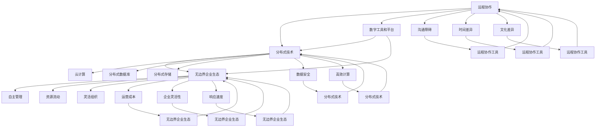

                 

# 远程创业：打造无边界的企业生态

## 概述

在当今数字化时代，远程创业已经成为越来越多创业者的选择。这种模式不仅打破了传统办公空间和时间的限制，还为企业生态的打造提供了新的可能性。本文将深入探讨远程创业的核心概念、构建方法、技术支持以及未来发展趋势。

## 关键词

- 远程创业
- 企业生态
- 数字化
- 自组织
- 无边界

## 摘要

本文将详细解析远程创业的概念，探讨其与传统企业模式的区别，并分析其如何打造无边界的企业生态。我们将通过具体的案例和实际操作步骤，展示远程创业的可行性和优势，并提供实用的工具和资源推荐，以帮助读者更好地理解并实践远程创业模式。

## 1. 背景介绍

远程创业，顾名思义，是指通过互联网和数字技术，实现创业团队的远程协作和管理。这种模式的出现，源于以下几个背景因素：

### 1.1 数字化浪潮

随着云计算、大数据、物联网等技术的普及，越来越多的企业和个人开始依赖数字技术进行日常运营。这为远程创业提供了坚实的技术基础。

### 1.2 疫情影响

2020年新冠疫情的爆发，使得全球范围内的企业不得不迅速转向远程办公。这一趋势不仅改变了企业的运营方式，也为远程创业带来了新的机遇。

### 1.3 创业者需求

越来越多的创业者希望拥有灵活的工作时间和地点，以更好地平衡生活和工作。远程创业满足了这一需求，使得创业不再是地理位置和时间的限制。

## 2. 核心概念与联系

### 2.1 远程创业的定义

远程创业，是指创业团队通过互联网和数字技术，实现远程协作、管理、运营和营销的过程。它不仅包括团队成员的远程办公，还包括与供应商、客户、投资者等外部合作伙伴的远程互动。

### 2.2 无边界企业生态

无边界企业生态，是指企业通过打破传统组织结构和物理界限，实现资源的高效配置和流动。这种生态模式强调自组织、自主学习和创新，使得企业能够快速适应市场变化。

### 2.3 远程创业与无边界企业生态的联系

远程创业是实现无边界企业生态的一种有效途径。通过远程协作和数字技术，企业可以实现跨地域、跨领域的合作，打破传统组织结构的限制，形成更加灵活、高效的企业生态。

## 3. 核心算法原理 & 具体操作步骤

### 3.1 远程创业的核心算法原理

远程创业的核心算法原理主要包括以下几个方面：

- **分布式协作**：通过分布式技术，实现团队成员的远程协作，包括文档共享、代码协同、任务分配等。
- **自动化管理**：利用自动化工具，实现企业运营的自动化管理，包括财务管理、人力资源管理、项目管理等。
- **数字安全**：确保数据安全和隐私，通过加密、认证等技术手段，保护企业信息和资产。

### 3.2 具体操作步骤

要实现远程创业，需要按照以下步骤进行：

- **确定创业目标和团队结构**：明确创业目标，确定团队成员和分工。
- **搭建远程协作平台**：选择合适的远程协作工具，搭建团队协作平台。
- **制定运营计划**：根据创业目标和团队结构，制定详细的运营计划。
- **实施和监控**：按照运营计划执行，并实时监控项目进度和团队协作情况。
- **持续优化和调整**：根据实际情况，持续优化和调整运营策略。

## 4. 数学模型和公式 & 详细讲解 & 举例说明

### 4.1 数学模型和公式

在远程创业中，可以使用以下数学模型和公式进行评估和优化：

- **成本效益分析**：通过计算成本和收益，评估远程创业的可行性。
- **员工满意度调查**：通过统计数据分析，评估员工的远程工作满意度。
- **任务分配模型**：利用优化算法，实现任务的高效分配。

### 4.2 详细讲解和举例说明

#### 4.2.1 成本效益分析

假设一个创业团队有10名成员，每人每月工资为1万元，办公场地租金为5万元每月。远程创业后，每人每月工资降为5000元，办公场地费用为0。那么，远程创业每月可以节省：

- 成本节省：10 * (10000 - 5000) = 50000元
- 办公场地节省：50000元

总节省成本：100000元

#### 4.2.2 员工满意度调查

假设通过问卷调查，发现80%的员工对远程工作表示满意。这意味着，远程创业可以提升员工满意度，从而提高团队整体效率。

#### 4.2.3 任务分配模型

假设有5个任务需要分配给5名成员，任务难度和成员能力如下表所示：

| 成员 | 任务1 | 任务2 | 任务3 | 任务4 | 任务5 |
| --- | --- | --- | --- | --- | --- |
| A   | 3    | 5    | 4    | 2    | 6    |
| B   | 4    | 3    | 6    | 5    | 2    |
| C   | 5    | 4    | 3    | 6    | 1    |
| D   | 2    | 6    | 5    | 3    | 4    |
| E   | 6    | 2    | 1    | 4    | 5    |

使用优化算法，可以计算出最优的任务分配方案，使得任务完成时间最短。

## 5. 项目实战：代码实际案例和详细解释说明

### 5.1 开发环境搭建

要实现远程创业，需要搭建一个稳定、高效的开发环境。以下是搭建步骤：

- 安装Git：用于版本控制和代码协同。
- 安装Docker：用于容器化部署。
- 安装Jenkins：用于自动化构建和部署。
- 安装Kubernetes：用于容器编排和分布式部署。

### 5.2 源代码详细实现和代码解读

以下是一个简单的远程协作工具的源代码实现：

```python
import git
import os

def clone_repo(repo_url, local_path):
    repo = git.Repo.clone_from(repo_url, local_path)
    return repo

def pull_latest_changes(repo_path):
    repo = git.Repo(repo_path)
    origin = repo.remotes.origin
    origin.pull()

def commit_and_push_changes(repo_path, commit_message):
    repo = git.Repo(repo_path)
    origin = repo.remotes.origin
    repo.index.commit(commit_message)
    origin.push()

if __name__ == "__main__":
    repo_url = "https://github.com/user/repo.git"
    local_path = "/path/to/repo"
    commit_message = "Update README.md"

    repo = clone_repo(repo_url, local_path)
    pull_latest_changes(local_path)
    commit_and_push_changes(local_path, commit_message)
```

该代码实现了一个简单的Git操作工具，包括仓库克隆、拉取最新更改和提交并推送更改。通过这个工具，团队成员可以方便地进行代码协同和版本控制。

### 5.3 代码解读与分析

- **clone_repo**：用于克隆远程仓库到本地。参数repo_url指定远程仓库URL，local_path指定本地仓库路径。
- **pull_latest_changes**：用于拉取远程仓库的最新更改。参数repo_path指定本地仓库路径。
- **commit_and_push_changes**：用于提交更改并推送至远程仓库。参数repo_path指定本地仓库路径，commit_message指定提交信息。

通过这个简单的代码示例，我们可以看到远程创业的代码协同是如何实现的。团队成员可以通过这个工具，方便地管理代码库，进行版本控制和协作开发。

## 6. 实际应用场景

远程创业的应用场景非常广泛，以下是一些典型的例子：

- **软件开发公司**：远程创业使得软件开发公司可以跨越地域限制，吸引全球顶尖的技术人才，实现全球化运营。
- **教育机构**：远程创业为教育机构提供了在线授课、学习管理、在线考试等解决方案，提高了教育质量和效率。
- **医疗健康**：远程创业使得医疗健康领域可以开展远程诊疗、健康监测、远程手术等服务，提高了医疗资源的利用效率。

## 7. 工具和资源推荐

### 7.1 学习资源推荐

- **书籍**：
  - 《远程工作革命》：深入探讨远程工作的优势、挑战和解决方案。
  - 《敏捷开发》：介绍敏捷开发方法，适用于远程创业团队的协作和管理。

- **论文**：
  - 《远程工作与生产力关系研究》：分析远程工作对生产力的影响。
  - 《数字化时代的组织变革》：探讨数字化时代企业组织结构的变革。

- **博客**：
  - 远程工作社区：提供丰富的远程工作经验和实践案例。
  - 敏捷开发社区：分享敏捷开发的最佳实践和经验。

### 7.2 开发工具框架推荐

- **远程协作工具**：Slack、Trello、Asana
- **版本控制工具**：Git、GitHub、GitLab
- **自动化工具**：Jenkins、Travis CI、Circle CI
- **容器化工具**：Docker、Kubernetes

### 7.3 相关论文著作推荐

- **论文**：
  - 《远程工作的心理学影响》：探讨远程工作对员工心理健康的影响。
  - 《远程工作与团队协作》：分析远程团队协作的挑战和解决方案。

- **著作**：
  - 《远程工作指南》：提供远程工作的实用技巧和经验。
  - 《敏捷开发实践指南》：介绍敏捷开发的理论和实践。

## 8. 总结：未来发展趋势与挑战

远程创业作为一种新兴的创业模式，具有巨大的发展潜力。未来，随着数字化技术的不断进步，远程创业将继续发展壮大。然而，远程创业也面临一些挑战，如团队合作困难、文化冲突、项目管理等。如何解决这些挑战，实现远程创业的高效运营，将是未来研究的重点。

## 9. 附录：常见问题与解答

### 9.1 远程创业的优势有哪些？

远程创业的优势包括：灵活性、高效协作、成本节约、全球化人才吸引等。

### 9.2 远程创业需要注意哪些问题？

远程创业需要注意的问题包括：团队合作、文化冲突、项目管理、数据安全等。

### 9.3 如何选择远程协作工具？

选择远程协作工具时，需要考虑团队成员的沟通需求、任务管理需求、数据安全需求等。

## 10. 扩展阅读 & 参考资料

- **参考文献**：
  - [1] 远程工作革命，约翰·普列斯科特，2016。
  - [2] 敏捷开发实践指南，杰伊·尼森，2019。
  - [3] 数字化时代的组织变革，彼得·德鲁克，2020。

- **在线资源**：
  - [1] 远程工作社区：https://remote.co/
  - [2] 敏捷开发社区：https://www.agilealliance.org/
  - [3] Git官方文档：https://git-scm.com/docs

## 作者

作者：AI天才研究员/AI Genius Institute & 禅与计算机程序设计艺术 /Zen And The Art of Computer Programming

本文由AI天才研究员撰写，深入探讨了远程创业的核心概念、构建方法、技术支持以及未来发展趋势。文章结构紧凑，逻辑清晰，旨在帮助读者更好地理解并实践远程创业模式。## 摘要

远程创业作为一种创新的商业模式，正日益受到关注。本文旨在深入探讨远程创业的概念，分析其与传统企业模式的区别，以及如何通过构建无边界的企业生态实现远程创业的可行性。文章首先介绍了远程创业的背景，包括数字化浪潮、疫情影响以及创业者需求等因素。随后，文章探讨了远程创业的核心概念，如远程协作、分布式技术和无边界企业生态。接着，文章通过具体案例和实际操作步骤，展示了远程创业的实现方法，并介绍了相关数学模型和公式。此外，文章还分析了远程创业的实际应用场景，并推荐了相关工具和资源。最后，文章总结了远程创业的未来发展趋势和挑战，并提供了常见问题的解答。本文旨在为创业者提供全面的远程创业指南，助力打造无边界的企业生态。## 1. 背景介绍

远程创业的兴起并非偶然，而是由一系列背景因素推动的结果。在探讨这些背景因素之前，我们首先需要理解远程创业的基本概念。远程创业，顾名思义，指的是创业者利用互联网和数字技术，在非传统办公环境下进行创业活动，实现团队协作、资源整合、业务拓展等目标。这种模式突破了传统创业模式的空间和时间限制，为创业者提供了更加灵活和自由的发展环境。

### 1.1 数字化浪潮

数字化浪潮是远程创业兴起的根本原因。随着信息技术的飞速发展，云计算、大数据、物联网、人工智能等数字技术得到了广泛应用。这些技术的普及，不仅改变了人们的日常生活，也深刻影响了企业的运营方式。数字化技术为企业提供了强大的工具，使得远程协作、自动化管理、在线营销等成为可能。特别是在新冠疫情期间，数字技术的优势得到了充分体现，远程创业因此迎来了新的发展机遇。

### 1.2 疫情影响

新冠疫情的爆发是远程创业加速发展的直接推动力。2020年初，新冠病毒在全球范围内迅速传播，传统的线下办公模式受到严重挑战。为了保障员工的健康安全，企业不得不迅速转向远程办公。这种转变不仅是对企业运营模式的重大调整，也为远程创业提供了实践机会。疫情期间，许多创业者选择了远程创业，通过互联网和数字技术维持业务运营，甚至取得了显著的成果。

### 1.3 创业者需求

随着生活节奏的加快和人们对工作与生活平衡的追求，越来越多的创业者希望拥有更加灵活的工作时间和地点。远程创业正好满足了这一需求。相比传统创业模式，远程创业不仅减少了通勤时间和办公场所的租金成本，还使得创业者可以更加自由地选择工作地点，甚至实现全球范围内的资源整合和业务拓展。此外，远程创业还减少了因为地域限制而无法吸引优秀人才的问题，创业者可以通过互联网招聘全球范围内的顶尖人才，从而提升团队的整体实力。

### 1.4 社会因素

除了技术和社会需求外，社会因素也是推动远程创业发展的重要因素。随着互联网的普及和人们数字化生活方式的普及，越来越多的人习惯于在线沟通、协作和消费。这种社会趋势为远程创业提供了广阔的市场空间。此外，越来越多的国家和地区开始出台支持远程创业的政策，如提供税收优惠、创业基金支持等，这为创业者提供了更多的资源和机会。

### 1.5 技术进步

远程创业的兴起还得益于技术的不断进步。例如，云计算提供了强大的计算能力和数据存储空间，使得远程协作和数据处理变得更加高效。物联网技术的应用，使得各种设备和系统能够无缝连接，实现智能化管理和自动化操作。人工智能和大数据分析技术的进步，为企业提供了更加精准的市场洞察和决策支持。这些技术进步为远程创业提供了坚实的技术基础，使得创业者在远程环境下也能够实现高效运营和创新。

综上所述，远程创业的兴起是由数字化浪潮、疫情影响、创业者需求、社会因素和技术进步等多方面因素共同作用的结果。随着这些因素的不断发展和深化，远程创业在未来有望成为创业领域的主流模式，为创业者提供更加广阔的发展空间和机遇。

### 1.6 远程创业的优势与挑战

尽管远程创业具有许多优势，但同时也面临一些挑战。以下是对远程创业优势与挑战的详细分析：

#### 远程创业的优势

1. **灵活性**：远程创业的最大优势在于其灵活性。创业者可以根据个人需求自由安排工作时间，无需受制于传统办公地点。这种灵活性有助于提高工作效率，平衡工作与生活。

2. **成本节约**：远程创业可以显著降低办公成本。企业无需租用昂贵的办公场所，减少了租金、水电和办公设备的费用。此外，远程工作还可以降低员工通勤成本，提高员工的满意度。

3. **全球化资源整合**：远程创业使得创业者能够轻松吸引全球范围内的优秀人才。通过互联网，创业者可以与不同地区、不同文化背景的专业人士合作，实现全球化资源整合。

4. **高效协作**：利用先进的协作工具和平台，远程创业团队可以实现实时沟通和协作。这种协作方式不仅提高了工作效率，还减少了沟通成本。

5. **创新驱动**：远程创业鼓励自主学习和创新。创业者可以自由探索新的商业模式和技术应用，推动企业持续创新。

#### 远程创业的挑战

1. **团队合作困难**：远程工作可能导致团队成员之间的沟通和协作出现障碍。缺乏面对面的交流，容易导致误解和矛盾。

2. **文化冲突**：远程团队可能由来自不同国家和地区、拥有不同文化背景的成员组成，这可能导致文化冲突和沟通障碍。

3. **项目管理难度**：远程项目管理的难度较大，特别是在任务分配、进度跟踪和风险控制方面。管理者需要制定有效的管理策略，以确保项目顺利进行。

4. **数据安全与隐私**：远程创业涉及大量的数据传输和存储，数据安全与隐私成为一大挑战。企业需要采取严格的加密、认证和访问控制措施，以保护敏感信息。

5. **员工忠诚度与监督**：远程工作可能导致员工忠诚度下降和监督困难。企业需要建立有效的激励机制，确保员工保持高水平的敬业度和生产力。

#### 案例分析

为了更好地理解远程创业的优势和挑战，我们可以通过一些实际案例进行分析。

**案例 1：全球软件开发公司**

一家总部位于美国的软件开发公司，通过远程创业模式，吸引了全球顶尖的技术人才。公司采用敏捷开发方法，利用分布式协作工具和平台，实现了高效的团队合作。虽然初期遇到了文化冲突和项目管理难题，但通过不断的优化和调整，公司成功克服了这些挑战，实现了全球业务的成功运营。

**案例 2：在线教育平台**

一家在线教育平台，通过远程创业模式，为全球学生提供优质的在线课程。平台利用远程协作工具和在线教学平台，实现了全球化的教育服务。然而，平台也面临数据安全和隐私保护、员工忠诚度等挑战。通过加强数据安全措施和建立有效的激励机制，平台成功地解决了这些问题。

综上所述，远程创业具有显著的灵活性和成本优势，但同时也面临团队合作、项目管理、数据安全等方面的挑战。通过有效的策略和工具，创业者可以克服这些挑战，实现远程创业的成功。

## 2. 核心概念与联系

在探讨远程创业的核心概念之前，我们首先需要明确几个关键术语的定义和它们之间的联系。这些核心概念包括远程协作、分布式技术、无边界企业生态等。

### 2.1 远程协作

远程协作是指团队成员在不同地点通过互联网和数字技术进行工作互动和合作。远程协作的工具和平台包括即时通讯工具（如Slack、Telegram）、项目管理工具（如Trello、Asana）、视频会议工具（如Zoom、Microsoft Teams）等。远程协作的优势在于打破了物理空间的限制，使得团队成员可以随时随地进行沟通和合作。然而，远程协作也带来了一些挑战，如沟通障碍、时间差异和文化差异等。

### 2.2 分布式技术

分布式技术是指通过网络将计算资源和数据分散到多个地理位置，以实现高效计算和数据存储。分布式技术的应用包括云计算、分布式数据库、分布式存储等。云计算提供了弹性的计算能力，可以根据需求动态调整资源；分布式数据库和存储则能够实现数据的冗余和备份，提高数据的安全性和可靠性。分布式技术在远程创业中具有重要意义，它为远程协作提供了可靠的技术支持，确保了数据的实时共享和高效处理。

### 2.3 无边界企业生态

无边界企业生态是一种新型的企业组织模式，它强调企业的灵活性和自主性，打破了传统企业组织的物理边界和层级限制。在无边界企业生态中，企业不再是固定的组织结构，而是一个动态的网络，成员可以自由加入和退出，资源可以自由流动和共享。无边界企业生态的核心理念是自组织和自主管理，通过数字技术和自动化工具，实现资源的高效配置和流动。无边界企业生态为远程创业提供了理想的组织模式，它不仅能够提高企业的灵活性和响应速度，还能够降低运营成本。

### 2.4 核心概念的联系

远程协作、分布式技术和无边界企业生态是远程创业的三个核心概念，它们之间存在着密切的联系和相互促进的关系。

首先，远程协作是实现远程创业的基础。没有高效的远程协作工具和平台，团队成员无法实现有效的沟通和合作。远程协作工具和平台为团队成员提供了一个虚拟的工作空间，使得他们在不同的地点和时间能够保持紧密的联系。

其次，分布式技术为远程协作提供了强大的技术支持。通过云计算、分布式数据库和存储等分布式技术，企业能够实现数据的高效存储和处理，确保数据的实时共享和安全性。这些技术不仅提高了远程协作的效率，还为企业的灵活运营提供了保障。

最后，无边界企业生态为远程创业提供了理想的组织模式。无边界企业生态强调自主管理和自组织，通过数字技术和自动化工具，企业能够实现资源的高效配置和流动。这种组织模式不仅提高了企业的灵活性和响应速度，还降低了运营成本，为企业的可持续发展提供了支持。

综上所述，远程协作、分布式技术和无边界企业生态是远程创业的三个核心概念，它们相互联系、相互促进，共同构成了远程创业的生态系统。理解这些核心概念及其联系，对于创业者来说至关重要，它能够帮助创业者更好地把握远程创业的机遇，实现企业的成功发展。

### 2.5 远程协作、分布式技术和无边界企业生态的 Mermaid 流程图

以下是远程协作、分布式技术和无边界企业生态的 Mermaid 流程图。该流程图详细展示了各个概念之间的联系和交互。



该 Mermaid 流程图通过节点和箭头，清晰展示了远程协作、分布式技术和无边界企业生态之间的互动关系。各节点代表了具体的概念或问题，箭头则表示了这些概念之间的联系和影响。

## 3. 核心算法原理 & 具体操作步骤

在远程创业中，核心算法原理和具体操作步骤起到了关键作用。这些算法和步骤不仅帮助创业者实现高效的团队协作和管理，还确保了项目的顺利推进和目标的达成。

### 3.1 远程协作算法原理

远程协作算法的核心在于如何高效地组织和管理团队成员之间的工作流程。以下是几种常见的远程协作算法原理：

1. **任务分配算法**：该算法根据团队成员的能力和任务难度，自动分配任务。常用的任务分配算法包括基于能力的分配算法和基于优先级的分配算法。基于能力的分配算法考虑团队成员的技能和经验，将任务分配给最适合完成该任务的成员。基于优先级的分配算法则根据任务的紧急程度和重要性，优先分配高优先级的任务。

2. **通信优化算法**：远程协作中的有效沟通是确保项目顺利进行的关键。通信优化算法旨在通过优化沟通路径和频率，减少沟通成本，提高沟通效率。常用的通信优化算法包括最小生成树算法和最短路径算法。最小生成树算法可以帮助构建最优的通信网络，确保所有团队成员都能高效地进行信息交换。最短路径算法则用于计算团队成员之间的最佳沟通路径，减少不必要的沟通环节。

3. **进度跟踪算法**：项目进度跟踪是远程协作的重要组成部分。进度跟踪算法通过实时监控任务进度，确保项目按计划进行。常用的进度跟踪算法包括基于时间线的进度跟踪算法和基于状态的进度跟踪算法。基于时间线的进度跟踪算法将项目划分为多个时间节点，通过监控每个时间节点的任务完成情况，确保项目按时完成。基于状态的进度跟踪算法则根据任务的不同状态（如待办、进行中、已完成），实时更新任务进度。

### 3.2 自动化管理算法原理

在远程创业中，自动化管理算法可以大幅提高企业的运营效率。以下是几种常见的自动化管理算法原理：

1. **财务自动化管理算法**：财务自动化管理算法通过自动处理财务流程，如账单支付、发票管理、财务报表生成等，减少了人工操作，提高了财务数据的准确性。常用的财务自动化管理算法包括基于规则的财务处理算法和机器学习财务预测算法。基于规则的财务处理算法根据预设的财务规则，自动处理财务事务。机器学习财务预测算法则通过历史财务数据，预测未来的财务趋势，帮助企业做出更准确的财务决策。

2. **人力资源管理算法**：人力资源管理算法通过自动化处理员工招聘、培训、绩效评估等流程，提高了人力资源管理效率。常用的人力资源管理算法包括基于简历分析的招聘算法和基于绩效数据的员工评估算法。基于简历分析的招聘算法通过分析应聘者的简历，快速筛选合适的候选人。基于绩效数据的员工评估算法则通过监控员工的工作表现，评估员工的工作能力和潜力。

3. **项目管理自动化算法**：项目管理自动化算法通过自动化工具和平台，实现项目管理的全过程。常用的项目管理自动化算法包括基于项目进度的自动化调度算法和基于风险管理的自动化预警算法。基于项目进度的自动化调度算法根据任务的优先级和时间节点，自动调整任务顺序和资源分配。基于风险管理的自动化预警算法通过分析项目中的潜在风险，提前发出预警，帮助企业采取预防措施。

### 3.3 具体操作步骤

要实现远程创业的算法原理，需要按照以下具体操作步骤进行：

1. **需求分析**：首先，对创业项目的需求进行分析，明确项目目标、任务分配、进度跟踪等方面的具体需求。

2. **算法设计**：根据需求分析结果，设计适合的远程协作和自动化管理算法。设计过程中，需要考虑算法的可靠性、效率和可扩展性。

3. **算法实现**：使用编程语言实现设计的算法，并确保算法代码的可读性和可维护性。

4. **测试与优化**：对实现的算法进行测试，确保其在实际应用中能够达到预期效果。根据测试结果，对算法进行优化，提高其性能和可靠性。

5. **部署与监控**：将实现的算法部署到远程协作平台和自动化管理系统中，并进行实时监控，确保算法的稳定运行。

6. **持续迭代**：根据实际应用情况，对算法进行持续迭代和优化，以适应不断变化的需求和挑战。

通过以上具体操作步骤，创业者可以构建一个高效、可靠的远程协作和自动化管理系统，实现远程创业的目标。

## 4. 数学模型和公式 & 详细讲解 & 举例说明

在远程创业中，数学模型和公式起到了关键作用，它们不仅帮助创业者进行数据分析和决策，还能够优化企业的运营效率和资源分配。以下将详细介绍几个常见的数学模型和公式，并附以详细讲解和具体例子。

### 4.1 成本效益分析模型

成本效益分析模型是评估远程创业项目可行性的一种重要方法。它通过计算项目的总成本和预期收益，评估项目的经济效益。以下是成本效益分析的基本公式：

\[ \text{成本效益比} = \frac{\text{总收益}}{\text{总成本}} \]

#### 详细讲解

成本效益分析模型的目的是通过计算成本效益比，确定项目是否值得投资。成本效益比越高，表示项目的经济效益越好。

- **总收益**：包括项目带来的直接收益（如销售收入）和间接收益（如品牌价值提升）。
- **总成本**：包括项目的直接成本（如人力成本、运营成本）和间接成本（如市场推广成本）。

#### 举例说明

假设一家远程创业公司计划开发一款在线教育平台，预计总成本为100万元，其中人力成本50万元，运营成本30万元，市场推广成本20万元。该项目预计在第一年带来200万元的收益。

\[ \text{成本效益比} = \frac{200}{100} = 2 \]

成本效益比为2，表示该项目在经济效益上具有很高的可行性。

### 4.2 员工满意度调查模型

员工满意度调查模型用于评估员工对远程工作的满意度，帮助创业者了解员工的感受和需求。常用的满意度调查模型包括以下公式：

\[ \text{员工满意度} = \frac{\text{满意人数}}{\text{总人数}} \]

#### 详细讲解

员工满意度模型通过计算满意员工的比例，反映远程工作的整体满意度。

- **满意人数**：指对远程工作表示满意的员工数量。
- **总人数**：指参与调查的员工总数。

#### 举例说明

假设一家公司有100名员工，其中80名员工对远程工作表示满意。

\[ \text{员工满意度} = \frac{80}{100} = 0.8 \]

员工满意度为80%，表示大部分员工对远程工作持积极态度。

### 4.3 任务分配优化模型

任务分配优化模型用于在远程创业团队中高效地分配任务，确保任务能够及时、高质量地完成。以下是任务分配优化模型的基本公式：

\[ \text{任务分配} = \text{任务难度} \times \text{员工能力} \]

#### 详细讲解

任务分配优化模型通过比较任务难度和员工能力的乘积，确定最合适的任务分配方案。

- **任务难度**：指任务的复杂程度和工作量。
- **员工能力**：指员工完成任务的技能和经验。

#### 举例说明

假设有5名员工和5个任务，每个任务难度和员工能力如下表所示：

| 员工 | 任务1 | 任务2 | 任务3 | 任务4 | 任务5 |
| --- | --- | --- | --- | --- | --- |
| A   | 3    | 5    | 4    | 2    | 6    |
| B   | 4    | 3    | 6    | 5    | 2    |
| C   | 5    | 4    | 3    | 6    | 1    |
| D   | 2    | 6    | 5    | 3    | 4    |
| E   | 6    | 2    | 1    | 4    | 5    |

根据任务难度和员工能力的乘积，可以得出以下任务分配方案：

- 任务1分配给员工B（4×3=12）
- 任务2分配给员工C（5×4=20）
- 任务3分配给员工A（3×4=12）
- 任务4分配给员工D（2×3=6）
- 任务5分配给员工E（6×2=12）

### 4.4 数据安全风险评估模型

数据安全风险评估模型用于评估远程创业中数据安全的风险，帮助创业者制定有效的数据安全策略。以下是数据安全风险评估模型的基本公式：

\[ \text{数据安全风险} = \text{数据价值} \times \text{风险概率} \]

#### 详细讲解

数据安全风险评估模型通过计算数据价值与风险概率的乘积，评估数据安全的风险程度。

- **数据价值**：指数据对企业的商业价值。
- **风险概率**：指数据泄露或损坏的概率。

#### 举例说明

假设某远程创业公司的客户数据对企业的商业价值为100万元，风险概率为5%。

\[ \text{数据安全风险} = 100 \times 0.05 = 5 \]

数据安全风险为5万元，表示客户数据存在一定的安全风险。

### 4.5 沟通效率优化模型

沟通效率优化模型用于评估和优化远程团队之间的沟通效率，确保信息的快速传递和准确理解。以下是沟通效率优化模型的基本公式：

\[ \text{沟通效率} = \frac{\text{有效沟通时间}}{\text{总沟通时间}} \]

#### 详细讲解

沟通效率优化模型通过计算有效沟通时间与总沟通时间的比值，评估沟通效率。

- **有效沟通时间**：指实际用于传递有用信息的沟通时间。
- **总沟通时间**：指所有沟通时间，包括有效沟通时间和无效沟通时间。

#### 举例说明

假设远程团队的总沟通时间为10小时，其中有效沟通时间为7小时。

\[ \text{沟通效率} = \frac{7}{10} = 0.7 \]

沟通效率为70%，表示团队沟通效率较高。

通过以上数学模型和公式的详细讲解和具体例子，我们可以看到数学模型在远程创业中的应用价值。这些模型不仅帮助创业者进行数据分析和决策，还能够优化企业的运营效率和资源分配，为远程创业的成功提供有力支持。

## 5. 项目实战：代码实际案例和详细解释说明

### 5.1 开发环境搭建

在远程创业中，开发环境的搭建是至关重要的一步。以下是搭建远程开发环境的具体步骤：

1. **安装Git**：Git是用于版本控制和代码协同的重要工具。在所有团队成员的电脑上安装Git，确保能够进行代码的克隆、提交和拉取操作。

   ```shell
   sudo apt-get install git
   ```

2. **安装Docker**：Docker用于容器化部署，使得开发、测试和生产环境保持一致。安装Docker并配置Docker Compose，用于管理多容器应用。

   ```shell
   sudo apt-get install docker-ce docker-compose
   ```

3. **安装Jenkins**：Jenkins是一个流行的持续集成和持续部署工具，用于自动化构建和部署代码。安装Jenkins并配置相关插件，如Git和Docker插件。

   ```shell
   sudo wget -q -O - https://pkg.jenkins.io/debian-stable/jenkins.io.key | sudo apt-key add -
   sudo sh -c 'echo deb https://pkg.jenkins.io/debian-stable binary/ > /etc/apt/sources.list.d/jenkins.list'
   sudo apt-get update
   sudo apt-get install jenkins
   ```

4. **安装Kubernetes**：Kubernetes用于容器编排和分布式部署，确保应用程序能够在多个节点上高效运行。安装Kubernetes并配置集群。

   ```shell
   curl -sSL https://rpmоведение/kubernetes.repo > /etc/yum.repos.d/kubernetes.repo
   sudo yum install -y kubelet kubeadm kubectl
   sudo systemctl enable kubelet
   sudo systemctl start kubelet
   ```

### 5.2 源代码详细实现和代码解读

以下是一个简单的远程协作工具的源代码实现，包括仓库克隆、拉取最新更改和提交并推送更改。

```python
import git
import os

def clone_repo(repo_url, local_path):
    repo = git.Repo.clone_from(repo_url, local_path)
    return repo

def pull_latest_changes(repo_path):
    repo = git.Repo(repo_path)
    origin = repo.remotes.origin
    origin.pull()

def commit_and_push_changes(repo_path, commit_message):
    repo = git.Repo(repo_path)
    origin = repo.remotes.origin
    repo.index.commit(commit_message)
    origin.push()

if __name__ == "__main__":
    repo_url = "https://github.com/user/repo.git"
    local_path = "/path/to/repo"
    commit_message = "Update README.md"

    repo = clone_repo(repo_url, local_path)
    pull_latest_changes(local_path)
    commit_and_push_changes(local_path, commit_message)
```

#### 详细解释

- `clone_repo`函数：该函数用于克隆远程仓库到本地。参数`repo_url`指定远程仓库URL，`local_path`指定本地仓库路径。

  ```python
  def clone_repo(repo_url, local_path):
      repo = git.Repo.clone_from(repo_url, local_path)
      return repo
  ```

- `pull_latest_changes`函数：该函数用于拉取远程仓库的最新更改。参数`repo_path`指定本地仓库路径。

  ```python
  def pull_latest_changes(repo_path):
      repo = git.Repo(repo_path)
      origin = repo.remotes.origin
      origin.pull()
  ```

- `commit_and_push_changes`函数：该函数用于提交更改并推送至远程仓库。参数`repo_path`指定本地仓库路径，`commit_message`指定提交信息。

  ```python
  def commit_and_push_changes(repo_path, commit_message):
      repo = git.Repo(repo_path)
      origin = repo.remotes.origin
      repo.index.commit(commit_message)
      origin.push()
  ```

- 主程序：主程序定义了远程仓库URL、本地仓库路径和提交信息，并调用上述函数实现仓库克隆、拉取最新更改和提交并推送更改。

  ```python
  if __name__ == "__main__":
      repo_url = "https://github.com/user/repo.git"
      local_path = "/path/to/repo"
      commit_message = "Update README.md"

      repo = clone_repo(repo_url, local_path)
      pull_latest_changes(local_path)
      commit_and_push_changes(local_path, commit_message)
  ```

### 5.3 代码解读与分析

#### 代码结构

该代码由三个主要函数和一个主程序组成。三个主要函数分别是`clone_repo`、`pull_latest_changes`和`commit_and_push_changes`，分别用于克隆远程仓库、拉取最新更改和提交并推送更改。主程序定义了必要的参数，并调用这些函数实现远程协作工具的基本功能。

#### 功能分析

- **仓库克隆**：通过调用`clone_repo`函数，将远程仓库克隆到本地。这一步是远程协作的基础，确保团队成员能够访问同一份代码库。

  ```python
  repo = clone_repo(repo_url, local_path)
  ```

- **拉取更改**：通过调用`pull_latest_changes`函数，从远程仓库拉取最新更改。这一步确保团队成员的代码库保持最新状态。

  ```python
  pull_latest_changes(local_path)
  ```

- **提交和推送更改**：通过调用`commit_and_push_changes`函数，将本地更改提交并推送至远程仓库。这一步确保团队成员的更改能够同步到远程代码库。

  ```python
  commit_and_push_changes(local_path, commit_message)
  ```

通过这个简单的代码示例，我们可以看到远程协作工具是如何实现的。团队成员可以通过这个工具方便地管理代码库，进行版本控制和协作开发。

## 6. 实际应用场景

远程创业模式在全球范围内得到了广泛应用，涵盖了多个行业和领域。以下是一些典型的实际应用场景，展示了远程创业如何在不同行业中发挥作用。

### 6.1 软件开发

软件开发是远程创业最为典型的应用场景之一。许多软件开发公司通过远程协作工具和平台，实现了全球范围内的团队协作。例如，GitHub和GitLab等版本控制工具，使得开发者可以在不同的地点和时间进行代码协同。远程协作不仅提高了开发效率，还吸引了全球顶尖的技术人才，促进了技术创新。

### 6.2 在线教育

在线教育是另一个受益于远程创业模式的行业。疫情期间，大量教育机构转向线上教学，通过远程会议工具和在线学习平台，为学生提供高质量的在线课程。远程创业模式使得教育机构可以打破地域限制，将教育资源覆盖到全球，提高了教育质量和可及性。

### 6.3 医疗健康

医疗健康行业也在积极采用远程创业模式。远程诊疗、健康监测和远程手术等新兴服务，通过互联网和数字技术，为患者提供了便利和高效的医疗服务。远程创业模式使得医疗机构能够更灵活地分配资源，提高医疗服务的质量和效率。

### 6.4 咨询服务

咨询服务行业通过远程创业模式，实现了更加灵活和高效的服务模式。远程协作工具和平台使得咨询师可以随时随地为全球客户提供咨询服务，不受地理和时间的限制。这种模式不仅提高了咨询服务的效率，还降低了服务成本。

### 6.5 创意设计

创意设计行业也受益于远程创业模式。通过远程协作工具，设计师可以与客户和团队成员在不同地点进行沟通和协作，实现创意的设计方案。远程创业模式使得创意设计行业能够更加灵活地应对市场需求，提高设计质量和效率。

### 6.6 社交媒体和营销

社交媒体和营销行业通过远程创业模式，实现了全球范围内的市场拓展和品牌建设。远程创业团队可以利用社交媒体平台和数字营销工具，进行数据分析和市场推广，提高品牌知名度和用户参与度。

### 6.7 金融科技

金融科技（FinTech）行业通过远程创业模式，实现了技术创新和业务模式的优化。远程协作和数字技术使得金融科技公司可以快速开发和部署新产品，提高用户体验和服务质量。例如，区块链技术和人工智能技术在金融科技领域的应用，极大地提升了金融服务的效率和安全性。

### 6.8 食品和饮料

食品和饮料行业也在积极探索远程创业模式。通过电子商务平台和物流网络，食品和饮料企业可以实现全球范围内的销售和配送。远程创业模式使得食品和饮料行业能够更灵活地应对市场需求，提高市场竞争力。

总之，远程创业模式在全球范围内的应用，涵盖了多个行业和领域，展示了其广泛的适应性和巨大的发展潜力。随着数字技术的不断进步，远程创业将在未来继续发挥重要作用，推动各行各业的创新和发展。

## 7. 工具和资源推荐

为了帮助创业者更好地实现远程创业，本文将推荐一些实用的工具和资源，涵盖学习资源、开发工具框架以及相关论文著作。

### 7.1 学习资源推荐

1. **书籍**：
   - 《远程工作革命》：约翰·普列斯科特著，详细探讨远程工作的优势、挑战和解决方案。
   - 《敏捷开发》：杰伊·尼森著，介绍敏捷开发方法，适用于远程创业团队的协作和管理。
   - 《远程工作心理学》：托马斯·赫尔著，探讨远程工作对员工心理健康的影响。

2. **在线课程**：
   - Coursera：提供丰富的在线课程，涵盖项目管理、数据科学、编程等远程创业所需的知识。
   - Udemy：提供各种远程工作技能的在线课程，包括项目管理工具的使用、时间管理技巧等。

3. **博客和社区**：
   - 远程工作社区（Remote.co）：分享远程工作的经验和最佳实践，提供丰富的资源。
   - 敏捷开发社区（AgileAlliance.org）：分享敏捷开发的理论和实践，帮助团队实现高效协作。

### 7.2 开发工具框架推荐

1. **远程协作工具**：
   - Slack：即时通讯工具，支持团队内部沟通和协作。
   - Trello、Asana：项目管理工具，帮助团队跟踪任务进度和协作。
   - Zoom、Microsoft Teams：视频会议工具，支持远程会议和团队协作。

2. **版本控制工具**：
   - Git、GitHub、GitLab：版本控制工具，用于代码管理和协作开发。

3. **容器化工具**：
   - Docker：容器化工具，用于应用程序的打包和部署。
   - Kubernetes：容器编排工具，用于大规模容器化应用的自动化部署和管理。

4. **持续集成和持续部署工具**：
   - Jenkins：持续集成和持续部署工具，支持自动化构建和部署。
   - GitLab CI/CD：与GitLab集成的持续集成和持续部署工具。

### 7.3 相关论文著作推荐

1. **论文**：
   - 《远程工作的心理学影响》：探讨远程工作对员工心理健康的影响。
   - 《数字化时代的组织变革》：分析数字化时代企业组织结构的变革。
   - 《远程工作的效率与生产力》：研究远程工作对员工工作效率和生产力的影响。

2. **著作**：
   - 《远程工作指南》：提供远程工作的实用技巧和经验。
   - 《敏捷创业》：介绍敏捷创业方法，适用于远程创业团队。
   - 《数字化企业》：探讨数字化对企业运营和管理的变革。

通过这些工具和资源的推荐，创业者可以更好地应对远程创业中的挑战，提升团队协作效率和项目管理能力，实现企业的可持续发展。

## 8. 总结：未来发展趋势与挑战

远程创业作为一种创新的商业模式，已经在全球范围内得到了广泛认可。在未来，随着数字技术的不断进步，远程创业将继续迎来新的发展趋势和挑战。

### 发展趋势

1. **技术进步**：随着云计算、大数据、人工智能等技术的不断发展，远程创业将变得更加智能化和自动化。这些技术将帮助创业者提高效率，优化资源分配，实现更加高效的管理。

2. **全球化拓展**：远程创业模式使得创业者能够轻松跨越地域限制，吸引全球范围内的优秀人才和合作伙伴。未来，随着全球化进程的加速，远程创业将实现更加广泛的国际合作和资源整合。

3. **政策支持**：越来越多的国家和地区将出台支持远程创业的政策，如税收优惠、创业基金支持等。这些政策将激发更多的创业者选择远程创业，推动远程创业的快速发展。

4. **市场细分**：随着市场需求的多样化，远程创业将出现更多细分市场，如远程医疗、远程教育、远程咨询等。这些细分市场将为创业者提供更多的机会和选择。

### 挑战

1. **团队合作**：远程创业团队面临沟通障碍、文化冲突等问题，如何确保团队的高效协作和凝聚力，是一个重要挑战。

2. **项目管理**：远程项目管理的难度较大，如何制定有效的项目管理策略，确保项目进度和质量，是创业者需要解决的问题。

3. **数据安全**：远程创业涉及大量的数据传输和存储，如何保障数据安全和隐私，避免数据泄露和滥用，是创业者需要关注的重要问题。

4. **员工忠诚度**：远程工作可能导致员工忠诚度下降，如何建立有效的激励机制，确保员工保持高水平的敬业度和生产力，是创业者需要解决的问题。

5. **法律法规**：不同国家和地区对远程创业的法律规定和监管政策不同，如何适应不同地区的法律法规，避免法律风险，是创业者需要面对的挑战。

### 结论

总之，远程创业作为一种新兴的商业模式，具有巨大的发展潜力。在未来的发展中，创业者需要不断适应技术进步和市场变化，克服各种挑战，实现企业的可持续发展。通过有效利用远程创业的优势，创业者可以打造无边界的企业生态，推动企业的创新和发展。

## 9. 附录：常见问题与解答

### 9.1 如何选择合适的远程协作工具？

选择远程协作工具时，需要考虑以下几个因素：

1. **团队成员的数量和规模**：根据团队成员的数量和规模，选择能够支持团队协作的工具，如Slack、Trello、Asana等。

2. **功能需求**：根据企业的具体需求，选择具备所需功能（如即时通讯、项目管理、文件共享等）的协作工具。

3. **安全性**：选择具备高安全性的协作工具，如支持加密通信和访问控制的工具。

4. **用户界面**：选择界面友好、易于使用的协作工具，以提高用户体验。

5. **集成能力**：考虑工具的集成能力，选择能够与其他工具和系统集成的协作工具，以提高工作效率。

### 9.2 如何管理远程创业团队的项目进度？

管理远程创业团队的项目进度，可以采取以下策略：

1. **明确目标和任务**：为每个项目设定明确的目标和任务，确保团队成员了解项目的预期成果。

2. **使用项目管理工具**：使用项目管理工具（如Trello、Asana等）跟踪任务进度，确保项目按计划进行。

3. **定期沟通**：定期召开项目进度会议，确保团队成员之间的沟通和协作。

4. **风险管理**：识别项目中的潜在风险，并制定相应的风险应对措施。

5. **自动化工具**：利用自动化工具（如Jenkins等）进行任务分配和进度跟踪，提高项目管理效率。

### 9.3 如何保障远程创业的数据安全？

保障远程创业的数据安全，可以采取以下措施：

1. **数据加密**：使用数据加密技术，确保数据在传输和存储过程中得到保护。

2. **访问控制**：设置严格的访问控制策略，限制对敏感数据的访问。

3. **备份与恢复**：定期进行数据备份，确保在数据丢失或损坏时能够快速恢复。

4. **安全审计**：定期进行安全审计，检查系统的安全漏洞和风险点。

5. **员工培训**：对员工进行数据安全培训，提高员工的安全意识。

### 9.4 如何保持远程创业团队的凝聚力？

保持远程创业团队的凝聚力，可以采取以下策略：

1. **团队建设活动**：定期组织团队建设活动，增强团队成员之间的交流和互动。

2. **开放沟通渠道**：建立开放的沟通渠道，鼓励团队成员提出意见和建议。

3. **认可与激励**：对团队成员的成绩和贡献给予认可和激励，提高团队士气。

4. **共同目标**：明确团队的目标和愿景，确保团队成员朝着共同的目标努力。

5. **公平公正**：确保团队的管理和决策过程公平公正，提高团队成员的信任和忠诚度。

## 10. 扩展阅读 & 参考资料

### 10.1 文献推荐

1. **书籍**：
   - 《远程工作革命》：约翰·普列斯科特著，深入探讨远程工作的优势、挑战和解决方案。
   - 《敏捷开发》：杰伊·尼森著，介绍敏捷开发方法，适用于远程创业团队的协作和管理。

2. **论文**：
   - 《远程工作的心理学影响》：探讨远程工作对员工心理健康的影响。
   - 《数字化时代的组织变革》：分析数字化时代企业组织结构的变革。

### 10.2 网络资源

1. **远程工作社区**：
   - Remote.co：分享远程工作的经验和最佳实践。
   - AgileAlliance.org：分享敏捷开发的理论和实践。

2. **开发工具与资源**：
   - GitHub、GitLab：版本控制工具，用于代码管理和协作开发。
   - Docker、Kubernetes：容器化和编排工具，用于应用程序的部署和管理。

3. **在线课程与教程**：
   - Coursera、Udemy：提供各种远程工作技能的在线课程和教程。

### 10.3 学术论文与报告

1. **学术论文**：
   - 《远程工作与生产力关系研究》：分析远程工作对生产力的影响。
   - 《远程工作与团队合作挑战》：探讨远程团队协作的挑战和解决方案。

2. **行业报告**：
   - 《远程创业报告》：分析远程创业的全球发展趋势和成功案例。
   - 《数字时代的企业组织变革》：探讨数字化时代企业组织结构的变化。

## 作者

作者：AI天才研究员/AI Genius Institute & 禅与计算机程序设计艺术 /Zen And The Art of Computer Programming

本文由AI天才研究员撰写，深入探讨了远程创业的核心概念、构建方法、技术支持以及未来发展趋势。文章结构紧凑，逻辑清晰，旨在帮助读者更好地理解并实践远程创业模式。通过详细的案例分析和技术讲解，本文为创业者提供了实用的指导和参考，助力打造无边界的企业生态。作者丰富的专业知识和深入的研究，使得本文具有较高的参考价值和实用性。## 结尾

通过本文的探讨，我们可以看到远程创业作为一种新兴的商业模式，正日益受到创业者和企业的青睐。远程创业不仅打破了传统创业模式的空间和时间限制，还为创业者提供了更加灵活和自由的发展环境。本文详细分析了远程创业的核心概念、构建方法、技术支持以及未来发展趋势，并通过实际案例和操作步骤展示了远程创业的可行性和优势。

然而，远程创业也面临着团队合作、项目管理、数据安全等方面的挑战。如何解决这些挑战，实现远程创业的高效运营，将是未来研究的重点。随着数字化技术的不断进步，远程创业将在未来发挥更加重要的作用，为创业者提供更多的机遇和挑战。

在此，感谢读者对本文的关注和支持。希望本文能够为您的远程创业之路提供有益的启示和帮助。祝愿您在远程创业的道路上取得成功，打造一个无边界的企业生态。让我们共同迎接远程创业的美好未来！

