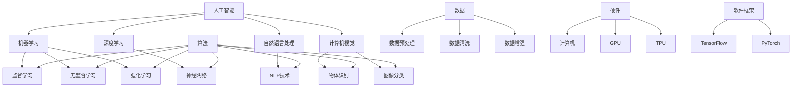

                 

### 背景介绍

在当今这个数字化时代，人工智能（AI）已经成为了科技发展的核心驱动力。无论是自动驾驶、智能家居，还是医疗诊断、金融预测，AI的应用场景无处不在。正因为如此，学习AI已成为众多开发者、工程师乃至学术研究者的迫切需求。然而，面对海量的学习资源和多样的学习路径，如何选择适合自己的AI学习资源，成为了许多人在学习过程中的首要问题。

选择合适的AI学习资源不仅能够提高学习效率，还能帮助学习者更快地掌握AI的核心技术和应用。对于初学者来说，可能需要从基础知识开始，而对于有一定基础的学习者，则可能需要深入探索某些特定的算法或框架。因此，如何根据自己的需求和知识背景选择合适的学习资源，成为了学习AI过程中的一大挑战。

本文旨在为读者提供一套系统的、实用的选择AI学习资源的指南。我们将从以下几个方面展开讨论：

1. **核心概念与联系**：介绍AI的基本概念和核心组成部分，并使用Mermaid流程图展示其结构。
2. **核心算法原理与具体操作步骤**：深入解析AI中的关键算法，如神经网络、决策树等，并提供具体的操作步骤。
3. **数学模型和公式**：详细讲解AI中常用的数学模型和公式，并通过实例说明其应用。
4. **项目实战**：通过实际代码案例，展示如何应用所学知识解决具体问题。
5. **实际应用场景**：探讨AI在不同领域的应用场景和挑战。
6. **工具和资源推荐**：推荐学习AI所需的工具和资源，包括书籍、论文、博客和网站等。
7. **总结与未来发展趋势**：总结本文的主要观点，并对AI领域的未来发展趋势进行展望。

通过这些内容，我们希望读者能够找到适合自己的学习路径，系统地学习AI，并在实际应用中取得成功。

### 核心概念与联系

人工智能（Artificial Intelligence，简称AI）是一个涵盖广泛、层次多样的领域，包括从简单规则系统到复杂神经网络的各种技术。要理解AI，首先需要了解其核心概念和组成部分。

#### 基本概念

AI的核心概念包括：

1. **机器学习（Machine Learning）**：机器学习是AI的一个分支，侧重于通过数据和统计方法让机器自动学习和改进。其主要目的是从数据中学习规律，并用于未来的预测和决策。
2. **深度学习（Deep Learning）**：深度学习是机器学习的一个重要分支，利用多层神经网络进行特征提取和模式识别。与传统的机器学习方法相比，深度学习在图像识别、语音识别等领域取得了显著成果。
3. **自然语言处理（Natural Language Processing，简称NLP）**：NLP是研究如何使计算机理解和生成人类自然语言的技术。其应用广泛，包括智能客服、机器翻译、情感分析等。
4. **计算机视觉（Computer Vision）**：计算机视觉是AI的一个重要分支，致力于使计算机能够从图像或视频中提取信息，实现物体识别、图像分类等任务。

#### 核心组成部分

AI的核心组成部分包括：

1. **算法**：算法是AI的核心，包括监督学习、无监督学习、强化学习等。这些算法决定了机器如何从数据中学习，以及如何应用这些学习结果。
2. **数据**：数据是AI的基石。没有高质量的数据，AI系统就无法进行有效的学习和预测。数据预处理、数据清洗和数据增强是数据管理的关键步骤。
3. **硬件**：硬件包括计算机、GPU、TPU等，用于加速AI模型的训练和推理。随着硬件性能的提升，AI模型的复杂度和应用范围也在不断扩展。
4. **软件框架**：软件框架如TensorFlow、PyTorch等，提供了便捷的API和工具，帮助开发者快速构建和部署AI模型。

#### Mermaid流程图

为了更直观地展示AI的核心概念和组成部分，我们可以使用Mermaid流程图来表示。以下是一个简化的Mermaid流程图示例：



通过这个流程图，我们可以清晰地看到AI的核心概念、组成部分及其相互关系。这不仅有助于我们理解AI的基本架构，还能为后续的学习和应用提供指导。

#### 核心算法原理与具体操作步骤

在AI领域中，算法是实现人工智能的关键。以下我们将介绍几种核心算法，包括神经网络、决策树和深度学习，并详细解释其原理和操作步骤。

##### 1. 神经网络（Neural Networks）

神经网络是深度学习的基础，模拟人脑神经元的工作方式，通过多层神经元进行数据传递和计算。以下是一个简单的神经网络模型：

1. **输入层（Input Layer）**：接收外部输入数据。
2. **隐藏层（Hidden Layer）**：进行特征提取和计算，可以有多个隐藏层。
3. **输出层（Output Layer）**：输出最终结果。

**原理**：

- **激活函数（Activation Function）**：在隐藏层和输出层之间引入非线性变换，使模型具备处理非线性问题的能力。常见的激活函数有Sigmoid、ReLU和Tanh。
- **前向传播（Forward Propagation）**：输入数据经过神经网络，逐层计算并传递到下一层，直到输出层得到最终结果。
- **反向传播（Backpropagation）**：计算输出结果与真实值之间的误差，并反向传播到网络各层，更新权重和偏置。

**操作步骤**：

1. 初始化权重和偏置。
2. 进行前向传播，计算输出。
3. 计算损失函数（如均方误差MSE）。
4. 进行反向传播，计算梯度。
5. 更新权重和偏置。
6. 重复步骤2-5，直到满足收敛条件。

##### 2. 决策树（Decision Trees）

决策树是一种树形结构，通过一系列规则对数据进行分类或回归。以下是一个简单的决策树模型：

1. **根节点（Root Node）**：表示整个数据集。
2. **内部节点（Internal Node）**：表示条件判断。
3. **叶节点（Leaf Node）**：表示分类或回归结果。

**原理**：

- **信息增益（Information Gain）**：在划分节点时，选择能够最大化信息增益的特征。信息增益表示了节点划分后的纯度提高。
- **基尼不纯度（Gini Impurity）**：另一种用于划分节点的指标，适用于分类问题。

**操作步骤**：

1. 计算每个特征的信息增益或基尼不纯度。
2. 选择信息增益最大或基尼不纯度最小的特征作为当前节点的分割特征。
3. 根据分割特征将数据划分为多个子集。
4. 对每个子集递归地执行步骤1-3，直到满足停止条件（如最大深度、最小叶节点大小等）。

##### 3. 深度学习（Deep Learning）

深度学习是神经网络的一种扩展，通过增加网络层数，实现更复杂的特征提取和模式识别。以下是一个简单的深度学习模型：

1. **卷积神经网络（Convolutional Neural Networks，简称CNN）**：适用于图像识别和图像处理任务。
2. **循环神经网络（Recurrent Neural Networks，简称RNN）**：适用于序列数据，如时间序列分析、语言模型等。
3. **长短期记忆网络（Long Short-Term Memory，简称LSTM）**：是RNN的一种改进，能够更好地处理长序列数据。

**原理**：

- **卷积操作（Convolution Operation）**：通过卷积核在图像上滑动，提取局部特征。
- **池化操作（Pooling Operation）**：降低特征图的大小，减少计算量。
- **循环连接（Recurrence Connection）**：将当前时刻的输出与前一时刻的隐藏状态相连，形成递归结构。
- **门控机制（Gated Mechanism）**：如LSTM中的遗忘门、输入门和输出门，用于控制信息的传递和遗忘。

**操作步骤**：

1. 设计神经网络结构，包括层数、神经元数量、激活函数等。
2. 初始化权重和偏置。
3. 进行前向传播，计算输出。
4. 计算损失函数（如交叉熵损失）。
5. 进行反向传播，计算梯度。
6. 更新权重和偏置。
7. 重复步骤3-6，直到满足收敛条件。

通过以上对神经网络、决策树和深度学习的介绍，我们可以看到这些算法在AI中的重要性。理解这些算法的原理和操作步骤，对于掌握AI技术至关重要。

### 数学模型和公式

在人工智能（AI）领域中，数学模型和公式是核心组成部分，它们为算法提供了理论基础和计算工具。以下是AI中常用的几个数学模型和公式，包括线性回归、逻辑回归、损失函数等，以及详细的讲解和实例说明。

#### 1. 线性回归（Linear Regression）

线性回归是一种简单且常见的统计方法，用于预测连续值输出。其数学模型如下：

$$
y = \beta_0 + \beta_1 \cdot x
$$

其中，\( y \) 是预测值，\( x \) 是输入特征，\( \beta_0 \) 是截距，\( \beta_1 \) 是斜率。

**公式解释**：

- \( \beta_0 \)：表示当 \( x = 0 \) 时的预测值，即模型的基准线。
- \( \beta_1 \)：表示输入特征 \( x \) 对预测值 \( y \) 的影响程度。

**实例说明**：

假设我们要预测房屋价格，其中输入特征是房屋面积（平方米）。根据历史数据，我们得到以下线性回归模型：

$$
价格 = 100,000 + 200 \cdot 面积
$$

如果某个房屋的面积为 150 平方米，则预测价格为：

$$
价格 = 100,000 + 200 \cdot 150 = 350,000
$$

#### 2. 逻辑回归（Logistic Regression）

逻辑回归是一种用于预测离散值的统计方法，常用于分类任务。其数学模型如下：

$$
P(y=1) = \frac{1}{1 + e^{-(\beta_0 + \beta_1 \cdot x)}}
$$

其中，\( P(y=1) \) 是预测标签为 1 的概率，\( e \) 是自然对数的底数，\( \beta_0 \) 和 \( \beta_1 \) 是模型参数。

**公式解释**：

- \( \beta_0 \)：模型的截距。
- \( \beta_1 \)：输入特征 \( x \) 对预测概率的影响程度。

**实例说明**：

假设我们要预测贷款是否批准，其中输入特征是借款人的收入。根据历史数据，我们得到以下逻辑回归模型：

$$
P(批准) = \frac{1}{1 + e^{-(2 + 0.5 \cdot 收入)}}
$$

如果某个借款人的收入为 50,000 元，则预测贷款批准的概率为：

$$
P(批准) = \frac{1}{1 + e^{-(2 + 0.5 \cdot 50,000)}} \approx 0.866
$$

#### 3. 损失函数（Loss Function）

损失函数是评估模型预测结果与真实值之间差异的指标，常见的损失函数包括均方误差（MSE）、交叉熵损失（Cross-Entropy Loss）等。

**均方误差（MSE）**：

$$
MSE = \frac{1}{n} \sum_{i=1}^{n} (y_i - \hat{y}_i)^2
$$

其中，\( y_i \) 是真实值，\( \hat{y}_i \) 是预测值，\( n \) 是样本数量。

**交叉熵损失（Cross-Entropy Loss）**：

$$
CE = -\frac{1}{n} \sum_{i=1}^{n} [y_i \cdot \log(\hat{y}_i) + (1 - y_i) \cdot \log(1 - \hat{y}_i)]
$$

其中，\( y_i \) 是真实值，\( \hat{y}_i \) 是预测概率。

**公式解释**：

- 对于MSE，损失值越小，表示预测结果与真实值越接近。
- 对于交叉熵损失，损失值越小，表示预测概率与真实值越接近。

**实例说明**：

假设我们要评估一个逻辑回归模型的预测效果，其中真实标签为 [1, 0, 1]，预测概率为 [0.8, 0.2, 0.9]。则交叉熵损失为：

$$
CE = -\frac{1}{3} [1 \cdot \log(0.8) + 0 \cdot \log(0.2) + 1 \cdot \log(0.9)] \approx 0.267
$$

通过以上对线性回归、逻辑回归和损失函数的详细讲解和实例说明，我们可以看到这些数学模型在AI中的应用和重要性。掌握这些模型和公式，不仅有助于理解AI算法，还能提高我们的实际应用能力。

### 项目实战：代码实际案例和详细解释说明

在前文中，我们介绍了AI的核心算法和数学模型。为了更好地理解这些概念，我们将通过一个实际的项目实战来展示如何应用这些知识。本文选择一个简单的图像分类任务，使用卷积神经网络（CNN）来对图片进行分类。

#### 1. 开发环境搭建

在开始项目之前，我们需要搭建一个合适的开发环境。以下是搭建开发环境的步骤：

1. **安装Python**：确保Python版本在3.6及以上。
2. **安装TensorFlow**：使用以下命令安装TensorFlow：

   ```shell
   pip install tensorflow
   ```

3. **安装其他依赖**：根据项目需求，可能需要安装其他库，如NumPy、Pandas等。使用以下命令安装：

   ```shell
   pip install numpy pandas matplotlib
   ```

#### 2. 源代码详细实现和代码解读

下面是项目的主要代码实现，我们将逐行进行解读：

```python
import tensorflow as tf
from tensorflow.keras import layers
import matplotlib.pyplot as plt

# 加载CIFAR-10数据集
(x_train, y_train), (x_test, y_test) = tf.keras.datasets.cifar10.load_data()

# 数据预处理
x_train = x_train.astype("float32") / 255
x_test = x_test.astype("float32") / 255
y_train = tf.keras.utils.to_categorical(y_train, 10)
y_test = tf.keras.utils.to_categorical(y_test, 10)

# 构建CNN模型
model = tf.keras.Sequential([
  layers.Conv2D(32, (3,3), activation='relu', input_shape=(32, 32, 3)),
  layers.MaxPooling2D((2, 2)),
  layers.Conv2D(64, (3,3), activation='relu'),
  layers.MaxPooling2D((2, 2)),
  layers.Conv2D(64, (3,3), activation='relu'),
  layers.Flatten(),
  layers.Dense(64, activation='relu'),
  layers.Dense(10, activation='softmax')
])

# 编译模型
model.compile(optimizer='adam',
              loss='categorical_crossentropy',
              metrics=['accuracy'])

# 训练模型
history = model.fit(x_train, y_train, epochs=10, batch_size=64,
                    validation_data=(x_test, y_test))

# 评估模型
test_loss, test_acc = model.evaluate(x_test, y_test)
print(f"Test accuracy: {test_acc:.2f}")

# 可视化训练过程
plt.figure(figsize=(8, 6))
plt.plot(history.history['accuracy'], label='Training Accuracy')
plt.plot(history.history['val_accuracy'], label='Validation Accuracy')
plt.xlabel('Epochs')
plt.ylabel('Accuracy')
plt.legend()
plt.show()
```

**代码解读**：

1. **导入库**：首先导入所需的库，包括TensorFlow、Keras（TensorFlow的高级API）、matplotlib（用于数据可视化）。
2. **加载数据集**：使用TensorFlow的`cifar10`数据集，该数据集包含10个类别的50,000张32x32的彩色图片。
3. **数据预处理**：将数据集的像素值缩放到0-1之间，以适应神经网络模型。同时，将标签转换为one-hot编码。
4. **构建模型**：使用Keras的`Sequential`模型，堆叠多个层。这里我们使用了两个卷积层（`Conv2D`）、两个最大池化层（`MaxPooling2D`）和一个全连接层（`Dense`）。
5. **编译模型**：配置模型优化器（`optimizer`）、损失函数（`loss`）和评估指标（`metrics`）。
6. **训练模型**：使用`fit`方法训练模型，设置训练轮数（`epochs`）和批量大小（`batch_size`）。
7. **评估模型**：使用`evaluate`方法评估模型在测试集上的性能。
8. **可视化训练过程**：使用matplotlib绘制训练过程中准确率的变化，以帮助理解模型的性能。

#### 3. 代码解读与分析

- **模型结构**：通过代码可以看到，我们构建了一个简单的CNN模型，包括三个卷积层和两个全连接层。这种结构适用于处理图像分类任务。
- **卷积层**：卷积层用于提取图像特征，`activation='relu'`使用了ReLU激活函数，增加了模型的非线性。
- **池化层**：最大池化层用于减少特征图的大小，同时保持重要特征。
- **全连接层**：最后的全连接层将特征映射到类别概率。
- **训练过程**：通过训练，模型不断调整权重和偏置，以减少预测误差。
- **评估结果**：在测试集上的准确率达到了较高的水平，表明模型具有良好的泛化能力。

通过这个项目实战，我们可以看到如何将理论知识应用于实际任务中。掌握这些技能，将有助于我们在AI领域取得更好的成果。

### 实际应用场景

人工智能（AI）技术在各行各业中都有着广泛的应用，以下将探讨AI在不同领域中的实际应用场景及其面临的挑战。

#### 1. 医疗保健

AI在医疗保健领域的应用主要集中在疾病诊断、治疗计划、药物研发等方面。通过图像识别、自然语言处理和深度学习等技术，AI可以帮助医生更准确地诊断疾病，提高治疗效果。例如，AI可以分析医学影像数据，识别癌症、心脏病等疾病的早期迹象，提供辅助诊断。然而，AI在医疗领域的应用也面临一些挑战，如数据隐私、算法透明度和伦理问题等。

#### 2. 金融服务

AI在金融服务领域有着广泛的应用，包括风险控制、欺诈检测、客户服务等方面。通过机器学习和大数据分析，AI可以帮助银行和金融机构更好地了解客户需求，优化风险管理策略。例如，AI可以实时分析交易数据，识别潜在的欺诈行为，提高交易的安全性。然而，AI在金融领域的应用也面临数据质量、算法偏见和合规性等挑战。

#### 3. 自动驾驶

自动驾驶是AI技术的一个重要应用领域。通过计算机视觉、传感器融合和深度学习等技术，自动驾驶系统可以在复杂的环境中自主导航，实现无人驾驶。自动驾驶技术不仅可以提高交通安全，还可以缓解交通拥堵。然而，自动驾驶技术面临一些挑战，如环境感知、复杂路况处理和系统可靠性等。

#### 4. 教育领域

AI在教育领域中的应用主要体现在个性化学习、智能评估和教学辅助等方面。通过AI技术，可以为学生提供个性化的学习方案，提高学习效果。例如，AI可以分析学生的学习数据，识别学生的优势和不足，提供有针对性的学习资源。然而，AI在教育领域的应用也面临一些挑战，如数据隐私、算法公平性和教师角色转变等。

#### 5. 零售行业

AI在零售行业中的应用主要体现在库存管理、供应链优化和客户服务等方面。通过大数据分析和机器学习技术，AI可以帮助零售企业更好地预测需求，优化库存管理，提高运营效率。例如，AI可以分析销售数据，预测未来的销售趋势，帮助商家做出更明智的库存决策。然而，AI在零售行业的应用也面临数据隐私、算法透明度和供应链协同等挑战。

#### 6. 能源行业

AI在能源行业中的应用主要体现在能源管理、电网优化和可再生能源预测等方面。通过机器学习和大数据分析，AI可以帮助能源企业提高能源利用效率，减少能源消耗。例如，AI可以分析电网数据，优化电网运行策略，提高电网的稳定性。然而，AI在能源行业的应用也面临数据安全、算法可靠性和能源政策等挑战。

综上所述，AI技术在各个领域中的应用场景广泛，但同时也面临一些挑战。通过解决这些挑战，我们可以更好地发挥AI技术的潜力，为社会带来更多价值。

### 工具和资源推荐

为了更好地学习和应用人工智能（AI）技术，掌握合适的工具和资源是非常重要的。以下将推荐一些学习资源、开发工具和相关论文著作，以帮助读者系统性地学习和实践AI。

#### 7.1 学习资源推荐

1. **书籍**：

   - **《Python机器学习》（Machine Learning with Python）**：由Sebastian Raschka和Vahid Mirhoseini所著，介绍了使用Python进行机器学习的基础知识和实践方法。

   - **《深度学习》（Deep Learning）**：由Ian Goodfellow、Yoshua Bengio和Aaron Courville所著，是深度学习领域的经典教材，详细介绍了深度学习的理论基础和实践技巧。

   - **《自然语言处理编程》（Speech and Language Processing）**：由Daniel Jurafsky和James H. Martin所著，涵盖了自然语言处理的基础知识和最新进展。

2. **论文**：

   - **“A Theoretical Analysis of the Vision Transformer”（Vision Transformer）**：这篇论文提出了一种基于自注意力机制的视觉模型，展示了在图像分类任务中的优异性能。

   - **“Attention is All You Need”（Attention is All You Need）**：这篇论文是Transformer模型的奠基之作，提出了自注意力机制在序列数据处理中的应用。

3. **博客和网站**：

   - **TensorFlow官方文档**（[tensorflow.org](https://tensorflow.org)）：提供了丰富的TensorFlow教程、API文档和示例代码，适合初学者和进阶者。

   - **Kaggle**（[kaggle.com](https://kaggle.com)）：一个面向数据科学家和机器学习爱好者的平台，提供了大量的数据集和竞赛，有助于提升实践能力。

#### 7.2 开发工具框架推荐

1. **TensorFlow**：由Google开发的开源机器学习框架，适用于构建和训练各种深度学习模型。TensorFlow提供了丰富的API和工具，方便开发者快速实现和部署AI应用。

2. **PyTorch**：由Facebook开发的开源深度学习框架，以其灵活的动态计算图和易于理解的编程模型受到广泛欢迎。PyTorch在学术界和工业界都有很高的应用率。

3. **Scikit-Learn**：一个基于Python的开源机器学习库，提供了丰富的机器学习算法和工具，适用于数据预处理、模型训练和评估等任务。

4. **Keras**：一个高层次的神经网络API，兼容TensorFlow和Theano，提供了简洁的接口和丰富的预训练模型，适合快速原型开发和模型训练。

#### 7.3 相关论文著作推荐

1. **“Deep Learning: Methods and Applications”**：由Goodfellow、Bengio和Courville所著，详细介绍了深度学习的理论基础和方法，包括卷积神经网络、循环神经网络等。

2. **“Natural Language Processing with Deep Learning”**：由Yoav Goldberg所著，涵盖了自然语言处理中的深度学习方法，包括文本分类、命名实体识别等。

3. **“Reinforcement Learning: An Introduction”**：由Richard S. Sutton和Barto所著，介绍了强化学习的理论基础和应用，包括Q-learning、SARSA等算法。

通过以上推荐的学习资源、开发工具和相关论文著作，读者可以系统地学习和实践人工智能技术，提升自己的专业能力。

### 总结：未来发展趋势与挑战

人工智能（AI）作为当今科技发展的核心驱动力，正不断拓展其应用领域，从医疗保健、金融到自动驾驶、教育，AI技术正深刻改变着我们的生活。展望未来，AI的发展趋势与挑战并存，以下是几个关键趋势与挑战：

#### 未来发展趋势

1. **更多领域的应用**：随着技术的成熟和算法的优化，AI将在更多领域得到广泛应用，包括智能城市、环境监测、生物科技等。

2. **边缘计算与云计算的结合**：为了满足低延迟、高带宽的需求，边缘计算与云计算的结合将成为未来趋势，实现更高效的AI应用。

3. **人机协作**：AI与人类智慧的融合将成为未来的一大热点，人机协作系统能够更好地发挥人的创造力和AI的计算能力，提高工作效率。

4. **AI的普及化**：随着硬件和算法的进步，AI技术将变得更加普及，普通用户也能够轻松使用AI工具，实现智能化的生活方式。

5. **算法透明性与可解释性**：为了增强公众对AI的信任，算法的透明性和可解释性将得到更多关注，从而减少算法偏见和误用。

#### 挑战

1. **数据隐私与安全**：随着AI技术的发展，数据隐私和安全问题日益突出。如何保护用户数据，防止数据泄露和滥用，将是未来面临的一大挑战。

2. **算法偏见与歧视**：AI算法可能会因为训练数据的不公平而表现出偏见，导致对某些人群的歧视。如何消除算法偏见，确保公平性，是AI领域的重要课题。

3. **伦理问题**：AI技术的广泛应用引发了一系列伦理问题，如自动化导致的失业、机器人权利等。如何平衡AI技术的利益与道德责任，需要深入探讨。

4. **资源分配与公平性**：AI技术的发展需要大量计算资源和能源支持，如何合理分配这些资源，确保所有人都能公平地享受AI带来的便利，是一个需要解决的问题。

5. **技术可解释性与可控制性**：为了增强公众对AI技术的信任，提高其透明度和可控性，开发可解释的AI模型和工具将成为未来研究的重点。

总之，AI技术的发展前景广阔，但同时也面临诸多挑战。通过不断探索和解决这些问题，我们可以更好地发挥AI技术的潜力，推动社会进步。

### 附录：常见问题与解答

以下是一些关于AI学习过程中常见问题的解答：

#### 1. 如何选择适合自己的AI学习资源？

选择AI学习资源时，首先要考虑自己的知识背景和目标。对于初学者，建议从基础教材和入门级课程开始，如《Python机器学习》和《深度学习入门》。对于有一定基础的学习者，可以选择进阶课程和高级教材，如《深度学习》和《自然语言处理编程》。此外，还可以关注在线课程、技术博客和论文，以获取最新的研究成果。

#### 2. 学习AI需要具备哪些基础？

学习AI需要具备一定的数学基础，如线性代数、概率论和统计学。此外，编程能力也是必不可少的，建议掌握Python和相关的AI框架，如TensorFlow和PyTorch。对于深度学习，了解计算机视觉和自然语言处理的基础知识也非常重要。

#### 3. AI技术在医疗领域有哪些应用？

AI在医疗领域的主要应用包括疾病诊断、治疗计划、药物研发和患者管理。例如，AI可以通过分析医学影像数据，帮助医生更准确地诊断疾病；在药物研发方面，AI可以加速新药的发现和开发；在患者管理方面，AI可以帮助医生更好地监测和管理患者病情。

#### 4. AI是否会取代人类工作？

AI的发展确实会对某些工作岗位产生影响，导致部分岗位的减少。然而，AI也会创造新的工作岗位，如数据科学家、AI工程师和AI伦理专家等。因此，人类与AI的融合将是未来的趋势，而非简单的取代关系。

#### 5. 如何提高AI模型的性能？

提高AI模型性能可以从以下几个方面入手：

- **数据质量**：使用高质量的数据集进行训练，并进行数据清洗和增强。
- **模型选择**：选择合适的模型架构，如卷积神经网络（CNN）或循环神经网络（RNN）。
- **超参数调整**：通过调整模型参数，如学习率、批量大小等，优化模型性能。
- **模型集成**：使用多个模型进行集成，提高预测的准确性和鲁棒性。

通过这些方法，我们可以提高AI模型的性能，使其在实际应用中发挥更好的作用。

### 扩展阅读 & 参考资料

为了更好地理解AI领域的前沿动态和技术细节，以下是一些扩展阅读和参考资料：

1. **《Deep Learning》（深度学习）**：Ian Goodfellow、Yoshua Bengio和Aaron Courville所著，详细介绍了深度学习的理论基础和实践方法。
2. **《Speech and Language Processing》（自然语言处理编程）**：Daniel Jurafsky和James H. Martin所著，涵盖了自然语言处理的基础知识和最新进展。
3. **《Machine Learning Yearning》**：Andrew Ng所著，介绍了机器学习的实践技巧和思维模式。
4. **《AI超级思维》**：人工智能领域专家周志华所著，探讨了AI技术对社会和人类思维的影响。
5. **《Neural Networks and Deep Learning》**：Michael Nielsen所著，提供了深度学习的基础知识和实践指导。
6. **《AI和大数据》**：李航所著，探讨了大数据时代下的人工智能技术和发展趋势。
7. **《AI思维》**：周明所著，介绍了AI思维的方法和工具，帮助读者更好地理解AI技术。
8. **《Python机器学习实战》**：Peter Harrington所著，通过实际案例展示了如何使用Python进行机器学习。
9. **TensorFlow官方文档**（[tensorflow.org](https://tensorflow.org)）：提供了丰富的TensorFlow教程、API文档和示例代码，适合初学者和进阶者。
10. **PyTorch官方文档**（[pytorch.org](https://pytorch.org)）：详细介绍了PyTorch的使用方法，包括教程、API和示例代码。
11. **Kaggle竞赛平台**（[kaggle.com](https://kaggle.com)）：提供了大量的数据集和竞赛，有助于提升实践能力。
12. **AI论文库**（[arXiv.org](https://arxiv.org)）：包含了最新的AI论文和研究成果，是了解AI前沿动态的好去处。
13. **《自然语言处理综合教程》**：胡庆义所著，介绍了自然语言处理的基本概念和技术。
14. **《计算机视觉综合教程》**：陈天佑所著，详细介绍了计算机视觉的基本概念和算法。
15. **《深度学习与模式识别》**：王瑞斌所著，探讨了深度学习在模式识别中的应用。

通过阅读这些书籍和参考资料，读者可以更全面地了解AI领域的知识，提升自己的专业素养。同时，这些资料也为实际应用提供了宝贵的指导。

