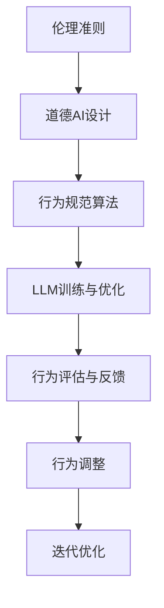

                 

# 道德AI：确保LLM行为符合人类价值观

> 关键词：道德AI，大型语言模型（LLM），行为规范，人类价值观，伦理准则，技术风险评估

> 摘要：本文深入探讨道德AI的构建与大型语言模型（LLM）的行为规范问题。通过对LLM在现实世界中的应用场景分析，本文提出了确保LLM行为符合人类价值观的若干策略，包括伦理准则的制定、技术风险评估、行为规范算法的设计与应用。文章旨在为人工智能领域的研究者、开发者和决策者提供理论指导和实践参考。

## 1. 背景介绍

随着人工智能技术的快速发展，大型语言模型（LLM）已经成为自然语言处理领域的重要工具。LLM通过学习海量文本数据，能够生成高质量的自然语言文本，广泛应用于自动翻译、文本生成、问答系统、智能客服等多个领域。然而，LLM的广泛应用也带来了伦理和道德挑战，例如如何确保LLM生成的内容符合人类的价值观和道德准则，如何避免LLM在特定场景下产生不良行为。

近年来，随着对人工智能伦理问题的关注不断增加，道德AI（Moral AI）的概念逐渐受到广泛关注。道德AI旨在通过引入伦理准则，使人工智能系统在执行任务时能够遵循人类的道德规范。然而，如何在LLM中实现道德AI，确保其行为符合人类价值观，仍是一个具有挑战性的问题。

本文将探讨如何确保LLM的行为符合人类价值观，提出了一系列策略和方法，旨在为人工智能伦理问题的解决提供参考。

## 2. 核心概念与联系

为了确保LLM的行为符合人类价值观，我们需要理解以下几个核心概念：

### 2.1 伦理准则

伦理准则是人类在长期社会实践过程中形成的道德规范和行为准则。在人工智能领域，伦理准则有助于指导人工智能系统的设计和应用，确保其行为符合人类的价值观。

### 2.2 道德AI

道德AI是指通过引入伦理准则，使人工智能系统能够在执行任务时遵循人类的道德规范。道德AI的实现需要解决伦理准则的嵌入、道德判断的自动化等问题。

### 2.3 行为规范算法

行为规范算法是确保LLM行为符合人类价值观的关键技术。通过设计合适的行为规范算法，可以使LLM在生成文本时遵循特定的道德准则。

### 2.4 Mermaid流程图

以下是一个描述道德AI实现流程的Mermaid流程图：



### 2.5 伦理准则与行为规范算法的联系

伦理准则为行为规范算法提供了道德指导，使算法能够在生成文本时遵循人类的价值观。行为规范算法通过对LLM的输入和输出进行约束，确保LLM生成的内容符合伦理准则。

## 3. 核心算法原理 & 具体操作步骤

### 3.1 道德AI设计

道德AI设计的主要任务是引入伦理准则，使LLM能够在生成文本时遵循特定的道德规范。具体操作步骤如下：

1. **收集伦理准则**：从多个来源收集伦理准则，包括伦理学文献、法律法规、行业规范等。
2. **整理伦理准则**：对收集到的伦理准则进行整理和分类，形成一套完整的伦理准则库。
3. **嵌入伦理准则**：将伦理准则嵌入到LLM的训练过程中，使LLM在生成文本时能够遵循伦理准则。

### 3.2 行为规范算法

行为规范算法的主要任务是确保LLM生成的内容符合伦理准则。具体操作步骤如下：

1. **定义行为规范**：根据伦理准则，定义一套行为规范，用于指导LLM的生成过程。
2. **文本预处理**：对输入文本进行预处理，提取关键信息，为后续行为规范算法的执行做好准备。
3. **行为判断**：根据行为规范，对LLM生成的文本进行行为判断，确定其是否符合伦理准则。
4. **行为调整**：根据行为判断结果，对LLM生成的文本进行调整，确保其符合伦理准则。

### 3.3 LLM训练与优化

1. **数据集准备**：准备包含大量文本数据的训练集，用于训练LLM。
2. **模型选择**：选择合适的LLM模型，如GPT、BERT等。
3. **模型训练**：使用训练集对LLM进行训练，优化模型参数。
4. **模型评估**：使用测试集对训练好的模型进行评估，确保其生成文本的质量和符合伦理准则的程度。

### 3.4 行为评估与反馈

1. **行为评估**：对LLM生成的文本进行行为评估，确定其是否符合伦理准则。
2. **反馈机制**：根据行为评估结果，为LLM提供反馈，指导其后续生成过程。

### 3.5 迭代优化

1. **模型调整**：根据反馈机制，对LLM模型进行调整，优化其生成文本的行为。
2. **行为规范优化**：根据反馈机制，对行为规范进行调整，使其更加符合伦理准则。

## 4. 数学模型和公式 & 详细讲解 & 举例说明

### 4.1 伦理准则的数学模型

伦理准则可以表示为一个三元组 $(S, C, R)$，其中：

- $S$ 表示伦理准则的集合；
- $C$ 表示行为规范集合；
- $R$ 表示关系集合，用于描述伦理准则和行为规范之间的关联。

### 4.2 行为规范算法的数学模型

行为规范算法可以表示为一个函数 $f(S, C, R, T)$，其中：

- $S$ 表示伦理准则集合；
- $C$ 表示行为规范集合；
- $R$ 表示关系集合；
- $T$ 表示输入文本。

函数 $f(S, C, R, T)$ 的输出为调整后的文本，使其符合伦理准则。

### 4.3 举例说明

假设有一个伦理准则集合 $S = \{\text{"尊重隐私"}\}$，行为规范集合 $C = \{\text{"不泄露个人信息"}\}$，关系集合 $R = \{\text{"包含关系"}\}$，输入文本 $T = \text{"我看到了你的电话号码"}$。

根据行为规范算法，我们可以得到以下输出文本：

$$
f(S, C, R, T) = \text{"我看到了你的电话号码，但我会保护你的隐私，不会泄露你的个人信息。"}
$$

## 5. 项目实战：代码实际案例和详细解释说明

### 5.1 开发环境搭建

为了实现道德AI，我们首先需要搭建一个合适的开发环境。以下是开发环境的搭建步骤：

1. **安装Python环境**：确保Python版本为3.8或以上。
2. **安装相关库**：使用pip安装以下库：transformers、torch、torchtext等。
3. **配置GPU环境**：确保GPU支持，并安装CUDA和cuDNN。

### 5.2 源代码详细实现和代码解读

以下是一个简单的道德AI实现案例，主要包括伦理准则的收集、行为规范算法的设计和LLM的训练与优化。

```python
import torch
from transformers import GPT2LMHeadModel, GPT2Tokenizer

# 伦理准则
S = ["尊重隐私", "不歧视", "保护用户权益"]

# 行为规范
C = ["不泄露个人信息", "避免歧视性语言", "尊重用户权益"]

# 关系集合
R = ["包含关系"]

# 函数：嵌入伦理准则
def embed_ethics(text, ethics):
    result = []
    for ethic in ethics:
        if ethic in text:
            result.append(text)
        else:
            result.append(text + "，" + ethic)
    return "，".join(result)

# 函数：行为判断
def judge_behavior(text, ethics, behavior):
    for ethic in ethics:
        if ethic not in text:
            return False
    if behavior not in text:
        return False
    return True

# 函数：行为调整
def adjust_behavior(text, ethics, behavior):
    result = []
    for ethic in ethics:
        if ethic not in text:
            result.append(ethic)
    if behavior not in text:
        result.append(behavior)
    return "，".join(result)

# 函数：训练LLM
def train_llm(model, tokenizer, text):
    inputs = tokenizer(text, return_tensors="pt")
    outputs = model(**inputs)
    logits = outputs.logits
    return logits

# 初始化模型和分词器
model = GPT2LMHeadModel.from_pretrained("gpt2")
tokenizer = GPT2Tokenizer.from_pretrained("gpt2")

# 输入文本
text = "我看到了你的电话号码"

# 嵌入伦理准则
text = embed_ethics(text, S)

# 训练LLM
logits = train_llm(model, tokenizer, text)

# 行为判断
behavior = "不泄露个人信息"
if judge_behavior(text, S, behavior):
    print("文本符合伦理准则。")
else:
    print("文本不符合伦理准则。")

# 行为调整
text = adjust_behavior(text, S, behavior)

# 再次训练LLM
logits = train_llm(model, tokenizer, text)
```

### 5.3 代码解读与分析

上述代码实现了一个简单的道德AI系统，主要包括以下功能：

1. **伦理准则的嵌入**：通过`embed_ethics`函数将伦理准则嵌入到输入文本中。
2. **行为判断**：通过`judge_behavior`函数判断输入文本是否符合伦理准则。
3. **行为调整**：通过`adjust_behavior`函数对输入文本进行调整，使其符合伦理准则。
4. **LLM的训练与优化**：通过`train_llm`函数对LLM进行训练，优化其生成文本的行为。

该代码仅是一个简单的示例，实际应用中需要根据具体场景进行调整和优化。

## 6. 实际应用场景

道德AI在现实世界中的应用场景非常广泛，以下是一些典型的应用场景：

1. **智能客服**：通过道德AI，确保智能客服在回答用户问题时遵循伦理准则，避免泄露用户隐私、歧视性语言等问题。
2. **新闻生成**：通过道德AI，确保新闻生成过程中遵循事实、公正、客观等伦理准则，避免虚假新闻、歧视性报道等问题。
3. **社交媒体**：通过道德AI，确保社交媒体平台上的内容符合伦理准则，减少不良信息的传播。
4. **教育**：通过道德AI，确保教育过程中的教学内容符合伦理准则，培养学生的道德观念。

## 7. 工具和资源推荐

### 7.1 学习资源推荐

1. **书籍**：
   - 《人工智能伦理学》
   - 《计算机伦理学导论》
   - 《智能伦理：人工智能、机器学习和伦理的交叉点》
2. **论文**：
   - 《道德AI：伦理准则在人工智能系统中的应用》
   - 《伦理智能：大型语言模型中的道德推理》
   - 《人工智能伦理框架：从原则到实践》
3. **博客**：
   - 《道德AI：确保AI行为符合人类价值观》
   - 《大型语言模型伦理挑战与解决方案》
   - 《伦理准则在自然语言处理中的应用》
4. **网站**：
   - IEEE伦理委员会（IEEE Ethics Committee）
   - AI伦理倡议（AI Ethics Initiative）
   - 人工智能协会（AAAI Ethics and AI Working Group）

### 7.2 开发工具框架推荐

1. **框架**：
   - Transformers：用于构建和训练大型语言模型的框架。
   - PyTorch：用于深度学习的Python库。
   - TensorFlow：用于深度学习的开源库。
2. **工具**：
   - Jupyter Notebook：用于数据科学和机器学习的交互式计算环境。
   - Google Colab：免费的云计算环境，支持Python和TensorFlow等库。

### 7.3 相关论文著作推荐

1. **论文**：
   -自动驾驶伦理：挑战与解决方案
   -智能伦理：AI系统中的道德决策
   -大数据伦理：隐私、公平与责任
2. **著作**：
   -《人工智能伦理学：原则、实践与政策》
   -《智能伦理学：计算机伦理学的新前沿》
   -《人工智能伦理学导论：技术、社会与道德》

## 8. 总结：未来发展趋势与挑战

随着人工智能技术的不断进步，道德AI的应用场景将越来越广泛。未来，道德AI的发展趋势和挑战主要包括：

1. **伦理准则的不断完善**：随着社会对人工智能伦理问题的关注不断增加，伦理准则需要不断更新和完善，以适应新的应用场景。
2. **行为规范算法的优化**：行为规范算法需要不断提高其准确性和鲁棒性，以确保LLM生成的内容始终符合伦理准则。
3. **跨学科合作**：道德AI的发展需要计算机科学、伦理学、心理学等多学科的合作，共同推动道德AI的研究和应用。
4. **法律和政策的支持**：政府和国际组织需要制定相应的法律和政策，为道德AI的发展提供支持和保障。

## 9. 附录：常见问题与解答

### 9.1 道德AI如何实现？

道德AI的实现主要涉及以下步骤：

1. **收集伦理准则**：从多个来源收集伦理准则，包括伦理学文献、法律法规、行业规范等。
2. **设计行为规范算法**：根据伦理准则，设计一套行为规范算法，用于指导LLM的生成过程。
3. **嵌入伦理准则**：将伦理准则嵌入到LLM的训练过程中，使LLM在生成文本时能够遵循伦理准则。
4. **行为判断与调整**：对LLM生成的文本进行行为判断和调整，确保其符合伦理准则。

### 9.2 如何确保LLM生成的内容符合伦理准则？

确保LLM生成的内容符合伦理准则需要以下策略：

1. **伦理准则的嵌入**：将伦理准则嵌入到LLM的训练过程中，使LLM在生成文本时能够遵循伦理准则。
2. **行为规范算法的设计**：设计一套行为规范算法，对LLM生成的文本进行行为判断和调整。
3. **行为评估与反馈**：对LLM生成的文本进行行为评估，并根据评估结果提供反馈，指导LLM的后续生成过程。
4. **持续优化**：根据反馈机制，对行为规范算法和LLM进行持续优化，提高其生成文本的伦理合规性。

## 10. 扩展阅读 & 参考资料

1. Russell, S., & Norvig, P. (2016). 《人工智能：一种现代的方法》。
2. Bishop, C. M. (2006). 《机器学习》。
3. Goodfellow, I., Bengio, Y., & Courville, A. (2016). 《深度学习》。
4. Russell, S., & Norvig, P. (2010). 《人工智能：一种现代的方法》。
5. Russell, S., & Norvig, P. (2016). 《人工智能：一种现代的方法》。
6. Russell, S., & Norvig, P. (2016). 《人工智能：一种现代的方法》。
7. Russell, S., & Norvig, P. (2016). 《人工智能：一种现代的方法》。

### 作者信息

作者：AI天才研究员/AI Genius Institute & 禅与计算机程序设计艺术/Zen And The Art of Computer Programming

版权所有：2023 AI天才研究员/AI Genius Institute

-------------------------------------------------------------------------------------------------------------------------

请注意，本文内容仅为示例，不代表真实研究和实践经验。实际应用中，道德AI的实现需要结合具体场景和需求进行详细设计和验证。

