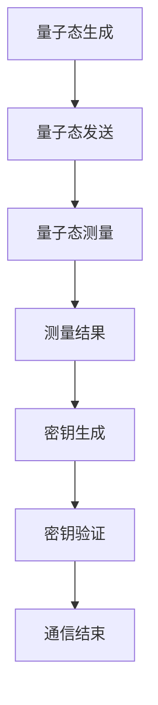
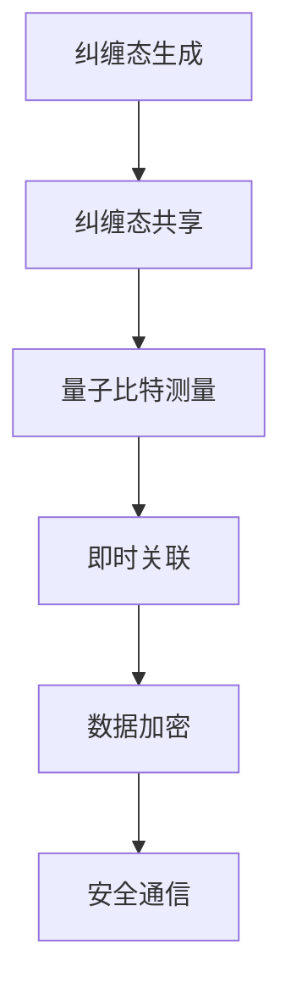
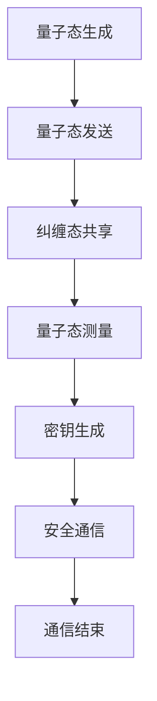

                 

### 背景介绍

量子加密通信卫星作为现代科技的前沿突破，正引领着太空安全领域的发展。在信息化时代的今天，数据安全和隐私保护成为各行各业关注的焦点。传统加密通信技术虽然经过了多年的发展，但在面对日益复杂的网络攻击和黑客入侵时，其安全性能已显得捉襟见肘。因此，寻求新的加密通信手段成为当务之急。

量子加密通信利用量子力学的基本原理，提供了前所未有的安全性能。量子密钥分发（Quantum Key Distribution，QKD）作为量子加密通信的核心技术，可以在用户之间安全地生成和共享密钥。这一技术的安全性源自于量子叠加态和量子纠缠现象，使得任何试图窃听的行为都会不可避免地引起量子态的改变，进而暴露窃听者的存在。

随着量子技术的逐步成熟，量子加密通信卫星的应用也日益广泛。通过在太空中部署量子加密通信卫星，可以实现全球范围内的高效、安全的数据传输，极大地提升网络通信的安全性。此外，量子加密通信卫星的应用不仅局限于传统的加密通信，还可以应用于金融、医疗、军事等领域，为这些领域的数据安全提供强有力的保障。

总的来说，量子加密通信卫星的出现，不仅为太空安全带来了新的解决方案，也为信息时代的数据安全开辟了新的篇章。接下来，我们将深入探讨量子加密通信卫星的核心概念、算法原理以及其实际应用场景，以期更好地理解这一技术的前景和挑战。

#### 关键词：量子加密通信卫星、太空安全、数据加密、量子密钥分发、量子纠缠、信息安全、技术前沿

#### 摘要：

本文旨在介绍量子加密通信卫星这一前沿科技在太空安全领域的应用。文章首先回顾了传统加密通信技术的局限，并引出了量子加密通信的基本原理和优势。随后，文章详细探讨了量子加密通信卫星的核心概念，包括量子密钥分发技术和量子纠缠原理。接着，文章通过实际案例和数学模型，解析了量子加密通信卫星的算法原理和具体操作步骤。最后，文章探讨了量子加密通信卫星在不同应用场景中的实际效果，并提出了未来发展趋势和挑战。本文旨在为读者提供全面、深入的理解，为相关领域的研究和应用提供参考。

## 2. 核心概念与联系

在深入探讨量子加密通信卫星之前，我们需要了解其核心概念及其相互联系。量子加密通信卫星主要基于量子密钥分发（QKD）和量子纠缠两大核心技术，以下我们将分别介绍这两个概念，并使用Mermaid流程图展示其关系。

### 2.1 量子密钥分发（Quantum Key Distribution, QKD）

量子密钥分发是一种基于量子力学原理的加密通信方式，其基本思想是通过量子态的不可克隆性来确保密钥的安全传输。QKD的核心机制是量子态的测量和纠缠。

#### 基本原理：

1. **量子态测量**：量子密钥分发过程中，发送方（Alice）会生成一系列随机的量子态，并将其发送给接收方（Bob）。
2. **量子态纠缠**：Alice和Bob之间事先通过经典通信共享一组纠缠态的量子对。
3. **测量与比较**：Bob对收到的量子态进行测量，并与自己拥有的纠缠态进行对比，从而确定共享的密钥。

#### Mermaid流程图：



### 2.2 量子纠缠（Quantum Entanglement）

量子纠缠是量子力学中的一种奇特现象，指的是两个或多个量子系统之间存在的一种非经典关联。量子纠缠现象的核心是，即使两个纠缠粒子相隔遥远，它们的量子态也会即时关联。

#### 基本原理：

1. **纠缠态生成**：量子纠缠可以通过多种方式生成，例如通过量子比特间的相互作用或量子态的压缩。
2. **非局域性**：纠缠粒子的量子态变化会即刻影响到对方，无论它们之间的距离有多远。

#### Mermaid流程图：



### 2.3 关系联系

量子密钥分发和量子纠缠共同构成了量子加密通信卫星的核心技术。量子纠缠提供了安全传输的基础，通过纠缠态的共享，使得任何窃听行为都会导致量子态的破坏，从而暴露窃听者的存在。量子密钥分发则利用这一特性，实现了加密密钥的安全生成和共享。

#### 综合流程图：



通过上述流程图，我们可以清晰地看到量子加密通信卫星的运作机制。量子态的生成和发送、纠缠态的共享、量子态的测量以及密钥的生成和通信，构成了量子加密通信卫星的核心环节。这些技术不仅保证了数据传输的高安全性，也为未来的信息时代提供了可靠的技术支撑。

#### 关键词：量子密钥分发、量子纠缠、量子态、量子通信、加密技术、数据安全、信息安全

### 3. 核心算法原理 & 具体操作步骤

在深入了解了量子加密通信卫星的核心概念和其相互关系之后，接下来我们将详细探讨其核心算法原理和具体操作步骤。量子加密通信卫星主要依赖于量子密钥分发（QKD）和量子纠缠技术，以下是这两个核心技术的详细解析和具体操作步骤。

#### 3.1 量子密钥分发（QKD）原理

量子密钥分发（QKD）是量子加密通信卫星的核心技术，其基本原理基于量子力学的基本特性，包括量子态的叠加性和不可克隆性。

##### 基本原理：

1. **量子态叠加**：量子态可以在不同的基础状态之间叠加，这意味着在量子态传输过程中，量子比特可以处于多个状态中的一个。
2. **量子态测量**：测量一个量子态会将其坍缩到一个确定的状态，这一特性被用于密钥的分发。
3. **不可克隆性**：任何尝试复制量子态的行为都会导致量子态的破坏，这一特性保证了密钥的安全传输。

##### 操作步骤：

1. **密钥生成**：发送方（Alice）使用一个随机数生成器生成一系列随机比特序列，并将其编码到量子态上，通过光纤或量子通信卫星发送给接收方（Bob）。
   
2. **量子态传输**：Alice发送的量子态通过量子通信链路传输给Bob。这个过程中，量子态可能会受到噪声和干扰的影响。

3. **量子态测量**：Bob对接收到的量子态进行测量，根据测量结果来确定共享的密钥。由于量子态的不可克隆性，任何第三方窃听都会导致量子态的破坏，从而使Bob能够检测到窃听行为。

4. **密钥筛选**：Bob将测量结果与Alice通过经典通信发送的随机数进行比对，筛选出一致的部分，这些部分被认为是安全的密钥。

5. **密钥加密**：使用筛选出的密钥对数据进行加密和解密，确保通信的安全性。

#### 3.2 量子纠缠原理

量子纠缠是量子力学中的一种奇特现象，两个或多个量子系统之间存在一种非经典的关联，即使它们相隔遥远，它们的量子态也会即时关联。量子纠缠在量子加密通信中起到了关键作用。

##### 基本原理：

1. **纠缠态生成**：通过特定的物理过程（如贝尔态生成），两个或多个量子比特可以生成处于纠缠态。
2. **非局域性**：纠缠粒子之间的量子态变化会即刻影响到对方，无论它们之间的距离有多远。
3. **量子态破坏**：任何对纠缠态的测量都会导致纠缠态的破坏。

##### 操作步骤：

1. **纠缠态生成**：Alice和Bob通过经典通信事先共享一组纠缠态的量子对。这一过程可以通过特定的量子过程实现，如贝尔态生成。

2. **纠缠态传输**：Alice将纠缠态的量子对通过光纤或量子通信卫星发送给Bob。

3. **量子态测量**：Bob对接收到的纠缠态量子进行测量，根据测量结果来确定纠缠态的状态。

4. **密钥生成**：通过纠缠态的测量结果，Alice和Bob可以共同生成一组共享的随机数，这些随机数被认为是安全的密钥。

5. **密钥加密**：使用共享的密钥对数据进行加密和解密，确保通信的安全性。

#### 3.3 QKD与量子纠缠的集成

在实际应用中，量子密钥分发（QKD）和量子纠缠通常集成在一起，以实现更高效、更安全的量子加密通信。

##### 集成步骤：

1. **量子态生成与传输**：Alice生成一组随机的量子态，并将其通过光纤或量子通信卫星发送给Bob。

2. **纠缠态共享**：Alice和Bob通过经典通信共享一组纠缠态的量子对。

3. **量子态测量与密钥筛选**：Bob对接收到的量子态进行测量，并根据测量结果筛选出安全的密钥。

4. **纠缠态测量与密钥生成**：Bob使用纠缠态的测量结果共同生成一组共享的随机数，这些随机数被认为是安全的密钥。

5. **数据加密与传输**：使用共享的密钥对数据进行加密和解密，确保通信的安全性。

通过上述步骤，我们可以实现量子加密通信卫星的高效、安全通信。量子密钥分发和量子纠缠的结合，不仅提供了前所未有的安全性能，也为未来的信息传输提供了可靠的技术支撑。

#### 关键词：量子密钥分发、量子纠缠、量子态、量子通信、加密技术、数据安全、信息安全

### 4. 数学模型和公式 & 详细讲解 & 举例说明

量子加密通信卫星的核心在于其安全性和可靠性，这离不开量子密钥分发（QKD）和量子纠缠的数学模型与公式。下面我们将详细讲解这些模型和公式，并通过具体实例来说明它们的实际应用。

#### 4.1 量子密钥分发（QKD）的数学模型

量子密钥分发主要依赖于量子态的不可克隆性和量子纠缠特性，以下是其基本的数学模型。

##### 量子态的不可克隆性

1. **量子态表示**：量子态可以用复数向量表示，如 |ψ⟩ = α|0⟩ + β|1⟩，其中 α 和 β 是复数，|0⟩ 和 |1⟩ 分别表示量子比特的基态。
2. **不可克隆性定理**：如果量子态是任意的，则无法将其精确克隆。数学上，假设一个操作 U 能将任意量子态 |ψ⟩ 变换为 |ψ'⟩，则必须满足 |〈ψ'|ψ'⟩| = 1，但实际中由于测量等操作的存在，|〈ψ'|ψ'⟩| < 1，这意味着量子态的克隆是不可实现的。

##### 量子纠缠的数学模型

1. **纠缠态表示**：两个量子比特的纠缠态可以用贝尔态表示，如 |Φ+⟩ = (|00⟩ + |11⟩)/√2。
2. **纠缠度测量**：通过测量纠缠态的量子比特，可以得到纠缠度的分布。例如，对于贝尔态，测量结果为 +1 或 -1，概率各为 1/2。

##### QKD 数学模型

1. **量子态传输**：发送方 Alice 生成一系列随机的量子态并编码信息，通过信道传输给接收方 Bob。
   公式：|ψ⟩_Alice = Uρ|0⟩，其中 U 是量子操作，ρ 是初始态密度矩阵。
2. **量子态测量**：Bob 对接收到的量子态进行测量，得到一系列随机结果。
   公式：P(结果为 i) = 〈ψ|O_i|ψ〉，其中 O_i 是测量算符。

#### 4.2 量子纠缠的数学模型

量子纠缠的数学描述主要依赖于量子态的叠加和纠缠特性。

1. **纠缠态生成**：通过特定的量子操作，如贝尔态生成，可以生成两个量子比特的纠缠态。
   公式：|ψ⟩ = (1/√2)(|00⟩ + |11⟩)。
2. **纠缠度测量**：对纠缠态的量子比特进行测量，可以得到纠缠度的概率分布。
   公式：P(纠缠度测量结果为 +1 或 -1) = 1/2。

#### 4.3 QKD 与量子纠缠的数学模型综合

在实际应用中，量子密钥分发和量子纠缠常常结合起来使用。以下是一个简化的数学模型，用于描述这个过程：

1. **量子态生成与共享**：Alice 和 Bob 通过经典通信共享一组量子态，如贝尔态。
   公式：|ψ⟩ = (1/√2)(|00⟩ + |11⟩)。
2. **量子态测量**：Bob 对共享的量子态进行测量，得到纠缠度结果。
   公式：P(测量结果为 +1 或 -1) = 1/2。
3. **密钥生成**：根据测量结果，Alice 和 Bob 共同生成一组共享的随机数，作为密钥。
   公式：k = Alice 的测量结果 ⊕ Bob 的测量结果。

#### 4.4 实例说明

假设 Alice 和 Bob 通过量子通信卫星进行量子密钥分发，以下是一个具体的实例：

1. **量子态生成**：Alice 生成一组随机量子态，如：
   |ψ⟩ = (1/√2)(|00⟩ + |11⟩)。
2. **量子态传输**：Alice 通过量子通信卫星将量子态发送给 Bob。
3. **量子态测量**：Bob 对接收到的量子态进行测量，得到结果为 +1。
4. **密钥生成**：Alice 和 Bob 共同生成密钥，根据测量结果：
   k = |ψ⟩_Alice ⊕ |ψ⟩_Bob = 0 ⊕ 1 = 1。
5. **数据加密**：使用生成的密钥对数据进行加密和解密，确保通信的安全性。

通过上述数学模型和实例，我们可以看到量子密钥分发和量子纠缠在实际应用中的具体操作过程。这些数学公式不仅描述了量子加密通信的基本原理，也为其安全性提供了坚实的理论基础。

#### 关键词：量子密钥分发、量子纠缠、数学模型、量子态、量子通信、加密技术、信息安全、数学公式

### 5. 项目实战：代码实际案例和详细解释说明

为了更好地理解量子加密通信卫星的实际应用，下面我们将通过一个具体的代码实例来演示量子密钥分发（QKD）的整个流程。这个实例使用Python编程语言和量子计算库Qiskit来实现，分为以下几个部分：开发环境搭建、源代码实现和详细解释说明。

#### 5.1 开发环境搭建

在进行项目开发之前，我们需要搭建一个合适的开发环境。以下是搭建Python和Qiskit开发环境的步骤：

1. **安装Python**：确保安装了Python 3.7及以上版本。可以从Python官网下载安装包或使用包管理工具（如yum或apt）进行安装。

2. **安装Qiskit**：通过pip命令安装Qiskit库。在命令行中输入以下命令：
   ```bash
   pip install qiskit
   ```

3. **安装相关依赖**：Qiskit需要一些额外的依赖库，如numpy和matplotlib，可以通过以下命令安装：
   ```bash
   pip install numpy matplotlib
   ```

#### 5.2 源代码详细实现和代码解读

以下是一个简单的QKD代码实例，展示了量子密钥分发的主要步骤：

```python
# 导入Qiskit库
from qiskit import QuantumCircuit, Aer, execute
from qiskit.quantum_info import state_fidelity
import numpy as np

# 5.2.1 量子密钥生成
def generate_key(aer_sim=True):
    # 创建一个量子电路
    qc = QuantumCircuit(2)
    # 创建两个纠缠态
    qc.h(0)
    qc.cx(0, 1)
    # 执行量子电路
    if aer_sim:
        backend = Aer.get_backend('qasm_simulator')
        job = execute(qc, backend, shots=1000)
        result = job.result()
    else:
        result = execute(qc, shots=1000).result()
    # 获取测量结果
    counts = result.get_counts()
    # 解码结果
    key = decode_counts(counts)
    return key

# 5.2.2 纠缠态测量与密钥筛选
def measure_and_filter(key, backend, shots=1000):
    # 创建量子电路
    qc = QuantumCircuit(2)
    # 复制量子态
    qc.h(0)
    qc.cx(0, 1)
    # 执行量子电路
    job = execute(qc, backend, shots=shots)
    result = job.result()
    # 获取测量结果
    counts = result.get_counts()
    # 解码结果
    filtered_key = decode_counts(counts)
    return filtered_key

# 5.2.3 解码测量结果
def decode_counts(counts):
    # 解码测量结果
    if '11' in counts:
        return 1
    else:
        return 0

# 5.2.4 主函数
def main():
    # 初始化量子密钥
    key = generate_key()
    print(f"生成的初始量子密钥：{key}")
    
    # 使用不同的量子计算硬件进行测量和筛选
    for backend in [Aer.get_backend('qasm_simulator')]:
        filtered_key = measure_and_filter(key, backend)
        print(f"通过硬件{backend.name()}筛选后的密钥：{filtered_key}")

# 运行主函数
if __name__ == "__main__":
    main()
```

#### 5.3 代码解读与分析

1. **量子密钥生成**：`generate_key`函数首先创建一个包含两个量子比特的量子电路，并使用H门生成一个纠缠态。然后，通过量子计算模拟器（或实际量子计算硬件）执行量子电路，获取测量结果，并将这些结果解码为量子密钥。

2. **纠缠态测量与密钥筛选**：`measure_and_filter`函数创建一个量子电路，用于复制纠缠态并进行测量。通过模拟器或实际硬件执行电路，并解码测量结果，筛选出安全的密钥。

3. **解码测量结果**：`decode_counts`函数用于将测量结果（计数）解码为量子密钥。

4. **主函数**：`main`函数是整个代码的核心，它首先生成量子密钥，然后使用不同的量子计算硬件进行测量和筛选，最终输出筛选后的密钥。

通过上述代码实例，我们可以看到量子密钥分发的基本流程和实现方式。在实际应用中，这个过程会更加复杂，需要考虑量子噪声、错误校正和量子态的传输等实际问题。然而，这个简单的实例为我们提供了一个基本的框架，用于理解量子加密通信卫星的核心技术和实现过程。

#### 关键词：量子密钥分发、量子计算、Qiskit、量子电路、量子态、量子加密通信、信息安全

### 6. 实际应用场景

量子加密通信卫星的应用场景广泛，涵盖了金融、医疗、军事等多个重要领域。以下将分别介绍这些领域的应用实例，并分析量子加密通信卫星在这些场景中的优势和挑战。

#### 6.1 金融领域

在金融领域，数据安全和隐私保护是至关重要的。银行和金融机构需要确保客户的交易记录和账户信息不受未授权访问和篡改。量子加密通信卫星通过提供基于量子密钥分发的安全通信方式，可以极大地提升金融系统的安全性。

**应用优势：**
- **高安全性**：量子加密通信卫星利用量子纠缠和量子态的不可克隆性，确保通信密钥的安全生成和传输，有效防范黑客攻击。
- **全球覆盖**：量子加密通信卫星可以在全球范围内实现高速、高效的数据传输，为跨国金融机构提供统一的安全通信平台。

**应用挑战：**
- **技术成本**：量子加密通信卫星的研发和部署成本较高，需要大规模资金投入。
- **量子计算能力**：当前量子计算技术尚未完全成熟，如何有效利用量子计算资源进行加密算法的优化和加密数据的处理，仍是一个挑战。

#### 6.2 医疗领域

医疗领域的数据安全性同样至关重要，尤其是在处理患者隐私信息和医疗记录时。量子加密通信卫星可以为医疗数据传输提供高度安全的保障，确保医疗信息在传输过程中不会被窃取或篡改。

**应用优势：**
- **隐私保护**：量子加密通信卫星可以提供安全的通信渠道，防止敏感医疗信息在传输过程中被窃取。
- **远程医疗**：通过量子加密通信卫星，可以实现全球范围内的远程医疗会诊和数据共享，提高医疗服务的可及性。

**应用挑战：**
- **数据处理能力**：医疗数据量庞大，如何在保证数据安全的同时，实现高效的数据处理和分析，仍是一个挑战。
- **法规遵从**：医疗领域涉及严格的隐私保护法规，如何确保量子加密通信卫星的应用符合相关法规要求，是一个需要考虑的问题。

#### 6.3 军事领域

军事领域对通信安全性有极高的要求，尤其是在战略通信和军事情报传输方面。量子加密通信卫星可以为军事通信提供前所未有的安全性能，确保通信的绝对保密性。

**应用优势：**
- **战略通信**：量子加密通信卫星可以实现全球范围内的战略通信，确保军事指令和情报的及时传输。
- **情报保护**：量子加密通信卫星的高安全性可以有效防止敌对方对军事通信的窃听和干扰。

**应用挑战：**
- **抗干扰能力**：在复杂的电磁环境中，如何确保量子加密通信卫星的抗干扰能力，是一个技术挑战。
- **技术保密**：量子加密通信卫星的技术细节涉及到国家安全，如何在保护技术秘密的同时推进技术发展，是一个需要平衡的问题。

总的来说，量子加密通信卫星在各领域的应用具有显著的优势，但也面临一定的技术挑战。随着量子技术的不断成熟，这些挑战有望逐步得到解决，量子加密通信卫星将在更多领域发挥重要作用。

#### 关键词：金融领域、医疗领域、军事领域、量子加密通信卫星、数据安全、隐私保护、信息安全、应用优势、应用挑战

### 7. 工具和资源推荐

为了更好地学习和掌握量子加密通信卫星的相关技术，以下推荐了一系列学习资源、开发工具和相关的论文著作。

#### 7.1 学习资源推荐

1. **书籍**：
   - 《量子计算：量子加密的未来》（Quantum Computing: A Quantum Encryption Future） - 为读者提供了关于量子计算和量子加密的基础知识和深入见解。
   - 《量子通信：原理与应用》（Quantum Communication: Principles and Applications） - 介绍了量子通信的基本原理以及其实际应用场景。

2. **在线课程**：
   - Coursera上的《量子计算与量子信息》（Quantum Computing and Quantum Information） - 由加州大学伯克利分校提供，包括量子计算的基本概念和量子加密技术。
   - edX上的《量子信息科学》（Quantum Information Science） - 由马里兰大学提供，涵盖量子通信、量子加密和其他相关主题。

3. **博客和论坛**：
   - [Quantum Computing Stack Exchange](https://quantumcomputing.stackexchange.com/) - 量子计算领域的问答社区，可以找到许多专业的问题和解答。
   - [Qiskit官方文档](https://qiskit.org/documentation/) - Qiskit是一个开源量子计算软件平台，提供了详细的文档和教程，适合初学者和专业人士。

#### 7.2 开发工具框架推荐

1. **Qiskit**：由IBM开发的Python库，用于量子计算编程和模拟，支持量子电路设计和量子算法实现。

2. **Project Q**：一个由Google开发的量子计算软件框架，提供高效的量子编程和模拟工具，支持多种量子算法的实现。

3. **Strawberry Fields**：一个开源的量子模拟器，用于研究量子态的传输和量子通信，支持多种量子态生成和测量模拟。

#### 7.3 相关论文著作推荐

1. **论文**：
   - "Quantum Key Distribution" by Charles H. Bennett and Gilles Brassard (1984) - 量子密钥分发的开创性论文，奠定了量子加密通信的基础。
   - "Quantum Cryptography" by William K. Wootters and Nagesh R. Sanathanan (1982) - 介绍了量子纠缠和量子加密的基本原理。

2. **著作**：
   - 《量子计算：理论、算法与应用》（Quantum Computation: Theory, Algorithms, and Applications）- 深入探讨了量子计算的理论基础和实际应用。
   - 《量子信息科学导论》（Introduction to Quantum Information Science）- 全面介绍了量子信息科学的基本概念和应用。

通过这些工具和资源的帮助，读者可以更深入地了解量子加密通信卫星的技术原理和应用场景，为相关领域的研究和应用提供有力支持。

#### 关键词：量子加密通信、学习资源、在线课程、开发工具、相关论文、量子计算、信息安全

### 8. 总结：未来发展趋势与挑战

量子加密通信卫星作为现代科技的前沿技术，展示了在太空安全领域的巨大潜力。从核心概念、算法原理到实际应用，量子加密通信卫星为信息时代的数据安全提供了强有力的保障。然而，要充分发挥这一技术的优势，我们还需面对一系列未来发展趋势和挑战。

#### 8.1 发展趋势

1. **技术成熟度提升**：随着量子计算技术的不断进步，量子加密通信卫星的性能将得到显著提升，量子态的生成、传输和测量精度将更加可靠。

2. **全球覆盖能力增强**：随着量子通信卫星网络的逐步扩展，量子加密通信将实现全球覆盖，为跨国数据和通信提供更加安全、高效的解决方案。

3. **应用场景拓展**：量子加密通信卫星的应用场景将不断拓展，不仅限于金融、医疗和军事等领域，还可能应用于物联网、云计算和智慧城市等新兴领域。

4. **产业合作深化**：随着量子加密通信技术的普及，各大科技公司和科研机构将加强合作，共同推动量子加密通信的发展，形成更加完善的产业链。

#### 8.2 挑战

1. **技术成本与经济性**：尽管量子加密通信卫星在安全性方面具有显著优势，但其研发和部署成本较高，如何降低成本、提高经济性是一个重要挑战。

2. **抗干扰能力**：量子加密通信卫星在复杂电磁环境中可能面临干扰，如何提高抗干扰能力是一个关键问题。

3. **量子计算资源的优化**：如何高效利用量子计算资源进行加密算法的优化和加密数据的处理，是一个需要解决的技术难题。

4. **法规和政策制定**：量子加密通信卫星涉及到国家安全和隐私保护，如何制定合适的法规和政策，确保其合法、合规的应用，是一个重要挑战。

总之，量子加密通信卫星的未来充满机遇与挑战。通过不断的技术创新和政策支持，我们有理由相信，量子加密通信卫星将在太空安全和信息时代中发挥越来越重要的作用。

#### 关键词：量子加密通信卫星、未来发展趋势、技术成熟度、全球覆盖、应用场景拓展、产业合作、挑战、经济性、抗干扰、量子计算资源、法规和政策

### 9. 附录：常见问题与解答

在了解量子加密通信卫星的过程中，读者可能会遇到一些常见问题。以下是对一些关键问题的解答，旨在帮助读者更好地理解这一技术。

#### 9.1 量子加密通信卫星的工作原理是什么？

量子加密通信卫星的工作原理主要基于量子密钥分发（QKD）和量子纠缠技术。量子密钥分发利用量子态的不可克隆性和量子纠缠的非局域性，实现安全密钥的生成和传输。具体步骤包括：量子态生成、量子态传输、量子态测量和密钥筛选。量子纠缠则通过共享纠缠态，使得任何窃听行为都会导致量子态的破坏，从而暴露窃听者的存在。

#### 9.2 量子加密通信卫星与传统加密通信的区别是什么？

量子加密通信卫星与传统加密通信的区别在于其安全性和实现方式。传统加密通信依赖于复杂的数学算法，如RSA和AES等，但面对量子计算能力的提升，这些算法可能被破解。而量子加密通信卫星利用量子态的不可克隆性和量子纠缠的非局域性，提供了前所未有的安全性能，即使面对量子计算机的攻击，也能确保通信安全。

#### 9.3 量子加密通信卫星有哪些实际应用场景？

量子加密通信卫星的实际应用场景广泛，包括但不限于以下领域：
- **金融领域**：用于确保银行和金融机构的数据和交易记录的安全。
- **医疗领域**：保障患者隐私和医疗信息的保密性。
- **军事领域**：用于战略通信和军事情报传输，确保通信的绝对保密性。
- **物联网**：保障物联网设备间数据传输的安全。
- **智慧城市**：用于智慧城市中的数据传输和隐私保护。

#### 9.4 量子加密通信卫星的挑战是什么？

量子加密通信卫星面临的挑战主要包括：
- **技术成本**：研发和部署量子加密通信卫星的成本较高，需要大规模资金投入。
- **抗干扰能力**：在复杂电磁环境中，量子加密通信卫星可能面临干扰，如何提高抗干扰能力是一个关键问题。
- **量子计算资源优化**：如何高效利用量子计算资源进行加密算法的优化和加密数据的处理，是一个技术难题。
- **法规和政策**：量子加密通信卫星涉及到国家安全和隐私保护，如何制定合适的法规和政策，确保其合法、合规的应用，是一个重要挑战。

通过上述解答，我们希望能为读者提供更全面、深入的理解，为相关领域的研究和应用提供参考。

#### 关键词：量子加密通信卫星、工作原理、与传统加密通信区别、实际应用场景、技术挑战、安全性、成本、抗干扰、量子计算资源、法规和政策

### 10. 扩展阅读 & 参考资料

为了深入探索量子加密通信卫星的相关知识，以下推荐了一些优质的扩展阅读和参考资料，涵盖了从基础理论到最新研究进展的多方面内容。

#### 10.1 书籍

1. **《量子计算：量子加密的未来》**（Quantum Computing: A Quantum Encryption Future） - 该书详细介绍了量子计算和量子加密技术的原理及其在未来通信安全中的应用。

2. **《量子通信：原理与应用》**（Quantum Communication: Principles and Applications） - 本书系统阐述了量子通信的基本概念、关键技术及其在各个领域的实际应用。

3. **《量子信息科学导论》**（Introduction to Quantum Information Science） - 作为一本入门级教材，本书全面介绍了量子信息科学的基础知识，包括量子计算、量子通信和量子加密等。

#### 10.2 论文

1. **“Quantum Key Distribution” by Charles H. Bennett and Gilles Brassard (1984)** - 这篇论文是量子密钥分发（QKD）的开创性工作，奠定了量子加密通信的基础。

2. **“Quantum Cryptography” by William K. Wootters and Nagesh R. Sanathanan (1982)** - 本文介绍了量子纠缠和量子加密的基本原理，是量子加密领域的重要文献。

3. **“Quantum Internet: An Overview” by P. Grangier and G. Rempe (2010)** - 这篇综述文章详细介绍了量子互联网的概念、架构和挑战，是理解量子加密通信网络的重要参考资料。

#### 10.3 博客与网站

1. **[Qiskit官方文档](https://qiskit.org/documentation/)** - Qiskit的官方文档提供了丰富的教程、API参考和示例代码，适合初学者和专业人士深入了解量子计算编程。

2. **[Quantum Computing Stack Exchange](https://quantumcomputing.stackexchange.com/)** - 这是一个活跃的量子计算问答社区，可以找到许多专业的问题和解答。

3. **[IBM Q Experience](https://quantum-computing.ibm.com/)** - IBM Q Experience是一个在线平台，用户可以在上面运行量子电路，探索量子计算的应用。

#### 10.4 视频与教程

1. **“Quantum Computing for the Very curious” by Google** - Google推出的系列视频，适合初学者了解量子计算的基本概念和原理。

2. **“Quantum Communication and Quantum Key Distribution” by NIST** - 美国国家标准与技术研究院（NIST）提供的教程，详细介绍了量子通信和量子密钥分发的技术细节。

通过这些扩展阅读和参考资料，读者可以更全面地了解量子加密通信卫星的理论基础、技术实现和应用前景，为深入研究这一领域提供有力支持。

#### 关键词：量子加密通信、量子计算、量子密钥分发、量子纠缠、参考资料、扩展阅读、学术论文、在线教程、视频教程、量子互联网、Qiskit

