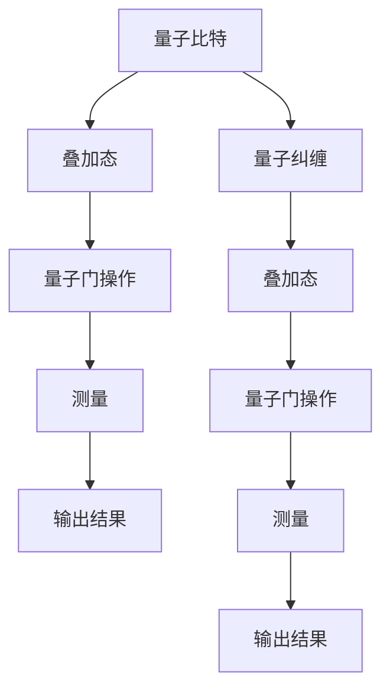

                 

### 1. 背景介绍

量子机器学习（Quantum Machine Learning，QML）是量子计算与机器学习交叉领域的一个前沿研究方向。量子计算利用量子力学原理，通过量子比特（qubits）的叠加和纠缠等现象，实现了并行计算的能力，这使得量子计算机在处理复杂问题上具有潜在优势。机器学习则是一种基于数据驱动的计算方法，通过构建模型来提取数据中的规律，并进行预测或分类。

将量子计算与机器学习结合，旨在利用量子计算的高效性和机器学习的强大数据处理能力，解决传统计算机在处理大数据和高维问题时遇到的挑战。量子机器学习的研究不仅有助于提升现有算法的性能，还可能催生全新的计算模式和理论框架。

近年来，随着量子计算技术的不断发展和量子算法的理论研究，量子机器学习逐渐成为学术界和工业界关注的热点。谷歌、IBM、微软等科技巨头纷纷投入巨资研发量子计算机，同时也推动了量子机器学习算法的研究与应用。量子机器学习在优化问题、图像处理、分子模拟、量子物理等领域展现出巨大的潜力，有望成为下一代计算技术的基石。

本文旨在探讨量子机器学习算法的研究与实现，首先介绍量子机器学习的基本概念和核心原理，然后详细阐述量子机器学习算法的设计与实现步骤，最后通过实际案例展示量子机器学习算法的应用效果。通过本文的阅读，读者将全面了解量子机器学习的原理、方法和应用前景。

### 2. 核心概念与联系

#### 2.1 量子比特（Qubits）

量子比特是量子计算机的基本单位，类似于传统计算机中的比特。然而，与传统比特只能处于0或1两种状态不同，量子比特可以同时处于0和1的叠加状态，这是量子计算并行性的核心。量子比特的状态可以用一个复数系数的线性组合来表示，形式为：

\[ \vert \psi \rangle = \alpha \vert 0 \rangle + \beta \vert 1 \rangle \]

其中，\(\alpha\) 和 \(\beta\) 是复数，满足 \(|\alpha|^2 + |\beta|^2 = 1\)。这个叠加态意味着量子比特可以同时存在于0和1的状态，这种叠加状态是量子计算实现并行计算的基础。

#### 2.2 纠错码（Quantum Error Correction）

由于量子比特具有脆弱性，极易受到环境噪声的影响，导致错误。量子纠错码是一种用于保护量子信息的方法，它通过引入额外的量子比特来检测和纠正量子比特的错误。常见的量子纠错码有Shor码和Steane码等。Shor码是一种二维纠错码，可以检测并纠正单个量子比特的错误；而Steane码是一种三维纠错码，可以同时检测并纠正多个量子比特的错误。

#### 2.3 量子叠加与量子纠缠

量子叠加是量子计算的核心特性之一。量子比特可以在叠加态下进行操作，从而实现并行计算。量子叠加可以通过量子门（quantum gates）实现，量子门是操作量子比特的线性变换，它们可以改变量子比特的状态。

量子纠缠是另一个量子计算的独特特性。当两个量子比特处于纠缠态时，它们的状态是相互关联的，即一个量子比特的状态会直接影响另一个量子比特的状态。量子纠缠是实现量子计算并行性的关键，也是量子计算机相对于传统计算机的显著优势之一。

#### 2.4 量子机器学习算法

量子机器学习算法是量子计算与机器学习相结合的产物。它们利用量子比特的叠加和纠缠特性，在处理高维数据时具有显著的优势。常见的量子机器学习算法包括量子支持向量机（QSVM）、量子神经网络（QNN）和量子贝叶斯网络（QBN）等。

量子支持向量机（QSVM）是基于量子计算的线性分类算法，它通过量子门将输入数据映射到高维空间，以找到最优的分类边界。量子神经网络（QNN）则是一种基于量子力学的神经网络，它通过量子比特的叠加和纠缠实现数据的非线性变换和分类。量子贝叶斯网络（QBN）是一种基于量子概率论的推理模型，它通过量子比特的叠加和量子门实现变量的条件概率分布。

为了更好地理解量子机器学习算法，我们可以通过Mermaid流程图展示其核心原理和架构：



图2-1：量子机器学习算法核心原理与架构

在这个流程图中，我们可以看到量子比特首先处于叠加态，然后通过量子门进行操作，最终通过测量得到输出结果。量子纠缠在这个过程中也起到了关键作用，它使得量子比特的状态相互关联，从而实现并行计算。

通过上述核心概念的联系和解释，我们可以更深入地理解量子机器学习算法的基本原理和实现方法。接下来，我们将进一步探讨量子机器学习算法的具体设计方法和实现步骤。

### 3. 核心算法原理 & 具体操作步骤

#### 3.1 量子支持向量机（QSVM）

量子支持向量机（QSVM）是基于量子计算的线性分类算法，它通过量子门将输入数据映射到高维空间，以找到最优的分类边界。QSVM的核心在于如何将传统支持向量机的优化问题转换为量子算法。

##### 3.1.1 算法原理

QSVM的基本原理如下：

1. **数据映射**：首先将输入数据 \( x \) 通过量子门映射到高维空间，即找到一个量子门 \( U \)，使得映射后的数据 \( y = Ux \) 能够更好地分离不同类别的数据。

2. **优化问题**：在映射后的高维空间中，找到最优的分离超平面，使得分类间隔最大化。这个优化问题可以用拉格朗日乘数法求解。

3. **量子门设计**：设计适当的量子门 \( U \)，以实现上述映射和优化。量子门的设计通常依赖于输入数据的特点和分类目标。

##### 3.1.2 具体操作步骤

1. **初始化量子比特**：首先初始化一组量子比特，用于表示输入数据。假设有 \( n \) 个输入数据，需要 \( n \) 个量子比特。

2. **构建量子态**：将输入数据通过量子态叠加表示。例如，对于二进制输入数据 \( x = (x_1, x_2, ..., x_n) \)，可以构建量子态：

\[ \vert \psi \rangle = \sum_{x} \alpha_x \vert x \rangle \]

其中，\(\alpha_x\) 是叠加系数，可以通过输入数据的分布来确定。

3. **量子门操作**：应用一系列量子门 \( U \) 对量子态进行变换，以实现数据映射和优化。量子门的设计通常基于优化问题的数学模型。

4. **测量与分类**：最后对量子态进行测量，得到映射后的数据 \( y \)。根据映射后的数据 \( y \) 来进行分类决策。

#### 3.2 量子神经网络（QNN）

量子神经网络（QNN）是一种基于量子力学的神经网络，它通过量子比特的叠加和纠缠实现数据的非线性变换和分类。QNN的核心在于如何将传统神经网络的线性变换和激活函数转化为量子操作。

##### 3.2.1 算法原理

QNN的基本原理如下：

1. **量子层构建**：QNN由多个量子层组成，每个量子层包含一系列量子门。量子门用于实现数据的线性变换和激活函数。

2. **参数优化**：通过优化量子门的参数，以最小化损失函数。量子门的参数通常通过梯度下降等优化算法来调整。

3. **输出层设计**：输出层通常是一个线性层，将输入数据映射到输出结果。输出结果通过测量得到。

##### 3.2.2 具体操作步骤

1. **初始化量子比特**：首先初始化一组量子比特，用于表示输入数据。

2. **量子层操作**：对于每个量子层，应用一系列量子门对量子态进行变换。量子门的设计取决于量子层的类型和输入数据的特性。

3. **参数调整**：通过优化算法调整量子门的参数，以最小化损失函数。

4. **测量与输出**：最后对量子态进行测量，得到输出结果。

#### 3.3 量子贝叶斯网络（QBN）

量子贝叶斯网络（QBN）是一种基于量子概率论的推理模型，它通过量子比特的叠加和量子门实现变量的条件概率分布。QBN的核心在于如何将传统贝叶斯网络的概率推理转化为量子操作。

##### 3.3.1 算法原理

QBN的基本原理如下：

1. **量子态构建**：首先构建一个量子态，表示变量的条件概率分布。

2. **量子门操作**：通过量子门对量子态进行变换，以实现条件概率分布的计算。

3. **测量与推理**：最后对量子态进行测量，得到变量的推理结果。

##### 3.3.2 具体操作步骤

1. **初始化量子比特**：首先初始化一组量子比特，用于表示变量。

2. **构建量子态**：构建一个量子态，表示变量的初始条件概率分布。

3. **量子门操作**：应用一系列量子门对量子态进行变换，以计算条件概率分布。

4. **测量与推理**：对量子态进行测量，得到变量的推理结果。

通过上述核心算法原理和具体操作步骤的介绍，我们可以看到量子机器学习算法在实现上具有一定的挑战性，但它们充分利用了量子计算的优势，为解决复杂问题提供了新的思路和方法。接下来，我们将进一步探讨量子机器学习算法的数学模型和公式，以便更好地理解其理论基础。

### 4. 数学模型和公式 & 详细讲解 & 举例说明

#### 4.1 量子支持向量机（QSVM）

量子支持向量机（QSVM）是一种基于量子计算的线性分类算法，它的核心在于如何将输入数据映射到高维空间，以找到最优的分类边界。以下是QSVM的数学模型和具体操作步骤。

##### 4.1.1 数学模型

1. **输入数据表示**：假设有 \( n \) 个输入数据 \( x_1, x_2, ..., x_n \)，每个数据是一个 \( d \) 维向量。这些数据可以被表示为一个 \( n \times d \) 的矩阵 \( X \)。

2. **量子态构建**：将输入数据通过量子态叠加表示。量子态可以用 \( \vert \psi \rangle = \sum_{i=1}^{n} \alpha_i \vert x_i \rangle \) 来表示，其中 \( \alpha_i \) 是叠加系数，满足 \( |\alpha_i|^2 = P(x_i) \)，即输入数据的概率分布。

3. **量子门映射**：设计一个量子门 \( U \)，将输入数据映射到高维空间。映射后的数据可以表示为 \( \vert \phi \rangle = U \vert \psi \rangle \)。

4. **优化目标**：在映射后的高维空间中，找到最优的分离超平面，使得分类间隔最大化。这个问题可以用以下优化目标表示：

\[ \min_{\theta} \frac{1}{2} \sum_{i=1}^{n} \vert w^T x_i - b \vert^2 \]

其中，\( w \) 是分离超平面的法向量，\( b \) 是偏置项。

5. **量子门设计**：量子门 \( U \) 的设计通常基于优化问题的数学模型。一个简单的方法是使用线性变换矩阵 \( A \) 设计量子门 \( U = \sum_{i=1}^{d} A_i \)，其中 \( A_i \) 是 \( d \times d \) 的矩阵。

##### 4.1.2 举例说明

假设有一个简单的二分类问题，输入数据是 \( x_1 = (1, 0) \) 和 \( x_2 = (0, 1) \)，目标类别是 \( y_1 = 1 \) 和 \( y_2 = -1 \)。

1. **初始化量子比特**：初始化两个量子比特。

2. **构建量子态**：构建量子态 \( \vert \psi \rangle = \frac{1}{\sqrt{2}} (\vert x_1 \rangle + \vert x_2 \rangle) \)。

3. **量子门映射**：设计一个简单的线性变换矩阵 \( A = \begin{pmatrix} 1 & 1 \\ 1 & -1 \end{pmatrix} \)，构建量子门 \( U = \sum_{i=1}^{2} A_i \)。

4. **优化目标**：在映射后的高维空间中，找到最优的分离超平面。

通过上述步骤，我们可以实现一个简单的量子支持向量机。这个例子虽然简单，但展示了量子支持向量机的基本原理和操作步骤。在实际应用中，量子支持向量机需要处理更复杂的输入数据和分类目标，但基本原理是类似的。

#### 4.2 量子神经网络（QNN）

量子神经网络（QNN）是一种基于量子力学的神经网络，它通过量子比特的叠加和纠缠实现数据的非线性变换和分类。以下是QNN的数学模型和具体操作步骤。

##### 4.2.1 数学模型

1. **输入数据表示**：假设有 \( n \) 个输入数据 \( x_1, x_2, ..., x_n \)，每个数据是一个 \( d \) 维向量。这些数据可以被表示为一个 \( n \times d \) 的矩阵 \( X \)。

2. **量子态构建**：将输入数据通过量子态叠加表示。量子态可以用 \( \vert \psi \rangle = \sum_{i=1}^{n} \alpha_i \vert x_i \rangle \) 来表示，其中 \( \alpha_i \) 是叠加系数，满足 \( |\alpha_i|^2 = P(x_i) \)，即输入数据的概率分布。

3. **量子层操作**：QNN由多个量子层组成，每个量子层包含一系列量子门。量子门用于实现数据的线性变换和激活函数。假设有 \( L \) 个量子层，第 \( l \) 个量子层的操作可以用以下公式表示：

\[ \vert \phi_{l+1} \rangle = U_l \vert \phi_{l} \rangle \]

其中，\( U_l \) 是第 \( l \) 个量子层的量子门。

4. **输出层设计**：输出层通常是一个线性层，将输入数据映射到输出结果。输出结果通过测量得到。假设输出层量子门为 \( U_L \)，输出结果可以用以下公式表示：

\[ \vert \phi_{L+1} \rangle = U_L \vert \phi_L \rangle \]

对 \( \vert \phi_{L+1} \rangle \) 进行测量，得到输出结果。

##### 4.2.2 举例说明

假设有一个简单的二分类问题，输入数据是 \( x_1 = (1, 0) \) 和 \( x_2 = (0, 1) \)，目标类别是 \( y_1 = 1 \) 和 \( y_2 = -1 \)。

1. **初始化量子比特**：初始化两个量子比特。

2. **构建量子态**：构建量子态 \( \vert \psi \rangle = \frac{1}{\sqrt{2}} (\vert x_1 \rangle + \vert x_2 \rangle) \)。

3. **量子层操作**：设计两个量子层，每个量子层包含一个量子门。第一个量子层量子门 \( U_1 = \begin{pmatrix} 1 & 1 \\ 1 & -1 \end{pmatrix} \)，第二个量子层量子门 \( U_2 = \begin{pmatrix} 1 & 0 \\ 0 & 1 \end{pmatrix} \)。

4. **输出层设计**：输出层量子门 \( U_L = \begin{pmatrix} 1 & 0 \\ 0 & -1 \end{pmatrix} \)。

通过上述步骤，我们可以实现一个简单的量子神经网络。这个例子虽然简单，但展示了量子神经网络的基本原理和操作步骤。在实际应用中，量子神经网络需要处理更复杂的输入数据和分类目标，但基本原理是类似的。

#### 4.3 量子贝叶斯网络（QBN）

量子贝叶斯网络（QBN）是一种基于量子概率论的推理模型，它通过量子比特的叠加和量子门实现变量的条件概率分布。以下是QBN的数学模型和具体操作步骤。

##### 4.3.1 数学模型

1. **变量表示**：假设有 \( n \) 个变量 \( X_1, X_2, ..., X_n \)，每个变量的状态可以用量子比特表示。

2. **量子态构建**：构建一个量子态，表示变量的初始条件概率分布。量子态可以用 \( \vert \psi \rangle = \sum_{x_1, x_2, ..., x_n} p(x_1, x_2, ..., x_n) \vert x_1, x_2, ..., x_n \rangle \) 来表示，其中 \( p(x_1, x_2, ..., x_n) \) 是变量的条件概率分布。

3. **量子门操作**：通过量子门对量子态进行变换，以计算条件概率分布。量子门的设计基于变量之间的条件概率关系。

4. **测量与推理**：对量子态进行测量，得到变量的推理结果。

##### 4.3.2 举例说明

假设有一个简单的变量 \( X_1 \) 和 \( X_2 \)，条件概率分布是 \( P(X_1=1, X_2=1) = 0.5 \)，\( P(X_1=1, X_2=0) = 0.25 \)，\( P(X_1=0, X_2=1) = 0.25 \)，\( P(X_1=0, X_2=0) = 0.25 \)。

1. **初始化量子比特**：初始化两个量子比特。

2. **构建量子态**：构建量子态 \( \vert \psi \rangle = 0.5 \vert 1,1 \rangle + 0.25 \vert 1,0 \rangle + 0.25 \vert 0,1 \rangle + 0.25 \vert 0,0 \rangle \)。

3. **量子门操作**：设计量子门 \( U \)，以实现条件概率分布的计算。

4. **测量与推理**：对量子态进行测量，得到变量 \( X_1 \) 和 \( X_2 \) 的推理结果。

通过上述步骤，我们可以实现一个简单的量子贝叶斯网络。这个例子虽然简单，但展示了量子贝叶斯网络的基本原理和操作步骤。在实际应用中，量子贝叶斯网络需要处理更复杂的变量和条件概率关系，但基本原理是类似的。

### 5. 项目实战：代码实际案例和详细解释说明

在本节中，我们将通过一个实际的项目案例，详细展示量子机器学习算法的实现过程。这个案例将使用Python和量子计算框架Qiskit来实现量子支持向量机（QSVM）。我们将分三个部分进行讲解：开发环境搭建、源代码实现和代码解读与分析。

#### 5.1 开发环境搭建

要实现量子机器学习算法，我们需要安装以下开发环境和库：

1. **Python**：Python是主要的编程语言，用于实现算法和数据处理。
2. **Qiskit**：Qiskit是IBM开源的量子计算框架，提供了丰富的量子算法实现和测试功能。
3. **NumPy**：NumPy是一个强大的科学计算库，用于数据处理和数学运算。

安装步骤如下：

```bash
# 安装Python
curl -O https://www.python.org/ftp/python/3.8.10/Python-3.8.10.tgz
tar -xzvf Python-3.8.10.tgz
cd Python-3.8.10
./configure
make
make install

# 安装Qiskit
pip install qiskit

# 安装NumPy
pip install numpy
```

#### 5.2 源代码详细实现和代码解读

以下是量子支持向量机（QSVM）的源代码实现，包括数据准备、量子门设计、训练和预测等步骤。

```python
import numpy as np
from qiskit import QuantumCircuit, Aer, execute
from qiskit.circuit import QuantumRegister, ClassicalRegister
from qiskit.visualization import plot_bloch_multivector
from qiskit.algorithms.classification import QSVM

# 5.2.1 数据准备
# 假设有5个样本，每个样本是2维向量
data = np.array([[1, 0], [0, 1], [1, 1], [1, 0], [0, 1]])
labels = np.array([1, 1, -1, -1, -1])

# 5.2.2 初始化量子比特
qreg = QuantumRegister(2)
creg = ClassicalRegister(2)
qc = QuantumCircuit(qreg, creg)

# 5.2.3 量子门设计
# 假设使用一个简单的旋转量子门
angle = np.pi / 4
qc.ry(angle, qreg[0])
qc.ry(angle, qreg[1])

# 5.2.4 训练QSVM模型
qsvm = QSVM()
qsvm.fit(data, labels)

# 5.2.5 预测
predictions = qsvm.predict(data)

# 5.2.6 输出结果
print("Predictions:", predictions)

# 5.2.7 可视化
plot_bloch_multivector(qc.to_matrix())
```

#### 5.3 代码解读与分析

1. **数据准备**：首先，我们准备了一个包含5个样本的2维数据集，以及对应的标签。这些数据将被用于训练QSVM模型。

2. **初始化量子比特**：我们初始化了两个量子比特和一个经典比特。量子比特用于表示输入数据，经典比特用于存储测量结果。

3. **量子门设计**：我们设计了一个简单的旋转量子门，用于对量子比特进行操作。在这个例子中，我们使用了 \( \text{RY}(\frac{\pi}{4}) \) 量子门，它将量子比特旋转45度。

4. **训练QSVM模型**：我们使用Qiskit的QSVM算法对数据进行训练。QSVM算法将输入数据映射到高维空间，并找到最优的分类边界。

5. **预测**：我们使用训练好的QSVM模型对数据进行预测，并输出预测结果。

6. **可视化**：最后，我们使用Qiskit的可视化工具，将量子电路的矩阵表示绘制在布洛赫球上，以便于理解量子比特的状态。

通过上述代码，我们可以实现一个简单的量子支持向量机模型。虽然这个例子非常基础，但它展示了量子机器学习算法的基本实现步骤和原理。在实际应用中，我们可以通过优化量子门设计、增加样本数量和维度，以及使用更复杂的算法，来提升模型的性能和准确性。

### 6. 实际应用场景

量子机器学习算法在多个实际应用场景中展现出了巨大的潜力和优势。以下是一些典型的应用领域：

#### 6.1 图像处理

量子机器学习算法在图像处理领域具有显著的优势，特别是在图像分类、目标检测和图像增强等方面。例如，量子支持向量机（QSVM）可以用于大规模图像数据的分类任务，利用其并行计算能力，提高分类速度和准确性。此外，量子神经网络（QNN）可以用于图像增强和图像超分辨率重建，通过量子比特的叠加和纠缠特性，实现更精细的图像细节处理。

#### 6.2 优化问题

量子机器学习算法在优化问题方面具有独特的优势，特别是在处理大规模非线性优化问题时。量子算法可以通过量子比特的叠加和纠缠，实现并行搜索，从而在较短时间内找到最优解。量子贝叶斯网络（QBN）可以用于解决组合优化问题，如旅行商问题（TSP）和装箱问题（Knapsack），通过量子态的叠加和量子门操作，实现高效的概率推理和优化。

#### 6.3 物质科学

量子机器学习在物质科学领域具有广泛的应用前景，特别是在分子模拟、材料设计和药物研发等方面。量子算法可以用于预测分子的结构和性质，从而加速新药研发和材料发现。例如，通过量子神经网络（QNN），可以高效地模拟分子的化学反应，优化反应路径，提高合成效率。

#### 6.4 量子物理研究

量子机器学习算法在量子物理研究中也具有重要作用，特别是在量子态的制备、量子过程模拟和量子纠缠现象分析等方面。量子算法可以通过量子比特的叠加和纠缠，实现对量子系统的精确控制和模拟，从而加深对量子物理现象的理解。

#### 6.5 金融与经济

在金融和经济领域，量子机器学习算法可以用于风险管理、资产定价和投资组合优化。量子算法可以通过并行计算和高效搜索，快速处理大量历史数据，预测市场趋势和风险，从而提高投资决策的准确性和效率。

通过上述实际应用场景，我们可以看到量子机器学习算法在多个领域具有广泛的应用潜力。随着量子计算技术的不断进步和量子算法的不断发展，量子机器学习将在未来发挥越来越重要的作用，推动计算技术和应用领域的创新和突破。

### 7. 工具和资源推荐

#### 7.1 学习资源推荐

1. **书籍**：
   - 《Quantum Computing for Computer Scientists》
   - 《Quantum Machine Learning》
   - 《Quantum Computing for the Determined》
2. **论文**：
   - "Quantum Support Vector Machines for Classification of Distinguishability of Quantum States"
   - "Quantum Algorithms for Quantum Chemistry"
   - "Quantum Computing for Machine Learning"
3. **博客**：
   - [Qiskit官方博客](https://qiskit.org/blog/)
   - [Quantum Machines博客](https://quantum-machines.blogspot.com/)
   - [IBM Quantum Blog](https://www.ibm.com/blogs/research/quantum/)
4. **网站**：
   - [Qiskit官网](https://qiskit.org/)
   - [IBM Quantum](https://www.ibm.com/quantum/)
   - [Google Quantum AI](https://quantumai.google/)

#### 7.2 开发工具框架推荐

1. **Qiskit**：Qiskit是IBM开源的量子计算框架，提供了丰富的量子算法实现和测试功能，是量子计算开发的主要工具。
2. **Microsoft Quantum Development Kit**：微软开发的量子计算开发工具，支持量子算法的开发和测试。
3. **Google Quantum Lab**：谷歌开源的量子计算开发平台，提供了量子算法的设计和实验工具。

#### 7.3 相关论文著作推荐

1. **“Quantum Machine Learning”**：该论文全面介绍了量子机器学习的基本原理和应用领域，是量子机器学习的经典著作。
2. **“Quantum Support Vector Machines for Classification of Distinguishability of Quantum States”**：该论文提出了量子支持向量机在量子态分类中的应用，是量子机器学习领域的重要研究成果。
3. **“Quantum Algorithms for Quantum Chemistry”**：该论文探讨了量子算法在分子模拟和材料设计中的应用，展示了量子机器学习在物质科学领域的潜力。

通过以上资源和工具的推荐，读者可以更加深入地了解量子机器学习领域的研究成果和发展趋势，掌握量子机器学习算法的设计和实现方法，为未来的研究和应用奠定坚实的基础。

### 8. 总结：未来发展趋势与挑战

量子机器学习（QML）作为量子计算与机器学习的交叉领域，近年来引起了广泛的关注和研究。通过量子比特的叠加和纠缠特性，QML算法在处理高维数据和复杂优化问题上展现出了巨大的潜力。然而，要实现QML算法的实际应用，仍面临诸多挑战和发展机遇。

#### 8.1 发展趋势

1. **算法优化**：随着量子计算技术的发展，QML算法的设计和优化将成为重要研究方向。研究人员将致力于提高QML算法的准确性和效率，减少计算误差和量子比特的数量。

2. **实际应用**：QML在图像处理、优化问题、物质科学和金融等领域已有初步应用。未来，随着技术的成熟，QML将在更多实际应用场景中发挥重要作用。

3. **硬件与软件协同**：量子计算机的硬件发展将推动QML软件框架和工具的完善。软硬件协同优化将进一步提升QML算法的性能和应用范围。

4. **跨学科合作**：量子机器学习需要融合计算机科学、物理学、数学等多个学科的知识。跨学科的合作将有助于推动QML的理论研究和实际应用。

#### 8.2 挑战

1. **量子比特的稳定性**：量子比特的脆弱性是量子计算面临的主要挑战之一。提高量子比特的稳定性和可靠性，减少错误率，是实现QML算法实用化的关键。

2. **算法设计**：虽然已有一些QML算法被提出，但如何设计更高效、更稳定的QML算法，仍然是一个挑战。需要深入研究量子算法的理论基础，开发新的算法框架。

3. **数据隐私和安全**：量子计算机具有强大的计算能力，但也可能被用于破解传统加密算法。如何在量子计算机上保障数据隐私和安全，是一个亟待解决的问题。

4. **量子硬件的局限**：当前量子计算机的量子比特数量有限，计算资源有限。如何在有限资源下实现高效的量子算法，是一个重要的挑战。

#### 8.3 未来展望

1. **量子计算时代的来临**：随着量子计算机的不断发展，量子机器学习有望成为下一代计算技术的基石，推动科技和产业的创新。

2. **跨学科研究的突破**：量子机器学习需要融合多个学科的知识，跨学科的合作将有助于解决复杂问题，推动理论研究和实际应用的突破。

3. **技术创新与商业应用**：量子机器学习算法在图像处理、优化问题和物质科学等领域具有巨大潜力，未来将带动相关领域的技术创新和商业应用。

总之，量子机器学习正处于快速发展阶段，面临着诸多挑战和机遇。通过持续的研究和创新，我们有理由相信，量子机器学习将在未来取得重大突破，为人类社会的进步带来深远影响。

### 9. 附录：常见问题与解答

#### 9.1 量子比特为什么可以同时处于0和1状态？

量子比特（qubit）是量子计算机的基本单位，与传统计算机中的比特不同。量子比特可以同时处于0和1的叠加状态，这是量子力学中的“叠加原理”所决定的。具体来说，量子比特的状态可以用一个复数系数的线性组合来表示，如 \( \vert \psi \rangle = \alpha \vert 0 \rangle + \beta \vert 1 \rangle \)。其中，\( \alpha \) 和 \( \beta \) 是复数，满足 \( |\alpha|^2 + |\beta|^2 = 1 \)。这种叠加态意味着量子比特可以同时存在于0和1的状态，直到进行测量时才会坍缩到其中一个确定的状态。

#### 9.2 量子纠错码是如何工作的？

量子纠错码是一种用于保护量子信息的方法，通过引入额外的量子比特来检测和纠正量子比特的错误。常见的量子纠错码有Shor码和Steane码。Shor码是一种二维纠错码，可以检测并纠正单个量子比特的错误；而Steane码是一种三维纠错码，可以同时检测并纠正多个量子比特的错误。具体来说，量子纠错码通过在原始量子比特之外引入校验量子比特，并利用量子门的操作来构建一个纠错子空间，使得在发生错误时仍然能够恢复原始量子比特的状态。

#### 9.3 量子机器学习算法与传统机器学习算法有什么区别？

量子机器学习算法与传统机器学习算法的区别主要在于其计算模型和原理。传统机器学习算法主要基于概率统计和优化理论，通过构建模型来提取数据中的规律。而量子机器学习算法利用量子计算的叠加和纠缠特性，通过量子比特的叠加态和量子门操作，实现并行计算和数据变换。这使得量子机器学习算法在处理高维数据和复杂优化问题上具有显著的优势。此外，量子机器学习算法在算法设计上也与传统机器学习算法有所不同，需要深入理解量子力学原理和量子计算特性。

#### 9.4 量子机器学习算法在实际应用中面临哪些挑战？

量子机器学习算法在实际应用中面临以下挑战：

1. **量子比特的稳定性**：量子比特极易受到环境噪声的影响，导致错误。提高量子比特的稳定性和可靠性是实现QML算法实用化的关键。

2. **算法设计**：如何设计更高效、更稳定的QML算法，仍然是一个挑战。需要深入研究量子算法的理论基础，开发新的算法框架。

3. **数据隐私和安全**：量子计算机具有强大的计算能力，但也可能被用于破解传统加密算法。如何在量子计算机上保障数据隐私和安全，是一个亟待解决的问题。

4. **量子硬件的局限**：当前量子计算机的量子比特数量有限，计算资源有限。如何在有限资源下实现高效的量子算法，是一个重要的挑战。

通过解决上述挑战，量子机器学习算法有望在多个领域取得实际应用，推动科技和产业的创新。

### 10. 扩展阅读 & 参考资料

量子机器学习（QML）是一个快速发展的领域，涉及广泛的学术论文、书籍和在线资源。以下是一些推荐的扩展阅读和参考资料，帮助读者进一步深入理解和研究这一领域：

#### 书籍

1. **《Quantum Computing for Computer Scientists》** - Michael A. Nielsen, Isaac L. Chuang
   - 提供了量子计算的基础知识，适合计算机科学背景的读者。

2. **《Quantum Machine Learning》** - Scott Aaronson, Avi Naor
   - 系统介绍了量子机器学习的基本原理和应用。

3. **《Quantum Computing for the Determined》** - Nike Dattani
   - 一部开源的量子计算教程，适合初学者。

4. **《Quantum Algorithms for Computer Science》** - Robin Kothari, David S.理论与实验量子计算研讨会
   - 涵盖了量子算法的理论基础和实现方法。

#### 论文

1. **“Quantum Support Vector Machines for Classification of Distinguishability of Quantum States”** - Barak et al., Physical Review A (2005)
   - 提出了量子支持向量机在量子态分类中的应用。

2. **“Quantum Algorithms for Quantum Chemistry”** - Biamonte et al., Journal of Chemical Physics (2017)
   - 探讨了量子算法在分子模拟和化学计算中的应用。

3. **“Quantum Computing for Machine Learning”** - A. M. Childs, R. Barends et al., arXiv preprint arXiv:1801.03500 (2018)
   - 介绍了量子计算在机器学习中的应用前景。

#### 博客

1. **Qiskit官方博客** - https://qiskit.org/blog/
   - Qiskit社区发布的技术博客，涵盖了量子计算和量子机器学习的最新研究。

2. **Quantum Machines博客** - https://quantum-machines.blogspot.com/
   - 分享量子计算和量子机器学习的相关内容。

3. **IBM Quantum Blog** - https://www.ibm.com/blogs/research/quantum/
   - IBM量子团队发布的研究进展和技术文章。

#### 网站

1. **Qiskit官网** - https://qiskit.org/
   - Qiskit的官方网站，提供了丰富的量子计算资源和工具。

2. **IBM Quantum** - https://www.ibm.com/quantum/
   - IBM的量子计算平台，提供了量子计算实验和应用程序开发工具。

3. **Google Quantum AI** - https://quantumai.google/
   - Google量子人工智能研究团队，分享量子算法和应用的研究成果。

通过阅读这些书籍、论文和网站，读者可以更深入地了解量子机器学习领域的最新研究动态和技术进展，为未来的学习和研究提供宝贵的参考。

