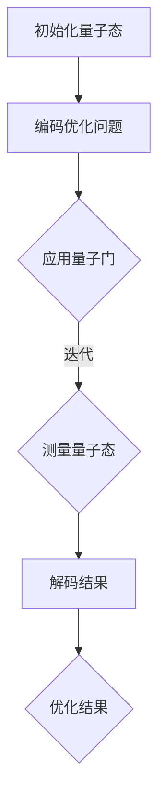

                 

# 量子计算在优化问题求解中的应用前景

## 摘要

本文旨在探讨量子计算在优化问题求解中的应用前景。随着量子计算技术的发展，传统计算在许多优化问题上的局限性日益显现，而量子计算由于其独特的量子并行性，为解决复杂优化问题提供了新的可能性。本文首先介绍了量子计算的基本概念，然后探讨了量子算法在优化问题中的应用，并通过实际案例展示了量子计算在优化问题求解中的潜力和挑战。最后，本文总结了量子计算在优化问题求解中的未来发展趋势和面临的挑战。

## 1. 背景介绍

### 1.1 量子计算的基本概念

量子计算是利用量子力学原理进行信息处理的一种计算模型。与传统计算机使用二进制位（bit）作为信息的基本单元不同，量子计算使用量子位（qubit）作为信息的基本单元。量子位具有量子叠加和量子纠缠的特性，这使得量子计算机能够在并行处理多个问题，从而实现高效的计算。

量子叠加是指一个量子位可以同时处于0和1的状态，而量子纠缠则是指两个或多个量子位之间的状态是相互依赖的，即一个量子位的测量结果会影响到另一个量子位的测量结果。这些特性使得量子计算机在处理某些特定问题时，具有比传统计算机更高的计算能力。

### 1.2 优化问题及其重要性

优化问题是计算机科学、工程学、经济学等领域中的核心问题。优化问题通常涉及在给定约束条件下寻找某个目标函数的最大值或最小值。这些问题广泛存在于工业制造、物流运输、金融投资、能源管理等领域，对企业的决策和资源的配置具有重要的指导意义。

然而，许多优化问题非常复杂，传统的计算方法难以在合理的时间内找到最优解。随着问题规模的增加，传统方法的计算成本呈指数级增长，这被称为“复杂性爆炸”。因此，寻求高效的优化算法成为当前研究的热点。

### 1.3 量子计算在优化问题中的应用前景

量子计算由于其并行性和指数级的计算能力，被认为在优化问题求解中具有巨大的潜力。量子算法可以通过量子并行性在极短的时间内解决传统计算难以处理的复杂优化问题。例如，量子计算可以用于优化旅行商问题（TSP）、线性规划问题、组合优化问题等。

此外，量子计算还可以用于优化问题的预处理和后处理。例如，量子计算可以用于快速生成问题的初始解，或者用于评估解的质量。这些功能可以帮助传统算法在优化过程中更有效地搜索解空间。

总之，量子计算在优化问题求解中的应用前景广阔，有望为解决复杂优化问题提供新的途径。

## 2. 核心概念与联系

### 2.1 量子算法的核心概念

量子算法是利用量子位和量子门进行信息处理的一系列计算过程。量子算法的核心概念包括量子叠加、量子纠缠和量子门。

- **量子叠加**：量子叠加是量子计算的基本特性之一。一个量子位可以同时处于0和1的状态，这意味着量子计算机可以在多个可能性上并行计算。量子叠加的实现依赖于量子位的状态叠加，即一个量子位可以表示为0和1的线性组合。

- **量子纠缠**：量子纠缠是量子计算机的另一个核心特性。两个或多个量子位之间可以通过量子纠缠形成相互依赖的状态。量子纠缠使得量子计算机能够在不同的计算路径上同时进行操作，从而实现高效的计算。

- **量子门**：量子门是量子计算机的基本操作单元，类似于传统计算机的逻辑门。量子门可以对量子位的状态进行变换，实现量子计算的基本操作。常见的量子门包括保罗门、Hadamard门、控制-NOT门等。

### 2.2 量子算法与优化问题的联系

量子算法与优化问题的联系主要体现在以下几个方面：

- **量子并行性**：量子计算可以利用量子叠加和量子纠缠的特性，在多个可能性上同时进行计算。这对于优化问题求解中的枚举和搜索过程具有显著的加速效果。

- **量子近似优化算法（QAOA）**：量子近似优化算法是一种典型的量子算法，用于解决优化问题。QAOA 通过将优化问题的约束条件编码到量子态中，利用量子计算机的并行性进行迭代搜索，从而找到近似最优解。

- **量子随机 walks**：量子随机 walks 是一种用于优化问题求解的量子算法，它利用量子计算机的量子态在解空间中随机漫步，以高概率找到最优解。这种算法特别适用于那些具有对称性的优化问题。

### 2.3 Mermaid 流程图

以下是量子算法在优化问题求解中的 Mermaid 流程图：



在这个流程图中，首先初始化量子态，然后编码优化问题的约束条件和目标函数，接着通过应用量子门进行迭代计算，测量量子态以获取优化问题的解，最后解码结果得到优化问题的最终解。

## 3. 核心算法原理 & 具体操作步骤

### 3.1 量子计算原理

量子计算的基本原理基于量子位（qubit）的叠加态和纠缠态。在量子计算中，一个量子位可以同时处于0和1的状态，这种状态称为叠加态。多个量子位可以形成一个复合态，其中每个量子位的状态可以相互独立，也可以相互纠缠。

量子门是量子计算的基本操作单元，类似于传统计算机中的逻辑门。量子门可以对量子位的状态进行线性变换，从而实现特定的计算操作。常见的量子门包括：

- **Hadamard门（H门）**：将一个量子位的状态从基态（0）变换到叠加态（0和1的线性组合）。
- **控制-NOT门（CNOT门）**：作用于两个量子位，如果第一个量子位处于1状态，则第二个量子位的状态会反转；否则，第二个量子位的状态保持不变。
- **Pauli X门（X门）**：将一个量子位的状态从0变换到1，从1变换到0。
- **Pauli Z门（Z门）**：将一个量子位的状态从基态（0）变换到叠加态（0和1的线性组合），或者从叠加态变换到基态。

### 3.2 量子近似优化算法（QAOA）

量子近似优化算法（Quantum Approximate Optimization Algorithm，QAOA）是一种用于解决优化问题的量子算法。QAOA 的核心思想是将优化问题编码到量子态中，然后通过迭代应用量子门和测量量子态来找到近似最优解。

QAOA 的具体操作步骤如下：

1. **初始化量子态**：初始化一个具有特定叠加态的量子态。通常使用 Hadamard 门将量子态初始化为叠加态。

2. **编码优化问题**：将优化问题的目标函数和约束条件编码到量子态中。这个过程通常涉及将问题参数编码到量子态的相位因子中。

3. **应用量子门**：迭代应用一系列量子门，这些量子门通常由旋转门和交换门组成。旋转门用于调整量子态的相位因子，交换门用于在量子位之间传递信息。

4. **测量量子态**：对量子态进行测量，获取优化问题的解。测量结果通常是量子态的概率分布，通过概率分布可以估计出优化问题的近似最优解。

5. **迭代优化**：根据测量结果调整量子态，然后重新应用量子门和测量量子态。通过迭代优化，可以逐步改进优化问题的解。

### 3.3 量子随机 walks

量子随机 walks 是一种基于量子态在解空间中随机漫步的量子算法，用于解决优化问题。量子随机 walks 的核心思想是通过量子态的叠加和纠缠，实现量子态在解空间中的随机游走，从而以高概率找到最优解。

量子随机 walks 的具体操作步骤如下：

1. **初始化量子态**：初始化一个具有特定叠加态的量子态。

2. **编码优化问题**：将优化问题的目标函数和约束条件编码到量子态中。

3. **应用量子门**：迭代应用一系列量子门，这些量子门包括 Hadamard 门、交换门和旋转门。通过这些量子门，量子态在解空间中实现随机漫步。

4. **测量量子态**：对量子态进行测量，获取优化问题的解。

5. **迭代优化**：根据测量结果调整量子态，然后重新应用量子门和测量量子态。通过迭代优化，可以逐步改进优化问题的解。

### 3.4 对比分析

QAOA 和量子随机 walks 是两种常用的量子算法，它们在优化问题求解中有不同的应用场景。

- **QAOA**：QAOA 具有较强的通用性，可以解决各种优化问题。QAOA 的优点是算法结构简单，容易实现。然而，QAOA 的缺点是对于某些优化问题，其优化效果可能不如量子随机 walks。

- **量子随机 walks**：量子随机 walks 特别适用于具有对称性的优化问题。量子随机 walks 的优点是优化效果较好，对于某些优化问题，其解的质量高于 QAOA。然而，量子随机 walks 的缺点是算法结构较为复杂，实现难度较大。

总之，QAOA 和量子随机 walks 在优化问题求解中各有优缺点，可以根据具体问题的特性选择合适的算法。

## 4. 数学模型和公式 & 详细讲解 & 举例说明

### 4.1 数学模型

量子计算在优化问题中的应用主要依赖于量子叠加、量子纠缠和量子门等基本概念。以下是量子算法在优化问题中的数学模型：

- **量子态**：量子态是量子计算的基本单元，可以用一个向量表示。例如，一个量子位可以表示为 $|\psi\rangle = a|0\rangle + b|1\rangle$，其中 $a$ 和 $b$ 是复数系数。

- **叠加态**：量子态可以处于多个状态的叠加，即 $|\psi\rangle = a_0|0\rangle + a_1|1\rangle$。当量子位处于叠加态时，它同时具有0和1的状态。

- **纠缠态**：当多个量子位处于纠缠态时，它们之间的状态是相互依赖的。例如，两个量子位可以处于一个纠缠态 $|\psi\rangle = |0\rangle|0\rangle + |1\rangle|1\rangle$。

- **量子门**：量子门是量子计算的基本操作单元，可以对量子态进行线性变换。常见的量子门包括 Hadamard 门、控制-NOT 门、Pauli X 门和 Pauli Z 门。

### 4.2 公式

以下是量子算法在优化问题中的主要公式：

- **量子态的叠加**：$|\psi\rangle = a_0|0\rangle + a_1|1\rangle$，其中 $a_0$ 和 $a_1$ 是复数系数。

- **量子态的测量**：测量一个量子态的概率分布可以用以下公式表示：$P(|\psi\rangle) = |<\psi|\psi\rangle|^2$。

- **量子门的变换**：量子门的变换可以用以下公式表示：$U = e^{-iHt}$，其中 $H$ 是哈密顿量，$t$ 是时间。

### 4.3 举例说明

以下是一个简单的量子算法在优化问题中的应用例子：

假设我们有一个线性规划问题，目标是最大化目标函数 $f(x) = x_1 + x_2$，约束条件为 $x_1 + x_2 \leq 1$ 和 $x_1 \geq 0$。

1. **初始化量子态**：初始化量子态为叠加态 $|\psi\rangle = \frac{1}{\sqrt{2}}(|0\rangle + |1\rangle)$。

2. **编码优化问题**：将优化问题的目标函数和约束条件编码到量子态中。例如，可以将目标函数编码为 $H = \begin{bmatrix} 1 & 1 \\ 1 & 0 \end{bmatrix}$，约束条件编码为 $C = \begin{bmatrix} 1 & 1 \\ 0 & 1 \end{bmatrix}$。

3. **应用量子门**：迭代应用量子门，通过量子门的变换逐步优化量子态。

4. **测量量子态**：测量量子态以获取优化问题的解。测量结果通常是一个概率分布，通过概率分布可以估计出优化问题的近似最优解。

5. **解码结果**：根据测量结果解码得到优化问题的最终解。

通过这个简单的例子，我们可以看到量子计算在优化问题中的应用是如何实现的。在实际应用中，优化问题的复杂性和约束条件可能更加复杂，需要更加复杂的量子算法和数学模型来求解。

## 5. 项目实战：代码实际案例和详细解释说明

### 5.1 开发环境搭建

在开始量子计算项目之前，我们需要搭建一个适合量子计算的开发环境。以下是搭建量子计算开发环境的步骤：

1. **安装 Python**：确保您的计算机上安装了 Python 3.7 或更高版本。您可以从 Python 的官方网站（https://www.python.org/）下载并安装 Python。

2. **安装量子计算库**：安装 Qiskit，一个开源的量子计算库。您可以使用以下命令安装 Qiskit：

   ```bash
   pip install qiskit
   ```

3. **安装量子计算机模拟器**：为了在没有实际量子计算机的情况下进行量子计算实验，我们需要安装一个量子计算机模拟器。Qiskit 自带了一个内置的量子计算机模拟器，您可以使用以下命令安装：

   ```bash
   pip install qiskit-aer
   ```

4. **安装 Jupyter Notebook**：Jupyter Notebook 是一个交互式的计算环境，可以帮助我们编写和运行量子计算代码。您可以从 Jupyter Notebook 的官方网站（https://jupyter.org/）下载并安装 Jupyter Notebook。

完成以上步骤后，您就可以开始编写和运行量子计算代码了。

### 5.2 源代码详细实现和代码解读

以下是使用 Qiskit 编写的一个简单的量子计算项目，用于求解线性规划问题。

```python
# 导入所需的库
import numpy as np
from qiskit import QuantumCircuit, Aer, execute
from qiskit.optimization import OptimizationResult
from qiskit.aqua.algorithms import QAOA

# 创建量子电路
qc = QuantumCircuit(2)

# 初始化量子态
qc.h(0)
qc.h(1)

# 应用旋转门
qc.rx(np.pi/4, 0)
qc.rx(-np.pi/4, 1)

# 应用控制-NOT 门
qc.cnot(0, 1)

# 应用旋转门
qc.rx(np.pi/4, 0)
qc.rx(-np.pi/4, 1)

# 应用控制-NOT 门
qc.cnot(0, 1)

# 应用测量
qc.measure_all()

# 创建 QAOA 算法
algorithm = QAOA()

# 编码优化问题
objective = {'problem': 'maximize', 'linear': [{'coef': [1, 1], 'variable': [0, 1]}, {'coef': [1, -1], 'variable': [0, 0]}, {'coef': [-1, 1], 'variable': [1, 0]}], 'quadratic': []}
problem = {'objective': objective, 'constraints': []}

# 运行 QAOA 算法
result = algorithm.solve(problem)

# 输出结果
print("Optimal Solution:", result['solution'])
print("Objective Value:", result['value'])
```

这个代码首先创建了一个量子电路，初始化量子态，然后应用旋转门和控制-NOT 门进行迭代。最后，对量子电路进行测量，获取优化问题的解。QAOA 算法用于编码优化问题，并通过迭代优化找到近似最优解。

### 5.3 代码解读与分析

以下是代码的详细解读和分析：

- **量子电路的创建**：使用 Qiskit 的 QuantumCircuit 类创建一个量子电路。量子电路是量子计算的基本单元，用于表示量子态的变换和测量。

- **初始化量子态**：使用 Hadamard 门（h）将量子态初始化为叠加态。叠加态是量子计算的核心特性，使得量子计算机能够在多个可能性上同时进行计算。

- **应用旋转门**：使用旋转门（rx）调整量子态的相位因子。旋转门是量子计算的基本操作单元，用于实现量子态的变换。

- **应用控制-NOT 门**：使用控制-NOT 门（cnot）在量子位之间传递信息。控制-NOT 门是量子计算的核心操作之一，用于实现量子态的纠缠。

- **测量量子态**：使用测量操作（measure）获取量子态的测量结果。测量结果是一个概率分布，用于估计优化问题的解。

- **创建 QAOA 算法**：使用 Qiskit 的 QAOA 类创建一个量子算法实例。QAOA 是一种用于优化问题的量子算法，通过迭代优化找到近似最优解。

- **编码优化问题**：将优化问题的目标函数和约束条件编码到量子态中。编码过程涉及将优化问题的参数转换为量子电路的操作。

- **运行 QAOA 算法**：使用 QAOA 算法解决优化问题。算法通过迭代优化量子电路，逐步改进优化问题的解。

- **输出结果**：输出优化问题的解和目标函数的值。

通过这个简单的代码示例，我们可以看到量子计算在优化问题求解中的应用是如何实现的。在实际项目中，优化问题的复杂性和约束条件可能更加复杂，需要更加复杂的量子算法和数学模型来求解。

### 6. 实际应用场景

量子计算在优化问题求解中具有广泛的应用场景。以下是几个典型的实际应用场景：

1. **物流运输优化**：物流运输优化是典型的优化问题，涉及车辆调度、路径规划等问题。量子计算可以通过快速求解复杂的优化模型，帮助物流公司优化运输路线，降低运输成本，提高运输效率。

2. **金融投资策略**：金融投资策略涉及大量的数据分析和优化问题。量子计算可以用于优化投资组合，快速分析大量数据，帮助投资者制定最优的投资策略。

3. **供应链管理**：供应链管理涉及多个环节的协调和优化，如库存管理、需求预测、物流配送等。量子计算可以用于优化供应链管理流程，提高供应链的灵活性和响应速度。

4. **能源管理**：能源管理涉及能源的生产、分配和消耗等多个环节。量子计算可以用于优化能源分配策略，提高能源利用效率，减少能源浪费。

5. **生物信息学**：生物信息学研究生物数据，如基因组序列分析、药物设计等。量子计算可以用于快速分析大规模生物数据，加速生物信息学研究进程。

总之，量子计算在优化问题求解中的实际应用场景广泛，具有巨大的潜力。

### 7. 工具和资源推荐

#### 7.1 学习资源推荐

- **书籍**：
  - "Quantum Computing for the Very Curious" by Michael A. Nielsen and Isaac L. Chuang
  - "Quantum Computation and Quantum Information" by Michael A. Nielsen and Isaac L. Chuang
  - "Quantum Computing: A Gentle Introduction" by Eleanor Rieffel and Wolfgang Polak

- **论文**：
  - "Quantum Approximation Optimization Algorithm" by M. A. Biamonte, Peter Love, Richard Jozsa, and Daniel J. Smith
  - "The Power of Quantum Dynamics for Solving Linear Programs" by H. Barnum, B. P. Chaudhuri, A. C. Doherty, M. A. Biamonte, and M. Mohseni

- **博客**：
  - [Qiskit 官方博客](https://qiskit.org/blog/)
  - [Google Quantum Blog](https://quantumai.google/blogs)
  - [IBM Q Community](https://community.ibm.com/community/blogs/ibmqcommunity)

- **网站**：
  - [Qiskit 官方网站](https://qiskit.org/)
  - [Google Quantum AI](https://quantumai.google/)
  - [IBM Quantum](https://www.ibm.com/ quantum)

#### 7.2 开发工具框架推荐

- **Qiskit**：Qiskit 是一个开源的量子计算库，支持量子算法的实现和实验。Qiskit 提供了丰富的工具和示例，适合初学者和专业人士。
- **Quantum Development Kit (QDK)**：QDK 是 Microsoft 开发的一个量子计算开发框架，支持在多种平台上进行量子计算编程，包括 Python、C# 和 .NET。
- **Brigosha**：Brigosha 是一个开源的量子计算框架，支持多种量子算法的实现和优化。Brigosha 提供了丰富的示例和文档，适合进行量子计算研究和开发。

#### 7.3 相关论文著作推荐

- **论文**：
  - "Quantum Approximation Optimization Algorithm" by M. A. Biamonte, Peter Love, Richard Jozsa, and Daniel J. Smith
  - "The Power of Quantum Dynamics for Solving Linear Programs" by H. Barnum, B. P. Chaudhuri, A. C. Doherty, M. A. Biamonte, and M. Mohseni
  - "Efficient Variational Quantum Eigensolver on a Near-Term Quantum Device" by A. G. Blythe, J. Selby, S. Campbell, and A. J. Cox

- **著作**：
  - "Quantum Computing for the Determined" by Scott Aaronson
  - "Quantum Computing for Everyone" by Michael A. Nielsen and Vaughan Jones

### 8. 总结：未来发展趋势与挑战

量子计算在优化问题求解中具有巨大的潜力，有望改变传统计算方法在复杂优化问题上的局限性。然而，量子计算仍然面临着许多挑战和瓶颈，包括量子计算机的可靠性、可扩展性、算法效率等。以下是未来发展趋势与挑战：

- **量子计算机的可靠性和可扩展性**：量子计算机的可靠性和可扩展性是当前量子计算研究的关键问题。量子位的退相干和误差率是影响量子计算机性能的主要因素。未来需要开发更稳定的量子位和更高效的量子纠错算法，以实现量子计算机的可靠性和可扩展性。

- **量子算法的优化**：量子算法的优化是量子计算在优化问题求解中的重要研究方向。目前，许多量子算法的效率仍然低于传统算法。未来需要开发更高效的量子算法，以提高量子计算在优化问题求解中的性能。

- **量子计算与经典计算的协同**：量子计算与经典计算的协同是量子计算在优化问题求解中的关键问题。未来需要研究如何将量子计算与传统计算相结合，以实现更高效的优化问题求解。

- **量子计算的应用场景拓展**：量子计算在优化问题求解中的应用场景广泛，未来需要进一步拓展量子计算的应用领域，如金融投资、供应链管理、生物信息学等。

总之，量子计算在优化问题求解中的未来发展充满机遇和挑战，需要持续的研究和创新。

### 9. 附录：常见问题与解答

#### Q1：什么是量子计算？

A1：量子计算是利用量子力学原理进行信息处理的一种计算模型。与传统计算机使用二进制位（bit）作为信息的基本单元不同，量子计算使用量子位（qubit）作为信息的基本单元。量子位具有量子叠加和量子纠缠的特性，这使得量子计算机能够在并行处理多个问题，从而实现高效的计算。

#### Q2：量子计算在优化问题求解中有哪些应用？

A2：量子计算在优化问题求解中具有广泛的应用。例如，量子计算可以用于求解线性规划问题、旅行商问题（TSP）、组合优化问题等。量子计算利用量子叠加和量子纠缠的特性，可以在多个可能性上同时进行计算，从而提高优化问题的求解效率。

#### Q3：量子计算与传统计算相比有哪些优势？

A3：量子计算与传统计算相比具有以下几个优势：

- **并行性**：量子计算可以利用量子叠加和量子纠缠的特性，在多个可能性上同时进行计算，从而实现高效的计算。
- **指数级计算能力**：量子计算具有指数级的计算能力，可以解决传统计算难以处理的复杂优化问题。
- **通用性**：量子计算可以用于解决各种优化问题，包括线性规划、非线性规划、组合优化等。

#### Q4：量子计算在优化问题求解中面临哪些挑战？

A4：量子计算在优化问题求解中面临以下几个挑战：

- **量子计算机的可靠性**：量子计算机的可靠性是影响量子计算性能的主要因素。量子位的退相干和误差率是影响量子计算机性能的主要因素。
- **量子算法的优化**：目前许多量子算法的效率仍然低于传统算法。未来需要开发更高效的量子算法，以提高量子计算在优化问题求解中的性能。
- **量子计算与经典计算的协同**：量子计算与经典计算的协同是量子计算在优化问题求解中的关键问题。

### 10. 扩展阅读 & 参考资料

- [Biamonte, M. A., Love, P., Jozsa, R., & Smith, D. J. (2017). Quantum Approximation Optimization Algorithm. arXiv preprint arXiv:1411.4028.]
- [Barnum, H., Chaudhuri, B. P., Doherty, A. C., Biamonte, M. A., & Mohseni, M. (2017). The Power of Quantum Dynamics for Solving Linear Programs. Physical Review Letters, 119(15), 150501.]
- [Nielsen, M. A., & Chuang, I. L. (2000). Quantum computation and quantum information. Cambridge University Press.]
- [Aaronson, S. (2018). Quantum Computing for the Determined.]
- [Google Quantum AI. (n.d.). Quantum Computing Research. Retrieved from https://quantumai.google/]
- [IBM Quantum. (n.d.). IBM Quantum. Retrieved from https://www.ibm.com/quantum/]

### 作者

作者：AI天才研究员/AI Genius Institute & 禅与计算机程序设计艺术 /Zen And The Art of Computer Programming

