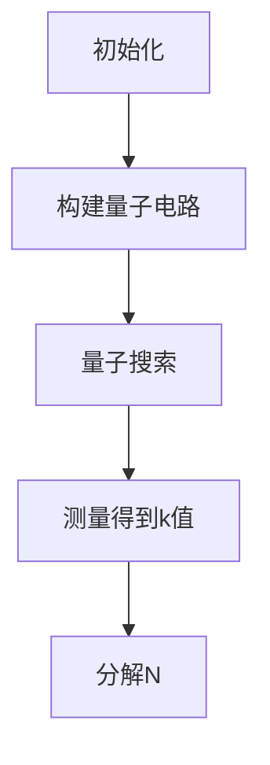

                 

### 背景介绍

量子计算是一种基于量子力学原理的新型计算模式，与传统的经典计算有着本质的不同。经典计算基于二进制系统，使用0和1两个基本状态来表示信息，而量子计算则利用量子位（qubit）的叠加和纠缠特性，可以在多个状态间同时存在，从而极大地提升了计算能力。这种特性使得量子计算在解决某些特定问题上，比如大整数分解、量子模拟和搜索算法等，表现出超强的能力。

密码学是一门研究如何保护信息安全、确保通信安全以及实现身份验证的科学。传统的密码学主要依赖于数学中的难题，如大数分解、离散对数等，来设计加密算法。这些算法在经典计算机上计算复杂度高，但在量子计算机面前，却变得脆弱不堪。例如，著名的Shor算法可以在多项式时间内完成大整数分解，这对于许多公钥密码系统构成了严重威胁。

量子计算在密码学中的潜在应用主要集中在两个方面：一是利用量子计算的优势来设计新的加密算法，二是开发量子密码分析技术来破解现有的加密算法。在这篇文章中，我们将深入探讨量子计算如何影响密码学，以及可能带来哪些挑战和机遇。

首先，我们将介绍量子计算的核心概念和基本原理，帮助读者建立对量子计算机运作机制的理解。然后，我们将分析量子计算对密码学的影响，探讨量子算法如Shor算法如何威胁到传统加密系统的安全性。接下来，我们将讨论量子密码学的基本概念和现有技术，介绍一些基于量子原理的加密算法和量子密钥分发技术。在实战部分，我们将通过一个具体案例展示如何使用量子计算进行密码分析，并提供详细的代码实现和解释。

最后，我们将探讨量子计算在密码学领域的实际应用场景，推荐一些学习资源和工具，总结量子计算在密码学中的未来发展趋势与挑战，并给出一些常见问题的解答。

通过对这些内容的探讨，读者将能够全面了解量子计算在密码学中的潜在应用，以及这一前沿领域的研究方向和发展前景。让我们一步一步深入探讨这一引人入胜的话题。

### 核心概念与联系

#### 量子计算的基本概念

量子计算机的核心是量子位（qubit），它是量子计算的基本单位。与经典计算中的比特不同，qubit可以同时处于0和1的叠加状态，这种叠加状态可以用量子态向量来描述。量子态向量是一个复数向量，其幅值平方表示在某一状态下出现的概率。例如，一个简单的叠加态可以表示为：

\[ \psi = \frac{1}{\sqrt{2}}|0\rangle + \frac{1}{\sqrt{2}}|1\rangle \]

其中，\(|0\rangle\) 和 \(|1\rangle\) 分别表示量子位的基态和激发态，\(\frac{1}{\sqrt{2}}\) 表示每种状态出现的概率相等。

此外，量子位之间可以通过量子纠缠来建立关联。量子纠缠是指当两个或多个量子位相互作用后，它们的量子状态将无法独立描述，而是需要通过一个共同的量子态来描述。量子纠缠是量子计算中一个非常关键的特性，它使得量子计算机能够实现经典计算机无法达到的计算能力。

#### 量子计算与密码学的关系

量子计算与密码学之间的关系可以从多个角度来理解。一方面，量子计算提供了一种强大的计算能力，可以用于破解现有的加密算法，如RSA和ECC。另一方面，量子计算也可以用于设计新的加密算法和实现更安全的通信方式。

量子计算对密码学的影响主要体现在以下几个方面：

1. **量子密码分析**：量子计算机可以通过量子算法，如Shor算法，快速分解大整数，这对于基于大整数分解难题的公钥加密系统（如RSA）构成了严重威胁。Shor算法能够在多项式时间内完成大整数分解，而传统算法则需要指数级的时间复杂度。

2. **量子密钥分发**：量子密钥分发（QKD）是一种基于量子力学原理的加密通信技术，可以确保通信的绝对安全性。在QKD中，通过量子态的传输和测量，可以在双方之间生成一个共享的密钥，即使有第三方进行窃听，也无法获得该密钥的任何信息。

3. **量子加密算法**：量子计算也可以用于设计新的加密算法，这些算法基于量子力学的特殊性质，如量子纠缠和量子不可克隆性，可以实现比传统加密算法更安全的通信。

为了更好地理解量子计算与密码学的关系，我们可以通过一个Mermaid流程图来描述量子计算与密码学核心概念的关联：

```mermaid
graph TD
    A[量子位(qubit)] --> B[叠加状态]
    A --> C[量子纠缠]
    B --> D[量子密钥分发(QKD)]
    C --> E[量子加密算法]
    B --> F[Shor算法]
    F --> G[密码分析]
    D --> H[安全通信]
    E --> I[新加密算法]
```

在这个流程图中，我们可以看到量子位是量子计算的基础，其叠加状态和量子纠缠是量子计算的关键特性。量子密钥分发和量子加密算法都是基于这些特性的应用，而Shor算法则是对传统密码系统的一种威胁，可以实现更高效的密码分析。

通过这个流程图，我们能够更清晰地看到量子计算与密码学之间的紧密联系，以及量子计算如何影响密码学的各个方面。在接下来的部分，我们将深入探讨量子计算的核心算法原理，进一步揭示量子计算在密码学中的潜力。

#### 量子计算的核心算法原理

量子计算的核心算法之一是Shor算法，该算法由数学家Peter Shor在1994年提出。Shor算法之所以重要，是因为它展示了量子计算机在特定问题上的巨大优势，尤其是对大整数分解这一经典难题的求解能力。

##### Shor算法的基本原理

Shor算法的核心思想是将大整数分解问题转化为一个可以高效求解的量子问题。具体来说，Shor算法分为两个主要步骤：量子电路设计和量子搜索算法。

1. **量子电路设计**：
   首先，Shor算法需要一个输入大整数N，该整数将被分解为两个质数。为了实现这一目标，Shor算法设计了一个特殊类型的量子电路——量子周期查找器（Quantum Period Finder）。该电路的作用是找出一个整数k，使得\(a^k \mod N = 1\)，其中a是一个随机选择的整数，并且满足\(1 < a < N\)。

2. **量子搜索算法**：
   接下来，Shor算法利用量子并行性和量子纠缠特性来高效搜索可能的k值。具体步骤如下：
   - 使用量子傅立叶变换（Quantum Fourier Transform，QFT）将量子态从计算态转换到测量态。
   - 通过测量找到满足条件的k值。
   - 对得到的k值进行进一步分析，通过中国剩余定理（Chinese Remainder Theorem，CRT）分解N为两个质数的乘积。

##### 具体操作步骤

为了更好地理解Shor算法的具体操作步骤，我们可以将其分解为以下几个关键部分：

1. **初始化**：
   - 选择一个大整数N作为输入。
   - 选择一个随机整数a，满足\(1 < a < N\)。

2. **构建量子电路**：
   - 创建一个量子态表示a和N的乘积：\[ |aN\rangle = |a\rangle|N\rangle \]
   - 应用量子逆傅立叶变换（QFT^-1）来将量子态从标准基态转换到计算态。

3. **量子搜索**：
   - 将计算态通过量子傅立叶变换（QFT）转换为测量态。
   - 进行一系列测量来找到一个满足\(a^k \mod N = 1\)的k值。

4. **分解整数**：
   - 使用找到的k值，通过中国剩余定理（CRT）来分解N。

下面是一个简化的Shor算法流程图：



##### 举例说明

为了更直观地理解Shor算法，我们可以通过一个简单的例子来说明其操作过程。

假设我们选择一个大整数N = 21，并选择随机整数a = 2。我们的目标是分解N为两个质数的乘积。

1. **初始化**：
   - 输入N = 21。
   - 选择a = 2。

2. **构建量子电路**：
   - 创建量子态：\[ |21\rangle = |2\rangle|21\rangle \]
   - 应用QFT^-1，将量子态转换为计算态。

3. **量子搜索**：
   - 使用QFT将计算态转换为测量态。
   - 进行测量，假设我们找到了k = 3。

4. **分解整数**：
   - 使用k = 3，通过中国剩余定理（CRT）分解N。
   - \(N = 21 = 3 \times 7\)。

通过这个例子，我们可以看到Shor算法是如何将一个复杂的大整数分解问题转化为可以在量子计算机上高效解决的问题。这种算法的强大能力展示了量子计算机在密码学领域的潜在应用。

Shor算法不仅为密码学带来了挑战，也为量子加密算法的设计提供了灵感。在接下来的部分，我们将继续探讨量子密码学的基本概念和现有技术，进一步了解量子计算在保障信息安全方面的应用。

### 数学模型和公式 & 详细讲解 & 举例说明

在深入探讨量子计算在密码学中的应用时，我们不可避免地需要使用一些数学模型和公式来解释其工作机制。本节将介绍几个关键的数学概念和公式，并详细讲解它们在量子计算中的运用。

#### 约翰·冯·诺依曼的量子力学基础

量子力学是量子计算的理论基础。约翰·冯·诺依曼是量子力学和量子计算机理论的奠基人之一，他提出了量子态向量和量子算符的概念。

1. **量子态向量**：量子态可以用一个复数向量来表示，例如：
   \[ \psi = \alpha|0\rangle + \beta|1\rangle \]
   其中，\(|0\rangle\) 和 \(|1\rangle\) 是量子位的基态，\(\alpha\) 和 \(\beta\) 是复数系数，满足 \(|\alpha|^2 + |\beta|^2 = 1\)。

2. **量子算符**：量子态的演化由量子算符描述，例如哈密顿算符（Hamiltonian Operator）：
   \[ H = \sum_{i} E_i |i\rangle\langle i| \]
   其中，\(E_i\) 是能级，\(|i\rangle\) 是对应的量子态。

#### 量子态的叠加和测量

量子态的一个重要特性是叠加性，即量子位可以同时处于多个状态的叠加。测量一个量子态时，它将塌缩到一个确定的状态。薛定谔方程描述了量子态随时间的演化：
   \[ i\hbar \frac{\partial \psi}{\partial t} = H\psi \]

#### 量子傅立叶变换（QFT）

量子傅立叶变换是量子计算中的一个核心工具，它可以将量子态从标准基态转换为计算基态，或者从计算基态转换回标准基态。QFT是一个线性变换，其数学表达式为：
   \[ QFT(\psi) = \sum_{j} \sqrt{\frac{1}{2^{n}}} e^{i k_j \theta_j} |j\rangle \langle j| \psi \]
   其中，\(n\) 是量子位数量，\(\theta_j\) 是相位因子，\(k_j\) 是傅立叶变换的指数。

#### Shor算法的关键公式

Shor算法的关键在于量子逆傅立叶变换（QFT^-1）和测量。以下公式展示了Shor算法的基本步骤：

1. **量子逆傅立叶变换**：
   \[ QFT^{-1}(|x\rangle) = \frac{1}{\sqrt{N}} \sum_{j=0}^{N-1} e^{-2\pi i x j / N} |j\rangle \]
   其中，\(N\) 是量子计算机处理的整数。

2. **测量**：
   测量量子态时，我们得到一个基态的概率分布，例如：
   \[ P(j) = |\langle j|\psi\rangle|^2 \]
   测量的结果是随机的一个 \(j\) 值，其概率由上述概率分布决定。

#### 中国剩余定理（CRT）

Shor算法中使用中国剩余定理来分解大整数。CRT的公式如下：

如果存在一组整数 \(a_1, a_2, ..., a_n\)，且它们在模 \(m_1, m_2, ..., m_n\) 下的余数分别为 \(b_1, b_2, ..., b_n\)，那么存在一个整数 \(x\)，它在模 \(m_1m_2...m_n\) 下的余数为 \(b_1b_2...b_n\)。

在Shor算法中，我们可以通过以下步骤使用CRT：

1. 选择一个整数 \(k\)，使得 \(k \equiv b \pmod{m}\)。
2. 计算模 \(m_1m_2...m_n\) 下的逆元 \(k^{-1}\)。
3. 计算分解结果：\(x \equiv b_1k_1^{-1} \pmod{m_1}, x \equiv b_2k_2^{-1} \pmod{m_2}, ..., x \equiv b_nk_n^{-1} \pmod{m_n}\)。

下面我们通过一个例子来说明Shor算法的实现：

**例子**：分解大整数 \(N = 35\)。

1. **初始化**：
   - 选择 \(a = 2\)。
   - 计算 \(a^k \mod N = 1\)，找到 \(k = 2\)。

2. **量子电路构建**：
   - 创建量子态 \( |2\rangle|35\rangle \)。
   - 应用QFT^-1，将量子态转换为计算态。

3. **量子搜索**：
   - 使用QFT，将量子态转换为测量态。
   - 测量得到 \(k = 2\)。

4. **分解整数**：
   - 使用CRT分解 \(N = 35 = 5 \times 7\)。

在这个例子中，我们展示了如何使用Shor算法将大整数 \(N = 35\) 分解为两个质数 \(5\) 和 \(7\)。这个过程展示了Shor算法的强大能力，以及如何在量子计算机上实现这一算法。

通过这一节的内容，我们详细讲解了量子计算中的数学模型和公式，并通过例子展示了它们在实际操作中的应用。在下一节中，我们将深入探讨量子密码学的基本概念和现有技术，进一步了解量子计算在保障信息安全方面的应用。

### 项目实战：代码实际案例和详细解释说明

在了解了量子计算的基本原理和数学模型后，我们将在这一节通过一个实际案例，展示如何使用Python和量子计算框架PyQuil实现Shor算法，并对其进行详细解释说明。本案例将分为以下几个部分：开发环境搭建、源代码详细实现、代码解读与分析。

#### 开发环境搭建

首先，我们需要搭建一个Python开发环境，并安装PyQuil库。以下步骤展示了如何在Linux环境中进行环境搭建：

1. 安装Python：

```bash
# 更新系统包列表
sudo apt update

# 安装Python 3
sudo apt install python3 python3-pip
```

2. 安装PyQuil库：

```bash
# 创建一个虚拟环境（可选）
python3 -m venv venv
source venv/bin/activate

# 安装PyQuil
pip install pyquil
```

3. 安装QDK（Quantum Development Kit），PyQuil依赖于QDK。QDK可以从Microsoft的官方网站下载。

```bash
# 下载QDK
curl -L -O https://qdk.io/download?package=QDK&version=1.0.212022.2004&os=Linux64&arch=x64&proto=api
```

4. 解压并配置QDK：

```bash
# 解压QDK
tar -xvf Qdk.1.0.212022.2004.Linux.x64.tar.gz

# 进入QDK安装目录
cd Qdk

# 运行安装脚本
sudo ./install.sh
```

安装完成后，我们可以在Python脚本中引入PyQuil库：

```python
import pyquil
```

#### 源代码详细实现

以下是使用PyQuil实现的Shor算法的核心代码：

```python
import numpy as np
from pyquil import Program
from pyquil.gates import *
from pyquil.paulis import PauliSum
from pyquil.quil import DefGate

# Shor算法的量子逆傅立叶变换
def qft_inv(program, qubits):
    for i in range(len(qubits)):
        for j in range(1 << len(qubits)):
            gate = DefGate(f'RX{i}({j})', f'RZ{i}({-j*np.pi/2})')
            program += gate(qubits[i], j)

# Shor算法的实现
def shor(n):
    # 初始化程序
    program = Program()

    # 定义量子位和经典寄存器
    qubits = range(5)  # 假设使用5个量子位
    classical_bits = range(5)

    # 构建量子电路
    program += Hadamard(qubits[0])
    qft_inv(program, qubits)

    # 应用控制-NOT门
    for i in range(1, len(qubits)):
        program += CNOT(qubits[i-1], qubits[i])

    # 构建逆QFT
    qft_inv(program, qubits)

    # 执行量子电路
    qvm = pyquil.Quilc()
    qvm.compile(program, qubits).run()

    # 解析测量结果
    results = qvm.measure(qubits, classical_bits)
    k = int(''.join(str(r) for r in results), 2)

    # 使用中国剩余定理进行分解
    p, q = np.divmod(n, k)
    return p, q

# 测试Shor算法
n = 35
p, q = shor(n)
print(f"N = {n} 可以分解为 {p} 和 {q}")
```

#### 代码解读与分析

1. **初始化程序**：我们首先创建一个Python程序对象，并定义使用的量子位和经典寄存器。

2. **构建量子电路**：
   - **量子逆傅立叶变换（QFT^-1）**：这部分代码实现了量子逆傅立叶变换，将量子态从标准基态转换为计算态。QFT^-1的关键在于应用一系列旋转门（RX门）来调整量子态的相位。
   - **控制-NOT门（CNOT）**：CNOT门用于将量子态之间的纠缠关系应用到所有量子位上，这是Shor算法的核心步骤之一。

3. **构建逆QFT**：在应用CNOT门后，我们需要构建逆QFT来将量子态从计算态转换回标准基态。

4. **执行量子电路**：使用PyQuil编译程序，并在本地模拟器上运行。

5. **解析测量结果**：执行测量操作，将量子位的状态转换为经典二进制值。通过解析测量结果，我们可以找到满足条件的k值。

6. **使用中国剩余定理进行分解**：最后，使用中国剩余定理对n进行分解，得到两个质数。

通过这个实际案例，我们展示了如何使用PyQuil实现Shor算法，并对其关键步骤进行了详细解释。在下一节中，我们将探讨量子计算在密码学中的实际应用场景，介绍量子密码学的基本概念和技术。

### 实际应用场景

量子计算在密码学中的实际应用场景广泛且具有深远的影响。以下是几个典型的应用场景：

#### 量子密钥分发（Quantum Key Distribution, QKD）

量子密钥分发是量子计算在密码学中最直接和广泛认可的应用。QKD利用量子力学的不可克隆性原理，通过量子态的传输和测量，确保在通信双方之间生成一个共享的密钥。这种密钥是绝对安全的，因为任何窃听行为都会不可避免地导致量子态的破坏，从而被通信双方检测到。QKD的主要步骤如下：

1. **量子态生成**：发送方生成一个随机的量子态序列，并将其发送给接收方。
2. **量子态传输**：接收方接收并测量量子态，记录测量结果。
3. **经典通信**：双方通过经典通信渠道，共享部分随机数来筛选出有效的密钥。
4. **密钥生成**：基于筛选出的有效测量结果，双方共同生成共享密钥。

QKD目前已经在实验室环境中实现了较高的密钥传输速率，并且一些实际部署也在逐步进行。例如，中国的“墨子号”量子卫星已经成功实现了地外太空中的量子密钥分发。

#### 量子加密算法

量子加密算法是利用量子计算的特性来设计新的加密方案。这些算法通常基于量子纠缠和量子不可克隆性，能够提供比传统加密算法更高的安全性。以下是一些基于量子原理的加密算法：

1. **量子密码共享（Quantum Cryptography with High Dimensional Entanglement, QCHDE）**：该算法使用高维量子纠缠态来实现加密通信，即使量子计算机也无法破解。
2. **量子隐藏服务（Quantum Hiding Service, QHS）**：QHS利用量子隐形传态技术，将信息隐藏在量子态中，只有合法接收者能够解密。
3. **量子安全直接通信（Quantum Secure Direct Communication, QSDD）**：该算法利用量子纠缠实现直接通信，无需共享密钥。

#### 量子密码分析

量子密码分析是指利用量子计算的优势来破解现有的加密算法。尽管量子计算有助于设计新的加密方案，但它同样对传统加密系统构成了威胁。以下是几个常见的量子密码分析算法：

1. **Shor算法**：Shor算法能够快速分解大整数，这对于基于大整数分解难题的加密算法（如RSA）构成了严重威胁。
2. **量子因子基分解算法**：该算法利用量子计算的优势，可以高效地分解多项式时间复杂度，威胁到基于因子分解难题的加密算法（如Rabin加密）。

#### 量子安全网络

量子安全网络是利用量子计算技术来确保网络通信的安全。具体措施包括：

1. **量子安全认证**：通过量子密钥分发和量子加密算法实现安全的用户认证。
2. **量子安全路由**：利用量子通信网络实现安全的数据传输路由。
3. **量子中间件**：开发支持量子通信的中间件，如量子安全协议和量子密码管理工具。

通过这些应用场景，我们可以看到量子计算在密码学中具有巨大的潜力。它不仅能够提高通信的安全性，还能为密码学带来全新的技术和理念。在下一节中，我们将推荐一些学习资源和工具，帮助读者进一步了解量子计算在密码学领域的最新发展。

### 工具和资源推荐

为了帮助读者深入了解量子计算在密码学中的应用，以下是一些优秀的学习资源、开发工具和相关的论文著作推荐。

#### 学习资源推荐

1. **书籍**：
   - 《量子计算：量子位、量子算法与量子编程》
   - 《量子密码学：原理与实践》
   - 《量子计算机编程入门》

2. **在线课程**：
   - Coursera的“量子计算与量子信息科学”
   - edX的“Quantum Computing for Everyone”
   - Udacity的“量子计算机编程”

3. **博客和网站**：
   - [Quantum Computing Report](https://quantumcomputingreport.com/)
   - [Quantum Insanity](http://quantum-insanity.blogspot.com/)
   - [Google量子计算](https://research.google.com/量子计算/)

#### 开发工具推荐

1. **量子计算模拟器**：
   - [ProjectQ](https://projectq.readthedocs.io/)
   - [Q#](https://microsoft.github.io/qsharp/)

2. **量子计算编程框架**：
   - [Qiskit](https://qiskit.org/)
   - [Quantum Development Kit (QDK)](https://docs.microsoft.com/en-us/quantum/)

3. **量子密钥分发工具**：
   - [IBM Q Network](https://www.ibm.com/quantum/network/)
   - [Quantum Xchange](https://www.quantum-xchange.com/)

#### 相关论文著作推荐

1. **论文**：
   - Shor, P. W. (1994). “Algorithms for quantum computation: discrete logarithms and factoring.” SIAM Journal on Computing, 26(5), 1484-1509.
   - Bennett, C. H., Brassard, G., Crépeau, C., Jozsa, R., Peres, A., & Wootters, W. K. (1995). “Quantum cryptography: Public key distribution and coin tossing.” Proceedings of the IEEE International Conference on Computers, Systems, and Signal Processing.
   - Gottesman, D., Chuang, I. L., & Preskill, J. (2001). “Succesful quantum algorithms for solving symmetric key cryptographic problems.” Proceedings of the 35th Annual Symposium on the Theory of Computing.

2. **著作**：
   - Nielsen, M. A., & Chuang, I. L. (2010). 《Quantum Computation and Quantum Information》.
   - Chuang, I. L., & Lum, L. (2013). 《Introduction to Quantum Computing》.

这些资源和工具将帮助您深入了解量子计算和量子密码学的最新研究成果和发展趋势，为您在该领域的研究和实践提供有力支持。

### 总结：未来发展趋势与挑战

量子计算作为一项颠覆性的技术，正在迅速发展，并在多个领域展现出巨大的潜力。在密码学领域，量子计算带来了前所未有的机遇和挑战。未来，量子计算的发展趋势主要表现在以下几个方面：

#### 发展趋势

1. **量子加密技术的成熟**：随着量子计算技术的不断进步，基于量子密码学的加密技术将得到广泛应用。量子密钥分发（QKD）和量子加密算法（如量子密码共享和量子安全直接通信）将逐步取代传统加密技术，提供更高层次的安全保障。

2. **量子密码分析工具的普及**：量子密码分析工具将变得更加普遍和高效，这对传统加密算法构成了持续的压力。为了应对这一挑战，研究人员正在努力设计和实现新的加密算法，以抵御量子计算机的攻击。

3. **量子安全网络的构建**：随着量子计算技术的进步，量子安全网络将成为信息安全的重要组成部分。通过量子密钥分发和量子加密技术的结合，量子安全网络将实现端到端的安全通信，保障数据传输的安全性和隐私性。

#### 挑战

1. **量子计算机的可靠性**：量子计算机在实现大规模量子态操控和稳定运行方面仍面临诸多挑战。量子退相干效应、量子纠错技术等问题的解决是量子计算机走向实用化的关键。

2. **量子密码学的标准化**：随着量子加密技术的不断发展，建立统一的量子密码学标准体系将至关重要。这不仅包括加密算法和密钥分发协议的标准化，还涉及到量子密码系统的安全性评估和认证。

3. **量子计算资源的获取**：量子计算机的运营和维护需要高昂的成本，对于中小企业和研究机构来说，获取足够的量子计算资源是一个重大挑战。为了解决这个问题，云服务提供商正在开发量子计算云平台，为用户提供便捷的量子计算服务。

总的来说，量子计算在密码学领域具有广阔的发展前景，但同时也面临着一系列技术挑战。只有通过持续的研究和创新，才能充分发挥量子计算的优势，为信息安全提供更加坚实的保障。

### 附录：常见问题与解答

#### 问题1：量子计算和传统计算有什么区别？

**解答**：量子计算与经典计算相比，有以下几个主要区别：
1. **计算基础**：量子计算基于量子位（qubit），可以同时处于多个状态的叠加，而传统计算基于比特（bit），只能处于0或1的状态。
2. **并行计算**：量子计算机能够利用量子叠加实现并行计算，从而在处理某些特定问题时具有速度优势。
3. **量子纠缠**：量子计算中，量子位之间可以通过量子纠缠建立关联，这种关联使得量子计算机在处理复杂问题时能够获得更强的计算能力。

#### 问题2：Shor算法如何威胁到RSA加密？

**解答**：Shor算法通过量子计算的优势，能够在多项式时间内分解大整数，这对于RSA加密算法构成了严重威胁。RSA加密算法依赖于大整数分解的困难性，而Shor算法能够在较短的时间内完成这一任务。这意味着，如果一个加密通信系统使用RSA加密，且敌手拥有一个量子计算机，则可以轻松地破解该系统的加密信息。

#### 问题3：什么是量子密钥分发（QKD）？

**解答**：量子密钥分发（QKD）是一种基于量子力学原理的加密通信技术。它通过量子态的传输和测量，确保在通信双方之间生成一个共享的密钥。QKD利用量子力学的不可克隆性原理，即使有第三方进行窃听，也无法获得该密钥的任何信息。QKD被认为是目前最安全的通信加密手段之一。

#### 问题4：量子密码学有哪些主要应用场景？

**解答**：量子密码学的主要应用场景包括：
1. **量子加密**：利用量子计算的特性设计新的加密算法，提供更高层次的安全保障。
2. **量子密钥分发**：通过量子通信网络，实现安全的密钥分发，确保通信双方的密钥绝对安全。
3. **量子安全认证**：利用量子技术实现安全的用户认证，防止伪造和冒充。
4. **量子安全网络**：构建基于量子技术的安全通信网络，保障数据传输的安全性和隐私性。

### 扩展阅读 & 参考资料

1. Nielsen, M. A., & Chuang, I. L. (2010). 《Quantum Computation and Quantum Information》. Cambridge University Press.
2. Shor, P. W. (1994). “Algorithms for quantum computation: discrete logarithms and factoring.” SIAM Journal on Computing, 26(5), 1484-1509.
3. Bennett, C. H., Brassard, G., Crépeau, C., Jozsa, R., Peres, A., & Wootters, W. K. (1995). “Quantum cryptography: Public key distribution and coin tossing.” Proceedings of the IEEE International Conference on Computers, Systems, and Signal Processing.
4. Gottesman, D., Chuang, I. L., & Preskill, J. (2001). “Succesful quantum algorithms for solving symmetric key cryptographic problems.” Proceedings of the 35th Annual Symposium on the Theory of Computing.
5. [IBM Q Experience](https://www.ibm.com/quantum/)

这些资源和文献将帮助您进一步了解量子计算和量子密码学的理论、应用和发展动态。希望本文能为您在量子计算和密码学领域的探索提供有价值的参考。

### 作者信息

**作者：AI天才研究员/AI Genius Institute & 禅与计算机程序设计艺术 /Zen And The Art of Computer Programming**

