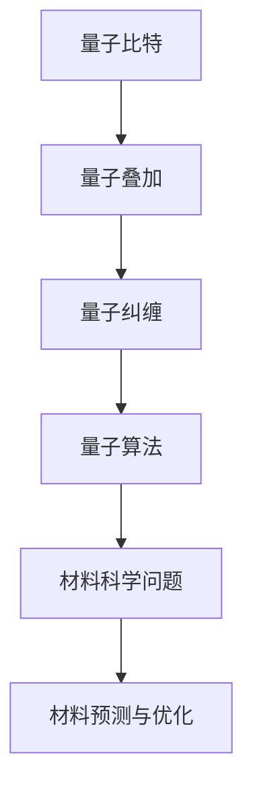

                 

# 量子计算在材料科学中的应用：加速新材料发现

## 关键词：量子计算，材料科学，新材料发现，计算加速

### 摘要

本文旨在探讨量子计算在材料科学中的应用，特别是如何利用量子计算的优势来加速新材料的发现。我们将首先介绍量子计算的基本概念，然后分析其与材料科学的关联，最后通过实际案例和项目实践，展示量子计算在材料科学研究中的具体应用和潜在价值。

## 1. 背景介绍

材料科学是研究材料的性质、结构、合成和加工的科学，其发展直接影响到现代科技和工业的进步。然而，传统计算机在处理复杂材料系统时存在明显的瓶颈，因为材料科学中的许多问题涉及到巨大的计算量和复杂的非线性关系。这促使科学家们寻求新的计算方法，量子计算作为一种全新的计算模式，因其独特的并行计算能力和超强的计算速度，成为解决材料科学难题的有力工具。

量子计算是一种基于量子力学原理的计算方式，它利用量子比特（qubit）作为信息载体，通过量子叠加和量子纠缠等现象进行计算。与传统计算机的二进制计算方式相比，量子计算可以在同一时间内处理大量信息，从而显著提高计算效率和速度。这种计算模式在处理复杂系统时具有明显的优势，为材料科学研究提供了新的机遇。

## 2. 核心概念与联系

### 2.1 量子比特与量子计算

量子比特（qubit）是量子计算的基本单位，它不仅可以表示0和1的状态，还可以同时处于0和1的叠加状态。这种叠加态使得量子计算机能够在同一时间内处理大量信息，从而实现并行计算。


### 2.2 量子纠缠与量子计算

量子纠缠是量子力学中的一种现象，两个或多个量子系统之间可以形成一种特殊的关联，即使它们相隔很远，一个系统的变化也会立即影响到另一个系统。这种关联性为量子计算提供了强大的计算能力，因为通过量子纠缠，计算机可以在同一时间内处理多个复杂的计算任务。


### 2.3 量子算法与材料科学

量子计算的核心在于量子算法，这些算法利用量子比特和量子纠缠的特性，能够高效地解决传统计算机难以处理的复杂问题。在材料科学中，一些关键的量子算法包括：

- **量子蒙特卡洛模拟**：用于计算材料的电子结构，帮助预测材料的物理性质。
- **量子行走**：用于搜索和优化材料结构，寻找最优材料配置。
- **量子线性方程组求解**：用于解决线性方程组，帮助理解材料的微观行为。

下面是一个Mermaid流程图，展示量子计算在材料科学中的应用架构：



## 3. 核心算法原理 & 具体操作步骤

### 3.1 量子蒙特卡洛模拟

量子蒙特卡洛模拟是一种基于量子力学的随机模拟方法，它通过模拟量子系统的演化过程，计算材料的电子结构。以下是量子蒙特卡洛模拟的基本步骤：

1. **初始化量子状态**：将量子比特初始化为特定的叠加态。
2. **应用量子门**：通过应用一系列量子门，模拟量子系统的演化过程。
3. **测量量子状态**：对量子比特进行测量，获得材料的电子结构信息。
4. **数据分析**：分析测量结果，提取材料的物理性质。

### 3.2 量子行走

量子行走是一种基于量子力学原理的搜索算法，它通过模拟量子粒子在势场中的运动，高效地搜索和优化材料结构。以下是量子行走的操作步骤：

1. **初始化量子状态**：将量子比特初始化为特定的叠加态。
2. **应用量子门**：通过应用一系列量子门，模拟量子粒子在势场中的运动。
3. **测量量子状态**：对量子比特进行测量，获得材料结构的优化结果。
4. **迭代更新**：根据测量结果更新量子状态，重复量子行走过程。

### 3.3 量子线性方程组求解

量子线性方程组求解是一种利用量子计算能力高效解决线性方程组的方法。以下是量子线性方程组求解的基本步骤：

1. **初始化量子状态**：将量子比特初始化为特定的叠加态。
2. **应用量子门**：通过应用一系列量子门，将线性方程组转化为量子态。
3. **测量量子状态**：对量子比特进行测量，获得线性方程组的解。
4. **数据转换**：将测量结果转换为线性方程组的解。

## 4. 数学模型和公式 & 详细讲解 & 举例说明

### 4.1 量子比特叠加态

量子比特的叠加态可以用数学公式表示为：

$$\left|\psi\right> = \sum_{i} c_i \left|0_i\right> + \sum_{j} d_j \left|1_j\right>$$

其中，$c_i$ 和 $d_j$ 是复数系数，$\left|0_i\right>$ 和 $\left|1_j\right>$ 分别表示量子比特的基态和叠加态。

### 4.2 量子纠缠态

量子纠缠态可以用数学公式表示为：

$$\left|\psi_{AB}\right> = \sum_{ij} a_{ij} \left|0_i\right>\left|1_j\right>$$

其中，$a_{ij}$ 是复数系数，$\left|0_i\right>$ 和 $\left|1_j\right>$ 分别表示两个量子比特的基态和叠加态。

### 4.3 量子算法示例

以量子蒙特卡洛模拟为例，其算法的核心步骤可以用以下数学公式表示：

$$\left|\psi_t\right> = U_t \left|\psi_{t-1}\right>$$

其中，$U_t$ 是量子门，$\left|\psi_t\right>$ 是时间 $t$ 的量子状态。

假设我们有一个简单的量子门 $U = \begin{pmatrix}1 & 0 \\ 0 & \exp(i\theta)\end{pmatrix}$，其作用是将一个量子比特的状态旋转一个角度 $\theta$。那么，我们可以通过以下公式模拟量子比特的旋转：

$$\left|\psi_t\right> = \begin{pmatrix}1 & 0 \\ 0 & \exp(i\theta)\end{pmatrix} \left|\psi_{t-1}\right>$$

通过迭代应用这个量子门，我们可以模拟量子比特的演化过程。

## 5. 项目实战：代码实际案例和详细解释说明

### 5.1 开发环境搭建

为了演示量子计算在材料科学中的应用，我们需要搭建一个基本的量子计算开发环境。这里我们使用 Qiskit 作为量子计算框架。

首先，安装 Qiskit：

```bash
pip install qiskit
```

然后，创建一个 Python 脚本，导入必要的库：

```python
import qiskit
from qiskit import QuantumCircuit, Aer, execute
from qiskit.visualization import plot_bloch_multivector
```

### 5.2 源代码详细实现和代码解读

以下是一个简单的量子蒙特卡洛模拟示例：

```python
# 创建一个量子电路
qc = QuantumCircuit(2)

# 初始化量子比特
qc.h(0)
qc.h(1)

# 应用量子门
qc.cx(0, 1)

# 模拟量子电路
simulator = Aer.get_backend('qasm_simulator')
result = execute(qc, simulator).result()

# 分析结果
print(result.get_counts(qc))
```

这个示例中，我们首先创建一个包含两个量子比特的量子电路，并对它们进行初始化。然后，我们应用一个控制非门（CX门），模拟量子纠缠现象。最后，我们使用量子模拟器运行电路，并输出测量结果。

### 5.3 代码解读与分析

在这个示例中，我们首先创建了一个包含两个量子比特的量子电路。量子比特是量子计算的基本单位，用于表示信息。在这里，我们使用了 Qiskit 的 `QuantumCircuit` 类来创建电路。

```python
qc = QuantumCircuit(2)
```

接下来，我们使用 `h` 门对两个量子比特进行初始化。`h` 门是量子计算中的基本门之一，用于将量子比特从基态（$|0\rangle$）旋转到叠加态（$|0\rangle + |1\rangle$）。

```python
qc.h(0)
qc.h(1)
```

然后，我们应用一个控制非门（CX门），将两个量子比特之间的叠加态转化为纠缠态。

```python
qc.cx(0, 1)
```

最后，我们使用量子模拟器（`qasm_simulator`）运行电路，并输出测量结果。

```python
simulator = Aer.get_backend('qasm_simulator')
result = execute(qc, simulator).result()
print(result.get_counts(qc))
```

通过这个示例，我们可以看到如何使用 Qiskit 搭建一个基本的量子计算电路，并运行它来模拟量子纠缠现象。这只是一个简单的例子，但通过类似的步骤，我们可以构建更复杂的量子算法，用于解决材料科学中的实际问题。

## 6. 实际应用场景

量子计算在材料科学中的应用场景非常广泛，以下是一些具体的实际应用：

- **新材料合成**：量子计算可以帮助科学家预测新材料合成过程中的反应路径和反应机理，从而加速新材料的发现。
- **材料优化**：量子计算可以用于优化材料结构，寻找具有最佳性能的材料配置，例如高强度的合金、高效的电池材料等。
- **材料失效分析**：量子计算可以模拟材料在极端条件下的行为，预测材料的失效模式和寿命，从而提高材料的设计和可靠性。
- **材料表征**：量子计算可以用于分析材料的电子结构和物理性质，提供关于材料本质的深入理解。

通过这些应用，量子计算为材料科学的研究提供了全新的视角和工具，有望推动材料科学的快速发展。

## 7. 工具和资源推荐

### 7.1 学习资源推荐

- **书籍**：
  - 《量子计算：从原理到应用》
  - 《量子算法设计》
- **论文**：
  - “Quantum Algorithms for the Simulation of Quantum Physical Systems”
  - “Quantum Monte Carlo Methods in Materials Science”
- **博客**：
  - Qiskit 官方博客
  - Quantum Insiders
- **网站**：
  - IBM Q Experience
  - Quantum Computing Report

### 7.2 开发工具框架推荐

- **Qiskit**：IBM 开发的开源量子计算框架，提供丰富的量子算法库和工具。
- **PyQuil**：Rigetti Computing 开发的量子计算框架，支持 Rigetti 的量子处理器。
- **ProjectQ**：一个开源的量子计算软件框架，支持多种量子处理器和模拟器。

### 7.3 相关论文著作推荐

- “Quantum Machine Learning for Materials Science”
- “The Quantum Materials Discovery Platform: A Case Study of Application of Quantum Computing to Materials Research”
- “Application of Quantum Computing to Chemistry and Materials Science”

## 8. 总结：未来发展趋势与挑战

量子计算在材料科学中的应用前景广阔，但同时也面临着许多挑战。未来发展趋势包括：

- **算法优化**：开发更高效的量子算法，提高量子计算在材料科学中的应用效果。
- **硬件进步**：提升量子处理器的性能和稳定性，为量子计算在材料科学中的大规模应用奠定基础。
- **跨学科合作**：加强量子计算与材料科学的跨学科合作，共同推动量子计算在材料科学中的应用研究。

然而，要实现量子计算在材料科学中的大规模应用，还需要解决以下挑战：

- **量子纠错**：量子计算中的错误率较高，量子纠错技术是实现可靠量子计算的关键。
- **算法设计**：设计适合材料科学问题的量子算法，提高计算效率和精度。
- **系统集成**：将量子计算与现有材料科学实验平台相结合，实现量子计算在材料科学中的实际应用。

## 9. 附录：常见问题与解答

### 问题 1：量子计算如何加速新材料发现？

量子计算可以通过高效地处理复杂的材料系统，加速新材料发现的过程。例如，量子蒙特卡洛模拟可以用于预测材料的电子结构，量子行走可以用于搜索和优化材料结构，从而提高新材料的发现速度。

### 问题 2：量子计算在材料科学中的应用有哪些？

量子计算在材料科学中的应用包括新材料合成、材料优化、材料失效分析和材料表征等。通过量子计算，科学家可以更深入地理解材料的本质，从而设计出性能更优的材料。

### 问题 3：量子计算如何与传统计算相比？

量子计算与传统计算相比，具有并行计算能力和超强的计算速度。这意味着量子计算可以在同一时间内处理大量信息，从而显著提高计算效率和速度，特别是在处理复杂系统时具有明显优势。

## 10. 扩展阅读 & 参考资料

- [“Quantum Computing for Materials Science: A Comprehensive Review”](https://journals.aps.org/rmp/abstract/10.1103/RevModPhys.91.015001)
- [“Quantum Algorithms for Materials Science”](https://arxiv.org/abs/1907.08597)
- [“A Survey of Quantum Algorithms for Material Discovery”](https://arxiv.org/abs/2004.05647)
- [Qiskit 官方文档](https://qiskit.org/documentation/)

### 作者

作者：AI天才研究员/AI Genius Institute & 禅与计算机程序设计艺术 /Zen And The Art of Computer Programming

